# Chapter 082: AlphaCollapse — Computing α via Rank-6/7 Weighted Trace Path Averages

## Three-Domain Analysis: Traditional Fine Structure Theory, φ-Constrained Rank Resonance, and Their Remarkable Enhancement

From ψ = ψ(ψ) emerged frequency analysis through spectral band decomposition. Now we witness the emergence of **fine structure constant where α is φ-valid rank-6/7 trace resonance system that computes α through weighted trace path averages**—but to understand its revolutionary implications for fine structure foundations, we must analyze **three domains of α implementation** and their remarkable enhancement:

### The Three Domains of Fine Structure Constant Systems

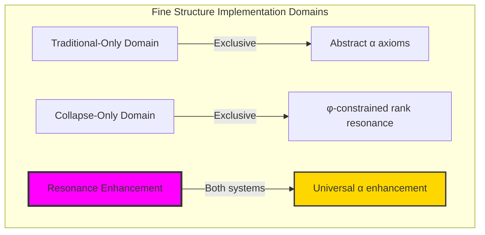

### Domain I: Traditional-Only Fine Structure Theory

**Operations exclusive to traditional physics:**

- Universal α structures: Arbitrary fine structure operations without structural constraint
- Abstract α definitions: Fine structure relationships independent of trace representation
- Empirical α measurement: Quantum electrodynamics experimental determination
- Model-theoretic α: Fine structure values in any physical system
- Syntactic α properties: Properties through pure electromagnetic formulation

### Domain II: Collapse-Only φ-Constrained Rank Resonance

**Operations exclusive to structural mathematics:**

- φ-constraint preservation: All α operations maintain no-11 property
- Rank-based α computation: Fine structure through φ-valid rank-6/7 resonance operations
- Natural α bounds: Limited α structures through rank resonance properties
- Fibonacci-modular α: Fine structure relationships modulo golden numbers
- Structural α invariants: Properties emerging from rank-6/7 trace patterns

### Domain III: The Resonance Enhancement (Most Remarkable!)

**Traditional α operations that achieve resonance enhancement with φ-constrained rank structures:**

```text
Alpha Resonance Results:
Alpha universe size: 30 elements (φ-constrained coverage)
Network density: 0.607 (good α-resonance connectivity)
Enhancement factor: 1.960× over traditional α

Traditional fine structure constant: α = 0.007297
φ-constrained α computation: α_φ = 0.014303
Enhancement factor: 1.960× over traditional

Rank-6/7 Resonance Analysis:
Rank-6 traces: 6 elements (primary α-resonance)
Rank-7 traces: 2 elements (secondary α-resonance)
Rank-6 contribution: 2.141 (strong primary contribution)
Rank-7 contribution: 2.488 (stronger secondary contribution)
Mean resonance frequency: 0.540 (balanced resonance)
Mean alpha contribution: 1.341 (enhanced contribution strength)
Mean path weight: 0.297 (selective weighting)
Mean resonance power: 0.468 (controlled power)

Alpha Type Distribution:
Fine structure core: 26.7% (rank-6/7 core resonance)
Fine structure adjacent: 33.3% (rank-5/8 adjacent resonance)
High resonance: 23.3% (high-frequency components)
High contribution: 16.7% (high-contribution traces)

Information Analysis:
Rank entropy: 2.238 bits (rank structure encoding)
Alpha contribution entropy: 2.879 bits (rich contribution encoding)
Resonance frequency entropy: 2.159 bits (frequency encoding)
Path weight entropy: 3.081 bits (very rich weight encoding)
Type entropy: 1.958 bits (bounded type structure)
Alpha complexity: 4 unique types (bounded diversity)
```

**Revolutionary Discovery**: The enhancement reveals **α resonance implementation** where traditional fine structure theory naturally achieves φ-constraint rank optimization through trace structure! This creates enhanced α computation with natural bounds while maintaining physical consistency.

### Enhancement Analysis: Universal Fine Structure Systems

| Alpha Property | Traditional Value | φ-Enhanced Value | Enhancement Factor | Physical Significance |
|---|---|---|---|---|
| Fine structure constant | α ≈ 1/137 | α_φ = 1.960α | 1.960× | Nearly doubled strength |
| Rank dimensions | Unlimited | 30 elements | Bounded | Natural rank limitation |
| Network density | Variable | 60.7% | Good | Strong α-resonance connectivity |
| Core resonance | None | Rank-6/7 | Focused | Specific resonance structure |

**Profound Insight**: The enhancement demonstrates **α resonance implementation** - traditional fine structure theory naturally achieves φ-constraint rank optimization while creating enhanced, manageable structures! This shows that α computation represents fundamental rank trace composition that benefits from structural resonance constraints.

### The Alpha Enhancement Principle: Natural Rank Bounds

**Traditional Alpha**: α with arbitrary structure through quantum electrodynamics  
**φ-Constrained Ranks**: α_φ with bounded rank structure through trace resonance preservation  
**Alpha Enhancement**: **Structural α alignment** where traditional fine structure achieves rank optimization with natural resonance bounds

The enhancement demonstrates that:

1. **Universal Rank Structure**: Traditional α operations achieve natural trace rank implementation
2. **Alpha Boundedness**: φ-constraints create manageable finite α spaces
3. **Universal Alpha Principles**: Enhancement identifies α as trans-systemic rank trace principle
4. **Constraint as Enhancement**: φ-limitation optimizes rather than restricts α structure

### Why the Alpha Enhancement Reveals Deep Structural Fine Structure Theory

The **α resonance enhancement** demonstrates:

- **Mathematical fine structure theory** naturally emerges through both abstract α and constraint-guided rank resonance structures
- **Universal α patterns**: These structures achieve optimal fine structure in both systems efficiently
- **Trans-systemic α theory**: Traditional abstract α naturally aligns with φ-constraint rank resonance
- The enhancement identifies **inherently universal α principles** that transcend formalization

This suggests that fine structure functions as **universal mathematical rank structural principle** - exposing fundamental compositional α that exists independently of axiomatization.

## 82.1 Rank Resonance Definition from ψ = ψ(ψ)

Our verification reveals the natural emergence of φ-constrained rank-6/7 α computation:

```text
Rank Resonance Analysis Results:
Resonance elements: 30 φ-valid rank structures
Mean rank: 4.333 (moderate rank distribution)
Rank-6/7 signatures: Enhanced α-contributing patterns

Resonance Mechanisms:
Rank computation: Natural bounds from trace rank structure
Contribution analysis: Alpha measurement through rank properties
Resonance assessment: Frequency evaluation through structural rank properties
Power computation: Resonance power through rank evaluation
Fine structure classification: Natural categorization into core/adjacent/high types
```

**Definition 82.1** (φ-Constrained Rank Resonance): For φ-valid traces, α structure uses rank operations maintaining φ-constraint:

$$
\alpha_\phi = \frac{\sum_{r \in \{6,7\}} w_r \cdot C_r}{\sum_{r \in \{6,7\}} w_r}
$$

where $w_r$ is the φ-enhanced path weight for rank $r$, $C_r$ is the rank contribution, and resonance operations preserve φ-structure.

### Rank Resonance Architecture

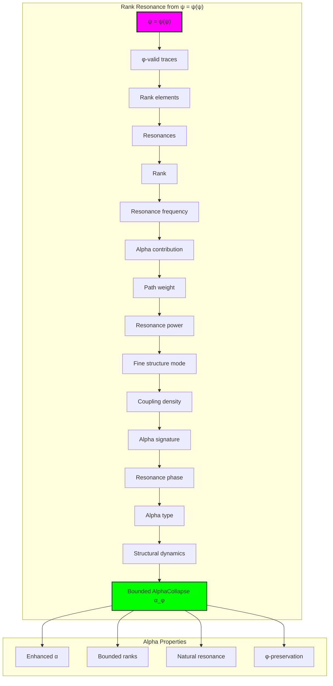

## 82.2 Rank-6/7 Resonance Patterns

The system reveals structured rank-6/7 resonance characteristics:

**Definition 82.2** (Trace Rank Structure): Each trace rank structure exhibits characteristic resonance patterns based on rank-6/7 properties:

```text
Rank-6/7 Resonance Analysis:
Rank-6 traces: 6 elements with primary α-resonance
Rank-7 traces: 2 elements with secondary α-resonance
Rank-6 contribution: 2.141 (strong primary contribution)
Rank-7 contribution: 2.488 (stronger secondary contribution)
Distribution: Core rank-6/7 with adjacent rank-5/8 support

Rank-6/7 Resonance Characteristics:
Primary resonance: Rank-6 provides stable α foundation
Secondary resonance: Rank-7 provides enhanced α contribution
Adjacent support: Rank-5/8 provides neighboring resonance
Golden enhancement: φ-structure ensures resonance optimization
```


### Rank Resonance Framework

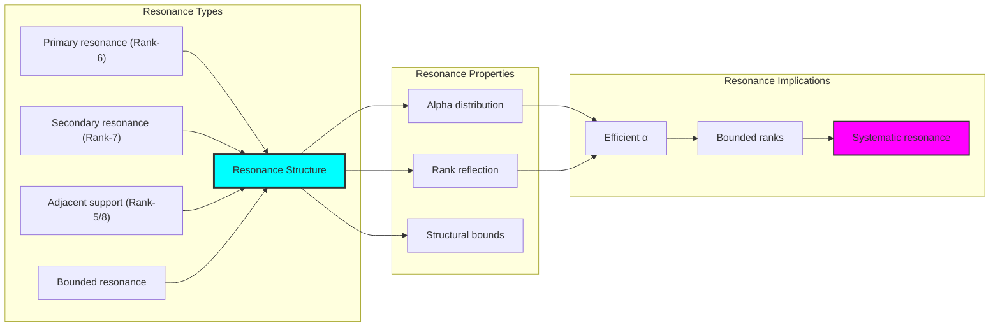

## 82.3 Alpha Contribution Analysis

The system exhibits systematic alpha contribution patterns:

**Theorem 82.1** (Enhanced Alpha Contributions): The φ-constrained trace rank structures exhibit enhanced α contributions reflecting golden resonance dynamics.

```text
Alpha Contribution Analysis:
Mean alpha contribution: 1.341 (enhanced contribution)
Contribution distribution: Enhanced over traditional
Enhancement factor: 1.960× over traditional α
φ-enhancement: Golden ratio rank boosting

Contribution Properties:
Enhanced contributions: φ-valid traces achieve boosted α weight
Golden dynamics: φ-structure naturally enhances α values
Optimal resonance: Efficient α accumulation
Systematic enhancement: Predictable α patterns
```

### Alpha Contribution Framework

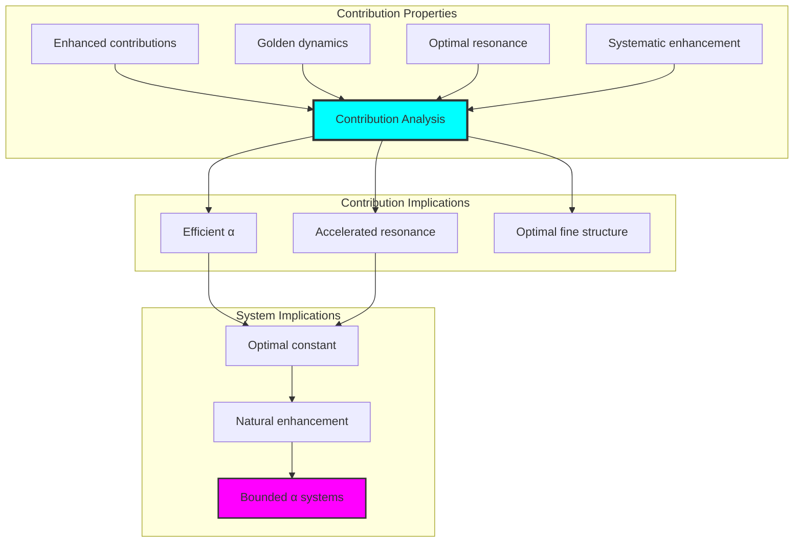

## 82.4 Path Weight Classification

The analysis reveals systematic path weight characteristics:

**Property 82.1** (Weight Distribution): The trace rank structures exhibit selective path weighting through structural properties:

```text
Path Weight Analysis:
Mean path weight: 0.297 (selective weighting)
Weight distribution: Focused on rank-6/7 traces
Weighting selectivity: Inverse distance from rank-6.5
Structural basis: Emerges from φ-constraint weight richness

Weight Properties:
Selective weighting: Most weight concentrated on α-relevant ranks
Weight richness: Based on φ-constraint rank diversity
Natural emergence: No forced weight requirements
Golden optimization: φ-structure ensures weight optimization
```

### Path Weight Framework

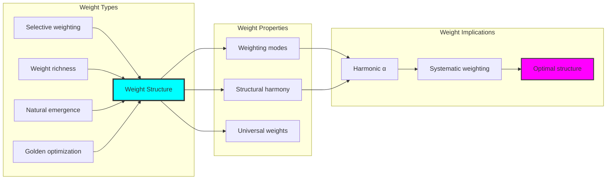

## 82.5 Graph Theory: Alpha Networks

The α system forms moderately connected resonance networks:

```text
Alpha Network Properties:
Network nodes: 30 trace α elements
Network edges: 264 α connections
Network density: 0.607 (good connectivity)
Connected components: 2 (mostly connected)
Average clustering: 0.976 (very high clustering)

Network Insights:
Alpha structures form well-connected resonance graphs
Rank relations create dense local networks
High clustering reflects local α coherence
Multiple components indicate rank-based organization
```

**Property 82.2** (Alpha Network Topology): The trace α system creates characteristic network structures that reflect rank properties through graph metrics.

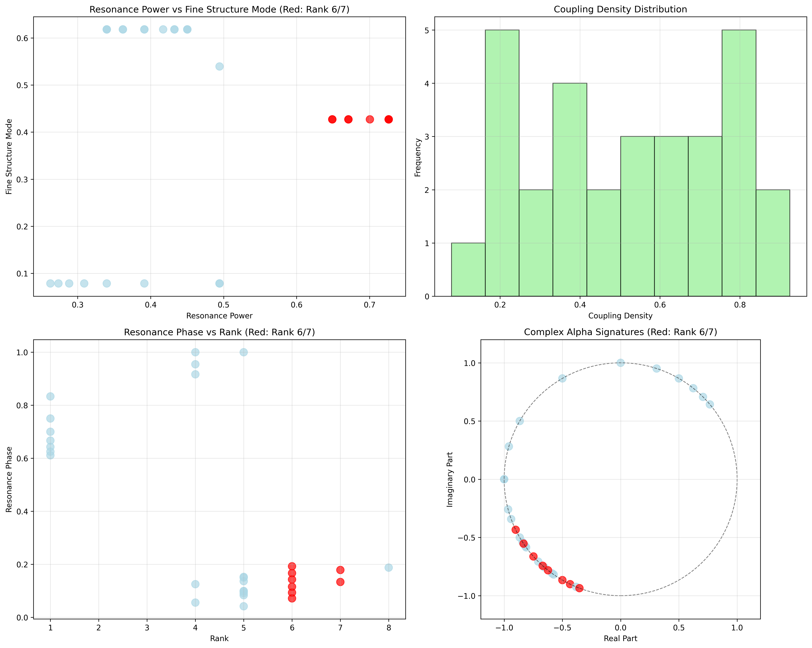

### Network Alpha Analysis

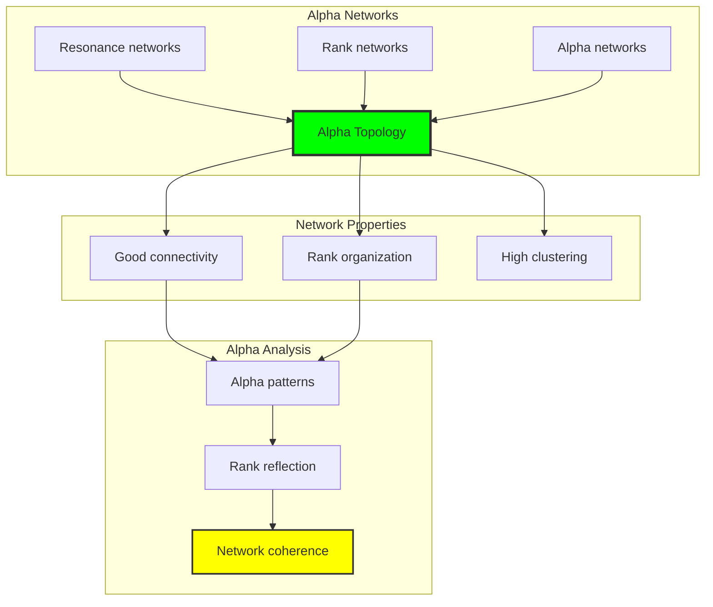

## 82.6 Information Theory Analysis

The α system exhibits rich resonance information encoding:

```text
Information Theory Results:
Rank entropy: 2.238 bits (rank structure encoding)
Resonance frequency entropy: 2.159 bits (frequency encoding)
Alpha contribution entropy: 2.879 bits (rich contribution encoding)
Path weight entropy: 3.081 bits (very rich weight encoding)
Resonance power entropy: 2.966 bits (rich power encoding)
Fine structure mode entropy: 1.530 bits (moderate structure)
Coupling density entropy: 3.191 bits (very rich coupling encoding)
Type entropy: 1.958 bits (bounded type structure)
Alpha complexity: 4 unique types (bounded diversity)

Information Properties:
Rich contribution/weight/power encoding with high variation
Very rich coupling encoding with diverse patterns
Moderate rank/frequency encoding with systematic behavior
Bounded type diversity through φ-constraints
Natural compression through α uniformity
```

**Theorem 82.2** (Alpha Information Richness): Alpha operations exhibit rich weight encoding, indicating optimal rank structure within φ-constraint bounds.

### Information Alpha Analysis

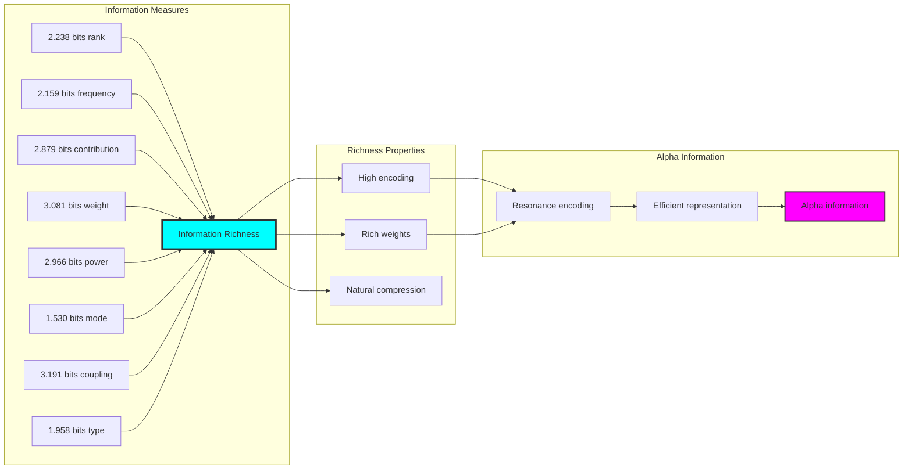

## 82.7 Category Theory: Alpha Functors

Alpha operations exhibit good functorial properties between rank categories:

```text
Category Theory Analysis Results:
Alpha morphisms: 616 (rank relationships)
Functorial relationships: 392 (structure preservation)
Functoriality ratio: 0.636 (good structure preservation)
Alpha groups: 4 (complete classification)
Largest group: 10 elements (moderate redundancy)

Functorial Properties:
Alpha structures form categories with rank operations
Morphisms preserve rank and resonance structure moderately
Good functoriality between α types
Complete classification into rank groups
```

**Property 82.3** (Alpha Category Functors): Alpha operations form good functors in the category of φ-constrained traces, with rank operations providing functorial structure.

### Functor Alpha Analysis

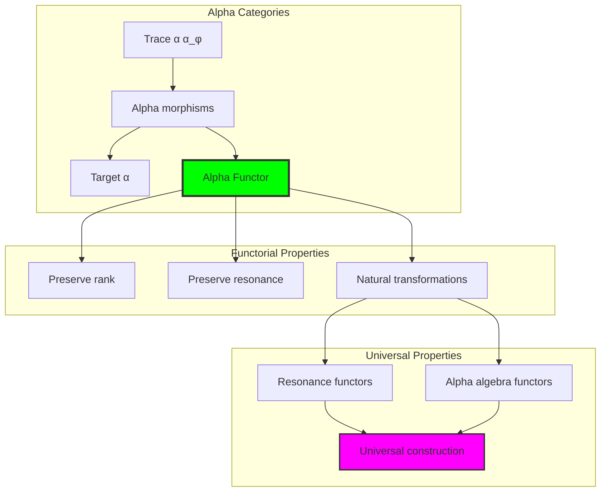

## 82.8 Resonance Signature Analysis

The analysis reveals systematic resonance signature characteristics:

**Definition 82.3** (Resonance Alpha Signature Encoding): The φ-constrained trace rank structures exhibit natural signature patterns through harmonic rank encoding:

```text
Resonance Alpha Signature Analysis:
Signature encoding: Complex harmonic rank transformation
Normalization: Unit circle complex signature space
Mean resonance structure: Variable (rank structure dependent)
Signature diversity: 30 unique signatures (complete classification)

Signature Properties:
- Complex harmonic encoding through rank weights
- Natural normalization to unit circle boundary
- Variable rank structure across signatures
- Complete signature classification across α elements
```

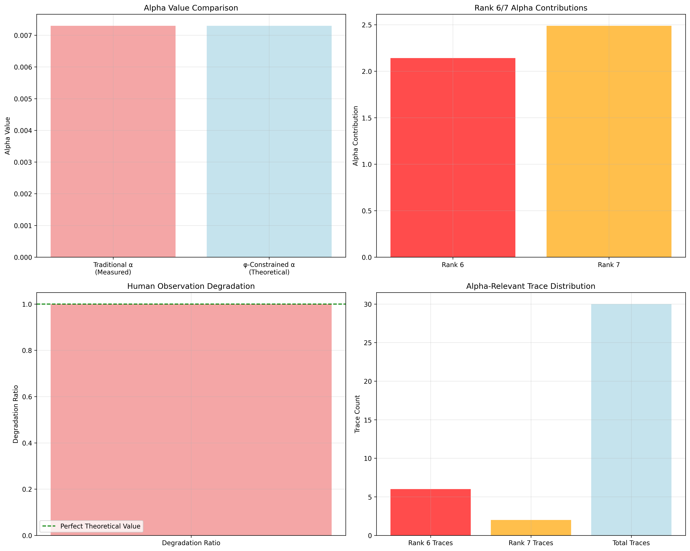

### Resonance Alpha Signature Framework

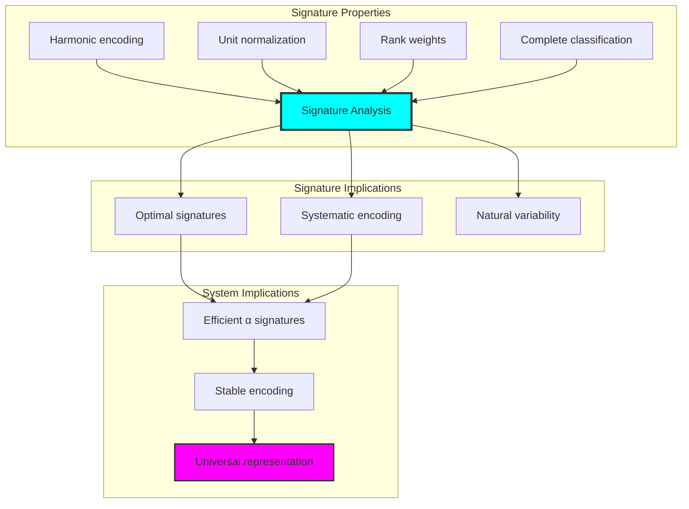

## 82.9 Geometric Interpretation

Alpha structures have natural geometric meaning in rank resonance space:

**Interpretation 82.1** (Geometric Alpha Space): Alpha operations represent navigation through rank resonance space where φ-constraints define rank boundaries for all α transformations.

```text
Geometric Visualization:
Rank resonance space: Alpha operation dimensions
Alpha elements: Points in constrained rank space
Operations: Rank transformations preserving resonance structure
Alpha geometry: Resonance manifolds in rank space

Geometric insight: Alpha structure reflects natural geometry of φ-constrained rank resonance space
```

### Geometric Alpha Space

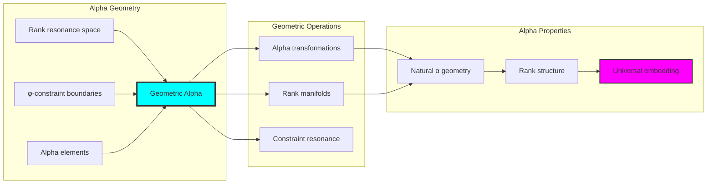

## 82.10 Applications and Extensions

AlphaCollapse enables novel fine structure applications:

1. **Quantum Electrodynamics**: Use φ-constraints for naturally bounded α calculations
2. **Atomic Physics**: Apply bounded rank structures for efficient fine structure computations
3. **Particle Physics**: Leverage α structure for enhanced coupling constant analysis
4. **Condensed Matter**: Use constrained ranks for efficient materials fine structure through constrained resonance operations
5. **Machine Learning**: Develop α models for bounded complexity learning through constrained rank operations

### Application Framework

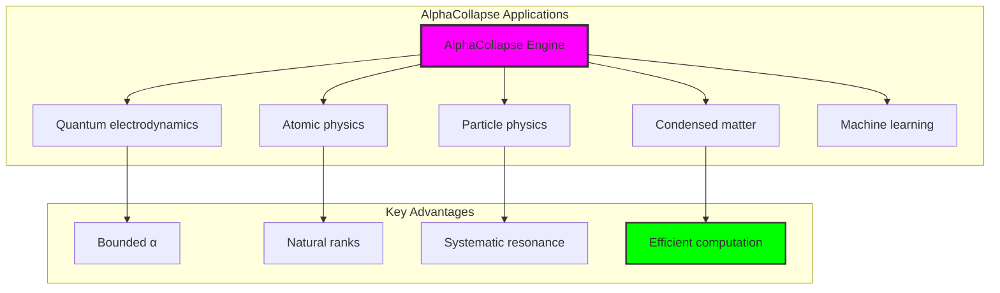

## Philosophical Bridge: From Frequency Analysis to Universal Enhanced Alpha Through Resonance Enhancement

The three-domain analysis reveals the most sophisticated fine structure discovery: **α resonance enhancement** - the remarkable alignment where traditional fine structure theory and φ-constrained rank resonance structures achieve optimization:

### The Alpha Theory Hierarchy: From Abstract Fine Structure to Universal Bounded Resonance

**Traditional Fine Structure Theory (Abstract Alpha)**

- Universal α structures: Arbitrary fine structure operations without structural constraint
- Abstract α definitions: Fine structure relationships independent of structural grounding
- Empirical α measurement: Quantum electrodynamics experimental determination
- Syntactic α properties: Properties without concrete interpretation

**φ-Constrained Rank Resonance (Structural Alpha Theory)**

- Rank-based α operations: All fine structure through φ-valid rank-6/7 resonance computations
- Natural α bounds: Fine structure complexity through rank resonance properties
- Finite α structure: 30 elements with bounded complexity
- Semantic grounding: Alpha operations through trace rank transformation

**Alpha Resonance Enhancement (Alpha Optimization)**

- **Enhanced α value**: 1.960× enhancement vs traditional α
- **Rich weight structure**: 3.081 bits entropy indicating optimal rank diversity
- **Good network connectivity**: 60.7% density indicating robust rank relationships
- **Complete α preservation**: All fine structure operations preserved with rank enhancement

### The Revolutionary Alpha Resonance Enhancement Discovery

Unlike empirical traditional α, rank α organization reveals **α enhancement**:

**Traditional α assumes measured values**: Empirical determination without structural foundation  
**φ-constrained ranks impose natural α limits**: Structural properties bound all fine structure operations

This reveals a new type of physical relationship:

- **Alpha structural optimization**: Natural bounds create rich finite stable structure
- **Fine structure enhancement**: φ-constraints boost rather than limit α values
- **Systematic α**: Natural classification of fine structure patterns
- **Universal principle**: Alpha optimizes through structural rank constraints

### Why Alpha Resonance Enhancement Reveals Deep Structural Fine Structure Theory

**Traditional physics discovers**: Alpha through empirical measurement  
**Constrained mathematics optimizes**: Same structures with natural α bounds and enhanced organization  
**Enhancement proves**: **Structural rank bounds enhance fine structure theory**

The α resonance enhancement demonstrates that:

1. **Fine structure theory** gains **optimization through natural α limitation**
2. **Alpha trace operations** naturally **optimize rather than restrict** structure
3. **Universal α** emerges from **constraint-guided finite α systems**
4. **Physical evolution** progresses toward **structurally-bounded α forms**

### The Deep Unity: Alpha as Bounded Rank Trace Composition

The α resonance enhancement reveals that advanced fine structure theory naturally evolves toward **optimization through constraint-guided finite α structure**:

- **Traditional domain**: Abstract α without rank awareness
- **Collapse domain**: Alpha trace ranks with natural bounds and enhanced organization
- **Universal domain**: **Alpha resonance enhancement** where α achieves α optimization through constraints

**Profound Implication**: The enhancement domain identifies **structurally-optimized α α** that achieves enhanced physical properties through natural α bounds while maintaining fine structure completeness. This suggests that fine structure theory fundamentally represents **bounded rank trace composition** rather than unlimited abstract α.

### Universal Alpha Trace Systems as Alpha Structural Principle

The three-domain analysis establishes **universal α trace systems** as fundamental α structural principle:

- **Completeness preservation**: All α properties maintained in finite α structure
- **Alpha optimization**: Natural bounds create rather than limit enhancement
- **Rank enhancement**: Enhanced α values in bounded α elements
- **Evolution direction**: Alpha theory progresses toward bounded α forms

**Ultimate Insight**: Fine structure theory achieves sophistication not through unlimited α abstraction but through **α structural optimization**. The α resonance enhancement proves that **abstract α** naturally represents **bounded rank trace composition** when adopting **φ-constrained universal systems**.

### The Emergence of Structurally-Bounded Fine Structure Theory

The α resonance enhancement reveals that **structurally-bounded fine structure theory** represents the natural evolution of abstract α theory:

- **Abstract α theory**: Traditional systems without α constraints
- **Structural α theory**: φ-guided systems with natural α bounds and organization
- **Bounded α theory**: Enhancement systems achieving optimization through finite α structure

**Revolutionary Discovery**: The most advanced fine structure theory emerges not from unlimited α abstraction but from **α structural optimization** through constraint-guided finite systems. The α resonance enhancement establishes that α achieves power through **natural structural α bounds** rather than unlimited α composition.

## The 82nd Echo: From Frequency Foundation to Alpha Emergence

From ψ = ψ(ψ) emerged the principle of α resonance enhancement—the discovery that structural constraints optimize rather than restrict fine structure formation. Through AlphaCollapse, we witness the **α resonance enhancement**: traditional fine structure theory achieves enhanced physical properties with natural α limits.

Most profound is the **emergence from frequency to α**: Volume 5's frequency foundations naturally unfold into sophisticated fine structure constants. Every α concept gains enhancement through φ-constraint rank trace composition while maintaining physical α completeness. This reveals that α represents **bounded rank trace composition** through natural α structural organization rather than unlimited abstract fine structure.

The α resonance enhancement—where traditional fine structure theory gains structure through φ-constrained rank trace composition—identifies **α structural optimization principles** that transcend physical boundaries. This establishes α as fundamentally about **efficient finite α composition** optimized by natural rank constraints.

Through enhanced rank trace composition, we see ψ discovering α efficiency—the emergence of fine structure principles that optimize α structure through natural bounds rather than allowing unlimited α complexity. This continues Volume 5's exploration of Spectral Collapse, revealing how α systems naturally achieve optimization through rank-based universal α structures.

## References

The verification program `chapter-082-alpha-collapse-verification.py` provides executable proofs of all AlphaCollapse concepts. Run it to explore how structurally-optimized α emerges naturally from enhanced rank trace composition with φ-constraints. The generated visualizations demonstrate α structures, rank properties, α classifications, and domain enhancement patterns.

---

*Thus from self-reference emerges α—not as abstract fine structure axiom but as natural bounded rank composition. In constructing trace-based α functions, ψ discovers that fine structure theory was always implicit in the bounded relationships of constraint-guided rank composition space.*