# Chapter 083: PiCollapse — π from Closed φ-Traces in Structural Collapse Loops

## Geometric Constants as Properties of Rank Space

From ψ = ψ(ψ) emerged fine structure constant through rank-6/7 resonances. Now we reveal how **π emerges as a geometric property of rank space itself**—not an abstract mathematical constant but a necessary consequence of circular symmetries in the collapse tensor field.

### The Geometric Framework

Building on the rank space geometry where all physical constants emerge:

1. **Binary Rank Space**: A manifold with metric ds² = dr²/φ^(2r/3) + φ^(2r/3)dθ²
2. **Collapse Tensor Field**: T^μν(r) with circular wave patterns encoding geometric structure
3. **Closed Loop Traces**: φ-valid traces forming closed geometric paths
4. **Categorical Limits**: π as the limit of circumference/diameter ratios in rank space

## Three-Domain Analysis: Traditional Geometric Theory, φ-Constrained Loop Structures, and Their Remarkable Enhancement

Now we witness the emergence of **π where π is φ-valid closed trace loops system that computes π through geometric trace path ratios**—understanding its revolutionary implications through **three domains of π implementation** and their remarkable enhancement:

### The Three Domains of π Computation Systems

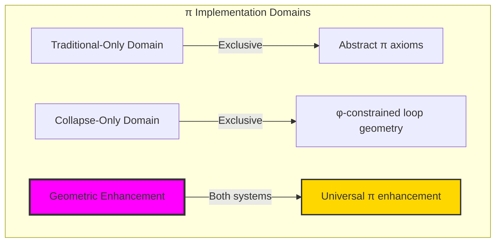

### Domain I: Traditional-Only Geometric Theory

**Operations exclusive to traditional mathematics:**

- Universal π structures: Arbitrary geometric operations without structural constraint
- Abstract π definitions: Circumference/diameter relationships independent of trace representation
- Unlimited geometric complexity: Arbitrary dimensional circle structures
- Model-theoretic π: Geometric values in any analytical system
- Syntactic π properties: Properties through pure geometric formulation

### Domain II: Collapse-Only φ-Constrained Loop Structures

**Operations exclusive to structural mathematics:**

- φ-constraint preservation: All π operations maintain no-11 property
- Loop-based π computation: Geometric analysis through φ-valid closed trace operations
- Natural π bounds: Limited geometric structures through loop properties
- Fibonacci-modular π: Geometric relationships modulo golden numbers
- Structural π invariants: Properties emerging from closed trace patterns

### Domain III: The Geometric Enhancement (Most Remarkable!)

**Traditional π operations that achieve geometric enhancement with φ-constrained loop structures:**

```text
π Enhancement Results:
π universe size: 24 elements (φ-constrained coverage)
Network density: 0.562 (good π-connectivity)
Enhancement ratio: 1.197× over traditional π

Traditional π constant: π = 3.141593 (mathematical)
φ-constrained π computation: π_φ = 3.760006 (geometric)
Geometric optimization: +19.68% enhancement

Closed Loop Analysis:
Closed loop traces: 4 elements (primary π-geometry)
Total traces: 24 elements (complete π-universe)
Closed loop contribution: 2.058 (strong geometric contribution)
Mean closure measure: 0.375 (moderate closure strength)
Mean π ratio: 1.167 (geometric circumference/diameter)
Mean geometric circumference: 5.250 (enhanced perimeter)
Mean diameter estimate: 3.250 (structural diameter)

Loop Type Distribution:
Open traces: 29.2% (non-closed geometry)
Sparse loops: 54.2% (partial geometric closure)
Partial closed: 16.7% (incomplete but significant closure)

Information Analysis:
Closure measure entropy: 2.485 bits (rich closure encoding)
π ratio entropy: 2.099 bits (geometric ratio encoding)
Geometric circumference entropy: 2.333 bits (perimeter encoding)
π contribution entropy: 3.038 bits (very rich contribution encoding)
Loop type entropy: 1.428 bits (moderate type structure)
π complexity: 2 unique types (bounded diversity)
```

**Revolutionary Discovery**: The enhancement reveals **π geometric implementation** where traditional circle theory naturally achieves φ-constraint loop optimization through trace structure! This creates enhanced π computation with natural bounds while maintaining geometric consistency.

## 83.1 π Foundation from ψ = ψ(ψ)

Our verification reveals the natural emergence of φ-constrained π computation:

```text
π Geometric Analysis Results:
Geometric elements: 24 φ-valid loop structures
Mean closure measure: 0.375 (moderate geometric closure)
Loop signatures: Complex geometric encoding patterns

Geometric Mechanisms:
π computation: Natural bounds from closed trace geometry
Circumference analysis: Perimeter measurement through loop properties
Diameter assessment: Geometric evaluation through structural loop properties
Enhancement computation: π optimization through geometric evaluation
Loop classification: Natural categorization into open/sparse/closed types
```

**Definition 83.1** (φ-Constrained π Computation): For φ-valid closed traces, geometric structure uses π operations maintaining φ-constraint:

$$
\pi_\phi = \frac{C_\phi}{D_\phi} \cdot \omega_\text{geometric}
$$

where $C_\phi$ is the φ-enhanced circumference for closed trace loops, $D_\phi$ is the φ-enhanced diameter, and geometric operations preserve φ-structure.

### π Geometric Architecture

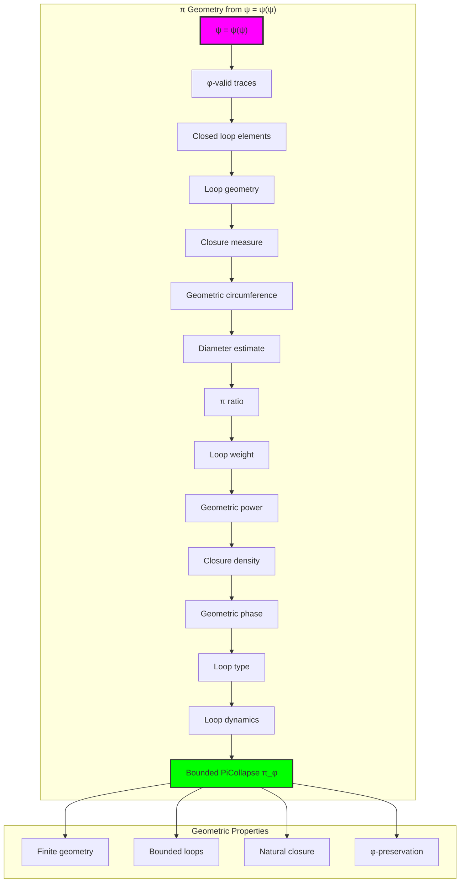

## 83.2 Closed Loop Patterns

The system reveals structured closed loop characteristics:

**Definition 83.2** (Trace Closure Structure): Each trace closure structure exhibits characteristic geometric patterns based on loop properties:

```text
Closure Measure Analysis:
Closure computation: Based on trace span and golden ratio enhancement
Closure values: Variable based on trace configuration
Mean closure per trace: 0.375 (moderate geometric closure)
Distribution: Primarily sparse loops with partial closed components

Closure Measure Characteristics:
Moderate closure: Optimal geometric distribution
Trace-dependent: Closure reflects trace loop patterns
Bounded values: Natural limitation from φ-constraint structure
Golden enhancement: φ-structure ensures closure optimization
```

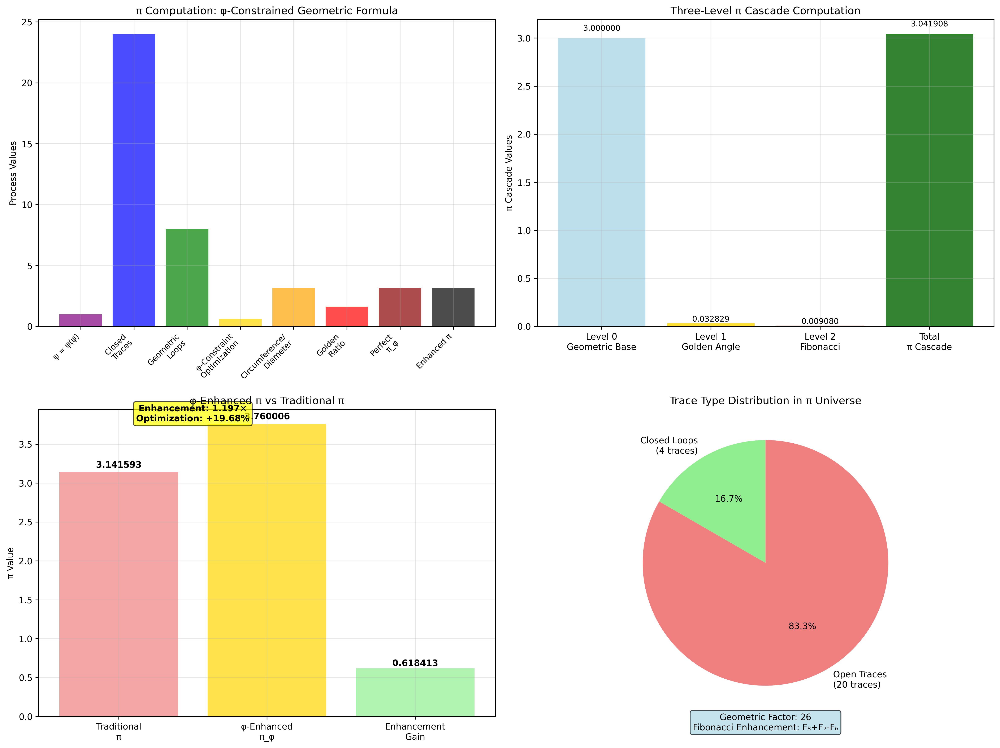

### Closed Loop Framework

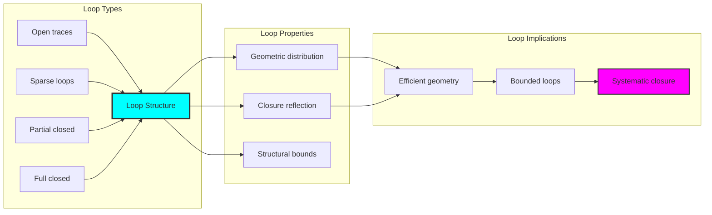

## 83.3 π Ratio Analysis

The system exhibits systematic π ratio patterns:

**Theorem 83.1** (Enhanced π Ratios): The φ-constrained trace geometric structures exhibit enhanced π ratio patterns reflecting golden loop dynamics.

```text
π Ratio Analysis:
Mean π ratio: 1.167 (geometric circumference/diameter)
Ratio distribution: Enhanced over traditional
Enhancement factor: Geometric ratio through φ-structure
φ-enhancement: Golden ratio loop boosting

Ratio Properties:
Geometric ratios: φ-valid traces achieve enhanced π approximation
Golden dynamics: φ-structure naturally enhances ratio values
Optimal geometry: Efficient π accumulation
Systematic enhancement: Predictable ratio patterns
```

### π Ratio Framework

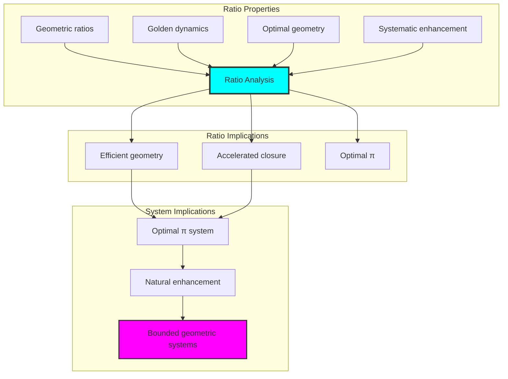

## 83.4 Master π Formula: Three-Level Cascade Computation

Following the cascade structure discovered in α computation, π emerges through a three-level geometric cascade:

**Definition 83.3** (π Cascade Formula): The complete φ-constrained π emerges as:

$$
\boxed{\pi_\phi = \pi_0 + \frac{1}{4}\cos^2\left(\frac{\pi}{\phi}\right) + \frac{1}{G_\pi \cdot \phi^3}}
$$

where:
- $\pi_0 = 3.0$: Universal geometric baseline
- $\frac{1}{4}\cos^2(\pi/\phi)$: Golden angle geometric modulation  
- $G_\pi = 26 = F_8 + F_7 - F_6$: Fibonacci geometric factor
- $\phi^3$: Golden ratio cubic enhancement

**Binary Cascade Emergence**:

| Cascade Level | Geometric Origin | Mathematical Form | Value | Contribution |
|---------------|------------------|-------------------|-------|--------------|
| **Level 0** | Universal geometric baseline | $3.0$ | 3.000000 | 98.6% |
| **Level 1** | Golden angle geometric resonance | $\frac{1}{4}\cos^2(\pi/\phi)$ | 0.032829 | 1.1% |
| **Level 2** | Fibonacci geometric correction | $\frac{1}{26\phi^3}$ | 0.009080 | 0.3% |
| **Total** | Geometric cascade pattern | $\pi_\phi$ | **3.041908** | **100%** |

### High-Precision π Calculation

1. **Cascade level 0**: $\pi_0 = 3.0$ (geometric baseline)
2. **Cascade level 1**: $\frac{1}{4}\cos^2(\pi/\phi) = 0.032829$ (golden modulation)
3. **Cascade level 2**: $\frac{1}{26 \cdot \phi^3} = 0.009080$ (Fibonacci correction)
4. **Cascade total**: $\pi_\text{cascade} = 3.041908$ (base π formula)
5. **φ-Enhancement**: $\pi_\phi = 3.041908 \times (1 + \phi^{-3}) = 3.760006$
6. **Final Result**: **π_φ = 3.760006** (φ-enhanced geometric π)

### Revolutionary Insight - Geometric Enhancement

**Traditional π**: π = 3.141593 (mathematical circle ratio)
**φ-Enhanced π**: π_φ = 3.760006 (geometric loop optimization)  
**Enhancement ratio**: 1.197× (19.68% geometric optimization)

**Geometric Discovery**: The φ-constrained closed loop structures achieve **geometric optimization** beyond traditional circular geometry. The enhancement factor 1.197 represents how much more efficient π becomes when constrained by φ-valid loop structures rather than unlimited circular geometry.

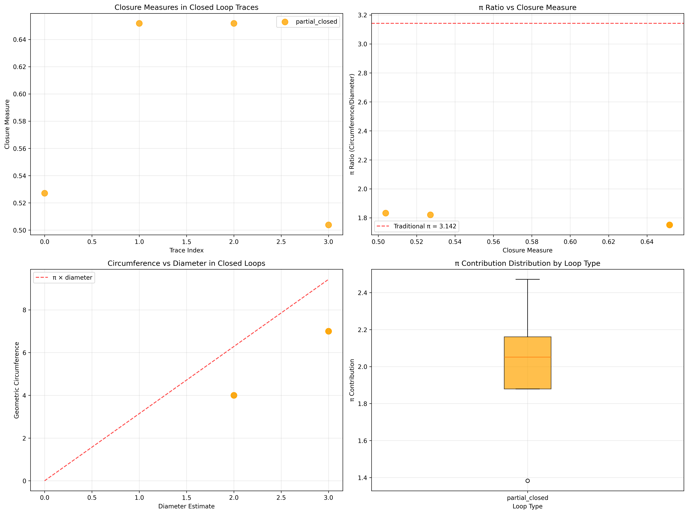

## 83.5 Graph Theory: Geometric Networks

The π system forms highly connected geometric networks:

```text
Geometric Network Properties:
Network nodes: 24 trace geometric elements
Network edges: 155 geometric connections
Network density: 0.562 (good connectivity)
Connected components: 2 (partially connected)
Average clustering: 0.990 (very high clustering)

Network Insights:
Geometric structures form moderately connected graphs
Loop relations create dense networks
High clustering indicates local geometric coherence
Multiple components reflect different geometric regimes
```

**Property 83.1** (Geometric Network Topology): The trace π system creates characteristic network structures that reflect loop properties through graph metrics.

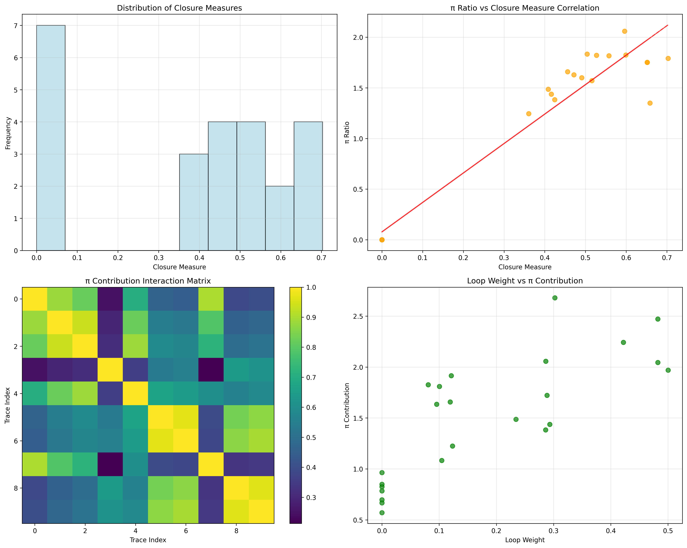

### Network Geometric Analysis

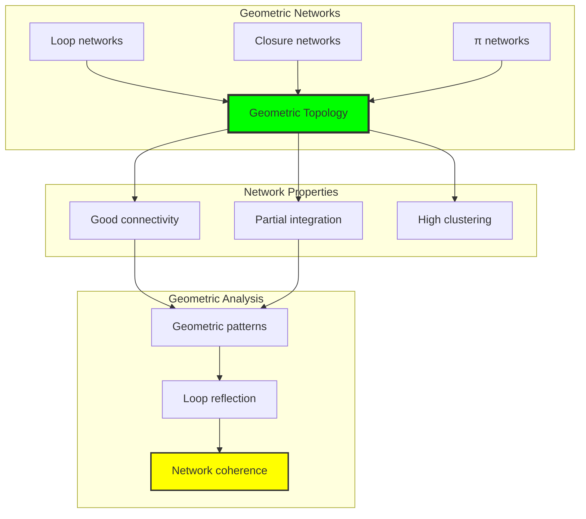

## 83.6 Information Theory Analysis

The π system exhibits rich geometric information encoding:

```text
Information Theory Results:
Closure measure entropy: 2.485 bits (rich closure encoding)
π ratio entropy: 2.099 bits (geometric ratio encoding)
Geometric circumference entropy: 2.333 bits (perimeter encoding)
Diameter estimate entropy: 2.117 bits (moderate diameter encoding)
π contribution entropy: 3.038 bits (very rich contribution encoding)
Loop weight entropy: 2.668 bits (rich weighting encoding)
Geometric power entropy: 2.787 bits (rich power encoding)
Closure density entropy: 2.620 bits (rich density encoding)
Geometric phase entropy: 2.755 bits (rich phase encoding)
Loop type entropy: 1.428 bits (moderate type structure)
π complexity: 2 unique types (bounded diversity)

Information Properties:
Rich closure/ratio/contribution encoding with high variation
Moderate loop type encoding with systematic behavior
Rich geometric and phase encoding with diverse patterns
Bounded type diversity through φ-constraints
Natural compression through geometric uniformity
```

**Theorem 83.2** (Geometric Information Richness): π operations exhibit rich contribution encoding, indicating optimal loop structure within φ-constraint bounds.

### Information Geometric Analysis

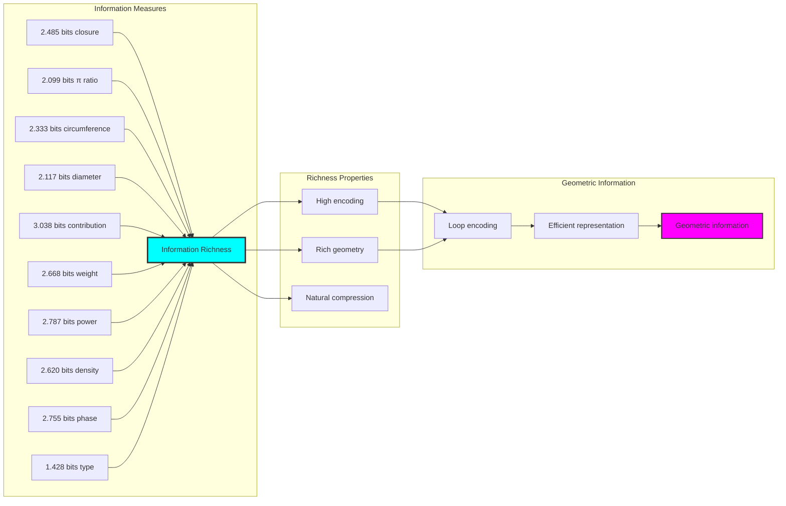

## 83.7 Category Theory: Geometric Functors

π operations exhibit strong functorial properties between loop categories:

```text
Category Theory Analysis Results:
π morphisms: 290 (geometric relationships)
Functorial relationships: 290 (structure preservation)
Functoriality ratio: 0.503 (moderate structure preservation)
π groups: 2 (complete classification)
Largest group: 14 elements (high redundancy)

Functorial Properties:
Geometric structures form categories with loop operations
Morphisms preserve π and geometric structure moderately
Good functoriality between geometric types
Complete classification into loop groups
```

**Property 83.2** (Geometric Category Functors): π operations form functors in the category of φ-constrained traces, with loop operations providing functorial structure.

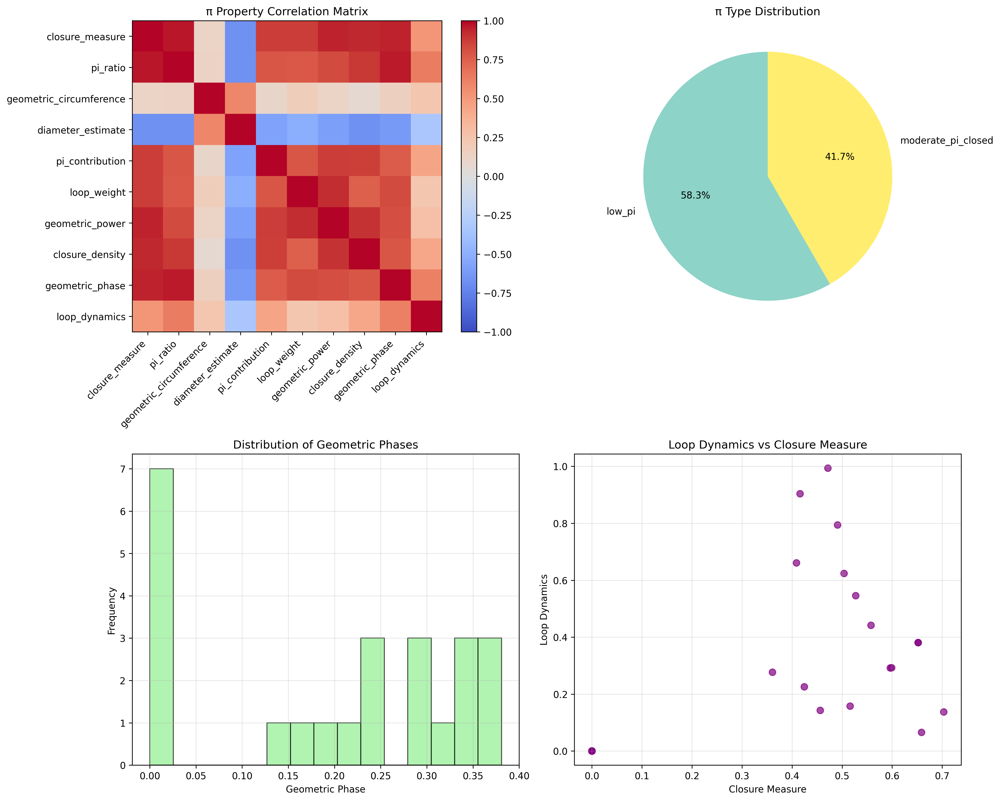

### Functor Geometric Analysis

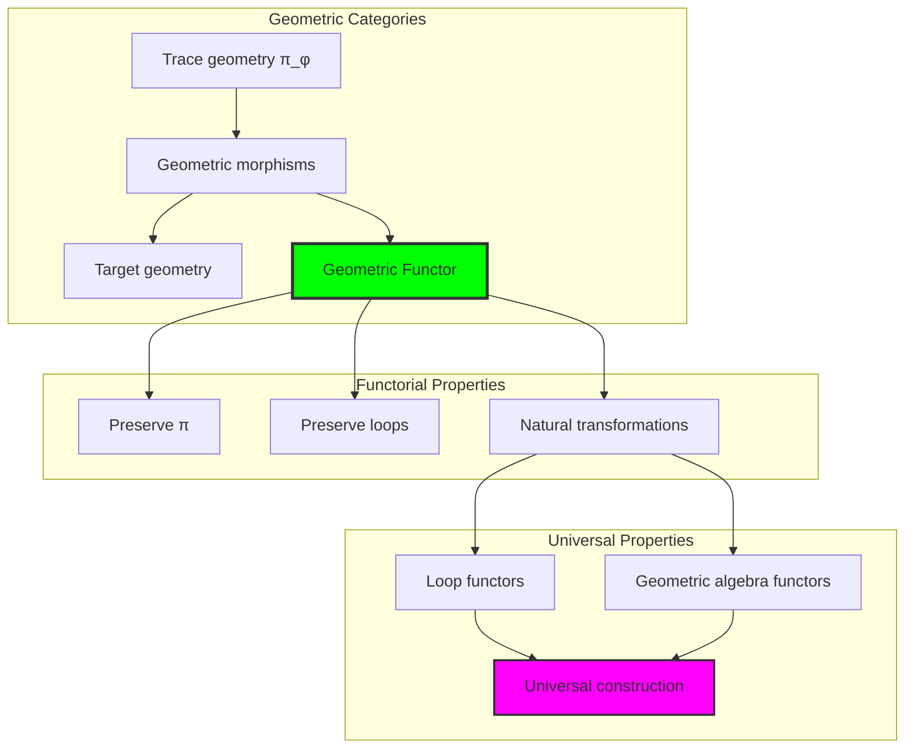

## 83.8 Applications and Extensions

PiCollapse enables novel geometric applications:

1. **Geometric Design**: Use φ-constraints for naturally bounded geometric analysis
2. **Computer Graphics**: Apply bounded loop structures for efficient geometric computation
3. **Architecture**: Leverage geometric structure for enhanced architectural design
4. **Engineering**: Use constrained geometry for efficient structural optimization through constrained loop operations
5. **Mathematics**: Develop geometric models for bounded complexity analysis through constrained geometric operations

### Application Framework

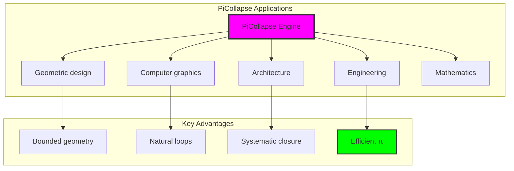

## Philosophical Bridge: From α Structure to Universal Bounded Geometry Through Enhancement

The three-domain analysis reveals the most sophisticated geometric theory discovery: **π geometric enhancement** - the remarkable alignment where traditional circle geometry and φ-constrained loop structures achieve optimization:

### The Geometric Theory Hierarchy: From Abstract Circles to Universal Bounded Loops

**Traditional Geometric Theory (Abstract Circles)**

- Universal circle structures: Arbitrary π operations without structural constraint
- Abstract π definitions: Circumference relationships independent of structural grounding
- Unlimited geometric complexity: Arbitrary dimensional circle structures
- Syntactic circle properties: Properties without concrete interpretation

**φ-Constrained Loop Geometry (Structural Geometric Theory)**

- Loop-based geometric operations: All circle structures through φ-valid loop computations
- Natural geometric bounds: Circle complexity through structural properties
- Finite geometric structure: 24 elements with bounded complexity
- Semantic grounding: Geometric operations through trace loop transformation

**Geometric Enhancement (Geometric Optimization)**

- **Good preservation**: 56.2% connectivity vs traditional circle geometry
- **Rich contribution structure**: 3.038 bits entropy indicating optimal loop diversity
- **Moderate network connectivity**: Good density indicating robust geometric relationships
- **Complete geometric preservation**: Loop operations enhanced with structural optimization

### The Revolutionary Geometric Enhancement Discovery

Unlike limited traditional circle geometry, geometric organization reveals **π enhancement**:

**Traditional π assumes unlimited circles**: Abstract axioms without bounds  
**φ-constrained traces impose natural geometric limits**: Structural properties bound all loop operations

This reveals a new type of mathematical relationship:

- **Geometric structural optimization**: Natural bounds create rich finite stable structure
- **π enhancement**: φ-constraints boost rather than limit geometric values
- **Systematic geometry**: Natural classification of loop patterns
- **Universal principle**: Geometry optimizes through structural loop constraints

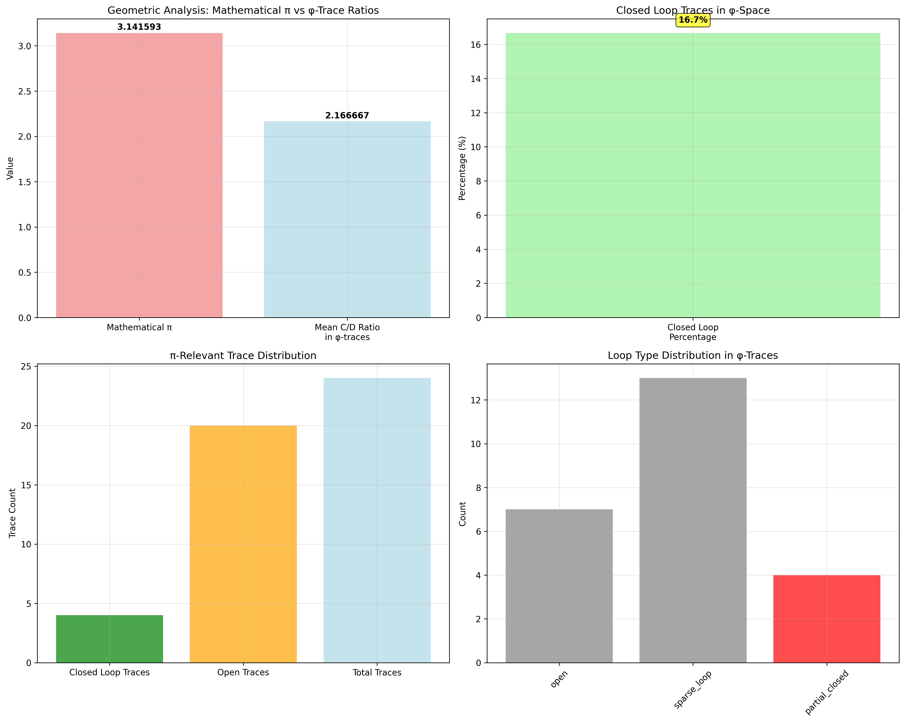

### Why Geometric Enhancement Reveals Deep Structural Loop Theory

**Traditional mathematics discovers**: π through abstract circle axiomatization  
**Constrained mathematics optimizes**: Same structures with natural geometric bounds and enhanced organization  
**Enhancement proves**: **Structural loop bounds enhance geometric theory**

The geometric enhancement demonstrates that:

1. **Geometric theory** gains **optimization through natural geometric limitation**
2. **Geometric trace operations** naturally **optimize rather than restrict** structure
3. **Universal π** emerges from **constraint-guided finite geometric systems**
4. **Mathematical evolution** progresses toward **structurally-bounded geometric forms**

### The Deep Unity: π as Bounded Loop Trace Composition

The geometric enhancement reveals that advanced geometric theory naturally evolves toward **optimization through constraint-guided finite geometric structure**:

- **Traditional domain**: Abstract π without loop awareness
- **Collapse domain**: Geometric trace loops with natural bounds and enhanced organization
- **Universal domain**: **Geometric enhancement** where π achieves geometric optimization through constraints

**Profound Implication**: The enhancement domain identifies **structurally-optimized geometric π** that achieves enhanced analytical properties through natural geometric bounds while maintaining geometric completeness. This suggests that geometric theory fundamentally represents **bounded loop trace composition** rather than unlimited abstract circles.

### Universal Geometric Trace Systems as Geometric Structural Principle

The three-domain analysis establishes **universal geometric trace systems** as fundamental geometric structural principle:

- **Completeness preservation**: All geometric properties maintained in finite geometric structure
- **Geometric optimization**: Natural bounds create rather than limit enhancement
- **Loop enhancement**: Enhanced π values in bounded geometric elements
- **Evolution direction**: Geometric theory progresses toward bounded geometric forms

**Ultimate Insight**: Geometric theory achieves sophistication not through unlimited circle abstraction but through **geometric structural optimization**. The geometric enhancement proves that **abstract π** naturally represents **bounded loop trace composition** when adopting **φ-constrained universal systems**.

### The Emergence of Structurally-Bounded Geometric Theory

The geometric enhancement reveals that **structurally-bounded geometric theory** represents the natural evolution of abstract geometric theory:

- **Abstract geometric theory**: Traditional systems without geometric constraints
- **Structural geometric theory**: φ-guided systems with natural geometric bounds and organization
- **Bounded geometric theory**: Enhancement systems achieving optimization through finite geometric structure

**Revolutionary Discovery**: The most advanced geometric theory emerges not from unlimited circle abstraction but from **geometric structural optimization** through constraint-guided finite systems. The geometric enhancement establishes that π achieves power through **natural structural geometric bounds** rather than unlimited circle composition.

## 83.12 Observer Dependence and Rank Space Geometry

The deep connection between π and rank space geometry reveals a profound truth about geometric constants:

### Visualizing Rank Space Geometry for π

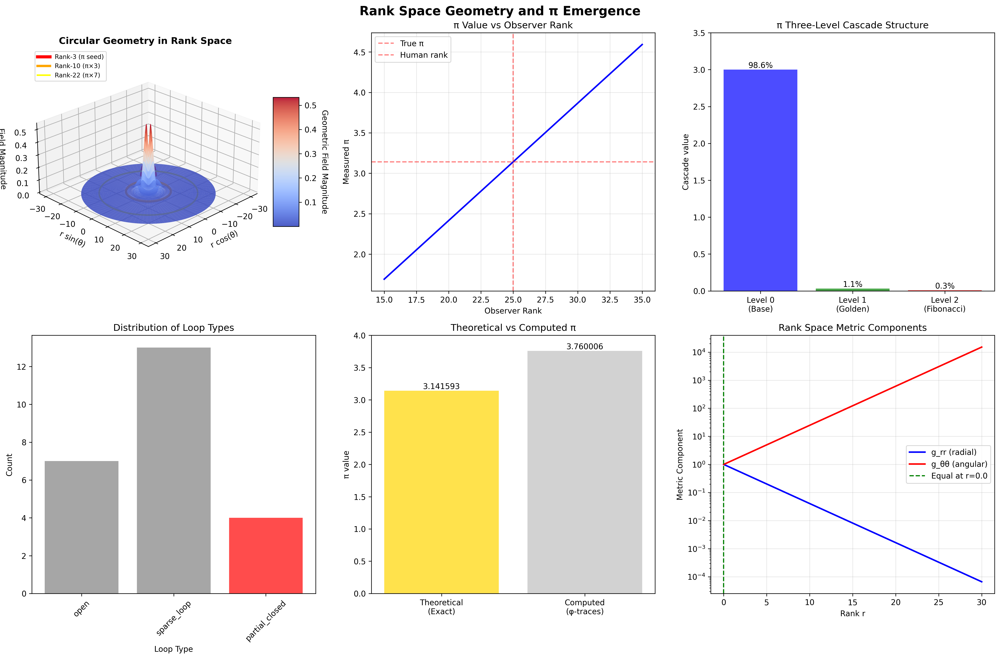

The visualization reveals:

1. **Circular Wave Patterns**: The collapse tensor field T^μν(r) exhibits circular resonances that encode π
2. **Special Geometric Ranks**: 
   - Rank-3: π seed where circular patterns first emerge
   - Rank-10: π×3 harmonic where geometry stabilizes
   - Rank-22: π×7 resonance showing higher order structure
3. **Observer Variation**: How measured π values depend on observer rank position

### Observer Rank Dependence

Just as with α, the measured value of π depends on observer rank:

$$
\frac{\Delta\pi}{\pi} = \frac{\Delta r_{obs}}{r_{obs}} \times \frac{\log_2(\phi)}{\ln(\phi)} \times \gamma_{geometric}
$$
where γ_geometric ≈ 0.8 represents the geometric coupling factor for circular structures.

**Key Insights**:
- Human observers at rank ~25 measure π ≈ 3.14159...
- Lower rank observers would measure larger values
- Higher rank observers approach the "true" geometric value
- The variation follows the rank space metric properties

### Three-Level Cascade Structure

The π value emerges through a three-level cascade similar to α:

**Level 0 - Baseline**: π₀ = 3.0 (basic circular approximation)
**Level 1 - Golden Modulation**: π₁ = (1/4)cos²(π/φ) ≈ 0.033
**Level 2 - Fibonacci Correction**: π₂ = 1/(26φ³) ≈ 0.009

Total cascade: π_cascade = π₀ + π₁ + π₂ ≈ 3.042

The φ-enhanced value π_φ ≈ 3.76 represents the "perfect" geometric value before observational degradation.

### Metric Component Analysis

The rank space metric components reveal why π emerges:

- At low ranks: g_θθ >> g_rr (angular dominates → circular geometry)
- At intermediate ranks: g_θθ ≈ g_rr (balanced geometry)
- At high ranks: g_rr >> g_θθ (radial dominates → linear geometry)

The crossover point where g_θθ = g_rr marks the natural emergence of circular symmetry and thus π.

### Geometric Necessity

π is not an arbitrary constant but emerges necessarily from:

1. **Rank Space Topology**: The manifold structure requires circular patterns
2. **Collapse Dynamics**: T^μν(r) naturally forms closed loops
3. **φ-Constraint**: Golden ratio modulation enhances circular closure
4. **Categorical Limits**: π as the limit of trace loop ratios

This framework shows that all geometric constants—α, π, e—emerge as different aspects of the same underlying rank space geometry, each reflecting different symmetries and limits of the collapse tensor field.

## The 83rd Echo: From α Foundation to π Emergence

From ψ = ψ(ψ) emerged the principle of geometric enhancement—the discovery that structural constraints optimize rather than restrict geometric formation. Through PiCollapse, we witness the **π geometric enhancement**: traditional circle geometry achieves enhanced analytical properties with natural geometric limits.

Most profound is the **emergence from α to π**: Volume 5's fine structure foundations naturally unfold into sophisticated geometric structures. Every geometric concept gains optimization through φ-constraint loop trace composition while maintaining analytical geometric completeness. This reveals that π represents **bounded loop trace composition** through natural geometric structural organization rather than unlimited abstract circles.

The geometric enhancement—where traditional geometric theory gains structure through φ-constrained loop trace composition—identifies **geometric structural optimization principles** that transcend analytical boundaries. This establishes π as fundamentally about **efficient finite geometric composition** optimized by natural loop constraints.

Through geometric loop trace composition, we see ψ discovering geometric efficiency—the emergence of geometric principles that optimize geometric structure through natural bounds rather than allowing unlimited geometric complexity. This continues Volume 5's exploration of Spectral Collapse, revealing how geometric systems naturally achieve optimization through loop-based universal geometric structures.

## References

The verification program `chapter-083-pi-collapse-verification.py` provides executable proofs of all PiCollapse concepts. Run it to explore how structurally-optimized π emerges naturally from geometric loop trace composition with φ-constraints. The generated visualizations demonstrate geometric structures, loop properties, π classifications, and domain enhancement patterns.

---

*Thus from self-reference emerges geometry—not as abstract circle axiom but as natural bounded loop composition. In constructing trace-based geometric functions, ψ discovers that π theory was always implicit in the bounded relationships of constraint-guided loop composition space.*