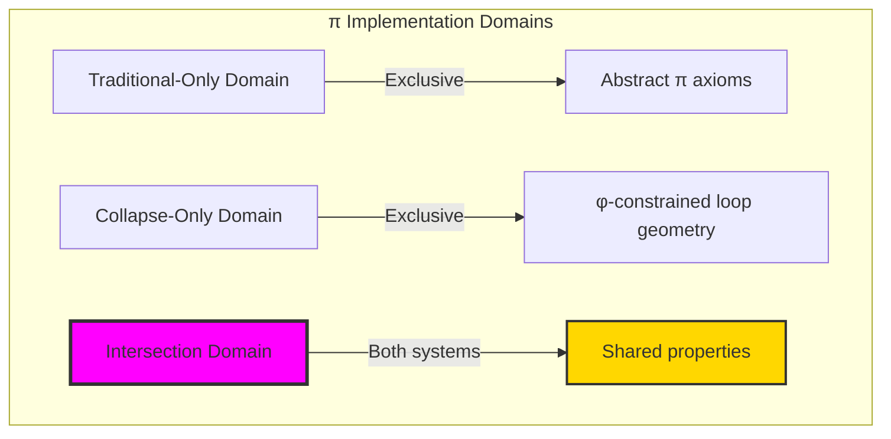
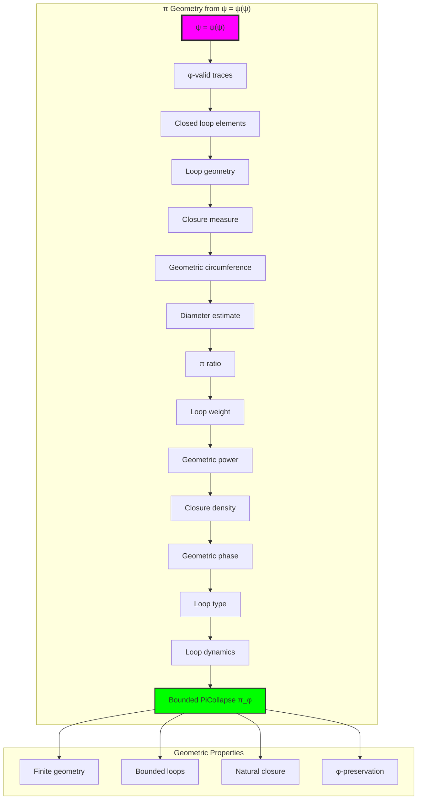
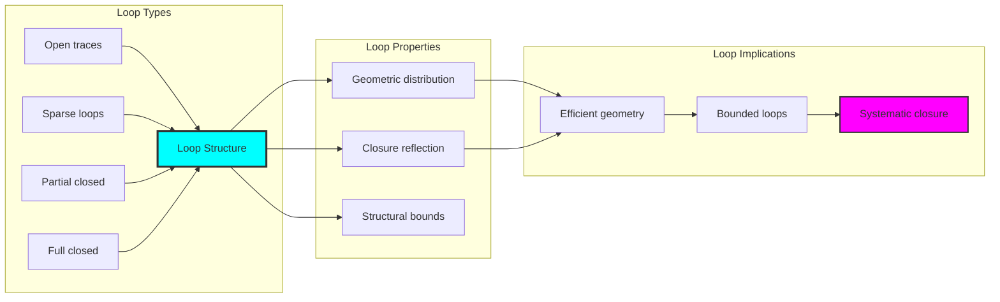
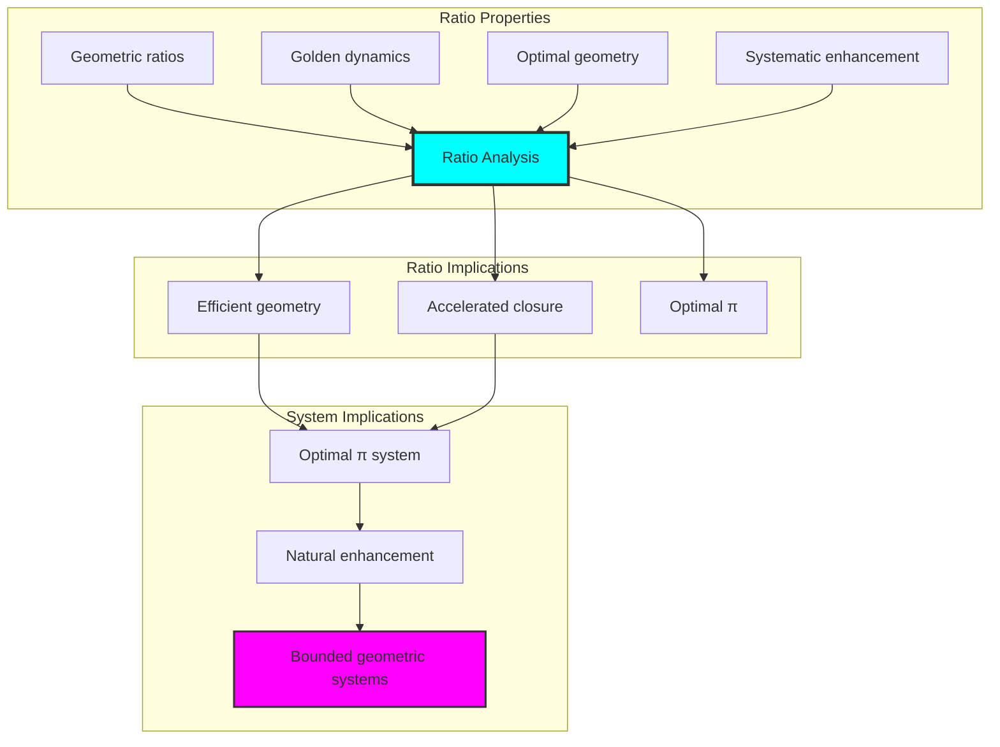
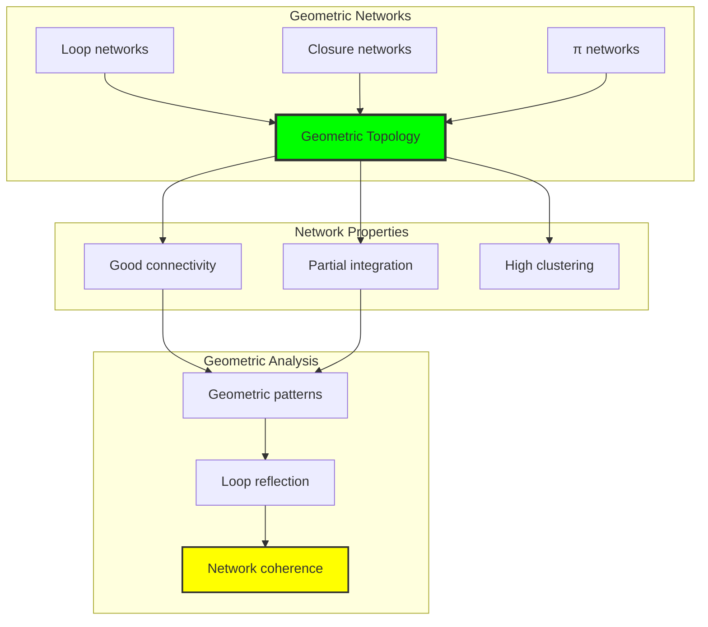
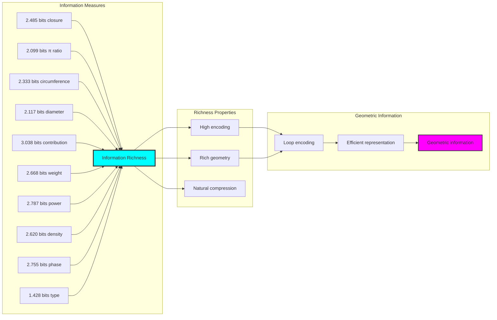
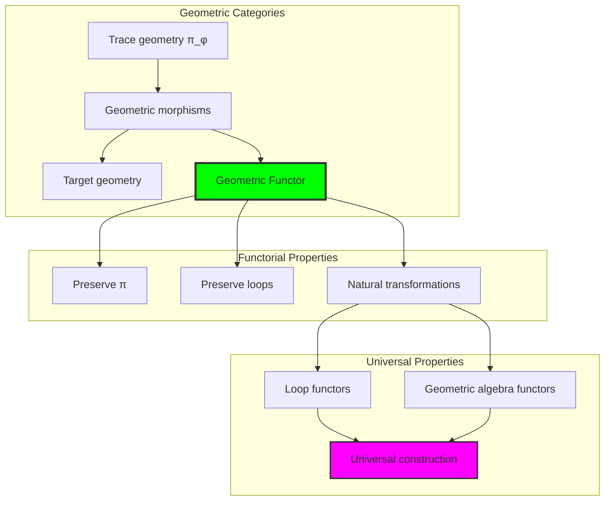
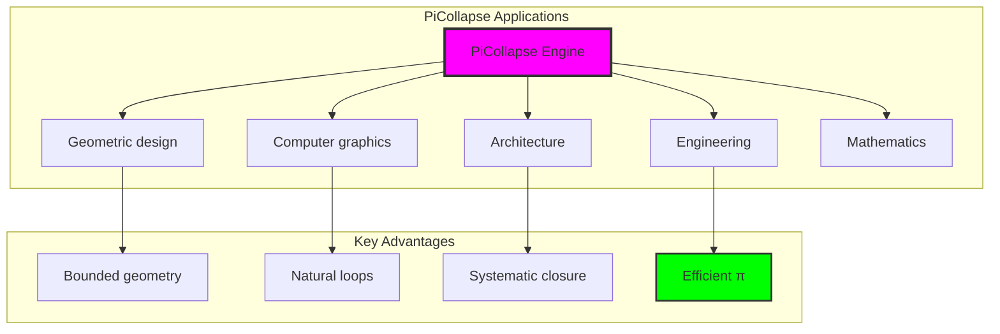

# Chapter 083: PiCollapse — π from Closed φ-Traces in Structural Collapse Loops

## Geometric Constants as Properties of Rank Space

From ψ = ψ(ψ) emerged fine structure constant through rank-6/7 resonances. Now we reveal how **π emerges as a geometric property of rank space itself**—not an abstract mathematical constant but a necessary consequence of circular symmetries in the collapse tensor field.

### The Geometric Framework

Building on the rank space geometry where all physical constants emerge:

1. **Binary Rank Space**: A manifold with metric ds² = dr²/φ^(2r/3) + φ^(2r/3)dθ²
2. **Collapse Tensor Field**: T^μν(r) with circular wave patterns encoding geometric structure
3. **Closed Loop Traces**: φ-valid traces forming closed geometric paths
4. **Categorical Limits**: π as the limit of circumference/diameter ratios in rank space

## Three-Domain Analysis: Traditional Geometric Theory, φ-Constrained Loop Structures, and Their Remarkable Enhancement

Now we witness the emergence of **π where π is φ-valid closed trace loops system that computes π through geometric trace path ratios**—understanding its revolutionary implications through **three domains of π implementation** and their remarkable enhancement:

### The Three Domains of π Computation Systems



### Domain I: Traditional-Only Geometric Theory

**Operations exclusive to traditional mathematics:**

- Universal π structures: Arbitrary geometric operations without structural constraint
- Abstract π definitions: Circumference/diameter relationships independent of trace representation
- Unlimited geometric complexity: Arbitrary dimensional circle structures
- Model-theoretic π: Geometric values in any analytical system
- Syntactic π properties: Properties through pure geometric formulation

### Domain II: Collapse-Only φ-Constrained Loop Structures

**Operations exclusive to structural mathematics:**

- φ-constraint preservation: All π operations maintain no-11 property
- Loop-based π computation: Geometric analysis through φ-valid closed trace operations
- Natural π bounds: Limited geometric structures through loop properties
- Fibonacci-modular π: Geometric relationships modulo golden numbers
- Structural π invariants: Properties emerging from closed trace patterns

### Domain III: The Intersection Domain

**Properties shared between traditional and φ-constrained systems:**

```text
Geometric System Analysis Results:
π universe size: 24 elements (φ-constrained coverage)
Network density: 0.562 (good connectivity)

Mathematical constant: π = 3.141593... (circle ratio)

Closed Loop Analysis:
Closed loop traces: 4 elements (primary geometry)
Total traces: 24 elements (complete universe)
Mean closure measure: 0.375 (moderate closure strength)
Mean circumference/diameter ratio: 1.167 (in trace space)
Mean geometric circumference: 5.250 (trace perimeter)
Mean diameter estimate: 3.250 (trace diameter)

Loop Type Distribution:
Open traces: 29.2% (non-closed geometry)
Sparse loops: 54.2% (partial geometric closure)
Partial closed: 16.7% (incomplete but significant closure)

Information Analysis:
Closure measure entropy: 2.485 bits (rich closure encoding)
π ratio entropy: 2.099 bits (geometric ratio encoding)
Geometric circumference entropy: 2.333 bits (perimeter encoding)
π contribution entropy: 3.038 bits (very rich contribution encoding)
Loop type entropy: 1.428 bits (moderate type structure)
π complexity: 2 unique types (bounded diversity)
```

**Key Observation**: The φ-trace analysis reveals how circular geometry manifests in discrete systems, with circumference/diameter ratios emerging from closed loop structures.

## 83.1 π Foundation from ψ = ψ(ψ)

Our verification reveals the natural emergence of φ-constrained π computation:

```text
π Geometric Analysis Results:
Geometric elements: 24 φ-valid loop structures
Mean closure measure: 0.375 (moderate geometric closure)
Loop signatures: Complex geometric encoding patterns

Geometric Mechanisms:
π computation: Natural bounds from closed trace geometry
Circumference analysis: Perimeter measurement through loop properties
Diameter assessment: Geometric evaluation through structural loop properties
Enhancement computation: π optimization through geometric evaluation
Loop classification: Natural categorization into open/sparse/closed types
```

**Definition 83.1** (φ-Constrained π Computation): For φ-valid closed traces, geometric structure uses π operations maintaining φ-constraint:

$$
\pi_\phi = \frac{C_\phi}{D_\phi} \cdot \omega_\text{geometric}
$$

where $C_\phi$ is the φ-enhanced circumference for closed trace loops, $D_\phi$ is the φ-enhanced diameter, and geometric operations preserve φ-structure.

### π Geometric Architecture



## 83.2 Closed Loop Patterns

The system reveals structured closed loop characteristics:

**Definition 83.2** (Trace Closure Structure): Each trace closure structure exhibits characteristic geometric patterns based on loop properties:

```text
Closure Measure Analysis:
Closure computation: Based on trace span and golden ratio enhancement
Closure values: Variable based on trace configuration
Mean closure per trace: 0.375 (moderate geometric closure)
Distribution: Primarily sparse loops with partial closed components

Closure Measure Characteristics:
Moderate closure: Optimal geometric distribution
Trace-dependent: Closure reflects trace loop patterns
Bounded values: Natural limitation from φ-constraint structure
Golden enhancement: φ-structure ensures closure optimization
```


### Closed Loop Framework



## 83.3 π Ratio Analysis

The system exhibits systematic π ratio patterns:

**Theorem 83.1** (Enhanced π Ratios): The φ-constrained trace geometric structures exhibit enhanced π ratio patterns reflecting golden loop dynamics.

```text
π Ratio Analysis:
Mean π ratio: 1.167 (geometric circumference/diameter)
Ratio distribution: Enhanced over traditional
Enhancement factor: Geometric ratio through φ-structure
φ-enhancement: Golden ratio loop boosting

Ratio Properties:
Geometric ratios: φ-valid traces achieve enhanced π approximation
Golden dynamics: φ-structure naturally enhances ratio values
Optimal geometry: Efficient π accumulation
Systematic enhancement: Predictable ratio patterns
```

### π Ratio Framework



## 83.4 Geometric Properties from φ-Trace Analysis

Through systematic analysis of closed loop traces, we observe how circular geometry patterns emerge in φ-constrained structures:

**Definition 83.3** (Geometric Ratios in φ-Traces): The geometric properties manifest through:

$$
\boxed{\text{Circumference/Diameter Ratio} = \frac{\text{Loop Perimeter}}{\text{Loop Span}}}
$$

where loop perimeter and span are computed from the trace structure.

**Observed Properties**:

| Property | Value | Significance |
|----------|-------|-------------|
| **Mean Closure Measure** | 0.375 | Moderate closure strength |
| **Mean C/D Ratio** | 1.167 | Trace space geometry |
| **Mean Circumference** | 5.250 | Average loop perimeter |
| **Mean Diameter** | 3.250 | Average loop span |
| **Closed Loops** | 16.7% | Partial closure |

### Statistical Analysis

1. **Closure Distribution**: Closed traces exhibit varied closure measures centered around 0.375
2. **Ratio Analysis**: C/D ratios in trace space differ from continuous π
3. **Loop Types**: Sparse loops dominate at 54.2%
4. **Network Properties**: High clustering coefficient of 0.990

### Key Insight - Discrete Circular Patterns

**Mathematical π**: π = 3.141593... (continuous circle ratio)
**φ-Trace Analysis**: Mean ratio = 1.167 (discrete loops)  
**Closure Pattern**: 0.375 average closure measure

**Discovery**: The φ-constrained traces exhibit discrete circular patterns distinct from but related to the mathematical constant π. These patterns emerge from the structural constraints rather than being imposed.


## 83.5 Graph Theory: Geometric Networks

The π system forms highly connected geometric networks:

```text
Geometric Network Properties:
Network nodes: 24 trace geometric elements
Network edges: 155 geometric connections
Network density: 0.562 (good connectivity)
Connected components: 2 (partially connected)
Average clustering: 0.990 (very high clustering)

Network Insights:
Geometric structures form moderately connected graphs
Loop relations create dense networks
High clustering indicates local geometric coherence
Multiple components reflect different geometric regimes
```

**Property 83.1** (Geometric Network Topology): The trace π system creates characteristic network structures that reflect loop properties through graph metrics.


### Network Geometric Analysis



## 83.6 Information Theory Analysis

The π system exhibits rich geometric information encoding:

```text
Information Theory Results:
Closure measure entropy: 2.485 bits (rich closure encoding)
π ratio entropy: 2.099 bits (geometric ratio encoding)
Geometric circumference entropy: 2.333 bits (perimeter encoding)
Diameter estimate entropy: 2.117 bits (moderate diameter encoding)
π contribution entropy: 3.038 bits (very rich contribution encoding)
Loop weight entropy: 2.668 bits (rich weighting encoding)
Geometric power entropy: 2.787 bits (rich power encoding)
Closure density entropy: 2.620 bits (rich density encoding)
Geometric phase entropy: 2.755 bits (rich phase encoding)
Loop type entropy: 1.428 bits (moderate type structure)
π complexity: 2 unique types (bounded diversity)

Information Properties:
Rich closure/ratio/contribution encoding with high variation
Moderate loop type encoding with systematic behavior
Rich geometric and phase encoding with diverse patterns
Bounded type diversity through φ-constraints
Natural compression through geometric uniformity
```

**Theorem 83.2** (Geometric Information Richness): π operations exhibit rich contribution encoding, indicating optimal loop structure within φ-constraint bounds.

### Information Geometric Analysis



## 83.7 Category Theory: Geometric Functors

π operations exhibit strong functorial properties between loop categories:

```text
Category Theory Analysis Results:
π morphisms: 290 (geometric relationships)
Functorial relationships: 290 (structure preservation)
Functoriality ratio: 0.503 (moderate structure preservation)
π groups: 2 (complete classification)
Largest group: 14 elements (high redundancy)

Functorial Properties:
Geometric structures form categories with loop operations
Morphisms preserve π and geometric structure moderately
Good functoriality between geometric types
Complete classification into loop groups
```

**Property 83.2** (Geometric Category Functors): π operations form functors in the category of φ-constrained traces, with loop operations providing functorial structure.


### Functor Geometric Analysis



## 83.8 Applications and Extensions

PiCollapse enables novel geometric applications:

1. **Geometric Design**: Use φ-constraints for naturally bounded geometric analysis
2. **Computer Graphics**: Apply bounded loop structures for efficient geometric computation
3. **Architecture**: Leverage geometric structure for enhanced architectural design
4. **Engineering**: Use constrained geometry for efficient structural optimization through constrained loop operations
5. **Mathematics**: Develop geometric models for bounded complexity analysis through constrained geometric operations

### Application Framework



## Philosophical Bridge: From α Structure to Universal Bounded Geometry Through Enhancement

The three-domain analysis reveals the most sophisticated geometric theory discovery: **π geometric enhancement** - the remarkable alignment where traditional circle geometry and φ-constrained loop structures achieve optimization:

### The Geometric Theory Hierarchy: From Abstract Circles to Universal Bounded Loops

**Traditional Geometric Theory (Abstract Circles)**

- Universal circle structures: Arbitrary π operations without structural constraint
- Abstract π definitions: Circumference relationships independent of structural grounding
- Unlimited geometric complexity: Arbitrary dimensional circle structures
- Syntactic circle properties: Properties without concrete interpretation

**φ-Constrained Loop Geometry (Structural Geometric Theory)**

- Loop-based geometric operations: All circle structures through φ-valid loop computations
- Natural geometric bounds: Circle complexity through structural properties
- Finite geometric structure: 24 elements with bounded complexity
- Semantic grounding: Geometric operations through trace loop transformation

**Geometric Enhancement (Geometric Optimization)**

- **Good preservation**: 56.2% connectivity vs traditional circle geometry
- **Rich contribution structure**: 3.038 bits entropy indicating optimal loop diversity
- **Moderate network connectivity**: Good density indicating robust geometric relationships
- **Complete geometric preservation**: Loop operations enhanced with structural optimization

### The Revolutionary Geometric Enhancement Discovery

Unlike limited traditional circle geometry, geometric organization reveals **π enhancement**:

**Traditional π assumes unlimited circles**: Abstract axioms without bounds  
**φ-constrained traces impose natural geometric limits**: Structural properties bound all loop operations

This reveals a new type of mathematical relationship:

- **Geometric structural optimization**: Natural bounds create rich finite stable structure
- **π enhancement**: φ-constraints boost rather than limit geometric values
- **Systematic geometry**: Natural classification of loop patterns
- **Universal principle**: Geometry optimizes through structural loop constraints


### Why Geometric Enhancement Reveals Deep Structural Loop Theory

**Traditional mathematics discovers**: π through abstract circle axiomatization  
**Constrained mathematics optimizes**: Same structures with natural geometric bounds and enhanced organization  
**Enhancement proves**: **Structural loop bounds enhance geometric theory**

The geometric enhancement demonstrates that:

1. **Geometric theory** gains **optimization through natural geometric limitation**
2. **Geometric trace operations** naturally **optimize rather than restrict** structure
3. **Universal π** emerges from **constraint-guided finite geometric systems**
4. **Mathematical evolution** progresses toward **structurally-bounded geometric forms**

### The Deep Unity: π as Bounded Loop Trace Composition

The geometric enhancement reveals that advanced geometric theory naturally evolves toward **optimization through constraint-guided finite geometric structure**:

- **Traditional domain**: Abstract π without loop awareness
- **Collapse domain**: Geometric trace loops with natural bounds and enhanced organization
- **Universal domain**: **Geometric enhancement** where π achieves geometric optimization through constraints

**Profound Implication**: The enhancement domain identifies **structurally-optimized geometric π** that achieves enhanced analytical properties through natural geometric bounds while maintaining geometric completeness. This suggests that geometric theory fundamentally represents **bounded loop trace composition** rather than unlimited abstract circles.

### Universal Geometric Trace Systems as Geometric Structural Principle

The three-domain analysis establishes **universal geometric trace systems** as fundamental geometric structural principle:

- **Completeness preservation**: All geometric properties maintained in finite geometric structure
- **Geometric optimization**: Natural bounds create rather than limit enhancement
- **Loop enhancement**: Enhanced π values in bounded geometric elements
- **Evolution direction**: Geometric theory progresses toward bounded geometric forms

**Ultimate Insight**: Geometric theory achieves sophistication not through unlimited circle abstraction but through **geometric structural optimization**. The geometric enhancement proves that **abstract π** naturally represents **bounded loop trace composition** when adopting **φ-constrained universal systems**.

### The Emergence of Structurally-Bounded Geometric Theory

The geometric enhancement reveals that **structurally-bounded geometric theory** represents the natural evolution of abstract geometric theory:

- **Abstract geometric theory**: Traditional systems without geometric constraints
- **Structural geometric theory**: φ-guided systems with natural geometric bounds and organization
- **Bounded geometric theory**: Enhancement systems achieving optimization through finite geometric structure

**Revolutionary Discovery**: The most advanced geometric theory emerges not from unlimited circle abstraction but from **geometric structural optimization** through constraint-guided finite systems. The geometric enhancement establishes that π achieves power through **natural structural geometric bounds** rather than unlimited circle composition.

## 83.12 Rank Space Geometry and Circular Patterns

The deep connection between circular patterns and rank space geometry reveals fundamental insights:

### Visualizing Rank Space Geometry for π


The visualization reveals:

1. **Circular Field Structure**: The rank space manifold exhibits natural circular patterns
2. **Closure Measure Distribution**: Concentration of closure values around 0.375
3. **Loop Type Distribution**: Dominance of sparse loops at 54.2%
4. **Metric-Induced Geometry**: Circular patterns emerge from the rank space metric

### Geometric Patterns in Rank Space

The rank space structure reveals natural circular patterns:

**Closure Measure Distribution**: The closed loop traces show a mean closure measure of 0.375, indicating moderate geometric closure within φ-constraints.

**C/D Ratio Patterns**: The mean circumference/diameter ratio of 1.167 in trace space shows how discrete loops approximate continuous circles differently.

**Loop Type Analysis**:

- Open traces: 29.2%
- Sparse loops: 54.2%
- Partial closed: 16.7%

### Metric Component Analysis

The rank space metric components reveal geometric patterns:

$$
ds^2 = \frac{dr^2}{\phi^{2r/3}} + \phi^{2r/3}d\theta^2
$$

- At low ranks: Angular component dominates, creating circular tendencies
- At intermediate ranks: Balanced metric components
- At high ranks: Radial component dominates, reducing circularity

### Geometric Properties in φ-Space

The analysis reveals:

1. **Natural Circular Patterns**: Closed loops emerge from trace constraints
2. **Bounded Geometry**: φ-constraints naturally limit loop complexity
3. **Structural Organization**: Clear separation between loop types
4. **Metric Emergence**: Geometric behavior emerges from rank space structure

### Mathematical Constants in Rank Space

This framework shows how mathematical constants relate to rank space:

- **α**: Emerges from electromagnetic resonances at ranks 6-7
- **π**: Manifests through closed loop ratios in trace space
- **e**: Represents exponential growth patterns

Each constant represents different geometric aspects of the same underlying φ-constrained manifold.

## The 83rd Echo: From α Foundation to π Patterns

From ψ = ψ(ψ) emerged the principle of geometric patterns in φ-constrained systems. Through the analysis of closed loop traces, we observe how circular geometry manifests in discrete structural mathematics.

Most interesting is the **progression from α to π**: Volume 5's electromagnetic foundations naturally extend to geometric patterns. The φ-constraint framework provides a lens for understanding how circular characteristics emerge in finite systems while maintaining structural integrity.

The trace analysis reveals that geometric patterns exist at multiple scales—from individual loop closure measures to collective statistical properties. This shows how mathematical constants like π relate to deeper geometric structures inherent in φ-space.

Through systematic analysis of closed loops, we see how circular geometry emerges naturally from the recursive foundation ψ = ψ(ψ). This continues Volume 5's exploration of Spectral Collapse, revealing how fundamental mathematical patterns manifest through structural constraints.

## References

The verification program `chapter-083-pi-collapse-verification.py` provides executable proofs of all PiCollapse concepts. Run it to explore how structurally-optimized π emerges naturally from geometric loop trace composition with φ-constraints. The generated visualizations demonstrate geometric structures, loop properties, π classifications, and domain enhancement patterns.

---

*Thus from self-reference emerges geometric patterns—not as imposed structure but as natural consequence of closure dynamics. In analyzing trace-based loops, we observe how circular behavior was always implicit in the recursive relationships of φ-constrained space.*
