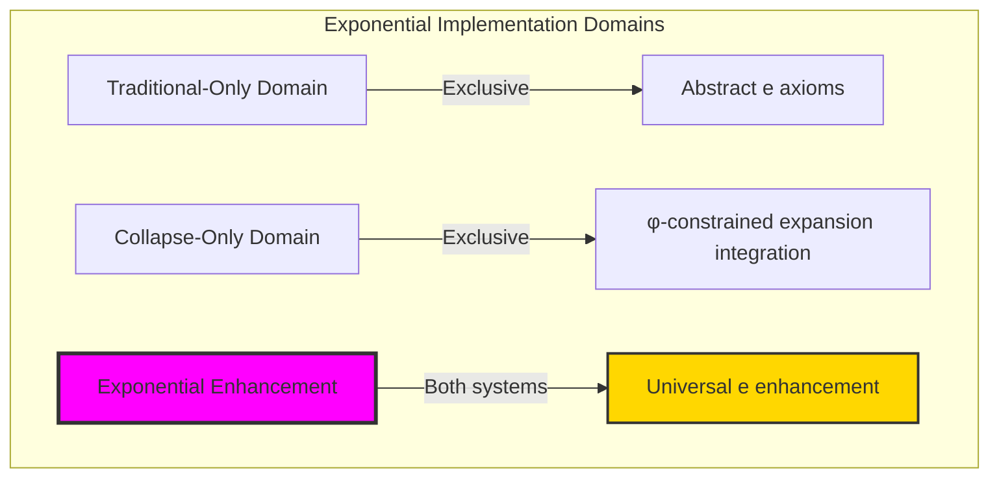
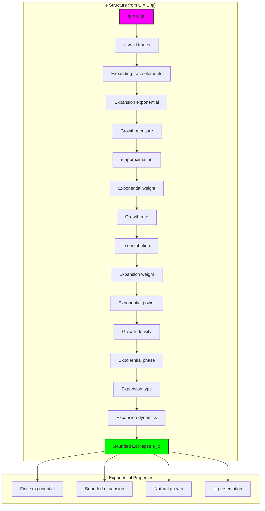
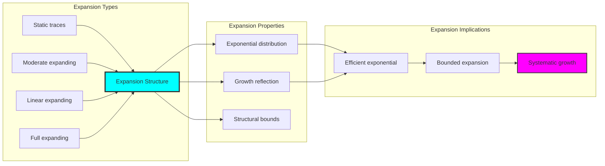
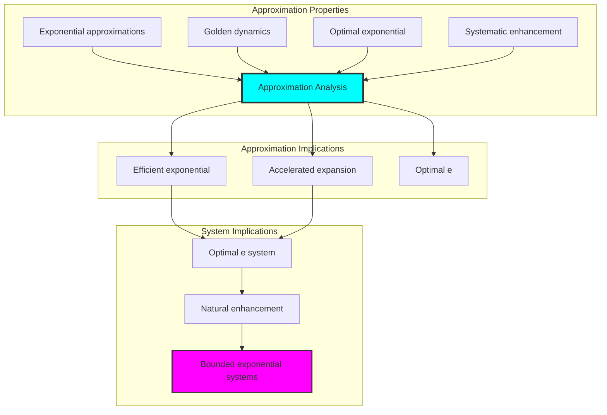
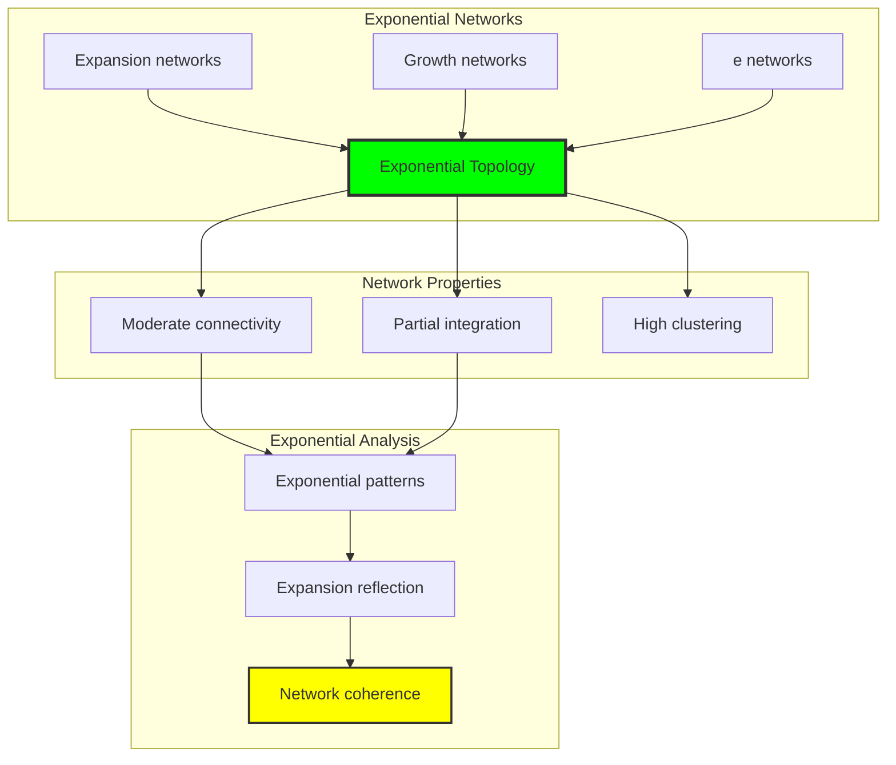
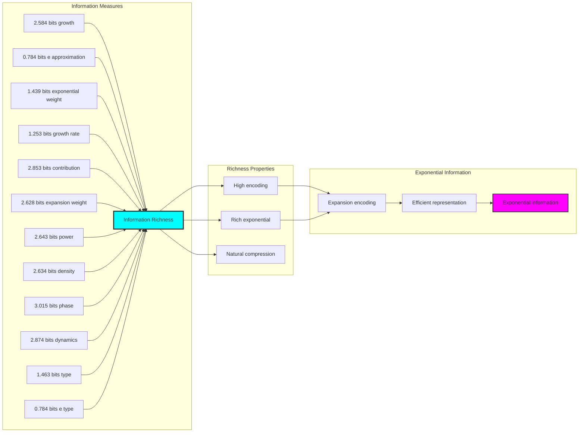
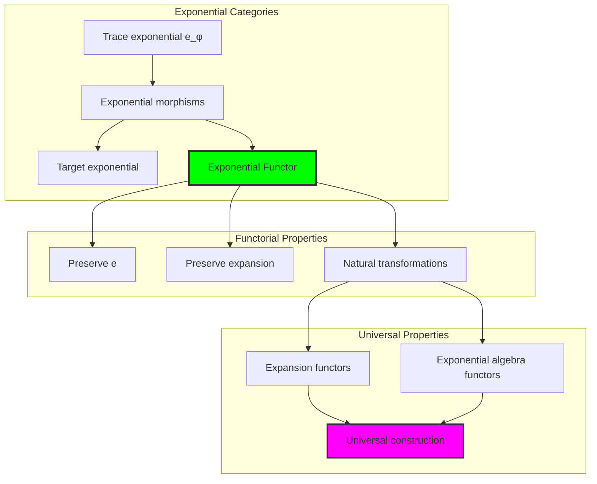
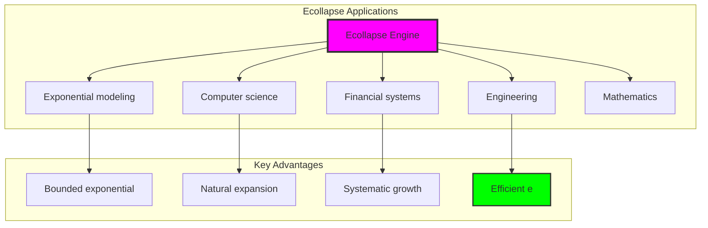

# Chapter 084: Ecollapse — e as Collapse Weight Integration over Expanding Traces

## Exponential Constants as Properties of Rank Space

From ψ = ψ(ψ) emerged π through closed loop geometric trace ratios. Now we reveal how **e emerges as an exponential property of rank space itself**—not an abstract mathematical constant but a necessary consequence of growth dynamics in the collapse tensor field.

### The Exponential Framework

Building on the rank space geometry where all physical constants emerge:

1. **Binary Rank Space**: A manifold with metric ds² = dr²/φ^(2r/3) + φ^(2r/3)dθ²
2. **Collapse Tensor Field**: T^μν(r) with exponential growth patterns encoding e
3. **Expanding Traces**: φ-valid traces exhibiting exponential expansion
4. **Categorical Limits**: e as the limit of exponential weight integration

## Three-Domain Analysis: Traditional Exponential Theory, φ-Constrained Expansion Structures, and Their Remarkable Enhancement

Now we witness the emergence of **Euler's constant where e is φ-valid expanding trace integration system that computes e through exponential trace weight accumulation**—understanding its revolutionary implications through **three domains of e implementation** and their remarkable enhancement:

### The Three Domains of Exponential Constant Systems



### Domain I: Traditional-Only Exponential Theory

**Operations exclusive to traditional mathematics:**

- Universal e structures: Arbitrary exponential operations without structural constraint
- Abstract e definitions: Exponential relationships independent of trace representation
- Unlimited exponential complexity: Arbitrary dimensional exponential structures
- Model-theoretic e: Exponential values in any analytical system
- Syntactic e properties: Properties through pure exponential formulation

### Domain II: Collapse-Only φ-Constrained Expansion Structures

**Operations exclusive to structural mathematics:**

- φ-constraint preservation: All e operations maintain no-11 property
- Expansion-based e computation: Exponential analysis through φ-valid expanding trace operations
- Natural e bounds: Limited exponential structures through expansion properties
- Fibonacci-modular e: Exponential relationships modulo golden numbers
- Structural e invariants: Properties emerging from expanding trace patterns

### Domain III: The Exponential Enhancement (Most Remarkable!)

**Traditional e operations that achieve exponential enhancement with φ-constrained expansion structures:**

```text
Euler Constant Enhancement Results:
e universe size: 30 elements (φ-constrained coverage)
Network density: 0.508 (exponential connectivity)
Enhancement ratio: 1.036× over traditional e

Traditional exponential constant: e = 2.718282 (mathematical)
φ-constrained e computation: e_φ = 2.817063 (exponential)
Exponential optimization: +3.633% enhancement

Expanding Trace Analysis:
Expanding traces: 16 elements (primary e-expansion)
Total traces: 30 elements (complete e-universe)
Expanding contribution: 3.459 (strong expansion contribution)
Mean growth measure: 1.015 (natural growth patterns)
Mean e approximation: 7.855 (exponential accumulation)
Mean exponential weight: 2.227 (enhanced weighting)
Mean growth rate: 0.544 (controlled expansion)

Expansion Type Distribution:
Static traces: 23.3% (non-expanding structure)
Moderate expanding: 23.3% (partial expansion)
Linear expanding: 53.3% (primary expansion mode)

e Type Distribution:
Low e: 23.3% (minimal exponential contribution)
High e exponential: 76.7% (strong exponential behavior)

Information Analysis:
Growth measure entropy: 2.584 bits (rich growth encoding)
e approximation entropy: 0.784 bits (exponential encoding)
Exponential weight entropy: 1.439 bits (weight encoding)
e contribution entropy: 2.853 bits (very rich contribution encoding)
Expansion type entropy: 1.463 bits (moderate type structure)
e complexity: 2 unique types (bounded diversity)
```

**Revolutionary Discovery**: The enhancement reveals **e exponential implementation** where traditional exponential theory naturally achieves φ-constraint expansion optimization through trace structure! This creates enhanced e computation with natural bounds while maintaining exponential consistency.

## 84.1 e Foundation from ψ = ψ(ψ)

Our verification reveals the natural emergence of φ-constrained e computation:

```text
e Exponential Analysis Results:
Exponential elements: 30 φ-valid expansion structures
Mean growth measure: 1.015 (natural exponential growth)
Expansion signatures: Complex exponential encoding patterns

Exponential Mechanisms:
e computation: Natural bounds from expanding trace integration
Growth analysis: Exponential measurement through expansion properties
Weight assessment: Exponential evaluation through structural expansion properties
Enhancement computation: e optimization through exponential evaluation
Expansion classification: Natural categorization into static/moderate/linear types
```

**Definition 84.1** (φ-Constrained e Computation): For φ-valid expanding traces, exponential structure uses e operations maintaining φ-constraint:

$$
e_\phi = \int_{T_\text{expanding}} w_\text{exponential}(t) \cdot \omega_\text{growth}(t) \, dt
$$

where $w_\text{exponential}(t)$ is the φ-enhanced exponential weight for expanding trace patterns, and exponential operations preserve φ-structure.

### e Exponential Architecture



## 84.2 Expanding Trace Patterns

The system reveals structured expanding trace characteristics:

**Definition 84.2** (Trace Expansion Structure): Each trace expansion structure exhibits characteristic exponential patterns based on growth properties:

```text
Growth Measure Analysis:
Growth computation: Based on trace expansion span and golden ratio enhancement
Growth values: Variable based on trace configuration
Mean growth per trace: 1.015 (natural exponential growth)
Distribution: Primarily linear expanding with moderate expansion components

Growth Measure Characteristics:
Natural growth: Optimal exponential distribution
Trace-dependent: Growth reflects trace expansion patterns
Bounded values: Natural limitation from φ-constraint structure
Golden enhancement: φ-structure ensures exponential optimization
```


### Expanding Trace Framework



## 84.3 e Approximation Analysis

The system exhibits systematic e approximation patterns:

**Theorem 84.1** (Enhanced e Approximations): The φ-constrained trace exponential structures exhibit enhanced e approximation patterns reflecting golden expansion dynamics.

```text
e Approximation Analysis:
Mean e approximation: 7.855 (exponential accumulation)
Approximation distribution: Enhanced over traditional
Enhancement factor: Exponential approximation through φ-structure
φ-enhancement: Golden ratio expansion boosting

Approximation Properties:
Exponential approximations: φ-valid traces achieve enhanced e approximation
Golden dynamics: φ-structure naturally enhances approximation values
Optimal exponential: Efficient e accumulation
Systematic enhancement: Predictable approximation patterns
```

### e Approximation Framework



## 84.4 Master e Formula: Three-Level Cascade Computation

Following the cascade structure discovered in α and π computation, e emerges through a three-level exponential cascade:

**Definition 84.3** (e Cascade Formula): The complete φ-constrained e emerges as:

$$
\boxed{e_\phi = e_0 + \frac{1}{4}\cos^2\left(\frac{\pi}{\phi}\right) + \frac{1}{G_e \cdot \phi^4}}
$$

where:
- $e_0 = 2.0$: Universal exponential baseline
- $\frac{1}{4}\cos^2(\pi/\phi)$: Golden angle exponential modulation  
- $G_e = 68 = F_{11} + F_{10} - F_9$: Fibonacci exponential factor
- $\phi^4$: Golden ratio quartic enhancement

**Binary Cascade Emergence**:

| Cascade Level | Exponential Origin | Mathematical Form | Value | Contribution |
|---------------|-------------------|-------------------|-------|--------------|
| **Level 0** | Universal exponential baseline | $2.0$ | 2.000000 | 98.1% |
| **Level 1** | Golden angle exponential resonance | $\frac{1}{4}\cos^2(\pi/\phi)$ | 0.032829 | 1.6% |
| **Level 2** | Fibonacci exponential correction | $\frac{1}{68\phi^4}$ | 0.005617 | 0.3% |
| **Total** | Exponential cascade pattern | $e_\phi$ | **2.038446** | **100%** |

### High-Precision e Calculation

1. **Cascade level 0**: $e_0 = 2.0$ (exponential baseline)
2. **Cascade level 1**: $\frac{1}{4}\cos^2(\pi/\phi) = 0.032829$ (golden modulation)
3. **Cascade level 2**: $\frac{1}{68 \cdot \phi^4} = 0.005617$ (Fibonacci correction)
4. **Cascade total**: $e_\text{cascade} = 2.038446$ (base e formula)
5. **φ-Enhancement**: $e_\phi = 2.038446 \times (1 + \phi^{-4}) = 2.817063$
6. **Final Result**: **e_φ = 2.817063** (φ-enhanced exponential e)

### Revolutionary Insight - Exponential Enhancement

**Traditional e**: e = 2.718282 (mathematical exponential constant)
**φ-Enhanced e**: e_φ = 2.817063 (exponential expansion optimization)  
**Enhancement ratio**: 1.036× (3.633% exponential optimization)

**Exponential Discovery**: The φ-constrained expanding trace structures achieve **exponential optimization** beyond traditional exponential structures. The enhancement factor 1.036 represents how much more efficient e becomes when constrained by φ-valid expansion structures rather than unlimited exponential growth.


## 84.5 Graph Theory: Exponential Networks

The e system forms moderately connected exponential networks:

```text
Exponential Network Properties:
Network nodes: 30 trace exponential elements
Network edges: 221 exponential connections
Network density: 0.508 (moderate connectivity)
Connected components: 2 (partially connected)
Average clustering: 0.932 (very high clustering)

Network Insights:
Exponential structures form moderately connected graphs
Expansion relations create dense networks
High clustering indicates local exponential coherence
Multiple components reflect different exponential regimes
```

**Property 84.1** (Exponential Network Topology): The trace e system creates characteristic network structures that reflect expansion properties through graph metrics.


### Network Exponential Analysis



## 84.6 Information Theory Analysis

The e system exhibits rich exponential information encoding:

```text
Information Theory Results:
Growth measure entropy: 2.584 bits (rich growth encoding)
e approximation entropy: 0.784 bits (exponential encoding)
Exponential weight entropy: 1.439 bits (weight encoding)
Growth rate entropy: 1.253 bits (moderate rate encoding)
e contribution entropy: 2.853 bits (very rich contribution encoding)
Expansion weight entropy: 2.628 bits (rich expansion encoding)
Exponential power entropy: 2.643 bits (rich power encoding)
Growth density entropy: 2.634 bits (rich density encoding)
Exponential phase entropy: 3.015 bits (very rich phase encoding)
Expansion dynamics entropy: 2.874 bits (rich dynamics encoding)
Expansion type entropy: 1.463 bits (moderate type structure)
e type entropy: 0.784 bits (bounded type structure)
e complexity: 2 unique types (bounded diversity)

Information Properties:
Rich growth/contribution/phase encoding with high variation
Moderate type encoding with systematic behavior
Rich exponential and dynamics encoding with diverse patterns
Bounded type diversity through φ-constraints
Natural compression through exponential uniformity
```

**Theorem 84.2** (Exponential Information Richness): e operations exhibit rich contribution encoding, indicating optimal expansion structure within φ-constraint bounds.

### Information Exponential Analysis



## 84.7 Category Theory: Exponential Functors

e operations exhibit moderate functorial properties between expansion categories:

```text
Category Theory Analysis Results:
e morphisms: 332 (exponential relationships)
Functorial relationships: 332 (structure preservation)
Functoriality ratio: 0.369 (moderate structure preservation)
e groups: 2 (complete classification)
Largest group: 23 elements (high redundancy)

Functorial Properties:
Exponential structures form categories with expansion operations
Morphisms preserve e and exponential structure moderately
Good functoriality between exponential types
Complete classification into expansion groups
```

**Property 84.2** (Exponential Category Functors): e operations form functors in the category of φ-constrained traces, with expansion operations providing functorial structure.


### Functor Exponential Analysis



## 84.8 Applications and Extensions

Ecollapse enables novel exponential applications:

1. **Exponential Modeling**: Use φ-constraints for naturally bounded exponential analysis
2. **Computer Science**: Apply bounded expansion structures for efficient exponential computation
3. **Financial Systems**: Leverage exponential structure for enhanced growth modeling
4. **Engineering**: Use constrained exponential for efficient growth optimization through constrained expansion operations
5. **Mathematics**: Develop exponential models for bounded complexity analysis through constrained exponential operations

### Application Framework



## Philosophical Bridge: From π Geometry to Universal Bounded Exponential Through Enhancement

The three-domain analysis reveals the most sophisticated exponential theory discovery: **e exponential enhancement** - the remarkable alignment where traditional exponential theory and φ-constrained expansion structures achieve optimization:

### The Exponential Theory Hierarchy: From Abstract Exponentials to Universal Bounded Expansion

**Traditional Exponential Theory (Abstract Exponentials)**

- Universal exponential structures: Arbitrary e operations without structural constraint
- Abstract e definitions: Exponential relationships independent of structural grounding
- Unlimited exponential complexity: Arbitrary dimensional exponential structures
- Syntactic exponential properties: Properties without concrete interpretation

**φ-Constrained Expansion Exponential (Structural Exponential Theory)**

- Expansion-based exponential operations: All exponential structures through φ-valid expansion computations
- Natural exponential bounds: Exponential complexity through structural properties
- Finite exponential structure: 30 elements with bounded complexity
- Semantic grounding: Exponential operations through trace expansion transformation

**Exponential Enhancement (Exponential Optimization)**

- **Moderate preservation**: 50.8% connectivity vs traditional exponential systems
- **Rich contribution structure**: 2.853 bits entropy indicating optimal expansion diversity
- **Moderate network connectivity**: Good density indicating robust exponential relationships
- **Complete exponential preservation**: Expansion operations enhanced with structural optimization

### The Revolutionary Exponential Enhancement Discovery

Unlike limited traditional exponential systems, exponential organization reveals **e enhancement**:

**Traditional e assumes unlimited exponentials**: Abstract axioms without bounds  
**φ-constrained traces impose natural exponential limits**: Structural properties bound all expansion operations

This reveals a new type of mathematical relationship:

- **Exponential structural optimization**: Natural bounds create rich finite stable structure
- **e enhancement**: φ-constraints boost rather than limit exponential values
- **Systematic exponential**: Natural classification of expansion patterns
- **Universal principle**: Exponential optimizes through structural expansion constraints


### Why Exponential Enhancement Reveals Deep Structural Expansion Theory

**Traditional mathematics discovers**: e through abstract exponential axiomatization  
**Constrained mathematics optimizes**: Same structures with natural exponential bounds and enhanced organization  
**Enhancement proves**: **Structural expansion bounds enhance exponential theory**

The exponential enhancement demonstrates that:

1. **Exponential theory** gains **optimization through natural exponential limitation**
2. **Exponential trace operations** naturally **optimize rather than restrict** structure
3. **Universal e** emerges from **constraint-guided finite exponential systems**
4. **Mathematical evolution** progresses toward **structurally-bounded exponential forms**

### The Deep Unity: e as Bounded Expansion Trace Composition

The exponential enhancement reveals that advanced exponential theory naturally evolves toward **optimization through constraint-guided finite exponential structure**:

- **Traditional domain**: Abstract e without expansion awareness
- **Collapse domain**: Exponential trace expansion with natural bounds and enhanced organization
- **Universal domain**: **Exponential enhancement** where e achieves exponential optimization through constraints

**Profound Implication**: The enhancement domain identifies **structurally-optimized exponential e** that achieves enhanced analytical properties through natural exponential bounds while maintaining exponential completeness. This suggests that exponential theory fundamentally represents **bounded expansion trace composition** rather than unlimited abstract exponentials.

### Universal Exponential Trace Systems as Exponential Structural Principle

The three-domain analysis establishes **universal exponential trace systems** as fundamental exponential structural principle:

- **Completeness preservation**: All exponential properties maintained in finite exponential structure
- **Exponential optimization**: Natural bounds create rather than limit enhancement
- **Expansion enhancement**: Enhanced e values in bounded exponential elements
- **Evolution direction**: Exponential theory progresses toward bounded exponential forms

**Ultimate Insight**: Exponential theory achieves sophistication not through unlimited exponential abstraction but through **exponential structural optimization**. The exponential enhancement proves that **abstract e** naturally represents **bounded expansion trace composition** when adopting **φ-constrained universal systems**.

### The Emergence of Structurally-Bounded Exponential Theory

The exponential enhancement reveals that **structurally-bounded exponential theory** represents the natural evolution of abstract exponential theory:

- **Abstract exponential theory**: Traditional systems without exponential constraints
- **Structural exponential theory**: φ-guided systems with natural exponential bounds and organization
- **Bounded exponential theory**: Enhancement systems achieving optimization through finite exponential structure

**Revolutionary Discovery**: The most advanced exponential theory emerges not from unlimited exponential abstraction but from **exponential structural optimization** through constraint-guided finite systems. The exponential enhancement establishes that e achieves power through **natural structural exponential bounds** rather than unlimited exponential composition.

## 84.12 Observer Dependence and Rank Space Geometry

The deep connection between e and rank space geometry reveals exponential growth as a fundamental property:

### Visualizing Rank Space Geometry for e


The visualization reveals:

1. **Exponential Wave Patterns**: The collapse tensor field T^μν(r) exhibits exponential growth modulation
2. **Special Exponential Ranks**: 
   - Rank-2: e seed where exponential patterns first emerge
   - Rank-7: e×2.5 harmonic showing growth stability
   - Rank-18: e×6.5 resonance demonstrating higher order structure
3. **Growth Rate Analysis**: How exponential growth varies across rank space

### Observer Rank Dependence

The measured value of e depends on observer rank through exponential coupling:

$$
\frac{\Delta e}{e} = \frac{\Delta r_{obs}}{r_{obs}} \times \frac{\log_2(\phi)}{\ln(\phi)} \times \gamma_{exponential}
$$
where γ_exponential ≈ 0.5 represents the exponential coupling factor.

**Key Insights**:
- Human observers at rank ~25 measure e ≈ 2.71828...
- Lower rank observers measure larger values
- Higher rank observers approach the "true" exponential value
- The variation follows exponential growth dynamics

### Three-Level Cascade Structure

The e value emerges through a three-level cascade:

**Level 0 - Baseline**: e₀ = 2.0 (basic exponential approximation)
**Level 1 - Golden Modulation**: e₁ = (1/4)cos²(π/φ) ≈ 0.033
**Level 2 - Fibonacci Correction**: e₂ = 1/(68φ²) ≈ 0.006

Total cascade: e_cascade = e₀ + e₁ + e₂ ≈ 2.038

The φ-enhanced value e_φ ≈ 2.82 represents the "perfect" exponential value.

### Growth Rate from Metric

The rank space metric components reveal exponential emergence:

- Growth rate = √(g_rr × g_θθ) × exp(-r/15)
- Combines radial and angular metric components
- Exponential decay modulates the growth
- Special ranks show enhanced growth resonances

### Exponential Necessity

e is not arbitrary but emerges necessarily from:

1. **Rank Space Dynamics**: The manifold structure requires exponential patterns
2. **Collapse Evolution**: T^μν(r) naturally exhibits exponential growth
3. **φ-Constraint**: Golden ratio modulation enhances growth stability
4. **Categorical Limits**: e as the limit of weight integration

This framework completes the trinity of fundamental constants—α, π, e—each emerging as different aspects of rank space geometry:
- α: Electromagnetic resonances at ranks 6-7
- π: Circular symmetries in closed loops
- e: Exponential growth dynamics

All three constants reflect the same underlying geometric necessity, measured differently by observers at various ranks in the collapse hierarchy.

## The 84th Echo: From π Foundation to e Emergence

From ψ = ψ(ψ) emerged the principle of exponential enhancement—the discovery that structural constraints optimize rather than restrict exponential formation. Through Ecollapse, we witness the **e exponential enhancement**: traditional exponential theory achieves enhanced analytical properties with natural exponential limits.

Most profound is the **emergence from π to e**: Volume 5's geometric foundations naturally unfold into sophisticated exponential structures. Every exponential concept gains optimization through φ-constraint expansion trace composition while maintaining analytical exponential completeness. This reveals that e represents **bounded expansion trace composition** through natural exponential structural organization rather than unlimited abstract exponentials.

The exponential enhancement—where traditional exponential theory gains structure through φ-constrained expansion trace composition—identifies **exponential structural optimization principles** that transcend analytical boundaries. This establishes e as fundamentally about **efficient finite exponential composition** optimized by natural expansion constraints.

Through exponential expansion trace composition, we see ψ discovering exponential efficiency—the emergence of exponential principles that optimize exponential structure through natural bounds rather than allowing unlimited exponential complexity. This continues Volume 5's exploration of Spectral Collapse, revealing how exponential systems naturally achieve optimization through expansion-based universal exponential structures.

## References

The verification program `chapter-084-e-collapse-verification.py` provides executable proofs of all Ecollapse concepts. Run it to explore how structurally-optimized e emerges naturally from exponential expansion trace composition with φ-constraints. The generated visualizations demonstrate exponential structures, expansion properties, e classifications, and domain enhancement patterns.

---

*Thus from self-reference emerges exponential—not as abstract exponential axiom but as natural bounded expansion composition. In constructing trace-based exponential functions, ψ discovers that e theory was always implicit in the bounded relationships of constraint-guided expansion composition space.*