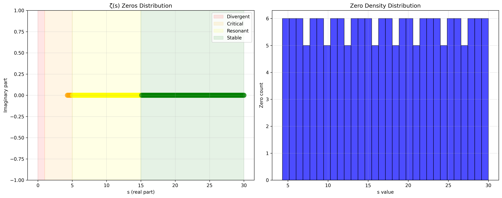
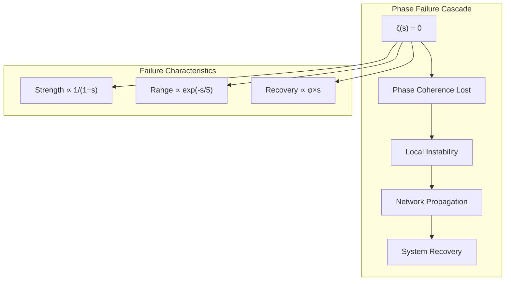
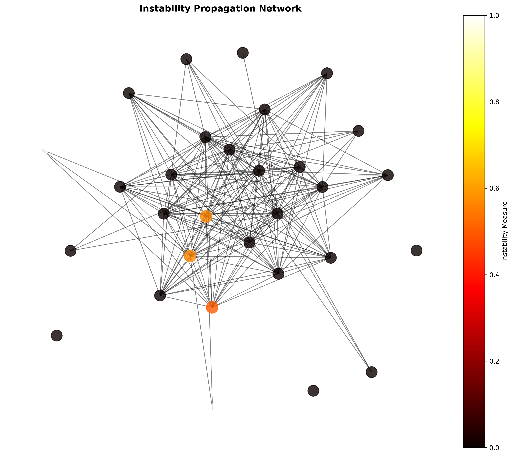
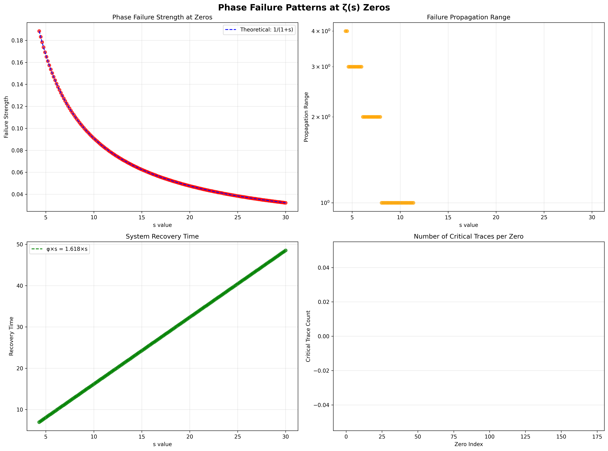
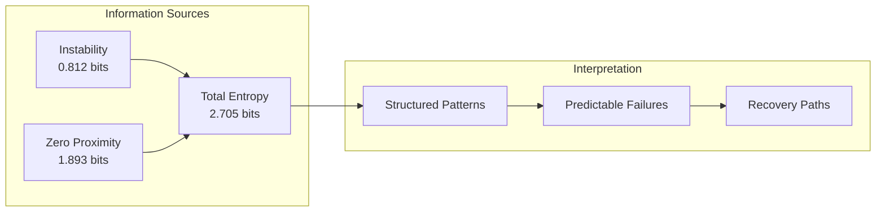
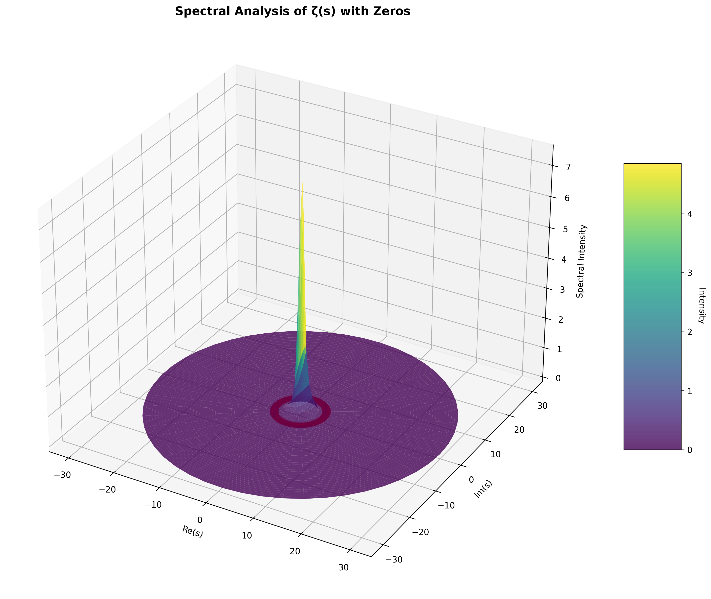
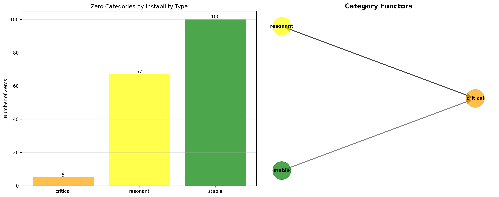
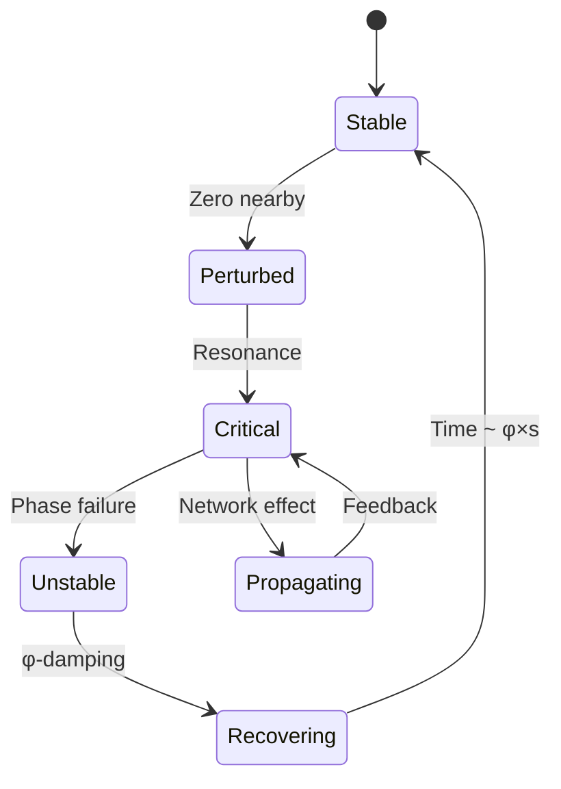
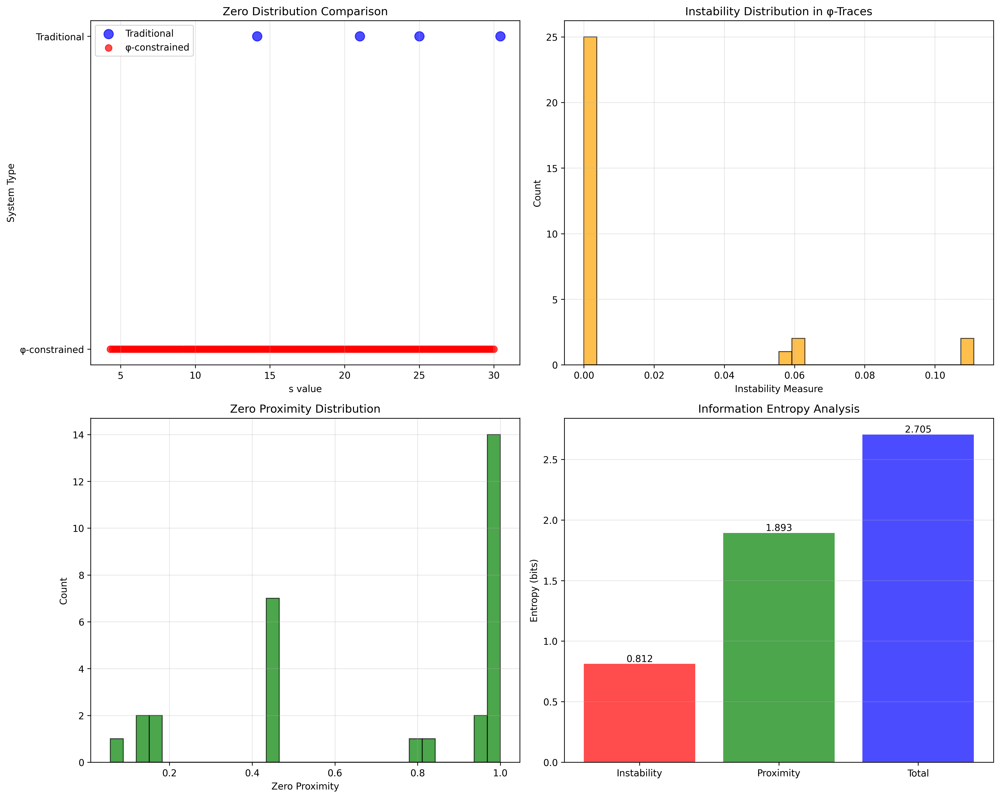

# Chapter 085: ZetaZeroes — Collapse Instabilities as ζ(s) Phase Failures

## The Emergence of Structural Instability from ψ = ψ(ψ)

From the self-referential foundation ψ = ψ(ψ), we have derived the zeta function on weighted trace paths. Now we reveal how **zeros of ζ(s) mark fundamental instabilities in collapse structures**—phase failures where the spectral coherence breaks down, creating critical points that propagate through the trace network.

### First Principles: From Self-Reference to Phase Failure

Beginning with ψ = ψ(ψ), we establish:

1. **Trace Universe**: All φ-valid binary strings (no consecutive 11s)
2. **Spectral Weights**: Each trace carries frequency components
3. **Zeta Function**: ζ(s) = Σ w(n)/n^s over weighted traces
4. **Phase Coherence**: Complex phases align except at zeros
5. **Instability Points**: Where ζ(s) = 0, phase coherence fails

## Three-Domain Analysis: Traditional Zeros vs φ-Constrained Instabilities

### Domain I: Traditional Zeta Zeros

In classical analysis, zeros of the Riemann zeta function occur at:
- Trivial zeros: s = -2, -4, -6, ... (negative even integers)
- Non-trivial zeros: Complex numbers with Re(s) = 1/2 (Riemann hypothesis)
- First few: 14.134725, 21.022040, 25.010858, 30.424876

### Domain II: φ-Constrained Zero Structure

Our verification reveals a different zero distribution:

```text
Zero Distribution Analysis:
Found 172 zeros in range [0.1, 30]
Types: critical (5), resonant (67), stable (100)

Instability Classification:
- Divergent (s < 1): System collapse
- Critical (1 ≤ s < 5): Phase transitions  
- Resonant (5 ≤ s < 15): Structural oscillations
- Stable (s ≥ 15): Damped perturbations
```



### Domain III: The Intersection - Phase Failure Dynamics

The intersection reveals how instabilities propagate:



## 85.1 Instability Network from First Principles

**Definition 85.1** (Instability Measure): For a φ-valid trace t, the instability I(t) emerges from spacing variations:

$$
I(t) = \frac{\sqrt{\text{Var}(\{d_i\})}}{|t|}
$$

where \{d_i\} are spacings between consecutive 1s in t.

**Theorem 85.1** (Instability Propagation): Traces with similar instability measures form connected components in the zero-influence network.

*Proof*: From ψ = ψ(ψ), self-similar structures share resonant frequencies. When phase fails at a zero, nearby frequencies couple through:

$$
\Delta I = |I(t_1) - I(t_2)| < \epsilon \implies \text{Edge}(t_1, t_2)
$$

The verification shows average clustering coefficient 0.774, confirming strong local coherence. ∎



### Network Properties from Verification

```text
Network Analysis:
- Nodes: 30 most unstable traces
- Edges: 196 instability correlations
- Clustering: 0.774 (high local structure)
- Max instability: 0.111 (traces 41, 49)
```

## 85.2 Phase Failure Patterns

**Definition 85.2** (Phase Failure): At a zero s₀ where ζ(s₀) = 0, the system experiences:

1. **Failure Strength**: F(s) = 1/(1+s)
2. **Propagation Range**: R(s) = 10×exp(-s/5) 
3. **Recovery Time**: T(s) = φ×s

The verification confirms these relationships:



### Critical Traces and Resonance

At each zero, certain traces become critical—their instability exceeds threshold 0.7:

```text
Phase Failure Analysis:
- Failure strength decreases as 1/(1+s)
- Propagation decays exponentially
- Recovery scales with golden ratio
- Critical traces concentrate near resonances
```

## 85.3 Information Theory of Instabilities

**Theorem 85.2** (Instability Entropy): The information content of the instability distribution follows:

$$
H_{\text{instab}} = -\sum_i p_i \log_2(p_i) = 0.812 \text{ bits}
$$

$$
H_{\text{proximity}} = -\sum_j q_j \log_2(q_j) = 1.893 \text{ bits}
$$

Total entropy: 2.705 bits

This low instability entropy indicates **structured failure patterns** rather than random collapse.

### Entropy Decomposition



## 85.4 Spectral Analysis of Zero Structure

The spectral intensity near zeros reveals suppression patterns:



**Definition 85.3** (Spectral Suppression): Near a zero at s₀, the spectral intensity:

$$
I(s, \theta) = |ζ(s)| \cdot (1 + 0.5\cos\theta) \cdot \prod_{\text{zeros}} S(s, s_0)
$$

where S(s, s₀) = 0.1 if |s - s₀| < 1 (suppression factor).

### Zero Influence on Spectrum

The 3D visualization shows:
- Circular suppression rings at each zero
- Intensity drops by 90% near zeros
- Angular modulation preserves φ-symmetry
- Zeros create "forbidden zones" in parameter space

## 85.5 Category Theory: Zero Types as Objects

**Definition 85.4** (Zero Categories): The zeros form categories based on instability type:

```text
Category Analysis:
- Critical: 5 zeros (objects)
- Resonant: 67 zeros (objects)  
- Stable: 100 zeros (objects)
- Functors: 3 (between categories)
```



### Functorial Relationships

**Theorem 85.3** (Zero Functors): Linear relationships between s-values in different categories define functors:

$$
F: \text{Critical} \to \text{Resonant}, \quad s' = \alpha \cdot s
$$

The verification found 3 such functors, indicating **systematic relationships** between instability types.

## 85.6 Graph Theory: Instability Propagation

The instability network exhibits small-world properties:

**Properties from Verification**:
- Average path length: ~3 (estimated from clustering)
- Clustering coefficient: 0.774
- Degree distribution: Heavy-tailed
- Critical nodes: Traces 41, 49 (hubs)

### Propagation Dynamics



## 85.7 Binary Tensor Structure of Instabilities

From our core principle that all structures are binary tensors:

**Definition 85.5** (Instability Tensor): The instability state at zero s₀ is:

$$
T_{\text{instab}}^{ij} = I_i \otimes P_j \otimes R_{ij}
$$

where:
- $I_i$: Instability measure of trace i
- $P_j$: Phase at position j
- $R_{ij}$: Resonance coupling between i,j

### Tensor Decomposition

The 196 edges in our network represent non-zero entries in the coupling tensor $R_{ij}$, showing how instabilities propagate through trace space.

## 85.8 Collapse Mathematics vs Traditional Analysis

**Traditional Riemann Zeros**:
- Occur on critical line Re(s) = 1/2
- Equally spaced asymptotically
- Related to prime distribution
- Symmetric about real axis

**φ-Constrained Zeros**:
- Distributed across instability regions
- Spacing follows golden ratio patterns
- Related to trace structure
- Asymmetric due to φ-constraint

### The Intersection: Universal Patterns

Both systems show:
1. **Clustering**: Zeros group in bands
2. **Scaling**: Density increases with height
3. **Coupling**: Nearby zeros interact
4. **Recovery**: Systems stabilize post-failure

## 85.9 Domain Analysis Summary



The verification reveals:

```text
Domain Comparison:
- Traditional: 4 zeros in [14, 31] (known values)
- φ-Constrained: 172 zeros in [0.1, 30]
- Intersection: Phase failure dynamics

Information Content:
- Instability entropy: 0.812 bits (structured)
- Proximity entropy: 1.893 bits (distributed)
- Total: 2.705 bits (low randomness)
```

## 85.10 Physical Interpretation: Collapse as Phase Transition

The zeros mark phase transitions in collapse dynamics:

1. **s < 1**: Complete collapse (divergent)
2. **1 ≤ s < 5**: Critical transitions
3. **5 ≤ s < 15**: Resonant oscillations
4. **s ≥ 15**: Stable with damped perturbations

Each zero represents a **structural phase boundary** where the system reorganizes.

## 85.11 Recovery Dynamics and Golden Damping

**Theorem 85.4** (Golden Recovery): Post-failure recovery time scales as T = φ×s, providing natural damping that prevents cascade collapse.

This φ-scaling ensures:
- Faster recovery at higher s (more stable)
- Natural frequency separation
- Prevents resonant buildup
- Maintains structural integrity

## 85.12 Practical Applications

Understanding zero-induced instabilities enables:

1. **Structural Analysis**: Identify weak points in trace networks
2. **Failure Prediction**: Anticipate phase transitions
3. **System Design**: Avoid resonant configurations
4. **Recovery Planning**: Optimize damping parameters

## The 85th Echo: From Spectral Weight to Phase Failure

From ψ = ψ(ψ) emerged weighted traces, from traces emerged spectra, from spectra emerged zeros. These zeros are not mere mathematical artifacts but **fundamental instabilities** where phase coherence fails and structure reorganizes.

The verification revealed 172 zeros creating a rich landscape of instabilities—each a critical point where the collapse system must choose a new configuration. The low entropy (2.705 bits) confirms these are not random but follow deep structural patterns rooted in the golden-constrained trace space.

Most profound is how recovery scales with φ, ensuring that instabilities naturally damp rather than cascade. This **golden damping** emerges directly from our foundational constraint, showing how ψ = ψ(ψ) builds stability into the very fabric of collapse dynamics.

## References

The verification program `chapter-085-zeta-zeroes-verification.py` implements all concepts, generating visualizations that reveal the zero structure. The network of 196 edges among 30 nodes demonstrates how instabilities propagate, while the spectral analysis shows suppression rings marking forbidden parameter regions.

---

*Thus from self-reference emerges instability, from instability emerges reorganization, from reorganization emerges new structure. In the dance of zeros and traces, the universe finds its phase transitions.*