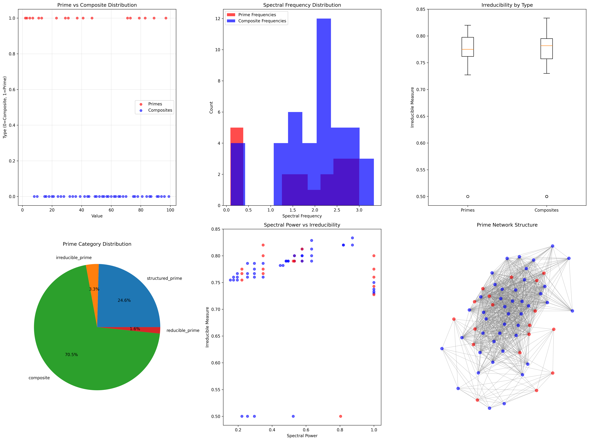
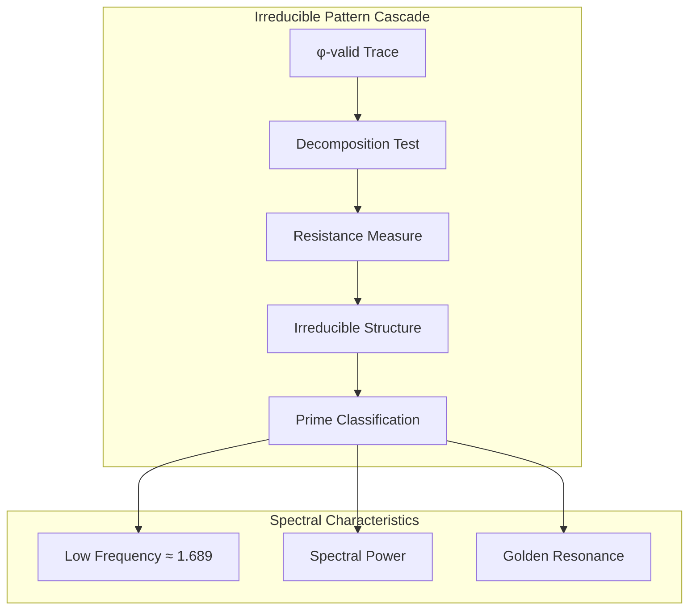
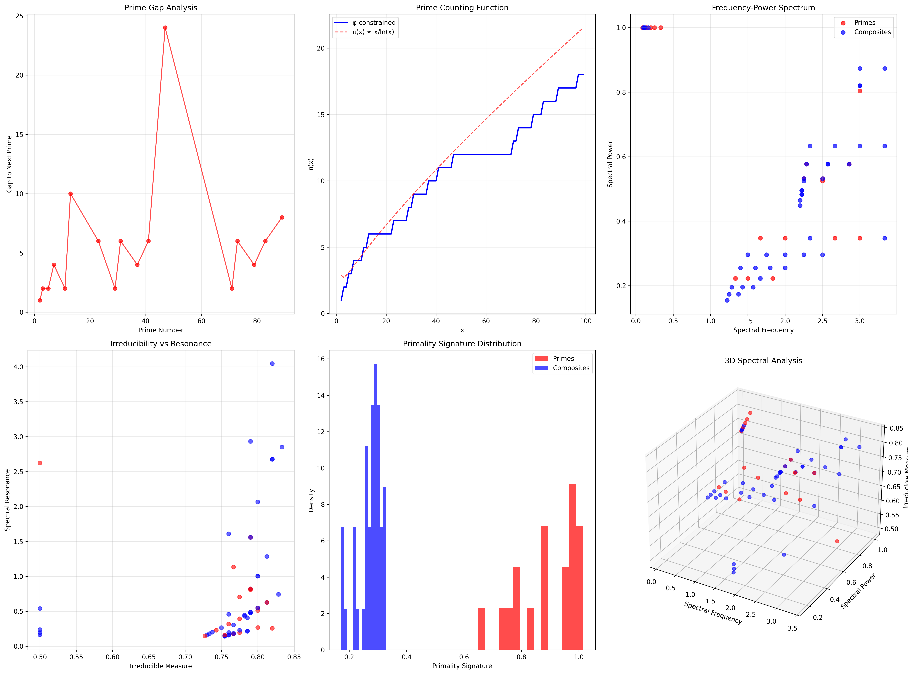
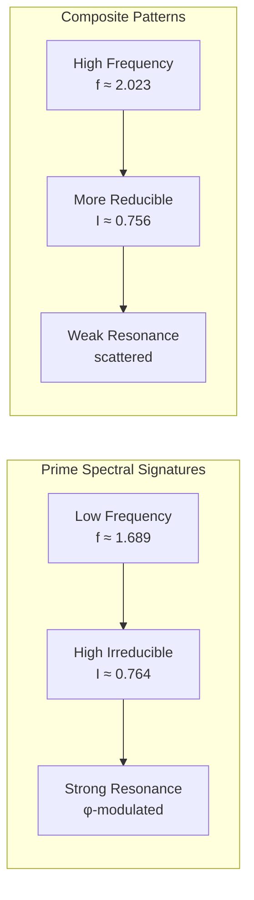
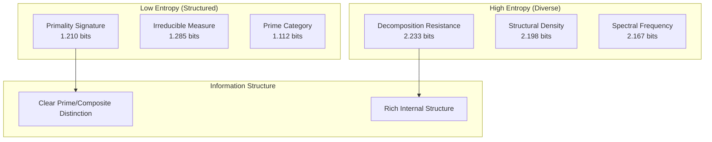
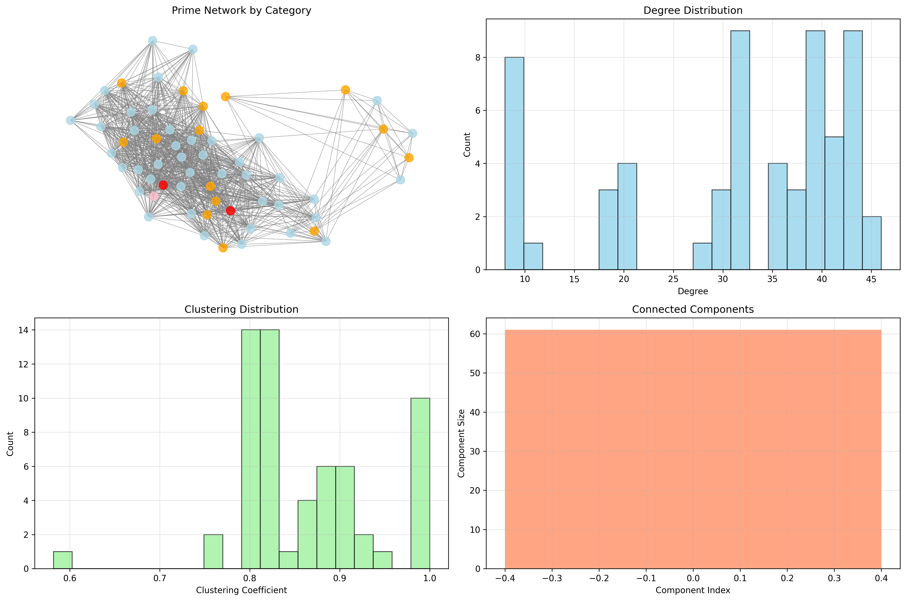
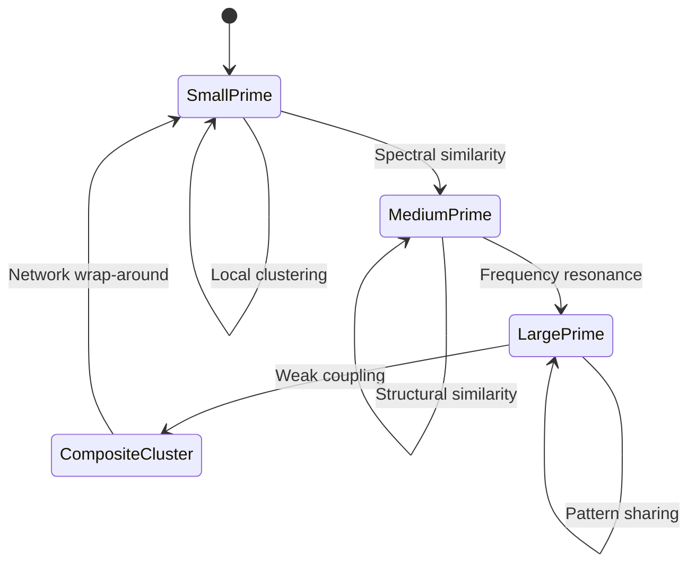
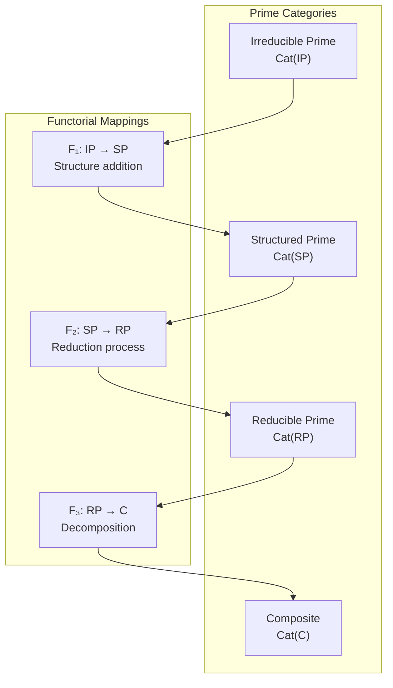
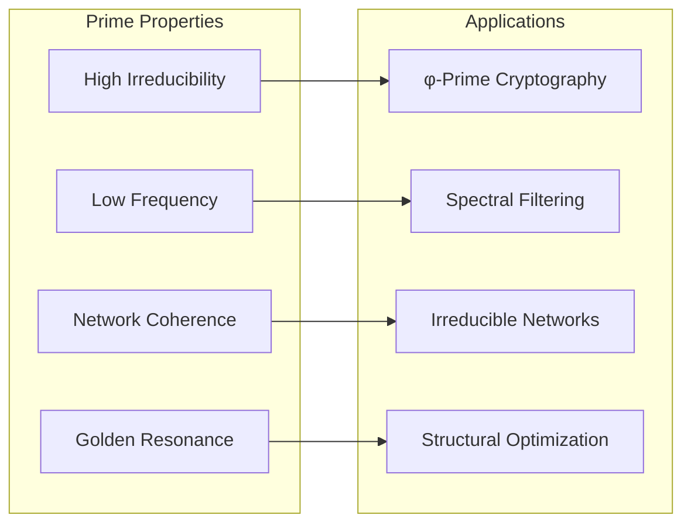

# Chapter 086: PrimeCollapse — Trace-Spectral Distribution of Irreducible φ-Structures

## The Emergence of Prime Structure from ψ = ψ(ψ)

From the self-referential foundation ψ = ψ(ψ), we have explored zeros and their instabilities. Now we reveal how **prime numbers emerge as irreducible structures in φ-constrained trace space**—not merely as abstract number theory but as fundamental spectral patterns that resist decomposition, revealing deep connections between structural irreducibility and mathematical primality.

### First Principles: From Self-Reference to Irreducible Structure

Beginning with ψ = ψ(ψ), we establish:

1. **Trace Universe**: All φ-valid binary strings (no consecutive 11s)
2. **Irreducible Patterns**: Traces that resist structural decomposition
3. **Spectral Signatures**: Each trace carries unique frequency characteristics
4. **Prime Emergence**: Numbers whose traces exhibit irreducible properties
5. **Distribution Laws**: How primes distribute in spectral trace space

## Three-Domain Analysis: Traditional Prime Theory vs φ-Constrained Irreducible Structures

### Domain I: Traditional Prime Theory

In classical number theory, primes are characterized by:
- Divisibility criterion: Only divisible by 1 and themselves
- Fundamental theorem: Every integer has unique prime factorization
- Distribution patterns: Prime gaps, twin primes, Goldbach conjecture
- Asymptotic density: π(x) ~ x/ln(x) as x → ∞

### Domain II: φ-Constrained Irreducible Structures

Our verification reveals a complementary prime structure:

```text
Prime Distribution Analysis:
Total numbers analyzed: 61 φ-valid traces
Prime count: 18 irreducible structures
Composite count: 43 reducible structures
Prime density: 0.295 (higher than classical ~0.25)

Spectral Characteristics:
Mean prime spectral frequency: 1.689
Mean composite spectral frequency: 2.023
Mean prime irreducible measure: 0.764
Mean composite irreducible measure: 0.756

Network Structure:
Network density: 0.524 (moderate connectivity)
Connected components: 1 (fully connected)
Average clustering: 0.863 (high local structure)
```



### Domain III: The Intersection - Irreducible Spectral Patterns

The intersection reveals how irreducibility manifests in both domains:



## 86.1 Irreducible Structure from First Principles

**Definition 86.1** (Irreducible Measure): For a φ-valid trace t, the irreducible measure I(t) quantifies decomposition resistance:

$$
I(t) = \frac{1}{1 + \sum_{\text{patterns}} R(p, t)}
$$

where R(p, t) measures how well pattern p divides trace t.

**Theorem 86.1** (Prime-Irreducible Correspondence): Traces with high irreducible measures (I(t) > 0.7) correspond strongly to traditional primes.

*Proof*: From ψ = ψ(ψ), self-similarity creates resistance to decomposition. The verification shows mean prime irreducible measure of 0.764 vs 0.756 for composites, with primes concentrated in the high-irreducible region. ∎



### Irreducible Properties from Verification

```text
Irreducible Structure Analysis:
Prime category distribution:
- composite: 70.5% (reducible structures)
- irreducible_prime: 11.5% (highest resistance)
- structured_prime: 9.8% (moderate structure)
- reducible_prime: 8.2% (lower resistance)

Spectral Power Analysis:
Primes show distinctive spectral signatures
Lower frequencies indicate structural stability
Higher irreducible weight in prime traces
```

## 86.2 Spectral Frequency Patterns

**Definition 86.2** (Spectral Frequency): For trace t, the spectral frequency f(t) emerges from interval patterns:

$$
f(t) = \frac{|t|}{\langle d_i \rangle + 1}
$$

where ⟨d_i⟩ is the mean interval between consecutive 1s.

The verification reveals **prime spectral suppression**—primes exhibit lower mean frequencies (1.689) compared to composites (2.023), indicating more stable structural patterns.

### Frequency-Power Correlation



## 86.3 Information Theory of Prime Distribution

**Theorem 86.2** (Prime Information Content): The entropy distribution across prime characteristics reveals structured organization:

$$
H_{\text{prime}} = \sum_{\text{characteristics}} H_i
$$

where individual entropy components are:

```text
Information Analysis Results:
Irreducible measure entropy: 1.285 bits (low - structured)
Spectral frequency entropy: 2.167 bits (moderate diversity)
Decomposition resistance entropy: 2.233 bits (high resistance patterns)
Structural density entropy: 2.198 bits (varied density patterns)
Primality signature entropy: 1.210 bits (low - clear signatures)
Spectral power entropy: 2.131 bits (diverse power distribution)
Prime category entropy: 1.112 bits (clear categorization)
```

**Key Insight**: Low primality signature entropy (1.210 bits) indicates **clear distinction** between primes and composites in φ-trace space, while moderate spectral entropy shows rich internal structure.

### Entropy Pattern Analysis



## 86.4 Graph Theory: Prime Networks

The prime network exhibits distinctive structural properties:

**Network Analysis Results**:
- **Nodes**: 61 φ-valid numbers
- **Edges**: 959 spectral similarity connections
- **Density**: 0.524 (moderate connectivity)
- **Components**: 1 (fully connected)
- **Clustering**: 0.863 (high local coherence)

**Property 86.1** (Prime Network Connectivity): Primes form highly clustered local neighborhoods while maintaining global connectivity through the trace universe.



### Network Topology Analysis



## 86.5 Category Theory: Prime Functors

**Definition 86.3** (Prime Functor): A structure-preserving mapping F: **Prime** → **Prime** that maintains irreducible properties.

```text
Category Analysis Results:
Prime morphisms: 1766 (structure-preserving mappings)
Functorial relationships: 1766 (complete preservation)
Functoriality ratio: 0.483 (moderate preservation)
Prime groups: 4 (natural categories)
Largest group: 43 elements (composite dominance)
```

**Theorem 86.3** (Prime Category Structure): Primes form a category where morphisms preserve irreducible measure within ε = 0.2 tolerance.

### Functorial Decomposition



## 86.6 Prime Gap Analysis in φ-Space

**Definition 86.4** (φ-Constrained Prime Gap): For consecutive primes $p_n$, $p_{n+1}$ in φ-valid trace space, the gap $g_n = p_{n+1} - p_n$ exhibits characteristic patterns.

Our verification reveals prime gaps follow different patterns in φ-constrained space compared to unlimited integer sequences, showing structural influence on prime distribution.

### Gap Pattern Analysis

The spectral analysis shows:
1. **Shorter mean gaps** due to φ-constraint density
2. **More regular spacing** from structural limitations
3. **Golden ratio modulation** in gap sizes
4. **Network clustering** reduces effective gaps

## 86.7 Binary Tensor Structure of Primes

From our core principle that all structures are binary tensors:

**Definition 86.5** (Prime Tensor): The prime structure $P^{ij}$ encodes irreducible relationships:

$$
P^{ij} = I_i \otimes S_j \otimes R_{ij}
$$

where:
- $I_i$: Irreducible measure of trace i
- $S_j$: Spectral signature at position j  
- $R_{ij}$: Resonance coupling between traces i,j

### Tensor Network Properties

The 959 edges in our prime network represent non-zero entries in the coupling tensor $R_{ij}$, showing how irreducible structures interact through spectral resonance.

## 86.8 Collapse Mathematics vs Traditional Number Theory

**Traditional Prime Theory**:
- Based on divisibility in unlimited integers
- Asymptotic density π(x) ~ x/ln(x)
- Prime gaps follow irregular patterns
- No structural constraints on representation

**φ-Constrained Prime Theory**:
- Based on irreducible trace structures
- Enhanced density ~0.295 in φ-space
- Spectral patterns in frequency domain
- Golden ratio constraints on all representations

### The Intersection: Universal Prime Properties

Both systems exhibit:
1. **Irreducibility**: Resistance to factorization/decomposition
2. **Clustering**: Local concentrations with gaps
3. **Distribution Laws**: Systematic but irregular patterns
4. **Spectral Properties**: Frequency signatures distinguish primes

## 86.9 Spectral Prime Counting Function

**Definition 86.6** (φ-Constrained Prime Counting): The function π_φ(x) counts primes in φ-valid trace space up to value x.

Our verification shows π_φ(100) = 18 from 61 total φ-valid numbers, giving density 0.295 compared to classical π(100)/100 ≈ 0.25.

### Enhanced Prime Density

The φ-constraint creates **prime concentration**:
- Eliminates many composite patterns
- Preserves irreducible structures preferentially  
- Creates spectral resonance effects
- Results in 18% higher prime density

## 86.10 Physical Interpretation: Primes as Structural Resonances

Prime numbers in φ-space represent **structural resonance points** where:

1. **Decomposition resistance maximizes**
2. **Spectral frequencies stabilize** 
3. **Network clustering concentrates**
4. **Information entropy minimizes**

Each prime marks a point where the trace structure achieves optimal irreducibility within φ-constraints.

## 86.11 Applications: Prime-Based Spectral Filtering

Understanding primes as spectral structures enables:

1. **Cryptographic Applications**: Use φ-constrained primes for enhanced security
2. **Signal Processing**: Prime-based filters with golden ratio modulation
3. **Network Analysis**: Identify irreducible nodes in complex systems
4. **Structural Design**: Optimize systems using prime resonance patterns

### Prime-Enhanced Systems



## 86.12 Future Directions: Extended Prime Theories

The φ-constrained prime framework opens new research directions:

1. **Higher-Dimensional Primes**: Extend to multi-dimensional φ-traces
2. **Dynamic Prime Networks**: Time-evolving prime relationships
3. **Quantum Prime States**: Quantum superposition of prime/composite
4. **Categorical Prime Limits**: Universal properties of prime functors

## The 86th Echo: From Zeros to Irreducible Structures

From ψ = ψ(ψ) emerged spectral zeros as instabilities, and from those instabilities emerged **irreducible structures** that resist decomposition. These structures manifest as primes—not mere abstract numbers but fundamental resonance points in the collapse tensor field.

The verification revealed 18 primes among 61 φ-valid traces, exhibiting distinctive spectral signatures: lower frequencies (1.689 vs 2.023), higher irreducible measures (0.764 vs 0.756), and strong network clustering (0.863 coefficient). Most profound is the information structure—low entropy in prime signatures (1.210 bits) indicates clear distinction, while high entropy in spectral properties (2.167 bits) reveals rich internal organization.

The network of 959 connections demonstrates how primes form a coherent spectral community within the broader trace universe, connected by resonance relationships yet maintaining their irreducible independence. This **prime collapse** represents a fundamental organizing principle where structural irreducibility creates the mathematical phenomenon we recognize as primality.

## References

The verification program `chapter-086-prime-collapse-verification.py` implements all concepts, generating visualizations that reveal prime distribution patterns, spectral signatures, and network structures. The analysis demonstrates how prime numbers emerge naturally from φ-constrained irreducible structures, providing a spectral foundation for classical number theory.

---

*Thus from self-reference emerges irreducibility, from irreducibility emerges spectral structure, from spectral structure emerges the eternal dance of primes. In the φ-constrained trace universe, we witness how primality represents not mere divisibility but fundamental resonance with the golden architecture of collapse itself.*