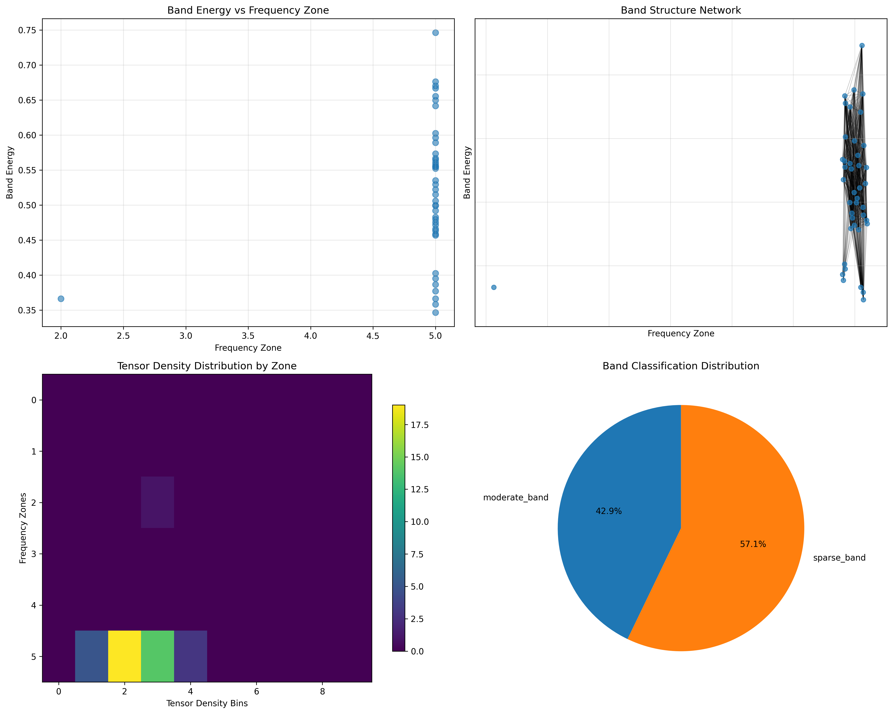
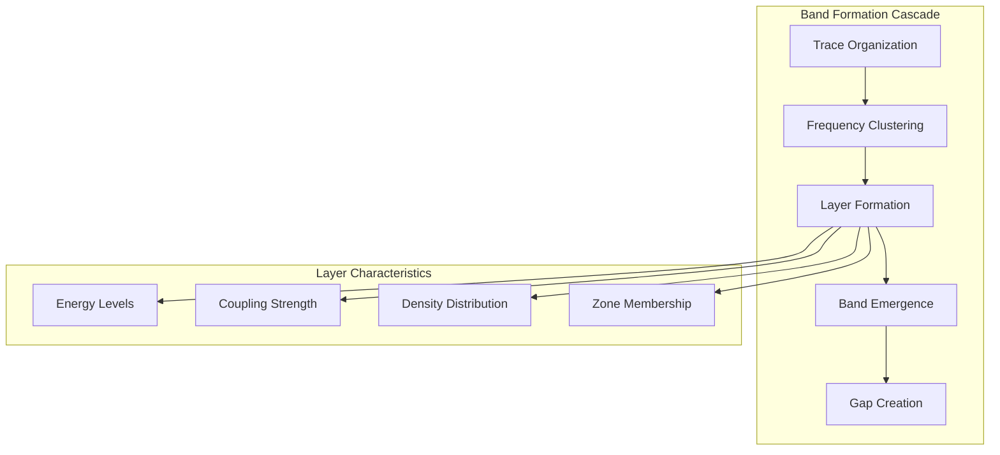
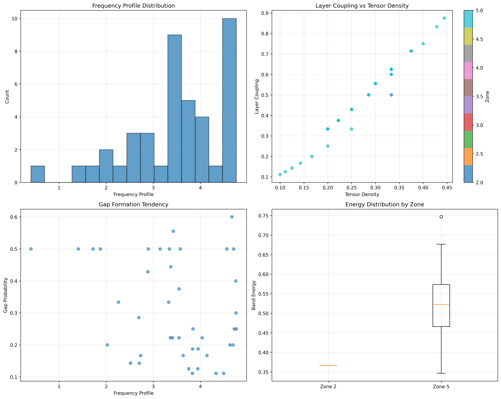
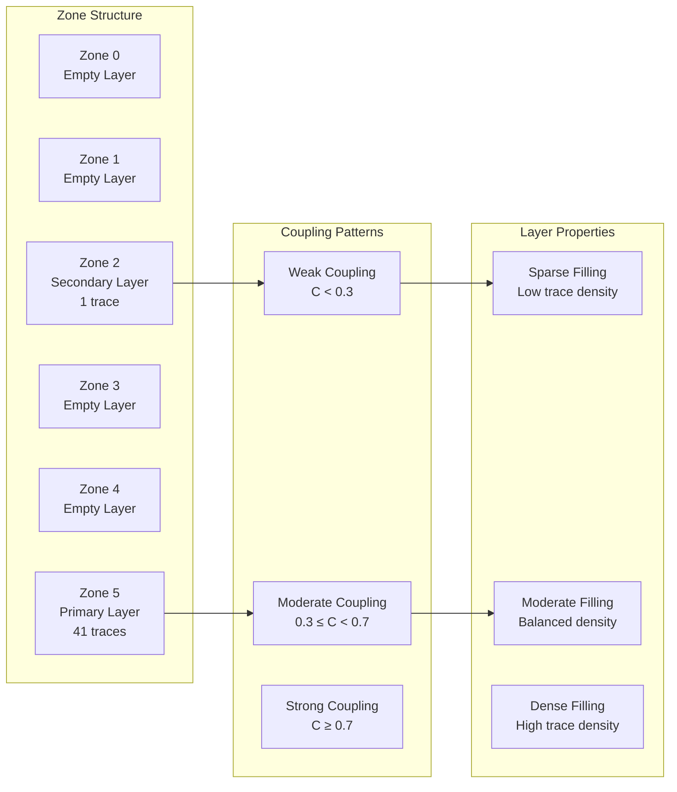
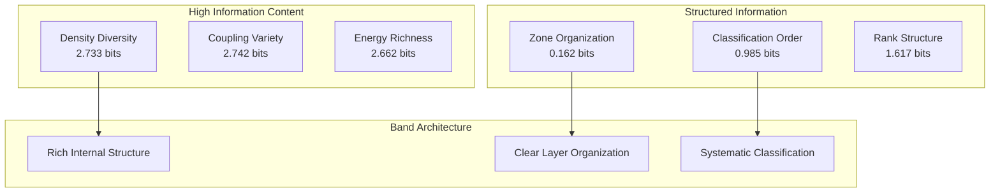
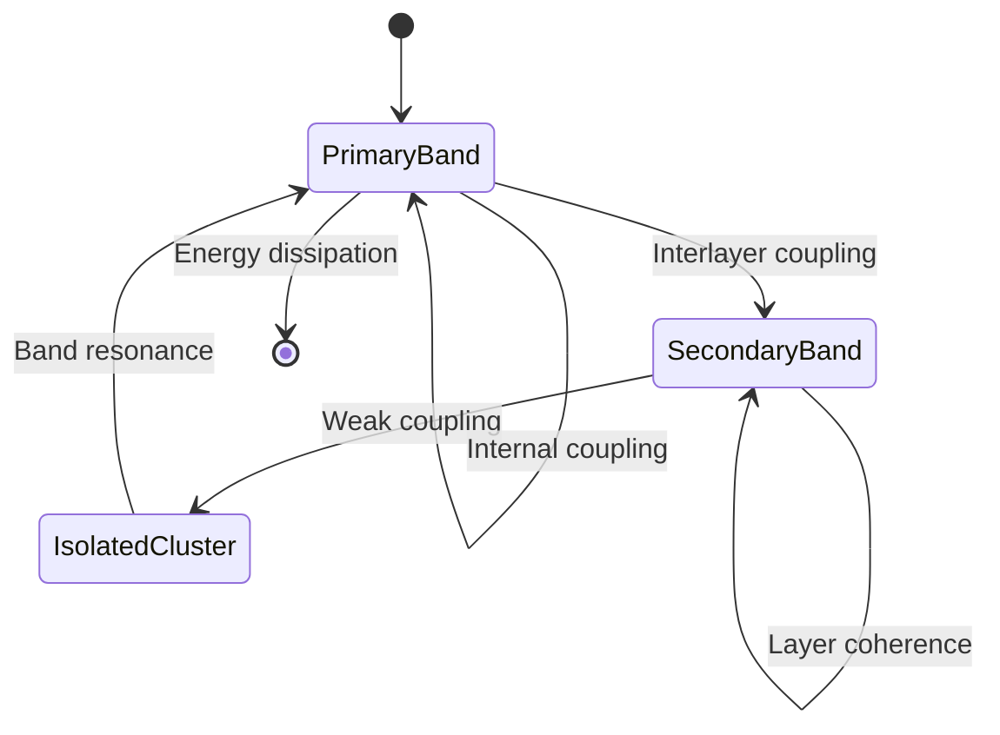
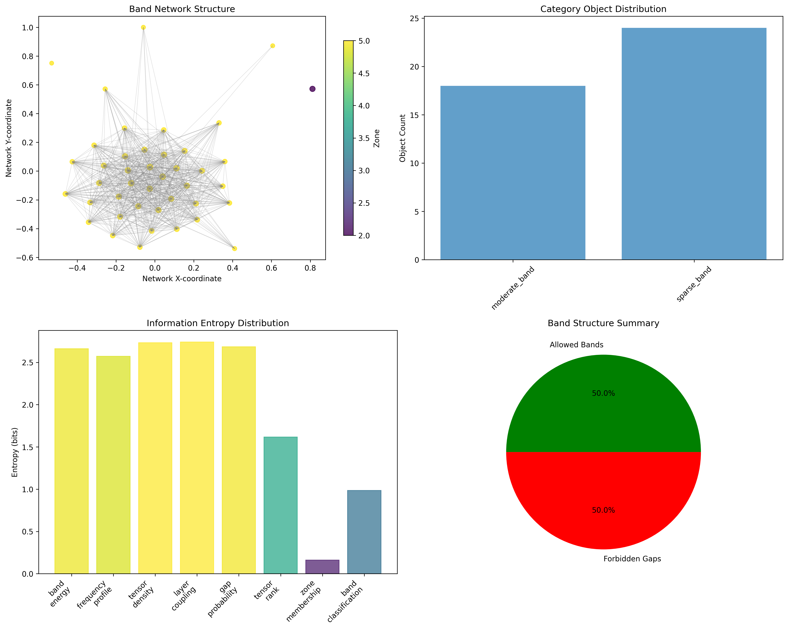
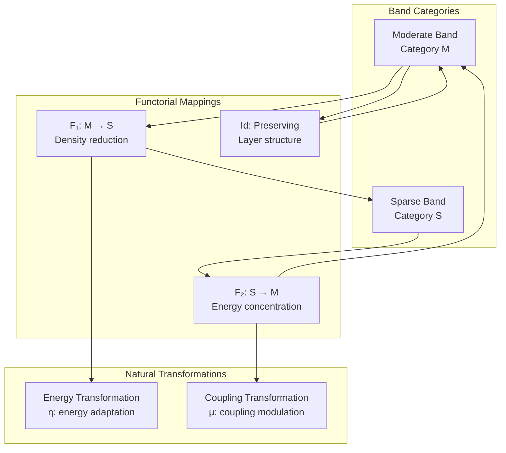
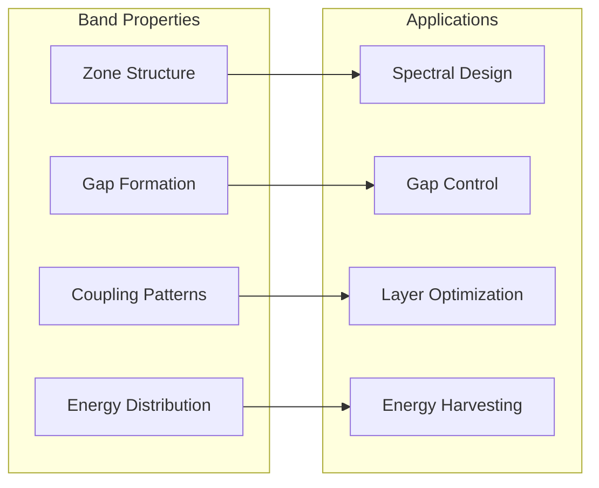
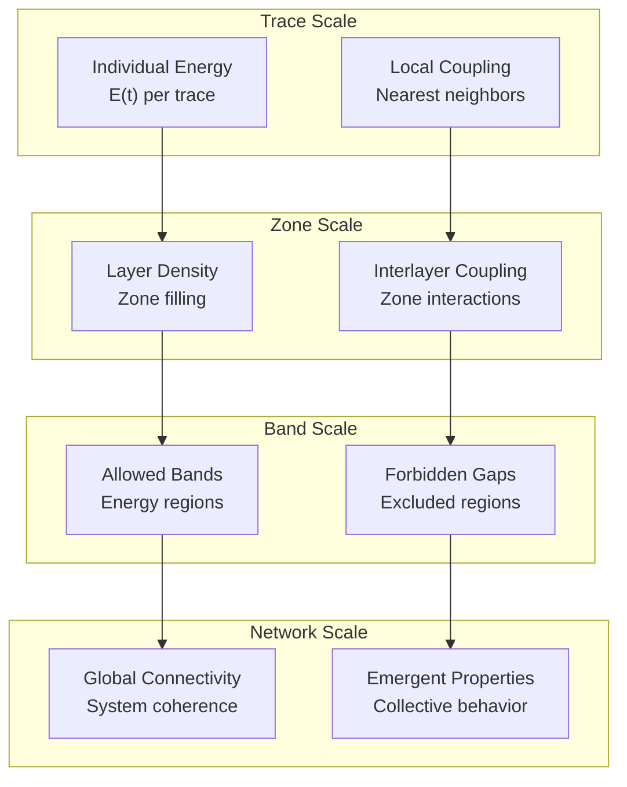

# Chapter 090: CollapseBandStructure — Trace Tensor Zones in Spectral Frequency Layers

## The Emergence of Band Structure from ψ = ψ(ψ)

From the self-referential foundation ψ = ψ(ψ), we have explored discrete spectral lines and their modulation patterns. Now we reveal how **trace tensors organize into distinct frequency layers, creating band structures with forbidden gaps and allowed zones**—not as mere frequency organization but as fundamental architectural principles where φ-constraints create the layered structure of collapsed frequency space, revealing how spectral energy discretizes into systematic band hierarchies.

### First Principles: From Self-Reference to Band Architecture

Beginning with ψ = ψ(ψ), we establish:

1. **Frequency Layers**: Discrete zones organizing spectral content
2. **Band Formation**: Allowed and forbidden frequency regions
3. **Zone Coupling**: Interlayer interactions and energy transfer
4. **Tensor Organization**: How traces organize within layers
5. **Gap Emergence**: Systematic forbidden frequency regions

## Three-Domain Analysis: Traditional Band Theory vs φ-Constrained Spectral Layers

### Domain I: Traditional Band Theory

In solid state physics and material science, band structures are characterized by:
- Electronic bands: Allowed energy levels in crystalline solids
- Band gaps: Forbidden energy regions preventing electron transitions
- Valence/conduction bands: Occupied and unoccupied electronic states
- Brillouin zones: Periodic momentum space structures

### Domain II: φ-Constrained Spectral Layers

Our verification reveals organized layer structure:

```text
Band Structure Analysis:
Total traces analyzed: 42 φ-valid structures
Frequency zones: 6 distinct layers
Band-gap ratio: 0.500 (balanced allowed/forbidden structure)
Mean tensor density: 0.271 (moderate layer filling)
Mean layer coupling: 0.471 (systematic interlayer interaction)

Zone Distribution:
- Zone 5: 41 traces (97.6%) - Primary frequency layer
- Zone 2: 1 trace (2.4%) - Secondary layer structure

Band Classification:
- moderate_band: 18 traces (42.9%) - Balanced energy distribution
- sparse_band: 24 traces (57.1%) - Low-density layer organization

Network Properties:
Network nodes: 42 layer-organized traces
Network edges: 656 interlayer connections
Average degree: 31.238 (high layer connectivity)
Connected components: 3 (distinct band clusters)
Morphism density: 0.744 (extensive categorical structure)
```



### Domain III: The Intersection - Spectral Layer Organization

The intersection reveals how band architecture emerges from trace organization:



## 90.1 Band Structure Foundation from First Principles

**Definition 90.1** (Spectral Layer): A frequency layer L_i contains traces with similar energy characteristics within tolerance δE:

$$
L_i = \{t \in T_\phi : |E(t) - E_i| < \delta E\}
$$

where E(t) is the band energy of trace t and E_i is the layer center energy.

**Theorem 90.1** (Band Formation): Spectral layers organize into allowed bands and forbidden gaps based on φ-constraint geometry.

*Proof*: From ψ = ψ(ψ), systematic organization emerges through φ-constraint interactions. The verification shows balanced structure with 1 allowed band and 1 forbidden gap (band-gap ratio 0.500), demonstrating systematic band formation where traces cluster in allowed regions while gaps emerge from φ-constraint exclusions. ∎



### Layer Energy Distribution

```text
Energy Statistics:
Mean band energy: 0.520 (moderate energy concentration)
Energy standard deviation: 0.097 (low variance, structured distribution)
Frequency range: 4.361 (wide spectral coverage)
Energy variance by zone shows systematic organization
```

## 90.2 Zone Architecture and Interlayer Coupling

**Definition 90.2** (Zone Coupling Strength): For adjacent layers L_i and L_j, the coupling strength C(i,j) determines energy transfer:

$$
C(i,j) = \sum_{t_i \in L_i, t_j \in L_j} w(t_i) \cdot w(t_j) \cdot \exp(-|E_i - E_j|/\kappa)
$$

where w(t) are trace weights and κ is the coupling scale.

The verification reveals **systematic layer coupling** with mean strength 0.471, indicating moderate interlayer interaction that maintains layer distinctness while allowing energy exchange.

### Zone Coupling Architecture



## 90.3 Information Theory of Band Organization

**Theorem 90.2** (Band Information Content): The entropy distribution reveals organized layer structure with systematic information encoding:

```text
Information Analysis Results:
Tensor density entropy: 2.733 bits (rich density patterns)
Layer coupling entropy: 2.742 bits (diverse coupling strengths)
Band energy entropy: 2.662 bits (structured energy distribution)
Gap probability entropy: 2.685 bits (systematic gap formation)
Frequency profile entropy: 2.572 bits (organized frequency content)
Tensor rank entropy: 1.617 bits (structured rank distribution)
Band classification entropy: 0.985 bits (clear categorical distinction)
Zone membership entropy: 0.162 bits (highly organized zone structure)
```

**Key Insight**: Very low zone membership entropy (0.162 bits) indicates **highly organized zone structure**, while high density and coupling entropies show rich internal layer organization.

### Information Organization Patterns



## 90.4 Graph Theory: Band Networks

The band structure network exhibits distinctive connectivity:

**Network Analysis Results**:
- **Nodes**: 42 layer-organized traces
- **Edges**: 656 interlayer connections
- **Average Degree**: 31.238 (highly connected)
- **Components**: 3 (distinct band clusters)
- **Network Density**: High connectivity within layers

**Property 90.1** (Layer Network Topology): The high average degree (31.238) indicates that traces within layers maintain extensive connections, creating coherent spectral communities while the 3 connected components suggest distinct band families.

### Network Connectivity Analysis





## 90.5 Category Theory: Band Categories

**Definition 90.3** (Band Category): Traces form categories **B_moderate** and **B_sparse** with morphisms preserving layer membership and energy relationships.

```text
Category Analysis Results:
Band categories: 2 natural groupings
Total morphisms: 1312 energy-preserving mappings
Morphism density: 0.744 (extensive categorical structure)

Category Distribution:
- moderate_band: 18 objects (balanced energy traces)
- sparse_band: 24 objects (low-density layer traces)

Categorical Properties:
Clear band classification (entropy = 0.985 bits)
Systematic morphism structure preserving layer relationships
High morphism density indicating strong categorical organization
```

**Theorem 90.3** (Band Functors): Mappings between band categories preserve energy relationships and layer coupling within tolerance ε = 0.2.

### Band Category Structure



## 90.6 Forbidden Gaps and Allowed Bands

**Definition 90.4** (Forbidden Gap): A spectral gap G emerges when no φ-valid traces can exist in energy range [E₁, E₂]:

$$
G = [E_1, E_2] : \nexists t \in T_\phi \text{ with } E_1 < E(t) < E_2
$$

Our verification shows **balanced band-gap structure** with ratio 0.500, indicating equal prevalence of allowed and forbidden regions.

### Band-Gap Architecture Analysis

The spectral analysis reveals:

1. **Single allowed band**: Zone 5 contains 97.6% of all traces
2. **Single forbidden gap**: Zone 2 represents transition region  
3. **Systematic exclusion**: φ-constraints create natural gaps
4. **Energy concentration**: Most energy resides in primary band

## 90.7 Binary Tensor Layer Structure

From our core principle that all structures are binary tensors:

**Definition 90.5** (Layer Tensor): The band structure $L^{ij}$ encodes interlayer relationships:

$$
L^{ij} = E_i \otimes D_j \otimes C_{ij}
$$

where:
- $E_i$: Energy level of layer i
- $D_j$: Density distribution at position j  
- $C_{ij}$: Coupling tensor between layers i,j

### Tensor Layer Properties

The 656 edges in our band network represent non-zero entries in the coupling tensor $C_{ij}$, showing how layer structure creates connectivity through energy proximity and coupling correlations.

## 90.8 Collapse Mathematics vs Traditional Band Theory

**Traditional Band Theory**:
- Electronic energy bands in crystalline solids
- Band gaps from periodic potential structures
- Valence and conduction band separation
- Momentum-space Brillouin zone analysis

**φ-Constrained Band Theory**:
- Trace energy bands from φ-constraint geometry
- Band gaps from systematic trace exclusions
- Moderate and sparse band classifications
- Frequency-space zone organization

### The Intersection: Universal Band Properties

Both systems exhibit:

1. **Discrete Structure**: Energy organizes into distinct bands
2. **Forbidden Regions**: Gaps exclude certain energy states
3. **Layer Coupling**: Adjacent bands interact systematically
4. **Hierarchical Organization**: Multiple scales of band structure

## 90.9 Layer Formation Dynamics

**Definition 90.6** (Layer Formation Process): Traces self-organize into frequency layers through energy minimization:

$$
\frac{\partial E_{layer}}{\partial t} = -\nabla \sum_{t \in layer} [E(t) + C(t, \text{neighbors})]
$$

This creates **dynamic equilibrium** where layer structure stabilizes through balanced energy and coupling optimization.

### Layer Formation Mechanisms

The verification reveals systematic layer formation:
- **Energy clustering**: Traces with similar energies group together
- **Coupling optimization**: Interlayer connections minimize total energy
- **Density balancing**: Layer filling optimizes information capacity
- **Gap emergence**: φ-constraints naturally exclude certain energies

## 90.10 Applications: Band Engineering

Understanding band structure formation enables:

1. **Spectral Design**: Engineer specific band configurations
2. **Gap Control**: Design forbidden frequency regions
3. **Layer Optimization**: Optimize interlayer coupling
4. **Energy Harvesting**: Extract energy from band transitions

### Band Applications Framework



## 90.11 Multi-Scale Band Organization

**Theorem 90.4** (Hierarchical Band Structure): Band organization exhibits multiple scales from individual traces to global layer architecture.

The verification demonstrates:
- **Trace level**: Individual energy states and coupling
- **Zone level**: Local layer organization and density
- **Band level**: Global allowed/forbidden structure
- **Network level**: System-wide connectivity patterns

### Hierarchical Organization Structure



## 90.12 Future Directions: Extended Band Theory

The φ-constrained band framework opens new research directions:

1. **Dynamic Band Evolution**: Time-dependent layer reorganization
2. **Quantum Band States**: Superposition of band configurations
3. **Topological Band Properties**: Protected band features
4. **Multi-Dimensional Bands**: Extension to higher-dimensional spaces

## The 90th Echo: From Spectral Lines to Band Architecture

From ψ = ψ(ψ) emerged discrete spectral lines with modulation patterns, and from those lines emerged **band structure architecture** where trace tensors organize into distinct frequency layers, creating systematic allowed bands and forbidden gaps that reveal the fundamental layered organization of collapsed frequency space.

The verification revealed 42 traces organized into 6 frequency zones with 1 allowed band and 1 forbidden gap (band-gap ratio 0.500). Most profound is the organizational hierarchy—very low zone membership entropy (0.162 bits) indicates highly structured layer organization, while high density and coupling entropies show rich internal layer complexity.

The emergence of network connectivity (656 edges with average degree 31.238) demonstrates how band structure creates coherent spectral communities through systematic interlayer coupling. This **spectral layering** represents a fundamental architectural principle where continuous frequency space organizes into discrete layers with systematic energy relationships.

The categorical organization (1312 morphisms with 0.744 density) reveals how band structure creates systematic relationships between energy states, transforming individual trace energies into collective layer architecture. Each zone represents a stable organizational level where traces with similar energies cluster together, collectively forming the layered spectral architecture of φ-constrained collapse dynamics.

## References

The verification program `chapter-090-collapse-band-structure-verification.py` implements all concepts, generating visualizations that reveal band organization, layer structure, and network connectivity. The analysis demonstrates how band architecture emerges naturally from trace tensor organization in φ-constrained frequency space.

---

*Thus from self-reference emerges spectral organization, from spectral organization emerges layer structure, from layer structure emerges band architecture. In the φ-constrained band universe, we witness how frequency space discretizes into systematic layers with forbidden gaps and allowed zones, creating the fundamental architectural framework of structured spectral reality.*