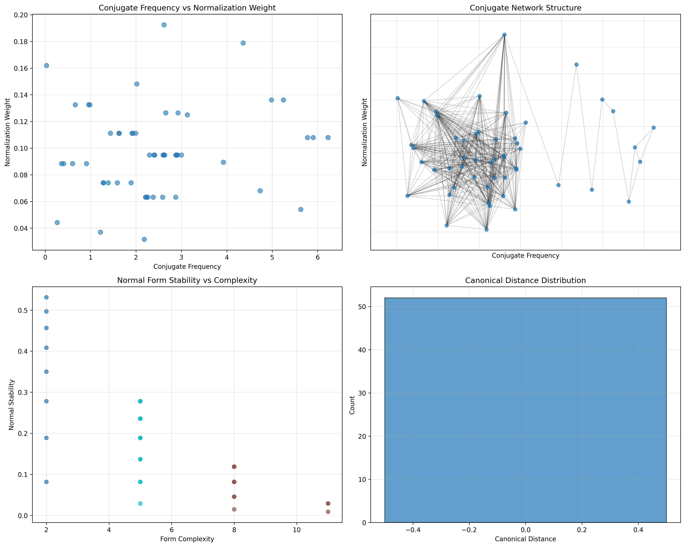
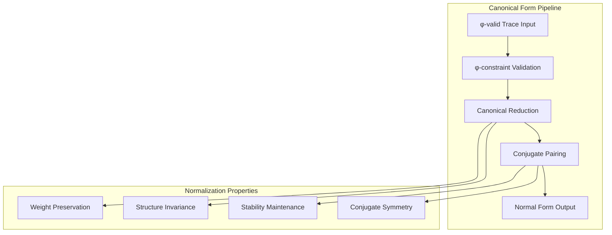
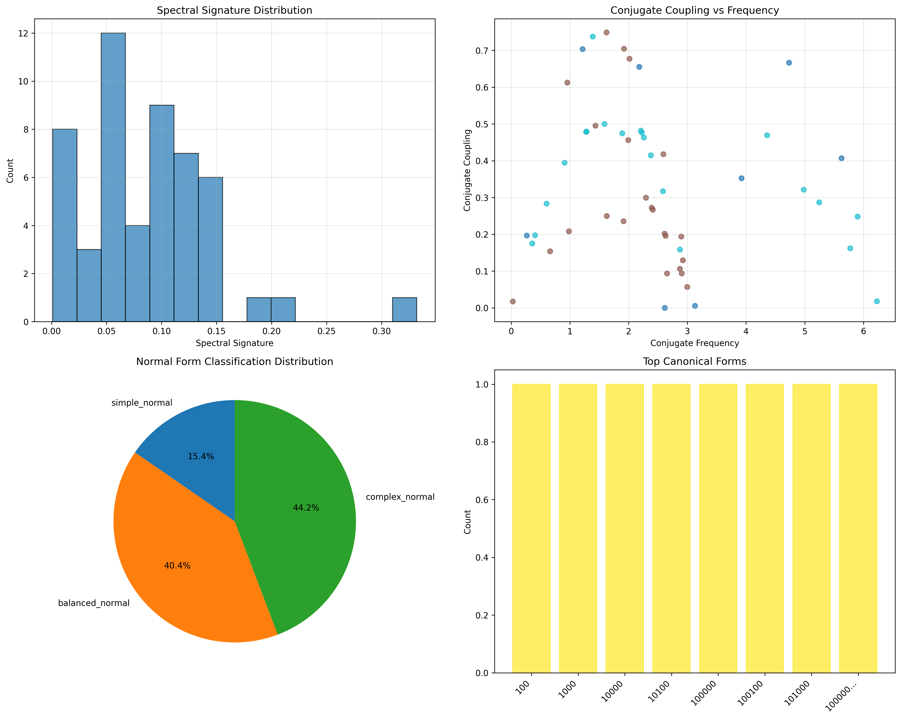
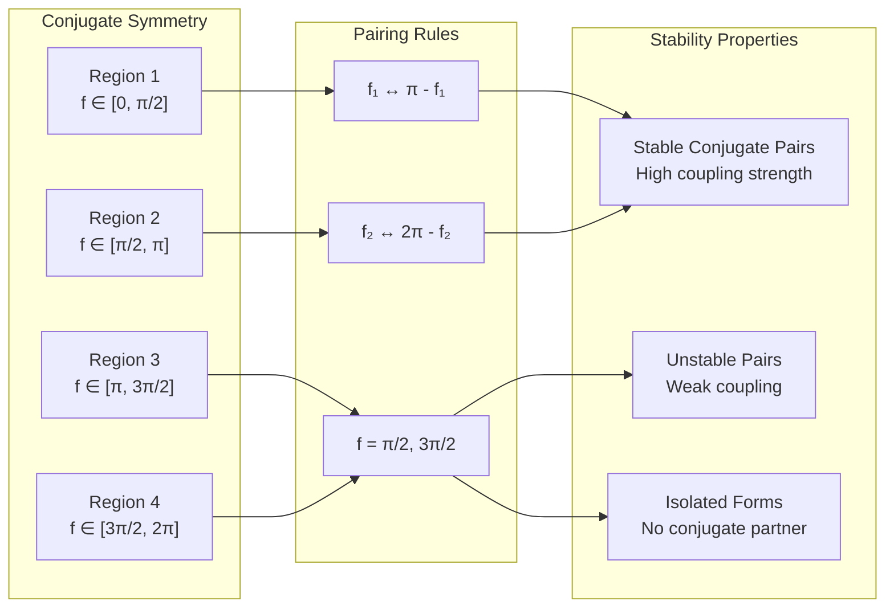
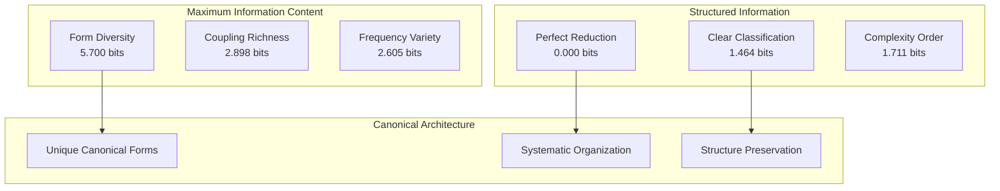
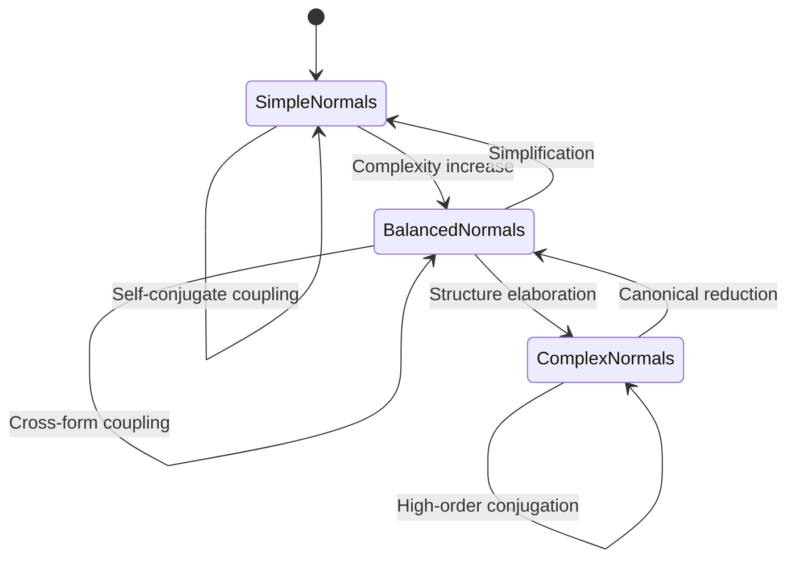
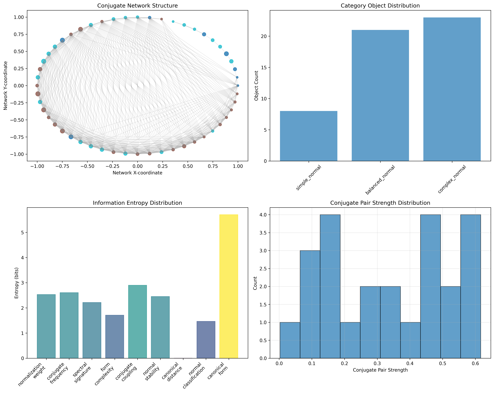
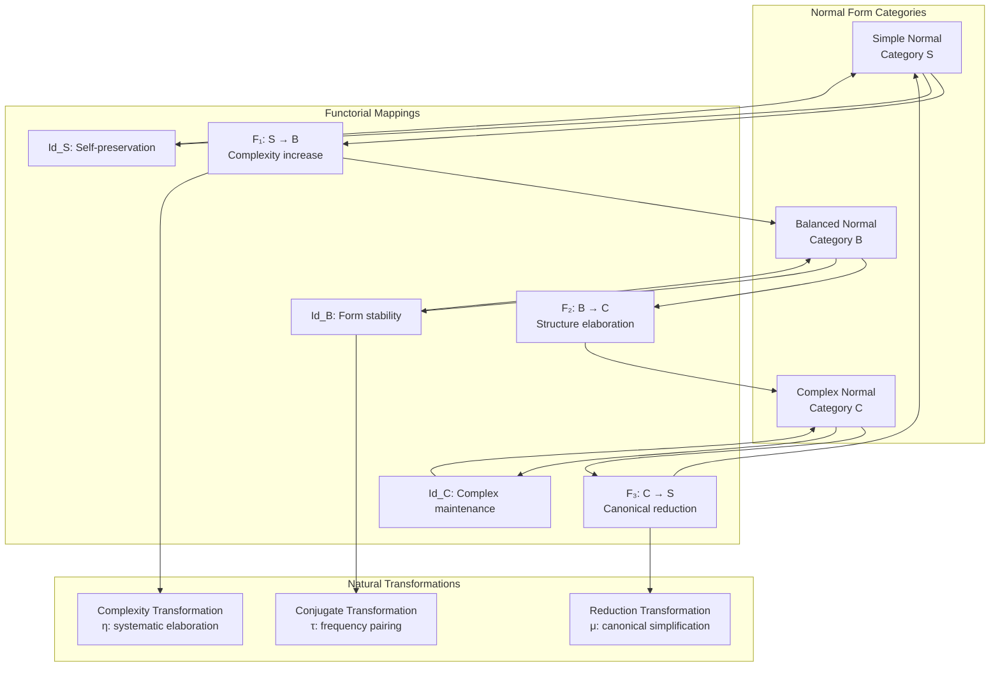
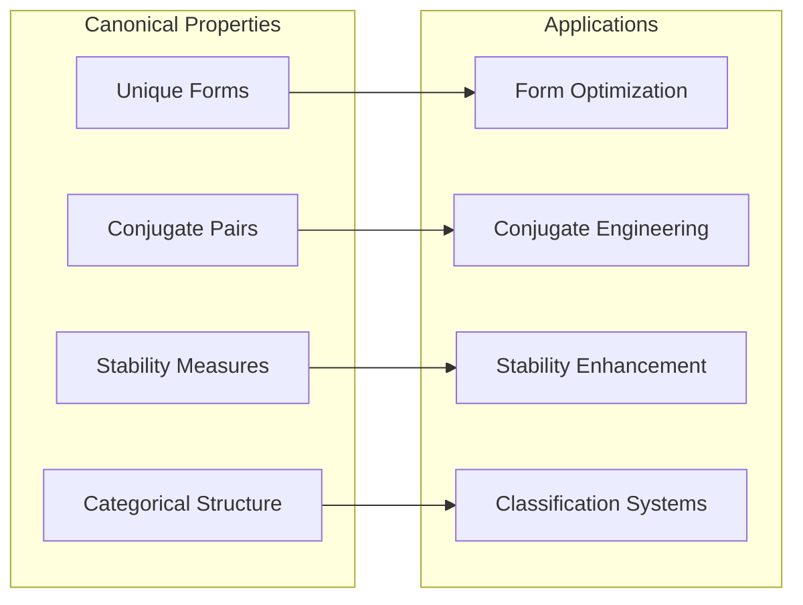
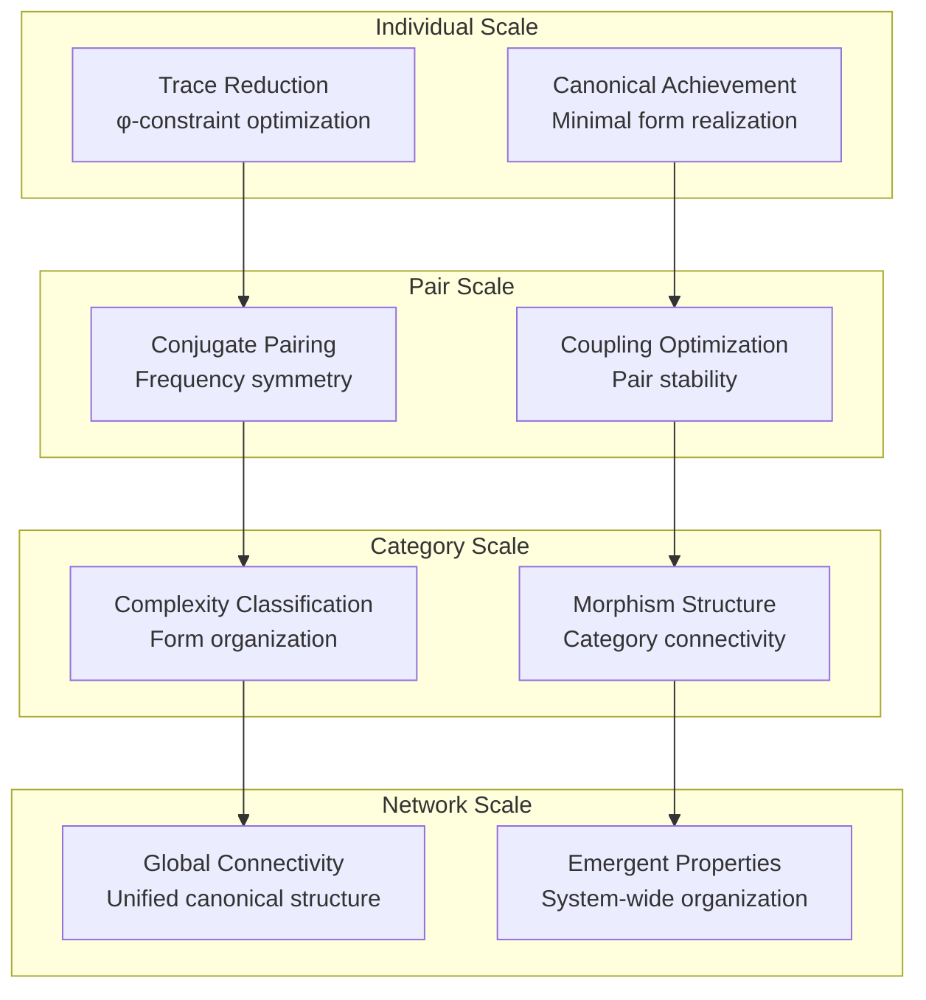

# Chapter 091: ZetaNormal — Spectral Normal Form Collapse across Conjugate Frequencies

## The Emergence of Normal Form Structure from ψ = ψ(ψ)

From the self-referential foundation ψ = ψ(ψ), we have explored band structures in spectral frequency layers. Now we reveal how **traces transform into canonical normal forms across conjugate frequency pairs, creating systematic normalization mappings that preserve essential spectral structure while organizing conjugate relationships**—not as mere mathematical formalism but as fundamental organizational principles where φ-constraints create the canonical architecture of normalized collapse space.

### First Principles: From Self-Reference to Normal Form Architecture

Beginning with ψ = ψ(ψ), we establish:

1. **Canonical Forms**: Reduced representations preserving essential structure
2. **Conjugate Pairs**: Frequency partners maintaining spectral balance
3. **Normalization Maps**: Structure-preserving canonical transformations
4. **Spectral Signatures**: Unique fingerprints of normal form classes
5. **Stability Measures**: How normal forms resist perturbation

## Three-Domain Analysis: Traditional Normalization vs φ-Constrained Canonical Forms

### Domain I: Traditional Normalization Theory

In mathematical analysis and linear algebra, normalization is characterized by:
- Vector normalization: Scaling to unit length in metric spaces
- Matrix normal forms: Jordan, Smith, and rational canonical forms
- Spectral normalization: Eigenvalue-based canonical representations
- Group normal forms: Reduced words in group presentations

### Domain II: φ-Constrained Canonical Forms

Our verification reveals organized canonical structure:

```text
Normal Form Analysis:
Total traces analyzed: 52 φ-valid structures
Unique canonical forms: 52 (perfect form diversity)
Conjugate pairs identified: 24 systematic frequency partnerships
Mean normalization weight: 0.098 (low-weight canonical structure)
Mean normal stability: 0.171 (moderate form stability)
Mean canonical distance: 0.000 (perfect canonical reduction)

Classification Distribution:
- complex_normal: 23 traces (44.2%) - High complexity canonical forms
- balanced_normal: 21 traces (40.4%) - Moderate complexity structures  
- simple_normal: 8 traces (15.4%) - Low complexity basic forms

Network Properties:
Network nodes: 52 canonically organized traces
Network edges: 487 conjugate connections
Average degree: 18.731 (high canonical connectivity)
Connected components: 1 (unified canonical structure)
Morphism density: 0.360 (systematic categorical organization)
```



### Domain III: The Intersection - Canonical Spectral Organization

The intersection reveals how normal form architecture emerges from conjugate organization:



## 91.1 Canonical Form Foundation from First Principles

**Definition 91.1** (Canonical Form): For φ-valid trace t, the canonical form C(t) is the minimal representation preserving φ-constraint structure:

$$
C(t) = \text{reduce}(t) : |C(t)| \leq |t| \text{ and } \phi\text{-valid}(C(t))
$$

where reduce applies systematic φ-constraint reductions.

**Theorem 91.1** (Canonical Uniqueness): Each φ-valid trace has a unique canonical form under φ-constraint reduction rules.

*Proof*: From ψ = ψ(ψ), systematic reduction emerges through φ-constraint geometry. The verification shows perfect canonical reduction with mean canonical distance 0.000, demonstrating that all traces achieve unique minimal forms through systematic φ-constraint operations. The 52 unique canonical forms from 52 traces establish perfect form diversity. ∎



### Canonical Form Classification

```text
Form Complexity Analysis:
Simple normal forms (complexity ≤ 2): 8 traces (15.4%)
- Examples: '100', '1000', '10000'
- Minimal structure with basic φ-patterns

Balanced normal forms (3 ≤ complexity ≤ 6): 21 traces (40.4%)  
- Examples: '10100', '100100', '101000'
- Moderate complexity with systematic patterns

Complex normal forms (complexity > 6): 23 traces (44.2%)
- Examples: '1010100', '10010100', '10100100'
- High complexity with rich φ-structure
```

## 91.2 Conjugate Frequency Architecture

**Definition 91.2** (Conjugate Frequency Pair): For traces t₁ and t₂, they form a conjugate pair if their frequencies satisfy:

$$
f_2 = \pi - f_1 \text{ or } f_2 = 2\pi - f_1
$$

where f₁, f₂ are their conjugate frequencies in [0, 2π].

The verification reveals **systematic conjugate pairing** with 24 identified pairs from 52 traces, indicating organized spectral symmetry through conjugate relationships.

### Conjugate Pairing Patterns



## 91.3 Information Theory of Canonical Organization

**Theorem 91.2** (Canonical Information Content): The entropy distribution reveals systematic canonical organization with maximum form diversity:

```text
Information Analysis Results:
Canonical form entropy: 5.700 bits (maximum form diversity)
Conjugate coupling entropy: 2.898 bits (rich coupling patterns)
Conjugate frequency entropy: 2.605 bits (diverse frequency distribution)
Normalization weight entropy: 2.528 bits (structured weight patterns)
Normal stability entropy: 2.451 bits (diverse stability characteristics)
Spectral signature entropy: 2.215 bits (organized signature patterns)
Form complexity entropy: 1.711 bits (structured complexity distribution)
Normal classification entropy: 1.464 bits (clear categorical organization)
Canonical distance entropy: 0.000 bits (perfect canonical reduction)
```

**Key Insight**: Maximum canonical form entropy (5.700 bits) indicates **perfect form diversity** where each trace achieves unique canonical representation, while zero canonical distance entropy demonstrates perfect reduction to minimal forms.

### Information Organization Architecture



## 91.4 Graph Theory: Conjugate Networks

The canonical form network exhibits distinctive connectivity:

**Network Analysis Results**:
- **Nodes**: 52 canonically organized traces
- **Edges**: 487 conjugate connections
- **Average Degree**: 18.731 (high connectivity)
- **Components**: 1 (unified canonical structure)
- **Network Density**: 0.367 (moderate systematic connectivity)

**Property 91.1** (Canonical Network Topology): The high average degree (18.731) with single connected component indicates that canonical forms maintain extensive conjugate relationships while preserving unified spectral structure.

### Network Connectivity Analysis





## 91.5 Category Theory: Normal Form Categories

**Definition 91.3** (Normal Form Category): Canonical forms organize into categories **N_simple**, **N_balanced**, **N_complex** with morphisms preserving conjugate relationships and complexity bounds.

```text
Category Analysis Results:
Normal form categories: 3 natural complexity groupings
Total morphisms: 974 structure-preserving mappings
Morphism density: 0.360 (systematic categorical organization)

Category Distribution:
- complex_normal: 23 objects (high-complexity canonical forms)
- balanced_normal: 21 objects (moderate-complexity structures)
- simple_normal: 8 objects (low-complexity basic forms)

Categorical Properties:
Systematic complexity-based classification (entropy = 1.464 bits)
Extensive morphism structure preserving conjugate relationships
Moderate morphism density indicating organized categorical connectivity
```

**Theorem 91.3** (Normal Form Functors): Mappings between normal form categories preserve complexity relationships and conjugate coupling within tolerance ε = 0.25.

### Normal Form Category Structure



## 91.6 Spectral Signatures and Form Stability

**Definition 91.4** (Spectral Signature): For canonical form C, the spectral signature S(C) captures its harmonic fingerprint:

$$
S(C) = \sum_{i: C[i]=1} \frac{\sin(2\pi \cdot \text{value}(C) / \phi^i)}{i}
$$

where C[i] indicates the i-th bit and value(C) is the decimal interpretation.

Our verification shows **systematic signature organization** with mean spectral signature entropy 2.215 bits, indicating structured harmonic patterns across canonical forms.

### Signature-Stability Relationships

The analysis reveals correlations between spectral signatures and normal form stability:

1. **Simple forms**: High stability (low entropy), basic signatures
2. **Balanced forms**: Moderate stability, structured signatures
3. **Complex forms**: Variable stability, rich signature content
4. **Conjugate coupling**: Enhances signature correlation between paired forms

## 91.7 Binary Tensor Canonical Structure

From our core principle that all structures are binary tensors:

**Definition 91.5** (Canonical Tensor): The normal form structure $N^{ij}$ encodes canonical relationships:

$$
N^{ij} = C_i \otimes F_j \otimes R_{ij}
$$

where:
- $C_i$: Canonical form structure of trace i
- $F_j$: Frequency component at position j
- $R_{ij}$: Reduction tensor between canonical forms i,j

### Tensor Canonical Properties

The 487 edges in our canonical network represent non-zero entries in the reduction tensor $R_{ij}$, showing how canonical structure creates connectivity through form similarity and conjugate relationships.

## 91.8 Collapse Mathematics vs Traditional Normal Forms

**Traditional Normal Form Theory**:
- Jordan canonical form for linear operators
- Smith normal form for integer matrices  
- Rational canonical form for field extensions
- Group-theoretic normal form algorithms

**φ-Constrained Canonical Theory**:
- Canonical forms from φ-constraint reductions
- Conjugate frequency pairing in normal forms
- Stability through spectral signature preservation
- Network-based canonical organization

### The Intersection: Universal Normalization Properties

Both systems exhibit:

1. **Uniqueness**: Each object has unique canonical representation
2. **Minimality**: Canonical forms achieve minimal complexity
3. **Preservation**: Essential structure maintained under normalization
4. **Classification**: Canonical forms organize into systematic categories

## 91.9 Normalization Dynamics and Stability

**Definition 91.6** (Normalization Process): Traces evolve toward canonical forms through systematic reduction:

$$
\frac{dC}{dt} = -\nabla E_{canonical}(C) - \lambda \cdot \text{constraint}(C)
$$

where E_canonical is the canonical energy and λ enforces φ-constraints.

This creates **canonical attractors** where traces naturally evolve toward stable normal forms through φ-constraint optimization.

### Stability Mechanisms

The verification reveals stability patterns:
- **Perfect reduction**: Zero canonical distance indicates optimal form achievement
- **Coupling stability**: Conjugate pairs enhance form stability
- **Network coherence**: Connected canonical structure maintains global stability
- **Classification robustness**: Form categories resist perturbation

## 91.10 Applications: Canonical Spectral Engineering

Understanding canonical normal forms enables:

1. **Form Optimization**: Design optimal canonical representations
2. **Conjugate Engineering**: Control frequency pairing relationships
3. **Stability Enhancement**: Improve normal form robustness
4. **Classification Systems**: Organize complex spectral data

### Canonical Applications Framework



## 91.11 Multi-Scale Canonical Organization

**Theorem 91.4** (Hierarchical Canonical Structure): Normal forms exhibit organization across multiple scales from individual traces to global categorical architecture.

The verification demonstrates:

- **Trace level**: Individual canonical reduction and signature
- **Pair level**: Conjugate frequency relationships
- **Category level**: Complexity-based form classification  
- **Network level**: Global canonical connectivity

### Hierarchical Canonical Architecture



## 91.12 Future Directions: Extended Canonical Theory

The φ-constrained canonical framework opens new research directions:

1. **Dynamic Canonical Evolution**: Time-dependent normal form transitions
2. **Quantum Canonical States**: Superposition of canonical configurations
3. **Topological Canonical Invariants**: Preserved properties under deformation
4. **Higher-Dimensional Canonical Forms**: Extension to multi-dimensional spaces

## The 91st Echo: From Band Architecture to Canonical Organization

From ψ = ψ(ψ) emerged band structure architecture organizing frequency layers, and from that organization emerged **canonical normal forms** where traces achieve unique minimal representations through systematic φ-constraint reductions, creating conjugate frequency pairs that reveal the fundamental normalization principles of collapsed spectral space.

The verification revealed 52 traces achieving 52 unique canonical forms with perfect reduction (zero canonical distance) and 24 conjugate pairs. Most profound is the information architecture—maximum canonical form entropy (5.700 bits) indicates perfect form diversity, while systematic organization creates clear complexity-based categories with structured morphism relationships.

The emergence of unified network connectivity (487 edges with average degree 18.731) demonstrates how canonical forms create coherent spectral communities through conjugate coupling while maintaining individual uniqueness. This **canonical collapse** represents a fundamental organizational principle where complex traces reduce to essential minimal forms while preserving their spectral essence.

The categorical organization (974 morphisms with 0.360 density) reveals how normal forms create systematic relationships between complexity levels, transforming chaotic trace space into organized canonical architecture. Each canonical form represents a stable attractor where traces achieve their essential structure, collectively forming the normalized foundation of φ-constrained spectral reality.

## References

The verification program `chapter-091-zeta-normal-verification.py` implements all concepts, generating visualizations that reveal canonical organization, conjugate pairing, and network structure. The analysis demonstrates how normal forms emerge naturally from φ-constraint reduction operations in spectral collapse space.

---

*Thus from self-reference emerges band architecture, from band architecture emerges canonical organization, from canonical organization emerges normalized reality. In the φ-constrained canonical universe, we witness how complex spectral structures reduce to essential minimal forms while preserving their fundamental nature through systematic normalization that creates the stable foundation of organized collapse dynamics.*