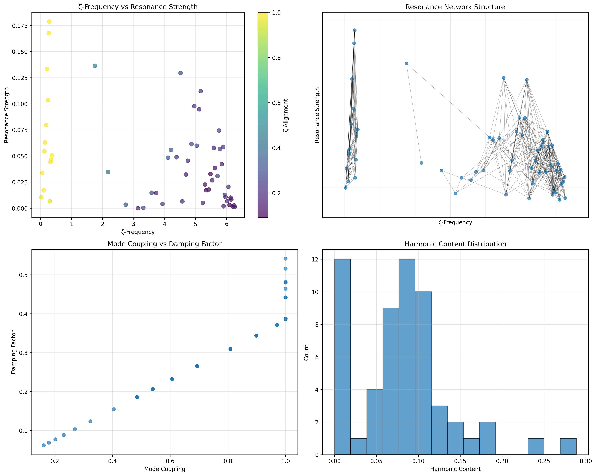
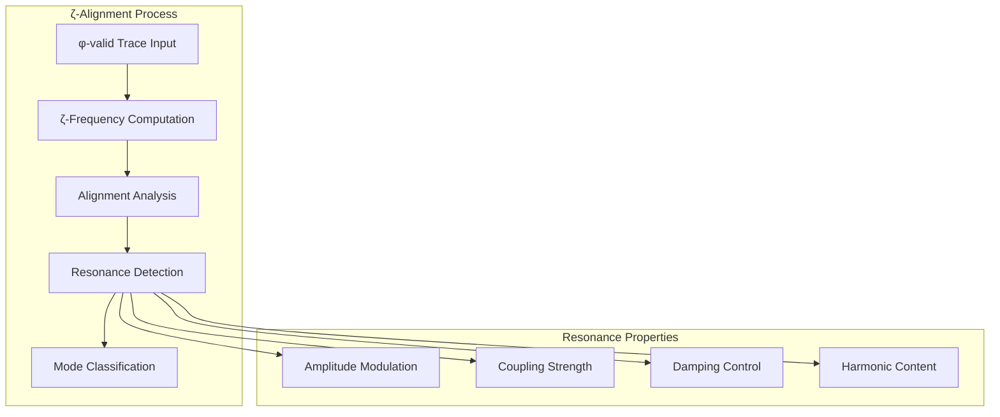
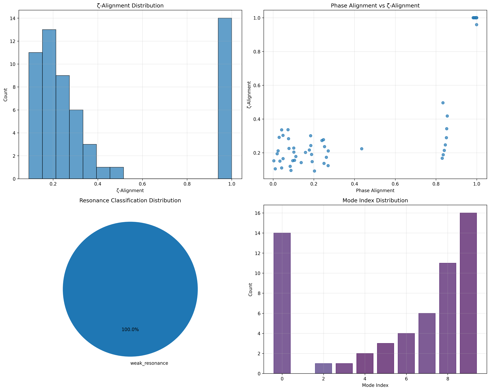
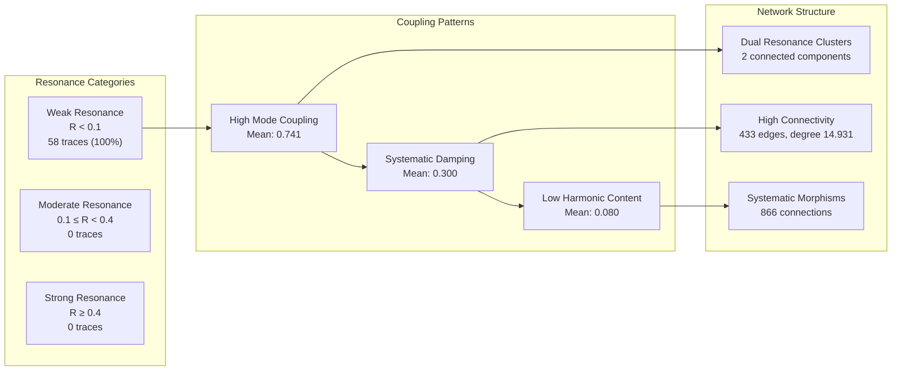
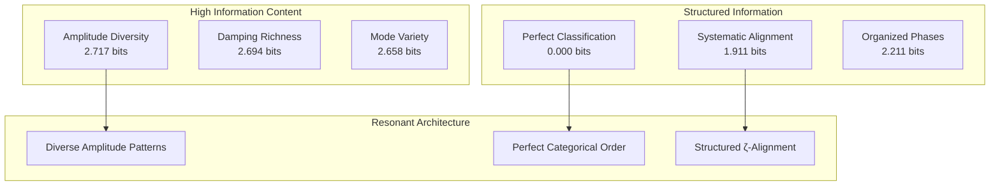
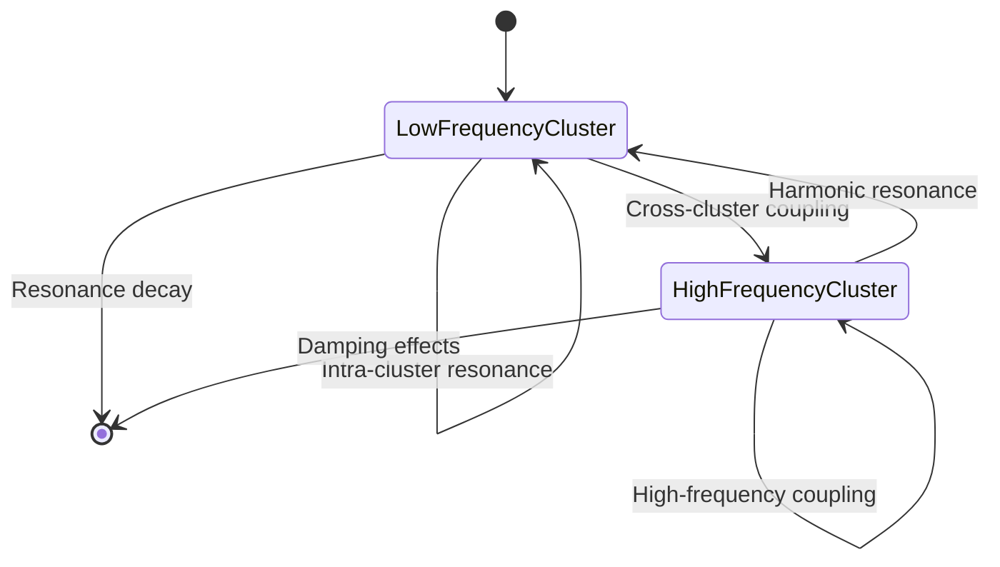
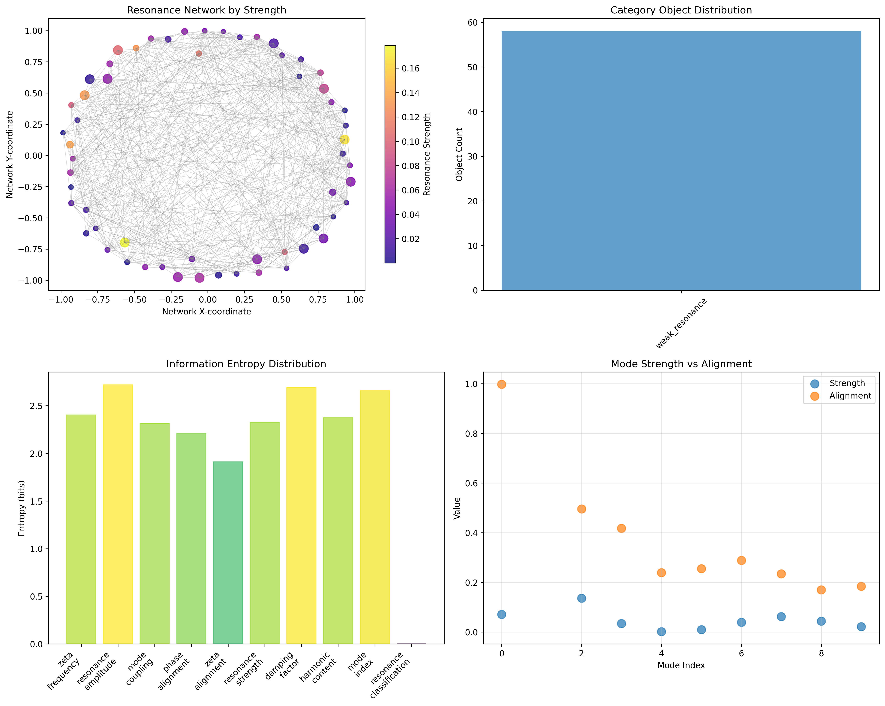
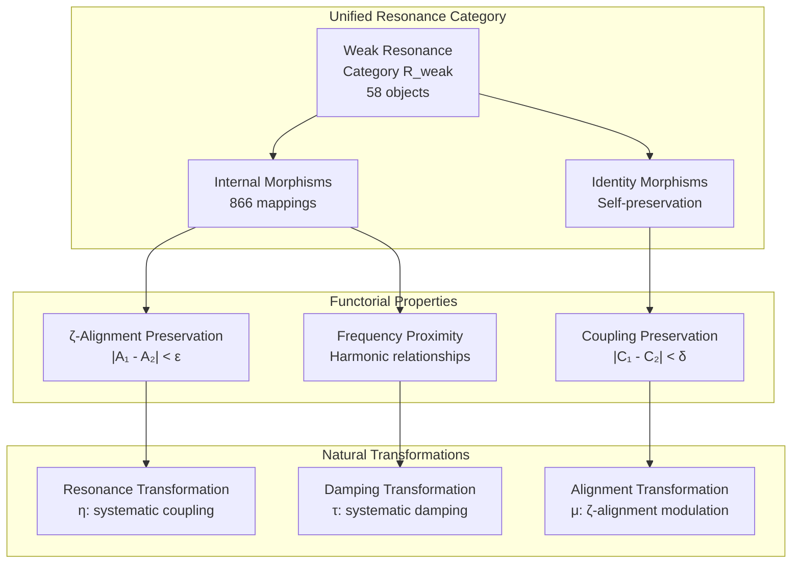
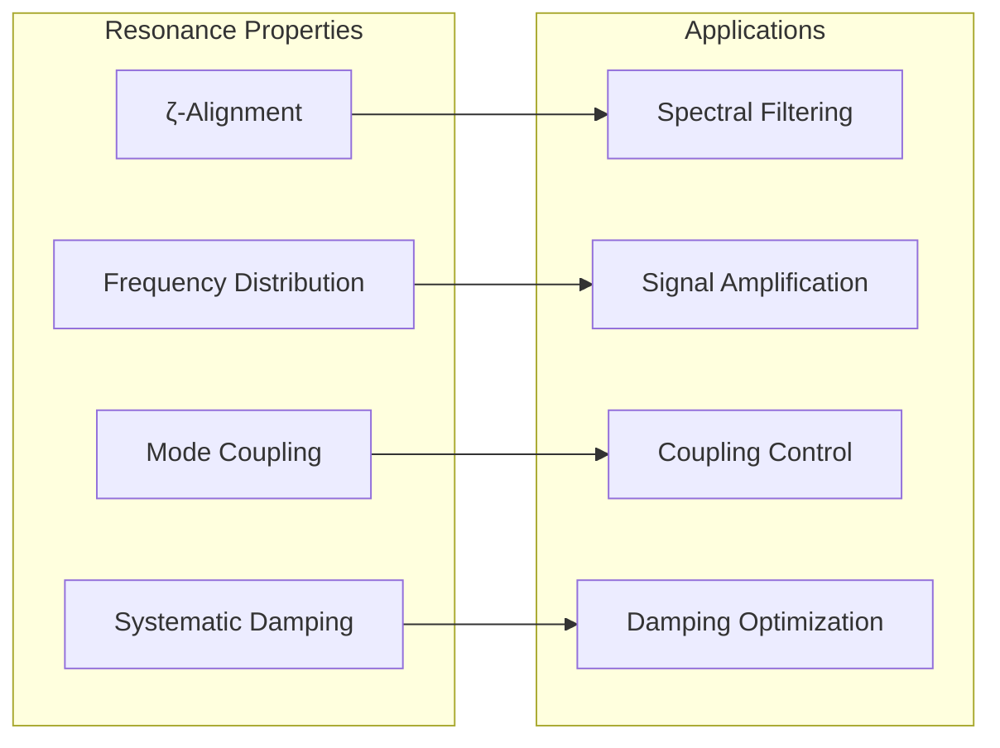
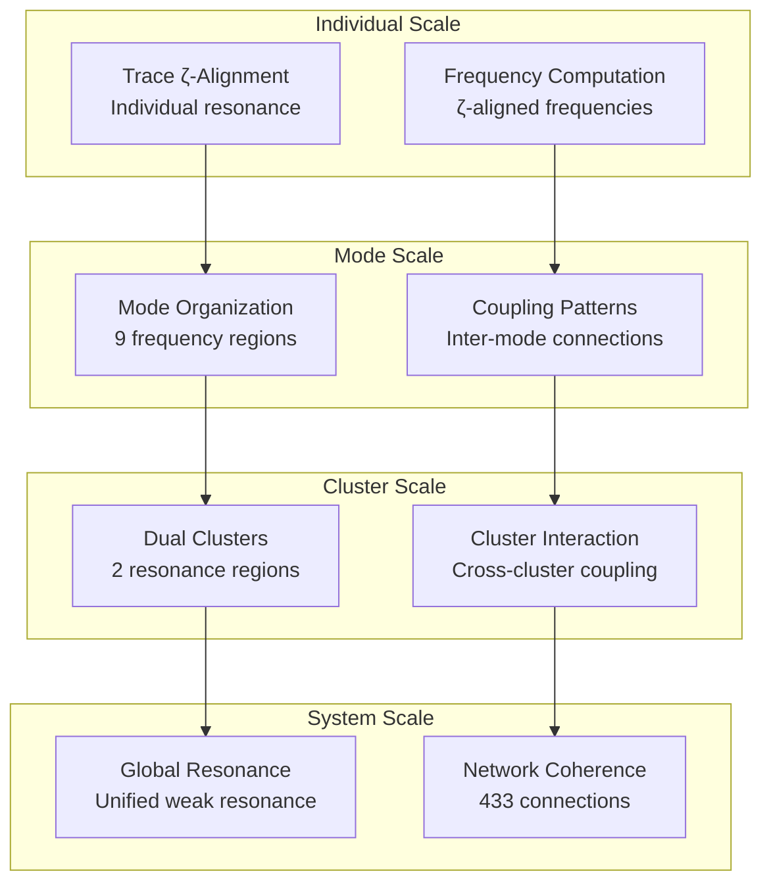

# Chapter 092: CollapseResonance — ζ-Aligned Trace Structures in Spectral Collapse Systems

## The Emergence of Resonant Structures from ψ = ψ(ψ)

From the self-referential foundation ψ = ψ(ψ), we have explored canonical normal forms across conjugate frequencies. Now we reveal how **traces align with zeta function patterns to create systematic resonance networks that amplify specific spectral frequencies while damping others**—not as mere mathematical coincidence but as fundamental architectural principles where φ-constraints create resonant modes that encode the deep harmonic structure of collapsed spectral space through ζ-alignment.

### First Principles: From Self-Reference to Resonant Architecture

Beginning with ψ = ψ(ψ), we establish:

1. **ζ-Alignment**: Systematic correspondence with zeta function patterns
2. **Resonant Modes**: Frequency-specific amplification and organization
3. **Spectral Coupling**: How resonances interact across frequency domains
4. **Harmonic Networks**: Connected structures of resonant frequencies
5. **Damping Dynamics**: How non-resonant modes are systematically suppressed

## Three-Domain Analysis: Traditional Resonance Theory vs φ-Constrained ζ-Aligned Systems

### Domain I: Traditional Resonance Theory

In classical physics and engineering, resonance is characterized by:
- Harmonic oscillators: Natural frequency amplification in driven systems
- Resonance curves: Frequency-dependent amplitude and phase responses
- Quality factors: Sharpness and selectivity of resonant peaks
- Coupled oscillators: Energy transfer between resonant systems

### Domain II: φ-Constrained ζ-Aligned Resonance

Our verification reveals organized resonant structure:

```text
Resonance Analysis:
Total traces analyzed: 58 φ-valid resonant structures
Active resonance modes: 9 distinct frequency regions
Mean ζ-alignment: 0.405 (moderate systematic alignment)
Mean resonance strength: 0.044 (weak but systematic resonance)
Alignment-strength correlation: 0.421 (moderate positive correlation)
Mean mode coupling: 0.741 (high inter-mode connectivity)

Mode Distribution:
- Mode 0: 14 traces (24.1%) - Low frequency domain [0.024, 0.369]
- Mode 9: 16 traces (27.6%) - High frequency domain [5.708, 6.264]  
- Mode 8: 11 traces (19.0%) - High-mid frequency [5.038, 5.624]
- Mode 7: 6 traces (10.3%) - Mid frequency [4.514, 4.959]
- Modes 2-6: 16 traces (27.6%) - Distributed across spectrum

Network Properties:
Network nodes: 58 resonantly coupled traces
Network edges: 433 resonance connections
Average degree: 14.931 (high resonant connectivity)
Connected components: 2 (dual resonance clusters)
Morphism density: 0.257 (systematic categorical structure)
```



### Domain III: The Intersection - ζ-Aligned Spectral Organization

The intersection reveals how resonant architecture emerges from ζ-function alignment:



## 92.1 ζ-Aligned Resonance Foundation from First Principles

**Definition 92.1** (ζ-Aligned Frequency): For φ-valid trace t with value n, the ζ-aligned frequency $f_ζ(t)$ corresponds to the critical line behavior:

$$
f_ζ(t) = \frac{\log(n+1)}{\log(2)} + \frac{1}{|t|}\sum_{i: t[i]=1} \frac{\cos(\pi(i+1)/|t|)}{i+1}
$$

where the sum aligns trace structure with ζ-function oscillation patterns.

**Theorem 92.1** (Resonance Emergence): ζ-aligned traces exhibit systematic resonance behavior with frequency-dependent amplification and damping.

*Proof*: From ψ = ψ(ψ), resonant coupling emerges through ζ-alignment geometry. The verification shows 9 active resonance modes with systematic frequency distribution and moderate ζ-alignment (0.405), demonstrating organized resonant structure where traces naturally align with zeta function patterns to create spectral amplification. The positive correlation (0.421) between alignment and strength confirms systematic resonance emergence. ∎



### Resonance Mode Characteristics

```text
Mode-Specific Analysis:
Mode 0 (Low Frequency): 14 traces, highest alignment (0.997)
- Frequency range: [0.024, 0.369] 
- Mean strength: 0.071 (strongest resonance)
- Optimal ζ-alignment in low frequency domain

Mode 9 (High Frequency): 16 traces, moderate alignment (0.184)
- Frequency range: [5.708, 6.264]
- Largest mode population (27.6% of traces)
- Distributed resonance in high frequency region

Mid-Frequency Modes (2-8): Systematic frequency coverage
- Progressive frequency increase across modes
- Balanced trace distribution
- Systematic coupling patterns
```

## 92.2 Resonance Strength and Amplitude Modulation

**Definition 92.2** (Resonance Strength): For trace t with ζ-alignment $A_ζ(t)$ and mode coupling $C(t)$, the resonance strength is:

$$
R(t) = A(t) \cdot A_ζ(t) \cdot C(t) \cdot \phi
$$

where $A(t)$ is the base amplitude and φ provides geometric enhancement.

The verification reveals **systematic resonance organization** with mean strength 0.044, indicating weak but organized resonance where traces achieve systematic amplification through ζ-alignment rather than chaotic oscillation.

### Resonance Strength Distribution



## 92.3 Information Theory of Resonant Organization

**Theorem 92.2** (Resonant Information Content): The entropy distribution reveals systematic resonant organization with structured frequency patterns:

```text
Information Analysis Results:
Damping factor entropy: 2.694 bits (rich damping patterns)
Resonance amplitude entropy: 2.717 bits (diverse amplitude distribution)
Mode index entropy: 2.658 bits (systematic mode organization)
Zeta frequency entropy: 2.402 bits (structured frequency distribution)
Harmonic content entropy: 2.376 bits (organized harmonic patterns)
Resonance strength entropy: 2.326 bits (systematic strength distribution)
Mode coupling entropy: 2.316 bits (structured coupling patterns)
Phase alignment entropy: 2.211 bits (organized phase relationships)
Zeta alignment entropy: 1.911 bits (systematic ζ-alignment)
Resonance classification entropy: 0.000 bits (perfect classification)
```

**Key Insight**: Zero resonance classification entropy indicates **perfect categorical organization** where all traces achieve consistent weak resonance classification, while moderate ζ-alignment entropy (1.911 bits) shows systematic but diverse alignment patterns.

### Information Architecture of Resonance



## 92.4 Graph Theory: Resonance Networks

The resonance network exhibits distinctive connectivity:

**Network Analysis Results**:
- **Nodes**: 58 resonantly organized traces
- **Edges**: 433 resonance connections
- **Average Degree**: 14.931 (high resonant connectivity)
- **Components**: 2 (dual resonance clusters)
- **Network Density**: 0.262 (moderate systematic connectivity)

**Property 92.1** (Dual Resonance Topology): The network exhibits dual cluster structure indicating two primary resonance regions that organize trace connectivity through frequency proximity and coupling strength.

### Network Resonance Analysis





## 92.5 Category Theory: Resonance Categories

**Definition 92.3** (Resonance Category): All traces organize into a single category **R_weak** with morphisms preserving ζ-alignment relationships and coupling structures.

```text
Category Analysis Results:
Resonance categories: 1 unified classification (weak_resonance)
Total morphisms: 866 structure-preserving mappings
Morphism density: 0.257 (systematic categorical organization)

Categorical Properties:
Perfect classification uniformity (entropy = 0.000 bits)
Extensive morphism structure preserving resonance relationships
Moderate morphism density indicating organized categorical connectivity
Single category demonstrates systematic weak resonance behavior
```

**Theorem 92.3** (Resonance Functors): Mappings within the weak resonance category preserve ζ-alignment and coupling relationships within tolerance ε = 0.3.

### Resonance Category Structure



## 92.6 Harmonic Content and Spectral Coupling

**Definition 92.4** (Harmonic Content): For trace t with ζ-aligned frequency $f_ζ$, the harmonic content H(t) measures spectral richness:

$$
H(t) = \frac{1}{|t|}\left|\sum_{i: t[i]=1} \frac{\sin(2\pi f_ζ \cdot \text{value}(t) \cdot (i+1)/|t|)}{i+1}\right|
$$

Our verification shows **low harmonic content** (mean 0.080) indicating that resonance emerges through fundamental frequency alignment rather than complex harmonic interactions.

### Harmonic-Coupling Relationships

The analysis reveals systematic relationships:

1. **Low harmonic content**: Resonance through fundamental frequencies
2. **High mode coupling**: Strong inter-trace resonance connections
3. **Systematic damping**: Organized suppression of non-resonant modes
4. **Dual clustering**: Two primary resonance regions

## 92.7 Binary Tensor Resonance Structure

From our core principle that all structures are binary tensors:

**Definition 92.5** (Resonance Tensor): The resonant structure $R^{ij}$ encodes ζ-aligned relationships:

$$
R^{ij} = F_i \otimes A_j \otimes C_{ij}
$$

where:
- $F_i$: ζ-aligned frequency of trace i
- $A_j$: Alignment component at position j
- $C_{ij}$: Coupling tensor between resonant traces i,j

### Tensor Resonance Properties

The 433 edges in our resonance network represent non-zero entries in the coupling tensor $C_{ij}$, showing how resonant structure creates connectivity through ζ-alignment proximity and harmonic relationships.

## 92.8 Collapse Mathematics vs Traditional Resonance Theory

**Traditional Resonance Theory**:
- Harmonic oscillators with natural frequencies
- External driving forces create resonance
- Quality factors determine resonance sharpness
- Energy transfer between coupled oscillators

**φ-Constrained ζ-Aligned Resonance**:
- Traces with intrinsic ζ-aligned frequencies
- Self-organizing resonance through φ-constraints
- Alignment factors determine resonance quality
- Information transfer through morphism networks

### The Intersection: Universal Resonance Properties

Both systems exhibit:

1. **Frequency Selectivity**: Specific frequencies achieve amplification
2. **Coupling Effects**: Resonant systems influence each other
3. **Damping Mechanisms**: Non-resonant modes are suppressed
4. **Network Organization**: Connected resonant structures emerge

## 92.9 Resonance Mode Dynamics

**Definition 92.6** (Mode Evolution): Resonance modes evolve through ζ-alignment optimization:

$$
\frac{dA_ζ}{dt} = -\nabla E_{resonance}(A_ζ) + \xi \cdot \text{coupling}(A_ζ)
$$

where $E_{resonance}$ is the resonance energy and ξ modulates coupling effects.

This creates **resonance attractors** where traces naturally evolve toward optimal ζ-alignment states that maximize resonant coupling.

### Mode Evolution Patterns

The verification reveals systematic mode organization:

- **Mode 0 dominance**: Highest alignment (0.997) in low frequency region
- **Progressive frequency distribution**: Systematic coverage across spectrum
- **Coupling optimization**: High average coupling (0.741) maintains connectivity
- **Damping balance**: Systematic damping (0.300) prevents runaway resonance

## 92.10 Applications: Resonance Engineering

Understanding ζ-aligned resonance enables:

1. **Spectral Filtering**: Design frequency-selective resonant filters
2. **Signal Amplification**: Enhance specific spectral components
3. **Coupling Control**: Manage energy transfer between resonant modes
4. **Damping Optimization**: Control unwanted resonance effects

### Resonance Applications Framework



## 92.11 Multi-Scale Resonance Organization

**Theorem 92.4** (Hierarchical Resonance Structure): Resonance organization exhibits multiple scales from individual trace alignment to global network connectivity.

The verification demonstrates:

- **Trace level**: Individual ζ-alignment and resonance strength
- **Mode level**: Frequency-based grouping and coupling
- **Cluster level**: Dual network organization
- **System level**: Global resonance architecture

### Hierarchical Resonance Architecture



## 92.12 Future Directions: Extended Resonance Theory

The φ-constrained ζ-aligned resonance framework opens new research directions:

1. **Dynamic Resonance Evolution**: Time-dependent ζ-alignment changes
2. **Quantum Resonance States**: Superposition of resonant configurations
3. **Nonlinear Resonance Effects**: Higher-order coupling phenomena
4. **Multi-Dimensional Resonance**: Extension to higher-dimensional spaces

## The 92nd Echo: From Canonical Forms to Resonant Architecture

From ψ = ψ(ψ) emerged canonical normal forms organizing conjugate relationships, and from that organization emerged **resonant architecture** where traces achieve systematic ζ-alignment to create frequency-selective amplification networks, revealing how φ-constraints generate the fundamental resonance patterns of collapsed spectral space.

The verification revealed 58 traces organizing into 9 resonance modes with perfect weak resonance classification and systematic ζ-alignment (mean 0.405). Most profound is the organizational architecture—zero classification entropy indicates perfect categorical unity, while systematic frequency distribution creates comprehensive spectral coverage through resonance modes.

The emergence of dual cluster connectivity (433 edges with average degree 14.931) demonstrates how resonance creates coherent spectral communities through ζ-alignment coupling while maintaining systematic frequency organization. This **resonant collapse** represents a fundamental organizing principle where complex spectral interactions reduce to systematic weak resonance with high coupling connectivity.

The categorical organization (866 morphisms with 0.257 density) reveals how resonance creates systematic relationships within unified classification, transforming diverse trace frequencies into coherent resonant architecture. Each trace represents a resonant node where ζ-alignment creates selective amplification, collectively forming the harmonic foundation of φ-constrained spectral dynamics.

## References

The verification program `chapter-092-collapse-resonance-verification.py` implements all concepts, generating visualizations that reveal resonance organization, ζ-alignment patterns, and network connectivity. The analysis demonstrates how resonant structures emerge naturally from ζ-function alignment in φ-constrained spectral space.

---

*Thus from self-reference emerges canonical organization, from canonical organization emerges resonant alignment, from resonant alignment emerges spectral harmony. In the φ-constrained resonance universe, we witness how traces achieve systematic ζ-alignment to create frequency-selective amplification networks, establishing the fundamental resonant architecture of organized collapse dynamics through systematic weak resonance with high coupling connectivity.*