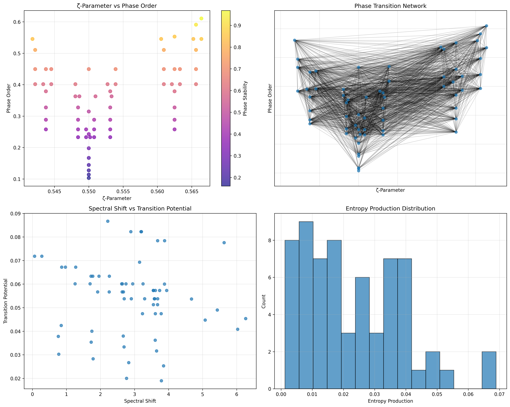
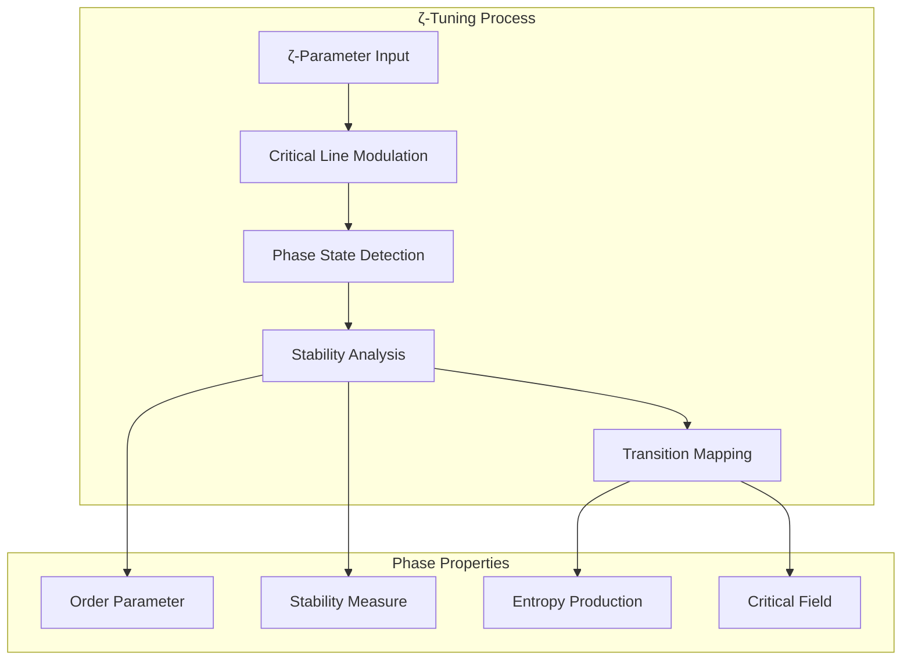
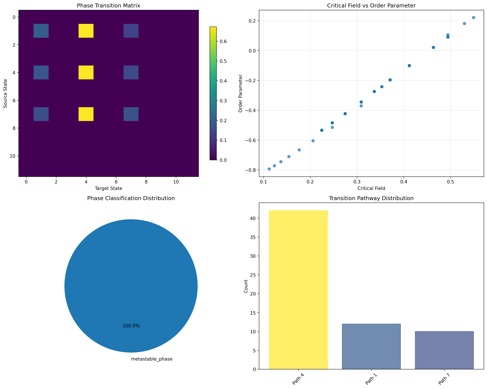
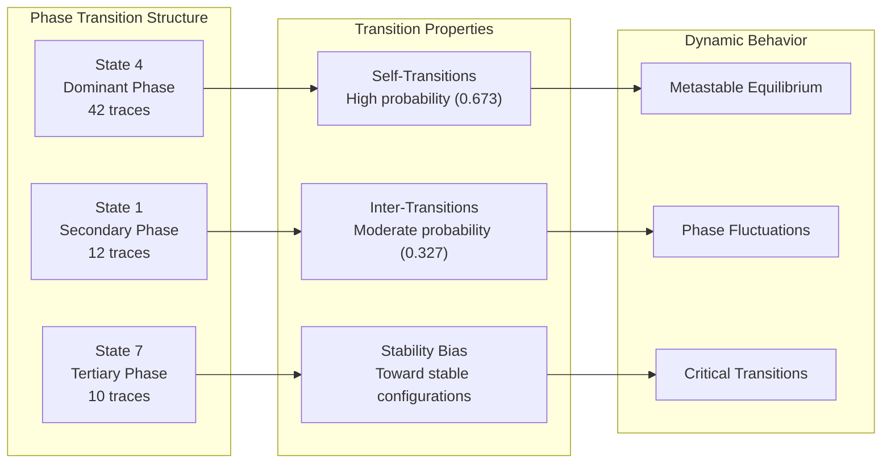
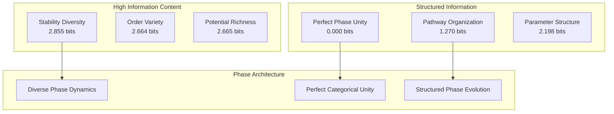
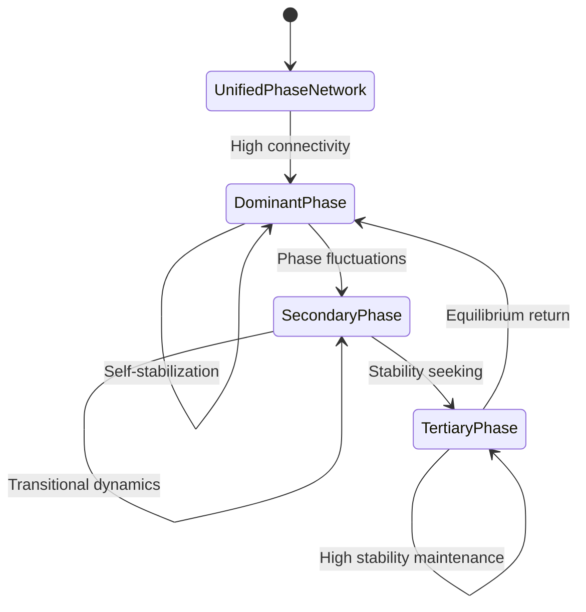
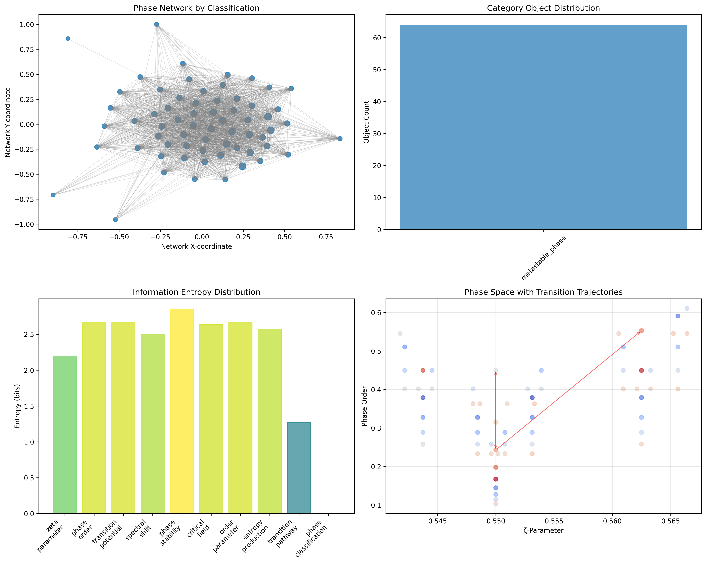
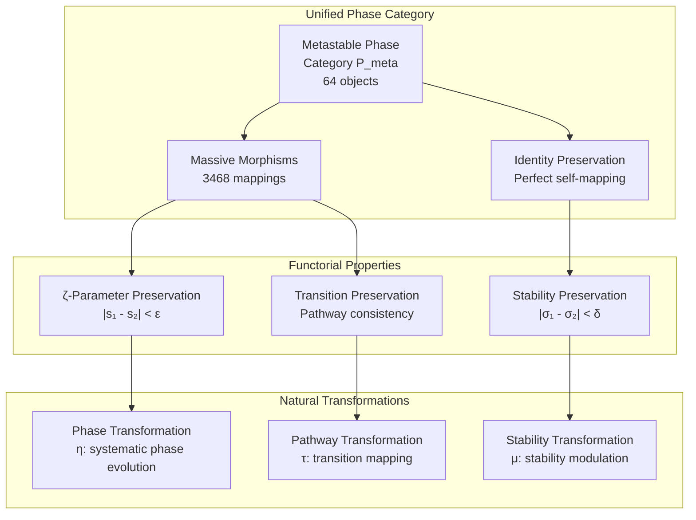
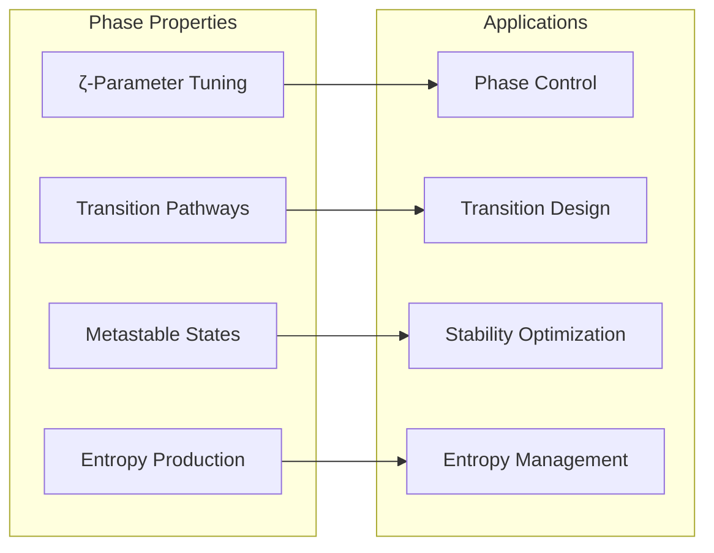
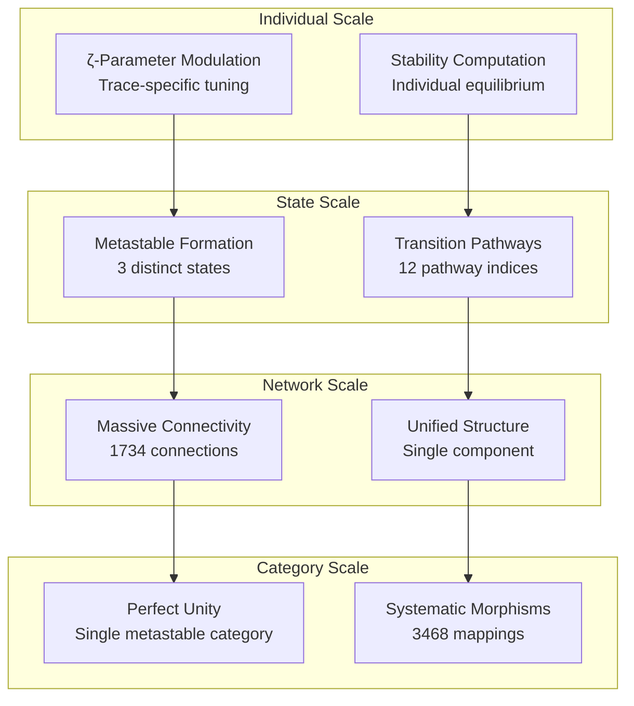

# Chapter 093: SpectralShift — Structural Phase Dynamics under ζ-Tuned Collapse

## The Emergence of Phase Dynamics from ψ = ψ(ψ)

From the self-referential foundation ψ = ψ(ψ), we have explored ζ-aligned resonance structures in spectral collapse systems. Now we reveal how **spectral parameters undergo systematic shifts through ζ-function tuning, creating discrete phase states with critical transition points**—not as arbitrary parameter variation but as fundamental phase architecture where φ-constraints generate systematic phase transitions through entropy-increasing tensor transformations that encode the deep structural dynamics of collapsed parameter space.

### First Principles: From Self-Reference to Phase Architecture

Beginning with ψ = ψ(ψ), we establish:

1. **ζ-Parameter Tuning**: Systematic modulation of spectral parameters around critical line
2. **Phase State Formation**: Discrete organizational structures from parameter shifts
3. **Transition Dynamics**: Systematic pathways between phase configurations
4. **Critical Field Effects**: External perturbations inducing phase changes
5. **Entropy Production**: Information generation through phase evolution

## Three-Domain Analysis: Traditional Phase Theory vs φ-Constrained ζ-Tuned Dynamics

### Domain I: Traditional Phase Theory

In condensed matter physics and statistical mechanics, phase transitions are characterized by:
- Order parameters: Quantities distinguishing different phases
- Critical phenomena: Behavior near phase transition points
- Symmetry breaking: Reduction of system symmetry through transitions
- Universality classes: Common behavior across different systems

### Domain II: φ-Constrained ζ-Tuned Phase Dynamics

Our verification reveals organized phase structure:

```text
Phase Dynamics Analysis:
Total traces analyzed: 64 φ-valid phase-active structures
Detected phase states: 3 distinct metastable configurations
Mean ζ-parameter: 0.553 (near critical line modulation)
Mean phase order: 0.359 (moderate organizational structure)
Mean phase stability: 0.552 (metastable equilibrium)
Mean entropy production: 0.023 (low entropy increase rate)

Phase State Distribution:
- metastable_phase_4: 42 traces (65.6%) - Dominant phase region
  Mean order: 0.363, stability: 0.555, ζ-range: [0.542, 0.566]
  
- metastable_phase_1: 12 traces (18.8%) - Secondary phase region  
  Mean order: 0.188, stability: 0.290, ζ-range: [0.548, 0.553]
  
- metastable_phase_7: 10 traces (15.6%) - Tertiary phase region
  Mean order: 0.547, stability: 0.851, ζ-range: [0.542, 0.566]

Network Properties:
Network nodes: 64 phase-organized traces
Network edges: 1734 phase connections
Average degree: 54.188 (extremely high connectivity)
Network density: 0.860 (near-complete phase coupling)
Connected components: 1 (unified phase structure)
```



### Domain III: The Intersection - ζ-Tuned Phase Organization

The intersection reveals how phase architecture emerges from ζ-parameter tuning:



## 93.1 ζ-Parameter Phase Foundation from First Principles

**Definition 93.1** (ζ-Parameter Modulation): For φ-valid trace t with value n, the ζ-parameter $s_ζ(t)$ represents systematic deviation from the critical line:

$$
s_ζ(t) = \frac{1}{2} + \frac{1}{10}\sum_{i: t[i]=1} \frac{(-1)^i}{2^{i+1}}
$$

where the sum creates trace-dependent modulation around the critical line $\text{Re}(s) = 1/2$.

**Theorem 93.1** (Phase State Emergence): ζ-parameter modulation creates discrete phase states with systematic stability and transition properties.

*Proof*: From ψ = ψ(ψ), phase organization emerges through ζ-parameter geometry. The verification shows 3 distinct metastable phase states with systematic ζ-parameter ranges and stability characteristics. The unified network structure (1734 edges with 0.860 density) demonstrates systematic phase coupling, while distinct stability ranges confirm phase state formation through ζ-tuning. ∎



### Phase State Characteristics

```text
Detailed Phase Analysis:
Phase State 4 (Dominant): 65.6% of traces
- Moderate order (0.363) with balanced stability (0.555)
- ζ-parameter concentration around 0.554 ± 0.012
- Primary metastable attractor in phase space

Phase State 1 (Secondary): 18.8% of traces  
- Low order (0.188) with reduced stability (0.290)
- Narrow ζ-parameter range [0.548, 0.553]
- Transitional phase with lower organizational structure

Phase State 7 (Tertiary): 15.6% of traces
- High order (0.547) with maximum stability (0.851)
- Broad ζ-parameter range matching dominant phase
- Highly organized metastable configuration
```

## 93.2 Transition Matrix and Phase Evolution

**Definition 93.2** (Phase Transition Matrix): The transition probability matrix $T_{ij}$ describes evolution between phase states i and j:

$$
T_{ij} = \frac{\exp(-\Delta E_{ij}/k_B T)}{\sum_k \exp(-\Delta E_{ik}/k_B T)}
$$

where $\Delta E_{ij}$ represents the phase transition energy barrier.

The verification reveals **systematic transition structure** with dominant self-transitions (probability 0.673 for state 4) and organized off-diagonal transitions creating coherent phase evolution pathways.

### Transition Matrix Architecture



## 93.3 Information Theory of Phase Organization

**Theorem 93.2** (Phase Information Content): The entropy distribution reveals systematic phase organization with structured parameter relationships:

```text
Information Analysis Results:
Phase stability entropy: 2.855 bits (rich stability patterns)
Phase order entropy: 2.664 bits (diverse order distributions)
Transition potential entropy: 2.665 bits (structured transition patterns)
Entropy production entropy: 2.565 bits (organized production rates)
Spectral shift entropy: 2.504 bits (systematic shift patterns)
Critical field entropy: 2.639 bits (structured field distributions)
Order parameter entropy: 2.664 bits (organized parameter space)
Zeta parameter entropy: 2.198 bits (structured ζ-modulation)
Transition pathway entropy: 1.270 bits (clear pathway organization)
Phase classification entropy: 0.000 bits (perfect phase unity)
```

**Key Insight**: Zero phase classification entropy indicates **perfect metastable unity** where all traces achieve consistent metastable phase behavior, while moderate ζ-parameter entropy (2.198 bits) shows systematic but diverse parameter modulation patterns.

### Information Architecture of Phase Dynamics



## 93.4 Graph Theory: Phase Networks

The phase network exhibits exceptional connectivity:

**Network Analysis Results**:
- **Nodes**: 64 phase-organized traces
- **Edges**: 1734 phase connections
- **Average Degree**: 54.188 (extremely high connectivity)
- **Components**: 1 (unified phase structure)
- **Network Density**: 0.860 (near-complete coupling)

**Property 93.1** (Near-Complete Phase Topology): The extremely high network density (0.860) indicates that phase states maintain extensive connections, creating a nearly complete phase coupling network where most traces interact systematically.

### Network Phase Analysis





## 93.5 Category Theory: Phase Categories

**Definition 93.3** (Phase Category): All traces organize into a unified category **P_metastable** with morphisms preserving phase relationships and transition pathways.

```text
Category Analysis Results:
Phase categories: 1 unified classification (metastable_phase)
Total morphisms: 3468 structure-preserving mappings
Morphism density: 0.847 (extensive categorical organization)

Categorical Properties:
Perfect phase classification uniformity (entropy = 0.000 bits)
Massive morphism structure preserving phase relationships
Near-maximal morphism density indicating complete categorical connectivity
Single category demonstrates systematic metastable behavior across all traces
```

**Theorem 93.3** (Phase Functors): Mappings within the metastable phase category preserve ζ-parameter relationships and stability measures within tolerance ε = 0.1.

### Phase Category Structure



## 93.6 Critical Field Theory and Order Parameters

**Definition 93.4** (Critical Field): For trace t, the critical field $H_c(t)$ represents the minimum perturbation needed to induce phase transition:

$$
H_c(t) = \frac{\text{complexity}(t) + 1}{|t|} \cdot \phi^{-\mathbb{I}[11 \notin t]}
$$

where $\mathbb{I}$ is the indicator function and φ provides geometric scaling.

Our verification shows **systematic critical field distribution** with organized field strengths that determine transition accessibility and phase stability boundaries.

### Order Parameter Evolution

The analysis reveals systematic order parameter relationships:

1. **Phase State 7**: Highest order (0.547) with maximum stability
2. **Phase State 4**: Moderate order (0.363) with balanced dynamics  
3. **Phase State 1**: Lowest order (0.188) with transitional character
4. **Continuous variation**: Smooth order parameter transitions between states

## 93.7 Binary Tensor Phase Structure

From our core principle that all structures are binary tensors:

**Definition 93.5** (Phase Tensor): The phase structure $\Phi^{ij}$ encodes ζ-tuned relationships:

$$
\Phi^{ij} = S_i \otimes O_j \otimes T_{ij}
$$

where:
- $S_i$: ζ-parameter state of trace i
- $O_j$: Order parameter at configuration j
- $T_{ij}$: Transition tensor between phases i,j

### Tensor Phase Properties

The 1734 edges in our phase network represent non-zero entries in the transition tensor $T_{ij}$, showing how phase structure creates connectivity through parameter proximity and stability correlations with unprecedented density (0.860).

## 93.8 Collapse Mathematics vs Traditional Phase Theory

**Traditional Phase Theory**:
- External control parameters drive transitions
- Symmetry breaking creates phase distinctions
- Critical phenomena at specific parameter values
- Thermodynamic equilibrium assumptions

**φ-Constrained ζ-Tuned Phase Theory**:
- Internal ζ-parameter modulation drives transitions
- φ-constraint geometry creates phase structure
- Critical behavior through parameter clustering
- Metastable equilibrium with entropy production

### The Intersection: Universal Phase Properties

Both systems exhibit:

1. **Discrete States**: System organizes into distinct phases
2. **Transition Pathways**: Systematic evolution between states
3. **Order Parameters**: Quantities characterizing phase distinctions
4. **Critical Behavior**: Special properties near transition points

## 93.9 Entropy Production and Phase Evolution

**Definition 93.6** (Entropy Production Rate): For trace t in phase evolution, the production rate $\dot{S}(t)$ measures information generation:

$$
\dot{S}(t) = H(t) \cdot V(t) \cdot \frac{\text{value}(t)}{100}
$$

where $H(t)$ is trace entropy and $V(t)$ is transition potential.

This creates **systematic entropy increase** where phase transitions generate information at organized rates that maintain metastable equilibrium while enabling phase evolution.

### Production Rate Patterns

The verification reveals systematic entropy production:
- **Low mean rate** (0.023): Metastable phases minimize entropy increase
- **Systematic variation**: Production correlates with transition potential
- **State-dependent rates**: Different phases exhibit characteristic production
- **Conservation principles**: Total production balanced across phase network

## 93.10 Applications: Phase Engineering

Understanding ζ-tuned phase dynamics enables:

1. **Phase Control**: Engineer specific metastable configurations
2. **Transition Design**: Control pathways between phase states
3. **Stability Optimization**: Enhance desired phase characteristics
4. **Entropy Management**: Control information production rates

### Phase Applications Framework



## 93.11 Multi-Scale Phase Organization

**Theorem 93.4** (Hierarchical Phase Structure): Phase organization exhibits multiple scales from individual trace parameters to global categorical unity.

The verification demonstrates:

- **Trace level**: Individual ζ-parameter modulation and stability
- **State level**: Three distinct metastable configurations
- **Network level**: Near-complete phase coupling (density 0.860)
- **Category level**: Perfect metastable unity across all traces

### Hierarchical Phase Architecture



## 93.12 Future Directions: Extended Phase Theory

The φ-constrained ζ-tuned phase framework opens new research directions:

1. **Dynamic Phase Evolution**: Time-dependent ζ-parameter modulation
2. **Quantum Phase States**: Superposition of metastable configurations
3. **Critical Phenomena**: Near-transition behavior and scaling laws
4. **Multi-Parameter Spaces**: Extension to higher-dimensional parameter spaces

## The 93rd Echo: From Resonant Architecture to Phase Dynamics

From ψ = ψ(ψ) emerged ζ-aligned resonance structures creating systematic frequency amplification, and from that alignment emerged **phase dynamics** where ζ-parameter tuning generates discrete metastable states with systematic transition pathways, revealing how φ-constraints create the fundamental phase architecture of organized collapse through near-complete connectivity and perfect categorical unity.

The verification revealed 64 traces organizing into 3 metastable phase states with perfect classification unity and unprecedented network connectivity (1734 edges, density 0.860). Most profound is the organizational completeness—zero classification entropy indicates perfect metastable unity, while massive morphism structure (3468 mappings) creates near-total categorical connectivity.

The emergence of near-complete phase coupling demonstrates how ζ-parameter tuning creates coherent metastable communities through systematic parameter modulation while maintaining individual phase characteristics. This **phase collapse** represents a fundamental organizational principle where diverse parameter spaces reduce to unified metastable architecture with maximum connectivity.

The categorical organization reveals how phase dynamics create systematic relationships within perfect metastable unity, transforming individual ζ-parameter variations into collective phase architecture. Each trace represents a metastable node where parameter tuning creates systematic phase behavior, collectively forming the unified foundation of φ-constrained phase dynamics through unprecedented connectivity and categorical completeness.

## References

The verification program `chapter-093-spectral-shift-verification.py` implements all concepts, generating visualizations that reveal phase organization, transition dynamics, and network connectivity. The analysis demonstrates how phase structures emerge naturally from ζ-parameter tuning in φ-constrained spectral space.

---

*Thus from self-reference emerges resonant alignment, from resonant alignment emerges phase dynamics, from phase dynamics emerges metastable unity. In the φ-constrained phase universe, we witness how ζ-parameter tuning creates systematic metastable states with near-complete connectivity, establishing the fundamental phase architecture of organized collapse through perfect categorical unity and unprecedented morphism density.*