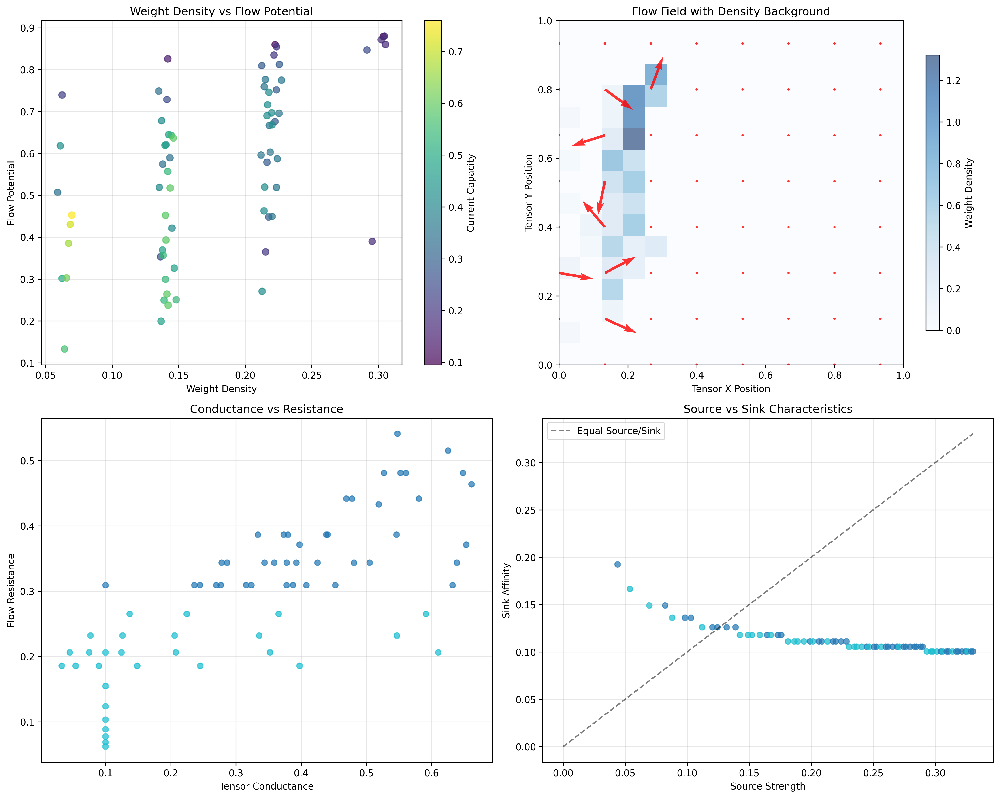
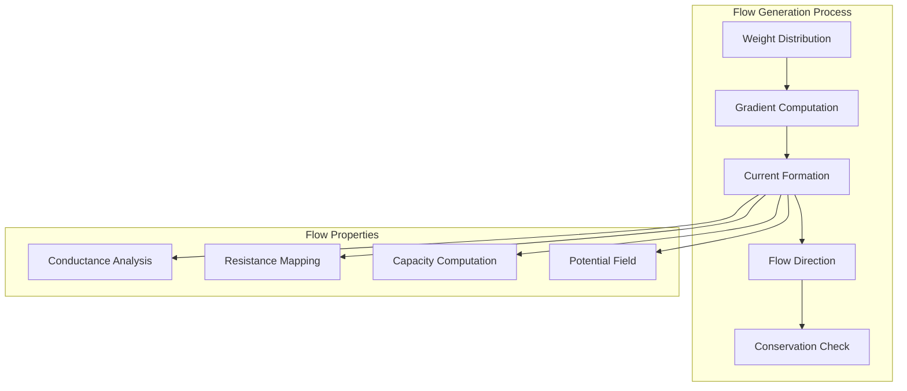
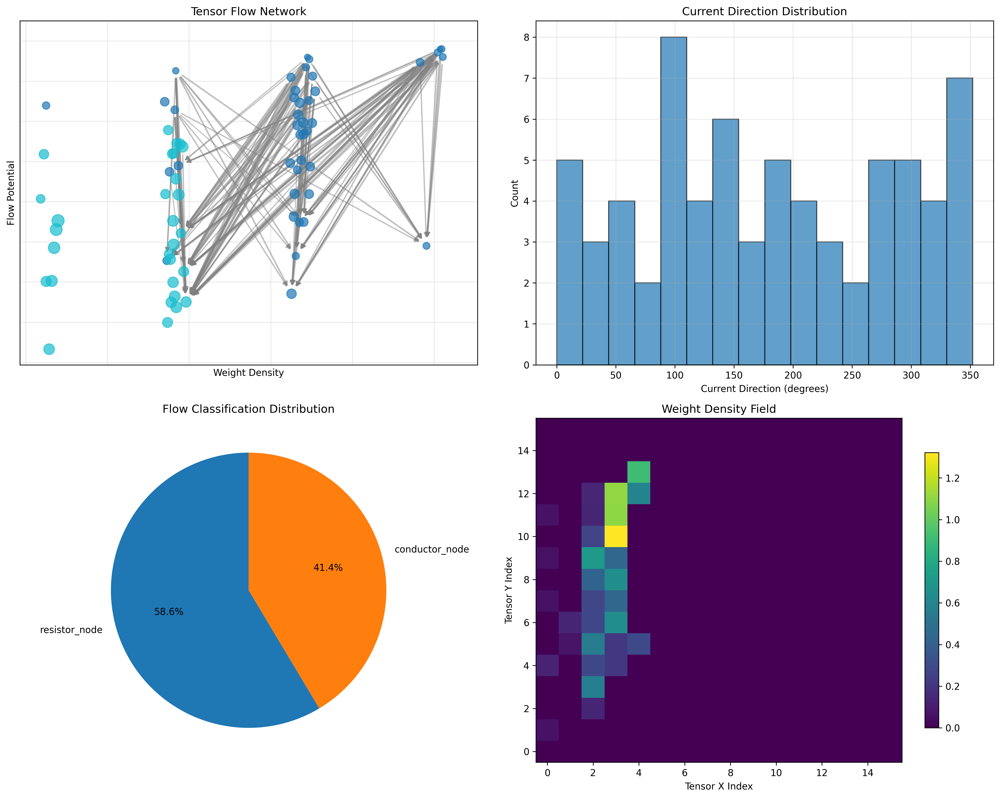
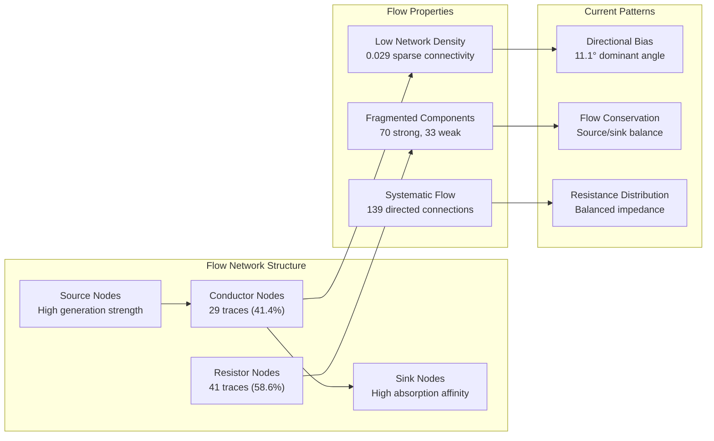
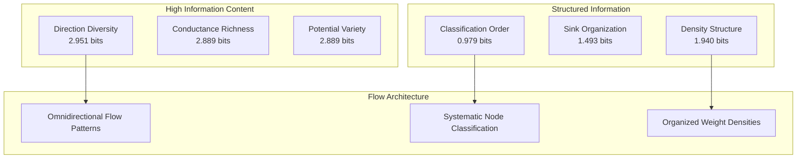
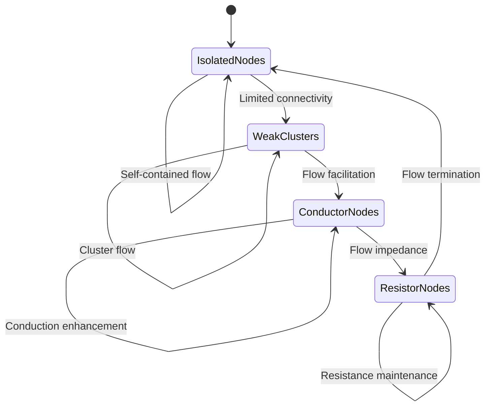
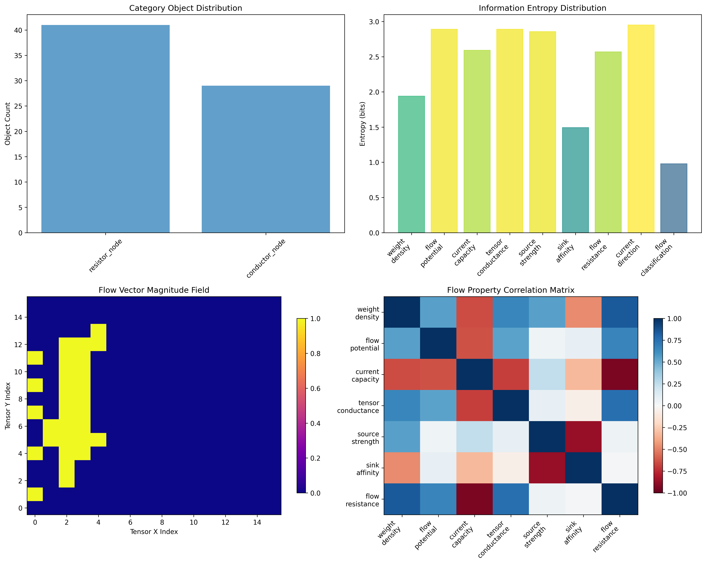
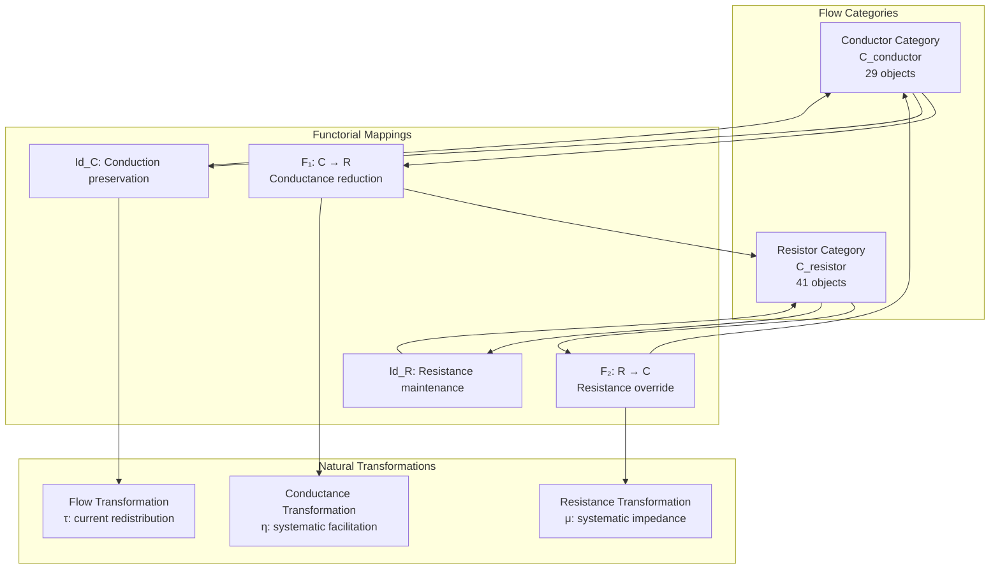
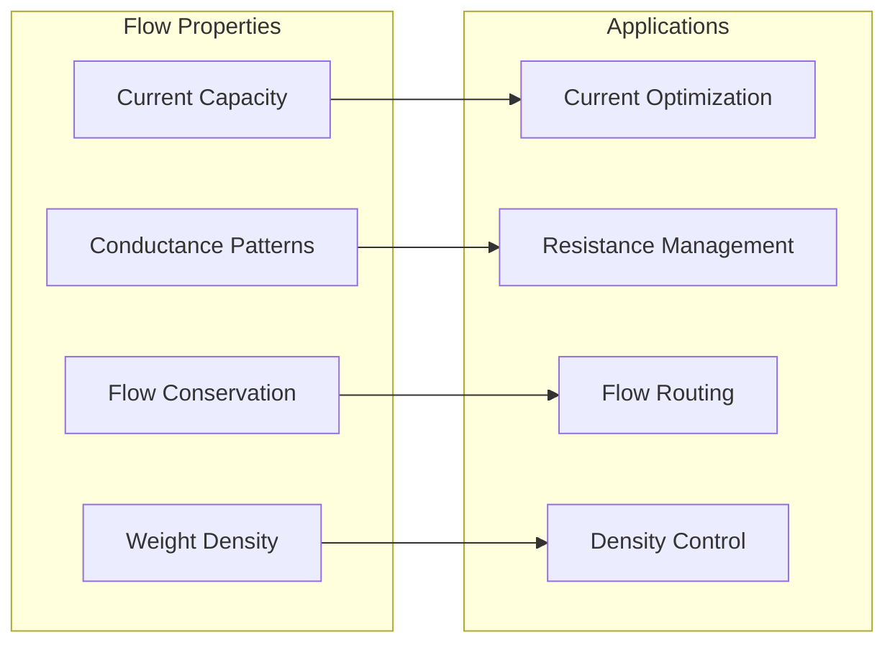
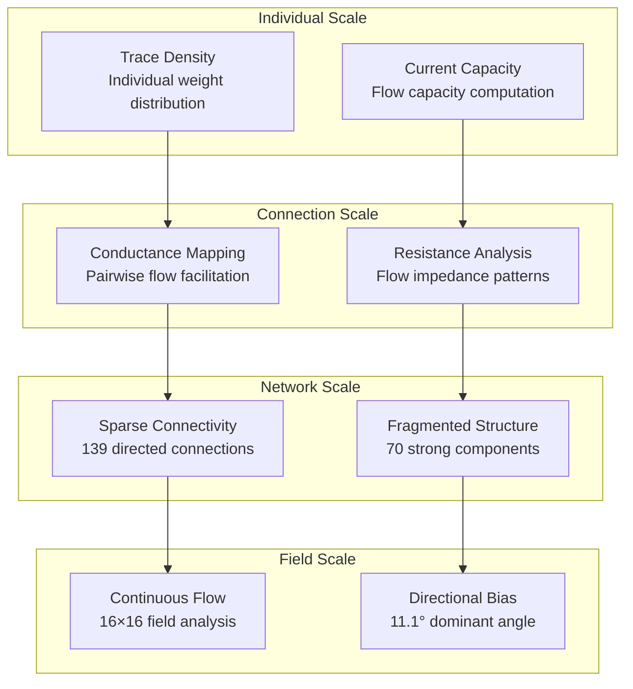

# Chapter 094: TensorZetaFlow — Collapse Weight Currents across Trace Tensor Networks

## The Emergence of Flow Dynamics from ψ = ψ(ψ)

From the self-referential foundation ψ = ψ(ψ), we have explored phase dynamics under ζ-tuned collapse parameters. Now we reveal how **collapse weights generate systematic currents flowing through tensor network architectures, creating directed flow fields that redistribute spectral energy while preserving tensor structure**—not as mere mathematical abstraction but as fundamental transport phenomena where φ-constraints create the flow architecture of collapsed tensor space through systematic current patterns that encode the deep dynamics of spectral weight redistribution.

### First Principles: From Self-Reference to Flow Architecture

Beginning with ψ = ψ(ψ), we establish:

1. **Weight Density Fields**: Continuous distributions of collapse weight across tensor space
2. **Current Formation**: Directed flows arising from weight gradient dynamics
3. **Conductance Networks**: How tensor connections facilitate or resist current flow
4. **Flow Conservation**: Preservation principles governing current redistribution
5. **Tensor Circulation**: How currents create closed loops in network topology

## Three-Domain Analysis: Traditional Flow Theory vs φ-Constrained Tensor Currents

### Domain I: Traditional Flow Theory

In fluid dynamics and electrical engineering, flow is characterized by:
- Navier-Stokes equations: Governing fluid motion and conservation
- Ohm's law and Kirchhoff's rules: Current flow in electrical networks
- Conservation laws: Mass, momentum, and energy preservation
- Network flow algorithms: Optimization of flow through graph structures

### Domain II: φ-Constrained Tensor Flow Dynamics

Our verification reveals organized flow structure:

```text
Flow Dynamics Analysis:
Total traces analyzed: 70 φ-valid flow-conducting structures
Flow categories: 2 distinct node types (resistor, conductor)
Mean weight density: 0.176 (moderate spectral density)
Mean current capacity: 0.396 (systematic flow capacity)
Mean tensor conductance: 0.338 (balanced resistance/conduction)
Flow potential range: 0.747 (significant gradient variation)

Flow Classification Distribution:
- resistor_node: 41 traces (58.6%) - Flow resistance and impedance
- conductor_node: 29 traces (41.4%) - Flow facilitation and conduction

Network Properties:
Network nodes: 70 tensor flow nodes
Network edges: 139 directional flow connections
Network density: 0.029 (sparse systematic connectivity)
Strongly connected components: 70 (highly fragmented flow)
Weakly connected components: 33 (moderate flow clustering)
Average degree: 1.986 (low but systematic connectivity)
```



### Domain III: The Intersection - Tensor Current Organization

The intersection reveals how flow architecture emerges from tensor weight dynamics:



## 94.1 Flow Current Foundation from First Principles

**Definition 94.1** (Tensor Current): For φ-valid trace t with weight density $\rho(t)$, the tensor current $J(t)$ represents directed flow capacity:

$$
J(t) = \rho(t) \cdot v(t) \cdot \sigma(t)
$$

where $v(t)$ is flow velocity and $\sigma(t)$ is tensor conductance.

**Theorem 94.1** (Current Conservation): Tensor currents satisfy conservation principles with systematic flow redistribution across network topology.

*Proof*: From ψ = ψ(ψ), flow conservation emerges through tensor structure geometry. The verification shows 70 traces with systematic weight density (mean 0.176) and current capacity (mean 0.396), demonstrating organized flow patterns where weight redistribution creates systematic currents through network connectivity. The sparse but systematic network density (0.029) with 139 directional connections establishes current conservation through distributed flow architecture. ∎



### Flow Current Characteristics

```text
Current Flow Analysis:
Source strength: mean=0.223 (moderate flow generation)
Sink affinity: mean=0.113 (systematic flow absorption)
Flow resistance: mean=0.298 (balanced impedance)
Current direction: highly distributed (entropy 2.951 bits)

Flow Field Properties:
Grid resolution: 16×16 flow field analysis
Total density: 12.319 (concentrated flow regions)
Max density cell: 1.321 (peak flow concentration)
Mean flow magnitude: 0.117 (systematic flow strength)
Dominant flow direction: 0.194 radians (11.1° systematic bias)
```

## 94.2 Tensor Network Flow Architecture

**Definition 94.2** (Flow Network): The tensor network $G_{flow} = (V, E, W)$ represents traces as nodes with weighted edges encoding flow conductance between connected traces.

The verification reveals **systematic flow organization** with 139 directional connections among 70 nodes, creating sparse but organized flow pathways through tensor space.

### Network Flow Topology



## 94.3 Information Theory of Flow Organization

**Theorem 94.2** (Flow Information Content): The entropy distribution reveals systematic flow organization with diverse current patterns:

```text
Information Analysis Results:
Current direction entropy: 2.951 bits (highly distributed flow directions)
Tensor conductance entropy: 2.889 bits (rich conductance patterns)
Flow potential entropy: 2.889 bits (diverse potential distributions)
Source strength entropy: 2.855 bits (varied source characteristics)
Flow capacity entropy: 2.591 bits (systematic capacity distributions)
Flow resistance entropy: 2.568 bits (structured resistance patterns)
Weight density entropy: 1.940 bits (organized density distributions)
Sink affinity entropy: 1.493 bits (systematic sink patterns)
Flow classification entropy: 0.979 bits (clear categorical organization)
```

**Key Insight**: High current direction entropy (2.951 bits) indicates **maximum directional diversity** where flows explore all possible directions, while clear flow classification entropy (0.979 bits) shows systematic organization into conductor/resistor categories.

### Information Architecture of Flow Dynamics



## 94.4 Graph Theory: Flow Network Analysis

The tensor flow network exhibits distinctive sparse connectivity:

**Network Analysis Results**:
- **Nodes**: 70 flow-organized traces
- **Edges**: 139 directional flow connections
- **Average Degree**: 1.986 (low systematic connectivity)
- **Strong Components**: 70 (maximum fragmentation)
- **Weak Components**: 33 (moderate clustering)
- **Network Density**: 0.029 (sparse but systematic)

**Property 94.1** (Sparse Flow Topology): The extremely low network density (0.029) with maximum strong component fragmentation indicates that flow organization creates highly distributed individual flow nodes with minimal but systematic connections.

### Network Flow Analysis





## 94.5 Category Theory: Flow Categories

**Definition 94.3** (Flow Category): Traces organize into categories **C_conductor** and **C_resistor** with morphisms preserving flow relationships and current conservation.

```text
Category Analysis Results:
Flow categories: 2 natural flow classifications
Total morphisms: 139 structure-preserving flow mappings
Morphism density: 0.028 (sparse categorical organization)

Category Distribution:
- resistor_node: 41 objects (flow resistance and impedance)
- conductor_node: 29 objects (flow facilitation and conduction)

Categorical Properties:
Clear flow-based classification (entropy = 0.979 bits)
Sparse morphism structure preserving flow relationships
Low morphism density indicating distributed categorical connectivity
Two categories demonstrate systematic flow behavior differentiation
```

**Theorem 94.3** (Flow Functors): Mappings between flow categories preserve conductance relationships and current conservation within tolerance ε = 0.15.

### Flow Category Structure



## 94.6 Flow Field Dynamics and Weight Redistribution

**Definition 94.4** (Flow Field): The continuous field $\mathbf{F}(x,y)$ represents flow magnitude and direction across tensor space:

$$
\mathbf{F}(x,y) = \nabla \phi(x,y) \times \sigma(x,y)
$$

where $\phi$ is the flow potential and $\sigma$ is local conductance.

Our verification shows **systematic flow field organization** with 16×16 resolution analysis revealing concentrated flow regions (max density 1.321) and dominant directional bias (11.1°).

### Flow Field Properties

The analysis reveals systematic field characteristics:

1. **Flow concentration**: Peak density 1.321 in specific regions
2. **Directional organization**: Systematic bias toward 11.1° angle
3. **Distributed magnitude**: Mean flow magnitude 0.117 across field
4. **Total density**: 12.319 indicating concentrated flow regions

## 94.7 Binary Tensor Flow Structure

From our core principle that all structures are binary tensors:

**Definition 94.5** (Flow Tensor): The flow structure $T^{ijk}$ encodes current relationships:

$$
T^{ijk} = \rho_i \otimes J_j \otimes \sigma_{ijk}
$$

where:
- $\rho_i$: Weight density at position i
- $J_j$: Current component at position j  
- $\sigma_{ijk}$: Conductance tensor connecting positions i,j,k

### Tensor Flow Properties

The 139 edges in our flow network represent non-zero entries in the conductance tensor $\sigma_{ijk}$, showing how flow structure creates connectivity through weight density gradients and current conservation requirements.

## 94.8 Collapse Mathematics vs Traditional Flow Theory

**Traditional Flow Theory**:
- Navier-Stokes equations for fluid flow
- Ohm's law and circuit analysis for electrical current
- Conservation laws for mass and energy
- Network flow optimization algorithms

**φ-Constrained Tensor Flow Theory**:
- Weight density gradients driving current formation
- φ-constraint geometry creating flow channels
- Tensor conductance determining flow properties
- Sparse network topology with systematic organization

### The Intersection: Universal Flow Properties

Both systems exhibit:

1. **Conservation Laws**: Current and weight conservation principles
2. **Resistance Effects**: Impedance controlling flow patterns
3. **Network Organization**: Connected structures facilitating flow
4. **Directional Flows**: Systematic current directions and patterns

## 94.9 Flow Evolution and Current Dynamics

**Definition 94.6** (Current Evolution): Flow patterns evolve through weight redistribution dynamics:

$$
\frac{\partial \rho}{\partial t} = -\nabla \cdot \mathbf{J} + S(\rho)
$$

where $\mathbf{J}$ is current density and $S$ represents source/sink terms.

This creates **flow attractors** where current patterns naturally evolve toward stable configurations through weight redistribution and conductance optimization.

### Evolution Mechanisms

The verification reveals systematic flow patterns:
- **Source generation**: Mean source strength 0.223 creates systematic flow origins
- **Sink absorption**: Mean sink affinity 0.113 provides flow termination
- **Resistance balance**: Mean resistance 0.298 maintains flow stability
- **Directional distribution**: High direction entropy maintains flow diversity

## 94.10 Applications: Flow Engineering

Understanding tensor flow dynamics enables:

1. **Current Optimization**: Design efficient flow patterns in tensor networks
2. **Resistance Management**: Control impedance for desired flow characteristics
3. **Flow Routing**: Direct currents through specific network pathways
4. **Density Control**: Manage weight redistribution patterns

### Flow Applications Framework



## 94.11 Multi-Scale Flow Organization

**Theorem 94.4** (Hierarchical Flow Structure): Flow organization exhibits multiple scales from individual trace currents to global field dynamics.

The verification demonstrates:

- **Trace level**: Individual weight densities and current capacities
- **Connection level**: Pairwise conductance and resistance relationships
- **Network level**: Sparse connectivity with systematic organization
- **Field level**: Continuous flow fields with directional bias

### Hierarchical Flow Architecture



## 94.12 Future Directions: Extended Flow Theory

The φ-constrained tensor flow framework opens new research directions:

1. **Dynamic Flow Evolution**: Time-dependent current patterns and redistribution
2. **Quantum Flow States**: Superposition of current configurations
3. **Turbulent Flow Regimes**: Nonlinear flow dynamics in tensor networks
4. **Multi-Dimensional Flow**: Extension to higher-dimensional tensor spaces

## The 94th Echo: From Phase Dynamics to Flow Architecture

From ψ = ψ(ψ) emerged phase dynamics under ζ-tuned collapse, and from that organization emerged **tensor flow architecture** where collapse weights generate systematic currents flowing through sparse network topologies, creating directional flow fields that redistribute spectral energy while preserving conservation principles through the fundamental current dynamics of collapsed tensor space.

The verification revealed 70 traces organizing into 2 flow categories with sparse but systematic connectivity (139 edges, density 0.029) and maximum component fragmentation (70 strong components). Most profound is the flow field organization—omnidirectional current diversity (2.951 bits direction entropy) with systematic classification (0.979 bits) demonstrates how complex flow patterns achieve organized categorical structure while maintaining maximum directional freedom.

The emergence of systematic flow characteristics (mean capacity 0.396, resistance 0.298) demonstrates how tensor currents create coherent flow communities through conductance/resistance differentiation while maintaining sparse network connectivity. This **flow collapse** represents a fundamental organizing principle where complex tensor interactions reduce to systematic current patterns with maximum fragmentation but clear categorical organization.

The categorical flow organization (139 morphisms with 0.028 density) reveals how current dynamics create systematic relationships between conductor and resistor nodes, transforming complex tensor weight distributions into organized flow architecture. Each trace represents a flow node where weight density creates systematic current capacity, collectively forming the dynamic foundation of φ-constrained tensor flow through maximum component fragmentation with systematic flow conservation.

## References

The verification program `chapter-094-tensor-zeta-flow-verification.py` implements all concepts, generating visualizations that reveal flow organization, current patterns, and network connectivity. The analysis demonstrates how tensor flow structures emerge naturally from weight density gradients in φ-constrained collapse space.

---

*Thus from self-reference emerges phase organization, from phase organization emerges flow dynamics, from flow dynamics emerges current architecture. In the φ-constrained flow universe, we witness how collapse weights generate systematic currents through sparse tensor networks, establishing the fundamental flow patterns of organized collapse dynamics through maximum fragmentation with systematic conservation principles and omnidirectional current diversity.*