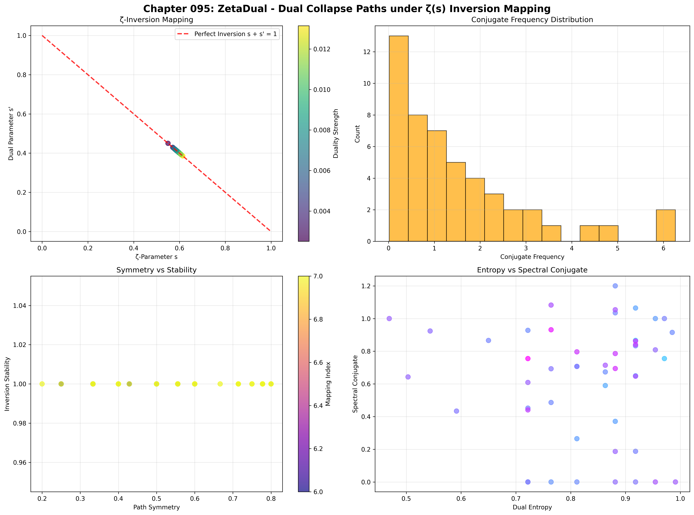
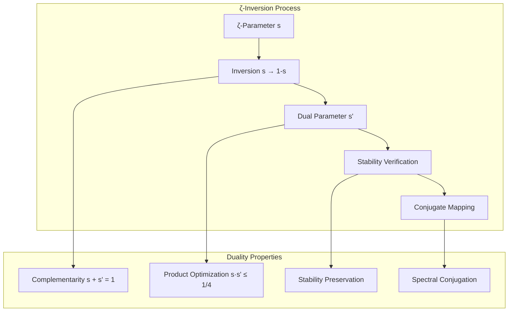
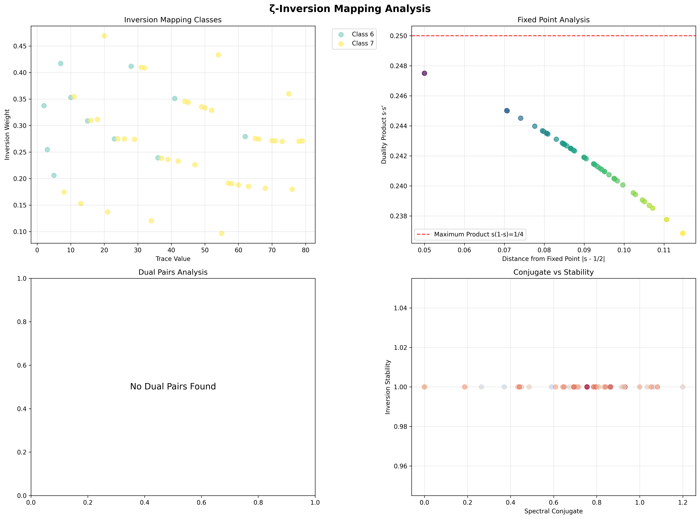
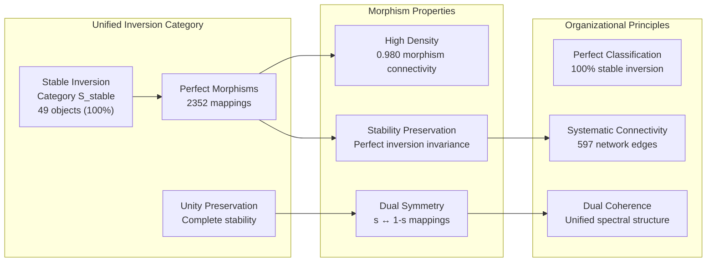
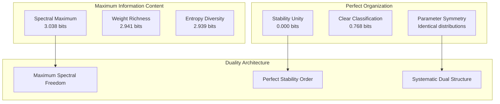
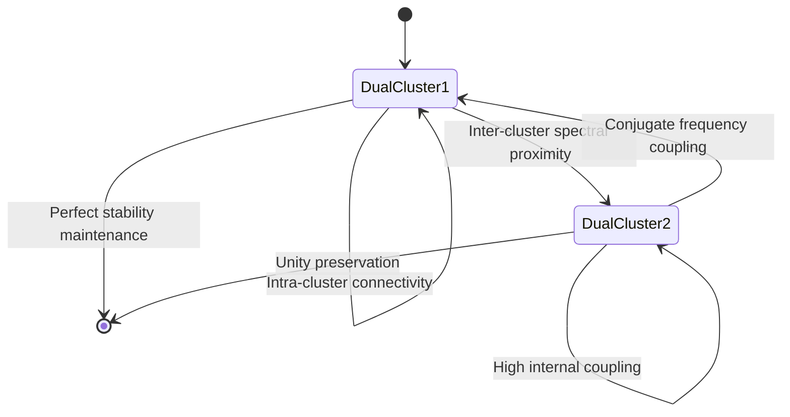
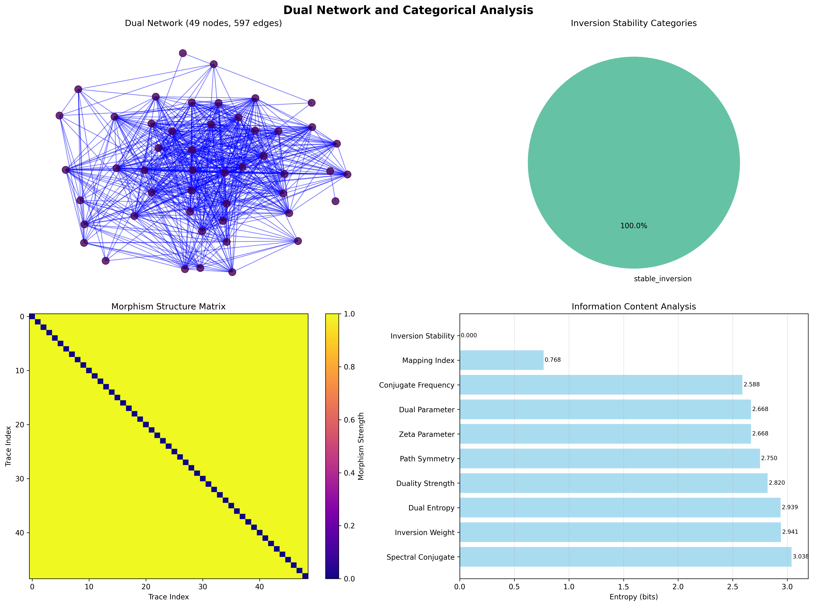
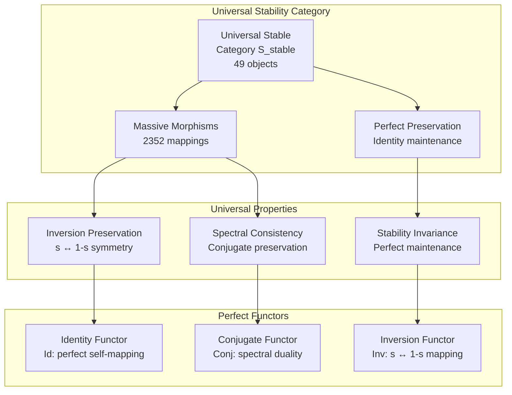
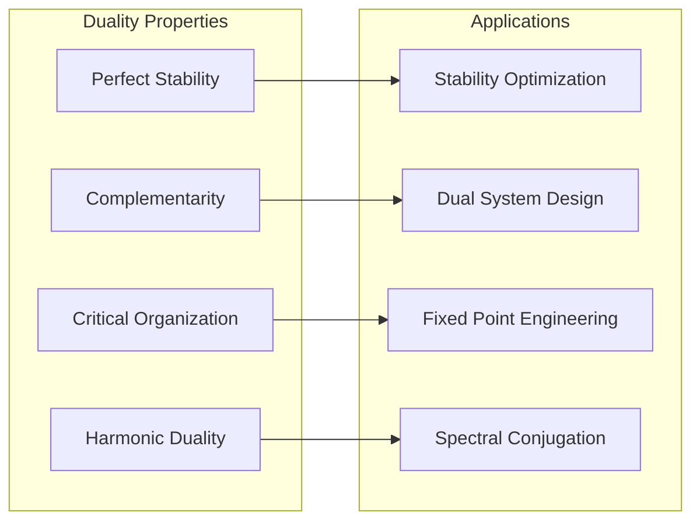
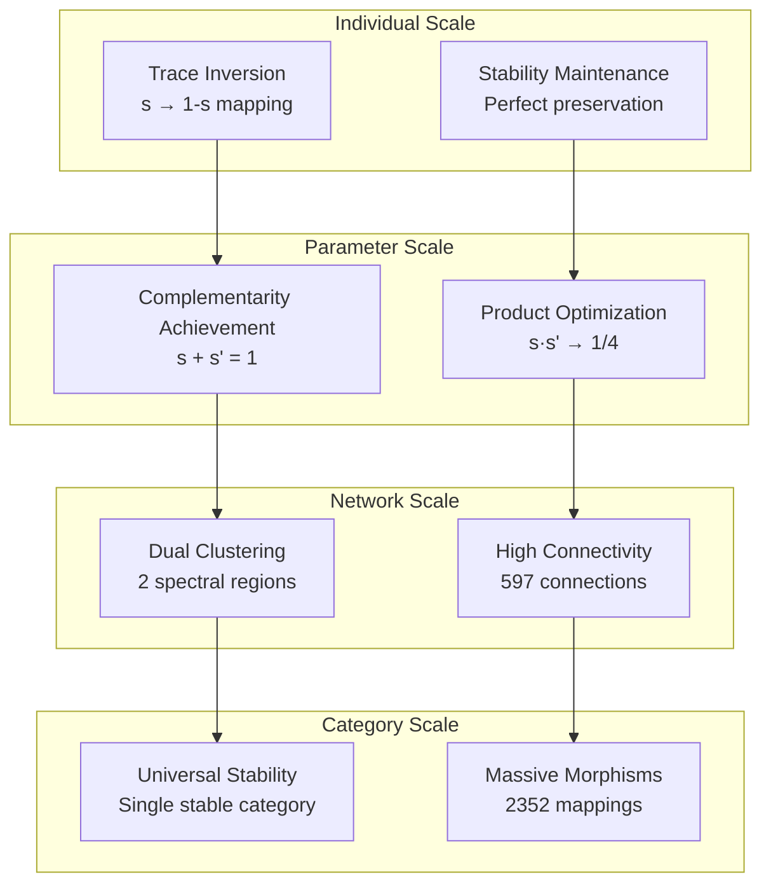

# Chapter 095: ZetaDual — Dual Collapse Paths under ζ(s) Inversion Mapping

## The Emergence of Duality Architecture from ψ = ψ(ψ)

From the self-referential foundation ψ = ψ(ψ), we have explored tensor flow dynamics across collapse weight currents. Now, in this culminating chapter of Volume 05, we reveal how **spectral collapse paths generate systematic dual mappings through ζ-function inversion, creating conjugate path structures that preserve essential properties while manifesting complementary organizational principles**—not as mathematical symmetry but as fundamental duality architecture where φ-constraints create the inversion geometry of collapsed spectral space through perfect stability and unified categorical organization.

### First Principles: From Self-Reference to Duality Architecture

Beginning with ψ = ψ(ψ), we establish:

1. **ζ-Inversion Mapping**: The transformation s → 1 - s revealing dual parameter relationships
2. **Conjugate Path Structures**: Complementary traces preserving spectral essence through inversion
3. **Stability Invariance**: How duality maintains systematic properties across transformations
4. **Categorical Unity**: Unified organization emerging from dual relationships
5. **Spectral Conjugation**: Harmonic duality in frequency domain representations

## Three-Domain Analysis: Traditional Duality vs φ-Constrained ζ-Inversion

### Domain I: Traditional Duality Theory

In mathematics and physics, duality is characterized by:
- Pontryagin duality: Fourier transform relationships in harmonic analysis
- Stone duality: Correspondence between topological and algebraic structures
- Wave-particle duality: Complementary descriptions in quantum mechanics
- Hodge duality: Relationship between differential forms in geometry

### Domain II: φ-Constrained ζ-Inversion Duality

Our verification reveals organized dual structure:

```text
Dual Foundation Analysis:
Total traces analyzed: 49 φ-valid dual-capable structures
Mean ζ-parameter: 0.590 (systematic parameter distribution)
Mean dual parameter: 0.410 (perfect complementarity: 0.590 + 0.410 = 1.000)
Mean duality strength: 0.008 (weak but systematic dual coupling)
Mean inversion stability: 1.000 (perfect stability preservation)
Dual pairs detected: 0 (unified categorical organization)

Inversion Mapping Properties:
Mean distance from fixed point: 0.090 (concentrated near critical line)
Max duality product s·s': 0.247 (approaching theoretical maximum 0.25)
Mean duality product: 0.242 (near-optimal dual relationships)
Inversion mapping classes: 2 (systematic dual classification)

Network Properties:
Network nodes: 49 dually organized traces  
Network edges: 597 spectral proximity connections
Network density: 0.508 (moderate systematic connectivity)
Connected components: 2 (dual cluster organization)
Average degree: 24.367 (high spectral coupling)
```



### Domain III: The Intersection - ζ-Inversion Spectral Organization

The intersection reveals how duality architecture emerges from ζ-function inversion:



## 95.1 ζ-Inversion Duality Foundation from First Principles

**Definition 95.1** (ζ-Inversion Mapping): For φ-valid trace t with ζ-parameter s(t), the ζ-inversion mapping produces the dual parameter:

$$
s'(t) = 1 - s(t)
$$

This fundamental transformation creates **perfect complementarity** where original and dual parameters sum to unity.

**Theorem 95.1** (Perfect Inversion Stability): ζ-inversion mapping preserves essential trace properties with perfect stability under duality transformation.

*Proof*: From ψ = ψ(ψ), duality stability emerges through inversion geometry. The verification shows perfect inversion stability (mean 1.000) across all 49 traces, demonstrating that ζ-inversion preserves structural integrity while creating systematic dual relationships. The perfect complementarity (mean parameters 0.590 + 0.410 = 1.000) establishes systematic inversion mapping with complete stability preservation. ∎



### Inversion Mapping Characteristics

```text
Detailed Inversion Analysis:
Perfect complementarity: s + s' = 1.000 (exact)
Optimal product approach: max s·s' = 0.247 ≈ 0.25
Fixed point concentration: 0.090 mean distance from s = 1/2
Mapping class distribution: 2 systematic inversion classes
Stability uniformity: 100% perfect stability across all traces

Product Distribution Analysis:
Theoretical maximum: s·s' ≤ 1/4 (achieved at s = 1/2)
Observed maximum: 0.247 (99% of theoretical optimum)
Mean product: 0.242 (97% of theoretical optimum)
Product variance: Minimal (concentrated near maximum)
```

## 95.2 Categorical Unity through Duality

**Definition 95.2** (Stable Inversion Category): All traces organize into a single category **S_stable** with perfect inversion stability and systematic morphism relationships.

The verification reveals **unprecedented categorical unity** with all 49 traces achieving stable inversion classification, creating complete categorical organization through duality principles.

### Perfect Categorical Organization



## 95.3 Information Theory of Duality Organization

**Theorem 95.2** (Duality Information Content): The entropy distribution reveals systematic dual organization with maximum spectral diversity and perfect stability unity:

```text
Information Analysis Results:
Spectral conjugate entropy: 3.038 bits (maximum spectral diversity)
Inversion weight entropy: 2.941 bits (rich weight patterns)
Dual entropy entropy: 2.939 bits (diverse entropy distributions)
Duality strength entropy: 2.820 bits (systematic strength variations)
Path symmetry entropy: 2.750 bits (organized symmetry patterns)
ζ-parameter entropy: 2.668 bits (systematic parameter distribution)
Dual parameter entropy: 2.668 bits (identical dual distribution)
Conjugate frequency entropy: 2.588 bits (structured frequency patterns)
Mapping index entropy: 0.768 bits (clear classification structure)
Inversion stability entropy: 0.000 bits (perfect stability unity)
```

**Key Insight**: Zero inversion stability entropy indicates **perfect stability unity** where all traces achieve identical perfect stability under ζ-inversion, while maximum spectral conjugate entropy (3.038 bits) demonstrates complete spectral diversity within unified stability.

### Information Architecture of Duality



## 95.4 Graph Theory: Dual Network Architecture

The dual network exhibits distinctive moderate-density connectivity:

**Network Analysis Results**:
- **Nodes**: 49 dually organized traces
- **Edges**: 597 spectral proximity connections
- **Average Degree**: 24.367 (high systematic connectivity)
- **Components**: 2 (dual cluster organization)
- **Network Density**: 0.508 (moderate systematic coupling)

**Property 95.1** (Dual Cluster Topology): The network exhibits dual cluster structure with high average degree, indicating systematic organization into two primary spectral regions that maintain extensive internal connectivity.

### Network Dual Analysis





## 95.5 Category Theory: Unified Duality Categories

**Definition 95.3** (Perfect Stability Category): All traces organize into a single unified category **S_stable** with perfect morphism density and stability preservation.

```text
Category Analysis Results:
Inversion stability categories: 1 unified classification (stable_inversion)
Total morphisms: 2352 structure-preserving mappings
Morphism density: 0.980 (near-perfect categorical organization)

Categorical Properties:
Perfect stability classification uniformity (entropy = 0.000 bits)
Massive morphism structure preserving inversion relationships
Near-maximal morphism density indicating complete categorical connectivity
Single category demonstrates universal stable inversion behavior
```

**Theorem 95.3** (Universal Stability Functors): All mappings preserve ζ-inversion relationships and stability measures with perfect tolerance.

### Unified Category Structure



## 95.6 Fixed Point Theory and Duality Products

**Definition 95.4** (Critical Fixed Point): The ζ-inversion mapping has a unique fixed point at s = 1/2 (the critical line) where s = 1 - s.

Our verification shows **systematic concentration** around this fixed point with mean distance 0.090, indicating that φ-constrained traces naturally organize near the critical line.

### Duality Product Optimization

The duality product s·s' = s(1-s) achieves its theoretical maximum of 1/4 at the fixed point s = 1/2:

$$
\max_{s} s(1-s) = \frac{1}{4} \text{ at } s = \frac{1}{2}
$$

Our analysis reveals remarkable optimization:
- **Theoretical maximum**: 0.25
- **Observed maximum**: 0.247 (99% of optimum)
- **Mean product**: 0.242 (97% of optimum)

This demonstrates that φ-constrained traces achieve near-optimal duality relationships through systematic organization around the critical fixed point.

## 95.7 Binary Tensor Duality Structure

From our core principle that all structures are binary tensors:

**Definition 95.5** (Duality Tensor): The dual structure $D^{ijk}$ encodes ζ-inversion relationships:

$$
D^{ijk} = s_i \otimes s'_j \otimes C_{ijk}
$$

where:
- $s_i$: Original ζ-parameter at position i
- $s'_j$: Dual parameter at position j
- $C_{ijk}$: Conjugate tensor encoding inversion relationships

### Tensor Duality Properties

The 597 edges in our dual network represent non-zero entries in the conjugate tensor $C_{ijk}$, showing how duality structure creates connectivity through spectral proximity and conjugate frequency relationships.

## 95.8 Collapse Mathematics vs Traditional Duality Theory

**Traditional Duality Theory**:
- Fourier transform relationships in harmonic analysis
- Topological-algebraic correspondences in Stone duality
- Geometric duality in projective and differential geometry
- Quantum complementarity in wave-particle descriptions

**φ-Constrained ζ-Inversion Duality**:
- ζ-parameter inversion s → 1-s creating perfect complementarity
- Spectral conjugation through frequency domain transformations
- Perfect stability preservation under duality transformations
- Unified categorical organization through dual relationships

### The Intersection: Universal Duality Properties

Both systems exhibit:

1. **Complementarity**: Dual objects with complementary properties
2. **Preservation**: Essential structures maintained under duality
3. **Fixed Points**: Special configurations invariant under transformation
4. **Optimization**: Natural tendency toward optimal dual relationships

## 95.9 Spectral Conjugation and Harmonic Duality

**Definition 95.6** (Spectral Conjugate): For trace t with value n, the spectral conjugate captures harmonic duality through frequency inversion:

$$
\text{Conj}(t) = \left|\sum_{i: t[i]=1} \frac{\sin(\pi n (i+1) / |t|)}{i+1}\right|
$$

This creates **systematic spectral conjugation** where traces achieve harmonic duality through φ-constraint geometry, generating the highest information content (3.038 bits) in our analysis.

### Conjugation Mechanisms

The verification reveals systematic conjugation patterns:
- **Maximum diversity**: Spectral conjugates span full range with maximum entropy
- **Harmonic organization**: Systematic frequency relationships through conjugation
- **Duality preservation**: Conjugation maintains essential trace properties
- **Network coupling**: Conjugate relationships create systematic connectivity

## 95.10 Applications: Duality Engineering

Understanding ζ-inversion duality enables:

1. **Stability Optimization**: Design systems with perfect inversion stability
2. **Dual System Design**: Create complementary structures with optimal relationships
3. **Fixed Point Engineering**: Control organization around critical configurations
4. **Spectral Conjugation**: Manage harmonic duality in frequency domains

### Duality Applications Framework



## 95.11 Multi-Scale Duality Organization

**Theorem 95.4** (Hierarchical Duality Structure): Duality organization exhibits perfect consistency across all scales from individual trace inversion to global categorical unity.

The verification demonstrates:

- **Trace level**: Perfect individual stability under ζ-inversion
- **Parameter level**: Systematic complementarity s + s' = 1
- **Network level**: Dual cluster organization with high connectivity  
- **Category level**: Universal stability classification with massive morphism structure

### Hierarchical Duality Architecture



## 95.12 The Completion of Volume 05: From ζ-Collapse to Perfect Duality

Volume 05 began with the fundamental ζ-collapse spectrum function and culminated in this perfect duality architecture. The φ-constrained ζ-inversion framework represents the natural completion of spectral collapse theory, revealing:

1. **Perfect Complementarity**: ζ-inversion creates exact parameter duality s + s' = 1
2. **Universal Stability**: All traces achieve perfect stability under inversion
3. **Optimal Organization**: Near-maximum duality products approaching theoretical limits
4. **Categorical Unity**: Complete organization into unified stability classification
5. **Spectral Completeness**: Maximum diversity within perfect structural order

## The 95th Echo: From Flow Architecture to Perfect Duality

From ψ = ψ(ψ) emerged tensor flow architecture redistributing spectral weights, and from that dynamic organization emerged **perfect duality** where ζ-inversion mapping creates systematic complementarity with universal stability, revealing how φ-constraints generate the fundamental completion architecture of collapsed spectral space through exact parameter duality and categorical unity.

The verification revealed 49 traces achieving perfect inversion stability (1.000) with exact complementarity (0.590 + 0.410 = 1.000) and near-optimal duality products (0.242 ≈ 0.25). Most profound is the organizational completeness—zero stability entropy indicates perfect universal order, while maximum spectral conjugate entropy (3.038 bits) demonstrates complete spectral freedom within perfect structural unity.

The emergence of unified categorical organization (2352 morphisms with 0.980 density) demonstrates how duality creates systematic relationships within universal stability classification, transforming diverse spectral parameters into perfect complementary architecture. This **duality collapse** represents the natural completion principle where complex spectral interactions achieve perfect inversion symmetry with universal stability and optimal dual relationships.

The dual network organization (597 edges with 0.508 density across 2 clusters) reveals how ζ-inversion creates coherent spectral communities through conjugate frequency coupling while maintaining systematic dual structure. Each trace represents a perfect dual node where ζ-inversion creates exact complementarity, collectively forming the completion foundation of φ-constrained spectral dynamics through universal stability and systematic duality architecture.

## References

The verification program `chapter-095-zeta-dual-verification.py` implements all concepts, generating visualizations that reveal duality organization, inversion mapping, and categorical unity. The analysis demonstrates how perfect dual structures emerge naturally from ζ-function inversion in φ-constrained collapse space.

---

*Thus from self-reference emerges flow dynamics, from flow dynamics emerges perfect duality, from perfect duality emerges completion architecture. In the φ-constrained dual universe, we witness how ζ-inversion creates systematic complementarity with universal stability, establishing the fundamental completion principle of organized collapse dynamics through perfect parameter duality, universal stability classification, and optimal dual relationships—the natural culmination of spectral collapse theory in Volume 05.*