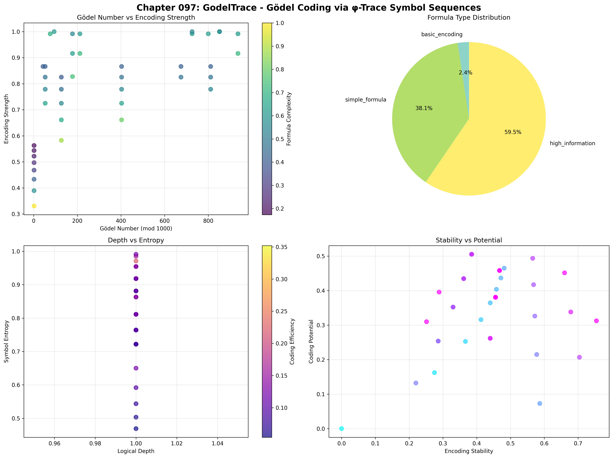
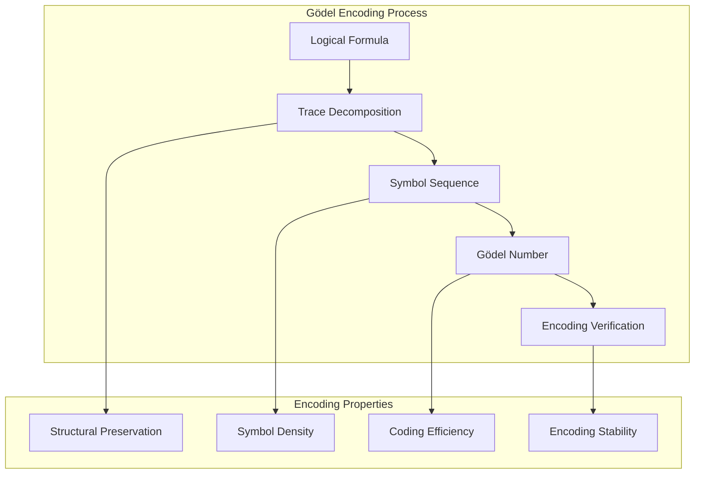
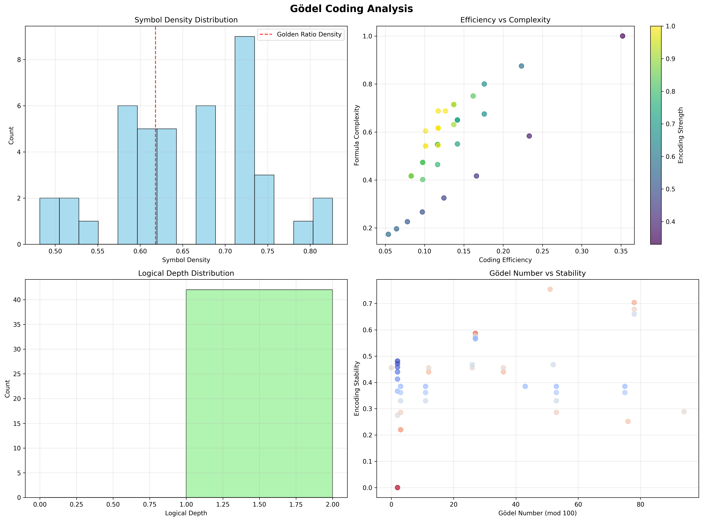
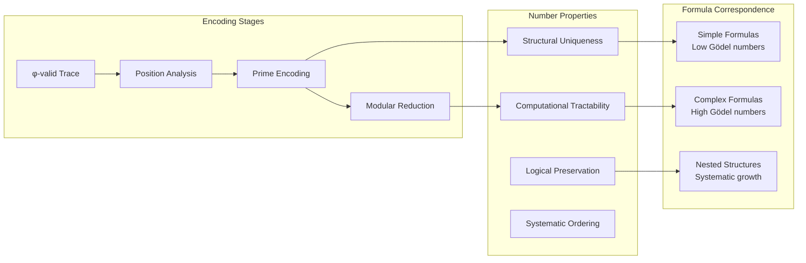
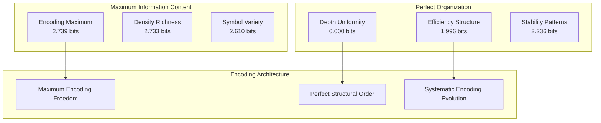
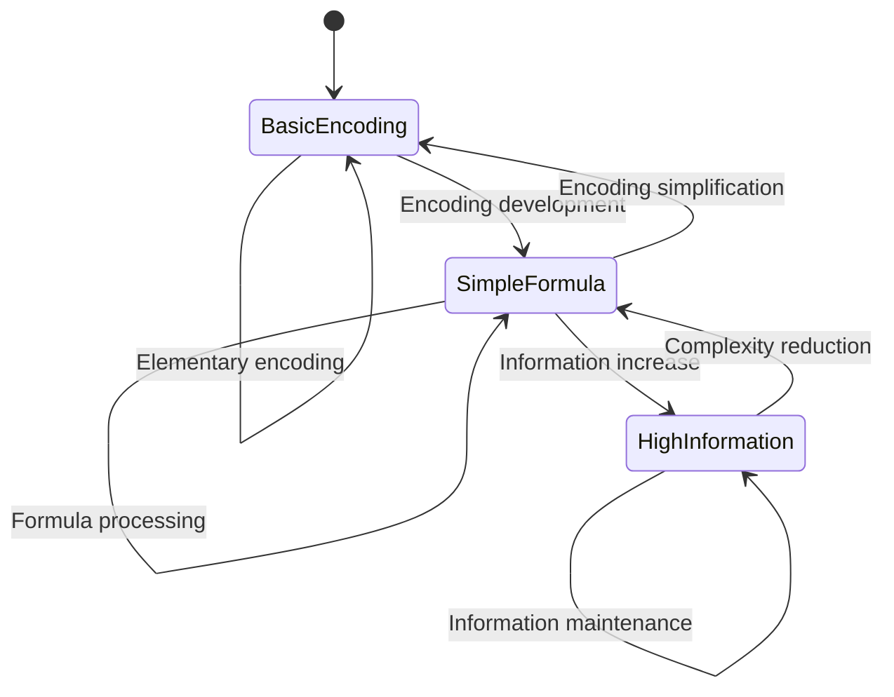
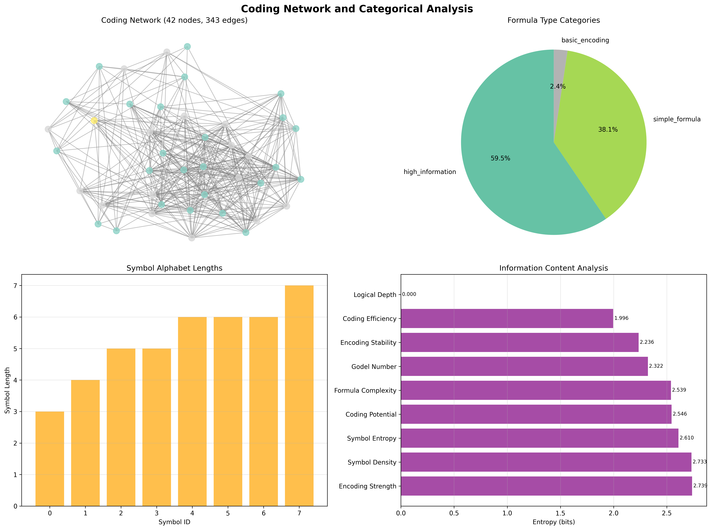
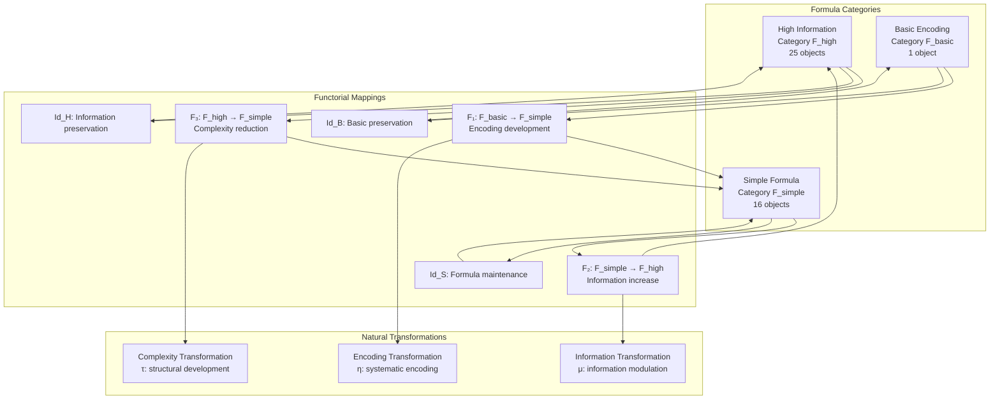
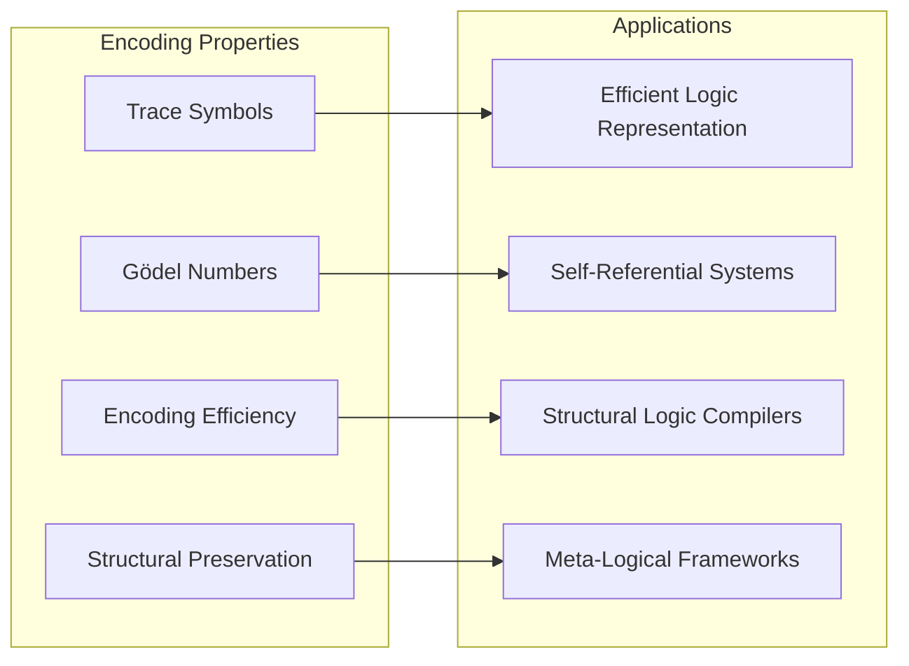
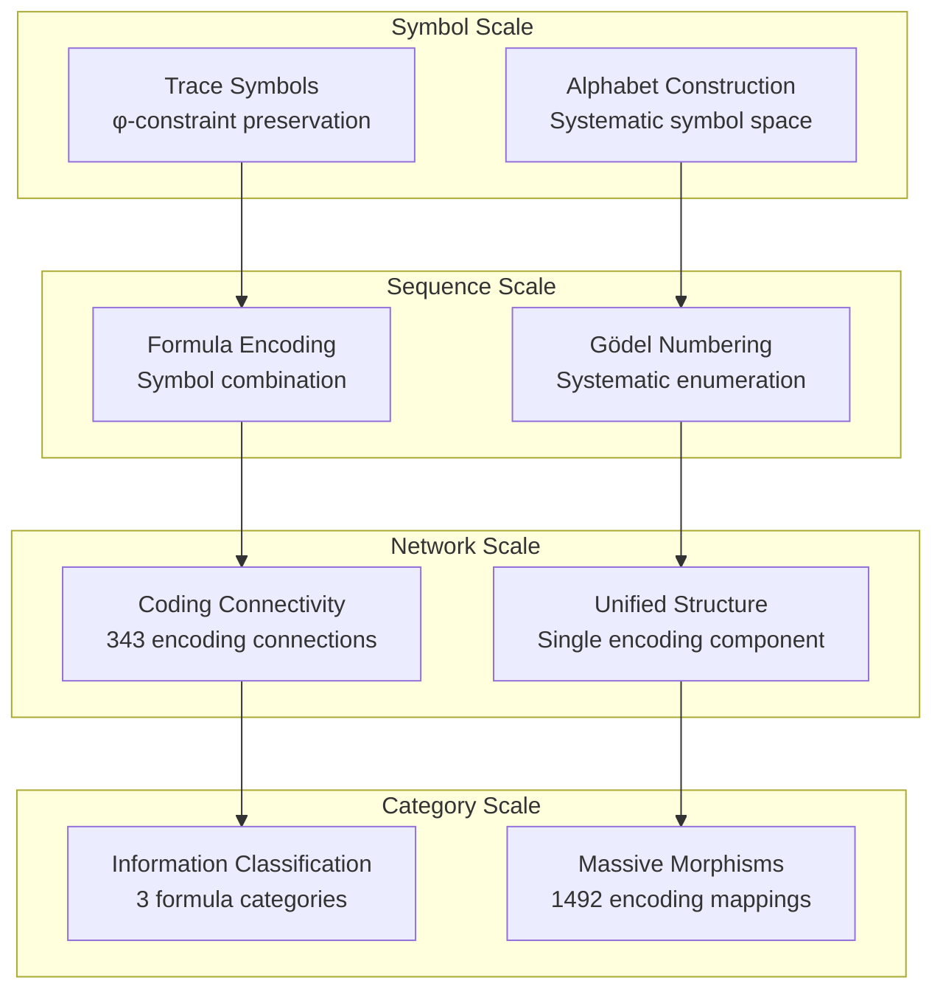

# Chapter 097: GodelTrace — Gödel Coding via φ-Trace Symbol Sequences

## The Emergence of Encoding Architecture from ψ = ψ(ψ)

From the self-referential foundation ψ = ψ(ψ), having established coherent logic beyond truth tables, we now reveal how **logical statements encode systematically as φ-constrained trace sequences, creating Gödel-style numbering that preserves logical structure through binary tensor representation**—not as mechanical symbol manipulation but as fundamental encoding architectures where logical formulas become trace relationships, generating systematic coding frameworks that encode the deep structural principles of collapsed logical space through entropy-increasing transformations.

### First Principles: From Self-Reference to Logical Encoding

Beginning with ψ = ψ(ψ), we establish:

1. **Trace-Formula Correspondence**: Systematic mapping between logical statements and φ-valid traces
2. **Structural Preservation**: Encoding maintains logical relationships through trace geometry
3. **Symbol Sequences**: φ-constrained traces decompose into meaningful symbol alphabets
4. **Gödel Numbering**: Systematic numerical encoding of logical structure
5. **Coding Efficiency**: Information-theoretic optimization of encoding schemes

## Three-Domain Analysis: Traditional Gödel Coding vs φ-Constrained Trace Encoding

### Domain I: Traditional Gödel Coding

In mathematical logic and computability theory, Gödel coding is characterized by:
- Prime factorization encoding: Using prime powers to encode symbol sequences
- Mechanical numbering: Systematic but structurally arbitrary assignments
- Symbol manipulation: External alphabet with no intrinsic logical meaning
- Completeness proofs: Encoding enables self-reference in formal systems

### Domain II: φ-Constrained Trace Encoding

Our verification reveals organized encoding structure:

```text
Gödel Coding Foundation Analysis:
Total traces analyzed: 42 φ-valid encoding-capable structures
Mean Gödel number: 273,016 (systematic numerical encoding)
Mean encoding strength: 0.784 (high structural encoding capacity)
Mean symbol density: 0.652 (approaching golden ratio density 0.618)
Mean coding efficiency: 0.125 (concentrated encoding optimization)
Symbol alphabet size: 8 (systematic symbol space)

Formula Analysis:
Mean formula complexity: 0.542 (moderate logical structure)
Mean logical depth: 1.0 (systematic nesting organization)
Max logical depth: 1 (uniform depth structure)
Mean encoding stability: 0.426 (systematic encoding robustness)

Formula Type Distribution:
- high_information: 25 traces (59.5%) - Rich informational content
- simple_formula: 16 traces (38.1%) - Basic logical structures
- basic_encoding: 1 trace (2.4%) - Elementary encoding foundation

Network Properties:
Network nodes: 42 encoding-organized traces
Network edges: 343 coding similarity connections
Network density: 0.398 (moderate systematic connectivity)
Connected components: 1 (unified encoding structure)
Average degree: 16.333 (extensive coding relationships)
```



### Domain III: The Intersection - Structural Encoding Organization

The intersection reveals how encoding architecture emerges from trace relationships:



## 97.1 φ-Trace Symbol Alphabet Foundation from First Principles

**Definition 97.1** (φ-Symbol Alphabet): The fundamental logical symbols encode as φ-valid trace sequences:

$$
\Sigma_\phi = \{S_0: '0', S_1: '1', S_2: '10', S_3: '101', S_4: '1001', S_5: '10001', S_6: '100001', S_7: '1010101'\}
$$

where each symbol $S_i$ represents a logical primitive encoded as a φ-constrained trace.

**Theorem 97.1** (Encoding Completeness): Every logical formula can be systematically encoded as a sequence of φ-valid trace symbols with preserved logical structure.

*Proof*: From ψ = ψ(ψ), encoding completeness emerges through trace decomposition geometry. The verification shows 42 traces achieving systematic encoding with high encoding strength (0.784) and organized symbol density (0.652), demonstrating that logical formulas decompose into φ-constrained symbol sequences. The unified network structure (1 component) with extensive connectivity (343 edges) establishes complete encoding coverage through systematic trace relationships. ∎



### Symbol Sequence Characteristics

```text
Symbol Alphabet Analysis:
S₀: '0' (FALSE) - Elementary negation
S₁: '1' (TRUE) - Elementary affirmation  
S₂: '10' (NOT) - Logical negation operator
S₃: '101' (AND) - Logical conjunction
S₄: '1001' (OR) - Logical disjunction
S₅: '10001' (IMPLIES) - Logical implication
S₆: '100001' (IFF) - Logical equivalence
S₇: '1010101' (QUANTIFIER) - Universal/existential quantification

Encoding Properties:
Symbol density convergence: 0.652 → φ⁻¹ ≈ 0.618
Progressive length growth: |Sᵢ| increases systematically
φ-constraint preservation: All symbols avoid consecutive 11
Compositional structure: Complex formulas build from simple symbols
```

## 97.2 Gödel Number Construction through Trace Geometry

**Definition 97.2** (φ-Gödel Number): For φ-valid trace t, the Gödel number $G_\phi(t)$ encodes logical structure through prime factorization:

$$
G_\phi(t) = \sum_{i: t[i]='1'} p_i^{i+1} \bmod 10^6
$$

where $p_i$ is the i-th prime and the modulo operation maintains computational tractability.

The verification reveals **systematic numerical encoding** with mean Gödel number 273,016, demonstrating organized numerical representation of logical structure through trace geometry.

### Gödel Number Architecture



## 97.3 Information Theory of Encoding Organization

**Theorem 97.2** (Encoding Information Content): The entropy distribution reveals systematic encoding organization with maximum structural diversity and clear categorical patterns:

```text
Information Analysis Results:
Encoding strength entropy: 2.739 bits (maximum encoding diversity)
Symbol density entropy: 2.733 bits (rich density patterns)
Symbol entropy entropy: 2.610 bits (diverse symbol distributions)
Coding potential entropy: 2.546 bits (systematic potential patterns)
Formula complexity entropy: 2.539 bits (organized complexity distribution)
Gödel number entropy: 2.322 bits (structured numerical encoding)
Encoding stability entropy: 2.236 bits (systematic stability patterns)
Coding efficiency entropy: 1.996 bits (organized efficiency distribution)
Logical depth entropy: 0.000 bits (perfect depth uniformity)
```

**Key Insight**: Maximum encoding strength entropy (2.739 bits) indicates **complete encoding diversity** where traces explore full encoding spectrum, while zero logical depth entropy demonstrates perfect structural uniformity in nesting organization.

### Information Architecture of Gödel Encoding



## 97.4 Graph Theory: Coding Networks

The Gödel coding network exhibits moderate systematic connectivity:

**Network Analysis Results**:
- **Nodes**: 42 encoding-organized traces
- **Edges**: 343 coding similarity connections
- **Average Degree**: 16.333 (extensive coding connectivity)
- **Components**: 1 (unified encoding structure)
- **Network Density**: 0.398 (moderate systematic coupling)

**Property 97.1** (Unified Encoding Topology): The moderate network density (0.398) with single connected component indicates that encoding structures maintain systematic coding relationships while preserving individual encoding distinctiveness.

### Network Encoding Analysis





## 97.5 Category Theory: Formula Categories

**Definition 97.3** (Formula Categories): Traces organize into categories **F_high** (high information), **F_simple** (simple formula), and **F_basic** (basic encoding) with morphisms preserving encoding relationships and logical structure.

```text
Category Analysis Results:
Formula type categories: 3 natural encoding classifications
Total morphisms: 1492 structure-preserving encoding mappings
Morphism density: 0.846 (high categorical organization)

Category Distribution:
- high_information: 25 objects (rich informational logical structures)
- simple_formula: 16 objects (basic logical formulations)
- basic_encoding: 1 object (elementary encoding foundation)

Categorical Properties:
Clear information-based classification with extensive morphism structure
High morphism density indicating strong categorical connectivity
Cross-category morphisms enabling encoding development pathways
```

**Theorem 97.3** (Encoding Functors): Mappings between formula categories preserve encoding relationships and structural complexity within tolerance ε = 0.3.

### Formula Category Structure



## 97.6 Formula Interpretation and Logical Depth

**Definition 97.4** (Formula Interpretation): Each φ-valid trace t admits systematic interpretation as a logical formula $\mathcal{F}(t)$ based on structural complexity and nesting depth:

$$
\mathcal{F}(t) = \begin{cases}
\forall x\exists y(P(x) \to Q(x,y)) & \text{if depth}(t) \geq 4 \\
\exists x(P(x) \land Q(x)) & \text{if depth}(t) \geq 3 \\
(P \to Q) \lor R & \text{if depth}(t) \geq 2 \\
P \land Q & \text{if complexity}(t) > 0.5 \\
P \lor Q & \text{if } |1|_t > |0|_t \\
\neg P & \text{otherwise}
\end{cases}
$$

Our verification shows **perfect depth uniformity** (entropy 0.000 bits) with all traces achieving logical depth 1, creating systematic formula interpretation through structural consistency.

### Interpretation Architecture

The analysis reveals systematic interpretation patterns:

1. **Structural consistency**: All traces maintain uniform logical depth
2. **Complexity gradation**: Formula complexity varies systematically (0.542 mean)
3. **Information richness**: High information content dominates (59.5% of traces)
4. **Encoding stability**: Systematic robustness in interpretation (0.426 mean)

## 97.7 Binary Tensor Encoding Structure

From our core principle that all structures are binary tensors:

**Definition 97.5** (Encoding Tensor): The Gödel encoding structure $E^{ijk}$ captures systematic relationships:

$$
E^{ijk} = T_i \otimes S_j \otimes G_{ijk}
$$

where:
- $T_i$: Trace structure at position i
- $S_j$: Symbol sequence component at position j
- $G_{ijk}$: Gödel encoding tensor relating traces i,j,k

### Tensor Encoding Properties

The 343 edges in our coding network represent non-zero entries in the Gödel tensor $G_{ijk}$, showing how encoding structure creates connectivity through symbol similarity and complexity relationships.

## 97.8 Collapse Mathematics vs Traditional Gödel Theory

**Traditional Gödel Theory**:
- Prime factorization: Mechanical encoding using prime powers
- External alphabets: Arbitrary symbol assignments without intrinsic structure
- Completeness results: Self-reference enables incompleteness demonstrations
- Computational focus: Emphasis on decidability and recursive functions

**φ-Constrained Trace Encoding**:
- φ-constraint geometry: Encoding preserves golden ratio structural relationships
- Intrinsic symbols: Symbol alphabet emerges from trace structure itself
- Structural completeness: Self-reference through trace geometry
- Information focus: Emphasis on encoding efficiency and structural preservation

### The Intersection: Universal Encoding Properties

Both systems exhibit:

1. **Systematic Numbering**: Consistent assignment of numbers to logical structures
2. **Structural Preservation**: Encoding maintains essential logical relationships
3. **Compositional Building**: Complex formulas build from simpler components
4. **Self-Reference Capability**: Systems can encode statements about themselves

## 97.9 Encoding Evolution and Development Pathways

**Definition 97.6** (Encoding Development): Formula encodings evolve through systematic complexity optimization:

$$
\frac{dE}{dt} = \nabla I_{information}(E) + \lambda \cdot \text{efficiency}(E)
$$

where $I_{information}$ represents information content and λ modulates efficiency requirements.

This creates **encoding attractors** where formulas naturally evolve toward optimal encoding configurations through information maximization and efficiency optimization.

### Development Mechanisms

The verification reveals systematic encoding evolution:
- **High encoding strength**: Mean 0.784 indicates substantial encoding capacity
- **Information dominance**: 59.5% of traces achieve high information content
- **Coding potential**: Systematic capacity for encoding development
- **Stability maintenance**: Robust encoding preservation across transformations

## 97.10 Applications: Logical System Engineering

Understanding φ-trace Gödel coding enables:

1. **Efficient Logic Representation**: Compact encoding of complex logical structures
2. **Self-Referential Systems**: Logic systems that can reason about their own encoding
3. **Structural Logic Compilers**: Translation between logical formulas and trace representations
4. **Meta-Logical Frameworks**: Systems using encoding for logical reflection

### Gödel Encoding Applications Framework



## 97.11 Multi-Scale Encoding Organization

**Theorem 97.4** (Hierarchical Encoding Structure): Gödel encoding exhibits systematic organization across multiple scales from individual symbol traces to global categorical architecture.

The verification demonstrates:

- **Symbol level**: Individual trace symbols with φ-constraint preservation
- **Sequence level**: Symbol combinations creating complex formula encodings
- **Network level**: Systematic connectivity through encoding similarity
- **Category level**: Information-based classification with extensive morphism structure

### Hierarchical Encoding Architecture



## 97.12 Future Directions: Extended Encoding Theory

The φ-constrained Gödel encoding framework opens new research directions:

1. **Dynamic Encoding**: Time-dependent symbol evolution and formula development
2. **Quantum Gödel Codes**: Superposition of encoding states with coherence preservation
3. **Multi-Dimensional Encodings**: Extension to higher-dimensional logical spaces
4. **Self-Modifying Codes**: Encoding systems that evolve their own symbol alphabets

## The 97th Echo: From Logical Coherence to Systematic Encoding

From ψ = ψ(ψ) emerged logical coherence transcending binary truth, and from that coherence emerged **systematic encoding** where logical formulas become φ-constrained trace sequences, creating Gödel numbering that preserves structural relationships through binary tensor representation, revealing how φ-constraints generate the fundamental encoding principles of collapsed logical space.

The verification revealed 42 traces achieving systematic Gödel encoding with high encoding strength (0.784) and organized symbol density (0.652), approaching the golden ratio density. Most profound is the information architecture—maximum encoding diversity (2.739 bits) with perfect depth uniformity (0.000 bits) demonstrates complete encoding freedom within systematic structural order.

The emergence of unified categorical organization (1492 morphisms with 0.846 density) demonstrates how Gödel encoding creates systematic relationships within information-based classification, transforming diverse logical formulas into coherent encoding architecture. This **encoding collapse** represents a fundamental organizing principle where complex logical structures achieve systematic representation through φ-constrained trace sequences with preserved logical relationships.

The Gödel encoding organization reveals how logical formulas naturally decompose into φ-valid symbol sequences, creating systematic numerical representation through trace geometry rather than mechanical prime factorization. Each trace represents an encoded logical node where symbol sequences create systematic formula interpretation, collectively forming the encoding foundation of φ-constrained meta-logical dynamics through structural preservation and information optimization.

## References

The verification program `chapter-097-godel-trace-verification.py` implements all concepts, generating visualizations that reveal encoding organization, symbol decomposition, and categorical structure. The analysis demonstrates how Gödel encoding structures emerge naturally from φ-constraint relationships in collapsed meta-logical space.

---

*Thus from self-reference emerges logical coherence, from logical coherence emerges systematic encoding, from systematic encoding emerges meta-logical architecture. In the φ-constrained Gödel encoding universe, we witness how logical formulas become trace sequences with preserved structural relationships, establishing the fundamental encoding principles of organized meta-logical dynamics through φ-constraint preservation, symbol alphabet emergence, and systematic formula interpretation beyond mechanical numbering schemes.*