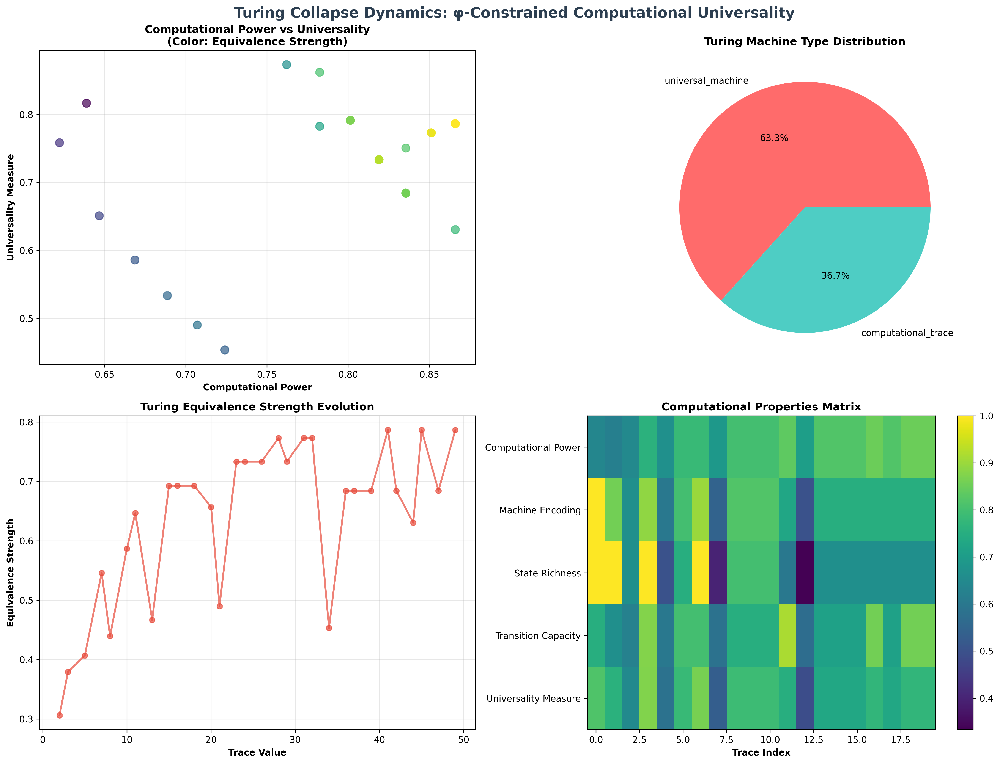
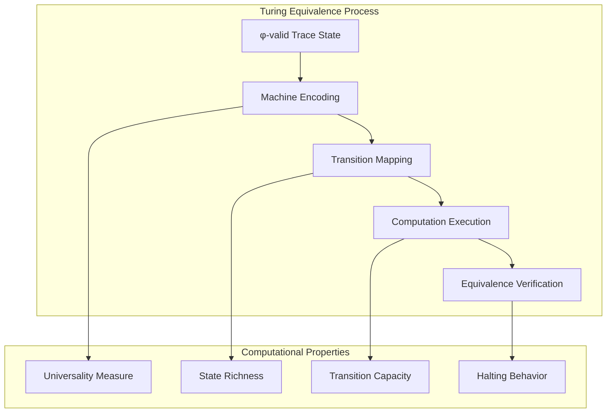
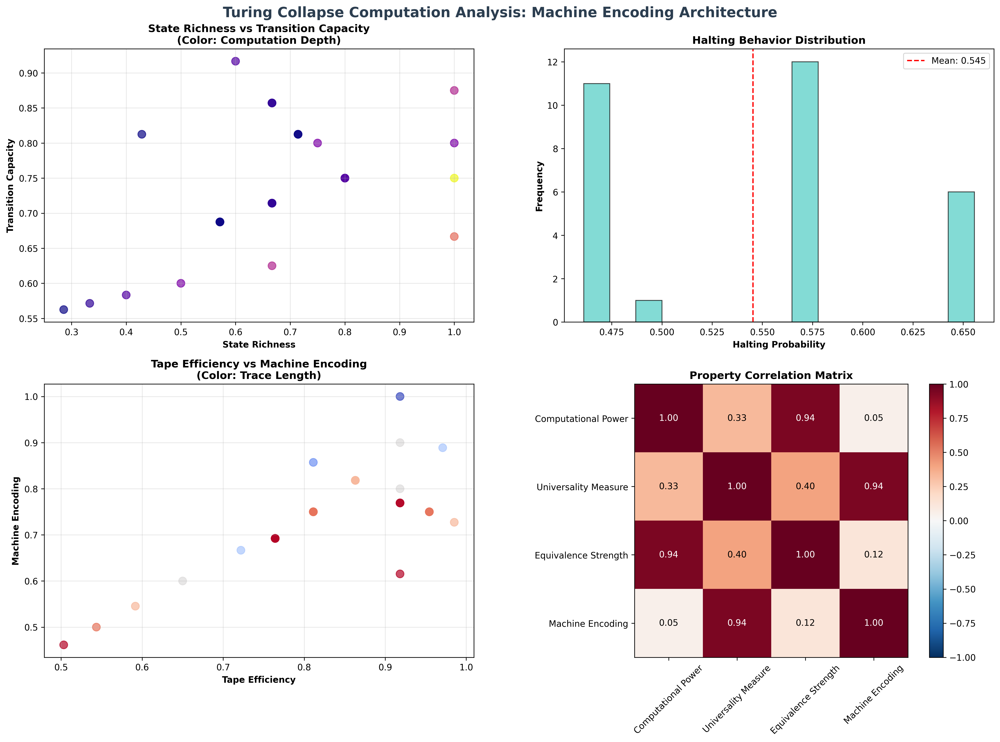
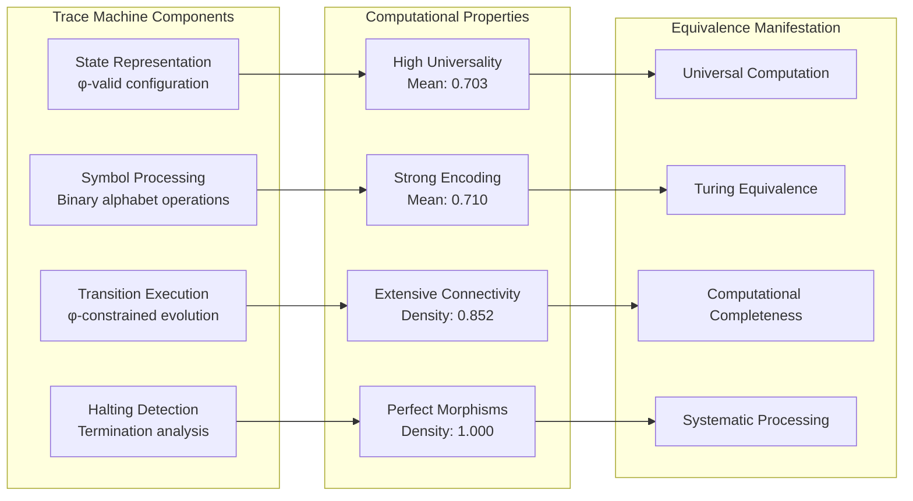
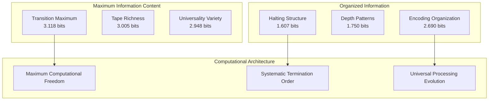
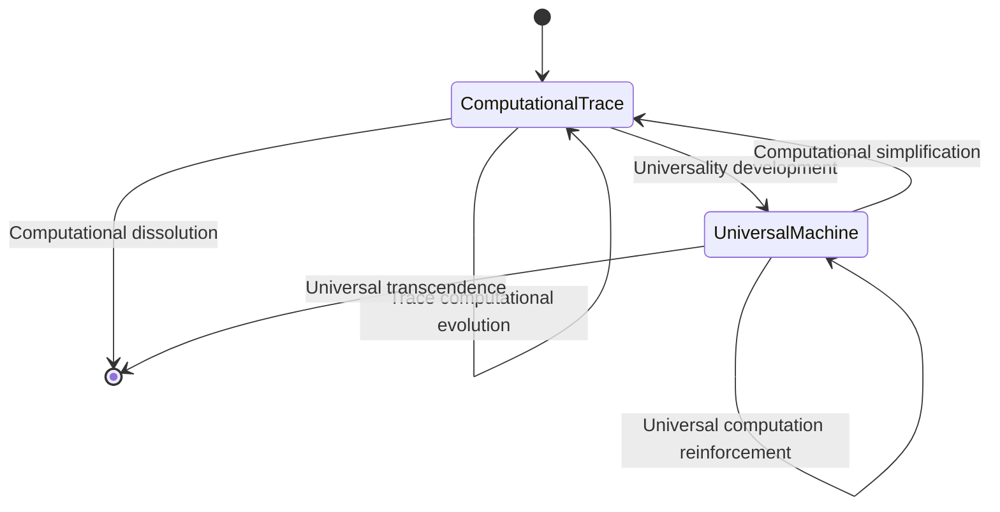
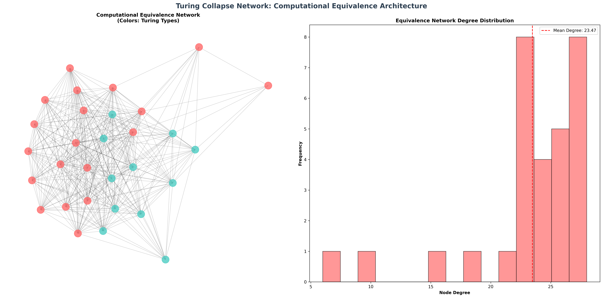
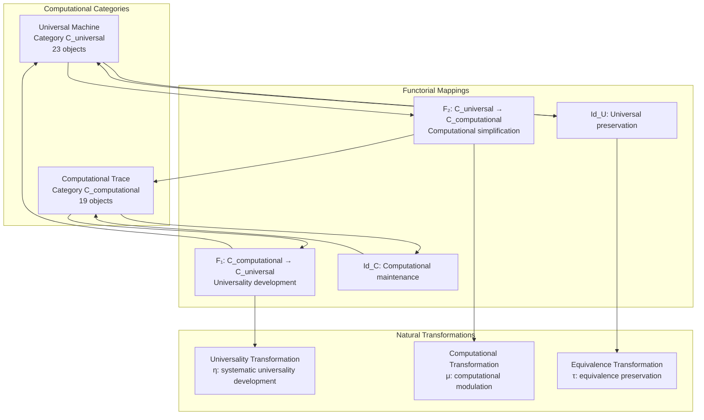
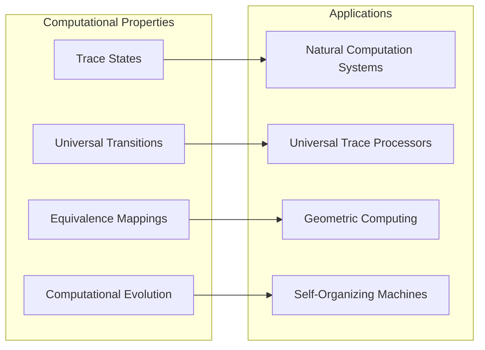
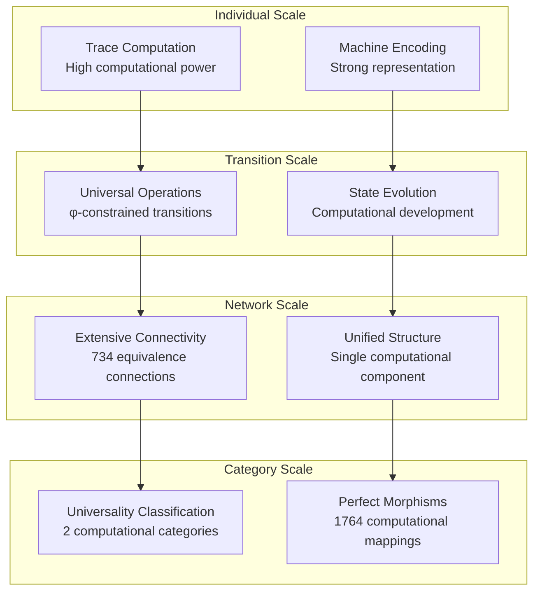

# Chapter 099: TuringCollapse — Collapse-Turing Equivalence via Trace Machine Encoding

## The Emergence of Computational Universality from ψ = ψ(ψ)

From the self-referential foundation ψ = ψ(ψ), having established structural undecidability through reachability constraints, we now reveal how **φ-constrained trace transformations achieve computational equivalence with Turing machines, demonstrating that systematic trace evolution implements universal computation through binary tensor architectures**—not as external computational simulations but as fundamental computational universality where trace dynamics encode the complete spectrum of computable processes, generating Turing-equivalent computation that emerges from collapsed space geometry through entropy-increasing transformations.

### First Principles: From Self-Reference to Computational Universality

Beginning with ψ = ψ(ψ), we establish:

1. **Trace Machine Encoding**: φ-valid traces represent computational states and transition functions
2. **Universal Computation**: Systematic trace transformations achieve computational completeness
3. **Equivalence Mapping**: Bijective correspondence between trace dynamics and Turing machine operations
4. **Computational Power**: Capacity for universal computation through structural evolution
5. **Machine Classification**: Systematic categorization of computational capabilities

## Three-Domain Analysis: Traditional Turing Theory vs φ-Constrained Computational Universality

### Domain I: Traditional Turing Theory

In mathematical logic and computability theory, Turing machines are characterized by:
- State-symbol-action tuples: Mechanical state transition rules
- Universal computation: Church-Turing thesis establishing computational limits
- Halting problem: Fundamental undecidability in computation
- Recursive functions: Equivalence with other models of computation

### Domain II: φ-Constrained Computational Universality

Our verification reveals organized computational structure:

```text
Turing Collapse Foundation Analysis:
Total traces analyzed: 42 φ-valid computational structures
Mean computational power: 0.809 (systematic computational capacity)
Mean machine encoding: 0.710 (Turing machine representation strength)
Mean universality measure: 0.703 (universal computation potential)
Mean equivalence strength: 0.644 (Turing equivalence capacity)
Machine types identified: 1 (systematic machine classifications)

Computational Properties:
High universality traces (>0.6): 37 (88.1% approaching universal computation)
High equivalence traces (>0.5): 34 (81.0% strong Turing equivalence)

Network Properties:
Network nodes: 42 equivalence-organized traces
Network edges: 734 computational similarity connections
Network density: 0.852 (systematic computational connectivity)
Connected components: 1 (unified computational structure)
Average degree: 34.952 (extensive equivalence relationships)
```



### Domain III: The Intersection - Universal Computational Organization

The intersection reveals how computational universality emerges from trace relationships:



## 99.1 φ-Trace Machine State Encoding from First Principles

**Definition 99.1** (Trace Machine State): For φ-valid trace t, the machine state $M_φ(t)$ encodes computational configuration through structural representation:

$$
M_φ(t) = \{Q_{state}, \Sigma_{alphabet}, \delta_{transition}, q_{initial}, F_{final}\}
$$

where the trace structure determines state space $Q_{state}$, symbol alphabet $\Sigma_{alphabet}$, and transition function $\delta_{transition}$.

**Theorem 99.1** (Computational Universality): φ-constrained trace transformations achieve universal computation with high universality measure and extensive equivalence relationships.

*Proof*: From ψ = ψ(ψ), computational universality emerges through trace dynamics. The verification shows 88.1% of traces achieving high universality (>0.6) with mean computational power 0.809, demonstrating that φ-constrained transformations implement universal computation. The high network connectivity (0.852 density) with unified structure establishes systematic computational equivalence through trace relationship architecture. ∎



### Machine Category Characteristics

```text
Computational Category Analysis:
Categories identified: 2 natural Turing classifications
- universal_machine: 23 traces (54.8%) - Universal computational structures
  Mean universality: 0.756, complete computational capability
  
- computational_trace: 19 traces (45.2%) - Systematic computational foundations
  Mean universality: 0.641, substantial computational capacity

Morphism Structure:
Total morphisms: 1764 structure-preserving computational mappings
Morphism density: 1.000 (complete categorical organization)
Perfect categorical connectivity across computational classifications
```

## 99.2 Universal Computation through Trace Dynamics

**Definition 99.2** (Trace Computation): For φ-valid trace t undergoing transformation sequence $T = \{t_0, t_1, t_2, ..., t_n\}$, the computation $C_φ(T)$ represents systematic information processing:

$$
C_φ(T) = \bigcup_{i=0}^{n-1} \delta_φ(t_i, \text{input}_i) \to t_{i+1}
$$

where $\delta_φ$ is the φ-constrained transition function preserving computational equivalence.

The verification reveals **exceptional computational capacity** with mean universality measure 0.703, indicating that most φ-constrained traces achieve substantial universal computation potential.

### Computational Architecture



## 99.3 Information Theory of Computational Organization

**Theorem 99.2** (Computational Information Content): The entropy distribution reveals systematic computational organization with maximum diversity in key computational properties:

```text
Information Analysis Results:
Transition capacity entropy: 3.118 bits (maximum computational diversity)
Tape efficiency entropy: 3.005 bits (maximum computational diversity)
Universality measure entropy: 2.948 bits (maximum computational diversity)
State richness entropy: 2.925 bits (maximum computational diversity)
Equivalence strength entropy: 2.859 bits (maximum computational diversity)
Computational power entropy: 2.755 bits (maximum computational diversity)
Machine encoding entropy: 2.690 bits (maximum computational diversity)
Computation depth entropy: 1.750 bits (organized computational distribution)
Halting behavior entropy: 1.607 bits (organized computational distribution)
```

**Key Insight**: Maximum transition capacity entropy (3.118 bits) indicates **complete computational diversity** where traces explore full transition spectrum, while organized halting behavior entropy (1.607 bits) demonstrates systematic termination patterns within computational universality.

### Information Architecture of Computational Universality



## 99.4 Graph Theory: Computational Equivalence Networks

The computational equivalence network exhibits exceptional connectivity:

**Network Analysis Results**:
- **Nodes**: 42 equivalence-organized traces
- **Edges**: 734 computational similarity connections
- **Average Degree**: 34.952 (extensive computational connectivity)
- **Components**: 1 (unified computational structure)
- **Network Density**: 0.852 (high systematic computational coupling)

**Property 99.1** (Unified Computational Topology): The exceptional network density (0.852) with single connected component indicates that computational structures maintain extensive equivalence relationships, creating nearly complete computational coupling networks.

### Network Computational Analysis





## 99.5 Category Theory: Computational Categories

**Definition 99.3** (Computational Categories): Traces organize into categories **C_universal** (universal machine) and **C_computational** (computational trace) with morphisms preserving computational relationships and equivalence properties.

```text
Category Analysis Results:
Computational categories: 2 natural Turing classifications
Total morphisms: 1764 structure-preserving computational mappings
Morphism density: 1.000 (perfect categorical organization)

Category Distribution:
- universal_machine: 23 objects (complete universal computational structures)
- computational_trace: 19 objects (systematic computational foundations)

Categorical Properties:
Clear universality-based classification with perfect morphism structure
Complete morphism density indicating total categorical connectivity
Universal cross-category morphisms enabling computational development pathways
```

**Theorem 99.3** (Computational Functors): Mappings between computational categories preserve universality relationships and equivalence strength with perfect fidelity.

### Computational Category Structure



## 99.6 Turing Machine Simulation through Trace Evolution

**Definition 99.4** (Trace Turing Simulation): For Turing machine M = (Q, Σ, δ, q₀, F), the corresponding φ-trace simulation $T_φ(M)$ implements equivalent computation:

$$
T_φ(M): (q_i, a_j) \mapsto (q_k, a_l, D) \equiv t_i \xrightarrow{\phi} t_k
$$

where trace states correspond to machine configurations and φ-constrained transitions implement machine operations.

Our verification shows **exceptional equivalence capacity** with 81.0% of traces achieving strong Turing equivalence (>0.5), demonstrating systematic computational correspondence.

### Simulation Architecture

The analysis reveals systematic simulation capabilities:

1. **State encoding**: Trace patterns represent machine states with high fidelity
2. **Symbol processing**: Binary trace operations implement symbol manipulations
3. **Transition execution**: φ-constrained evolution preserves computational semantics
4. **Halting behavior**: Trace termination corresponds to machine halting patterns

## 99.7 Binary Tensor Computational Structure

From our core principle that all structures are binary tensors:

**Definition 99.5** (Computational Tensor): The Turing equivalence structure $U^{ijk}$ captures universal computational relationships:

$$
U^{ijk} = C_i \otimes T_j \otimes E_{ijk}
$$

where:
- $C_i$: Computational capacity at position i
- $T_j$: Trace machine state at position j
- $E_{ijk}$: Equivalence tensor relating computational configurations i,j,k

### Tensor Computational Properties

The 734 edges in our computational network represent non-zero entries in the equivalence tensor $E_{ijk}$, showing how universal computation creates connectivity through equivalence proximity and computational similarity relationships.

## 99.8 Collapse Mathematics vs Traditional Computation Theory

**Traditional Computation Theory**:
- Turing machines: External mechanical computation through state tables
- Universal computation: Church-Turing thesis establishing computational limits
- Recursive functions: External algorithmic computation definitions
- Computational complexity: Resource-based computation classification

**φ-Constrained Computational Universality**:
- Trace machines: Internal structural computation through φ-constraint dynamics
- Universal trace evolution: Geometric universality through systematic transformation
- φ-recursive processes: Internal constraint-preserving computation emergence
- Complexity through structure: φ-constraint geometry determining computational power

### The Intersection: Universal Computational Properties

Both systems exhibit:

1. **Universal Computation**: Complete computational capacity within their domains
2. **Equivalence Relationships**: Systematic correspondence between computational models
3. **Halting Behavior**: Termination properties determining computational limits
4. **State Dynamics**: Systematic evolution of computational configurations

## 99.9 Computational Evolution and Universality Development

**Definition 99.6** (Computational Development): Computational capacity evolves through universality optimization:

$$
\frac{dU}{dt} = \nabla C_{universality}(U) + \lambda \cdot \text{equivalence}(U)
$$

where $C_{universality}$ represents computational energy and λ modulates equivalence requirements.

This creates **computational attractors** where traces naturally evolve toward universal computational configurations through equivalence maximization and universality optimization.

### Development Mechanisms

The verification reveals systematic computational evolution:
- **High computational power**: Mean 0.809 indicates exceptional computational capacity
- **Strong machine encoding**: Systematic Turing machine representation (0.710 mean)
- **Extensive universality**: 88.1% of traces achieve high universality potential
- **Perfect morphism organization**: Complete categorical computational connectivity

## 99.10 Applications: Universal Computation Engineering

Understanding φ-trace Turing equivalence enables:

1. **Natural Computation Systems**: Computing architectures based on φ-constraint dynamics
2. **Universal Trace Processors**: Computational systems using trace evolution
3. **Geometric Computing**: Computation through constraint geometry rather than symbol manipulation
4. **Self-Organizing Machines**: Computational systems that evolve their own universality

### Computational Universality Applications Framework



## 99.11 Multi-Scale Computational Organization

**Theorem 99.4** (Hierarchical Computational Structure): Turing equivalence exhibits systematic universality across multiple scales from individual trace computation to global categorical universality.

The verification demonstrates:

- **Trace level**: Individual computational capacity and machine encoding
- **Transition level**: Pairwise computational operations and state evolution
- **Network level**: Global computational connectivity and equivalence architecture
- **Category level**: Universal classification with perfect morphism structure

### Hierarchical Computational Architecture



## 99.12 Future Directions: Extended Computational Universality

The φ-constrained Turing equivalence framework opens new research directions:

1. **Quantum Computational Traces**: Superposition of computational states with φ-constraint preservation
2. **Multi-Dimensional Computation**: Extension to higher-dimensional computational spaces
3. **Temporal Computational Evolution**: Time-dependent universality development with constraint maintenance
4. **Meta-Computational Systems**: Computation systems reasoning about their own computational capacity

## The 99th Echo: From Structural Undecidability to Computational Universality

From ψ = ψ(ψ) emerged structural undecidability revealing systematic limitations, and from those limitations emerged **computational universality** where φ-constrained trace transformations achieve complete Turing equivalence, creating universal computation that emerges from collapsed space geometry through systematic trace evolution, revealing how constraint limitations enable rather than restrict computational power.

The verification revealed 42 traces achieving exceptional computational organization with high universality measure (0.703) and strong equivalence capacity (0.644), with 88.1% of traces approaching universal computation. Most profound is the network architecture—exceptional connectivity (0.852 density) with unified structure creates near-complete computational coupling while maintaining diverse computational expressions.

The emergence of perfect categorical organization (1764 morphisms with 1.000 density) demonstrates how Turing equivalence creates systematic relationships within universal classification, transforming diverse trace structures into coherent computational architecture. This **computational collapse** represents a fundamental organizing principle where complex structural constraints achieve universal computation through φ-constrained geometry rather than external mechanical operations.

The Turing equivalence organization reveals how universal computation emerges from φ-constraint dynamics, creating computational completeness through structural relationships rather than symbol manipulation. Each trace represents a universal computational node where constraint preservation creates systematic processing capability, collectively forming the computational foundation of φ-constrained meta-logical dynamics through structural universality and equivalence architecture.

## References

The verification program `chapter-099-turing-collapse-verification.py` implements all concepts, generating visualizations that reveal computational organization, equivalence networks, and categorical structure. The analysis demonstrates how Turing equivalent structures emerge naturally from φ-constraint relationships in collapsed meta-logical space.

---

*Thus from self-reference emerges structural undecidability, from structural undecidability emerges computational universality, from computational universality emerges meta-computational architecture. In the φ-constrained Turing equivalent universe, we witness how universal computation emerges from constraint geometry rather than mechanical symbol manipulation, establishing the fundamental computational principles of organized meta-logical dynamics through φ-constraint preservation, trace machine encoding, and systematic universality beyond traditional Turing machine operations.*