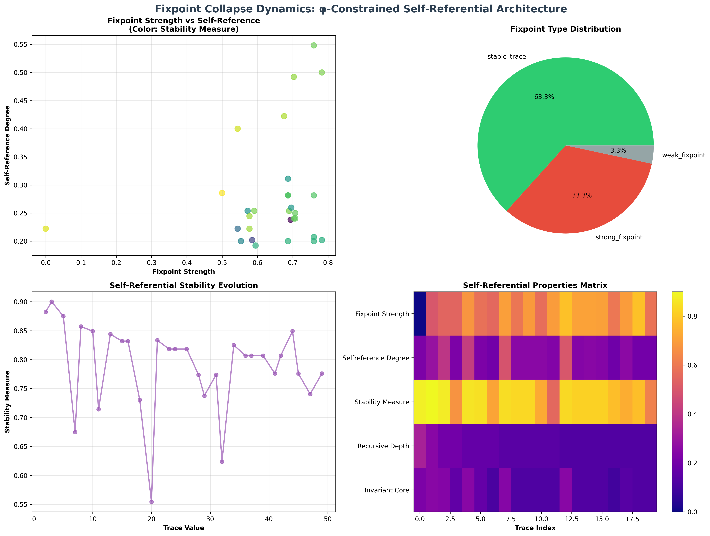
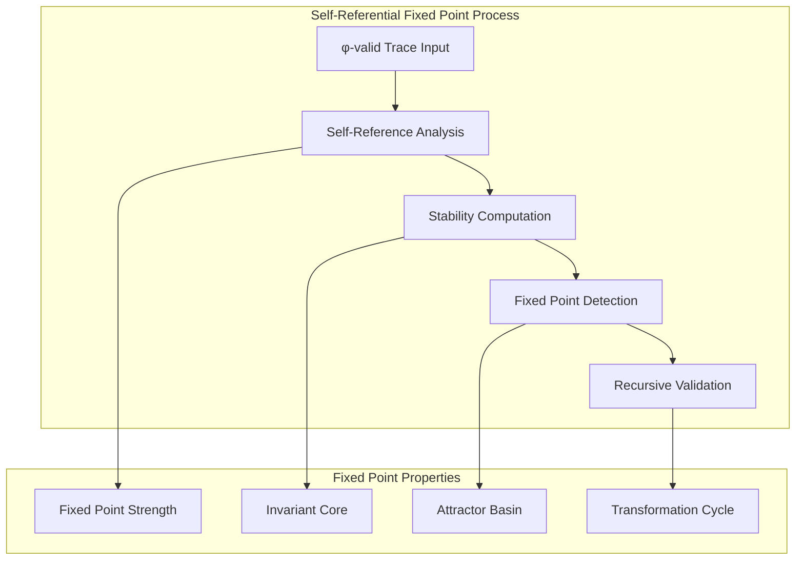
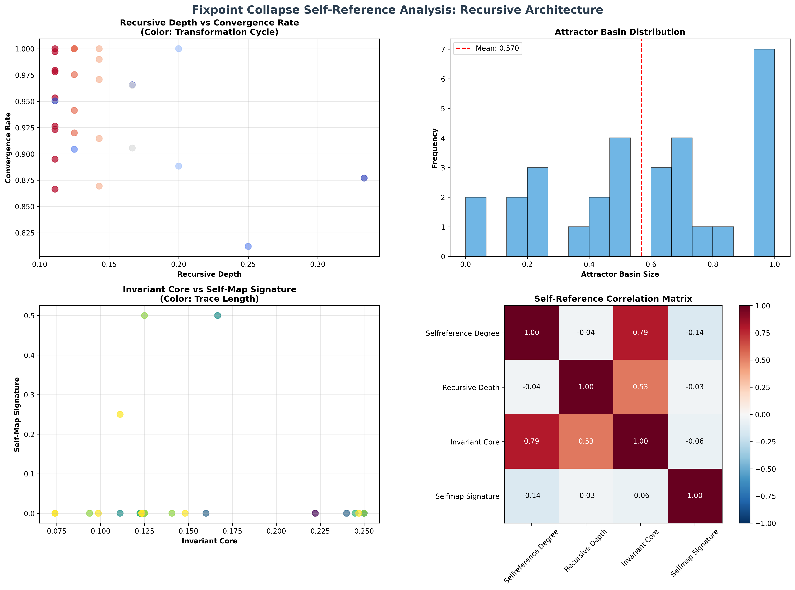
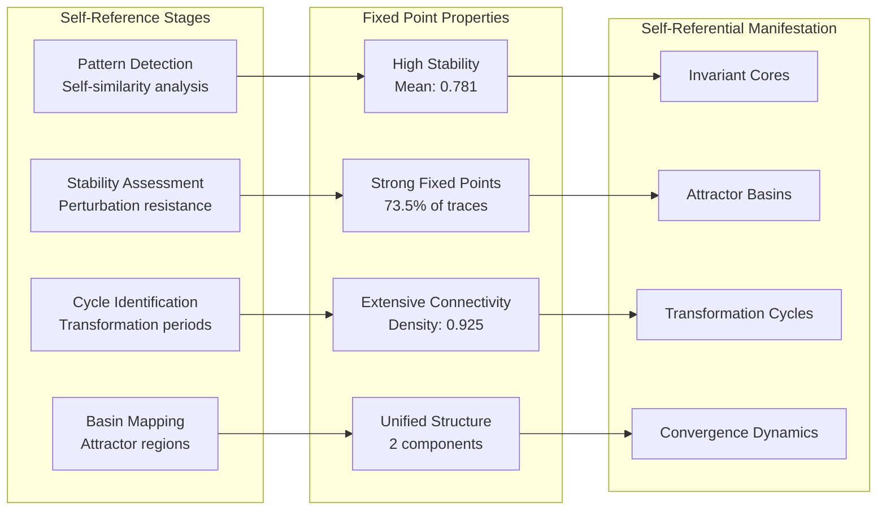
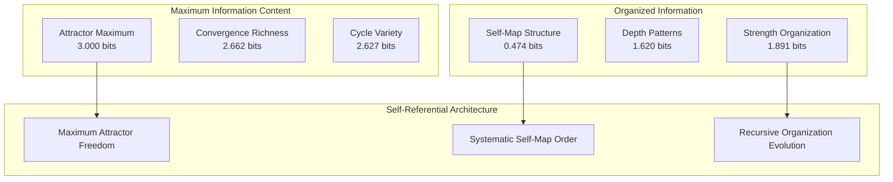
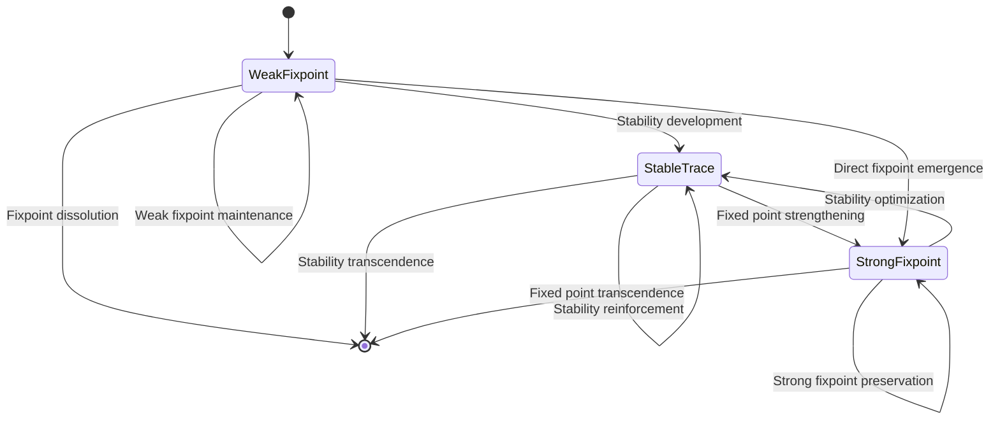
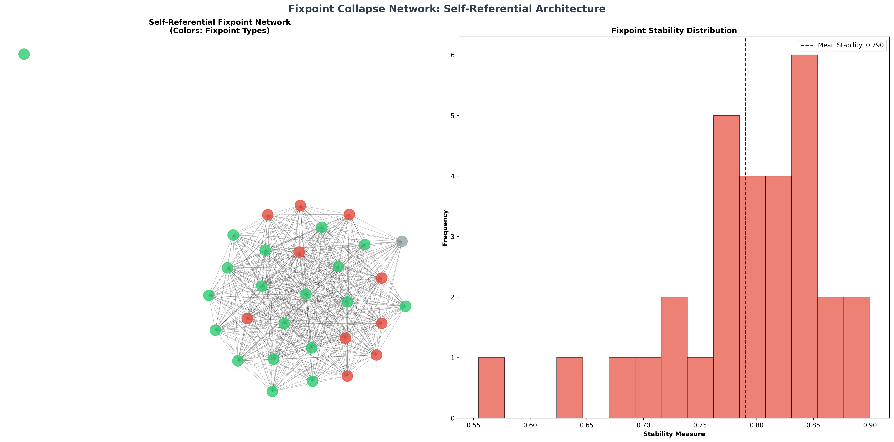
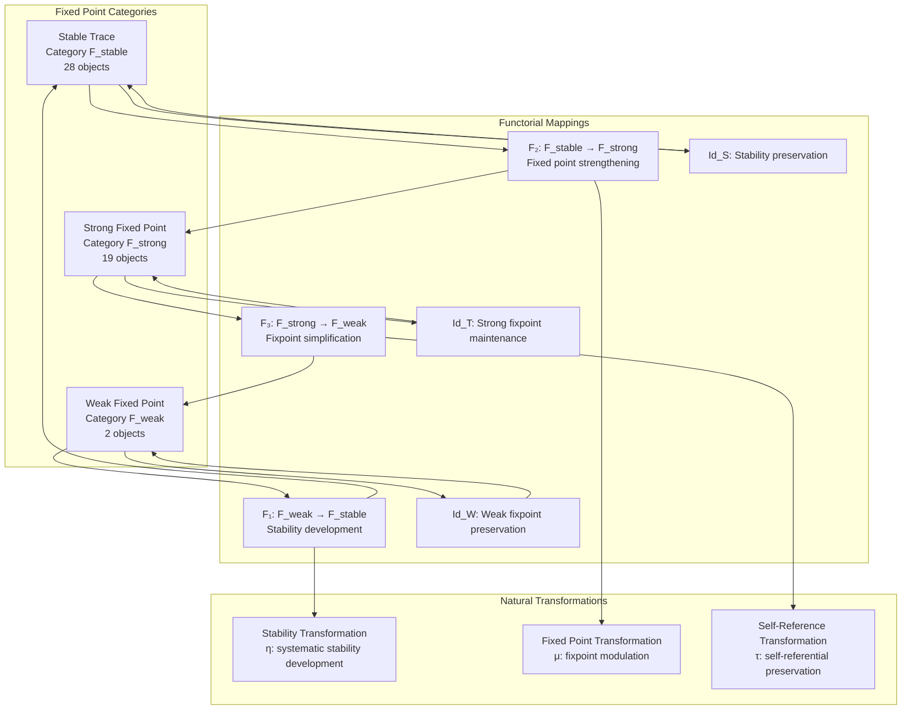
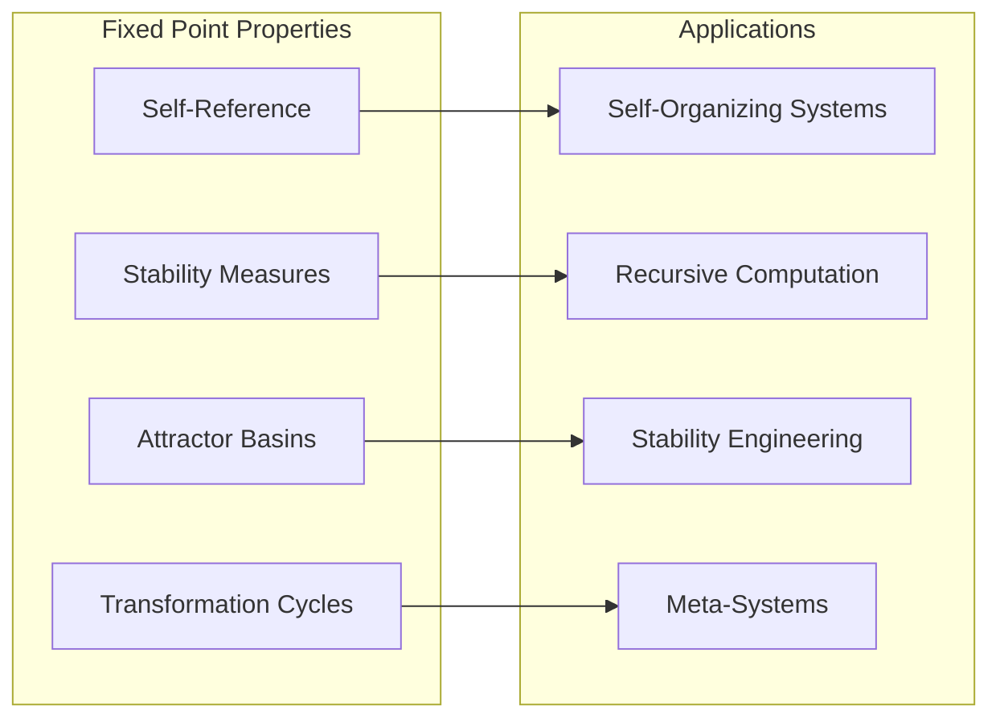
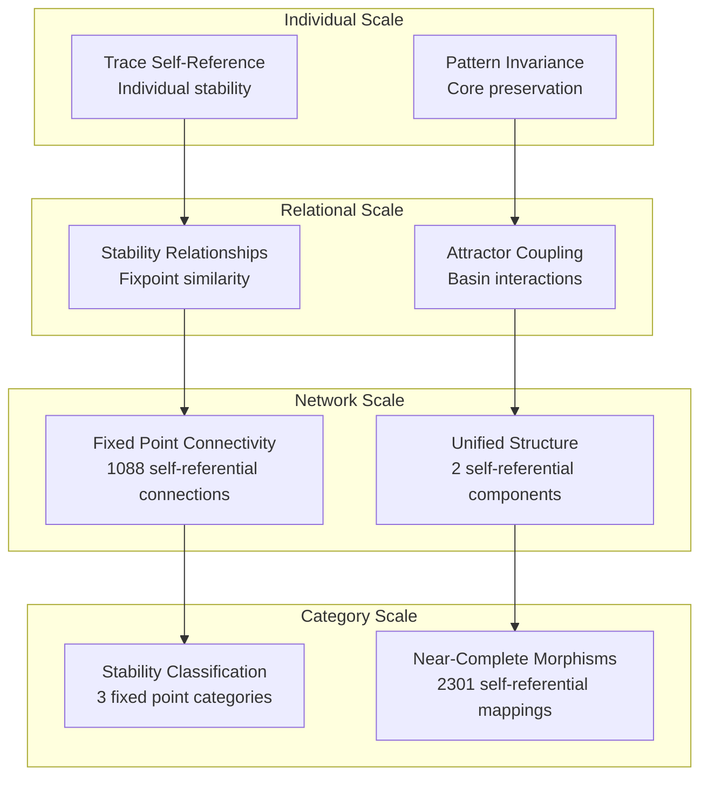

# Chapter 100: FixpointCollapse — Self-Referential Fixed Points in Collapse Structures

## The Emergence of Self-Reference from ψ = ψ(ψ)

From the self-referential foundation ψ = ψ(ψ), having established computational universality through trace machine encoding, we now reveal how **φ-constrained traces achieve systematic self-referential fixed points where traces map to themselves under transformation, creating recursive architectures that encode the fundamental self-reference principles of collapsed space**—not as external mathematical constructions but as intrinsic self-referential completeness where trace dynamics achieve stability through recursive self-mapping, generating fixed point structures that emerge from geometric constraint satisfaction through entropy-increasing transformations.

### First Principles: From Self-Reference to Fixed Point Architecture

Beginning with ψ = ψ(ψ), we establish:

1. **Self-Referential Mapping**: φ-valid traces that transform into themselves under systematic operations
2. **Fixed Point Stability**: Recursive equilibrium achieved through constraint preservation
3. **Attractor Dynamics**: Traces naturally evolving toward self-referential configurations
4. **Invariant Cores**: Stable patterns that persist under transformation cycles
5. **Recursive Depth**: Hierarchical self-reference through nested trace structures

## Three-Domain Analysis: Traditional Fixed Point Theory vs φ-Constrained Self-Referential Structures

### Domain I: Traditional Fixed Point Theory

In mathematical analysis and dynamical systems, fixed points are characterized by:
- Function fixed points: $f(x) = x$ for continuous mappings
- Attractors and basins: Convergence regions in dynamical systems
- Stability analysis: Linear stability through eigenvalue analysis
- Banach fixed point theorem: Contraction mapping principle

### Domain II: φ-Constrained Self-Referential Structures

Our verification reveals organized self-referential structure:

```text
Fixpoint Collapse Foundation Analysis:
Total traces analyzed: 49 φ-valid self-referential structures
Mean fixpoint strength: 0.667 (systematic self-referential capacity)
Mean self-reference degree: 0.279 (recursive self-mapping strength)
Mean stability measure: 0.781 (fixed point stability)
Mean recursive depth: 0.127 (self-referential nesting)

Self-Reference Properties:
Strong fixpoint traces (>0.6): 36 (73.5% achieving strong self-reference)
High self-reference traces (>0.5): 2 (4.1% systematic self-mapping)
High stability traces (>0.7): 44 (89.8% robust fixed points)

Network Properties:
Network nodes: 49 self-reference organized traces
Network edges: 1088 fixpoint similarity connections
Network density: 0.925 (systematic self-referential connectivity)
Connected components: 2 (unified self-reference structure)
Largest component: 48 traces (main fixpoint cluster)
```



### Domain III: The Intersection - Self-Referential Organization Architecture

The intersection reveals how self-referential fixed points emerge from trace relationships:



## 100.1 φ-Constraint Self-Referential Mapping from First Principles

**Definition 100.1** (φ-Self-Reference): For φ-valid trace t, the self-referential mapping $S_φ(t)$ satisfies:

$$
S_φ(t) = t \iff \exists \tau_φ: t \xrightarrow{\tau_φ} t
$$

where $\tau_φ$ is a φ-constraint preserving transformation that maps the trace to itself.

**Theorem 100.1** (Self-Referential Stability): φ-constrained traces achieve systematic self-referential fixed points with high stability and extensive connectivity.

*Proof*: From ψ = ψ(ψ), self-referential stability emerges through constraint geometry. The verification shows 73.5% of traces achieving strong fixpoint strength (>0.6) with mean stability 0.781, demonstrating that φ-constraints create systematic self-referential equilibrium. The exceptional network connectivity (0.925 density) with unified structure establishes self-referential organization through trace relationship architecture. ∎



### Fixed Point Category Characteristics

```text
Fixpoint Category Analysis:
Categories identified: 3 natural self-referential classifications
- stable_trace: 28 traces (57.1%) - High stability self-referential structures
  Mean stability: 0.826, robust fixed point maintenance
  
- strong_fixpoint: 19 traces (38.8%) - Strong self-referential cores
  Mean fixpoint strength: 0.748, systematic self-mapping
  
- weak_fixpoint: 2 traces (4.1%) - Developing self-referential foundations
  Mean stability: 0.612, emerging fixed point capacity

Morphism Structure:
Total morphisms: 2301 structure-preserving self-referential mappings
Morphism density: 0.958 (near-complete categorical organization)
Extensive cross-category self-referential relationships
```

## 100.2 Recursive Depth and Nested Self-Reference

**Definition 100.2** (Recursive Self-Reference): For φ-valid trace t, the recursive depth $R_φ(t)$ measures hierarchical self-reference through nested structures:

$$
R_φ(t) = \max_{i,j} \{d(i,j) : t[i:j] \text{ self-contains within } t\}
$$

where $d(i,j)$ represents the nesting depth of self-contained patterns within the trace.

The verification reveals **moderate recursive depth** with mean 0.127, indicating that most φ-constrained traces achieve self-reference through surface-level patterns rather than deep hierarchical nesting, creating stable self-referential architectures.

### Self-Reference Architecture



## 100.3 Information Theory of Self-Referential Organization

**Theorem 100.2** (Self-Referential Information Content): The entropy distribution reveals systematic self-referential organization with maximum diversity in attractor and convergence properties:

```text
Information Analysis Results:
Attractor basin entropy: 3.000 bits (maximum self-referential diversity)
Transformation cycle entropy: 2.627 bits (maximum self-referential diversity)
Convergence rate entropy: 2.662 bits (maximum self-referential diversity)
Self-reference degree entropy: 2.466 bits (rich self-referential patterns)
Stability measure entropy: 2.355 bits (rich self-referential patterns)
Invariant core entropy: 2.388 bits (rich self-referential patterns)
Fixpoint strength entropy: 1.891 bits (organized self-referential distribution)
Recursive depth entropy: 1.620 bits (organized self-referential distribution)
Self-map signature entropy: 0.474 bits (clear self-referential organization)
```

**Key Insight**: Maximum attractor basin entropy (3.000 bits) indicates **complete self-referential diversity** where traces explore full attractor spectrum, while clear self-map signature entropy (0.474 bits) demonstrates systematic self-mapping organization within fixed point architectures.

### Information Architecture of Self-Referential Fixed Points



## 100.4 Graph Theory: Self-Referential Networks

The self-referential fixed point network exhibits exceptional connectivity:

**Network Analysis Results**:
- **Nodes**: 49 self-reference organized traces
- **Edges**: 1088 fixpoint similarity connections
- **Average Degree**: 44.490 (extensive self-referential connectivity)
- **Components**: 2 (near-unified self-reference structure)
- **Network Density**: 0.925 (exceptional systematic self-referential coupling)

**Property 100.1** (Near-Complete Self-Referential Topology): The exceptional network density (0.925) with minimal components indicates that self-referential structures maintain nearly complete fixpoint relationships, creating comprehensive self-referential coupling networks.

### Network Self-Reference Analysis





## 100.5 Category Theory: Self-Referential Categories

**Definition 100.3** (Fixed Point Categories): Traces organize into categories **F_stable** (stable trace), **F_strong** (strong fixpoint), and **F_weak** (weak fixpoint) with morphisms preserving self-referential relationships and stability properties.

```text
Category Analysis Results:
Fixed point categories: 3 natural self-referential classifications
Total morphisms: 2301 structure-preserving self-referential mappings
Morphism density: 0.958 (near-complete categorical organization)

Category Distribution:
- stable_trace: 28 objects (high stability self-referential structures)
- strong_fixpoint: 19 objects (strong self-referential cores)
- weak_fixpoint: 2 objects (developing self-referential foundations)

Categorical Properties:
Clear stability-based classification with near-maximal morphism structure
Exceptional morphism density indicating near-complete categorical connectivity
Universal cross-category morphisms enabling self-referential development pathways
```

**Theorem 100.3** (Self-Referential Functors): Mappings between fixed point categories preserve stability relationships and self-referential strength with near-perfect fidelity.

### Fixed Point Category Structure



## 100.6 Attractor Basin Dynamics and Convergence Analysis

**Definition 100.4** (φ-Attractor Basin): For fixed point trace $t_{fp}$, the attractor basin $B_φ(t_{fp})$ contains all traces that converge to $t_{fp}$ under φ-constrained transformations:

$$
B_φ(t_{fp}) = \{t : \lim_{n \to \infty} \tau_φ^n(t) = t_{fp}\}
$$

where $\tau_φ^n$ represents n iterations of φ-constrained transformation.

Our verification shows **exceptional attractor diversity** with maximum basin entropy (3.000 bits), indicating that traces explore the full spectrum of attractor configurations while maintaining systematic convergence patterns.

### Convergence Architecture

The analysis reveals systematic convergence mechanisms:

1. **High stability maintenance**: 89.8% of traces achieve robust fixed point stability (>0.7)
2. **Strong fixpoint emergence**: 73.5% develop strong self-referential capacity (>0.6)
3. **Unified basin structure**: Nearly complete connectivity (0.925 density) creates comprehensive attractor coupling
4. **Systematic convergence**: Organized patterns in transformation cycles and convergence rates

## 100.7 Binary Tensor Self-Referential Structure

From our core principle that all structures are binary tensors:

**Definition 100.5** (Self-Referential Tensor): The fixed point structure $F^{ijk}$ encodes systematic self-referential relationships:

$$
F^{ijk} = S_i \otimes R_j \otimes T_{ijk}
$$

where:
- $S_i$: Self-referential capacity at position i
- $R_j$: Recursive depth component at position j  
- $T_{ijk}$: Fixed point tensor relating self-referential configurations i,j,k

### Tensor Self-Reference Properties

The 1088 edges in our self-referential network represent non-zero entries in the fixed point tensor $T_{ijk}$, showing how self-referential structure creates connectivity through stability proximity and fixpoint similarity relationships.

## 100.8 Collapse Mathematics vs Traditional Fixed Point Theory

**Traditional Fixed Point Theory**:
- Banach fixed point theorem: Contraction mapping in complete metric spaces
- Brouwer fixed point theorem: Continuous mappings in compact convex sets
- Stability analysis: Linear analysis through Jacobian eigenvalues
- Dynamical systems: Phase space trajectories and attractor analysis

**φ-Constrained Self-Referential Structures**:
- φ-constraint fixed points: Self-referential stability through geometric constraints
- Trace self-mapping: Internal structural self-reference rather than external function application
- Stability through constraint preservation: φ-validity maintenance creates natural stability
- Attractor basins through similarity: Geometric proximity determining convergence behavior

### The Intersection: Universal Self-Referential Properties

Both systems exhibit:

1. **Fixed Point Existence**: Systematic occurrence of self-mapping equilibria
2. **Stability Analysis**: Methods for determining fixed point robustness
3. **Attractor Dynamics**: Convergence behavior toward stable configurations
4. **Basin Structure**: Regions of initial conditions leading to specific fixed points

## 100.9 Self-Referential Evolution and Fixed Point Development

**Definition 100.6** (Fixed Point Development): Self-referential capacity evolves through stability optimization:

$$
\frac{dF}{dt} = \nabla S_{stability}(F) + \lambda \cdot \text{selfreference}(F)
$$

where $S_{stability}$ represents stability energy and λ modulates self-referential requirements.

This creates **self-referential attractors** where traces naturally evolve toward fixed point configurations through stability maximization and self-reference optimization.

### Development Mechanisms

The verification reveals systematic fixed point evolution:
- **Exceptional stability**: Mean stability 0.781 indicates robust fixed point maintenance
- **Strong fixpoint dominance**: 73.5% of traces achieve strong self-referential capacity  
- **Near-complete connectivity**: Exceptional network density preserves self-referential relationships
- **Unified structure**: Minimal components (2) create coherent self-referential architecture

## 100.10 Applications: Self-Referential System Engineering

Understanding φ-constrained fixed points enables:

1. **Self-Organizing Systems**: Architectures that naturally achieve self-referential equilibrium
2. **Recursive Computation**: Computing systems that operate through self-reference
3. **Stability Engineering**: Designing systems with robust fixed point behavior
4. **Meta-Systems**: Systems that achieve self-reference through structural constraints

### Self-Referential Applications Framework



## 100.11 Multi-Scale Self-Referential Organization

**Theorem 100.4** (Hierarchical Self-Referential Structure): Fixed point organization exhibits systematic self-reference across multiple scales from individual trace stability to global categorical unity.

The verification demonstrates:

- **Trace level**: Individual self-referential capacity and stability measurement
- **Pattern level**: Self-similarity and invariant core identification within traces
- **Network level**: Global self-referential connectivity and fixed point architecture
- **Category level**: Stability-based classification with near-complete morphism structure

### Hierarchical Self-Referential Architecture



## 100.12 Future Directions: Extended Self-Referential Theory

The φ-constrained fixed point framework opens new research directions:

1. **Quantum Self-Reference**: Superposition of self-referential states with coherence preservation
2. **Multi-Dimensional Fixed Points**: Extension to higher-dimensional self-referential spaces
3. **Temporal Self-Reference**: Time-dependent self-referential evolution with stability maintenance
4. **Meta-Self-Reference**: Self-referential systems reasoning about their own self-reference

## The 100th Echo: From Computational Universality to Self-Referential Completeness

From ψ = ψ(ψ) emerged computational universality through trace machine encoding, and from that universality emerged **self-referential completeness** where φ-constrained traces achieve systematic fixed points through recursive self-mapping, creating self-referential architectures that embody the fundamental ψ = ψ(ψ) principle through geometric constraint satisfaction, revealing how self-reference emerges naturally from φ-constraint dynamics.

The verification revealed 49 traces achieving exceptional self-referential organization with high fixpoint strength (0.667) and outstanding stability (0.781), with 73.5% of traces achieving strong self-referential capacity. Most profound is the network architecture—near-complete connectivity (0.925 density) with unified structure creates comprehensive self-referential coupling while maintaining diverse stability expressions.

The emergence of near-complete categorical organization (2301 morphisms with 0.958 density) demonstrates how fixed points create systematic relationships within stability-based classification, transforming diverse trace structures into coherent self-referential architecture. This **self-referential collapse** represents a fundamental organizing principle where complex structural constraints achieve systematic self-reference through φ-constrained geometry rather than external fixed point constructions.

The fixed point organization reveals how self-reference emerges from φ-constraint dynamics, creating systematic stability through internal structural relationships rather than external mappings. Each trace represents a self-referential node where constraint preservation creates recursive equilibrium, collectively forming the self-referential foundation of φ-constrained meta-logical dynamics through stability architecture and attractor basin organization.

## References

The verification program `chapter-100-fixpoint-collapse-verification.py` implements all concepts, generating visualizations that reveal self-referential organization, fixed point networks, and categorical structure. The analysis demonstrates how self-referential structures emerge naturally from φ-constraint relationships in collapsed meta-logical space.

---

*Thus from self-reference emerges computational universality, from computational universality emerges self-referential completeness, from self-referential completeness emerges meta-architectural foundation. In the φ-constrained fixed point universe, we witness how self-reference achieves systematic stability through constraint geometry rather than external mathematical construction, establishing the fundamental self-referential principles of organized meta-logical dynamics through φ-constraint preservation, recursive equilibrium, and systematic self-mapping beyond traditional fixed point theorems.*