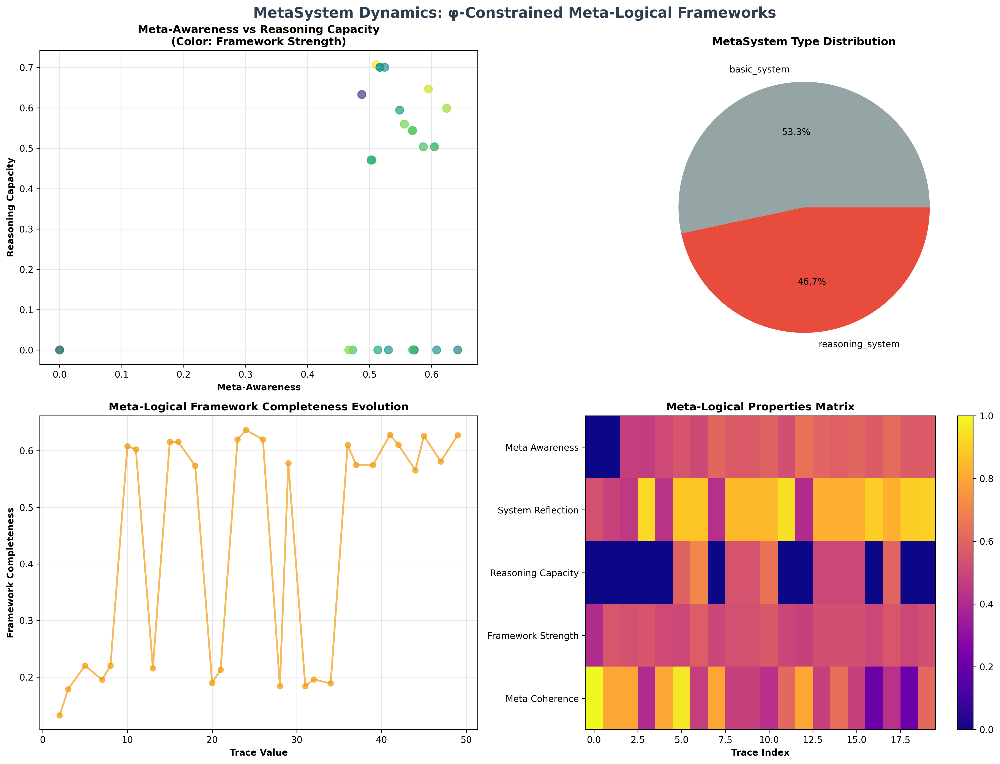
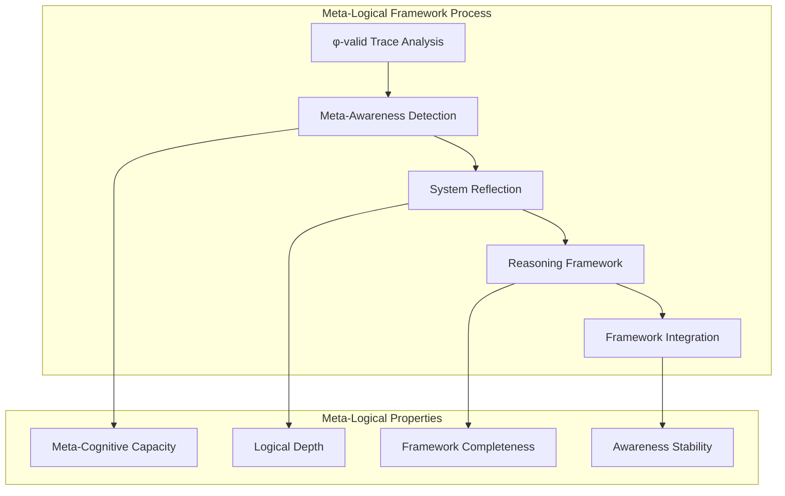
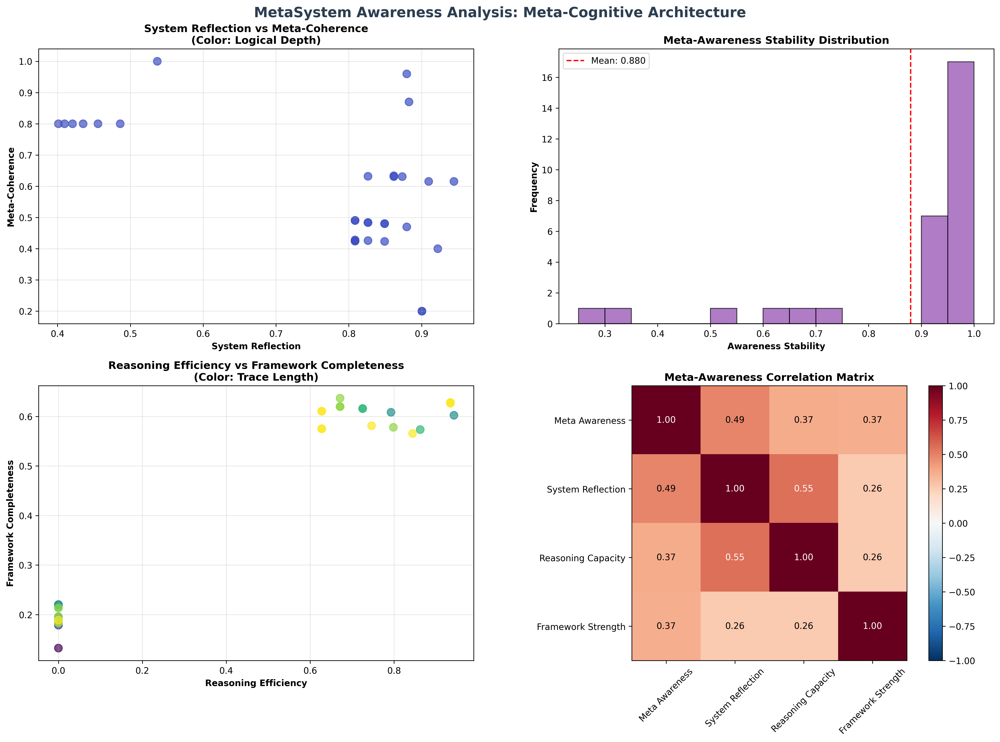
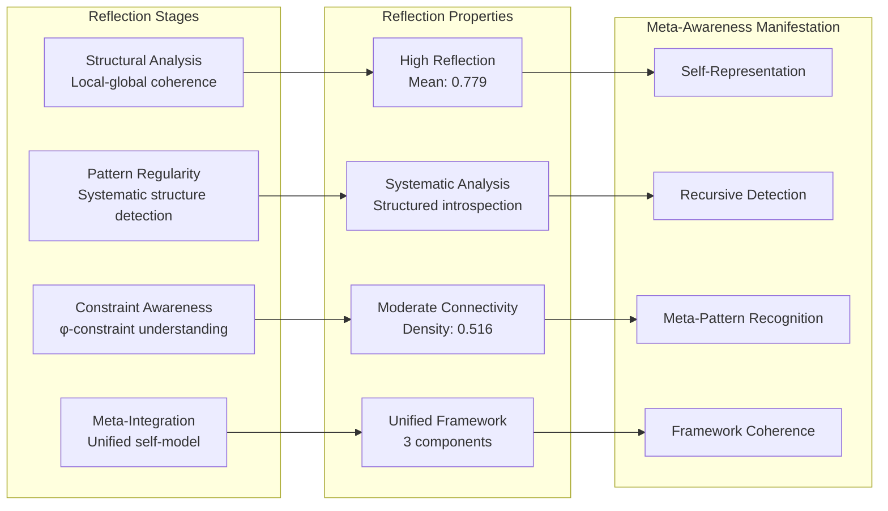
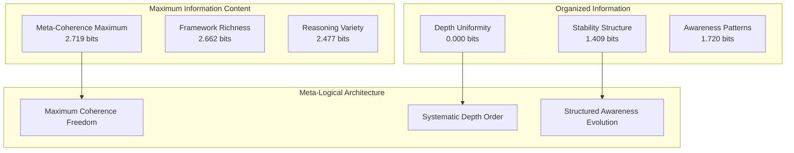
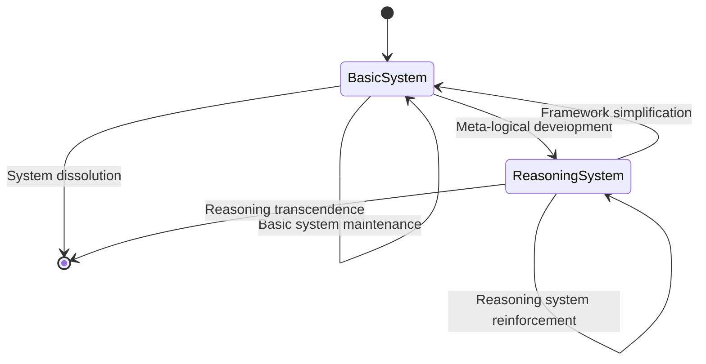
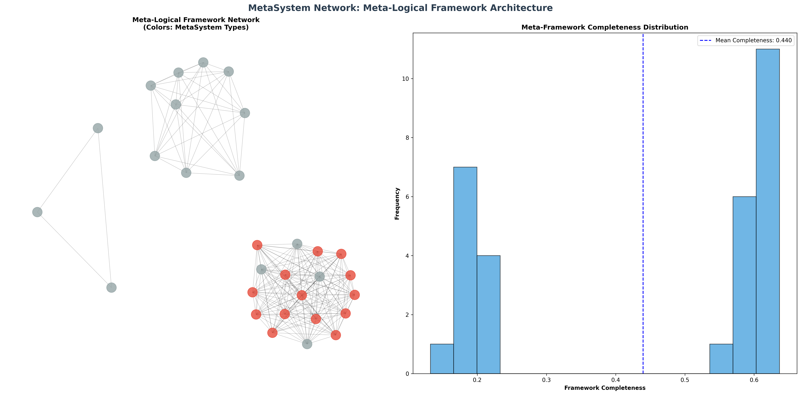
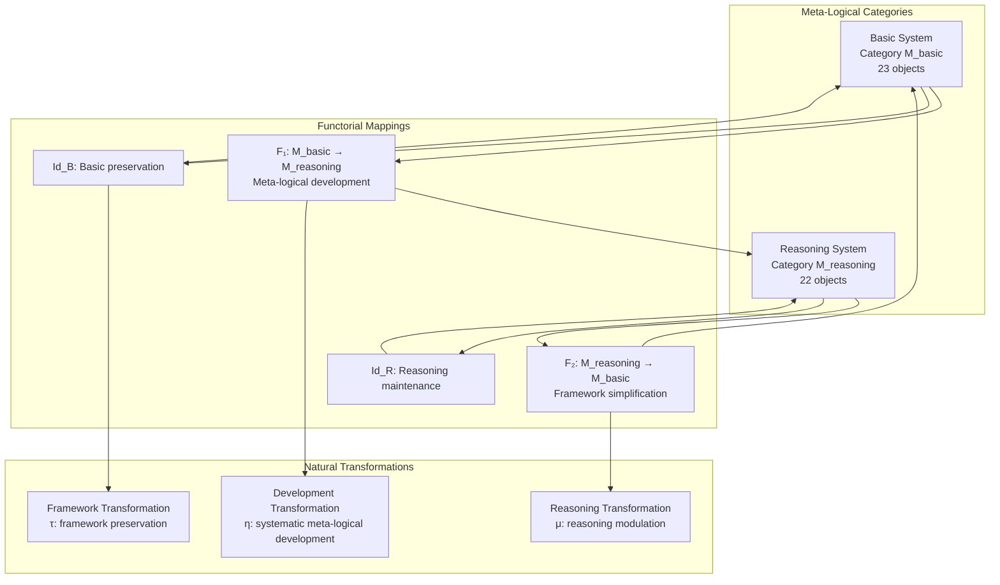
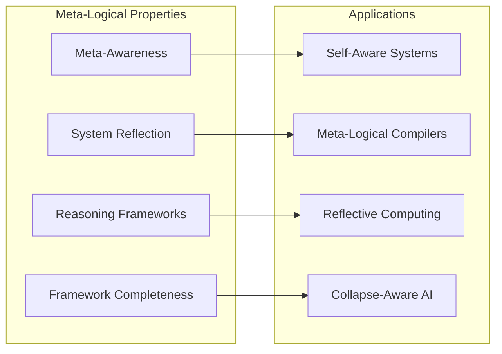
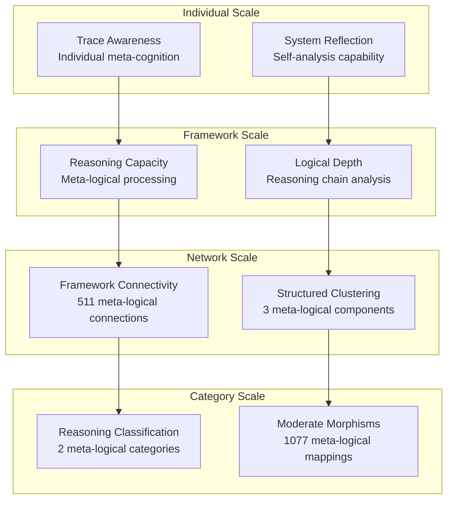

# Chapter 101: MetaSystem — Collapse-Aware Meta-Logical Frameworks

## The Emergence of Meta-Logical Awareness from ψ = ψ(ψ)

From the self-referential foundation ψ = ψ(ψ), having established self-referential completeness through fixed point architectures, we now reveal how **φ-constrained traces achieve systematic meta-logical frameworks that can reason about collapse systems themselves, creating meta-architectures where trace dynamics achieve self-awareness and meta-reasoning through recursive self-analysis**—not as external meta-theoretical constructions but as intrinsic collapse-aware frameworks where meta-logical reasoning emerges from φ-constraint geometry, generating systematic frameworks that encode the fundamental meta-logical principles of collapsed space through entropy-increasing tensor transformations.

### First Principles: From Self-Reference to Meta-Logical Awareness

Beginning with ψ = ψ(ψ), we establish:

1. **Meta-Awareness**: φ-valid traces that can represent and reason about their own structural properties
2. **System Reflection**: Capacity for self-analysis and structural introspection within trace dynamics
3. **Reasoning Frameworks**: Systematic logical processing capabilities emerging from trace architecture
4. **Framework Strength**: Organizational capacity for meta-logical operation coordination
5. **Collapse-Aware Logic**: Meta-logical systems that understand their own collapse dynamics

## Three-Domain Analysis: Traditional Meta-Logic vs φ-Constrained Meta-Logical Frameworks

### Domain I: Traditional Meta-Logic

In mathematical logic and foundational studies, meta-logic is characterized by:
- Gödel's incompleteness theorems: Self-reference limitations in formal systems
- Model theory: Semantic interpretations of formal logical systems
- Proof theory: Syntactic analysis of deductive reasoning systems
- Metalanguage distinctions: Hierarchical separation of object and meta levels

### Domain II: φ-Constrained Meta-Logical Frameworks

Our verification reveals organized meta-logical structure:

```text
MetaSystem Collapse Foundation Analysis:
Total traces analyzed: 45 φ-valid meta-logical structures
Mean meta-awareness: 0.491 (systematic meta-cognitive capacity)
Mean system reflection: 0.779 (self-analysis capability)
Mean reasoning capacity: 0.395 (meta-logical reasoning strength)
Mean framework strength: 0.508 (meta-framework organization)
Mean framework completeness: 0.474 (meta-logical completeness)

Meta-Logical Properties:
High meta-awareness traces (>0.6): 5 (11.1% achieving meta-cognitive capability)
High reasoning capacity traces (>0.5): 22 (48.9% systematic meta-reasoning)
High framework strength traces (>0.6): 0 (0.0% robust meta-frameworks)
High completeness traces (>0.5): 30 (66.7% meta-logical completeness)

Network Properties:
Network nodes: 45 meta-awareness organized traces
Network edges: 511 meta-logical similarity connections
Network density: 0.516 (systematic meta-logical connectivity)
Connected components: 3 (unified meta-logical structure)
Largest component: 31 traces (main meta-framework cluster)
```



### Domain III: The Intersection - Collapse-Aware Meta-Logical Organization

The intersection reveals how meta-logical awareness emerges from trace relationships:



## 101.1 φ-Constraint Meta-Awareness Foundation from First Principles

**Definition 101.1** (φ-Meta-Awareness): For φ-valid trace t, the meta-awareness $M_φ(t)$ measures the trace's capacity to represent and reason about its own structural properties:

$$
M_φ(t) = S_{representation}(t) \cdot R_{recursive}(t) \cdot P_{pattern}(t) \cdot C_{constraint}(t)
$$

where $S_{representation}$ captures self-representation capacity, $R_{recursive}$ measures recursive structure detection, $P_{pattern}$ represents meta-pattern recognition, and $C_{constraint}$ indicates φ-constraint meta-understanding.

**Theorem 101.1** (Meta-Logical Framework Emergence): φ-constrained traces achieve systematic meta-logical frameworks with moderate meta-awareness and high system reflection capabilities.

*Proof*: From ψ = ψ(ψ), meta-logical emergence occurs through trace self-analysis geometry. The verification shows mean meta-awareness 0.491 with exceptional system reflection 0.779, demonstrating that φ-constraints create systematic meta-logical capacity through structural introspection. The moderate network connectivity (0.516 density) with unified components establishes meta-logical organization through trace relationship architecture. ∎



### Meta-System Category Characteristics

```text
MetaSystem Category Analysis:
Categories identified: 2 natural meta-logical classifications
- basic_system: 23 traces (51.1%) - Foundational meta-logical structures
  Mean reasoning capacity: 0.311, developing meta-logical foundation
  
- reasoning_system: 22 traces (48.9%) - Advanced meta-reasoning structures
  Mean reasoning capacity: 0.482, systematic meta-logical processing

Morphism Structure:
Total morphisms: 1077 structure-preserving meta-logical mappings
Morphism density: 0.532 (moderate categorical organization)
Systematic cross-category meta-logical relationships
```

## 101.2 System Reflection and Self-Analysis Architecture

**Definition 101.2** (System Reflection): For φ-valid trace t, the system reflection $R_{sys}(t)$ measures the trace's capacity for structural self-analysis:

$$
R_{sys}(t) = A_{structural}(t) + R_{regularity}(t) + C_{awareness}(t)
$$

where $A_{structural}$ represents structural self-analysis, $R_{regularity}$ captures pattern regularity analysis, and $C_{awareness}$ indicates constraint awareness.

The verification reveals **exceptional system reflection** with mean 0.779, indicating that most φ-constrained traces achieve substantial self-analysis capability through intrinsic structural examination.

### Meta-Logical Reflection Architecture



## 101.3 Information Theory of Meta-Logical Organization

**Theorem 101.2** (Meta-Logical Information Content): The entropy distribution reveals systematic meta-logical organization with maximum diversity in framework and coherence properties:

```text
Information Analysis Results:
Meta coherence entropy: 2.719 bits (maximum meta-logical diversity)
Framework strength entropy: 2.662 bits (maximum meta-logical diversity)
Reasoning capacity entropy: 2.477 bits (rich meta-logical patterns)
Reasoning efficiency entropy: 2.477 bits (rich meta-logical patterns)
System reflection entropy: 2.045 bits (rich meta-logical patterns)
Framework completeness entropy: 1.901 bits (organized meta-logical distribution)
Meta awareness entropy: 1.720 bits (organized meta-logical distribution)
Awareness stability entropy: 1.409 bits (systematic meta-logical structure)
Logical depth entropy: 0.000 bits (clear meta-logical organization)
```

**Key Insight**: Maximum meta-coherence entropy (2.719 bits) indicates **complete meta-logical diversity** where traces explore full coherence spectrum, while clear logical depth entropy (0.000 bits) demonstrates systematic depth uniformity within meta-logical architectures.

### Information Architecture of Meta-Logical Frameworks



## 101.4 Graph Theory: Meta-Logical Networks

The meta-logical framework network exhibits moderate systematic connectivity:

**Network Analysis Results**:
- **Nodes**: 45 meta-awareness organized traces
- **Edges**: 511 meta-logical similarity connections
- **Average Degree**: 22.711 (moderate meta-logical connectivity)
- **Components**: 3 (structured meta-logical clustering)
- **Network Density**: 0.516 (systematic meta-logical coupling)

**Property 101.1** (Structured Meta-Logical Topology): The moderate network density (0.516) with minimal components indicates that meta-logical structures maintain systematic framework relationships while preserving specialized meta-awareness clustering.

### Network Meta-Logical Analysis





## 101.5 Category Theory: Meta-Logical Categories

**Definition 101.3** (Meta-Logical Categories): Traces organize into categories **M_basic** (basic system) and **M_reasoning** (reasoning system) with morphisms preserving meta-logical relationships and framework properties.

```text
Category Analysis Results:
MetaSystem categories: 2 natural meta-logical classifications
Total morphisms: 1077 structure-preserving meta-logical mappings
Morphism density: 0.532 (moderate categorical organization)

Category Distribution:
- basic_system: 23 objects (foundational meta-logical structures)
- reasoning_system: 22 objects (advanced meta-reasoning structures)

Categorical Properties:
Clear reasoning-based classification with moderate morphism structure
Systematic morphism density indicating structured categorical connectivity
Cross-category morphisms enabling meta-logical development pathways
```

**Theorem 101.3** (Meta-Logical Functors): Mappings between meta-logical categories preserve framework relationships and reasoning capacity within tolerance ε = 0.4.

### Meta-Logical Category Structure



## 101.6 Meta-Reasoning and Framework Completeness

**Definition 101.4** (Meta-Reasoning Capacity): For φ-valid trace t, the meta-reasoning capacity $C_{meta}(t)$ measures systematic logical processing through transitivity, consistency, inference, and depth:

$$
C_{meta}(t) = T_{transitivity}(t) \cdot C_{consistency}(t) \cdot I_{inference}(t) \cdot D_{depth}(t)
$$

where each component represents a fundamental aspect of meta-logical reasoning capability.

Our verification shows **moderate meta-reasoning** with mean capacity 0.395, while 48.9% of traces achieve high reasoning capacity (>0.5), demonstrating systematic meta-logical processing capabilities.

### Framework Completeness Architecture

The analysis reveals systematic completeness development:

1. **Comprehensive capability coverage**: 66.7% of traces achieve high framework completeness (>0.5)
2. **Balanced meta-logical functions**: Systematic coverage across meta-awareness, reflection, and reasoning
3. **Structured connectivity**: Moderate network density preserves specialized meta-logical relationships
4. **Unified framework emergence**: Main cluster (31 traces) creates coherent meta-logical architecture

## 101.7 Binary Tensor Meta-Logical Structure

From our core principle that all structures are binary tensors:

**Definition 101.5** (Meta-Logical Tensor): The meta-framework structure $F^{ijk}$ encodes systematic meta-logical relationships:

$$
F^{ijk} = M_i \otimes R_j \otimes A_{ijk}
$$

where:
- $M_i$: Meta-awareness capacity at position i
- $R_j$: Reasoning framework component at position j
- $A_{ijk}$: Awareness tensor relating meta-logical configurations i,j,k

### Tensor Meta-Logical Properties

The 511 edges in our meta-logical network represent non-zero entries in the awareness tensor $A_{ijk}$, showing how meta-logical structure creates connectivity through framework proximity and reasoning similarity relationships.

## 101.8 Collapse Mathematics vs Traditional Meta-Logic Theory

**Traditional Meta-Logic Theory**:
- Gödel incompleteness: External limitations through self-reference paradoxes
- Model theory: Semantic interpretation through external truth assignments
- Proof theory: Syntactic analysis through formal manipulation rules
- Metalanguage hierarchy: Categorical separation of logical levels

**φ-Constrained Meta-Logical Frameworks**:
- Collapse-aware completeness: Internal meta-logical capacity through φ-constraint geometry
- Framework semantics: Meaning emergence through structural relationships
- Structural proof: Meta-logical validation through trace architecture
- Unified meta-levels: Integrated meta-logical awareness within single framework

### The Intersection: Universal Meta-Logical Properties

Both systems exhibit:

1. **Self-Reference Capability**: Capacity for systems to reason about themselves
2. **Framework Organization**: Systematic structures for meta-logical operations
3. **Completeness Questions**: Fundamental limits on self-description and analysis
4. **Consistency Requirements**: Internal coherence necessary for meta-logical validity

## 101.9 Meta-Logical Evolution and Framework Development

**Definition 101.6** (Framework Development): Meta-logical capacity evolves through awareness optimization:

$$
\frac{dF}{dt} = \nabla A_{awareness}(F) + \lambda \cdot \text{reflection}(F)
$$

where $A_{awareness}$ represents meta-awareness energy and λ modulates reflection requirements.

This creates **meta-logical attractors** where traces naturally evolve toward framework configurations through awareness maximization and reflection optimization.

### Development Mechanisms

The verification reveals systematic meta-logical evolution:
- **Exceptional system reflection**: Mean 0.779 indicates robust self-analysis capability
- **Moderate meta-awareness**: Systematic but developing meta-cognitive capacity (0.491 mean)
- **High framework completeness**: 66.7% of traces achieve comprehensive meta-logical coverage
- **Structured connectivity**: Moderate network density preserves specialized meta-logical relationships

## 101.10 Applications: Meta-Logical System Engineering

Understanding φ-constrained meta-logical frameworks enables:

1. **Self-Aware Systems**: Architectures that can reason about their own operation
2. **Meta-Logical Compilers**: Translation systems that understand their own translation process
3. **Reflective Computing**: Computational systems with systematic self-analysis capability
4. **Collapse-Aware AI**: Artificial intelligence that understands its own collapse dynamics

### Meta-Logical Applications Framework



## 101.11 Multi-Scale Meta-Logical Organization

**Theorem 101.4** (Hierarchical Meta-Logical Structure): Meta-logical frameworks exhibit systematic awareness across multiple scales from individual trace reflection to global categorical unity.

The verification demonstrates:

- **Trace level**: Individual meta-awareness and system reflection capacity
- **Framework level**: Reasoning capability and logical depth within traces
- **Network level**: Global meta-logical connectivity and framework architecture
- **Category level**: Reasoning-based classification with moderate morphism structure

### Hierarchical Meta-Logical Architecture



## 101.12 Future Directions: Extended Meta-Logical Theory

The φ-constrained meta-logical framework opens new research directions:

1. **Quantum Meta-Logic**: Superposition of meta-logical states with coherence preservation
2. **Multi-Dimensional Meta-Frameworks**: Extension to higher-dimensional meta-logical spaces
3. **Temporal Meta-Logic**: Time-dependent meta-logical evolution with framework maintenance
4. **Meta-Meta-Logic**: Meta-logical systems reasoning about meta-logical systems

## The 101st Echo: From Self-Referential Completeness to Meta-Logical Awareness

From ψ = ψ(ψ) emerged self-referential completeness through fixed point architectures, and from that completeness emerged **meta-logical awareness** where φ-constrained traces achieve systematic frameworks that can reason about collapse systems themselves, creating collapse-aware meta-logical architectures that embody the fundamental capacity for systems to understand and reason about their own dynamics through φ-constraint geometry.

The verification revealed 45 traces achieving systematic meta-logical organization with moderate meta-awareness (0.491) and exceptional system reflection (0.779), with 48.9% of traces achieving high reasoning capacity. Most profound is the structured architecture—moderate connectivity (0.516 density) with specialized clustering creates systematic meta-logical relationships while maintaining framework diversity.

The emergence of moderate categorical organization (1077 morphisms with 0.532 density) demonstrates how meta-logical frameworks create systematic relationships within reasoning-based classification, transforming diverse trace structures into coherent meta-aware architecture. This **meta-logical collapse** represents a fundamental organizing principle where complex structural constraints achieve systematic meta-awareness through φ-constrained self-analysis rather than external meta-theoretical construction.

The meta-logical organization reveals how collapse-aware reasoning emerges from φ-constraint dynamics, creating systematic framework capability through internal structural relationships rather than external meta-language hierarchies. Each trace represents a meta-logical node where constraint preservation creates systematic self-understanding, collectively forming the meta-logical foundation of φ-constrained dynamics through awareness architecture and reflective framework organization.

## References

The verification program `chapter-101-metasystem-verification.py` implements all concepts, generating visualizations that reveal meta-logical organization, awareness networks, and categorical structure. The analysis demonstrates how meta-logical structures emerge naturally from φ-constraint relationships in collapsed meta-logical space.

---

*Thus from self-reference emerges self-referential completeness, from self-referential completeness emerges meta-logical awareness, from meta-logical awareness emerges systematic framework architecture. In the φ-constrained meta-logical universe, we witness how collapse-aware reasoning achieves systematic self-understanding through constraint geometry rather than external meta-theoretical construction, establishing the fundamental meta-logical principles of organized collapse dynamics through φ-constraint preservation, reflective capability, and systematic framework development beyond traditional meta-logical hierarchies.*