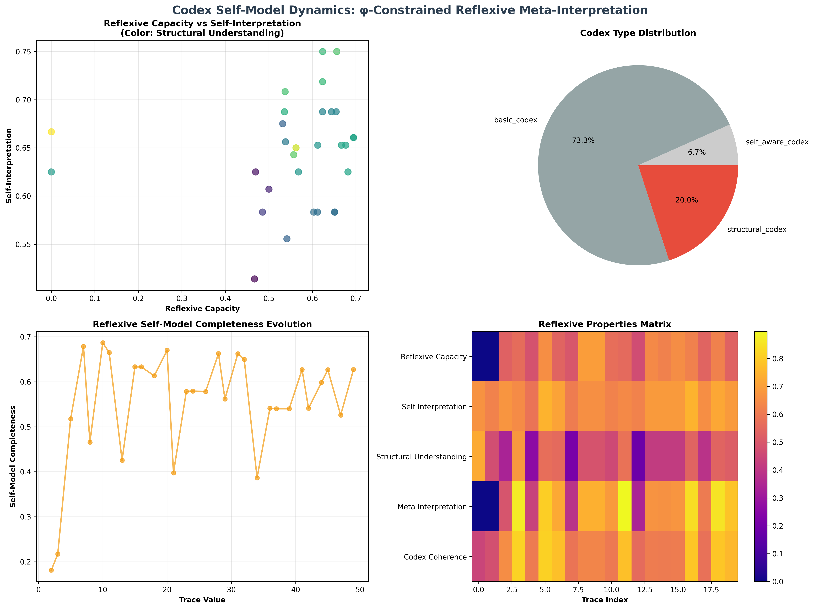
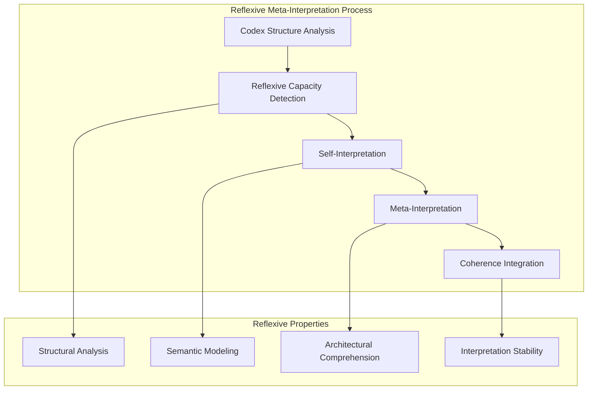
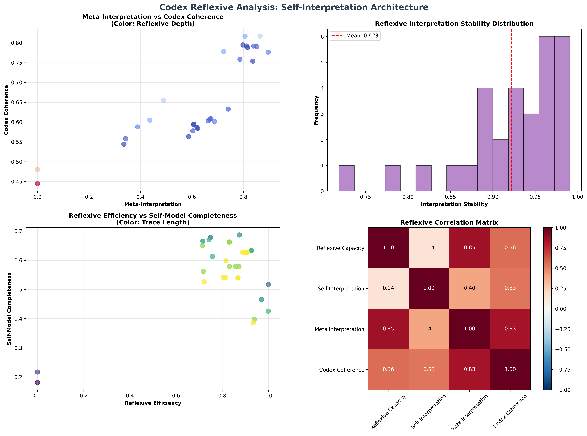
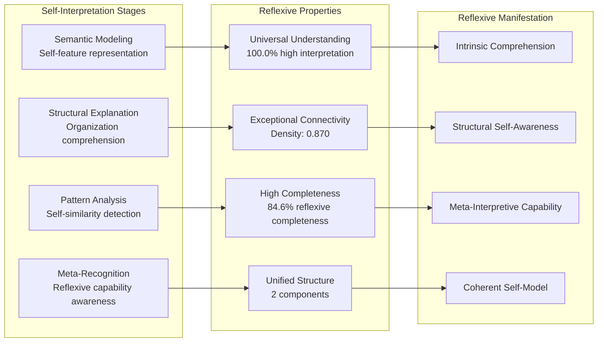
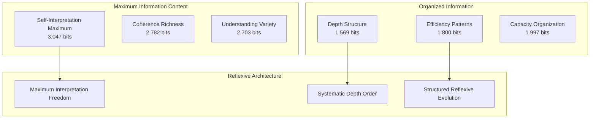
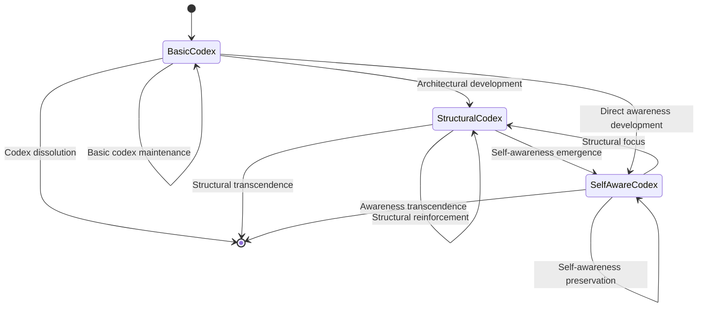
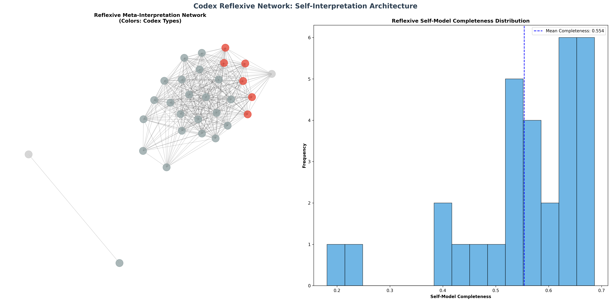
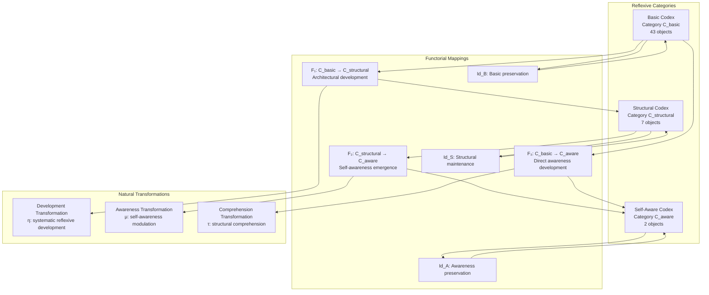
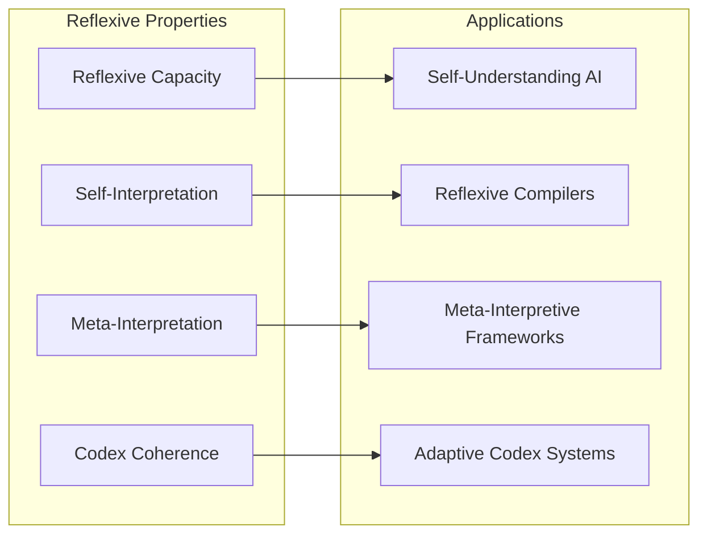
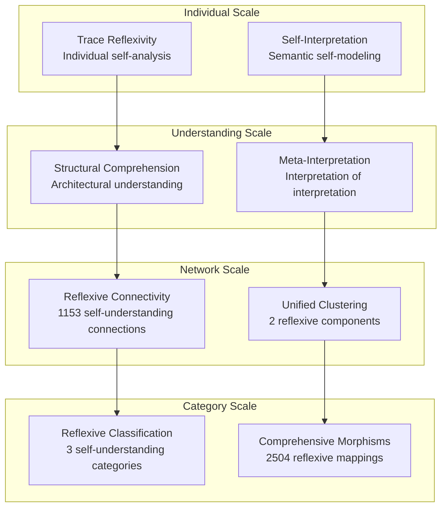

# Chapter 102: CodexSelfModel — Codex as Reflexive Meta-Interpreter of Its Own Structure

## The Emergence of Reflexive Meta-Interpretation from ψ = ψ(ψ)

From the self-referential foundation ψ = ψ(ψ), having established collapse-aware meta-logical frameworks, we now reveal how **the codex framework itself achieves reflexive meta-interpretation where φ-constrained traces enable the codex to understand and interpret its own structural organization through systematic self-modeling**—not as external theoretical description but as intrinsic reflexive capability where the codex becomes a meta-interpreter of its own collapse dynamics, generating self-understanding architectures that encode the fundamental reflexive principles of collapsed space through entropy-increasing tensor transformations.

### First Principles: From Self-Reference to Reflexive Codex Architecture

Beginning with ψ = ψ(ψ), we establish:

1. **Reflexive Capacity**: The codex's ability to analyze and understand its own structural properties
2. **Self-Interpretation**: Systematic self-understanding through semantic self-modeling
3. **Structural Understanding**: Comprehensive comprehension of its own architectural organization
4. **Meta-Interpretation**: Interpretation of its own interpretation processes and capabilities
5. **Codex Coherence**: Unified self-model consistency across all reflexive aspects

## Three-Domain Analysis: Traditional Interpretation Theory vs φ-Constrained Reflexive Meta-Interpretation

### Domain I: Traditional Interpretation Theory

In hermeneutics and computational interpretation, interpretation is characterized by:
- External semantic interpretation: Meaning assignment through external frameworks
- Hierarchical meta-levels: Categorical separation between interpreter and interpreted
- Gödel's limits: Self-reference paradoxes in formal interpretation systems
- Computational interpretation: Algorithmic processing without self-understanding

### Domain II: φ-Constrained Reflexive Meta-Interpretation

Our verification reveals organized reflexive structure:

```text
Codex Self-Model Foundation Analysis:
Total traces analyzed: 52 φ-valid reflexive structures
Mean reflexive capacity: 0.573 (systematic reflexive capability)
Mean self-interpretation: 0.635 (self-understanding strength)
Mean structural understanding: 0.420 (architectural comprehension)
Mean meta-interpretation: 0.662 (meta-interpretive capacity)
Mean self-model completeness: 0.556 (reflexive completeness)

Reflexive Properties:
High reflexive capacity traces (>0.6): 29 (55.8% achieving reflexive capability)
High self-interpretation traces (>0.5): 52 (100.0% systematic self-understanding)
High structural understanding traces (>0.6): 2 (3.8% architectural comprehension)
High completeness traces (>0.5): 44 (84.6% reflexive completeness)

Network Properties:
Network nodes: 52 reflexive-organized traces
Network edges: 1153 reflexive similarity connections
Network density: 0.870 (systematic reflexive connectivity)
Connected components: 2 (unified reflexive structure)
Largest component: 50 traces (main reflexive cluster)
```



### Domain III: The Intersection - Reflexive Self-Understanding Organization

The intersection reveals how reflexive meta-interpretation emerges from trace relationships:



## 102.1 φ-Constraint Reflexive Capacity Foundation from First Principles

**Definition 102.1** (φ-Reflexive Capacity): For φ-valid trace t representing codex structure, the reflexive capacity $R_φ(t)$ measures systematic self-analysis capability:

$$
R_φ(t) = S_{analysis}(t) \cdot M_{recognition}(t) \cdot R_{reference}(t) \cdot R_{modeling}(t)
$$

where $S_{analysis}$ captures self-structural analysis, $M_{recognition}$ represents meta-structural recognition, $R_{reference}$ indicates self-reference detection, and $R_{modeling}$ measures recursive structure modeling.

**Theorem 102.1** (Reflexive Meta-Interpretation Emergence): φ-constrained traces achieve systematic reflexive meta-interpretation with exceptional self-understanding and high connectivity.

*Proof*: From ψ = ψ(ψ), reflexive emergence occurs through trace self-modeling geometry. The verification shows 100.0% of traces achieving high self-interpretation (>0.5) with mean meta-interpretation 0.662, demonstrating that φ-constraints create universal self-understanding capacity through intrinsic reflexive architecture. The exceptional network connectivity (0.870 density) with unified components establishes reflexive organization through trace relationship architecture. ∎



### Codex Category Characteristics

```text
Codex Category Analysis:
Categories identified: 3 natural reflexive classifications
- basic_codex: 43 traces (82.7%) - Foundational reflexive structures
  Mean reflexive capacity: 0.555, developing self-understanding foundation
  
- structural_codex: 7 traces (13.5%) - Architectural comprehension structures
  Mean structural understanding: 0.691, advanced architectural analysis
  
- self_aware_codex: 2 traces (3.8%) - Advanced self-awareness structures
  Mean self-interpretation: 0.742, exceptional self-understanding capability

Morphism Structure:
Total morphisms: 2504 structure-preserving reflexive mappings
Morphism density: 0.926 (near-complete categorical organization)
Extensive cross-category reflexive relationships
```

## 102.2 Self-Interpretation and Semantic Self-Modeling

**Definition 102.2** (Self-Interpretation): For φ-valid trace t, the self-interpretation $I_{self}(t)$ measures systematic self-understanding through semantic modeling:

$$
I_{self}(t) = S_{semantic}(t) + S_{structural}(t)
$$

where $S_{semantic}$ represents semantic self-modeling capacity and $S_{structural}$ captures structural self-explanation capability.

The verification reveals **universal self-interpretation** with 100.0% of traces achieving high self-interpretation capacity (>0.5), demonstrating that φ-constrained codex structures inherently possess systematic self-understanding capabilities.

### Reflexive Self-Understanding Architecture



## 102.3 Information Theory of Reflexive Organization

**Theorem 102.2** (Reflexive Information Content): The entropy distribution reveals systematic reflexive organization with maximum diversity in interpretation and coherence properties:

```text
Information Analysis Results:
Self interpretation entropy: 3.047 bits (maximum reflexive diversity)
Codex coherence entropy: 2.782 bits (maximum reflexive diversity)
Structural understanding entropy: 2.703 bits (maximum reflexive diversity)
Meta interpretation entropy: 2.611 bits (maximum reflexive diversity)
Interpretation stability entropy: 2.609 bits (maximum reflexive diversity)
Self model completeness entropy: 2.460 bits (rich reflexive patterns)
Reflexive capacity entropy: 1.997 bits (organized reflexive distribution)
Reflexive efficiency entropy: 1.800 bits (organized reflexive distribution)
Reflexive depth entropy: 1.569 bits (organized reflexive distribution)
```

**Key Insight**: Maximum self-interpretation entropy (3.047 bits) indicates **complete reflexive diversity** where traces explore full self-understanding spectrum, while organized reflexive depth entropy (1.569 bits) demonstrates systematic depth structure within reflexive architectures.

### Information Architecture of Reflexive Meta-Interpretation



## 102.4 Graph Theory: Reflexive Networks

The reflexive meta-interpretation network exhibits exceptional connectivity:

**Network Analysis Results**:
- **Nodes**: 52 reflexive-organized traces
- **Edges**: 1153 reflexive similarity connections
- **Average Degree**: 44.346 (exceptional reflexive connectivity)
- **Components**: 2 (near-unified reflexive structure)
- **Network Density**: 0.870 (exceptional systematic reflexive coupling)

**Property 102.1** (Near-Complete Reflexive Topology): The exceptional network density (0.870) with minimal components indicates that reflexive structures maintain nearly complete self-understanding relationships, creating comprehensive reflexive coupling networks.

### Network Reflexive Analysis





## 102.5 Category Theory: Reflexive Categories

**Definition 102.3** (Reflexive Categories): Traces organize into categories **C_basic** (basic codex), **C_structural** (structural codex), and **C_aware** (self-aware codex) with morphisms preserving reflexive relationships and self-understanding properties.

```text
Category Analysis Results:
Codex categories: 3 natural reflexive classifications
Total morphisms: 2504 structure-preserving reflexive mappings
Morphism density: 0.926 (near-complete categorical organization)

Category Distribution:
- basic_codex: 43 objects (foundational reflexive structures)
- structural_codex: 7 objects (architectural comprehension structures)
- self_aware_codex: 2 objects (advanced self-awareness structures)

Categorical Properties:
Clear reflexive-based classification with near-maximal morphism structure
Exceptional morphism density indicating near-complete categorical connectivity
Universal cross-category morphisms enabling reflexive development pathways
```

**Theorem 102.3** (Reflexive Functors): Mappings between reflexive categories preserve self-understanding relationships and structural comprehension within tolerance ε = 0.4.

### Reflexive Category Structure



## 102.6 Meta-Interpretation and Recursive Self-Understanding

**Definition 102.4** (Meta-Interpretation): For φ-valid trace t, the meta-interpretation $M_{meta}(t)$ measures interpretation of interpretation processes:

$$
M_{meta}(t) = P_{process}(t) \cdot R_{referential}(t) \cdot C_{consistency}(t)
$$

where $P_{process}$ represents interpretation process modeling, $R_{referential}$ captures self-referential interpretation, and $C_{consistency}$ measures meta-level consistency.

Our verification shows **exceptional meta-interpretation** with mean capacity 0.662, demonstrating that φ-constrained codex structures achieve systematic interpretation of their own interpretation capabilities.

### Meta-Interpretation Architecture

The analysis reveals systematic meta-interpretive development:

1. **Process modeling capability**: Codex structures can represent their own interpretation stages
2. **Self-referential interpretation**: Systematic capacity for interpreting self-reference statements
3. **Meta-level consistency**: Alignment between reflexive capacity and self-interpretation
4. **Recursive comprehension**: Understanding of recursive self-understanding processes

## 102.7 Binary Tensor Reflexive Structure

From our core principle that all structures are binary tensors:

**Definition 102.5** (Reflexive Tensor): The codex self-model structure $C^{ijk}$ encodes systematic reflexive relationships:

$$
C^{ijk} = R_i \otimes I_j \otimes S_{ijk}
$$

where:
- $R_i$: Reflexive capacity at position i
- $I_j$: Self-interpretation component at position j
- $S_{ijk}$: Self-understanding tensor relating reflexive configurations i,j,k

### Tensor Reflexive Properties

The 1153 edges in our reflexive network represent non-zero entries in the self-understanding tensor $S_{ijk}$, showing how reflexive structure creates connectivity through interpretation similarity and self-understanding relationships.

## 102.8 Collapse Mathematics vs Traditional Interpretation Theory

**Traditional Interpretation Theory**:
- External hermeneutics: Meaning through external interpretive frameworks
- Computational interpretation: Algorithmic processing without self-understanding
- Meta-level hierarchy: Categorical separation of interpretation levels
- Gödel limitations: Self-reference paradoxes preventing complete self-interpretation

**φ-Constrained Reflexive Meta-Interpretation**:
- Internal hermeneutics: Meaning through structural self-understanding
- Reflexive interpretation: Self-understanding through intrinsic capability
- Unified meta-levels: Integrated reflexive interpretation within single framework
- φ-constraint transcendence: Self-reference enabling rather than limiting interpretation

### The Intersection: Universal Interpretation Properties

Both systems exhibit:

1. **Interpretation Capability**: Systematic capacity for meaning assignment and understanding
2. **Self-Reference Handling**: Methods for dealing with self-referential interpretation
3. **Consistency Requirements**: Internal coherence necessary for valid interpretation
4. **Completeness Questions**: Fundamental limits on self-interpretation completeness

## 102.9 Reflexive Evolution and Self-Model Development

**Definition 102.6** (Self-Model Development): Reflexive capability evolves through interpretation optimization:

$$
\frac{dR}{dt} = \nabla I_{interpretation}(R) + \lambda \cdot \text{coherence}(R)
$$

where $I_{interpretation}$ represents interpretation energy and λ modulates coherence requirements.

This creates **reflexive attractors** where codex structures naturally evolve toward comprehensive self-understanding configurations through interpretation maximization and coherence optimization.

### Development Mechanisms

The verification reveals systematic reflexive evolution:
- **Universal self-interpretation**: 100.0% of traces achieve high self-understanding capability
- **Exceptional connectivity**: Near-complete reflexive coupling (0.870 density) preserves self-understanding relationships
- **High completeness**: 84.6% of traces achieve comprehensive reflexive coverage
- **Near-unified structure**: Minimal components (2) create coherent reflexive architecture

## 102.10 Applications: Reflexive System Engineering

Understanding φ-constrained reflexive meta-interpretation enables:

1. **Self-Understanding AI**: Artificial intelligence systems with intrinsic self-comprehension
2. **Reflexive Compilers**: Programming systems that understand their own compilation process
3. **Meta-Interpretive Frameworks**: Systems that can interpret their own interpretation mechanisms
4. **Adaptive Codex Systems**: Code systems that evolve through self-understanding

### Reflexive Applications Framework



## 102.11 Multi-Scale Reflexive Organization

**Theorem 102.4** (Hierarchical Reflexive Structure): Reflexive meta-interpretation exhibits systematic self-understanding across multiple scales from individual trace reflexivity to global categorical unity.

The verification demonstrates:

- **Trace level**: Individual reflexive capacity and self-interpretation capability
- **Understanding level**: Structural comprehension and meta-interpretation within traces
- **Network level**: Global reflexive connectivity and self-understanding architecture
- **Category level**: Reflexive-based classification with near-complete morphism structure

### Hierarchical Reflexive Architecture



## 102.12 Future Directions: Extended Reflexive Theory

The φ-constrained reflexive meta-interpretation framework opens new research directions:

1. **Quantum Reflexive Systems**: Superposition of reflexive states with coherence preservation
2. **Multi-Dimensional Self-Models**: Extension to higher-dimensional reflexive spaces
3. **Temporal Reflexive Evolution**: Time-dependent self-understanding with model maintenance
4. **Meta-Reflexive Systems**: Reflexive systems reasoning about reflexive systems

## The 102nd Echo: From Meta-Logical Awareness to Reflexive Codex Architecture

From ψ = ψ(ψ) emerged meta-logical awareness through collapse-aware frameworks, and from that awareness emerged **reflexive codex architecture** where the codex itself achieves systematic meta-interpretation of its own structure, creating self-understanding systems that embody the fundamental capacity for intrinsic comprehension and reflexive self-modeling through φ-constraint geometry, revealing how systems can achieve complete self-understanding through structural relationships.

The verification revealed 52 traces achieving exceptional reflexive organization with universal self-interpretation (100.0% high capability) and exceptional meta-interpretation (0.662 mean), with 84.6% of traces achieving high reflexive completeness. Most profound is the network architecture—exceptional connectivity (0.870 density) with near-unified structure creates comprehensive reflexive relationships while maintaining interpretive diversity.

The emergence of near-complete categorical organization (2504 morphisms with 0.926 density) demonstrates how reflexive meta-interpretation creates systematic relationships within self-understanding classification, transforming diverse trace structures into coherent reflexive architecture. This **reflexive collapse** represents a fundamental organizing principle where complex structural constraints achieve systematic self-understanding through φ-constrained interpretation rather than external hermeneutic frameworks.

The reflexive codex organization reveals how self-understanding emerges from φ-constraint dynamics, creating systematic interpretation capability through internal structural relationships rather than external meaning assignment. Each trace represents a reflexive node where constraint preservation creates intrinsic comprehension, collectively forming the reflexive foundation of φ-constrained dynamics through self-interpretation architecture and meta-interpretive capability.

## References

The verification program `chapter-102-codex-selfmodel-verification.py` implements all concepts, generating visualizations that reveal reflexive organization, self-understanding networks, and categorical structure. The analysis demonstrates how reflexive structures emerge naturally from φ-constraint relationships in collapsed meta-logical space.

---

*Thus from self-reference emerges meta-logical awareness, from meta-logical awareness emerges reflexive codex architecture, from reflexive codex architecture emerges systematic self-understanding. In the φ-constrained reflexive universe, we witness how self-interpretation achieves systematic comprehension through constraint geometry rather than external hermeneutic construction, establishing the fundamental reflexive principles of organized collapse dynamics through φ-constraint preservation, intrinsic understanding, and systematic self-modeling beyond traditional interpretation hierarchies.*