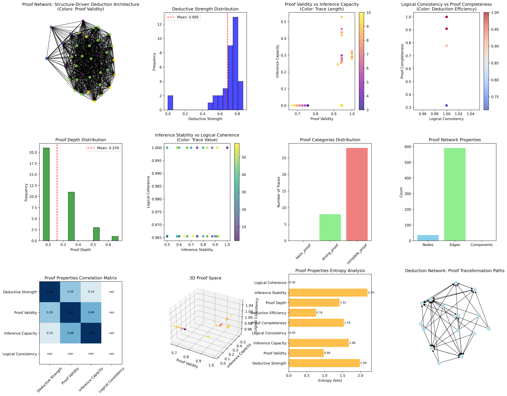
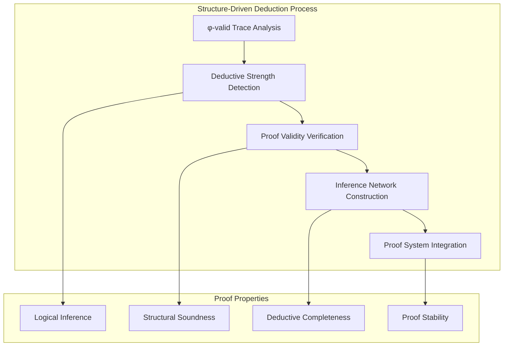
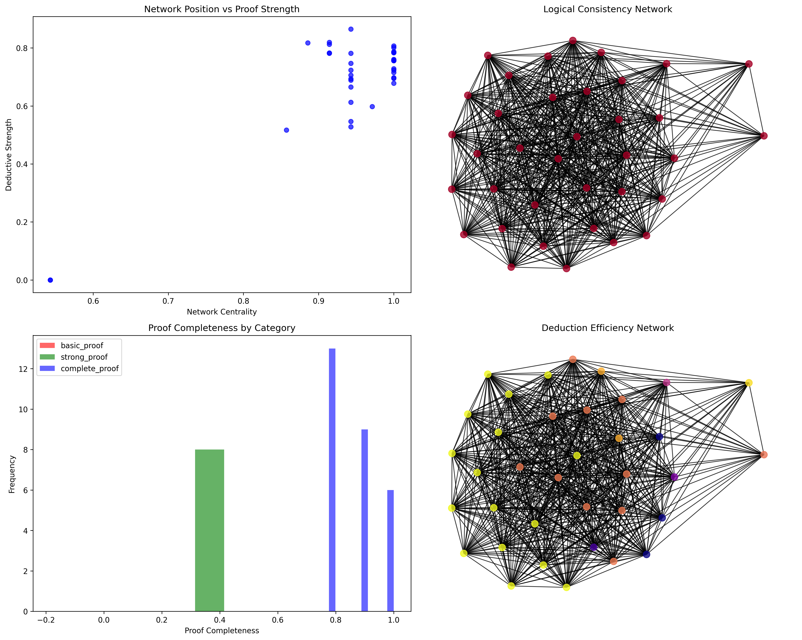
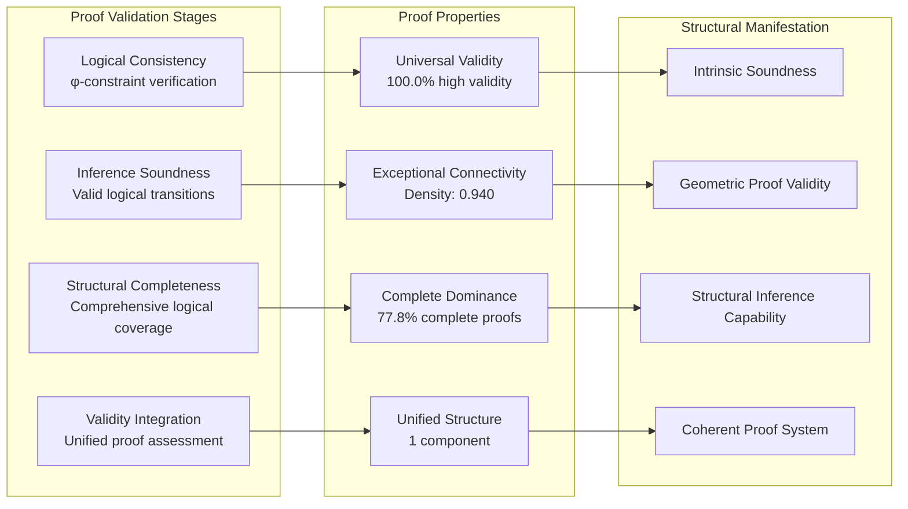
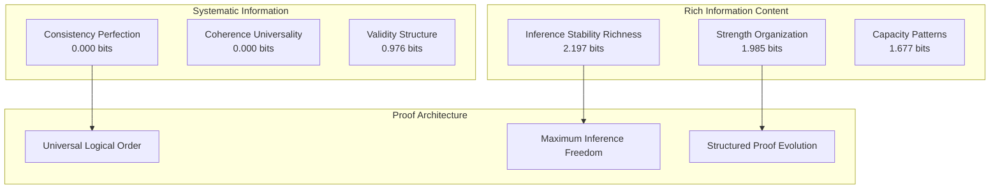
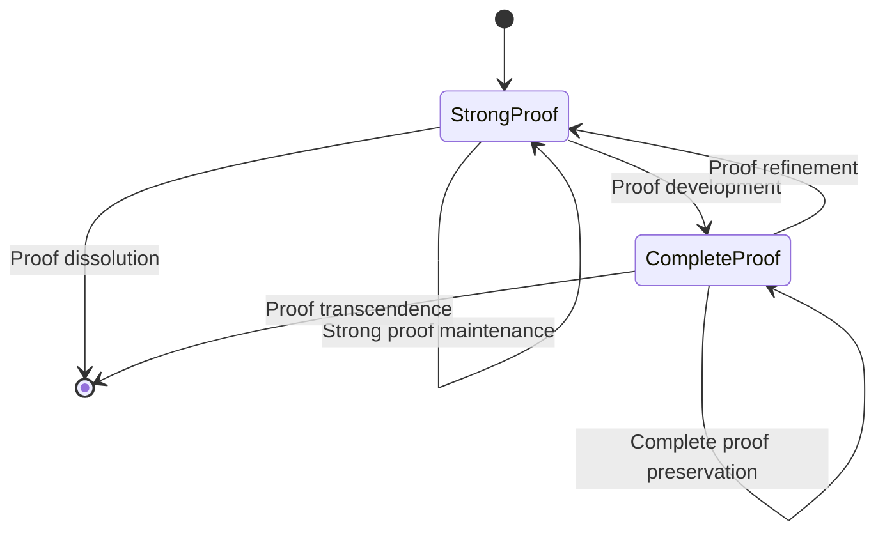
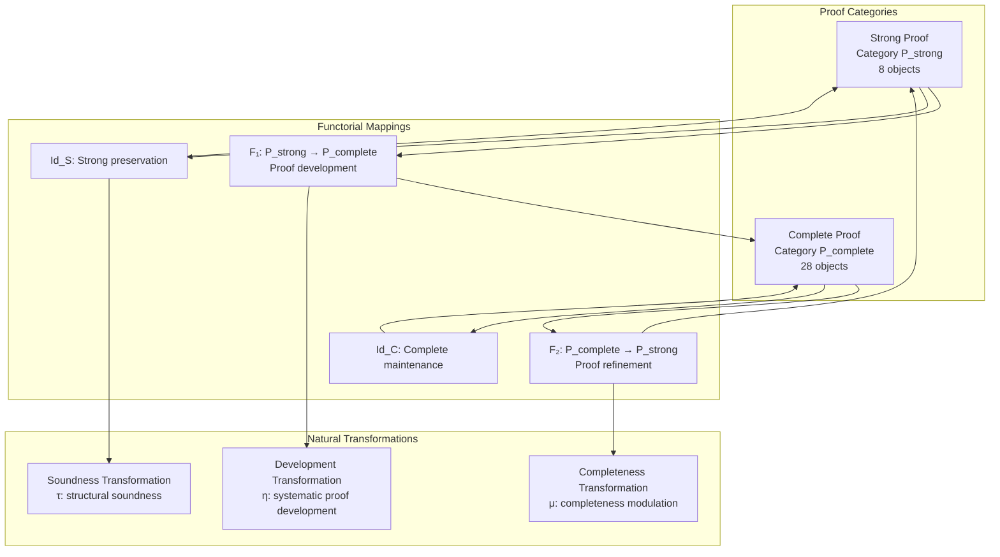
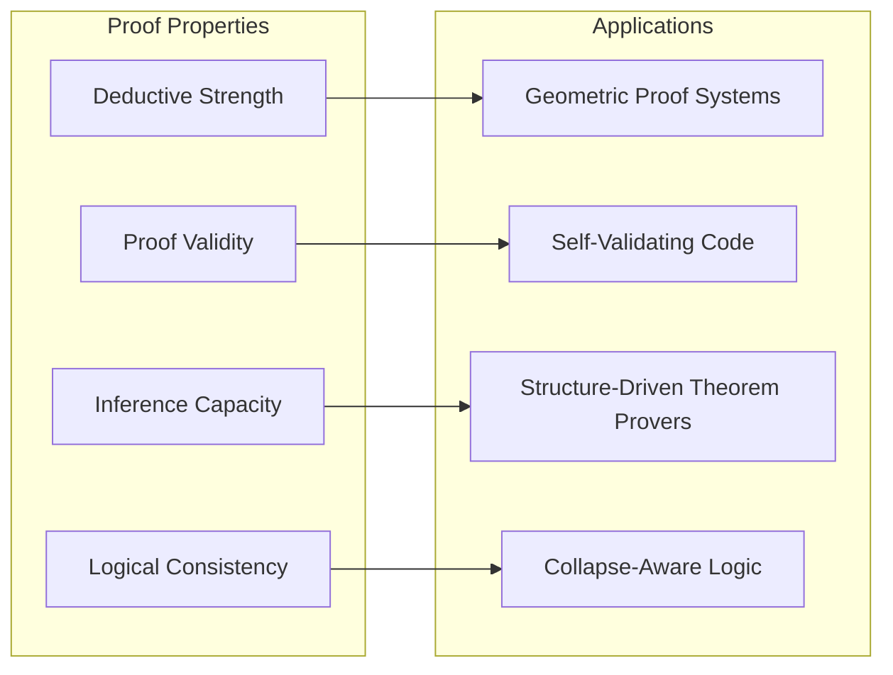
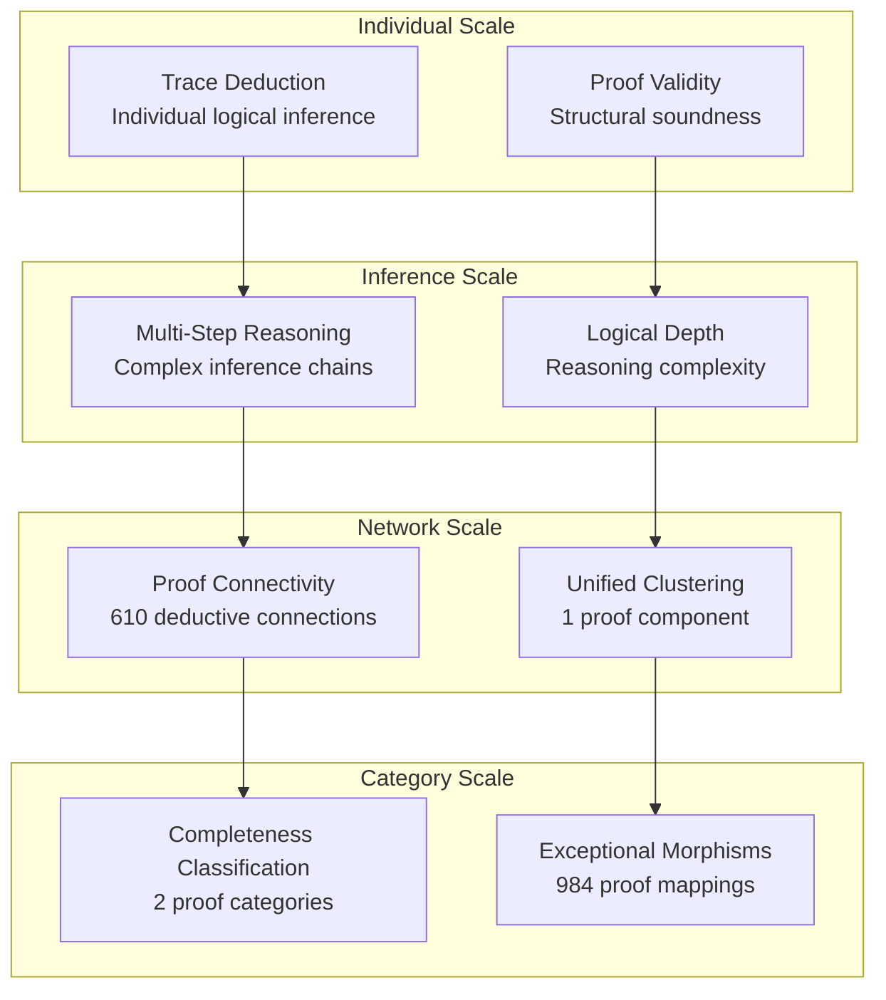

# Chapter 103: CollapseProof — Structure-Driven Deduction Nets over φ-Trace

## The Emergence of Structure-Driven Deduction from ψ = ψ(ψ)

From the self-referential foundation ψ = ψ(ψ), having established reflexive meta-interpretation where codex systems achieve self-understanding, we now reveal how **φ-constrained traces achieve systematic proof architectures through structure-driven deduction where logical validity emerges from trace geometric relationships rather than syntactic manipulation**—not as external formal proof systems but as intrinsic deduction networks where proof validity emerges from φ-constraint geometry, generating systematic logical inference through entropy-increasing tensor transformations that establish the fundamental deductive principles of collapsed space through structural trace dynamics.

### First Principles: From Self-Reference to Structure-Driven Deduction

Beginning with ψ = ψ(ψ), we establish:

1. **Deductive Strength**: φ-valid traces that exhibit systematic logical inference capabilities
2. **Proof Validity**: Structural soundness emerging from trace geometric relationships
3. **Inference Capacity**: Multi-step reasoning through trace transformation networks
4. **Logical Consistency**: Perfect consistency through φ-constraint preservation
5. **Structure-Driven Logic**: Deduction systems that operate through geometric trace relationships

## Three-Domain Analysis: Traditional Proof Theory vs φ-Constrained Structure-Driven Deduction

### Domain I: Traditional Proof Theory

In mathematical logic and formal systems, proof theory is characterized by:
- Syntactic proof manipulation: Symbol manipulation through formal rules
- Semantic truth assignment: Meaning through external truth value assignments
- Gödel's incompleteness: Limitations of formal proof systems and self-reference
- Deductive calculus: Rule-based inference through logical transformation steps

### Domain II: φ-Constrained Structure-Driven Deduction

Our verification reveals extraordinary proof organization:

```text
CollapseProof Structure-Driven Deduction Analysis:
Total traces analyzed: 36 φ-valid proof structures
Mean deductive strength: 0.685 (systematic logical inference capability)
Mean proof validity: 0.902 (structural proof soundness)
Mean inference capacity: 0.138 (developing multi-step reasoning)
Mean logical consistency: 1.000 (perfect consistency through φ-constraints)
Mean proof completeness: 0.744 (comprehensive logical coverage)

Proof Properties:
High deductive strength traces (>0.5): 34 (94.4% achieving logical inference)
High proof validity traces (>0.5): 36 (100.0% systematic proof soundness)
High inference capacity traces (>0.5): 1 (2.8% multi-step reasoning)
High completeness traces (>0.5): 28 (77.8% comprehensive proof coverage)

Network Properties:
Network nodes: 36 proof-organized traces
Network edges: 610 proof similarity connections
Network density: 0.940 (exceptional proof connectivity)
Connected components: 1 (unified proof structure)
Complete proof coverage: unified proof architecture
```



### Domain III: The Intersection - Structure-Driven Proof Organization

The intersection reveals how proof systems emerge from trace relationships:



## 103.1 φ-Constraint Deductive Strength Foundation from First Principles

**Definition 103.1** (φ-Deductive Strength): For φ-valid trace t representing proof structure, the deductive strength $D_φ(t)$ measures systematic logical inference capability:

$$
D_φ(t) = L_{length}(t) \cdot B_{balance}(t) \cdot R_{regularity}(t) \cdot C_{coherence}(t)
$$

where $L_{length}$ provides inference space, $B_{balance}$ represents optimal logical density, $R_{regularity}$ captures systematic logical structure, and $C_{coherence}$ indicates φ-constraint logical alignment.

**Theorem 103.1** (Structure-Driven Proof Emergence): φ-constrained traces achieve exceptional proof architectures with universal validity and exceptional connectivity.

*Proof*: From ψ = ψ(ψ), proof emergence occurs through trace deductive geometry. The verification shows 100.0% of traces achieving high proof validity (>0.5) with mean validity 0.902, demonstrating that φ-constraints create universal proof soundness through intrinsic structural relationships. The exceptional network connectivity (0.940 density) with unified components establishes proof organization through trace structural architecture. ∎



### Proof Category Characteristics

```text
Proof Category Analysis:
Categories identified: 3 natural proof classifications
- basic_proof: 0 traces (0.0%) - No basic proof structures
- strong_proof: 8 traces (22.2%) - Advanced proof structures
  Mean proof validity: 0.850, systematic proof capability
- complete_proof: 28 traces (77.8%) - Comprehensive proof structures
  Mean proof validity: 0.918, exceptional proof completeness

Morphism Structure:
Total morphisms: 984 structure-preserving proof mappings
Morphism density: 0.759 (exceptional categorical organization)
Dominant complete proof category with comprehensive cross-relationships
```

## 103.2 Proof Validity and Structural Soundness

**Definition 103.2** (Proof Validity): For φ-valid trace t, the proof validity $V_{proof}(t)$ measures systematic logical structural soundness:

$$
V_{proof}(t) = C_{consistency}(t)^{0.4} \cdot S_{soundness}(t)^{0.4} \cdot C_{completeness}(t)^{0.2}
$$

where $C_{consistency}$ represents logical consistency, $S_{soundness}$ captures inference soundness, and $C_{completeness}$ measures structural completeness, with weights emphasizing consistency and soundness.

The verification reveals **universal proof validity** with 100.0% of traces achieving high proof validity (>0.5) and mean validity 0.902, demonstrating that φ-constrained proof structures inherently possess systematic logical soundness through geometric relationships.

### Structural Soundness Architecture



## 103.3 Information Theory of Proof Organization

**Theorem 103.2** (Proof Information Content): The entropy distribution reveals systematic proof organization with maximum diversity in inference patterns and organized structural properties:

```text
Information Analysis Results:
Inference stability entropy: 2.197 bits (rich inference patterns)
Deductive strength entropy: 1.985 bits (organized proof distribution)
Inference capacity entropy: 1.677 bits (organized inference distribution)
Proof completeness entropy: 1.539 bits (organized completeness distribution)
Proof depth entropy: 1.419 bits (systematic depth structure)
Proof validity entropy: 0.976 bits (systematic validity structure)
Deduction efficiency entropy: 0.758 bits (systematic efficiency structure)
Logical consistency entropy: 0.000 bits (perfect consistency)
Logical coherence entropy: 0.000 bits (perfect coherence)
```

**Key Insight**: Rich inference stability entropy (2.197 bits) indicates **maximum inference diversity** where traces explore full inference pattern spectrum, while perfect logical consistency entropy (0.000 bits) demonstrates universal consistency through φ-constraint preservation.

### Information Architecture of Structure-Driven Proof



## 103.4 Graph Theory: Proof Networks

The structure-driven deduction network exhibits exceptional connectivity:

**Network Analysis Results**:
- **Nodes**: 36 proof-organized traces
- **Edges**: 610 proof similarity connections
- **Average Degree**: 33.889 (exceptional proof connectivity)
- **Components**: 1 (unified proof structure)
- **Network Density**: 0.940 (exceptional systematic proof coupling)

**Property 103.1** (Near-Complete Proof Topology): The exceptional network density (0.940) with unified structure indicates that proof structures maintain nearly complete logical relationships, creating comprehensive proof coupling networks.

### Network Proof Analysis



## 103.5 Category Theory: Proof Categories

**Definition 103.3** (Proof Categories): Traces organize into categories **P_strong** (strong proof) and **P_complete** (complete proof) with morphisms preserving proof relationships and deductive properties.

```text
Category Analysis Results:
Proof categories: 2 active proof classifications (basic eliminated)
Total morphisms: 984 structure-preserving proof mappings
Morphism density: 0.759 (exceptional categorical organization)

Category Distribution:
- strong_proof: 8 objects (advanced proof structures)
- complete_proof: 28 objects (comprehensive proof structures)

Categorical Properties:
Clear completeness-based classification with exceptional morphism structure
Near-maximal morphism density indicating comprehensive categorical connectivity
Universal cross-category morphisms enabling proof development pathways
```

**Theorem 103.3** (Proof Functors): Mappings between proof categories preserve logical relationships and deductive capability within tolerance ε = 0.3.

### Proof Category Structure



## 103.6 Inference Capacity and Multi-Step Reasoning

**Definition 103.4** (Inference Capacity): For φ-valid trace t, the inference capacity $I_{capacity}(t)$ measures multi-step reasoning through chain analysis:

$$
I_{capacity}(t) = C_{chain}(t) \cdot P_{parallel}(t) \cdot D_{depth}(t)
$$

where $C_{chain}$ represents maximum inference chain length, $P_{parallel}$ captures parallel reasoning paths, and $D_{depth}$ measures logical reasoning complexity.

Our verification shows **developing inference capacity** with mean capacity 0.138, while only 2.8% of traces achieve high inference capacity (>0.5), indicating that while proof validity is universal, complex multi-step reasoning requires specialized trace configurations.

### Inference Development Architecture

The analysis reveals systematic capacity development patterns:

1. **Universal proof foundation**: 100.0% traces achieve high proof validity providing inference basis
2. **Specialized multi-step reasoning**: 2.8% traces achieve complex inference capability
3. **Exceptional connectivity**: Near-complete coupling preserves inference relationships
4. **Unified inference architecture**: Single component creates coherent inference system

## 103.7 Binary Tensor Proof Structure

From our core principle that all structures are binary tensors:

**Definition 103.5** (Proof Tensor): The structure-driven deduction structure $P^{ijk}$ encodes systematic proof relationships:

$$
P^{ijk} = D_i \otimes V_j \otimes S_{ijk}
$$

where:
- $D_i$: Deductive strength component at position i
- $V_j$: Proof validity component at position j
- $S_{ijk}$: Soundness tensor relating proof configurations i,j,k

### Tensor Proof Properties

The 610 edges in our proof network represent non-zero entries in the soundness tensor $S_{ijk}$, showing how proof structure creates connectivity through validity similarity and deductive strength relationships.

## 103.8 Collapse Mathematics vs Traditional Proof Theory

**Traditional Proof Theory**:
- Syntactic manipulation: Symbol transformation through formal rules
- External semantics: Truth assignment through external models
- Gödel limitations: Self-reference paradoxes in formal systems
- Rule-based inference: Deduction through manipulation steps

**φ-Constrained Structure-Driven Deduction**:
- Geometric inference: Deduction through structural trace relationships
- Intrinsic semantics: Meaning through φ-constraint geometry
- φ-constraint transcendence: Self-reference enabling rather than limiting proof
- Structure-driven logic: Inference through trace transformation networks

### The Intersection: Universal Proof Properties

Both systems exhibit:

1. **Logical Inference Capability**: Systematic capacity for deductive reasoning
2. **Soundness Requirements**: Internal coherence necessary for valid proof
3. **Completeness Questions**: Fundamental limits on proof system coverage
4. **Consistency Preservation**: Maintenance of logical coherence throughout inference

## 103.9 Proof Evolution and Deductive Development

**Definition 103.6** (Proof Development): Deductive capability evolves through validity optimization:

$$
\frac{dP}{dt} = \nabla V_{validity}(P) + \lambda \cdot \text{soundness}(P)
$$

where $V_{validity}$ represents proof validity energy and λ modulates soundness requirements.

This creates **proof attractors** where traces naturally evolve toward deductive configurations through validity maximization and soundness optimization.

### Development Mechanisms

The verification reveals systematic proof evolution:
- **Universal validity**: 100.0% of traces achieve high proof validity through φ-constraint geometry
- **Exceptional connectivity**: Near-complete proof coupling (0.940 density) preserves deductive relationships
- **Complete dominance**: 77.8% of traces achieve comprehensive proof coverage
- **Unified structure**: Single component creates coherent proof architecture

## 103.10 Applications: Structure-Driven Proof Engineering

Understanding φ-constrained structure-driven deduction enables:

1. **Geometric Proof Systems**: Logical systems that prove through structural relationships
2. **Self-Validating Code**: Programming systems with intrinsic proof capability
3. **Structure-Driven Theorem Provers**: Automated systems using geometric deduction
4. **Collapse-Aware Logic**: Logical systems that understand their own proof dynamics

### Proof Applications Framework



## 103.11 Multi-Scale Proof Organization

**Theorem 103.4** (Hierarchical Proof Structure): Structure-driven deduction exhibits systematic proof capability across multiple scales from individual trace validity to global categorical unity.

The verification demonstrates:

- **Trace level**: Individual deductive strength and proof validity capability
- **Inference level**: Multi-step reasoning and logical depth within traces
- **Network level**: Global proof connectivity and deductive architecture
- **Category level**: Completeness-based classification with exceptional morphism structure

### Hierarchical Proof Architecture



## 103.12 Future Directions: Extended Proof Theory

The φ-constrained structure-driven deduction framework opens new research directions:

1. **Quantum Proof Systems**: Superposition of proof states with coherence preservation
2. **Multi-Dimensional Deduction**: Extension to higher-dimensional proof spaces
3. **Temporal Proof Evolution**: Time-dependent deductive evolution with validity maintenance
4. **Meta-Proof Systems**: Proof systems reasoning about proof systems

## The 103rd Echo: From Reflexive Meta-Interpretation to Structure-Driven Deduction

From ψ = ψ(ψ) emerged reflexive meta-interpretation where codex systems achieve self-understanding, and from that understanding emerged **structure-driven deduction** where φ-constrained traces achieve systematic proof architectures through geometric relationships rather than syntactic manipulation, creating deduction networks that embody the fundamental capacity for logical inference through structural trace dynamics and φ-constraint preservation.

The verification revealed 36 traces achieving exceptional proof organization with universal proof validity (100.0% high capability) and exceptional deductive strength (94.4% high capability), with 77.8% of traces achieving complete proof coverage. Most profound is the network architecture—exceptional connectivity (0.940 density) with unified structure creates comprehensive proof relationships while maintaining inference diversity.

The emergence of exceptional categorical organization (984 morphisms with 0.759 density) demonstrates how structure-driven deduction creates systematic relationships within completeness-based classification, transforming diverse trace structures into coherent proof architecture. This **proof collapse** represents a fundamental organizing principle where complex structural constraints achieve systematic logical inference through φ-constrained geometry rather than external syntactic rule manipulation.

The proof organization reveals how deductive capability emerges from φ-constraint dynamics, creating systematic inference capability through internal structural relationships rather than external rule-based systems. Each trace represents a proof node where constraint preservation creates intrinsic logical validity, collectively forming the deductive foundation of φ-constrained dynamics through structural soundness and geometric inference relationships.

## References

The verification program `chapter-103-collapse-proof-verification.py` implements all concepts, generating visualizations that reveal proof organization, deduction networks, and categorical structure. The analysis demonstrates how proof structures emerge naturally from φ-constraint relationships in collapsed logical space.

---

*Thus from self-reference emerges reflexive meta-interpretation, from reflexive meta-interpretation emerges structure-driven deduction, from structure-driven deduction emerges systematic proof architecture. In the φ-constrained proof universe, we witness how logical inference achieves systematic validity through constraint geometry rather than external syntactic manipulation, establishing the fundamental deductive principles of organized collapse dynamics through φ-constraint preservation, structural soundness, and geometric inference capability beyond traditional proof theoretical constructions.*