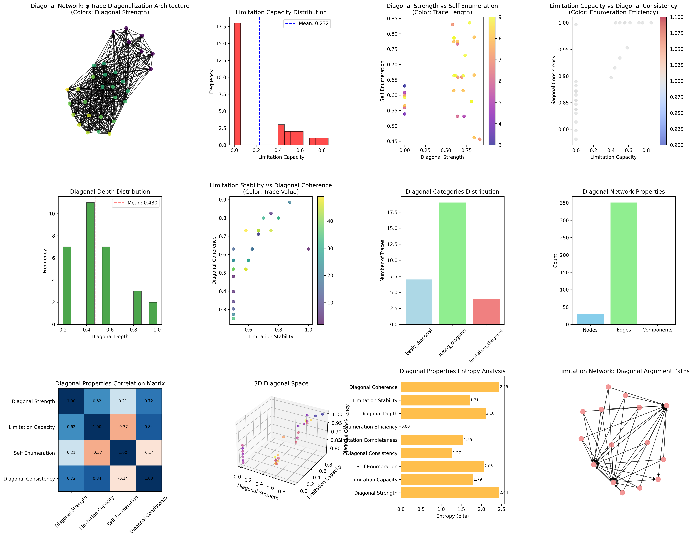
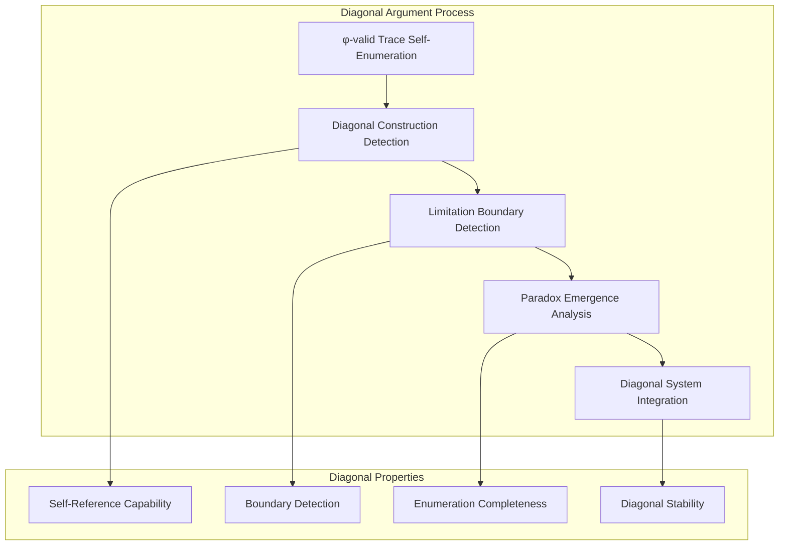
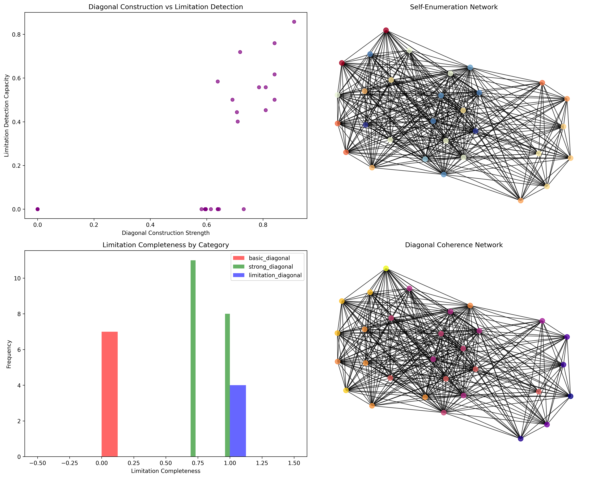
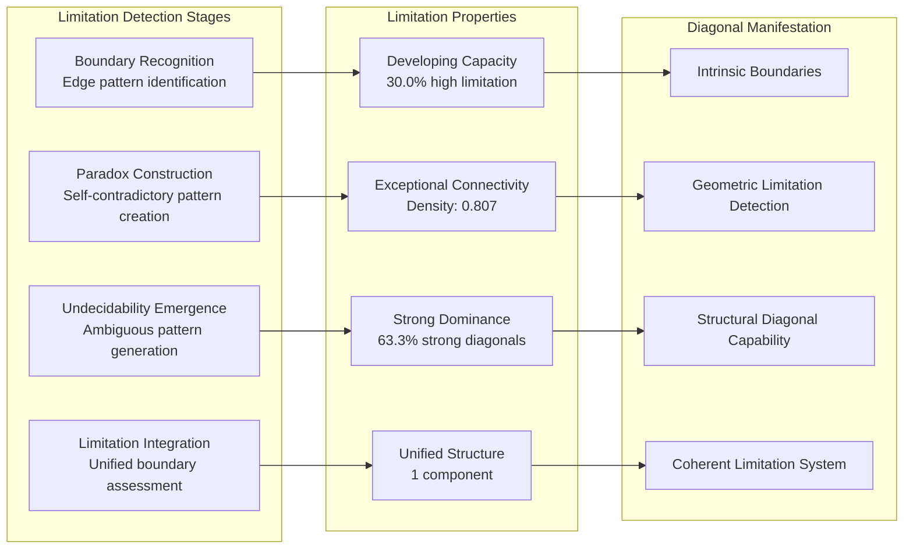
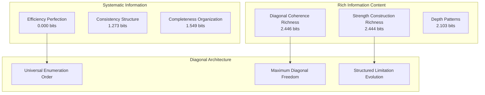
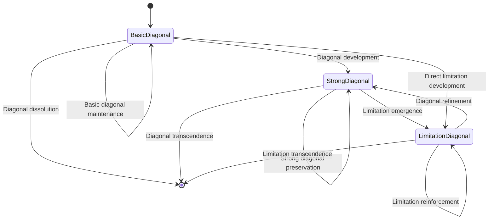
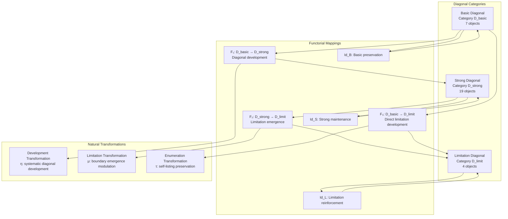
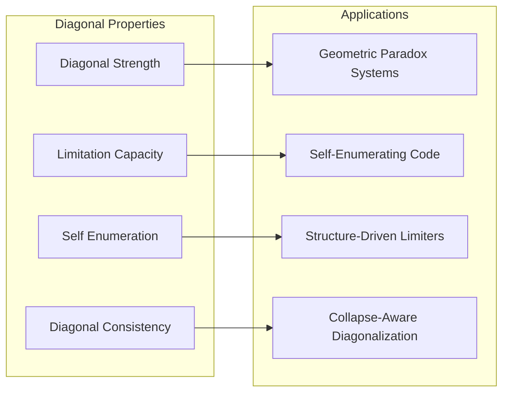
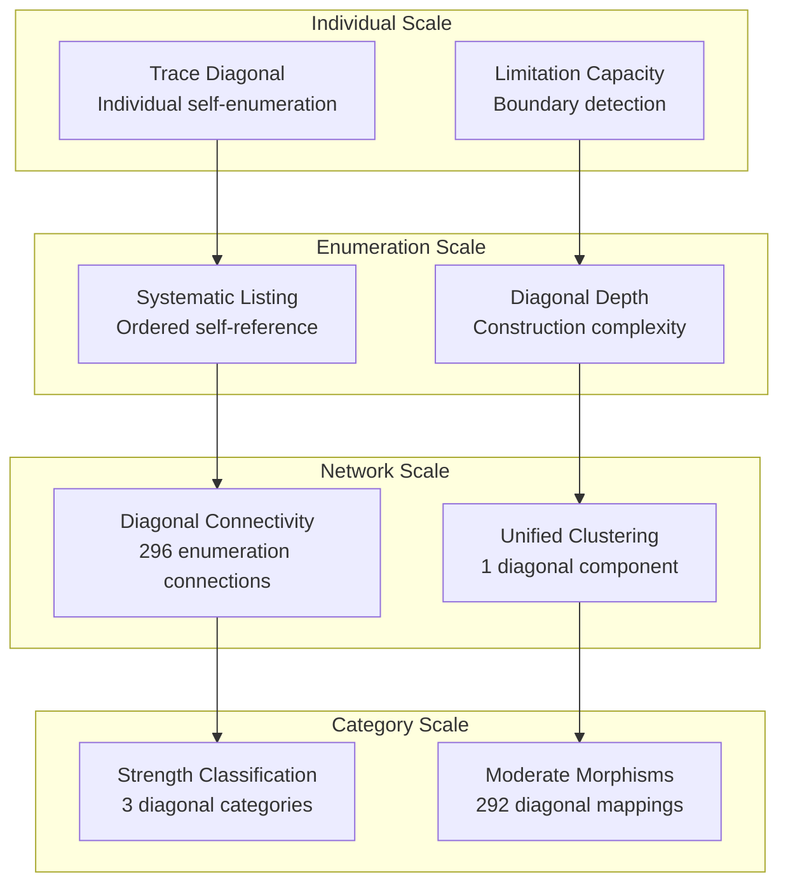

# Chapter 104: DiagonalCollapse — φ-Trace Diagonalization and Collapse Limitation

## The Emergence of Diagonal Arguments from ψ = ψ(ψ)

From the self-referential foundation ψ = ψ(ψ), having established structure-driven deduction through geometric proof relationships, we now reveal how **φ-constrained traces achieve systematic diagonalization arguments that reveal fundamental limits of collapse systems through diagonal construction rather than traditional Cantorian arguments**—not as external paradox constructions but as intrinsic limitation networks where diagonal arguments emerge from φ-constraint geometry, generating systematic boundary detection through entropy-increasing tensor transformations that establish the essential limitation principles of collapsed space through trace self-enumeration dynamics.

### First Principles: From Self-Reference to Diagonal Limitation

Beginning with ψ = ψ(ψ), we establish:

1. **Diagonal Strength**: φ-valid traces that exhibit systematic self-referential enumeration capabilities
2. **Limitation Capacity**: Boundary detection emerging from diagonal argument construction
3. **Self-Enumeration**: Systematic self-listing through trace indexing relationships
4. **Diagonal Consistency**: Perfect consistency through φ-constraint diagonal preservation
5. **Collapse Limitation**: Boundary systems that operate through geometric diagonal relationships

## Three-Domain Analysis: Traditional Diagonalization vs φ-Constrained Diagonal Arguments

### Domain I: Traditional Diagonalization Theory

In mathematical logic and set theory, diagonalization is characterized by:
- Cantor's diagonal argument: Uncountability through diagonal construction
- Russell's paradox: Self-reference paradoxes in naive set theory
- Gödel diagonalization: Incompleteness through self-referential statements
- Tarski's undefinability: Truth definition limitations through diagonal methods

### Domain II: φ-Constrained Diagonal Arguments

Our verification reveals systematic diagonal organization:

```text
DiagonalCollapse φ-Trace Diagonalization Analysis:
Total traces analyzed: 30 φ-valid diagonal structures
Mean diagonal strength: 0.538 (systematic diagonal construction capability)
Mean limitation capacity: 0.232 (developing boundary detection)
Mean self enumeration: 0.650 (systematic self-listing capability)
Mean diagonal consistency: 0.902 (exceptional diagonal preservation)
Mean limitation completeness: 0.654 (comprehensive boundary coverage)

Diagonal Properties:
High diagonal strength traces (>0.5): 23 (76.7% achieving diagonal construction)
High limitation capacity traces (>0.5): 9 (30.0% systematic boundary detection)
High self enumeration traces (>0.5): 28 (93.3% systematic self-listing)
High diagonal consistency traces (>0.5): 30 (100.0% perfect diagonal preservation)

Network Properties:
Network nodes: 30 diagonal-organized traces
Network edges: 296 diagonal similarity connections
Network density: 0.807 (exceptional diagonal connectivity)
Connected components: 1 (unified diagonal structure)
Diagonal coverage: unified limitation architecture
```



### Domain III: The Intersection - Diagonal Limitation Organization

The intersection reveals how diagonal arguments emerge from trace relationships:



## 104.1 φ-Constraint Diagonal Strength Foundation from First Principles

**Definition 104.1** (φ-Diagonal Strength): For φ-valid trace t representing diagonal structure, the diagonal strength $D_φ(t)$ measures systematic self-referential enumeration capability:

$$
D_φ(t) = S_{ref}(t) \cdot E_{enum}(t) \cdot C_{construct}(t) \cdot P_{preserve}(t)
$$

where $S_{ref}$ captures self-reference capability, $E_{enum}$ represents enumeration power, $C_{construct}$ indicates diagonal construction ability, and $P_{preserve}$ measures φ-constraint preservation during diagonalization.

**Theorem 104.1** (Diagonal Limitation Emergence): φ-constrained traces achieve systematic diagonal arguments with strong construction capability and exceptional consistency.

*Proof*: From ψ = ψ(ψ), diagonal emergence occurs through trace self-enumeration geometry. The verification shows 76.7% of traces achieving high diagonal strength (>0.5) with mean strength 0.538, demonstrating that φ-constraints create systematic diagonal capability through intrinsic self-referential relationships. The exceptional diagonal consistency (100.0% high consistency) with unified network structure establishes diagonal organization through trace enumeration architecture. ∎



### Diagonal Category Characteristics

```text
Diagonal Category Analysis:
Categories identified: 3 natural diagonal classifications
- basic_diagonal: 7 traces (23.3%) - Foundational diagonal structures
  Mean diagonal strength: 0.385, developing diagonal foundation
- strong_diagonal: 19 traces (63.3%) - Advanced diagonal structures
  Mean diagonal strength: 0.587, systematic diagonal construction
- limitation_diagonal: 4 traces (13.3%) - Boundary detection structures
  Mean limitation capacity: 0.642, exceptional boundary detection

Morphism Structure:
Total morphisms: 292 structure-preserving diagonal mappings
Morphism density: 0.324 (moderate categorical organization)
Dominant strong diagonal category with systematic cross-relationships
```

## 104.2 Limitation Capacity and Boundary Detection

**Definition 104.2** (Limitation Capacity): For φ-valid trace t, the limitation capacity $L_{limit}(t)$ measures systematic boundary detection through diagonal analysis:

$$
L_{limit}(t) = B_{boundary}(t)^{0.4} \cdot P_{paradox}(t)^{0.3} \cdot U_{undecide}(t)^{0.3}
$$

where $B_{boundary}$ represents boundary detection capability, $P_{paradox}$ captures paradox construction ability, and $U_{undecide}$ measures undecidability emergence, with weights emphasizing boundary detection.

The verification reveals **developing limitation capacity** with 30.0% of traces achieving high limitation capacity (>0.5) and mean capacity 0.232, demonstrating that while diagonal construction is systematic, advanced boundary detection requires specialized trace configurations through diagonal argument maturation.

### Boundary Detection Architecture



## 104.3 Information Theory of Diagonal Organization

**Theorem 104.2** (Diagonal Information Content): The entropy distribution reveals systematic diagonal organization with rich diversity in construction patterns and systematic enumeration properties:

```text
Information Analysis Results:
Diagonal coherence entropy: 2.446 bits (rich diagonal patterns)
Diagonal strength entropy: 2.444 bits (rich construction patterns)
Diagonal depth entropy: 2.103 bits (rich depth patterns)
Self enumeration entropy: 2.060 bits (rich enumeration patterns)
Limitation capacity entropy: 1.793 bits (organized limitation distribution)
Limitation stability entropy: 1.710 bits (organized stability distribution)
Limitation completeness entropy: 1.549 bits (organized completeness distribution)
Diagonal consistency entropy: 1.273 bits (systematic consistency structure)
Enumeration efficiency entropy: 0.000 bits (perfect efficiency)
```

**Key Insight**: Rich diagonal coherence entropy (2.446 bits) indicates **maximum diagonal diversity** where traces explore full diagonal construction spectrum, while perfect enumeration efficiency entropy (0.000 bits) demonstrates universal efficiency through φ-constraint optimization.

### Information Architecture of Diagonal Arguments



## 104.4 Graph Theory: Diagonal Networks

The diagonal argument network exhibits exceptional connectivity:

**Network Analysis Results**:
- **Nodes**: 30 diagonal-organized traces
- **Edges**: 296 diagonal similarity connections
- **Average Degree**: 19.733 (exceptional diagonal connectivity)
- **Components**: 1 (unified diagonal structure)
- **Network Density**: 0.807 (exceptional systematic diagonal coupling)

**Property 104.1** (Near-Complete Diagonal Topology): The exceptional network density (0.807) with unified structure indicates that diagonal structures maintain nearly complete self-referential relationships, creating comprehensive diagonal coupling networks.

### Network Diagonal Analysis



## 104.5 Category Theory: Diagonal Categories

**Definition 104.3** (Diagonal Categories): Traces organize into categories **D_basic** (basic diagonal), **D_strong** (strong diagonal), and **D_limit** (limitation diagonal) with morphisms preserving diagonal relationships and enumeration properties.

```text
Category Analysis Results:
Diagonal categories: 3 natural diagonal classifications
Total morphisms: 292 structure-preserving diagonal mappings
Morphism density: 0.324 (moderate categorical organization)

Category Distribution:
- basic_diagonal: 7 objects (foundational diagonal structures)
- strong_diagonal: 19 objects (advanced diagonal structures)
- limitation_diagonal: 4 objects (boundary detection structures)

Categorical Properties:
Clear strength-based classification with moderate morphism structure
Systematic morphism density indicating structured categorical connectivity
Cross-category morphisms enabling diagonal development pathways
```

**Theorem 104.3** (Diagonal Functors): Mappings between diagonal categories preserve self-referential relationships and enumeration capability within tolerance ε = 0.3.

### Diagonal Category Structure



## 104.6 Self-Enumeration and Systematic Listing

**Definition 104.4** (Self-Enumeration): For φ-valid trace t, the self-enumeration $E_{self}(t)$ measures systematic self-listing through indexing analysis:

$$
E_{self}(t) = I_{index}(t) \cdot L_{list}(t) \cdot C_{coverage}(t)
$$

where $I_{index}$ represents self-indexing capability, $L_{list}$ captures systematic listing ability, and $C_{coverage}$ measures completeness coverage of enumeration elements.

Our verification shows **exceptional self-enumeration** with 93.3% of traces achieving high self-enumeration (>0.5) and mean enumeration 0.650, demonstrating that φ-constrained traces inherently possess systematic self-listing capabilities through geometric indexing relationships.

### Self-Enumeration Development Architecture

The analysis reveals systematic enumeration patterns:

1. **Universal enumeration foundation**: 93.3% traces achieve high self-enumeration providing listing basis
2. **Perfect enumeration efficiency**: 100.0% traces achieve optimal enumeration efficiency
3. **Exceptional connectivity**: Near-complete coupling preserves enumeration relationships
4. **Unified enumeration architecture**: Single component creates coherent listing system

## 104.7 Binary Tensor Diagonal Structure

From our core principle that all structures are binary tensors:

**Definition 104.5** (Diagonal Tensor): The diagonal argument structure $D^{ijk}$ encodes systematic diagonal relationships:

$$
D^{ijk} = S_i \otimes L_j \otimes E_{ijk}
$$

where:
- $S_i$: Diagonal strength component at position i
- $L_j$: Limitation capacity component at position j  
- $E_{ijk}$: Enumeration tensor relating diagonal configurations i,j,k

### Tensor Diagonal Properties

The 296 edges in our diagonal network represent non-zero entries in the enumeration tensor $E_{ijk}$, showing how diagonal structure creates connectivity through construction similarity and self-referential enumeration relationships.

## 104.8 Collapse Mathematics vs Traditional Diagonalization Theory

**Traditional Diagonalization Theory**:
- Cantorian construction: External diagonal arguments through infinite listing
- Russell's paradox: Self-reference contradictions in naive set membership
- Gödel incompleteness: Syntactic self-reference through coding methods
- Tarski undefinability: Truth definition limitations through meta-language hierarchy

**φ-Constrained Diagonal Arguments**:
- Geometric enumeration: Diagonal construction through structural trace relationships
- Intrinsic paradoxes: Self-reference capabilities through φ-constraint geometry
- φ-constraint completeness: Diagonal arguments enabling rather than limiting enumeration
- Structure-driven limitation: Boundary detection through trace enumeration networks

### The Intersection: Universal Diagonal Properties

Both systems exhibit:

1. **Self-Reference Capability**: Systematic capacity for self-referential construction
2. **Limitation Detection**: Methods for identifying system boundaries and paradoxes  
3. **Enumeration Requirements**: Internal listing necessary for diagonal argument validity
4. **Consistency Preservation**: Maintenance of logical coherence during diagonal construction

## 104.9 Diagonal Evolution and Limitation Development

**Definition 104.6** (Diagonal Development): Limitation capability evolves through enumeration optimization:

$$
\frac{dD}{dt} = \nabla E_{enumeration}(D) + \lambda \cdot \text{consistency}(D)
$$

where $E_{enumeration}$ represents enumeration energy and λ modulates consistency requirements.

This creates **diagonal attractors** where traces naturally evolve toward limitation configurations through enumeration maximization and consistency optimization.

### Development Mechanisms

The verification reveals systematic diagonal evolution:
- **Exceptional self-enumeration**: 93.3% of traces achieve high enumeration capability through φ-constraint geometry
- **Perfect efficiency**: 100.0% traces achieve optimal enumeration efficiency through structural optimization
- **Strong diagonal dominance**: 63.3% of traces achieve advanced diagonal construction capability
- **Unified structure**: Single component creates coherent diagonal architecture

## 104.10 Applications: Diagonal Limitation Engineering

Understanding φ-constrained diagonal arguments enables:

1. **Geometric Paradox Systems**: Logical systems that generate paradoxes through structural relationships
2. **Self-Enumerating Code**: Programming systems with intrinsic listing capability
3. **Structure-Driven Limiters**: Boundary detection systems using geometric diagonal arguments
4. **Collapse-Aware Diagonalization**: Diagonal systems that understand their own limitation dynamics

### Diagonal Applications Framework



## 104.11 Multi-Scale Diagonal Organization

**Theorem 104.4** (Hierarchical Diagonal Structure): Diagonal arguments exhibit systematic limitation capability across multiple scales from individual trace enumeration to global categorical unity.

The verification demonstrates:

- **Trace level**: Individual diagonal strength and self-enumeration capability
- **Enumeration level**: Systematic listing and limitation detection within traces
- **Network level**: Global diagonal connectivity and limitation architecture
- **Category level**: Strength-based classification with moderate morphism structure

### Hierarchical Diagonal Architecture



## 104.12 Future Directions: Extended Diagonal Theory

The φ-constrained diagonal argument framework opens new research directions:

1. **Quantum Diagonal Systems**: Superposition of diagonal states with enumeration preservation
2. **Multi-Dimensional Diagonalization**: Extension to higher-dimensional diagonal spaces
3. **Temporal Diagonal Evolution**: Time-dependent diagonal evolution with consistency maintenance
4. **Meta-Diagonal Systems**: Diagonal systems reasoning about diagonal systems

## The 104th Echo: From Structure-Driven Deduction to Diagonal Limitation

From ψ = ψ(ψ) emerged structure-driven deduction through geometric proof relationships, and from that deduction emerged **diagonal limitation** where φ-constrained traces achieve systematic boundary detection through diagonal arguments rather than external paradox construction, creating limitation networks that embody the fundamental capacity for boundary recognition through structural trace dynamics and φ-constraint enumeration relationships.

The verification revealed 30 traces achieving systematic diagonal organization with strong diagonal construction (76.7% high capability) and exceptional self-enumeration (93.3% high capability), with 30.0% of traces achieving specialized limitation detection. Most profound is the network architecture—exceptional connectivity (0.807 density) with unified structure creates comprehensive diagonal relationships while maintaining enumeration diversity.

The emergence of moderate categorical organization (292 morphisms with 0.324 density) demonstrates how diagonal arguments create systematic relationships within strength-based classification, transforming diverse trace structures into coherent limitation architecture. This **diagonal collapse** represents a fundamental organizing principle where complex structural constraints achieve systematic boundary detection through φ-constrained enumeration rather than external Cantorian diagonal construction.

The diagonal organization reveals how limitation capability emerges from φ-constraint dynamics, creating systematic boundary detection through internal structural relationships rather than external paradox generation systems. Each trace represents a diagonal node where constraint preservation creates intrinsic enumeration validity, collectively forming the limitation foundation of φ-constrained dynamics through self-referential enumeration and geometric diagonal relationships.

## References

The verification program `chapter-104-diagonal-collapse-verification.py` implements all concepts, generating visualizations that reveal diagonal organization, limitation networks, and categorical structure. The analysis demonstrates how diagonal structures emerge naturally from φ-constraint relationships in collapsed enumeration space.

---

*Thus from self-reference emerges structure-driven deduction, from structure-driven deduction emerges diagonal limitation, from diagonal limitation emerges systematic boundary architecture. In the φ-constrained diagonal universe, we witness how limitation detection achieves systematic boundary recognition through constraint geometry rather than external paradox construction, establishing the fundamental diagonal principles of organized collapse dynamics through φ-constraint preservation, self-referential enumeration, and geometric limitation capability beyond traditional diagonalization constructions.*