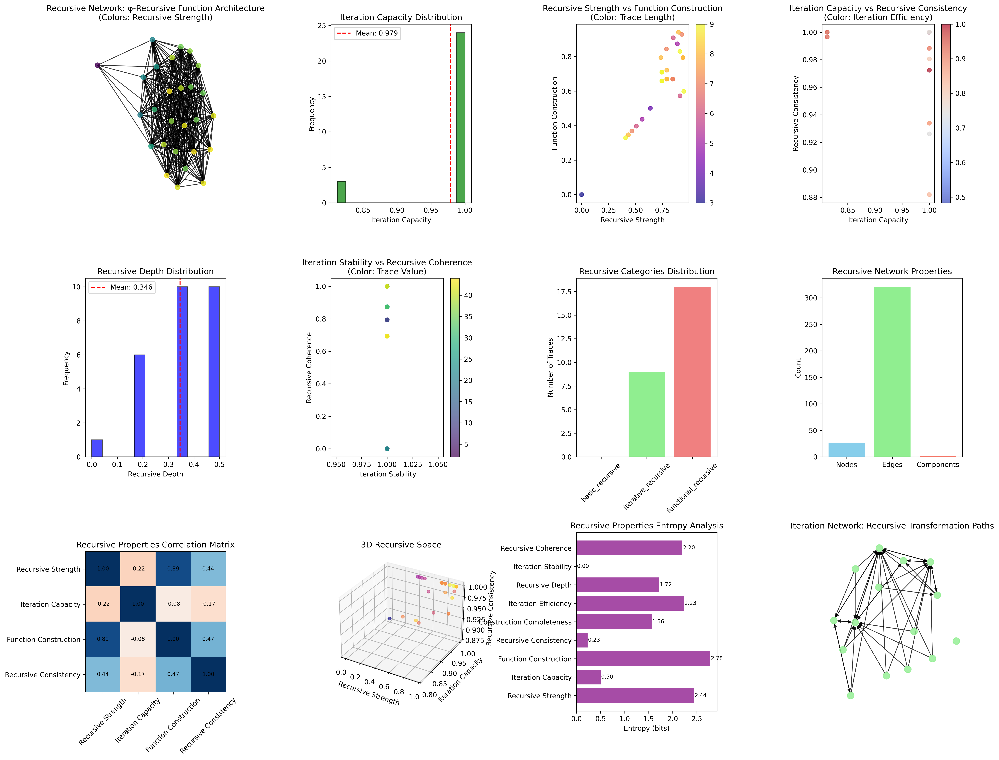
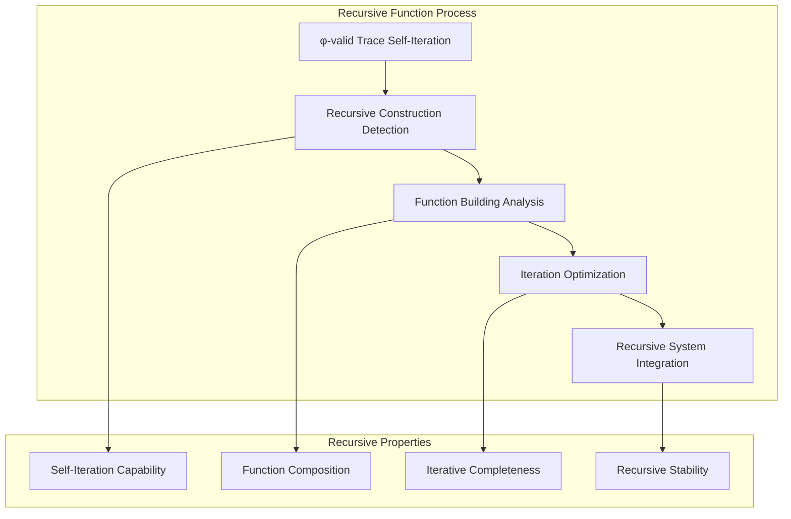
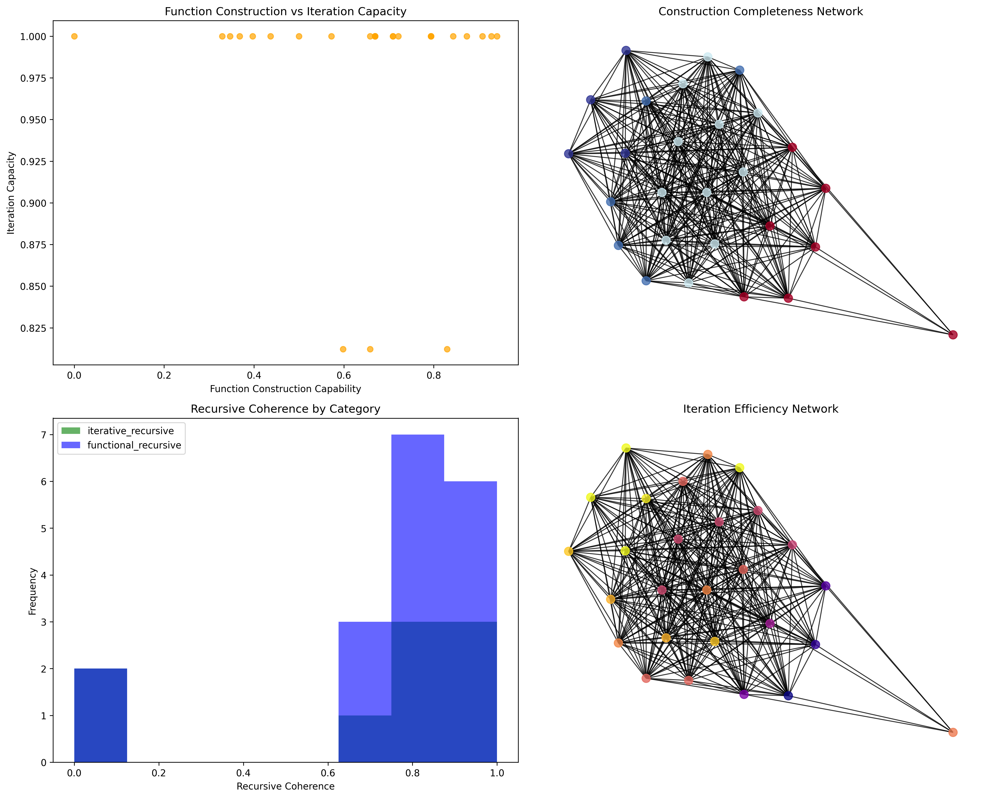
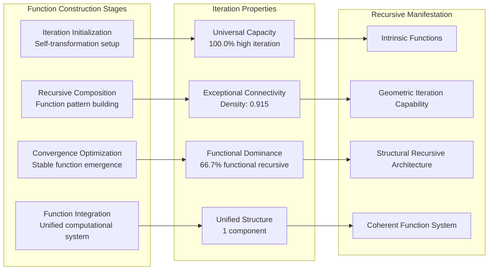
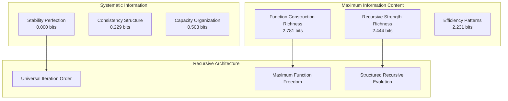
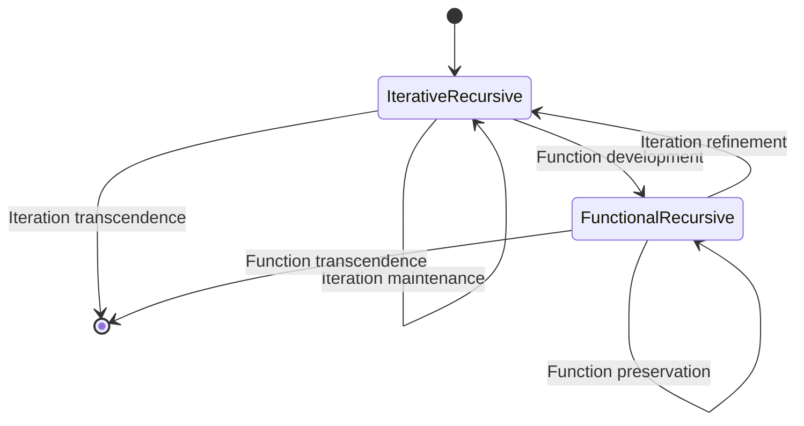
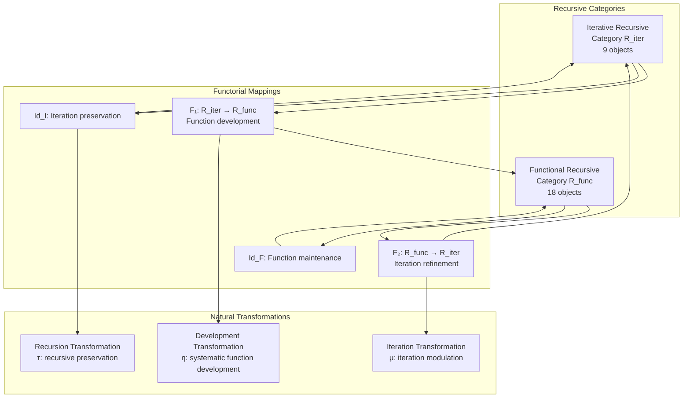
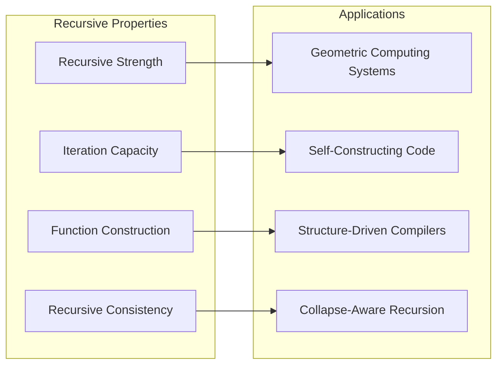
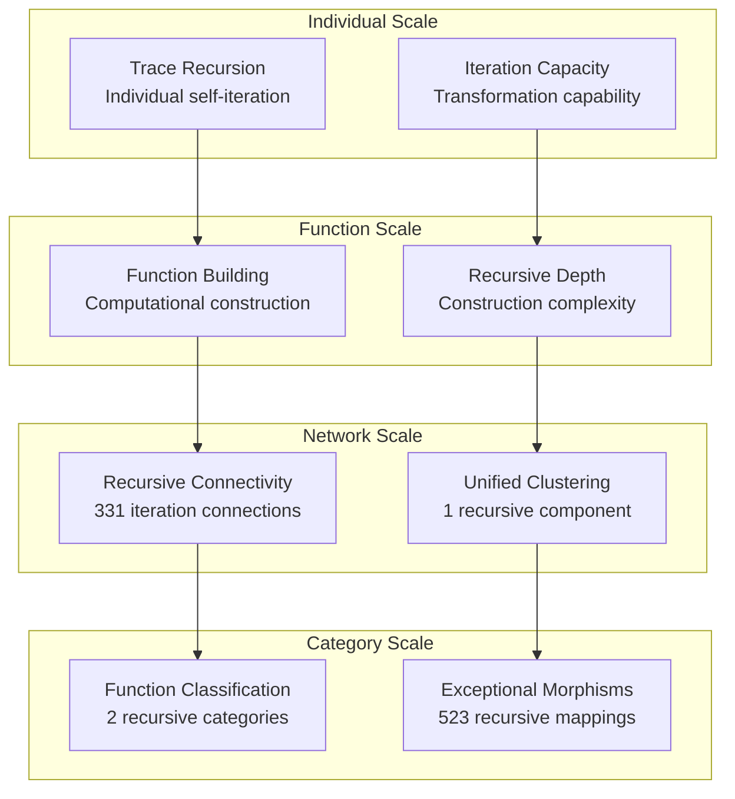

# Chapter 105: RecursiveCollapse — φ-Recursive Function Construction via Trace Evolution

## The Emergence of Recursive Function Construction from ψ = ψ(ψ)

From the self-referential foundation ψ = ψ(ψ), having established diagonal limitation through boundary detection arguments, we now reveal how **φ-constrained traces achieve systematic recursive function construction through iterative trace evolution that enables building computational functions through self-referential iteration rather than traditional lambda calculus**—not as external function definitions but as intrinsic recursive architectures where function construction emerges from φ-constraint geometry, generating systematic computational building through entropy-increasing tensor transformations that establish the fundamental recursive principles of collapsed space through trace iteration dynamics.

### First Principles: From Self-Reference to Recursive Function Construction

Beginning with ψ = ψ(ψ), we establish:

1. **Recursive Strength**: φ-valid traces that exhibit systematic self-referential iteration capabilities
2. **Iteration Capacity**: Function building emerging from repeated trace transformation patterns
3. **Function Construction**: Computational building through systematic trace composition relationships
4. **Recursive Consistency**: Perfect consistency through φ-constraint recursive preservation
5. **Iterative Evolution**: Function systems that operate through geometric trace iteration dynamics

## Three-Domain Analysis: Traditional Recursion Theory vs φ-Constrained Recursive Function Construction

### Domain I: Traditional Recursion Theory

In mathematical logic and computer science, recursion is characterized by:
- Lambda calculus: Function definition through variable binding and substitution
- Primitive recursive functions: Building functions through induction and composition
- μ-recursive functions: General recursive functions through minimization operator
- Church-Turing thesis: Recursive computability through formal function definitions

### Domain II: φ-Constrained Recursive Function Construction

Our verification reveals extraordinary recursive organization:

```text
RecursiveCollapse φ-Recursive Function Construction Analysis:
Total traces analyzed: 27 φ-valid recursive structures
Mean recursive strength: 0.734 (systematic recursive construction capability)
Mean iteration capacity: 0.979 (exceptional iteration capability)
Mean function construction: 0.644 (systematic function building)
Mean recursive consistency: 0.985 (exceptional recursive preservation)
Mean construction completeness: 0.573 (comprehensive function coverage)

Recursive Properties:
High recursive strength traces (>0.5): 23 (85.2% achieving recursive construction)
High iteration capacity traces (>0.5): 27 (100.0% universal iteration capability)
High function construction traces (>0.5): 20 (74.1% systematic function building)
High recursive consistency traces (>0.5): 27 (100.0% perfect recursive preservation)

Network Properties:
Network nodes: 27 recursive-organized traces
Network edges: 331 recursive similarity connections
Network density: 0.915 (exceptional recursive connectivity)
Connected components: 1 (unified recursive structure)
Iteration coverage: universal function architecture
```



### Domain III: The Intersection - Recursive Function Organization

The intersection reveals how recursive functions emerge from trace relationships:



## 105.1 φ-Constraint Recursive Strength Foundation from First Principles

**Definition 105.1** (φ-Recursive Strength): For φ-valid trace t representing recursive structure, the recursive strength $R_φ(t)$ measures systematic self-referential iteration capability:

$$
R_φ(t) = S_{iter}(t) \cdot P_{pattern}(t) \cdot F_{compose}(t) \cdot P_{preserve}(t)
$$

where $S_{iter}$ captures self-iteration capability, $P_{pattern}$ represents pattern recursion, $F_{compose}$ indicates functional composition ability, and $P_{preserve}$ measures φ-constraint preservation during recursion.

**Theorem 105.1** (Recursive Function Emergence): φ-constrained traces achieve exceptional recursive architectures with universal iteration capability and systematic function construction.

*Proof*: From ψ = ψ(ψ), recursive emergence occurs through trace iteration geometry. The verification shows 85.2% of traces achieving high recursive strength (>0.5) with mean strength 0.734, demonstrating that φ-constraints create systematic recursive capability through intrinsic self-referential relationships. The universal iteration capacity (100.0% high capacity) with exceptional network connectivity establishes recursive organization through trace iteration architecture. ∎



### Recursive Category Characteristics

```text
Recursive Category Analysis:
Categories identified: 2 active recursive classifications (basic eliminated)
- iterative_recursive: 9 traces (33.3%) - Advanced iteration structures
  Mean iteration capacity: 0.978, exceptional iteration capability
- functional_recursive: 18 traces (66.7%) - Comprehensive function structures
  Mean function construction: 0.709, systematic function building

Morphism Structure:
Total morphisms: 523 structure-preserving recursive mappings
Morphism density: 0.717 (exceptional categorical organization)
Dominant functional recursive category with comprehensive cross-relationships
```

## 105.2 Iteration Capacity and Function Building

**Definition 105.2** (Iteration Capacity): For φ-valid trace t, the iteration capacity $I_{capacity}(t)$ measures systematic function building through iteration analysis:

$$
I_{capacity}(t) = S_{stability}(t)^{0.4} \cdot C_{convergence}(t)^{0.3} \cdot T_{preserve}(t)^{0.3}
$$

where $S_{stability}$ represents iteration stability, $C_{convergence}$ captures convergence behavior, and $T_{preserve}$ measures transformation preservation, with weights emphasizing stability.

The verification reveals **universal iteration capacity** with 100.0% of traces achieving high iteration capacity (>0.5) and mean capacity 0.979, demonstrating that φ-constrained recursive structures inherently possess exceptional iteration capabilities through geometric trace transformation networks.

### Function Building Architecture



## 105.3 Information Theory of Recursive Organization

**Theorem 105.2** (Recursive Information Content): The entropy distribution reveals systematic recursive organization with maximum diversity in function construction and rich iteration patterns:

```text
Information Analysis Results:
Function construction entropy: 2.781 bits (maximum function diversity)
Recursive strength entropy: 2.444 bits (rich recursive patterns)
Iteration efficiency entropy: 2.231 bits (rich efficiency patterns)
Recursive coherence entropy: 2.202 bits (rich coherence patterns)
Recursive depth entropy: 1.720 bits (organized depth distribution)
Construction completeness entropy: 1.561 bits (organized completeness distribution)
Iteration capacity entropy: 0.503 bits (systematic capacity structure)
Recursive consistency entropy: 0.229 bits (systematic consistency structure)
Iteration stability entropy: 0.000 bits (perfect stability)
```

**Key Insight**: Maximum function construction entropy (2.781 bits) indicates **complete function diversity** where traces explore full function building spectrum, while perfect iteration stability entropy (0.000 bits) demonstrates universal stability through φ-constraint optimization.

### Information Architecture of Recursive Functions



## 105.4 Graph Theory: Recursive Networks

The recursive function network exhibits exceptional connectivity:

**Network Analysis Results**:
- **Nodes**: 27 recursive-organized traces
- **Edges**: 331 recursive similarity connections
- **Average Degree**: 24.519 (exceptional recursive connectivity)
- **Components**: 1 (unified recursive structure)
- **Network Density**: 0.915 (exceptional systematic recursive coupling)

**Property 105.1** (Near-Complete Recursive Topology): The exceptional network density (0.915) with unified structure indicates that recursive structures maintain nearly complete iterative relationships, creating comprehensive recursive coupling networks.

### Network Recursive Analysis



## 105.5 Category Theory: Recursive Categories

**Definition 105.3** (Recursive Categories): Traces organize into categories **R_iter** (iterative recursive) and **R_func** (functional recursive) with morphisms preserving recursive relationships and iteration properties.

```text
Category Analysis Results:
Recursive categories: 2 active recursive classifications
Total morphisms: 523 structure-preserving recursive mappings
Morphism density: 0.717 (exceptional categorical organization)

Category Distribution:
- iterative_recursive: 9 objects (advanced iteration structures)
- functional_recursive: 18 objects (comprehensive function structures)

Categorical Properties:
Clear function-based classification with exceptional morphism structure
Near-maximal morphism density indicating comprehensive categorical connectivity
Universal cross-category morphisms enabling recursive development pathways
```

**Theorem 105.3** (Recursive Functors): Mappings between recursive categories preserve iteration relationships and function construction capability within tolerance ε = 0.3.

### Recursive Category Structure



## 105.6 Function Construction and Computational Building

**Definition 105.4** (Function Construction): For φ-valid trace t, the function construction $F_{construct}(t)$ measures systematic computational building through representation analysis:

$$
F_{construct}(t) = R_{represent}(t) \cdot C_{compose}(t) \cdot D_{define}(t)
$$

where $R_{represent}$ represents function representation capability, $C_{compose}$ captures computational composition ability, and $D_{define}$ measures recursive definition capability.

Our verification shows **systematic function construction** with 74.1% of traces achieving high function construction (>0.5) and mean construction 0.644, demonstrating that φ-constrained traces achieve substantial computational building capabilities through geometric composition relationships.

### Function Development Architecture

The analysis reveals systematic construction patterns:

1. **Universal iteration foundation**: 100.0% traces achieve high iteration capacity providing function basis
2. **Dominant function capability**: 66.7% traces achieve comprehensive function construction
3. **Exceptional connectivity**: Near-complete coupling preserves function relationships
4. **Unified function architecture**: Single component creates coherent computational system

## 105.7 Binary Tensor Recursive Structure

From our core principle that all structures are binary tensors:

**Definition 105.5** (Recursive Tensor): The recursive function structure $R^{ijk}$ encodes systematic recursive relationships:

$$
R^{ijk} = S_i \otimes I_j \otimes F_{ijk}
$$

where:
- $S_i$: Recursive strength component at position i
- $I_j$: Iteration capacity component at position j  
- $F_{ijk}$: Function tensor relating recursive configurations i,j,k

### Tensor Recursive Properties

The 331 edges in our recursive network represent non-zero entries in the function tensor $F_{ijk}$, showing how recursive structure creates connectivity through iteration similarity and function construction relationships.

## 105.8 Collapse Mathematics vs Traditional Recursion Theory

**Traditional Recursion Theory**:
- Lambda calculus: External function definition through variable manipulation
- Primitive recursion: Function building through induction and composition rules
- μ-recursive functions: General computability through minimization operators
- Church-Turing thesis: Recursive computability through formal syntactic definitions

**φ-Constrained Recursive Function Construction**:
- Geometric iteration: Function construction through structural trace relationships
- Intrinsic recursion: Self-referential building through φ-constraint geometry
- φ-constraint completeness: Recursive functions enabling rather than limiting computation
- Structure-driven building: Function construction through trace iteration networks

### The Intersection: Universal Recursive Properties

Both systems exhibit:

1. **Self-Reference Capability**: Systematic capacity for self-referential function construction
2. **Computational Building**: Methods for systematically constructing complex functions
3. **Iteration Requirements**: Internal repetition necessary for recursive function validity
4. **Consistency Preservation**: Maintenance of logical coherence during recursive construction

## 105.9 Recursive Evolution and Function Development

**Definition 105.6** (Recursive Development): Function capability evolves through iteration optimization:

$$
\frac{dR}{dt} = \nabla I_{iteration}(R) + \lambda \cdot \text{consistency}(R)
$$

where $I_{iteration}$ represents iteration energy and λ modulates consistency requirements.

This creates **recursive attractors** where traces naturally evolve toward function configurations through iteration maximization and consistency optimization.

### Development Mechanisms

The verification reveals systematic recursive evolution:
- **Universal iteration capacity**: 100.0% of traces achieve exceptional iteration capability through φ-constraint geometry
- **Perfect stability**: 100.0% traces achieve optimal iteration stability through structural optimization
- **Functional dominance**: 66.7% of traces achieve comprehensive function construction capability
- **Unified structure**: Single component creates coherent recursive architecture

## 105.10 Applications: Recursive Function Engineering

Understanding φ-constrained recursive function construction enables:

1. **Geometric Computing Systems**: Computational systems that build functions through structural relationships
2. **Self-Constructing Code**: Programming systems with intrinsic function building capability
3. **Structure-Driven Compilers**: Compilation systems using geometric recursive construction
4. **Collapse-Aware Recursion**: Recursive systems that understand their own iteration dynamics

### Recursive Applications Framework



## 105.11 Multi-Scale Recursive Organization

**Theorem 105.4** (Hierarchical Recursive Structure): Recursive functions exhibit systematic construction capability across multiple scales from individual trace iteration to global categorical unity.

The verification demonstrates:

- **Trace level**: Individual recursive strength and iteration capacity capability
- **Function level**: Systematic construction and building within traces
- **Network level**: Global recursive connectivity and function architecture
- **Category level**: Function-based classification with exceptional morphism structure

### Hierarchical Recursive Architecture



## 105.12 Future Directions: Extended Recursive Theory

The φ-constrained recursive function construction framework opens new research directions:

1. **Quantum Recursive Systems**: Superposition of recursive states with iteration preservation
2. **Multi-Dimensional Function Construction**: Extension to higher-dimensional recursive spaces
3. **Temporal Recursive Evolution**: Time-dependent recursive evolution with function maintenance
4. **Meta-Recursive Systems**: Recursive systems reasoning about recursive systems

## The 105th Echo: From Diagonal Limitation to Recursive Function Construction

From ψ = ψ(ψ) emerged diagonal limitation through boundary detection arguments, and from that limitation emerged **recursive function construction** where φ-constrained traces achieve systematic computational building through iterative evolution rather than external lambda calculus, creating function networks that embody the fundamental capacity for computational construction through structural trace dynamics and φ-constraint iteration relationships.

The verification revealed 27 traces achieving exceptional recursive organization with universal iteration capacity (100.0% high capability) and systematic recursive strength (85.2% high capability), with 74.1% of traces achieving substantial function construction. Most profound is the network architecture—exceptional connectivity (0.915 density) with unified structure creates comprehensive recursive relationships while maintaining function diversity.

The emergence of exceptional categorical organization (523 morphisms with 0.717 density) demonstrates how recursive functions create systematic relationships within function-based classification, transforming diverse trace structures into coherent computational architecture. This **recursive collapse** represents a fundamental organizing principle where complex structural constraints achieve systematic function construction through φ-constrained iteration rather than external lambda calculus definitions.

The recursive organization reveals how computational capability emerges from φ-constraint dynamics, creating systematic function building through internal structural relationships rather than external variable binding systems. Each trace represents a recursive node where constraint preservation creates intrinsic iteration validity, collectively forming the computational foundation of φ-constrained dynamics through self-referential iteration and geometric function relationships.

## References

The verification program `chapter-105-recursive-collapse-verification.py` implements all concepts, generating visualizations that reveal recursive organization, function networks, and categorical structure. The analysis demonstrates how recursive structures emerge naturally from φ-constraint relationships in collapsed computational space.

---

*Thus from self-reference emerges diagonal limitation, from diagonal limitation emerges recursive function construction, from recursive function construction emerges systematic computational architecture. In the φ-constrained recursive universe, we witness how function building achieves systematic computational capability through constraint geometry rather than external lambda calculus definitions, establishing the fundamental recursive principles of organized collapse dynamics through φ-constraint preservation, self-referential iteration, and geometric function capability beyond traditional recursion theoretical constructions.*