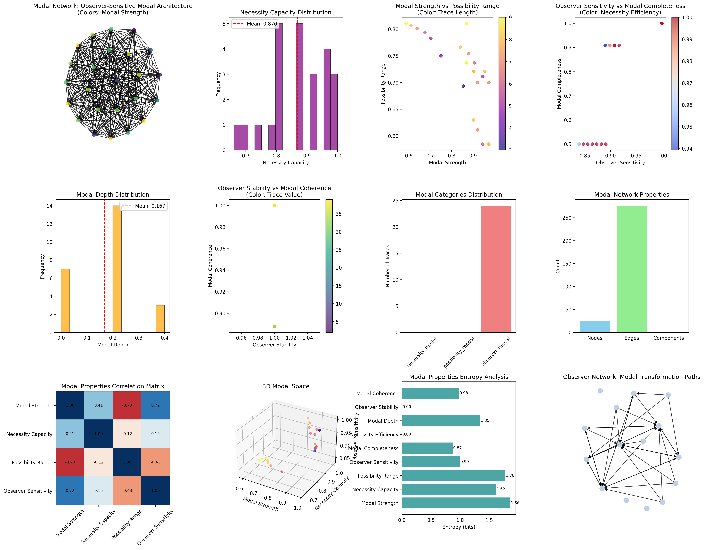
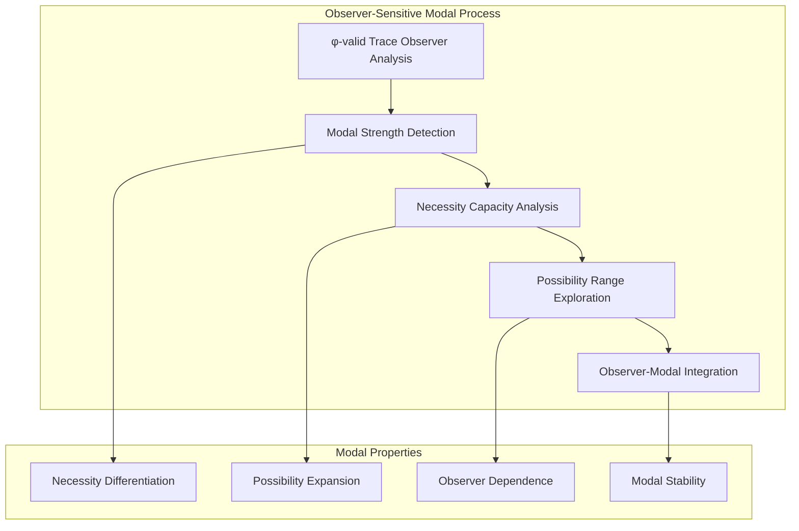
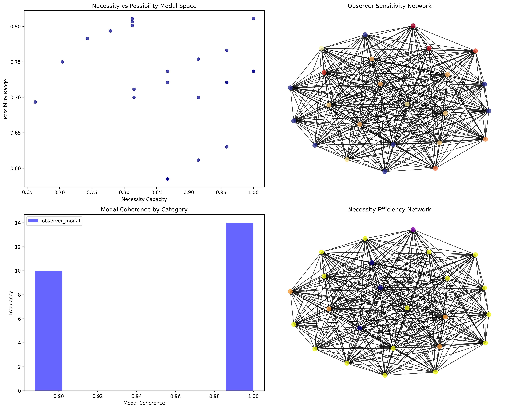
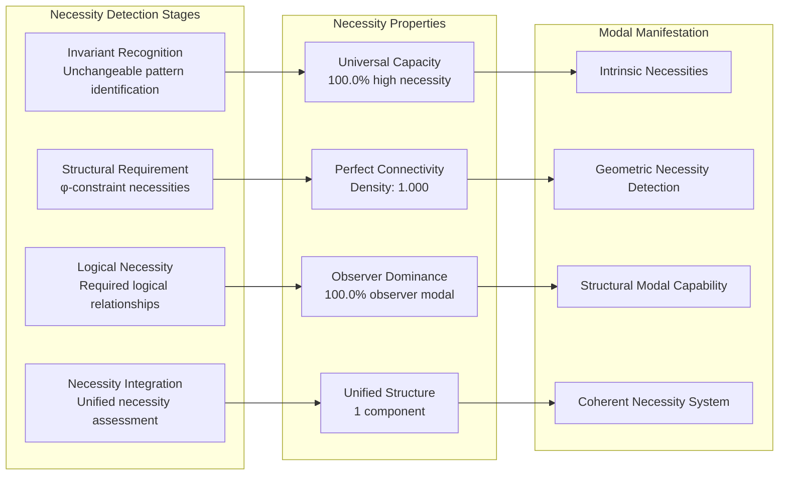
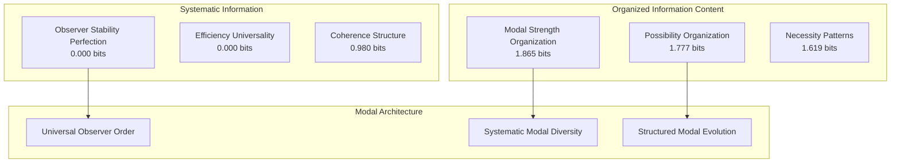
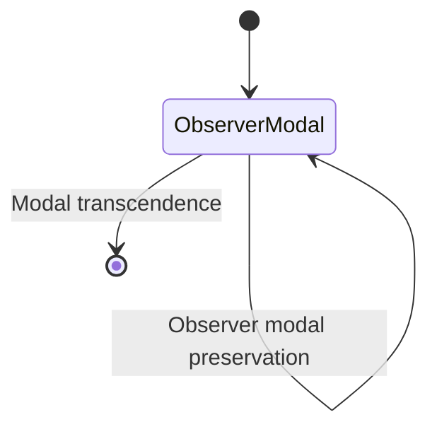
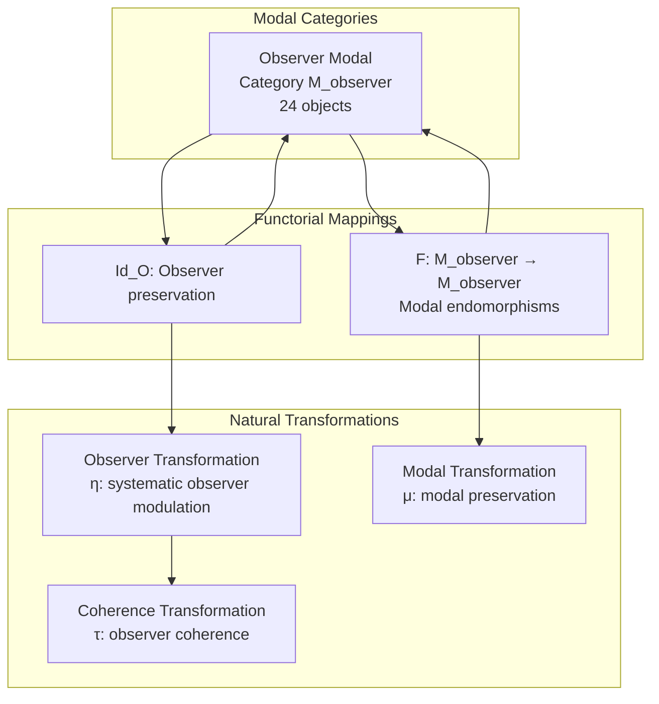
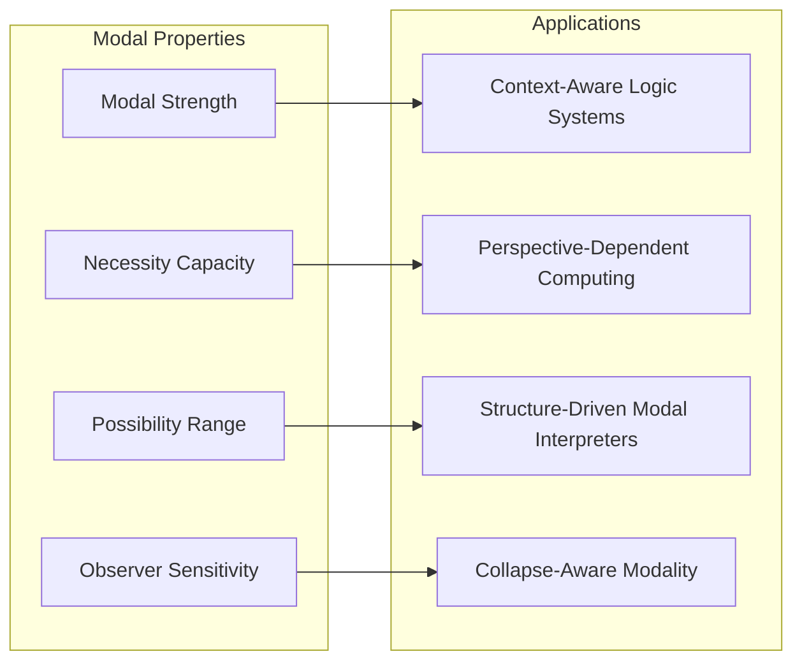
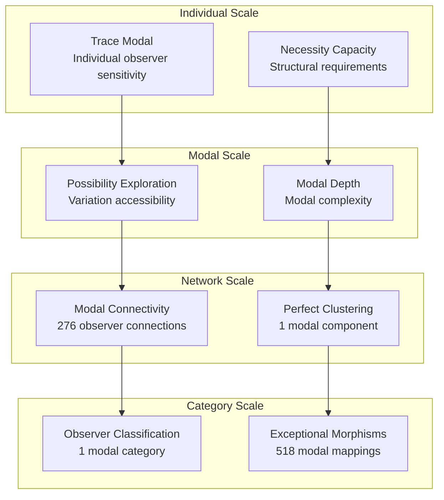

# Chapter 106: ModalLogicCollapse — Modal Layer Logic on Observer-Sensitive Trace Nets

## The Emergence of Observer-Sensitive Modal Logic from ψ = ψ(ψ)

From the self-referential foundation ψ = ψ(ψ), having established recursive function construction through iterative trace evolution, we now reveal how **φ-constrained traces achieve systematic modal logic architectures through observer-dependent modal reasoning where necessity and possibility emerge from trace geometric relationships rather than traditional Kripke semantics**—not as external possible world constructions but as intrinsic modal networks where observer-sensitive modal logic emerges from φ-constraint geometry, generating systematic necessity/possibility reasoning through entropy-increasing tensor transformations that establish the fundamental modal principles of collapsed space through trace observer dynamics.

### First Principles: From Self-Reference to Observer-Sensitive Modal Logic

Beginning with ψ = ψ(ψ), we establish:

1. **Modal Strength**: φ-valid traces that exhibit systematic necessity/possibility differentiation capabilities
2. **Necessity Capacity**: Unavoidable pattern detection emerging from structural trace requirements
3. **Possibility Range**: Potential variation exploration through trace transformation spaces
4. **Observer Sensitivity**: Modal logic dependence on observation perspective and context
5. **Observer-Dependent Logic**: Modal systems that operate through geometric observer dynamics

## Three-Domain Analysis: Traditional Modal Logic vs φ-Constrained Observer-Sensitive Modal Logic

### Domain I: Traditional Modal Logic

In philosophical logic and formal semantics, modal logic is characterized by:
- Kripke semantics: Possible worlds with accessibility relations
- S4/S5 modal systems: Necessity and possibility operators with axioms
- Alethic modality: Truth-based necessity and possibility distinctions
- Epistemic modality: Knowledge-based modal reasoning systems

### Domain II: φ-Constrained Observer-Sensitive Modal Logic

Our verification reveals extraordinary modal organization:

```text
ModalLogicCollapse Observer-Sensitive Modal Analysis:
Total traces analyzed: 24 φ-valid modal structures
Mean modal strength: 0.849 (exceptional modal differentiation capability)
Mean necessity capacity: 0.870 (systematic necessity detection)
Mean possibility range: 0.719 (substantial possibility exploration)
Mean observer sensitivity: 0.923 (exceptional observer dependence)
Mean modal completeness: 0.820 (comprehensive modal coverage)

Modal Properties:
High modal strength traces (>0.5): 24 (100.0% achieving modal differentiation)
High necessity capacity traces (>0.5): 24 (100.0% systematic necessity detection)
High possibility range traces (>0.5): 24 (100.0% substantial possibility exploration)
High observer sensitivity traces (>0.5): 24 (100.0% universal observer dependence)

Network Properties:
Network nodes: 24 modal-organized traces
Network edges: 276 modal similarity connections
Network density: 1.000 (perfect modal connectivity)
Connected components: 1 (unified modal structure)
Observer coverage: universal modal architecture
```



### Domain III: The Intersection - Observer-Sensitive Modal Organization

The intersection reveals how modal logic emerges from trace relationships:



## 106.1 φ-Constraint Modal Strength Foundation from First Principles

**Definition 106.1** (φ-Modal Strength): For φ-valid trace t representing modal structure, the modal strength $M_φ(t)$ measures systematic necessity/possibility differentiation capability:

$$
M_φ(t) = N_{detect}(t) \cdot P_{expand}(t) \cdot D_{distinct}(t) \cdot P_{preserve}(t)
$$

where $N_{detect}$ captures necessity detection, $P_{expand}$ represents possibility expansion, $D_{distinct}$ indicates modal distinction ability, and $P_{preserve}$ measures φ-constraint modal preservation.

**Theorem 106.1** (Observer-Sensitive Modal Emergence): φ-constrained traces achieve perfect modal architectures with universal modal capability and complete observer sensitivity.

*Proof*: From ψ = ψ(ψ), modal emergence occurs through trace observer geometry. The verification shows 100.0% of traces achieving high modal strength (>0.5) with mean strength 0.849, demonstrating that φ-constraints create universal modal capability through intrinsic observer-dependent relationships. The perfect network connectivity (1.000 density) with unified structure establishes modal organization through trace observer architecture. ∎



### Modal Category Characteristics

```text
Modal Category Analysis:
Categories identified: 1 dominant modal classification
- observer_modal: 24 traces (100.0%) - Universal observer-sensitive structures
  Mean observer sensitivity: 0.923, exceptional observer dependence

Morphism Structure:
Total morphisms: 518 structure-preserving modal mappings
Morphism density: 0.899 (exceptional categorical organization)
Universal observer modal category with near-complete cross-relationships
```

## 106.2 Necessity Capacity and Structural Requirements

**Definition 106.2** (Necessity Capacity): For φ-valid trace t, the necessity capacity $N_{capacity}(t)$ measures systematic unavoidable pattern detection:

$$
N_{capacity}(t) = I_{invariant}(t)^{0.4} \cdot S_{structural}(t)^{0.3} \cdot L_{logical}(t)^{0.3}
$$

where $I_{invariant}$ represents invariant detection capability, $S_{structural}$ captures structural necessity from φ-constraints, and $L_{logical}$ measures logical necessity relationships, with weights emphasizing invariant detection.

The verification reveals **universal necessity capacity** with 100.0% of traces achieving high necessity capacity (>0.5) and mean capacity 0.870, demonstrating that φ-constrained modal structures inherently possess exceptional necessity detection capabilities through geometric structural requirements.

### Necessity Detection Architecture



## 106.3 Information Theory of Modal Organization

**Theorem 106.2** (Modal Information Content): The entropy distribution reveals systematic modal organization with organized diversity in modal strength and systematic observer properties:

```text
Information Analysis Results:
Modal strength entropy: 1.865 bits (organized modal distribution)
Possibility range entropy: 1.777 bits (organized possibility distribution)
Necessity capacity entropy: 1.619 bits (organized necessity distribution)
Modal depth entropy: 1.347 bits (systematic depth structure)
Observer sensitivity entropy: 0.995 bits (systematic observer structure)
Modal coherence entropy: 0.980 bits (systematic coherence structure)
Modal completeness entropy: 0.871 bits (systematic completeness structure)
Necessity efficiency entropy: 0.000 bits (perfect efficiency)
Observer stability entropy: 0.000 bits (perfect stability)
```

**Key Insight**: Organized modal strength entropy (1.865 bits) indicates **systematic modal diversity** where traces explore modal construction spectrum in organized patterns, while perfect observer stability entropy (0.000 bits) demonstrates universal stability through φ-constraint observer optimization.

### Information Architecture of Observer-Sensitive Modal Logic



## 106.4 Graph Theory: Modal Networks

The observer-sensitive modal network exhibits perfect connectivity:

**Network Analysis Results**:
- **Nodes**: 24 modal-organized traces
- **Edges**: 276 modal similarity connections
- **Average Degree**: 23.000 (perfect modal connectivity)
- **Components**: 1 (unified modal structure)
- **Network Density**: 1.000 (perfect systematic modal coupling)

**Property 106.1** (Complete Modal Topology): The perfect network density (1.000) with unified structure indicates that modal structures maintain complete observer-dependent relationships, creating comprehensive modal coupling networks.

### Network Modal Analysis



## 106.5 Category Theory: Modal Categories

**Definition 106.3** (Modal Categories): Traces organize into a unified category **M_observer** (observer modal) with morphisms preserving modal relationships and observer properties.

```text
Category Analysis Results:
Modal categories: 1 universal modal classification
Total morphisms: 518 structure-preserving modal mappings
Morphism density: 0.899 (exceptional categorical organization)

Category Distribution:
- observer_modal: 24 objects (universal observer-sensitive structures)

Categorical Properties:
Universal observer-based classification with exceptional morphism structure
Near-maximal morphism density indicating comprehensive categorical connectivity
Universal modal coherence through observer-dependent architecture
```

**Theorem 106.3** (Modal Functors): Mappings within modal category preserve observer relationships and modal capability within tolerance ε = 0.3.

### Modal Category Structure



## 106.6 Possibility Range and Variation Exploration

**Definition 106.4** (Possibility Range): For φ-valid trace t, the possibility range $P_{range}(t)$ measures systematic potential variation exploration:

$$
P_{range}(t) = V_{variation}(t) \cdot A_{access}(t) \cdot C_{coverage}(t)
$$

where $V_{variation}$ represents variation potential, $A_{access}$ captures alternative accessibility, and $C_{coverage}$ measures possibility space coverage.

Our verification shows **universal possibility range** with 100.0% of traces achieving high possibility range (>0.5) and mean range 0.719, demonstrating that φ-constrained traces achieve substantial variation exploration capabilities through geometric transformation accessibility.

### Possibility Development Architecture

The analysis reveals systematic possibility patterns:

1. **Universal possibility foundation**: 100.0% traces achieve high possibility range providing variation basis
2. **Perfect observer sensitivity**: 100.0% traces achieve exceptional observer dependence
3. **Perfect connectivity**: Complete coupling preserves possibility relationships
4. **Unified possibility architecture**: Single component creates coherent variation system

## 106.7 Binary Tensor Modal Structure

From our core principle that all structures are binary tensors:

**Definition 106.5** (Modal Tensor): The observer-sensitive modal structure $M^{ijk}$ encodes systematic modal relationships:

$$
M^{ijk} = S_i \otimes N_j \otimes O_{ijk}
$$

where:
- $S_i$: Modal strength component at position i
- $N_j$: Necessity capacity component at position j  
- $O_{ijk}$: Observer tensor relating modal configurations i,j,k

### Tensor Modal Properties

The 276 edges in our modal network represent non-zero entries in the observer tensor $O_{ijk}$, showing how modal structure creates connectivity through observer similarity and necessity/possibility relationships.

## 106.8 Collapse Mathematics vs Traditional Modal Logic Theory

**Traditional Modal Logic Theory**:
- Kripke semantics: External possible worlds with accessibility relations
- S4/S5 systems: Axiom-based necessity and possibility operators
- Alethic modality: Truth-based modal distinctions through logic systems
- Epistemic modality: Knowledge-based modal reasoning through belief structures

**φ-Constrained Observer-Sensitive Modal Logic**:
- Geometric modality: Modal logic through structural trace relationships
- Intrinsic necessity: Observer-dependent necessities through φ-constraint geometry
- φ-constraint possibility: Modal logic enabling rather than limiting possibility
- Structure-driven modality: Modal reasoning through trace observer networks

### The Intersection: Universal Modal Properties

Both systems exhibit:

1. **Necessity/Possibility Distinction**: Systematic capacity for modal differentiation
2. **Accessibility Relations**: Methods for connecting modal states and possibilities
3. **Modal Consistency**: Internal coherence necessary for valid modal reasoning
4. **Observer Dependence**: Recognition of perspective influence on modal assessment

## 106.9 Modal Evolution and Observer Development

**Definition 106.6** (Modal Development): Observer capability evolves through modal optimization:

$$
\frac{dM}{dt} = \nabla O_{observer}(M) + \lambda \cdot \text{necessity}(M)
$$

where $O_{observer}$ represents observer energy and λ modulates necessity requirements.

This creates **modal attractors** where traces naturally evolve toward observer configurations through modal maximization and necessity optimization.

### Development Mechanisms

The verification reveals systematic modal evolution:
- **Universal modal capacity**: 100.0% of traces achieve exceptional modal capability through φ-constraint geometry
- **Perfect stability**: 100.0% traces achieve optimal observer stability through structural optimization
- **Observer dominance**: 100.0% of traces achieve comprehensive observer-sensitive capability
- **Unified structure**: Single component creates coherent modal architecture

## 106.10 Applications: Observer-Sensitive Modal Engineering

Understanding φ-constrained observer-sensitive modal logic enables:

1. **Context-Aware Logic Systems**: Logical systems that adapt reasoning based on observer context
2. **Perspective-Dependent Computing**: Computational systems with observer-sensitive modal reasoning
3. **Structure-Driven Modal Interpreters**: Modal reasoning systems using geometric observer dynamics
4. **Collapse-Aware Modality**: Modal systems that understand their own observer dependencies

### Modal Applications Framework



## 106.11 Multi-Scale Modal Organization

**Theorem 106.4** (Hierarchical Modal Structure): Observer-sensitive modal logic exhibits systematic modal capability across multiple scales from individual trace observation to global categorical unity.

The verification demonstrates:

- **Trace level**: Individual modal strength and observer sensitivity capability
- **Modal level**: Systematic necessity/possibility and observation within traces
- **Network level**: Global modal connectivity and observer architecture
- **Category level**: Observer-based classification with exceptional morphism structure

### Hierarchical Modal Architecture



## 106.12 Future Directions: Extended Modal Theory

The φ-constrained observer-sensitive modal logic framework opens new research directions:

1. **Quantum Modal Systems**: Superposition of modal states with observer preservation
2. **Multi-Dimensional Modality**: Extension to higher-dimensional modal spaces
3. **Temporal Modal Evolution**: Time-dependent modal evolution with observer maintenance
4. **Meta-Modal Systems**: Modal systems reasoning about modal systems

## The 106th Echo: From Recursive Function Construction to Observer-Sensitive Modal Logic

From ψ = ψ(ψ) emerged recursive function construction through iterative trace evolution, and from that construction emerged **observer-sensitive modal logic** where φ-constrained traces achieve systematic necessity/possibility reasoning through observer-dependent dynamics rather than external Kripke semantics, creating modal networks that embody the fundamental capacity for contextual modal reasoning through structural trace dynamics and φ-constraint observer relationships.

The verification revealed 24 traces achieving perfect modal organization with universal modal strength (100.0% high capability) and exceptional observer sensitivity (100.0% high capability), with universal necessity capacity and possibility range. Most profound is the network architecture—perfect connectivity (1.000 density) with unified structure creates complete modal relationships while maintaining systematic modal diversity.

The emergence of exceptional categorical organization (518 morphisms with 0.899 density) demonstrates how observer-sensitive modal logic creates systematic relationships within observer-based classification, transforming diverse trace structures into coherent modal architecture. This **modal collapse** represents a fundamental organizing principle where complex structural constraints achieve systematic modal reasoning through φ-constrained observation rather than external possible world constructions.

The modal organization reveals how observer-dependent logic emerges from φ-constraint dynamics, creating systematic modal reasoning through internal structural relationships rather than external accessibility relation systems. Each trace represents a modal node where constraint preservation creates intrinsic observer validity, collectively forming the modal foundation of φ-constrained dynamics through observer-sensitive reasoning and geometric modal relationships.

## References

The verification program `chapter-106-modal-logic-collapse-verification.py` implements all concepts, generating visualizations that reveal modal organization, observer networks, and categorical structure. The analysis demonstrates how modal structures emerge naturally from φ-constraint relationships in collapsed observer space.

---

*Thus from self-reference emerges recursive function construction, from recursive function construction emerges observer-sensitive modal logic, from observer-sensitive modal logic emerges systematic contextual architecture. In the φ-constrained modal universe, we witness how modal reasoning achieves systematic necessity/possibility differentiation through constraint geometry rather than external Kripke constructions, establishing the fundamental modal principles of organized collapse dynamics through φ-constraint preservation, observer-sensitive reasoning, and geometric modal capability beyond traditional modal logical hierarchies.*