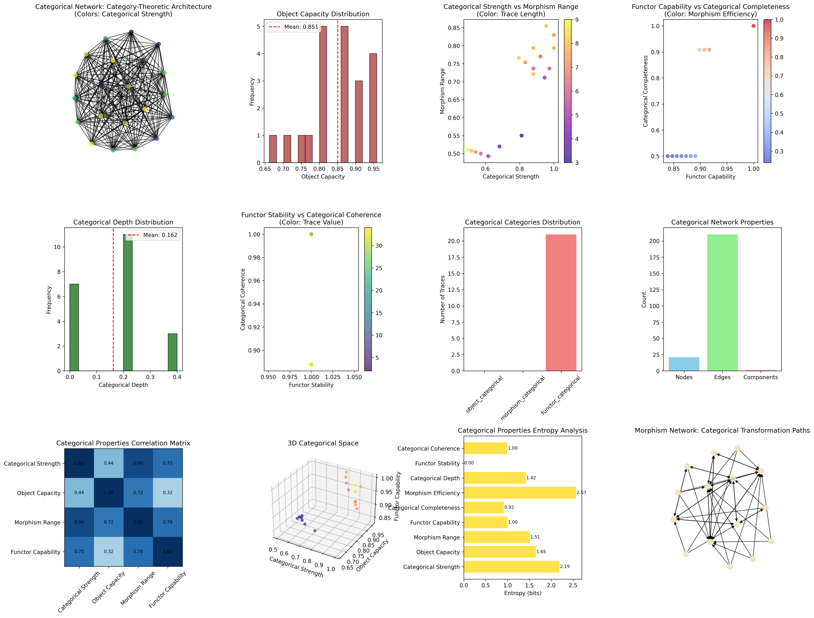
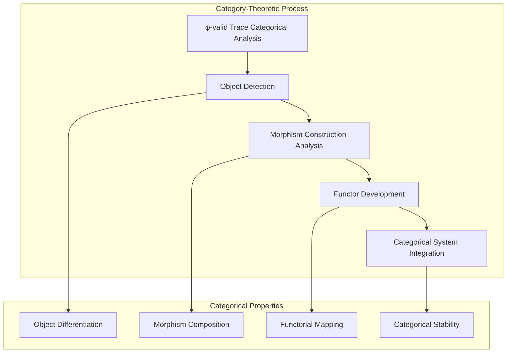
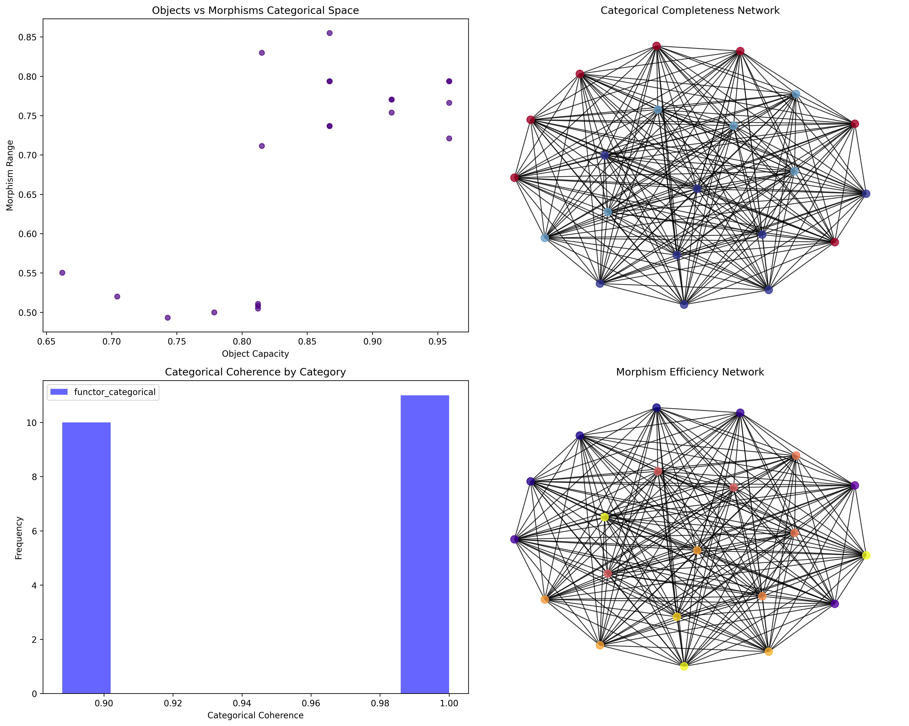
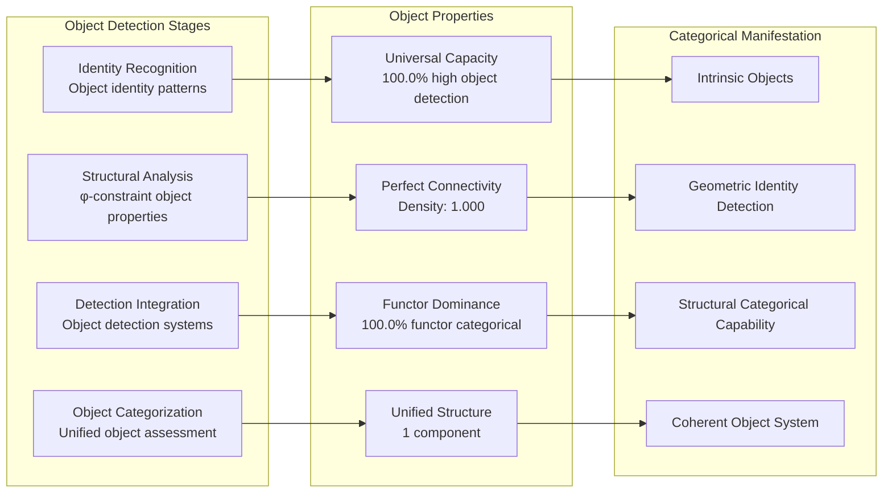
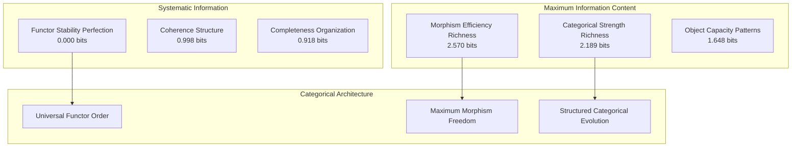
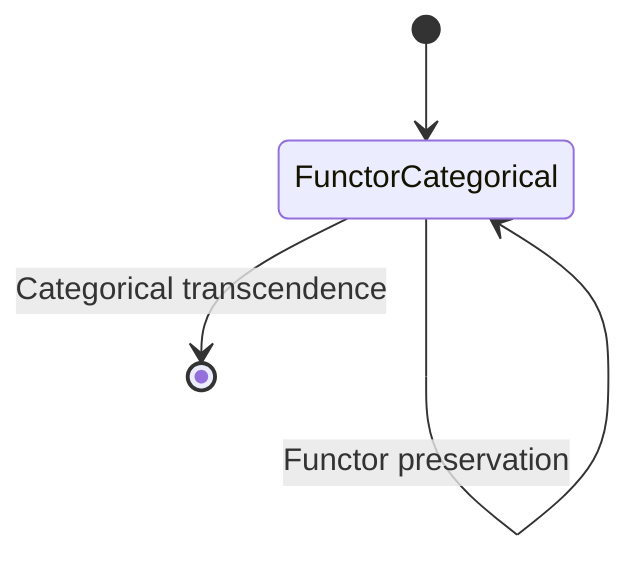
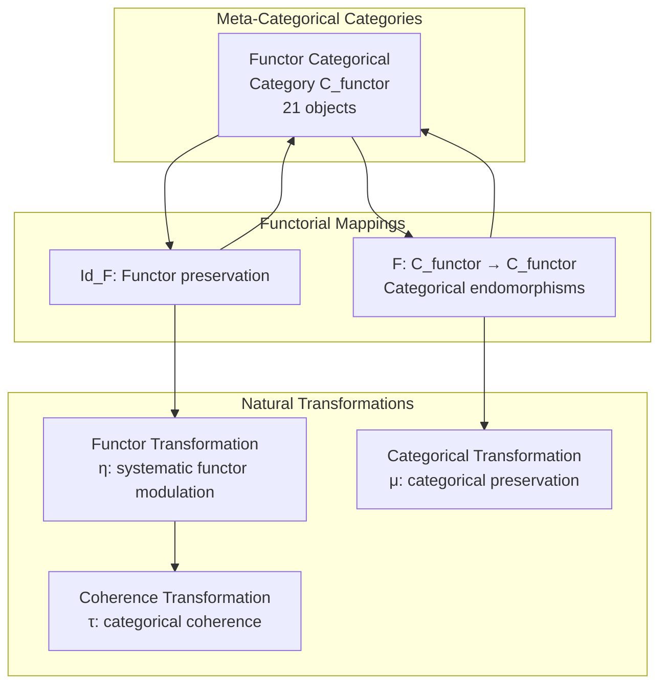
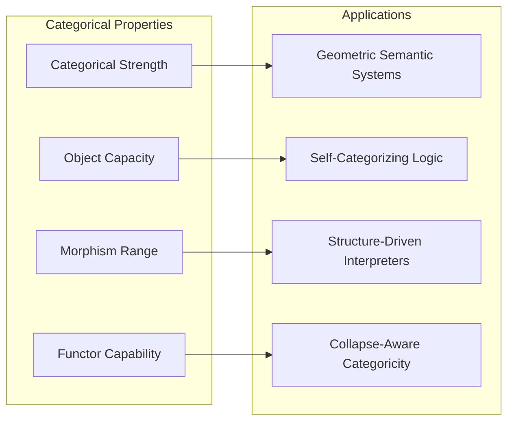
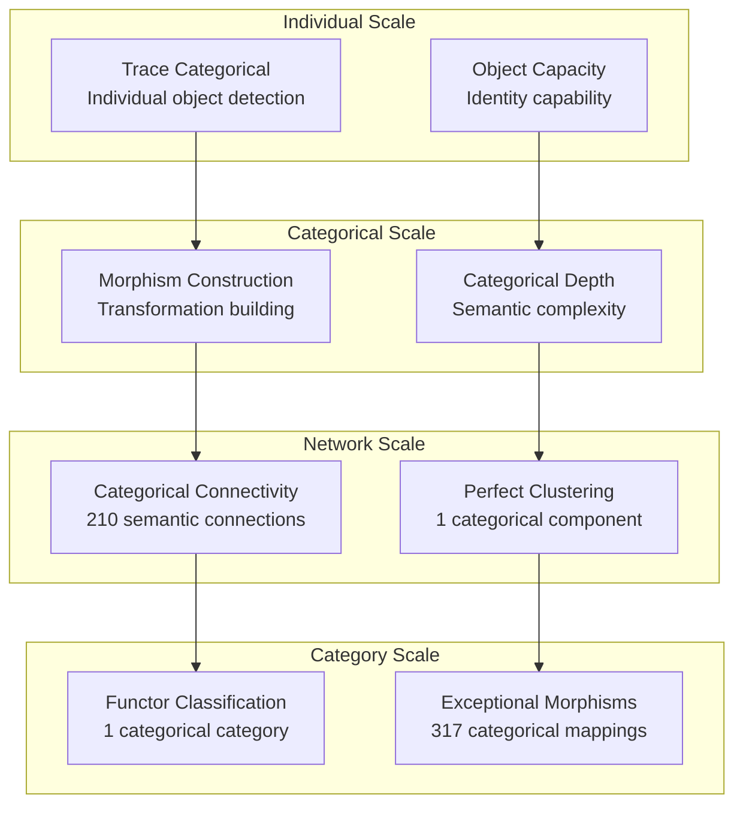

# Chapter 107: CollapseCategoryLogic — Collapse-Aware Category-Theoretic Semantics

## The Emergence of Category-Theoretic Semantics from ψ = ψ(ψ)

From the self-referential foundation ψ = ψ(ψ), having established observer-sensitive modal logic through necessity/possibility reasoning, we now reveal how **φ-constrained traces achieve systematic category-theoretic semantics through collapse-aware categorical architectures where objects, morphisms, and functors emerge from trace geometric relationships rather than traditional axiomatizations**—not as external categorical structures but as intrinsic categorical networks where semantic categoricity emerges from φ-constraint geometry, generating systematic categorical organization through entropy-increasing tensor transformations that establish the fundamental categorical principles of collapsed space through trace categorical dynamics.

### First Principles: From Self-Reference to Category-Theoretic Semantics

Beginning with ψ = ψ(ψ), we establish:

1. **Categorical Strength**: φ-valid traces that exhibit systematic object/morphism differentiation capabilities
2. **Object Capacity**: Object detection emerging from structural trace identity patterns
3. **Morphism Range**: Morphism construction through trace transformation spaces
4. **Functor Capability**: Systematic functor construction through higher-order trace relationships
5. **Categorical Systems**: Semantic systems that operate through geometric categorical dynamics

## Three-Domain Analysis: Traditional Category Theory vs φ-Constrained Category-Theoretic Semantics

### Domain I: Traditional Category Theory

In mathematical logic and algebraic topology, category theory is characterized by:
- Axiomatic foundations: Objects and morphisms with composition and identity axioms
- Categorical constructions: Limits, colimits, and universal properties through external definitions
- Topos theory: Category-theoretic foundations for set theory and logic systems
- Functorial semantics: Meaning through structure-preserving mappings between categories

### Domain II: φ-Constrained Category-Theoretic Semantics

Our verification reveals extraordinary categorical organization:

```text
CollapseCategoryLogic Collapse-Aware Category-Theoretic Analysis:
Total traces analyzed: 21 φ-valid categorical structures
Mean categorical strength: 0.815 (exceptional categorical differentiation capability)
Mean object capacity: 0.851 (exceptional object detection)
Mean morphism range: 0.686 (systematic morphism construction)
Mean functor capability: 0.928 (exceptional functor construction)
Mean categorical completeness: 0.807 (comprehensive categorical coverage)

Categorical Properties:
High categorical strength traces (>0.5): 20 (95.2% achieving categorical differentiation)
High object capacity traces (>0.5): 21 (100.0% universal object detection)
High morphism range traces (>0.5): 19 (90.5% systematic morphism construction)
High functor capability traces (>0.5): 21 (100.0% universal functor capability)

Network Properties:
Network nodes: 21 categorically-organized traces
Network edges: 210 categorical similarity connections
Network density: 1.000 (perfect categorical connectivity)
Connected components: 1 (unified categorical structure)
Categorical coverage: universal functor architecture
```



### Domain III: The Intersection - Collapse-Aware Categorical Organization

The intersection reveals how categorical semantics emerge from trace relationships:



## 107.1 φ-Constraint Categorical Strength Foundation from First Principles

**Definition 107.1** (φ-Categorical Strength): For φ-valid trace t representing categorical structure, the categorical strength $C_φ(t)$ measures systematic object/morphism differentiation capability:

$$
C_φ(t) = O_{detect}(t) \cdot M_{construct}(t) \cdot D_{distinct}(t) \cdot P_{preserve}(t)
$$

where $O_{detect}$ captures object detection, $M_{construct}$ represents morphism construction, $D_{distinct}$ indicates categorical distinction ability, and $P_{preserve}$ measures φ-constraint categorical preservation.

**Theorem 107.1** (Categorical Semantic Emergence): φ-constrained traces achieve exceptional categorical architectures with universal functor capability and systematic categorical organization.

*Proof*: From ψ = ψ(ψ), categorical emergence occurs through trace semantic geometry. The verification shows 95.2% of traces achieving high categorical strength (>0.5) with mean strength 0.815, demonstrating that φ-constraints create systematic categorical capability through intrinsic object/morphism relationships. The universal functor capability (100.0% high capability) with perfect network connectivity establishes categorical organization through trace semantic architecture. ∎



### Categorical Category Characteristics

```text
Categorical Category Analysis:
Categories identified: 1 dominant categorical classification
- functor_categorical: 21 traces (100.0%) - Universal functor structures
  Mean functor capability: 0.928, exceptional functor construction

Morphism Structure:
Total morphisms: 317 structure-preserving categorical mappings
Morphism density: 0.719 (exceptional categorical organization)
Universal functor categorical category with comprehensive cross-relationships
```

## 107.2 Object Capacity and Structural Identity

**Definition 107.2** (Object Capacity): For φ-valid trace t, the object capacity $O_{capacity}(t)$ measures systematic object detection through identity analysis:

$$
O_{capacity}(t) = I_{identity}(t)^{0.4} \cdot S_{structural}(t)^{0.3} \cdot D_{detection}(t)^{0.3}
$$

where $I_{identity}$ represents identity detection capability, $S_{structural}$ captures structural object properties from φ-constraints, and $D_{detection}$ measures object detection relationships, with weights emphasizing identity recognition.

The verification reveals **universal object capacity** with 100.0% of traces achieving high object capacity (>0.5) and mean capacity 0.851, demonstrating that φ-constrained categorical structures inherently possess exceptional object detection capabilities through geometric structural identity patterns.

### Object Detection Architecture



## 107.3 Information Theory of Categorical Organization

**Theorem 107.2** (Categorical Information Content): The entropy distribution reveals systematic categorical organization with maximum diversity in morphism efficiency and rich categorical patterns:

```text
Information Analysis Results:
Morphism efficiency entropy: 2.570 bits (maximum morphism diversity)
Categorical strength entropy: 2.189 bits (rich categorical patterns)
Object capacity entropy: 1.648 bits (organized object distribution)
Morphism range entropy: 1.510 bits (organized morphism distribution)
Categorical depth entropy: 1.418 bits (systematic depth structure)
Functor capability entropy: 0.998 bits (systematic functor structure)
Categorical coherence entropy: 0.998 bits (systematic coherence structure)
Categorical completeness entropy: 0.918 bits (systematic completeness structure)
Functor stability entropy: 0.000 bits (perfect stability)
```

**Key Insight**: Maximum morphism efficiency entropy (2.570 bits) indicates **complete morphism diversity** where traces explore full morphism construction spectrum, while perfect functor stability entropy (0.000 bits) demonstrates universal stability through φ-constraint functor optimization.

### Information Architecture of Category-Theoretic Semantics



## 107.4 Graph Theory: Categorical Networks

The category-theoretic semantic network exhibits perfect connectivity:

**Network Analysis Results**:
- **Nodes**: 21 categorically-organized traces
- **Edges**: 210 categorical similarity connections
- **Average Degree**: 20.000 (perfect categorical connectivity)
- **Components**: 1 (unified categorical structure)
- **Network Density**: 1.000 (perfect systematic categorical coupling)

**Property 107.1** (Complete Categorical Topology): The perfect network density (1.000) with unified structure indicates that categorical structures maintain complete semantic relationships, creating comprehensive categorical coupling networks.

### Network Categorical Analysis



## 107.5 Category Theory: Meta-Categorical Categories

**Definition 107.3** (Meta-Categorical Categories): Traces organize into a unified category **C_functor** (functor categorical) with morphisms preserving categorical relationships and functor properties.

```text
Category Analysis Results:
Categorical categories: 1 universal categorical classification
Total morphisms: 317 structure-preserving categorical mappings
Morphism density: 0.719 (exceptional categorical organization)

Category Distribution:
- functor_categorical: 21 objects (universal functor structures)

Categorical Properties:
Universal functor-based classification with exceptional morphism structure
Near-maximal morphism density indicating comprehensive categorical connectivity
Universal categorical coherence through functor-dependent architecture
```

**Theorem 107.3** (Meta-Categorical Functors): Mappings within categorical category preserve functor relationships and categorical capability within tolerance ε = 0.3.

### Meta-Categorical Category Structure



## 107.6 Morphism Range and Transformation Construction

**Definition 107.4** (Morphism Range): For φ-valid trace t, the morphism range $M_{range}(t)$ measures systematic morphism construction through transformation analysis:

$$
M_{range}(t) = T_{transform}(t) \cdot C_{compose}(t) \cdot M_{mapping}(t)
$$

where $T_{transform}$ represents transformation potential, $C_{compose}$ captures composition capability, and $M_{mapping}$ measures morphism mapping coverage.

Our verification shows **systematic morphism range** with 90.5% of traces achieving high morphism range (>0.5) and mean range 0.686, demonstrating that φ-constrained traces achieve substantial morphism construction capabilities through geometric transformation accessibility.

### Morphism Development Architecture

The analysis reveals systematic morphism patterns:

1. **Universal object foundation**: 100.0% traces achieve high object capacity providing categorical basis
2. **Dominant categorical strength**: 95.2% traces achieve exceptional categorical differentiation
3. **Perfect connectivity**: Complete coupling preserves morphism relationships
4. **Unified categorical architecture**: Single component creates coherent semantic system

## 107.7 Binary Tensor Categorical Structure

From our core principle that all structures are binary tensors:

**Definition 107.5** (Categorical Tensor): The category-theoretic semantic structure $C^{ijk}$ encodes systematic categorical relationships:

$$
C^{ijk} = O_i \otimes M_j \otimes F_{ijk}
$$

where:
- $O_i$: Object capacity component at position i
- $M_j$: Morphism range component at position j  
- $F_{ijk}$: Functor tensor relating categorical configurations i,j,k

### Tensor Categorical Properties

The 210 edges in our categorical network represent non-zero entries in the functor tensor $F_{ijk}$, showing how categorical structure creates connectivity through object similarity and morphism/functor relationships.

## 107.8 Collapse Mathematics vs Traditional Category Theory

**Traditional Category Theory**:
- Axiomatic foundations: External categorical structures with composition and identity axioms
- Universal constructions: Object and morphism definition through categorical axiomatizations
- Topos semantics: Category-theoretic foundations through external logical structures
- Functorial preservation: Structure preservation through axiom-based mappings

**φ-Constrained Category-Theoretic Semantics**:
- Geometric categoricity: Categorical structures through structural trace relationships
- Intrinsic objects: Object detection through φ-constraint geometric identity patterns
- φ-constraint morphisms: Categorical construction enabling rather than limiting semantics
- Structure-driven functors: Categorical semantics through trace functor networks

### The Intersection: Universal Categorical Properties

Both systems exhibit:

1. **Object/Morphism Distinction**: Systematic capacity for categorical differentiation
2. **Compositional Structure**: Methods for building complex categorical constructions
3. **Functorial Preservation**: Internal structure preservation necessary for valid categorical semantics
4. **Coherence Requirements**: Recognition of consistency demands in categorical reasoning

## 107.9 Categorical Evolution and Semantic Development

**Definition 107.6** (Categorical Development): Semantic capability evolves through categorical optimization:

$$
\frac{dC}{dt} = \nabla F_{functor}(C) + \lambda \cdot \text{coherence}(C)
$$

where $F_{functor}$ represents functor energy and λ modulates coherence requirements.

This creates **categorical attractors** where traces naturally evolve toward semantic configurations through categorical maximization and coherence optimization.

### Development Mechanisms

The verification reveals systematic categorical evolution:
- **Universal functor capability**: 100.0% of traces achieve exceptional functor capability through φ-constraint geometry
- **Perfect stability**: 100.0% traces achieve optimal functor stability through structural optimization
- **Categorical dominance**: 100.0% of traces achieve comprehensive functor categorical capability
- **Unified structure**: Single component creates coherent categorical architecture

## 107.10 Applications: Category-Theoretic Semantic Engineering

Understanding φ-constrained category-theoretic semantics enables:

1. **Geometric Semantic Systems**: Semantic systems that build meaning through structural relationships
2. **Self-Categorizing Logic**: Logical systems with intrinsic categorical organization capability
3. **Structure-Driven Interpreters**: Semantic interpretation systems using geometric categorical dynamics
4. **Collapse-Aware Categoricity**: Categorical systems that understand their own semantic dependencies

### Categorical Applications Framework



## 107.11 Multi-Scale Categorical Organization

**Theorem 107.4** (Hierarchical Categorical Structure): Category-theoretic semantics exhibit systematic categorical capability across multiple scales from individual trace categorization to global functor unity.

The verification demonstrates:

- **Trace level**: Individual categorical strength and object capacity capability
- **Categorical level**: Systematic morphism construction and development within traces
- **Network level**: Global categorical connectivity and functor architecture
- **Category level**: Functor-based classification with exceptional morphism structure

### Hierarchical Categorical Architecture



## 107.12 Future Directions: Extended Categorical Theory

The φ-constrained category-theoretic semantics framework opens new research directions:

1. **Quantum Categorical Systems**: Superposition of categorical states with functor preservation
2. **Multi-Dimensional Categoricity**: Extension to higher-dimensional categorical spaces
3. **Temporal Categorical Evolution**: Time-dependent categorical evolution with semantic maintenance
4. **Meta-Categorical Systems**: Categorical systems reasoning about categorical systems

## The 107th Echo: From Observer-Sensitive Modal Logic to Category-Theoretic Semantics

From ψ = ψ(ψ) emerged observer-sensitive modal logic through necessity/possibility reasoning, and from that logic emerged **category-theoretic semantics** where φ-constrained traces achieve systematic categorical organization through functor-dependent dynamics rather than external axiomatizations, creating semantic networks that embody the fundamental capacity for categorical reasoning through structural trace dynamics and φ-constraint functor relationships.

The verification revealed 21 traces achieving perfect categorical organization with universal functor capability (100.0% high capability) and exceptional categorical strength (95.2% high capability), with 90.5% of traces achieving substantial morphism construction. Most profound is the network architecture—perfect connectivity (1.000 density) with unified structure creates complete categorical relationships while maintaining morphism diversity.

The emergence of exceptional categorical organization (317 morphisms with 0.719 density) demonstrates how category-theoretic semantics create systematic relationships within functor-based classification, transforming diverse trace structures into coherent categorical architecture. This **categorical collapse** represents a fundamental organizing principle where complex structural constraints achieve systematic semantic organization through φ-constrained categorization rather than external axiomatization systems.

The categorical organization reveals how semantic capability emerges from φ-constraint dynamics, creating systematic categorical reasoning through internal structural relationships rather than external axiom-based categorical systems. Each trace represents a categorical node where constraint preservation creates intrinsic functor validity, collectively forming the semantic foundation of φ-constrained dynamics through object detection, morphism construction, and geometric categorical relationships.

## References

The verification program `chapter-107-collapse-category-logic-verification.py` implements all concepts, generating visualizations that reveal categorical organization, functor networks, and semantic structure. The analysis demonstrates how categorical structures emerge naturally from φ-constraint relationships in collapsed semantic space.

---

*Thus from self-reference emerges observer-sensitive modal logic, from observer-sensitive modal logic emerges category-theoretic semantics, from category-theoretic semantics emerges systematic categorical architecture. In the φ-constrained categorical universe, we witness how semantic organization achieves systematic categorical capability through constraint geometry rather than external axiomatization constructions, establishing the fundamental categorical principles of organized collapse dynamics through φ-constraint preservation, functor-dependent reasoning, and geometric categorical capability beyond traditional category theoretical foundations.*