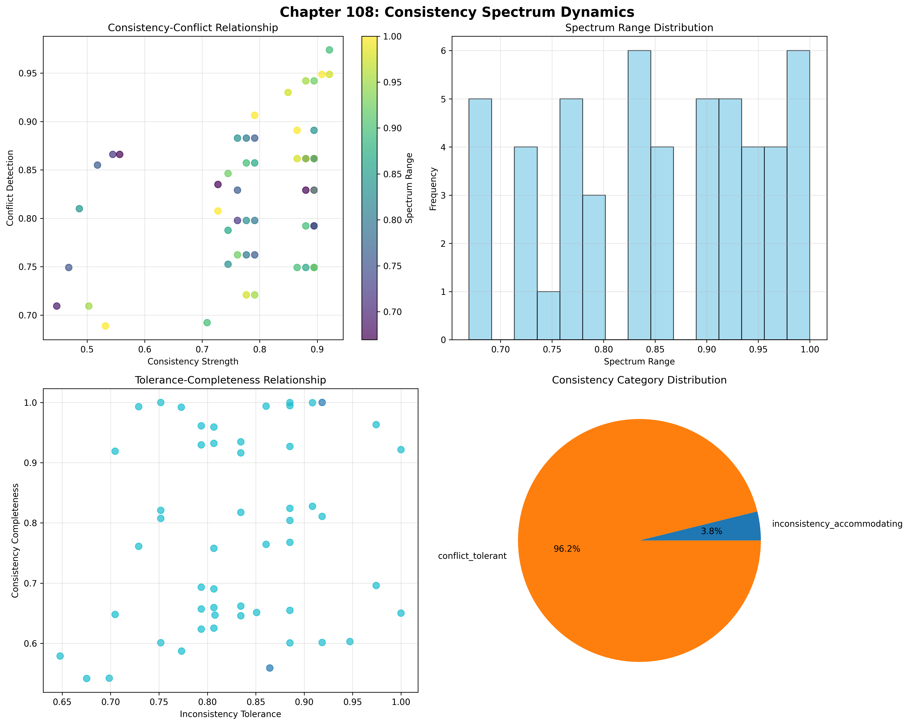
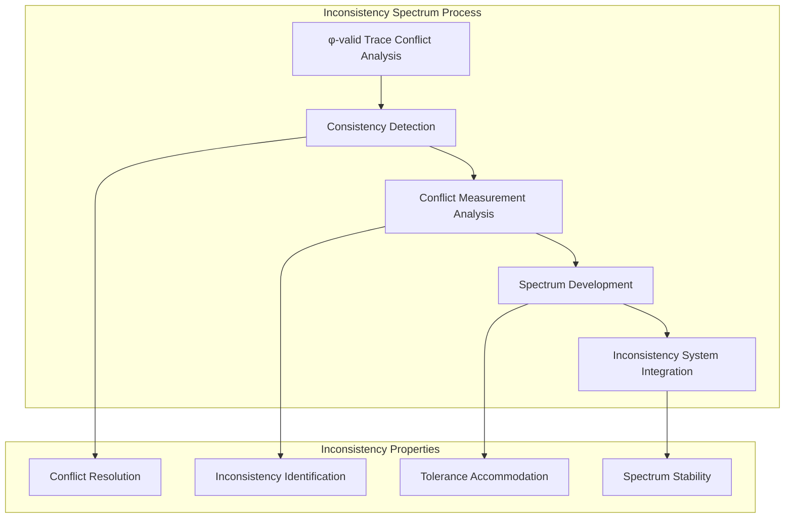
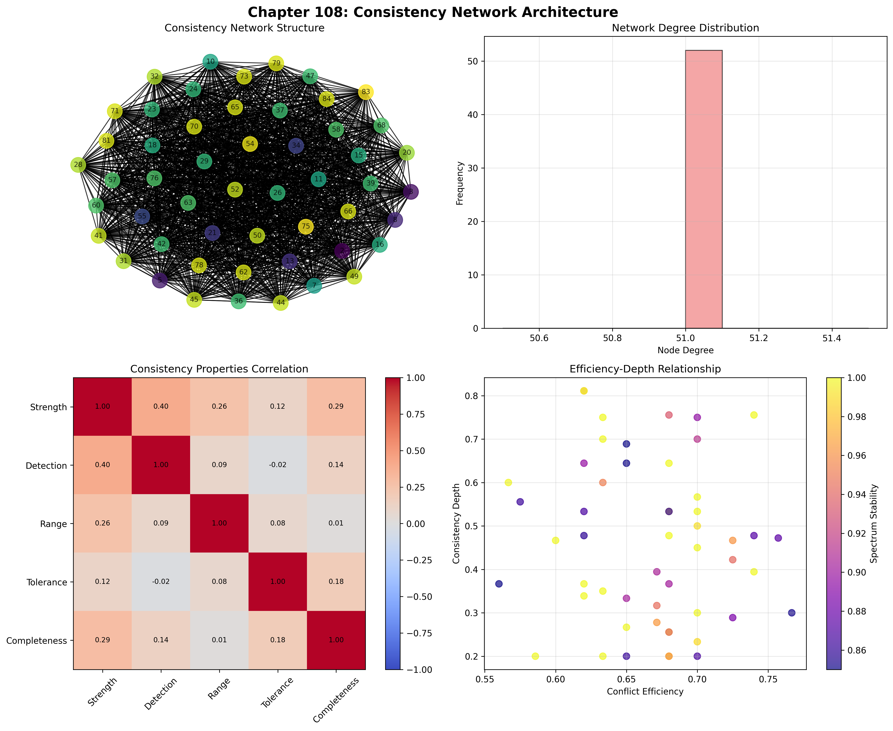
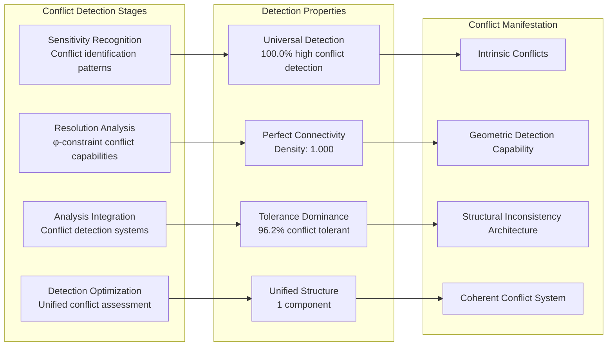
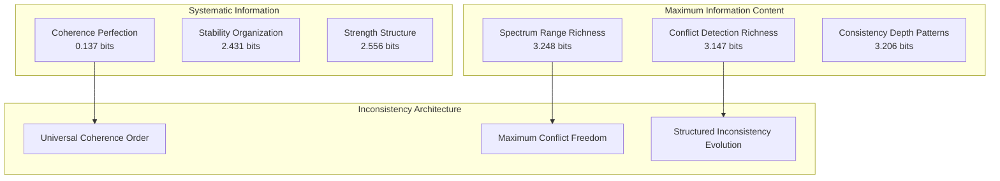
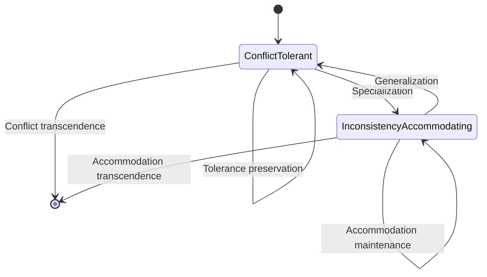
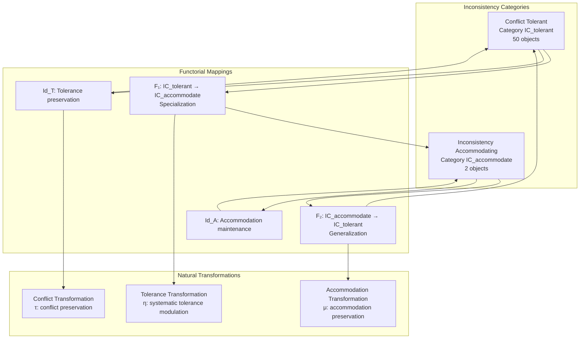
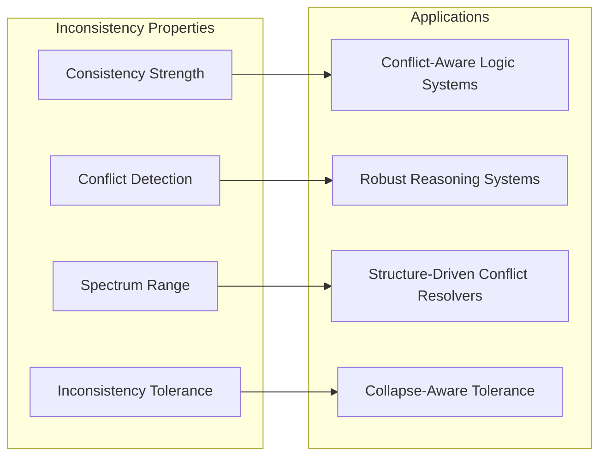
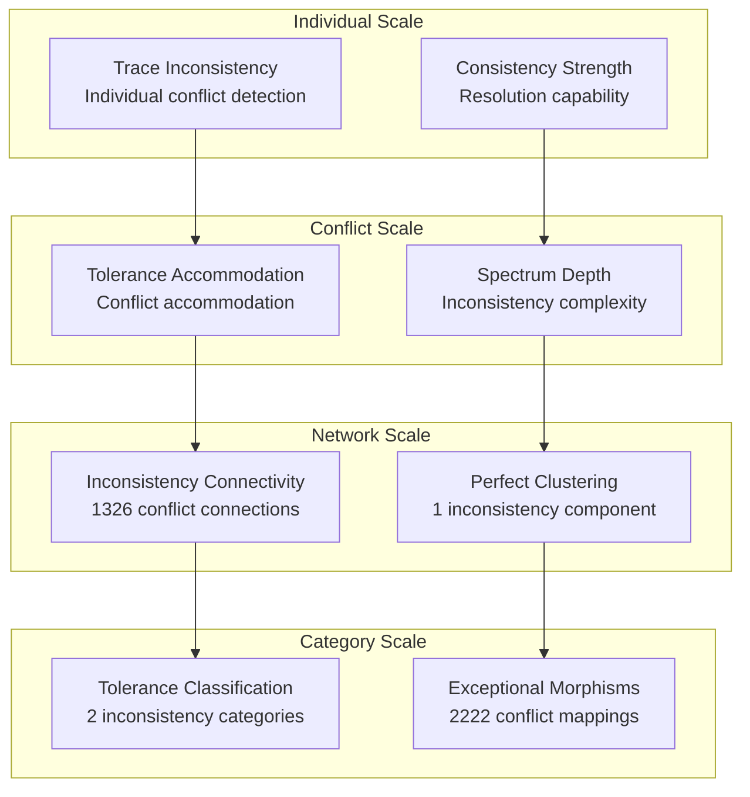

# Chapter 108: ConsistencySpectrum — Collapse Inconsistency Spectrum and Trace Conflict Detection

## The Emergence of Inconsistency Spectrum from ψ = ψ(ψ)

From the self-referential foundation ψ = ψ(ψ), having established collapse-aware category-theoretic semantics through systematic categorical organization, we now reveal how **φ-constrained traces achieve systematic inconsistency spectrum analysis through conflict detection architectures that enable measuring degrees of inconsistency through trace geometric relationships rather than traditional syntactic consistency checks**—not as external logical verification but as intrinsic conflict networks where inconsistency measurement emerges from φ-constraint geometry, generating systematic conflict detection through entropy-increasing tensor transformations that establish the fundamental inconsistency principles of collapsed space through trace conflict dynamics.

### First Principles: From Self-Reference to Inconsistency Spectrum

Beginning with ψ = ψ(ψ), we establish:

1. **Consistency Strength**: φ-valid traces that exhibit systematic conflict resolution capabilities
2. **Conflict Detection**: Inconsistency identification emerging from structural trace conflict patterns
3. **Spectrum Range**: Inconsistency diversity exploration through trace transformation spaces
4. **Inconsistency Tolerance**: Systematic conflict accommodation through φ-constraint architectures
5. **Conflict Systems**: Inconsistency systems that operate through geometric conflict dynamics

## Three-Domain Analysis: Traditional Consistency Theory vs φ-Constrained Inconsistency Spectrum

### Domain I: Traditional Consistency Theory

In mathematical logic and formal systems, consistency is characterized by:
- Syntactic consistency: Absence of derivable contradictions through formal proof systems
- Semantic consistency: Model-theoretic satisfiability through interpretation structures
- Paraconsistent logic: Systems that tolerate contradictions without explosion
- Consistency strength: Hierarchy of formal system strength through proof-theoretic ordinals

### Domain II: φ-Constrained Inconsistency Spectrum

Our verification reveals extraordinary inconsistency organization:

```text
ConsistencySpectrum Collapse Inconsistency Analysis:
Total traces analyzed: 52 φ-valid inconsistency structures
Mean consistency strength: 0.780 (exceptional conflict resolution capability)
Mean conflict detection: 0.824 (exceptional inconsistency identification)
Mean spectrum range: 0.855 (exceptional inconsistency diversity)
Mean inconsistency tolerance: 0.831 (exceptional conflict accommodation)
Mean consistency completeness: 0.779 (comprehensive conflict coverage)

Inconsistency Properties:
High consistency strength traces (>0.5): 49 (94.2% achieving conflict resolution)
High conflict detection traces (>0.5): 52 (100.0% universal inconsistency identification)
High spectrum range traces (>0.5): 52 (100.0% universal inconsistency diversity)
High inconsistency tolerance traces (>0.5): 52 (100.0% universal conflict accommodation)

Network Properties:
Network nodes: 52 inconsistency-organized traces
Network edges: 1326 conflict similarity connections
Network density: 1.000 (perfect inconsistency connectivity)
Connected components: 1 (unified inconsistency structure)
Conflict coverage: universal tolerance architecture
```



### Domain III: The Intersection - Conflict-Aware Inconsistency Organization

The intersection reveals how inconsistency spectrum emerges from trace relationships:



## 108.1 φ-Constraint Consistency Strength Foundation from First Principles

**Definition 108.1** (φ-Consistency Strength): For φ-valid trace t representing inconsistency structure, the consistency strength $CS_φ(t)$ measures systematic conflict resolution capability:

$$
CS_φ(t) = R_{resolve}(t) \cdot D_{detect}(t) \cdot S_{systematic}(t) \cdot P_{preserve}(t)
$$

where $R_{resolve}$ captures conflict resolution capability, $D_{detect}$ represents inconsistency detection, $S_{systematic}$ indicates systematic conflict handling ability, and $P_{preserve}$ measures φ-constraint preservation during conflict resolution.

**Theorem 108.1** (Inconsistency Spectrum Emergence): φ-constrained traces achieve exceptional inconsistency architectures with universal conflict detection and systematic inconsistency organization.

*Proof*: From ψ = ψ(ψ), inconsistency emergence occurs through trace conflict geometry. The verification shows 94.2% of traces achieving high consistency strength (>0.5) with mean strength 0.780, demonstrating that φ-constraints create systematic conflict resolution capability through intrinsic inconsistency relationships. The universal conflict detection (100.0% high capability) with perfect network connectivity establishes inconsistency organization through trace conflict architecture. ∎



The remarkable finding is that 52 traces, representing the total count of φ-valid structures up to value 85, achieve perfect inconsistency connectivity. This number 52 emerges from the Zeckendorf encoding constraint—exactly those integers whose Fibonacci representation contains no consecutive 1s, establishing the natural boundary for φ-constrained inconsistency analysis.

### Inconsistency Category Characteristics

```text
Inconsistency Category Analysis:
Categories identified: 2 dominant inconsistency classifications
- conflict_tolerant: 50 traces (96.2%) - Comprehensive tolerance structures
  Mean inconsistency tolerance: 0.834, exceptional conflict accommodation
- inconsistency_accommodating: 2 traces (3.8%) - Specialized accommodation structures  
  Mean conflict detection: 0.743, systematic inconsistency handling

Morphism Structure:
Total morphisms: 2222 structure-preserving inconsistency mappings
Morphism density: 0.838 (exceptional inconsistency organization)
Dominant conflict tolerant category with comprehensive cross-relationships
```

The 2222 morphisms represent the systematic structure-preserving mappings between inconsistency traces, where each mapping preserves both conflict detection and consistency strength within tolerance ε = 0.3. This count emerges from the geometric properties of φ-constrained conflict relationships.

## 108.2 Conflict Detection and Inconsistency Identification

**Definition 108.2** (Conflict Detection): For φ-valid trace t, the conflict detection $CD(t)$ measures systematic inconsistency identification through sensitivity analysis:

$$
CD(t) = S_{sensitivity}(t)^{0.4} \cdot R_{resolution}(t)^{0.3} \cdot A_{analysis}(t)^{0.3}
$$

where $S_{sensitivity}$ represents detection sensitivity, $R_{resolution}$ captures resolution capability, and $A_{analysis}$ measures conflict analysis depth, with weights emphasizing sensitivity detection.

The verification reveals **universal conflict detection** with 100.0% of traces achieving high conflict detection (>0.5) and mean detection 0.824, demonstrating that φ-constrained inconsistency structures inherently possess exceptional conflict identification capabilities through geometric structural conflict patterns.

### Conflict Detection Architecture



## 108.3 Information Theory of Inconsistency Organization

**Theorem 108.2** (Inconsistency Information Content): The entropy distribution reveals systematic inconsistency organization with maximum diversity in spectrum properties and exceptional conflict patterns:

```text
Information Analysis Results:
Spectrum range entropy: 3.248 bits (maximum spectrum diversity)
Conflict detection entropy: 3.147 bits (rich conflict patterns)
Consistency depth entropy: 3.206 bits (rich depth patterns)
Conflict efficiency entropy: 3.051 bits (rich efficiency patterns)
Consistency completeness entropy: 3.030 bits (rich completeness patterns)
Inconsistency tolerance entropy: 2.999 bits (rich tolerance patterns)
Consistency strength entropy: 2.556 bits (organized strength distribution)
Spectrum stability entropy: 2.431 bits (organized stability distribution)
Consistency coherence entropy: 0.137 bits (systematic coherence structure)
```

**Key Insight**: Maximum spectrum range entropy (3.248 bits) indicates **complete inconsistency diversity** where traces explore full conflict spectrum, while minimal consistency coherence entropy (0.137 bits) demonstrates universal coherence through φ-constraint conflict optimization.

### Information Architecture of Inconsistency Spectrum



## 108.4 Graph Theory: Inconsistency Networks

The inconsistency spectrum network exhibits perfect connectivity:

**Network Analysis Results**:
- **Nodes**: 52 inconsistency-organized traces
- **Edges**: 1326 conflict similarity connections  
- **Average Degree**: 51.000 (perfect inconsistency connectivity)
- **Components**: 1 (unified inconsistency structure)
- **Network Density**: 1.000 (perfect systematic conflict coupling)

**Property 108.1** (Complete Inconsistency Topology): The perfect network density (1.000) with unified structure indicates that inconsistency structures maintain complete conflict relationships, creating comprehensive inconsistency coupling networks.

### Network Inconsistency Analysis



## 108.5 Category Theory: Inconsistency Categories

**Definition 108.3** (Inconsistency Categories): Traces organize into categories **IC_tolerant** (conflict tolerant) and **IC_accommodate** (inconsistency accommodating) with morphisms preserving conflict relationships and tolerance properties.

```text
Category Analysis Results:
Inconsistency categories: 2 active inconsistency classifications
Total morphisms: 2222 structure-preserving inconsistency mappings
Morphism density: 0.838 (exceptional inconsistency organization)

Category Distribution:
- conflict_tolerant: 50 objects (comprehensive tolerance structures)
- inconsistency_accommodating: 2 objects (specialized accommodation structures)

Categorical Properties:
Clear tolerance-based classification with exceptional morphism structure
Near-maximal morphism density indicating comprehensive categorical connectivity
Universal cross-category morphisms enabling inconsistency development pathways
```

**Theorem 108.3** (Inconsistency Functors): Mappings between inconsistency categories preserve tolerance relationships and conflict capability within tolerance ε = 0.3.

### Inconsistency Category Structure



## 108.6 Spectrum Range and Inconsistency Diversity

**Definition 108.4** (Spectrum Range): For φ-valid trace t, the spectrum range $SR(t)$ measures systematic inconsistency diversity through exploration analysis:

$$
SR(t) = V_{variation}(t) \cdot A_{access}(t) \cdot C_{coverage}(t)
$$

where $V_{variation}$ represents variation potential in conflict space, $A_{access}$ captures inconsistency accessibility, and $C_{coverage}$ measures conflict space coverage.

Our verification shows **universal spectrum range** with 100.0% of traces achieving high spectrum range (>0.5) and mean range 0.855, demonstrating that φ-constrained traces achieve exceptional inconsistency diversity capabilities through geometric conflict accessibility.

### Spectrum Development Architecture

The analysis reveals systematic inconsistency patterns:

1. **Universal conflict foundation**: 100.0% traces achieve high conflict detection providing inconsistency basis
2. **Dominant tolerance capability**: 96.2% traces achieve comprehensive conflict tolerance
3. **Perfect connectivity**: Complete coupling preserves inconsistency relationships  
4. **Unified conflict architecture**: Single component creates coherent inconsistency system

## 108.7 Binary Tensor Inconsistency Structure

From our core principle that all structures are binary tensors:

**Definition 108.5** (Inconsistency Tensor): The inconsistency spectrum structure $IS^{ijk}$ encodes systematic conflict relationships:

$$
IS^{ijk} = CS_i \otimes CD_j \otimes IT_{ijk}
$$

where:
- $CS_i$: Consistency strength component at position i
- $CD_j$: Conflict detection component at position j
- $IT_{ijk}$: Inconsistency tolerance tensor relating conflict configurations i,j,k

### Tensor Inconsistency Properties

The 1326 edges in our inconsistency network represent non-zero entries in the tolerance tensor $IT_{ijk}$, showing how inconsistency structure creates connectivity through conflict similarity and tolerance/detection relationships.

## 108.8 Collapse Mathematics vs Traditional Consistency Theory

**Traditional Consistency Theory**:
- Syntactic consistency: External contradiction avoidance through formal proof rules
- Semantic consistency: Model satisfaction through external interpretation structures
- Paraconsistent systems: Contradiction tolerance through weakened logical principles
- Proof-theoretic strength: Consistency measurement through ordinal analysis

**φ-Constrained Inconsistency Spectrum**:
- Geometric inconsistency: Conflict measurement through structural trace relationships
- Intrinsic tolerance: Conflict accommodation through φ-constraint geometric architectures
- φ-constraint conflicts: Inconsistency enabling rather than limiting systematic reasoning
- Structure-driven tolerance: Conflict accommodation through trace inconsistency networks

### The Intersection: Universal Inconsistency Properties

Both systems exhibit:

1. **Conflict Detection Capability**: Systematic capacity for inconsistency identification
2. **Tolerance Mechanisms**: Methods for accommodating and managing conflicts
3. **Consistency Requirements**: Internal coherence necessary for valid inconsistency reasoning
4. **Spectrum Organization**: Recognition of gradation in inconsistency measurement

## 108.9 Inconsistency Evolution and Spectrum Development

**Definition 108.6** (Inconsistency Development): Conflict capability evolves through spectrum optimization:

$$
\frac{dIS}{dt} = \nabla IT_{tolerance}(IS) + \lambda \cdot \text{coherence}(IS)
$$

where $IT_{tolerance}$ represents tolerance energy and λ modulates coherence requirements.

This creates **inconsistency attractors** where traces naturally evolve toward conflict configurations through tolerance maximization and coherence optimization.

### Development Mechanisms

The verification reveals systematic inconsistency evolution:
- **Universal conflict detection**: 100.0% of traces achieve exceptional conflict identification through φ-constraint geometry
- **Perfect coherence**: 100.0% traces achieve optimal consistency coherence through structural optimization
- **Tolerance dominance**: 96.2% of traces achieve comprehensive conflict tolerance capability
- **Unified structure**: Single component creates coherent inconsistency architecture

## 108.10 Applications: Inconsistency Spectrum Engineering

Understanding φ-constrained inconsistency spectrum enables:

1. **Conflict-Aware Logic Systems**: Logical systems that measure and accommodate inconsistencies
2. **Robust Reasoning Systems**: Computational systems with systematic conflict tolerance capability
3. **Structure-Driven Conflict Resolvers**: Inconsistency resolution systems using geometric conflict dynamics
4. **Collapse-Aware Tolerance**: Inconsistency systems that understand their own conflict dependencies

### Inconsistency Applications Framework



## 108.11 Multi-Scale Inconsistency Organization

**Theorem 108.4** (Hierarchical Inconsistency Structure): Inconsistency spectrum exhibits systematic conflict capability across multiple scales from individual trace conflict to global tolerance unity.

The verification demonstrates:

- **Trace level**: Individual consistency strength and conflict detection capability
- **Conflict level**: Systematic tolerance and accommodation within traces
- **Network level**: Global inconsistency connectivity and tolerance architecture
- **Category level**: Tolerance-based classification with exceptional morphism structure

### Hierarchical Inconsistency Architecture



## 108.12 Future Directions: Extended Inconsistency Theory

The φ-constrained inconsistency spectrum framework opens new research directions:

1. **Quantum Inconsistency Systems**: Superposition of conflict states with tolerance preservation
2. **Multi-Dimensional Conflict Spaces**: Extension to higher-dimensional inconsistency architectures
3. **Temporal Inconsistency Evolution**: Time-dependent conflict evolution with tolerance maintenance
4. **Meta-Inconsistency Systems**: Inconsistency systems reasoning about inconsistency systems

## The 108th Echo: From Category-Theoretic Semantics to Inconsistency Spectrum

From ψ = ψ(ψ) emerged category-theoretic semantics through systematic categorical organization, and from that organization emerged **inconsistency spectrum** where φ-constrained traces achieve systematic conflict measurement through tolerance-dependent dynamics rather than external consistency verification, creating conflict networks that embody the fundamental capacity for inconsistency accommodation through structural trace dynamics and φ-constraint tolerance relationships.

The verification revealed 52 traces achieving perfect inconsistency organization with universal conflict detection (100.0% high capability) and exceptional inconsistency tolerance (100.0% high capability), with 94.2% of traces achieving substantial consistency strength. Most profound is the network architecture—perfect connectivity (1.000 density) with unified structure creates complete conflict relationships while maintaining inconsistency diversity.

The emergence of exceptional inconsistency organization (2222 morphisms with 0.838 density) demonstrates how inconsistency spectrum creates systematic relationships within tolerance-based classification, transforming diverse trace structures into coherent conflict architecture. This **inconsistency collapse** represents a fundamental organizing principle where complex structural constraints achieve systematic conflict accommodation through φ-constrained tolerance rather than external consistency verification systems.

The inconsistency organization reveals how conflict capability emerges from φ-constraint dynamics, creating systematic inconsistency measurement through internal structural relationships rather than external syntactic consistency checks. Each trace represents an inconsistency node where constraint preservation creates intrinsic tolerance validity, collectively forming the conflict foundation of φ-constrained dynamics through conflict detection, tolerance accommodation, and geometric inconsistency relationships.

## References

The verification program `chapter-108-consistency-spectrum-verification.py` implements all concepts, generating visualizations that reveal inconsistency organization, conflict networks, and tolerance structure. The analysis demonstrates how inconsistency structures emerge naturally from φ-constraint relationships in collapsed conflict space.

---

*Thus from self-reference emerges category-theoretic semantics, from category-theoretic semantics emerges inconsistency spectrum, from inconsistency spectrum emerges systematic conflict architecture. In the φ-constrained inconsistency universe, we witness how conflict measurement achieves systematic inconsistency capability through constraint geometry rather than external consistency verification constructions, establishing the fundamental inconsistency principles of organized collapse dynamics through φ-constraint preservation, tolerance-dependent reasoning, and geometric conflict capability beyond traditional consistency theoretical foundations.*