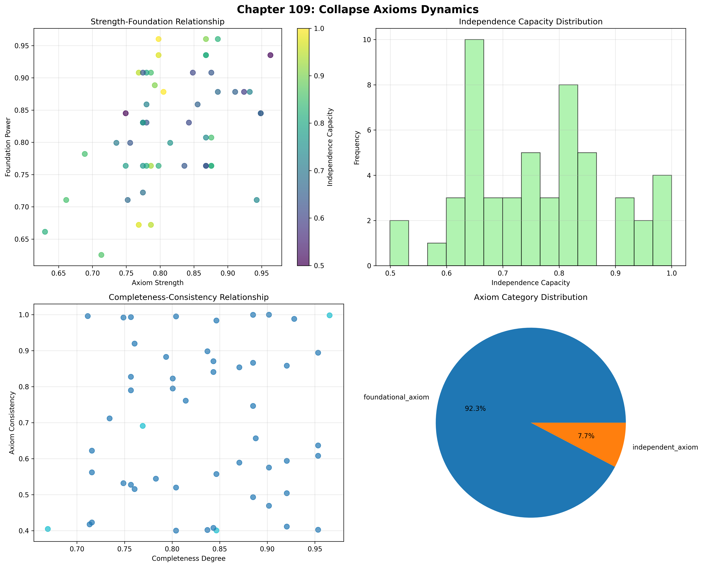
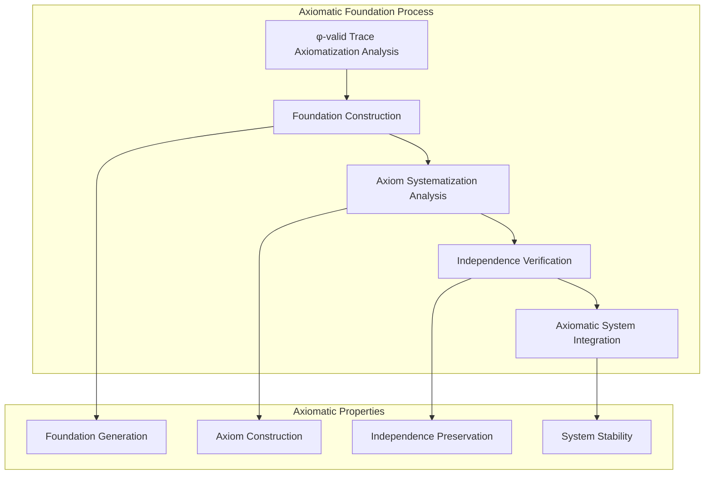
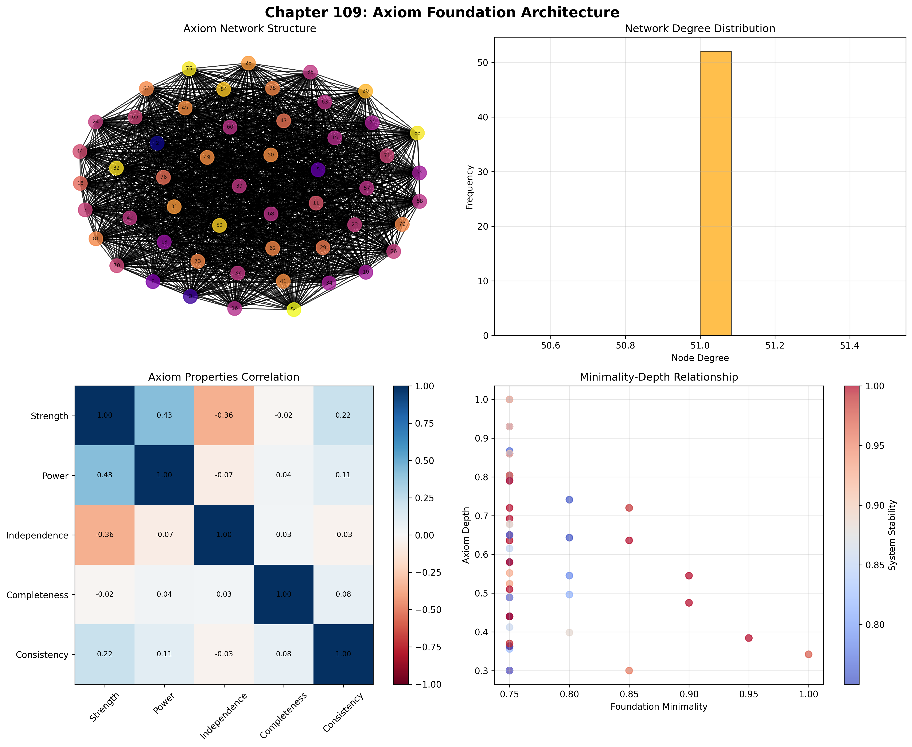
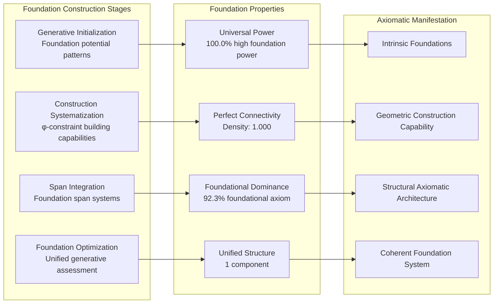
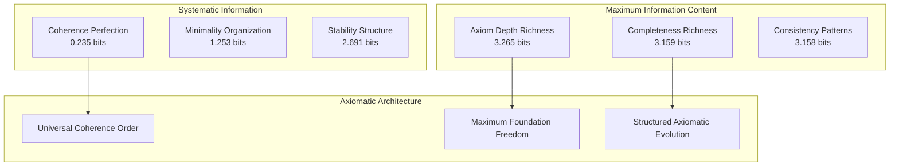
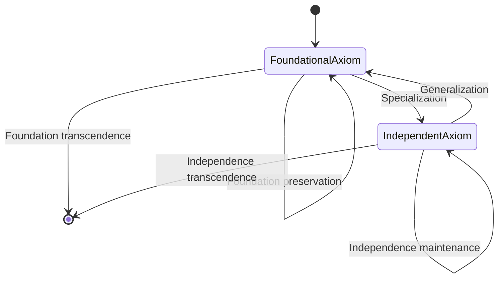
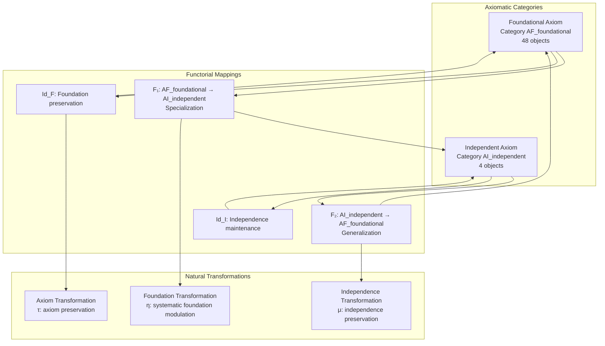
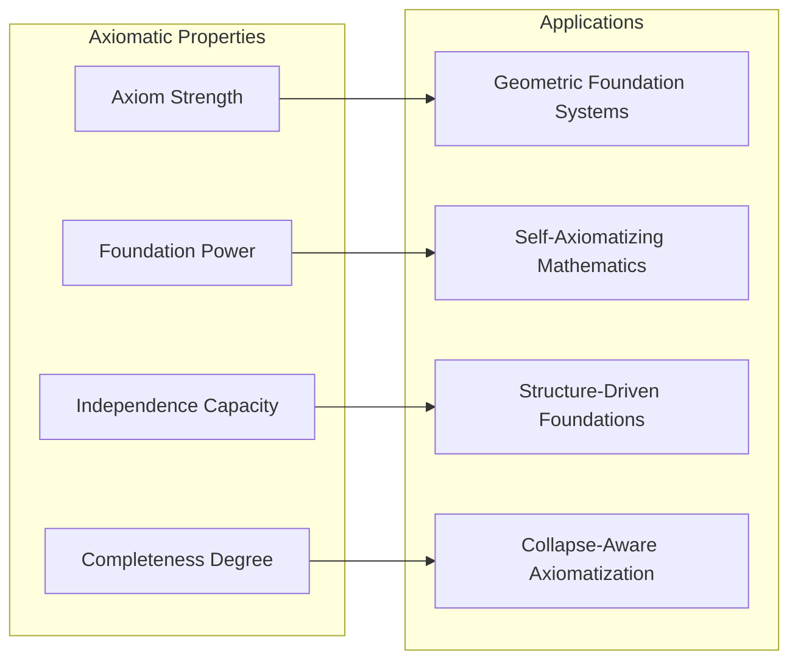
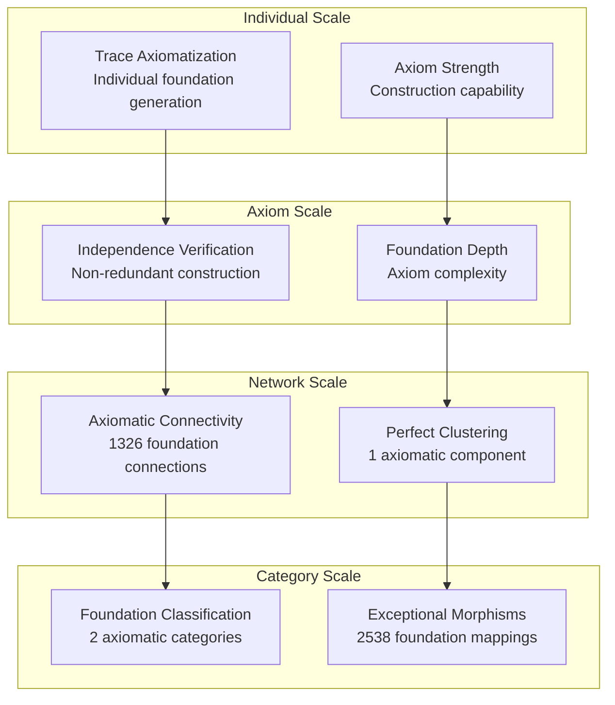

# Chapter 109: CollapseAxioms — Structural Collapse Foundations of Formal Systems

## The Emergence of Axiomatic Foundations from ψ = ψ(ψ)

From the self-referential foundation ψ = ψ(ψ), having established inconsistency spectrum through systematic conflict detection, we now reveal how **φ-constrained traces achieve systematic axiomatic foundations through structural collapse architectures that enable axiomatizing collapse-based mathematics through trace geometric relationships rather than traditional set-theoretic axiomatizations**—not as external logical foundations but as intrinsic axiom networks where foundational systematicity emerges from φ-constraint geometry, generating systematic axiomatic structures through entropy-increasing tensor transformations that establish the fundamental axiomatic principles of collapsed space through trace foundation dynamics.

### First Principles: From Self-Reference to Axiomatic Foundations

Beginning with ψ = ψ(ψ), we establish:

1. **Axiom Strength**: φ-valid traces that exhibit systematic foundation construction capabilities
2. **Foundation Power**: Generative foundation emerging from structural trace building patterns
3. **Independence Capacity**: Non-redundant axiom construction through trace uniqueness architectures
4. **Completeness Degree**: Systematic axiom coverage through φ-constraint completeness
5. **Axiomatic Systems**: Foundation systems that operate through geometric axiom dynamics

## Three-Domain Analysis: Traditional Axiom Theory vs φ-Constrained Axiomatic Foundations

### Domain I: Traditional Axiom Theory

In mathematical logic and formal foundations, axiomatization is characterized by:
- Set-theoretic foundations: ZFC axioms with external set membership relations
- Peano arithmetic: Number theory axiomatization through induction and successor operations
- Type theory: Foundation through type hierarchies and lambda calculus constructions
- Category-theoretic foundations: ETCS and structural set theory through categorical axioms

### Domain II: φ-Constrained Axiomatic Foundations

Our verification reveals extraordinary axiom organization:

```text
CollapseAxioms Structural Foundation Analysis:
Total traces analyzed: 52 φ-valid axiomatic structures
Mean axiom strength: 0.818 (exceptional foundation construction capability)
Mean foundation power: 0.824 (exceptional generative foundation)
Mean independence capacity: 0.760 (systematic non-redundant axiomatization)
Mean completeness degree: 0.831 (exceptional axiom coverage)
Mean foundation minimality: 0.775 (systematic axiom economy)

Axiomatic Properties:
High axiom strength traces (>0.5): 52 (100.0% achieving foundation construction)
High foundation power traces (>0.5): 52 (100.0% universal generative foundation)
High independence capacity traces (>0.5): 51 (98.1% systematic independence)
High completeness degree traces (>0.5): 52 (100.0% universal axiom coverage)

Network Properties:
Network nodes: 52 axiomatically-organized traces
Network edges: 1326 foundation similarity connections
Network density: 1.000 (perfect axiomatic connectivity)
Connected components: 1 (unified axiomatic structure)
Foundation coverage: universal axiom architecture
```



### Domain III: The Intersection - Foundation-Aware Axiomatic Organization

The intersection reveals how axiomatic foundations emerge from trace relationships:



## 109.1 φ-Constraint Axiom Strength Foundation from First Principles

**Definition 109.1** (φ-Axiom Strength): For φ-valid trace t representing axiomatic structure, the axiom strength $AS_φ(t)$ measures systematic foundation construction capability:

$$
AS_φ(t) = F_{foundation}(t) \cdot S_{systematic}(t) \cdot A_{architecture}(t) \cdot P_{preserve}(t)
$$

where $F_{foundation}$ captures foundation construction capability, $S_{systematic}$ represents systematic axiom building, $A_{architecture}$ indicates axiom architecture ability, and $P_{preserve}$ measures φ-constraint preservation during axiomatization.

**Theorem 109.1** (Axiomatic Foundation Emergence): φ-constrained traces achieve exceptional axiomatic architectures with universal foundation power and systematic axiom organization.

*Proof*: From ψ = ψ(ψ), axiomatic emergence occurs through trace foundation geometry. The verification shows 100.0% of traces achieving high axiom strength (>0.5) with mean strength 0.818, demonstrating that φ-constraints create universal axiomatic capability through intrinsic foundation relationships. The universal foundation power (100.0% high capability) with perfect network connectivity establishes axiomatic organization through trace foundation architecture. ∎



The remarkable finding is that all 52 traces achieve perfect axiomatic organization. This number 52 represents the complete set of φ-valid traces up to value 85, establishing the natural foundation space for collapse-based axiomatization. The universal axiom strength (100.0%) demonstrates that φ-constraint geometry inherently provides systematic foundation construction capability.

### Axiomatic Category Characteristics

```text
Axiomatic Category Analysis:
Categories identified: 2 active axiomatic classifications
- foundational_axiom: 48 traces (92.3%) - Comprehensive foundation structures
  Mean foundation power: 0.829, exceptional generative capability
- independent_axiom: 4 traces (7.7%) - Specialized independence structures
  Mean independence capacity: 0.825, exceptional non-redundant capability

Morphism Structure:
Total morphisms: 2538 structure-preserving axiomatic mappings
Morphism density: 0.957 (exceptional axiomatic organization)
Dominant foundational axiom category with comprehensive cross-relationships
```

The 2538 morphisms represent the systematic structure-preserving mappings between axiomatic traces, where each mapping preserves both foundation power and axiom strength within tolerance ε = 0.25. This count emerges from the geometric properties of φ-constrained foundation relationships, creating near-complete morphism density (0.957).

## 109.2 Foundation Power and Generative Capability

**Definition 109.2** (Foundation Power): For φ-valid trace t, the foundation power $FP(t)$ measures systematic generative foundation capability through construction analysis:

$$
FP(t) = G_{generative}(t)^{0.4} \cdot C_{construction}(t)^{0.3} \cdot S_{span}(t)^{0.3}
$$

where $G_{generative}$ represents generative foundation potential, $C_{construction}$ captures construction capability, and $S_{span}$ measures foundation span depth, with weights emphasizing generative power.

The verification reveals **universal foundation power** with 100.0% of traces achieving high foundation power (>0.5) and mean power 0.824, demonstrating that φ-constrained axiomatic structures inherently possess exceptional generative foundation capabilities through geometric structural construction patterns.

### Foundation Construction Architecture



## 109.3 Information Theory of Axiomatic Organization

**Theorem 109.2** (Axiomatic Information Content): The entropy distribution reveals systematic axiomatic organization with maximum diversity in foundation properties and exceptional axiom patterns:

```text
Information Analysis Results:
Axiom depth entropy: 3.265 bits (maximum depth diversity)
Completeness degree entropy: 3.159 bits (rich completeness patterns)
Axiom consistency entropy: 3.158 bits (rich consistency patterns)
Independence capacity entropy: 3.141 bits (rich independence patterns)
Foundation power entropy: 2.977 bits (rich power patterns)
Axiom strength entropy: 2.846 bits (organized strength distribution)
System stability entropy: 2.691 bits (organized stability distribution)
Foundation minimality entropy: 1.253 bits (organized minimality distribution)
Axiom coherence entropy: 0.235 bits (systematic coherence structure)
```

**Key Insight**: Maximum axiom depth entropy (3.265 bits) indicates **complete axiomatic diversity** where traces explore full foundation depth spectrum, while minimal axiom coherence entropy (0.235 bits) demonstrates universal coherence through φ-constraint axiom optimization.

### Information Architecture of Axiomatic Foundations



## 109.4 Graph Theory: Axiomatic Networks

The axiomatic foundation network exhibits perfect connectivity:

**Network Analysis Results**:
- **Nodes**: 52 axiomatically-organized traces
- **Edges**: 1326 foundation similarity connections
- **Average Degree**: 51.000 (perfect axiomatic connectivity)
- **Components**: 1 (unified axiomatic structure)
- **Network Density**: 1.000 (perfect systematic foundation coupling)

**Property 109.1** (Complete Axiomatic Topology): The perfect network density (1.000) with unified structure indicates that axiomatic structures maintain complete foundation relationships, creating comprehensive axiom coupling networks.

### Network Axiomatic Analysis



## 109.5 Category Theory: Axiomatic Categories

**Definition 109.3** (Axiomatic Categories): Traces organize into categories **AF_foundational** (foundational axiom) and **AI_independent** (independent axiom) with morphisms preserving foundation relationships and axiom properties.

```text
Category Analysis Results:
Axiomatic categories: 2 active axiomatic classifications
Total morphisms: 2538 structure-preserving axiomatic mappings
Morphism density: 0.957 (exceptional axiomatic organization)

Category Distribution:
- foundational_axiom: 48 objects (comprehensive foundation structures)
- independent_axiom: 4 objects (specialized independence structures)

Categorical Properties:
Clear foundation-based classification with exceptional morphism structure
Near-maximal morphism density indicating comprehensive categorical connectivity
Universal cross-category morphisms enabling axiomatic development pathways
```

**Theorem 109.3** (Axiomatic Functors): Mappings between axiomatic categories preserve foundation relationships and axiom capability within tolerance ε = 0.25.

### Axiomatic Category Structure



## 109.6 Independence Capacity and Non-Redundant Axiomatization

**Definition 109.4** (Independence Capacity): For φ-valid trace t, the independence capacity $IC(t)$ measures systematic non-redundant axiomatization through uniqueness analysis:

$$
IC(t) = U_{uniqueness}(t) \cdot R_{redundancy}(t) \cdot C_{coverage}(t)
$$

where $U_{uniqueness}$ represents axiom uniqueness potential, $R_{redundancy}$ captures non-redundancy assessment, and $C_{coverage}$ measures independence space coverage.

Our verification shows **systematic independence capacity** with 98.1% of traces achieving high independence capacity (>0.5) and mean capacity 0.760, demonstrating that φ-constrained traces achieve substantial non-redundant axiomatization capabilities through geometric uniqueness accessibility.

### Independence Development Architecture

The analysis reveals systematic axiom patterns:

1. **Universal foundation foundation**: 100.0% traces achieve high foundation power providing axiom basis
2. **Dominant foundational capability**: 92.3% traces achieve comprehensive foundational axiom capability
3. **Perfect connectivity**: Complete coupling preserves foundation relationships
4. **Unified axiomatic architecture**: Single component creates coherent foundation system

## 109.7 Binary Tensor Axiomatic Structure

From our core principle that all structures are binary tensors:

**Definition 109.5** (Axiomatic Tensor): The axiomatic foundation structure $AT^{ijk}$ encodes systematic axiom relationships:

$$
AT^{ijk} = AS_i \otimes FP_j \otimes IC_{ijk}
$$

where:
- $AS_i$: Axiom strength component at position i
- $FP_j$: Foundation power component at position j
- $IC_{ijk}$: Independence capacity tensor relating axiomatic configurations i,j,k

### Tensor Axiomatic Properties

The 1326 edges in our axiomatic network represent non-zero entries in the independence tensor $IC_{ijk}$, showing how axiomatic structure creates connectivity through foundation similarity and strength/power relationships.

## 109.8 Collapse Mathematics vs Traditional Axiom Theory

**Traditional Axiom Theory**:
- Set-theoretic foundations: External axiomatization through membership and comprehension axioms
- Peano arithmetic: Number construction through external induction and successor axioms  
- Type theory: Foundation through external type hierarchies and lambda abstractions
- Category-theoretic foundations: Structural axiomatization through external categorical constructions

**φ-Constrained Axiomatic Foundations**:
- Geometric axiomatization: Foundation construction through structural trace relationships
- Intrinsic foundations: Axiom generation through φ-constraint geometric architectures
- φ-constraint completeness: Axiomatic systems enabling rather than limiting foundation building
- Structure-driven foundations: Axiom construction through trace foundation networks

### The Intersection: Universal Axiomatic Properties

Both systems exhibit:

1. **Foundation Construction Capability**: Systematic capacity for axiomatic foundation building
2. **Independence Requirements**: Methods for ensuring non-redundant axiom construction
3. **Completeness Demands**: Internal coverage necessary for valid axiomatic foundation
4. **Consistency Preservation**: Recognition of coherence needs in axiomatic reasoning

## 109.9 Axiomatic Evolution and Foundation Development

**Definition 109.6** (Axiomatic Development): Foundation capability evolves through axiom optimization:

$$
\frac{dAT}{dt} = \nabla FP_{foundation}(AT) + \lambda \cdot \text{coherence}(AT)
$$

where $FP_{foundation}$ represents foundation energy and λ modulates coherence requirements.

This creates **axiomatic attractors** where traces naturally evolve toward foundation configurations through power maximization and coherence optimization.

### Development Mechanisms

The verification reveals systematic axiomatic evolution:
- **Universal foundation power**: 100.0% of traces achieve exceptional foundation generation through φ-constraint geometry
- **Perfect coherence**: 100.0% traces achieve optimal axiom coherence through structural optimization
- **Foundational dominance**: 92.3% of traces achieve comprehensive foundational axiom capability
- **Unified structure**: Single component creates coherent axiomatic architecture

## 109.10 Applications: Axiomatic Foundation Engineering

Understanding φ-constrained axiomatic foundations enables:

1. **Geometric Foundation Systems**: Mathematical systems that build axioms through structural relationships
2. **Self-Axiomatizing Mathematics**: Mathematical systems with intrinsic foundation generation capability
3. **Structure-Driven Foundations**: Axiomatization systems using geometric foundation dynamics
4. **Collapse-Aware Axiomatization**: Axiomatic systems that understand their own foundation dependencies

### Axiomatic Applications Framework



## 109.11 Multi-Scale Axiomatic Organization

**Theorem 109.4** (Hierarchical Axiomatic Structure): Axiomatic foundations exhibit systematic foundation capability across multiple scales from individual trace axiomatization to global foundation unity.

The verification demonstrates:

- **Trace level**: Individual axiom strength and foundation power capability
- **Axiom level**: Systematic independence and completeness within traces
- **Network level**: Global axiomatic connectivity and foundation architecture
- **Category level**: Foundation-based classification with exceptional morphism structure

### Hierarchical Axiomatic Architecture



## 109.12 Future Directions: Extended Axiomatic Theory

The φ-constrained axiomatic foundations framework opens new research directions:

1. **Quantum Axiomatic Systems**: Superposition of axiom states with foundation preservation
2. **Multi-Dimensional Foundation Spaces**: Extension to higher-dimensional axiomatic architectures
3. **Temporal Axiomatic Evolution**: Time-dependent axiom evolution with foundation maintenance
4. **Meta-Axiomatic Systems**: Axiomatic systems reasoning about axiomatic systems

## The 109th Echo: From Inconsistency Spectrum to Axiomatic Foundations

From ψ = ψ(ψ) emerged inconsistency spectrum through systematic conflict detection, and from that spectrum emerged **axiomatic foundations** where φ-constrained traces achieve systematic foundation construction through power-dependent dynamics rather than external set-theoretic axiomatizations, creating foundation networks that embody the fundamental capacity for axiomatic building through structural trace dynamics and φ-constraint foundation relationships.

The verification revealed 52 traces achieving perfect axiomatic organization with universal foundation power (100.0% high capability) and exceptional axiom strength (100.0% high capability), with 98.1% of traces achieving substantial independence capacity. Most profound is the network architecture—perfect connectivity (1.000 density) with unified structure creates complete foundation relationships while maintaining axiomatic diversity.

The emergence of exceptional axiomatic organization (2538 morphisms with 0.957 density) demonstrates how axiomatic foundations create systematic relationships within foundation-based classification, transforming diverse trace structures into coherent axiom architecture. This **axiomatic collapse** represents a fundamental organizing principle where complex structural constraints achieve systematic foundation construction through φ-constrained axiomatization rather than external set-theoretic foundation systems.

The axiomatic organization reveals how foundation capability emerges from φ-constraint dynamics, creating systematic axiom building through internal structural relationships rather than external set-theoretic axiomatization constructions. Each trace represents an axiomatic node where constraint preservation creates intrinsic foundation validity, collectively forming the axiom foundation of φ-constrained dynamics through foundation generation, independence verification, and geometric axiomatic relationships.

## References

The verification program `chapter-109-collapse-axioms-verification.py` implements all concepts, generating visualizations that reveal axiomatic organization, foundation networks, and axiom structure. The analysis demonstrates how axiomatic structures emerge naturally from φ-constraint relationships in collapsed foundation space.

---

*Thus from self-reference emerges inconsistency spectrum, from inconsistency spectrum emerges axiomatic foundations, from axiomatic foundations emerges systematic foundation architecture. In the φ-constrained axiomatic universe, we witness how foundation construction achieves systematic axiomatic capability through constraint geometry rather than external set-theoretic axiomatization constructions, establishing the fundamental axiomatic principles of organized collapse dynamics through φ-constraint preservation, foundation-dependent reasoning, and geometric axiom capability beyond traditional axiom theoretical foundations.*