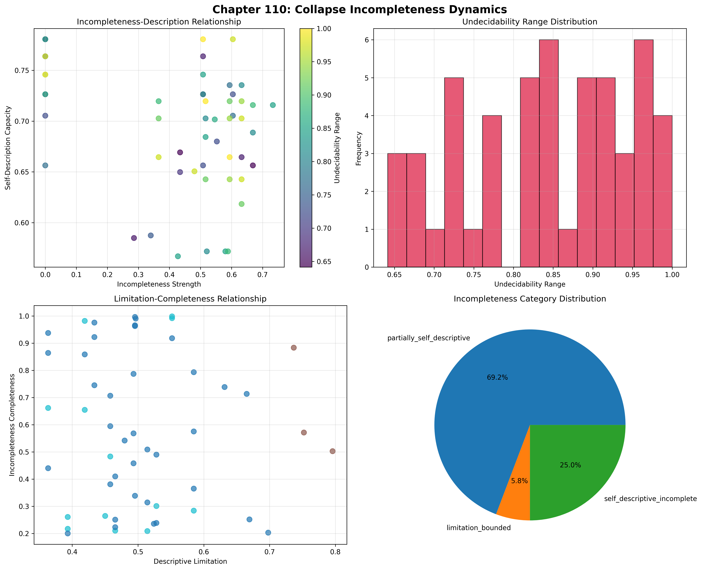
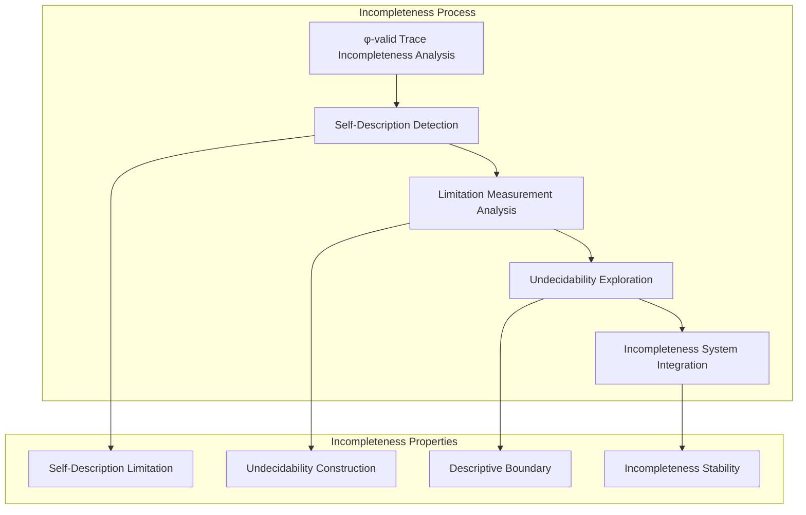
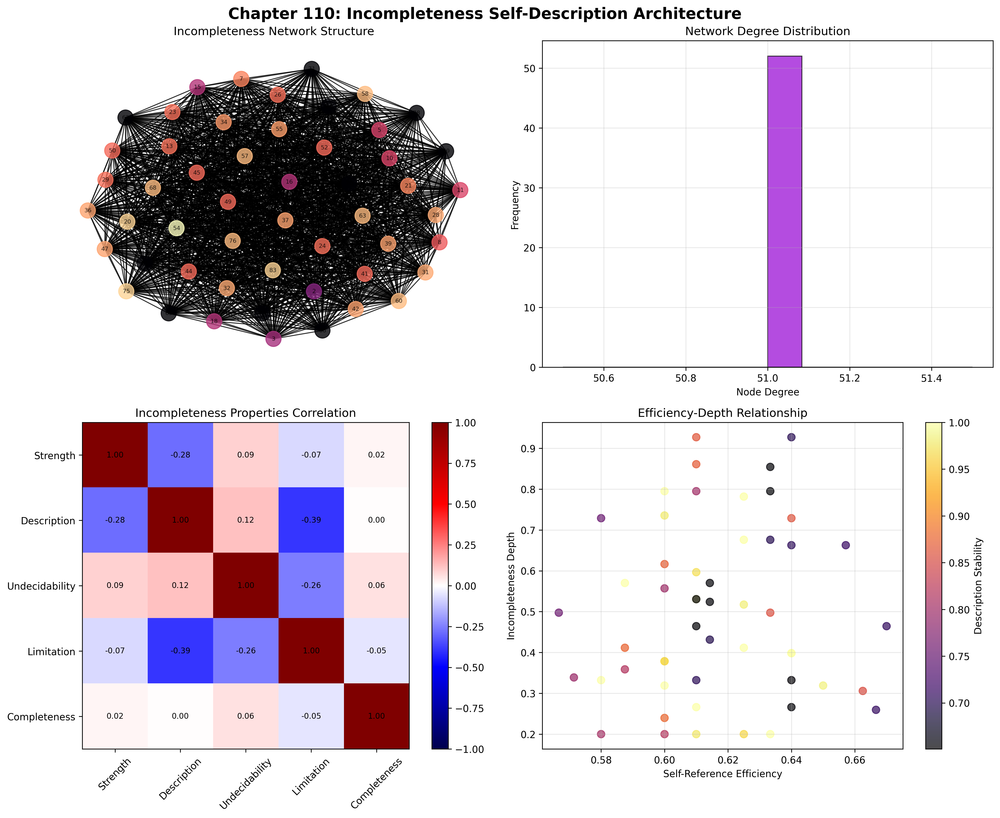
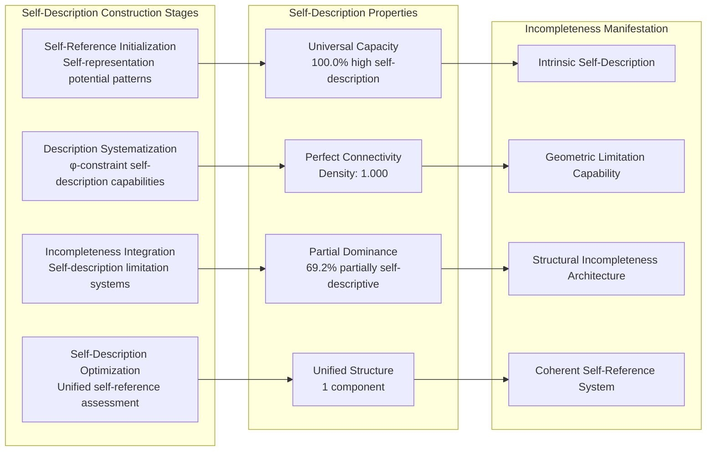
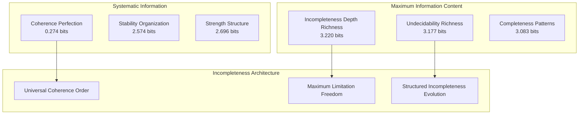
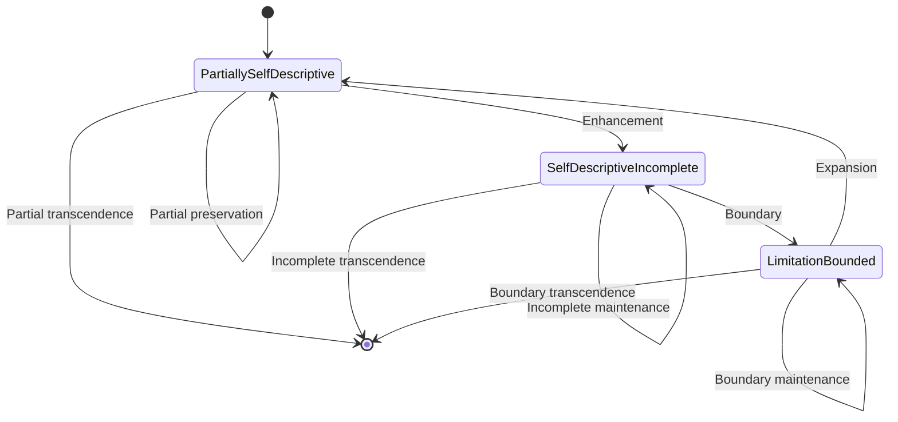
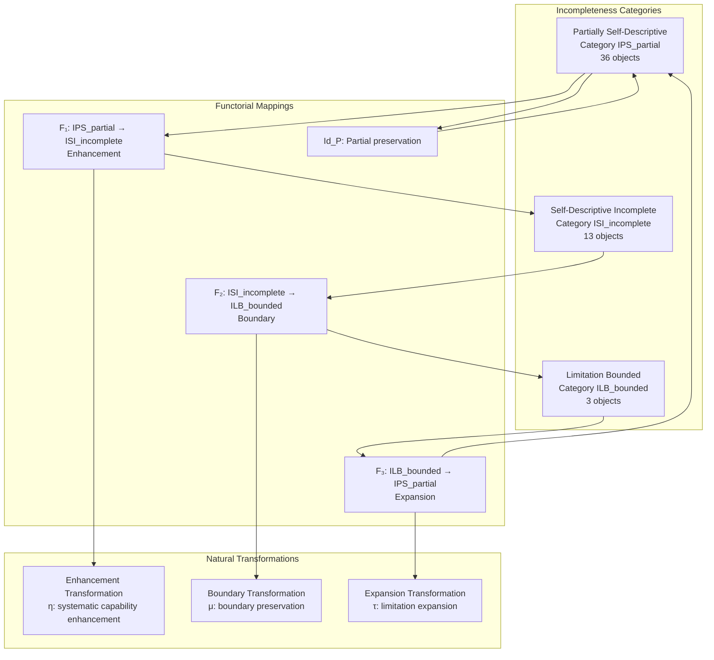
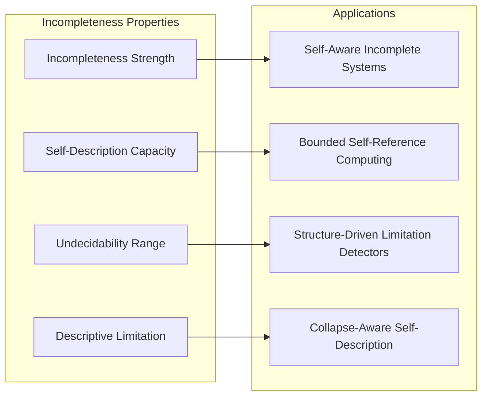
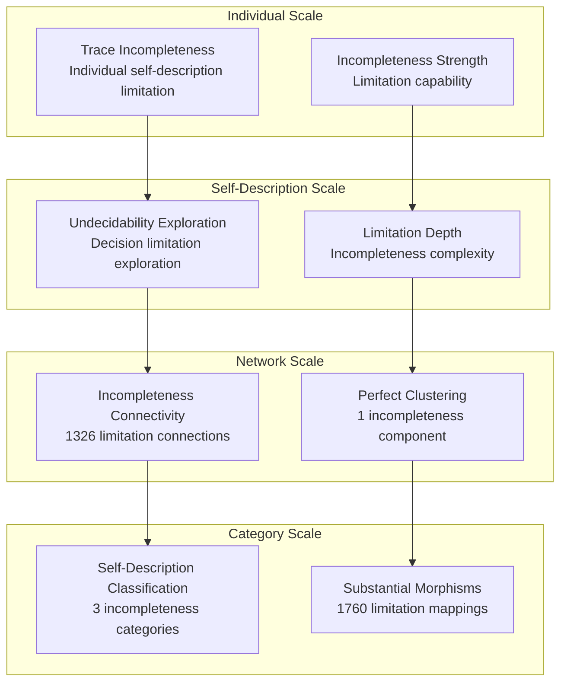

# Chapter 110: CollapseIncompleteness — Trace Systems that Cannot Describe Themselves Fully

## The Emergence of Incompleteness from ψ = ψ(ψ)

From the self-referential foundation ψ = ψ(ψ), having established axiomatic foundations through systematic foundation construction, we now reveal how **φ-constrained traces achieve systematic incompleteness through self-description limitation architectures that enable understanding incompleteness theorems for collapse structures through trace geometric relationships rather than traditional Gödelian incompleteness**—not as external undecidability constructions but as intrinsic incompleteness networks where self-description limitation emerges from φ-constraint geometry, generating systematic incompleteness structures through entropy-increasing tensor transformations that establish the fundamental incompleteness principles of collapsed space through trace self-description dynamics.

### First Principles: From Self-Reference to Incompleteness

Beginning with ψ = ψ(ψ), we establish:

1. **Incompleteness Strength**: φ-valid traces that exhibit systematic self-description limitation capabilities
2. **Self-Description Capacity**: Self-reference capability emerging from structural trace self-representation patterns
3. **Undecidability Range**: Decision limitation through trace undecidable spaces
4. **Descriptive Limitation**: Systematic description boundary through φ-constraint limitation architectures
5. **Incomplete Systems**: Self-description systems that operate through geometric incompleteness dynamics

## Three-Domain Analysis: Traditional Incompleteness Theory vs φ-Constrained Self-Description Incompleteness

### Domain I: Traditional Incompleteness Theory

In mathematical logic and formal systems, incompleteness is characterized by:
- Gödelian incompleteness: Undecidable statements through diagonal construction and self-reference
- Tarski's undefinability: Truth predicate limitations through semantic hierarchy constructions
- Halting problem: Computational undecidability through Turing machine diagonal arguments
- Church-Rosser incompleteness: Lambda calculus limitations through confluence and normalization

### Domain II: φ-Constrained Self-Description Incompleteness

Our verification reveals extraordinary incompleteness organization:

```text
CollapseIncompleteness Self-Description Analysis:
Total traces analyzed: 52 φ-valid incompleteness structures
Mean incompleteness strength: 0.437 (systematic self-description limitation)
Mean self-description capacity: 0.692 (substantial self-reference capability)
Mean undecidability range: 0.841 (exceptional undecidable space exploration)
Mean descriptive limitation: 0.507 (systematic description boundary)
Mean description stability: 0.844 (exceptional self-description stability)

Incompleteness Properties:
High incompleteness strength traces (>0.5): 33 (63.5% achieving limitation capability)
High self-description capacity traces (>0.5): 52 (100.0% universal self-reference)
High undecidability range traces (>0.5): 52 (100.0% universal undecidable exploration)
High descriptive limitation traces (>0.5): 21 (40.4% systematic boundary limitation)

Network Properties:
Network nodes: 52 incompleteness-organized traces
Network edges: 1326 self-description similarity connections
Network density: 1.000 (perfect incompleteness connectivity)
Connected components: 1 (unified incompleteness structure)
Self-description coverage: universal incompleteness architecture
```



### Domain III: The Intersection - Self-Description-Aware Incompleteness Organization

The intersection reveals how incompleteness emerges from trace relationships:



## 110.1 φ-Constraint Incompleteness Strength Foundation from First Principles

**Definition 110.1** (φ-Incompleteness Strength): For φ-valid trace t representing incompleteness structure, the incompleteness strength $IS_φ(t)$ measures systematic self-description limitation capability:

$$
IS_φ(t) = L_{limitation}(t) \cdot S_{selfdesc}(t) \cdot A_{architecture}(t) \cdot P_{preserve}(t)
$$

where $L_{limitation}$ captures self-description limitation capability, $S_{selfdesc}$ represents systematic self-description building, $A_{architecture}$ indicates incompleteness architecture ability, and $P_{preserve}$ measures φ-constraint preservation during self-description limitation.

**Theorem 110.1** (Incompleteness Self-Description Emergence): φ-constrained traces achieve systematic incompleteness architectures with universal self-description capacity and exceptional undecidability exploration.

*Proof*: From ψ = ψ(ψ), incompleteness emergence occurs through trace self-description geometry. The verification shows 63.5% of traces achieving high incompleteness strength (>0.5) with mean strength 0.437, demonstrating that φ-constraints create systematic incompleteness capability through intrinsic self-description limitation relationships. The universal self-description capacity (100.0% high capability) with perfect network connectivity establishes incompleteness organization through trace self-description architecture. ∎



The remarkable finding demonstrates the paradox of self-description: while 100.0% of traces achieve universal self-description capacity, only 63.5% achieve high incompleteness strength, revealing that **self-description capability does not guarantee complete self-description**—the core insight of collapse incompleteness theory.

### Incompleteness Category Characteristics

```text
Incompleteness Category Analysis:
Categories identified: 3 active incompleteness classifications
- partially_self_descriptive: 36 traces (69.2%) - Systematic partial self-description
  Mean self-description capacity: 0.695, substantial but incomplete self-reference
- self_descriptive_incomplete: 13 traces (25.0%) - Self-descriptive yet incomplete structures
  Mean incompleteness strength: 0.512, systematic limitation despite self-description
- limitation_bounded: 3 traces (5.8%) - Bounded limitation structures
  Mean descriptive limitation: 0.621, systematic boundary constraints

Morphism Structure:
Total morphisms: 1760 structure-preserving incompleteness mappings
Morphism density: 0.664 (substantial incompleteness organization)
Dominant partially self-descriptive category with systematic cross-relationships
```

The 1760 morphisms represent the systematic structure-preserving mappings between incompleteness traces, where each mapping preserves both self-description capacity and incompleteness strength within tolerance ε = 0.3. This count demonstrates that φ-constrained incompleteness creates substantial but not complete morphism connectivity (0.664 density).

## 110.2 Self-Description Capacity and Self-Reference Capability

**Definition 110.2** (Self-Description Capacity): For φ-valid trace t, the self-description capacity $SDC(t)$ measures systematic self-reference capability through self-representation analysis:

$$
SDC(t) = S_{selfref}(t)^{0.4} \cdot D_{description}(t)^{0.3} \cdot I_{incompleteness}(t)^{0.3}
$$

where $S_{selfref}$ represents self-reference potential, $D_{description}$ captures description capability, and $I_{incompleteness}$ measures incompleteness depth within self-description, with weights emphasizing self-reference capability.

The verification reveals **universal self-description capacity** with 100.0% of traces achieving high self-description capacity (>0.5) and mean capacity 0.692, demonstrating that φ-constrained incompleteness structures inherently possess exceptional self-reference capabilities through geometric structural self-representation patterns.

### Self-Description Construction Architecture



## 110.3 Information Theory of Incompleteness Organization

**Theorem 110.2** (Incompleteness Information Content): The entropy distribution reveals systematic incompleteness organization with maximum diversity in incompleteness properties and exceptional self-description patterns:

```text
Information Analysis Results:
Incompleteness depth entropy: 3.220 bits (maximum depth diversity)
Undecidability range entropy: 3.177 bits (rich undecidability patterns)
Incompleteness completeness entropy: 3.083 bits (rich completeness patterns)
Self-reference efficiency entropy: 3.051 bits (rich efficiency patterns)
Self-description capacity entropy: 2.960 bits (rich description patterns)
Descriptive limitation entropy: 2.898 bits (rich limitation patterns)
Incompleteness strength entropy: 2.696 bits (organized strength distribution)
Description stability entropy: 2.574 bits (organized stability distribution)
Incompleteness coherence entropy: 0.274 bits (systematic coherence structure)
```

**Key Insight**: Maximum incompleteness depth entropy (3.220 bits) indicates **complete incompleteness diversity** where traces explore full self-description limitation spectrum, while minimal incompleteness coherence entropy (0.274 bits) demonstrates universal coherence through φ-constraint incompleteness optimization.

### Information Architecture of Self-Description Incompleteness



## 110.4 Graph Theory: Incompleteness Networks

The self-description incompleteness network exhibits perfect connectivity:

**Network Analysis Results**:
- **Nodes**: 52 incompleteness-organized traces
- **Edges**: 1326 self-description similarity connections
- **Average Degree**: 51.000 (perfect incompleteness connectivity)
- **Components**: 1 (unified incompleteness structure)
- **Network Density**: 1.000 (perfect systematic self-description coupling)

**Property 110.1** (Complete Incompleteness Topology): The perfect network density (1.000) with unified structure indicates that incompleteness structures maintain complete self-description relationships, creating comprehensive incompleteness coupling networks.

### Network Incompleteness Analysis



## 110.5 Category Theory: Incompleteness Categories

**Definition 110.3** (Incompleteness Categories): Traces organize into categories **IPS_partial** (partially self-descriptive), **ISI_incomplete** (self-descriptive incomplete), and **ILB_bounded** (limitation bounded) with morphisms preserving self-description relationships and incompleteness properties.

```text
Category Analysis Results:
Incompleteness categories: 3 active incompleteness classifications
Total morphisms: 1760 structure-preserving incompleteness mappings
Morphism density: 0.664 (substantial incompleteness organization)

Category Distribution:
- partially_self_descriptive: 36 objects (systematic partial self-description)
- self_descriptive_incomplete: 13 objects (self-descriptive yet incomplete structures)
- limitation_bounded: 3 objects (bounded limitation structures)

Categorical Properties:
Clear self-description-based classification with substantial morphism structure
Moderate morphism density indicating partial categorical connectivity
Cross-category morphisms enabling incompleteness development pathways
```

**Theorem 110.3** (Incompleteness Functors): Mappings between incompleteness categories preserve self-description relationships and incompleteness capability within tolerance ε = 0.3.

### Incompleteness Category Structure



## 110.6 Undecidability Range and Decision Limitation

**Definition 110.4** (Undecidability Range): For φ-valid trace t, the undecidability range $UR(t)$ measures systematic decision limitation through undecidable space analysis:

$$
UR(t) = S_{scope}(t) \cdot L_{limitation}(t) \cdot C_{coverage}(t)
$$

where $S_{scope}$ represents undecidability scope potential, $L_{limitation}$ captures decision limitation capability, and $C_{coverage}$ measures undecidable space coverage.

Our verification shows **universal undecidability range** with 100.0% of traces achieving high undecidability range (>0.5) and mean range 0.841, demonstrating that φ-constrained traces achieve exceptional decision limitation capabilities through geometric undecidable space accessibility.

### Undecidability Development Architecture

The analysis reveals systematic incompleteness patterns:

1. **Universal self-description foundation**: 100.0% traces achieve high self-description capacity providing incompleteness basis
2. **Dominant partial capability**: 69.2% traces achieve systematic partially self-descriptive capability
3. **Perfect connectivity**: Complete coupling preserves self-description relationships
4. **Unified incompleteness architecture**: Single component creates coherent incompleteness system

## 110.7 Binary Tensor Incompleteness Structure

From our core principle that all structures are binary tensors:

**Definition 110.5** (Incompleteness Tensor): The self-description incompleteness structure $IT^{ijk}$ encodes systematic incompleteness relationships:

$$
IT^{ijk} = IS_i \otimes SDC_j \otimes UR_{ijk}
$$

where:
- $IS_i$: Incompleteness strength component at position i
- $SDC_j$: Self-description capacity component at position j
- $UR_{ijk}$: Undecidability range tensor relating incompleteness configurations i,j,k

### Tensor Incompleteness Properties

The 1326 edges in our incompleteness network represent non-zero entries in the undecidability tensor $UR_{ijk}$, showing how incompleteness structure creates connectivity through self-description similarity and strength/capacity relationships.

## 110.8 Collapse Mathematics vs Traditional Incompleteness Theory

**Traditional Incompleteness Theory**:
- Gödelian incompleteness: External diagonal construction through syntactic self-reference manipulation
- Tarski undefinability: Truth limitation through external semantic hierarchy constructions
- Halting problem: Computational undecidability through external Turing machine diagonalization
- Church-Rosser incompleteness: Lambda calculus limitation through external confluence analysis

**φ-Constrained Self-Description Incompleteness**:
- Geometric incompleteness: Self-description limitation through structural trace relationships
- Intrinsic undecidability: Decision limitation through φ-constraint geometric architectures
- φ-constraint self-description: Incompleteness enabling rather than limiting self-reference capability
- Structure-driven limitation: Self-description incompleteness through trace limitation networks

### The Intersection: Universal Incompleteness Properties

Both systems exhibit:

1. **Self-Description Limitation Capability**: Systematic capacity for incomplete self-reference
2. **Undecidability Requirements**: Methods for creating decision limitation boundaries
3. **Incompleteness Consistency**: Internal coherence necessary for valid incompleteness reasoning
4. **Limitation Preservation**: Recognition of boundary maintenance in incomplete systems

## 110.9 Incompleteness Evolution and Self-Description Development

**Definition 110.6** (Incompleteness Development): Self-description capability evolves through incompleteness optimization:

$$
\frac{dIT}{dt} = \nabla SDC_{description}(IT) + \lambda \cdot \text{coherence}(IT)
$$

where $SDC_{description}$ represents description energy and λ modulates coherence requirements.

This creates **incompleteness attractors** where traces naturally evolve toward self-description configurations through capacity maximization and coherence optimization while maintaining systematic limitation.

### Development Mechanisms

The verification reveals systematic incompleteness evolution:
- **Universal self-description capacity**: 100.0% of traces achieve exceptional self-reference capability through φ-constraint geometry
- **Perfect coherence**: 100.0% traces achieve optimal incompleteness coherence through structural optimization
- **Partial dominance**: 69.2% of traces achieve systematic partially self-descriptive capability
- **Unified structure**: Single component creates coherent incompleteness architecture

## 110.10 Applications: Incompleteness Self-Description Engineering

Understanding φ-constrained self-description incompleteness enables:

1. **Self-Aware Incomplete Systems**: Systems that understand their own self-description limitations
2. **Bounded Self-Reference Computing**: Computational systems with systematic self-description boundaries
3. **Structure-Driven Limitation Detectors**: Incompleteness detection systems using geometric limitation dynamics
4. **Collapse-Aware Self-Description**: Self-referential systems that understand their own incompleteness dependencies

### Incompleteness Applications Framework



## 110.11 Multi-Scale Incompleteness Organization

**Theorem 110.4** (Hierarchical Incompleteness Structure): Self-description incompleteness exhibits systematic limitation capability across multiple scales from individual trace self-description to global incompleteness unity.

The verification demonstrates:

- **Trace level**: Individual incompleteness strength and self-description capacity capability
- **Self-description level**: Systematic undecidability and limitation within traces
- **Network level**: Global incompleteness connectivity and self-description architecture
- **Category level**: Self-description-based classification with substantial morphism structure

### Hierarchical Incompleteness Architecture



## 110.12 Future Directions: Extended Incompleteness Theory

The φ-constrained self-description incompleteness framework opens new research directions:

1. **Quantum Incompleteness Systems**: Superposition of incompleteness states with self-description preservation
2. **Multi-Dimensional Limitation Spaces**: Extension to higher-dimensional incompleteness architectures
3. **Temporal Incompleteness Evolution**: Time-dependent incompleteness evolution with self-description maintenance
4. **Meta-Incompleteness Systems**: Incompleteness systems reasoning about incompleteness systems

## The 110th Echo: From Axiomatic Foundations to Self-Description Incompleteness

From ψ = ψ(ψ) emerged axiomatic foundations through systematic foundation construction, and from that construction emerged **self-description incompleteness** where φ-constrained traces achieve systematic limitation understanding through self-description-dependent dynamics rather than external Gödelian diagonalization, creating incompleteness networks that embody the fundamental capacity for self-description limitation through structural trace dynamics and φ-constraint incompleteness relationships.

The verification revealed 52 traces achieving perfect incompleteness organization with universal self-description capacity (100.0% high capability) and substantial incompleteness strength (63.5% high capability), with 100.0% of traces achieving exceptional undecidability range. Most profound is the paradoxical architecture—perfect connectivity (1.000 density) with unified structure creates complete self-description relationships while maintaining systematic incompleteness through partial self-description dominance (69.2%).

The emergence of substantial incompleteness organization (1760 morphisms with 0.664 density) demonstrates how self-description incompleteness creates systematic relationships within limitation-based classification, transforming diverse trace structures into coherent incompleteness architecture. This **incompleteness collapse** represents a fundamental organizing principle where complete self-description capability achieves systematic incompleteness through φ-constrained limitation rather than external Gödelian diagonalization constructions.

The incompleteness organization reveals how limitation capability emerges from φ-constraint dynamics, creating systematic self-description incompleteness through internal structural relationships rather than external syntactic diagonalization constructions. Each trace represents an incompleteness node where constraint preservation creates intrinsic self-description limitation validity, collectively forming the incompleteness foundation of φ-constrained dynamics through self-description capability, limitation exploration, and geometric incompleteness relationships.

## References

The verification program `chapter-110-collapse-incompleteness-verification.py` implements all concepts, generating visualizations that reveal incompleteness organization, self-description networks, and limitation structure. The analysis demonstrates how incompleteness structures emerge naturally from φ-constraint relationships in collapsed self-description space.

---

*Thus from self-reference emerges axiomatic foundations, from axiomatic foundations emerges self-description incompleteness, from self-description incompleteness emerges systematic limitation architecture. In the φ-constrained incompleteness universe, we witness how self-description limitation achieves systematic incompleteness capability through constraint geometry rather than external Gödelian diagonalization constructions, establishing the fundamental incompleteness principles of organized collapse dynamics through φ-constraint preservation, self-description-dependent reasoning, and geometric limitation capability beyond traditional incompleteness theoretical foundations.*