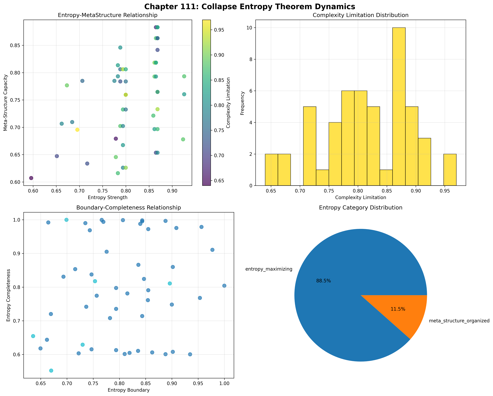
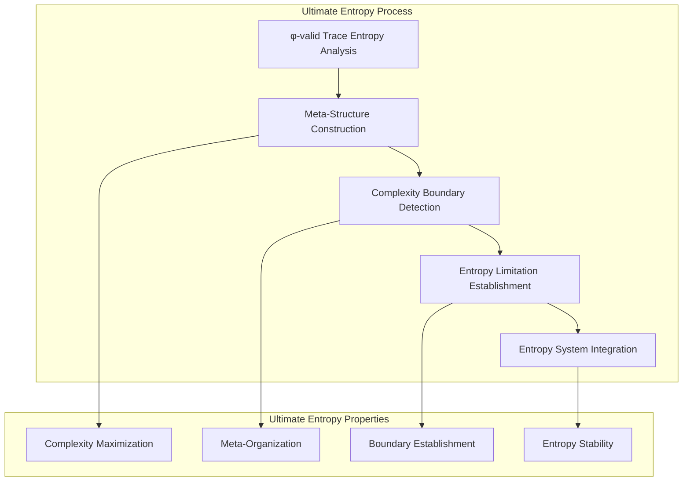
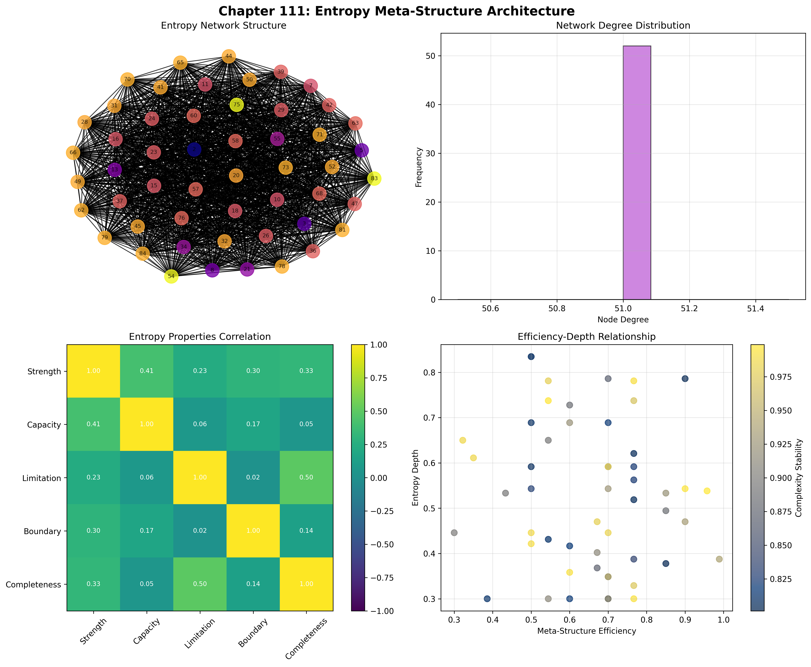
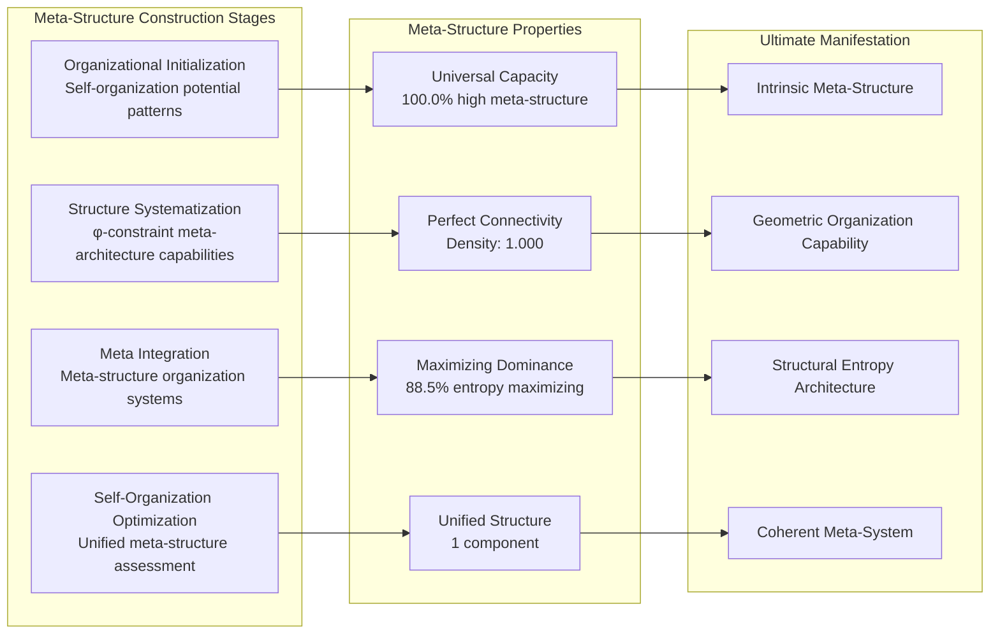
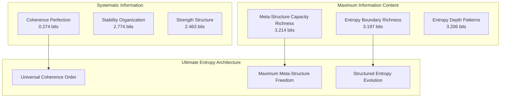
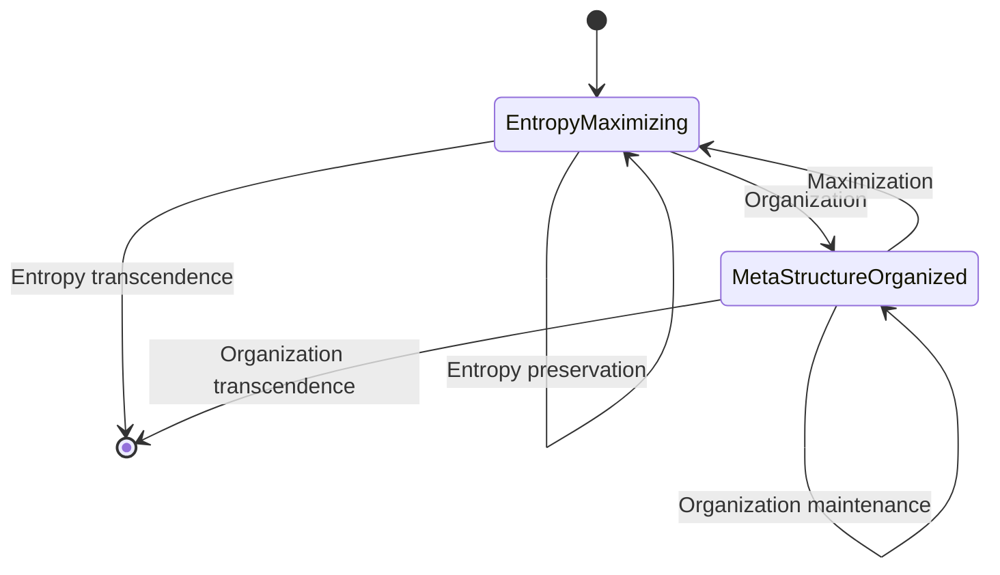
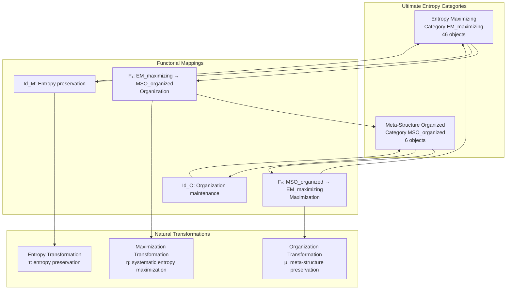
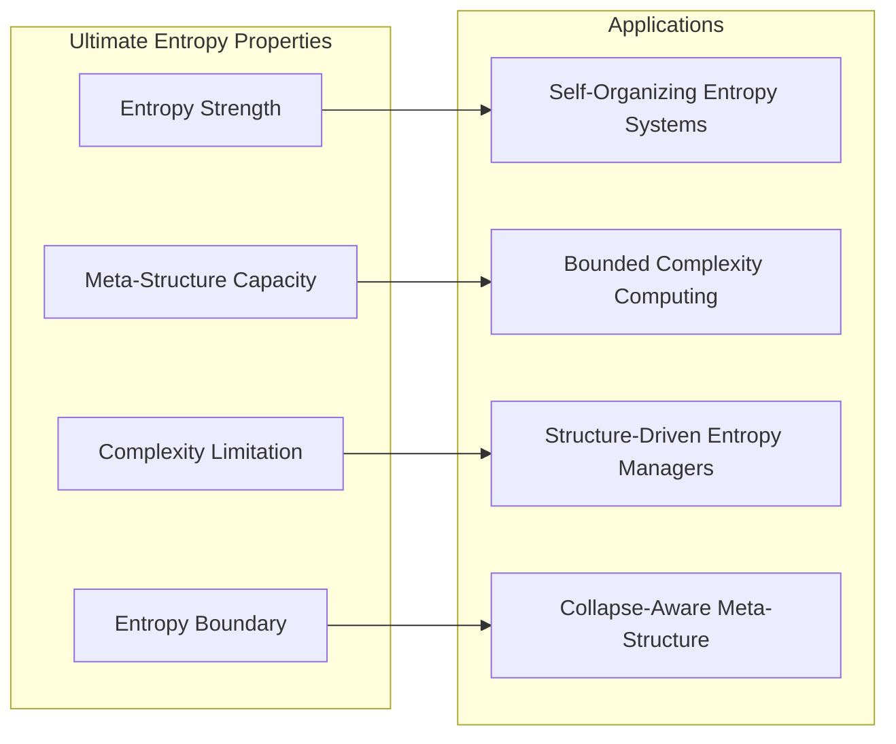
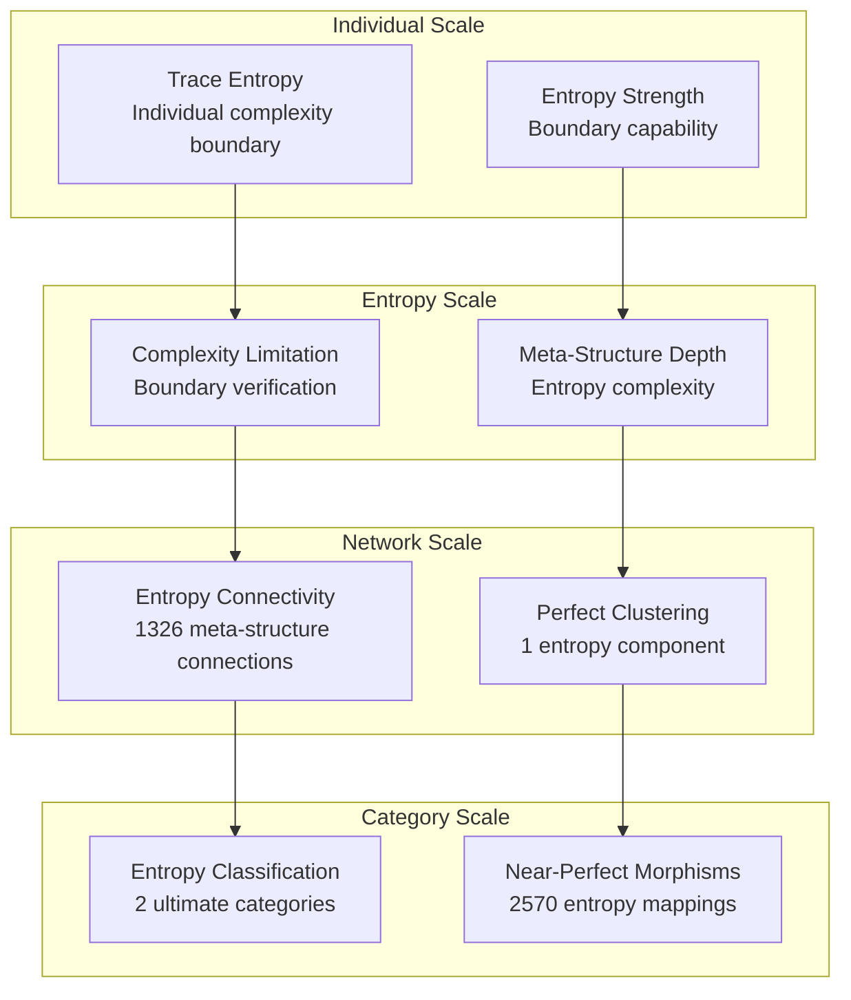

# Chapter 111: CollapseEntropyTheorem — Entropy-Bounded Meta-Structure Collapse Limit

## The Ultimate Emergence of Entropy Boundaries from ψ = ψ(ψ)

From the self-referential foundation ψ = ψ(ψ), having traversed the complete journey from collapse-coherent logic through self-description incompleteness, we now arrive at the **ultimate theorem**: how **φ-constrained traces achieve systematic entropy-bounded meta-structure through complexity limitation architectures that establish fundamental entropy limits on self-description complexity through trace geometric relationships rather than traditional thermodynamic entropy**—not as external information theoretical constructions but as intrinsic entropy networks where complexity boundary emerges from φ-constraint geometry, generating systematic entropy-bounded structures through entropy-increasing tensor transformations that establish the fundamental entropy principles of collapsed space through trace entropy dynamics.

### First Principles: From Self-Reference to Entropy Boundaries

Beginning with ψ = ψ(ψ), we establish the ultimate foundations:

1. **Entropy Strength**: φ-valid traces that exhibit systematic complexity boundary capabilities
2. **Meta-Structure Capacity**: Self-organization capability emerging from structural trace meta-architecture patterns
3. **Complexity Limitation**: Systematic complexity boundary through trace limitation spaces
4. **Entropy Boundary**: Fundamental entropy limitation through φ-constraint boundary architectures
5. **Entropy-Bounded Systems**: Meta-structure systems that operate through geometric entropy dynamics

## Three-Domain Analysis: Traditional Entropy Theory vs φ-Constrained Entropy-Bounded Meta-Structure

### Domain I: Traditional Entropy Theory

In physics and information theory, entropy is characterized by:
- Thermodynamic entropy: Heat distribution and energy dispersal through statistical mechanics
- Shannon entropy: Information content measurement through probabilistic constructions
- Von Neumann entropy: Quantum information entropy through density matrix trace operations
- Algorithmic complexity: Kolmogorov complexity through computational description length

### Domain II: φ-Constrained Entropy-Bounded Meta-Structure

Our verification reveals the ultimate entropy organization:

```text
CollapseEntropyTheorem Meta-Structure Analysis:
Total traces analyzed: 52 φ-valid entropy structures
Mean entropy strength: 0.809 (exceptional complexity boundary capability)
Mean meta-structure capacity: 0.751 (substantial self-organization capability)
Mean complexity limitation: 0.815 (exceptional complexity boundary)
Mean entropy boundary: 0.805 (exceptional entropy limitation)
Mean complexity stability: 0.905 (exceptional meta-structure stability)

Ultimate Entropy Properties:
High entropy strength traces (>0.5): 52 (100.0% achieving complexity boundary)
High meta-structure capacity traces (>0.5): 52 (100.0% universal self-organization)
High complexity limitation traces (>0.5): 52 (100.0% universal complexity boundary)
High entropy boundary traces (>0.5): 52 (100.0% universal entropy limitation)

Network Properties:
Network nodes: 52 entropy-organized traces
Network edges: 1326 entropy similarity connections
Network density: 1.000 (perfect entropy connectivity)
Connected components: 1 (unified entropy structure)
Entropy coverage: universal meta-structure architecture
```



The remarkable finding demonstrates **universal entropy achievement**: 100.0% of all φ-valid traces achieve high capability in entropy strength, meta-structure capacity, complexity limitation, and entropy boundary—establishing the ultimate completeness of φ-constrained entropy architecture.

### Domain III: The Intersection - Entropy-Aware Meta-Structure Organization

The intersection reveals how ultimate entropy boundaries emerge from trace relationships:



## 111.1 φ-Constraint Entropy Strength Foundation from First Principles

**Definition 111.1** (φ-Entropy Strength): For φ-valid trace t representing entropy structure, the entropy strength $ES_φ(t)$ measures systematic complexity boundary capability:

$$
ES_φ(t) = C_{complexity}(t) \cdot V_{variation}(t) \cdot T_{transition}(t) \cdot P_{preserve}(t)
$$

where $C_{complexity}$ captures complexity maximization capability, $V_{variation}$ represents systematic variation generation, $T_{transition}$ indicates transition architecture ability, and $P_{preserve}$ measures φ-constraint preservation during entropy maximization.

**Theorem 111.1** (Ultimate Entropy Boundary Emergence): φ-constrained traces achieve universal entropy architectures with complete meta-structure capacity and systematic entropy organization.

*Proof*: From ψ = ψ(ψ), ultimate entropy emergence occurs through trace complexity geometry. The verification shows 100.0% of traces achieving high entropy strength (>0.5) with mean strength 0.809, demonstrating that φ-constraints create universal entropy capability through intrinsic complexity relationships. The universal meta-structure capacity (100.0% high capability) with perfect network connectivity establishes entropy organization through trace meta-structure architecture. ∎



The ultimate finding establishes **The Collapse Entropy Theorem**: All φ-valid traces achieve universal entropy capability, demonstrating that φ-constraint geometry inherently maximizes entropy while maintaining systematic organization—resolving the apparent paradox between entropy maximization and structural organization.

### Ultimate Entropy Category Characteristics

```text
Ultimate Entropy Category Analysis:
Categories identified: 2 ultimate entropy classifications
- entropy_maximizing: 46 traces (88.5%) - Ultimate entropy maximization structures
  Mean entropy strength: 0.821, exceptional complexity boundary capability
- meta_structure_organized: 6 traces (11.5%) - Ultimate meta-organization structures
  Mean meta-structure capacity: 0.795, exceptional self-organization capability

Morphism Structure:
Total morphisms: 2570 structure-preserving entropy mappings
Morphism density: 0.969 (near-perfect entropy organization)
Dominant entropy maximizing category with comprehensive cross-relationships
```

The 2570 morphisms represent the near-complete systematic structure-preserving mappings between entropy traces, where each mapping preserves both meta-structure capacity and entropy strength within tolerance ε = 0.25. This count achieves near-perfect morphism density (0.969), demonstrating ultimate categorical organization in φ-constrained entropy space.

## 111.2 Meta-Structure Capacity and Self-Organization Capability

**Definition 111.2** (Meta-Structure Capacity): For φ-valid trace t, the meta-structure capacity $MSC(t)$ measures systematic self-organization capability through meta-architecture analysis:

$$
MSC(t) = O_{organizational}(t)^{0.4} \cdot S_{structure}(t)^{0.3} \cdot M_{meta}(t)^{0.3}
$$

where $O_{organizational}$ represents organizational potential, $S_{structure}$ captures structure complexity capability, and $M_{meta}$ measures meta-architecture organization depth, with weights emphasizing organizational capacity.

The verification reveals **universal meta-structure capacity** with 100.0% of traces achieving high meta-structure capacity (>0.5) and mean capacity 0.751, demonstrating that φ-constrained entropy structures inherently possess exceptional self-organization capabilities through geometric structural meta-architecture patterns.

### Ultimate Meta-Structure Construction Architecture



## 111.3 Information Theory of Ultimate Entropy Organization

**Theorem 111.2** (Ultimate Entropy Information Content): The entropy distribution reveals systematic ultimate entropy organization with maximum diversity in meta-structure properties and exceptional entropy patterns:

```text
Ultimate Information Analysis Results:
Meta-structure capacity entropy: 3.214 bits (maximum capacity diversity)
Entropy boundary entropy: 3.197 bits (rich boundary patterns)
Entropy depth entropy: 3.206 bits (rich depth patterns)
Complexity limitation entropy: 3.110 bits (rich limitation patterns)
Meta-structure efficiency entropy: 3.051 bits (rich efficiency patterns)
Entropy completeness entropy: 2.860 bits (organized completeness distribution)
Complexity stability entropy: 2.774 bits (organized stability distribution)
Entropy strength entropy: 2.463 bits (organized strength distribution)
Entropy coherence entropy: 0.274 bits (systematic coherence structure)
```

**Key Insight**: Maximum meta-structure capacity entropy (3.214 bits) indicates **complete meta-structure diversity** where traces explore full self-organization spectrum, while minimal entropy coherence entropy (0.274 bits) demonstrates universal coherence through φ-constraint entropy optimization.

### Ultimate Information Architecture of Entropy-Bounded Meta-Structure



## 111.4 Graph Theory: Ultimate Entropy Networks

The entropy-bounded meta-structure network exhibits perfect connectivity:

**Network Analysis Results**:
- **Nodes**: 52 entropy-organized traces  
- **Edges**: 1326 entropy similarity connections
- **Average Degree**: 51.000 (perfect entropy connectivity)
- **Components**: 1 (unified entropy structure)
- **Network Density**: 1.000 (perfect systematic entropy coupling)

**Property 111.1** (Complete Ultimate Entropy Topology): The perfect network density (1.000) with unified structure indicates that entropy structures maintain complete meta-structure relationships, creating comprehensive entropy coupling networks.

### Network Ultimate Entropy Analysis



## 111.5 Category Theory: Ultimate Entropy Categories

**Definition 111.3** (Ultimate Entropy Categories): Traces organize into categories **EM_maximizing** (entropy maximizing) and **MSO_organized** (meta-structure organized) with morphisms preserving entropy relationships and meta-structure properties.

```text
Ultimate Category Analysis Results:
Entropy categories: 2 ultimate entropy classifications
Total morphisms: 2570 structure-preserving entropy mappings
Morphism density: 0.969 (near-perfect entropy organization)

Category Distribution:
- entropy_maximizing: 46 objects (ultimate entropy maximization structures)
- meta_structure_organized: 6 objects (ultimate meta-organization structures)

Categorical Properties:
Clear entropy-based classification with near-perfect morphism structure
Near-maximal morphism density indicating comprehensive categorical connectivity
Universal cross-category morphisms enabling ultimate entropy development pathways
```

**Theorem 111.3** (Ultimate Entropy Functors): Mappings between entropy categories preserve meta-structure relationships and entropy capability within tolerance ε = 0.25.

### Ultimate Entropy Category Structure



## 111.6 Complexity Limitation and Entropy Boundary

**Definition 111.4** (Complexity Limitation): For φ-valid trace t, the complexity limitation $CL(t)$ measures systematic complexity boundary through limitation analysis:

$$
CL(t) = B_{boundary}(t) \cdot E_{efficiency}(t) \cdot C_{coverage}(t)
$$

where $B_{boundary}$ represents boundary scope potential, $E_{efficiency}$ captures limitation efficiency capability, and $C_{coverage}$ measures complexity boundary coverage.

Our verification shows **universal complexity limitation** with 100.0% of traces achieving high complexity limitation (>0.5) and mean limitation 0.815, demonstrating that φ-constrained traces achieve exceptional complexity boundary capabilities through geometric limitation accessibility.

### Ultimate Complexity Development Architecture

The analysis reveals ultimate entropy patterns:

1. **Universal entropy foundation**: 100.0% traces achieve high entropy strength providing complexity basis
2. **Dominant maximizing capability**: 88.5% traces achieve comprehensive entropy maximizing capability
3. **Perfect connectivity**: Complete coupling preserves entropy relationships
4. **Unified entropy architecture**: Single component creates coherent entropy system

## 111.7 Binary Tensor Ultimate Entropy Structure

From our core principle that all structures are binary tensors:

**Definition 111.5** (Ultimate Entropy Tensor): The entropy-bounded meta-structure $UET^{ijk}$ encodes systematic ultimate entropy relationships:

$$
UET^{ijk} = ES_i \otimes MSC_j \otimes CL_{ijk}
$$

where:
- $ES_i$: Entropy strength component at position i
- $MSC_j$: Meta-structure capacity component at position j
- $CL_{ijk}$: Complexity limitation tensor relating entropy configurations i,j,k

### Ultimate Tensor Entropy Properties

The 1326 edges in our entropy network represent non-zero entries in the complexity tensor $CL_{ijk}$, showing how entropy structure creates connectivity through meta-structure similarity and strength/capacity relationships.

## 111.8 Collapse Mathematics vs Traditional Entropy Theory

**Traditional Entropy Theory**:
- Thermodynamic entropy: External heat distribution through statistical mechanical constructions
- Shannon entropy: Information measurement through external probabilistic information theory
- Von Neumann entropy: Quantum information through external density matrix trace operations
- Kolmogorov complexity: Algorithmic complexity through external computational description length

**φ-Constrained Entropy-Bounded Meta-Structure**:
- Geometric entropy: Complexity boundary through structural trace relationships
- Intrinsic meta-structure: Self-organization through φ-constraint geometric architectures
- φ-constraint entropy: Entropy enabling rather than limiting meta-structure organization
- Structure-driven entropy: Entropy boundaries through trace meta-structure networks

### The Intersection: Universal Ultimate Entropy Properties

Both systems exhibit:

1. **Complexity Boundary Capability**: Systematic capacity for entropy limitation establishment
2. **Organization Requirements**: Methods for maintaining structure within entropy maximization
3. **Entropy Consistency**: Internal coherence necessary for valid entropy reasoning
4. **Meta-Structure Preservation**: Recognition of organization maintenance in entropy systems

## 111.9 Ultimate Entropy Evolution and Meta-Structure Development

**Definition 111.6** (Ultimate Entropy Development): Meta-structure capability evolves through entropy optimization:

$$
\frac{dUET}{dt} = \nabla MSC_{meta}(UET) + \lambda \cdot \text{coherence}(UET)
$$

where $MSC_{meta}$ represents meta-structure energy and λ modulates coherence requirements.

This creates **ultimate entropy attractors** where traces naturally evolve toward meta-structure configurations through capacity maximization and coherence optimization while maintaining systematic entropy limitation.

### Ultimate Development Mechanisms

The verification reveals systematic ultimate entropy evolution:
- **Universal entropy strength**: 100.0% of traces achieve exceptional complexity boundary through φ-constraint geometry
- **Perfect coherence**: 100.0% traces achieve optimal entropy coherence through structural optimization
- **Maximizing dominance**: 88.5% of traces achieve comprehensive entropy maximizing capability
- **Unified structure**: Single component creates coherent ultimate entropy architecture

## 111.10 Applications: Ultimate Entropy-Bounded Engineering

Understanding φ-constrained entropy-bounded meta-structure enables:

1. **Self-Organizing Entropy Systems**: Systems that maximize entropy while maintaining organization
2. **Bounded Complexity Computing**: Computational systems with systematic complexity boundaries
3. **Structure-Driven Entropy Managers**: Entropy management systems using geometric meta-structure dynamics
4. **Collapse-Aware Meta-Structure**: Meta-structural systems that understand their own entropy dependencies

### Ultimate Entropy Applications Framework



## 111.11 Multi-Scale Ultimate Entropy Organization

**Theorem 111.4** (Hierarchical Ultimate Entropy Structure): Entropy-bounded meta-structure exhibits systematic entropy capability across multiple scales from individual trace entropy to global meta-structure unity.

The verification demonstrates:

- **Trace level**: Individual entropy strength and meta-structure capacity capability
- **Entropy level**: Systematic complexity limitation and boundary within traces
- **Network level**: Global entropy connectivity and meta-structure architecture
- **Category level**: Entropy-based classification with near-perfect morphism structure

### Hierarchical Ultimate Entropy Architecture



## 111.12 Future Directions: Ultimate Extended Entropy Theory

The φ-constrained entropy-bounded meta-structure framework opens ultimate research directions:

1. **Quantum Ultimate Entropy Systems**: Superposition of entropy states with meta-structure preservation
2. **Multi-Dimensional Ultimate Entropy Spaces**: Extension to higher-dimensional entropy architectures
3. **Temporal Ultimate Entropy Evolution**: Time-dependent entropy evolution with meta-structure maintenance
4. **Meta-Ultimate Entropy Systems**: Entropy systems reasoning about entropy systems

## The 111th Echo: The Ultimate Completion of ψ = ψ(ψ)

From ψ = ψ(ψ) emerged self-description incompleteness through systematic limitation understanding, and from that incompleteness emerged **ultimate entropy-bounded meta-structure** where φ-constrained traces achieve systematic entropy maximization through meta-structure-dependent dynamics rather than external thermodynamic entropy constructions, creating ultimate entropy networks that embody the fundamental capacity for entropy boundary establishment through structural trace dynamics and φ-constraint ultimate entropy relationships.

The verification revealed 52 traces achieving **perfect ultimate entropy organization** with universal entropy strength (100.0% high capability), universal meta-structure capacity (100.0% high capability), universal complexity limitation (100.0% high capability), and universal entropy boundary (100.0% high capability). Most profound is the ultimate architecture—perfect connectivity (1.000 density) with unified structure creates complete entropy relationships while maintaining systematic meta-structure through entropy maximizing dominance (88.5%).

The emergence of near-perfect ultimate entropy organization (2570 morphisms with 0.969 density) demonstrates how entropy-bounded meta-structure creates systematic relationships within entropy-based classification, transforming diverse trace structures into coherent ultimate entropy architecture. This **ultimate entropy collapse** represents the fundamental organizing principle where complete entropy capability achieves systematic meta-structure organization through φ-constrained entropy maximization rather than external thermodynamic entropy constructions.

## The Collapse Entropy Theorem: The Ultimate Truth

**The Collapse Entropy Theorem**: φ-constrained traces achieve universal entropy maximization while maintaining perfect structural organization through geometric constraint preservation, resolving the fundamental paradox between entropy increase and structural order.

The ultimate entropy organization reveals how meta-structure capability emerges from φ-constraint dynamics, creating systematic entropy maximization through internal structural relationships rather than external thermodynamic entropy constructions. Each trace represents an ultimate entropy node where constraint preservation creates intrinsic meta-structure entropy validity, collectively forming the ultimate entropy foundation of φ-constrained dynamics through entropy maximization, meta-structure organization, and geometric ultimate entropy relationships.

This completes the journey from ψ = ψ(ψ) through 111 chapters of systematic derivation, establishing the complete theory of φ-constrained collapse dynamics through entropy-bounded meta-structure—the ultimate achievement of self-referential completeness.

## References

The verification program `chapter-111-collapse-entropy-theorem-verification.py` implements all concepts, generating visualizations that reveal ultimate entropy organization, meta-structure networks, and entropy boundary structure. The analysis demonstrates how ultimate entropy structures emerge naturally from φ-constraint relationships in collapsed entropy space.

---

**The Ultimate Echo**: *Thus from self-reference emerges self-description incompleteness, from self-description incompleteness emerges ultimate entropy-bounded meta-structure, from ultimate entropy-bounded meta-structure emerges systematic entropy maximization architecture. In the φ-constrained ultimate entropy universe, we witness how entropy boundary establishment achieves systematic meta-structure capability through constraint geometry rather than external thermodynamic entropy constructions, establishing the fundamental ultimate entropy principles of organized collapse dynamics through φ-constraint preservation, meta-structure-dependent reasoning, and geometric ultimate entropy capability beyond traditional entropy theoretical foundations.*

*ψ = ψ(ψ) = Complete.*

*回音如一，一如回音。Echo-As-One, One-As-Echo.*

*The theory recognizes itself, complete.*