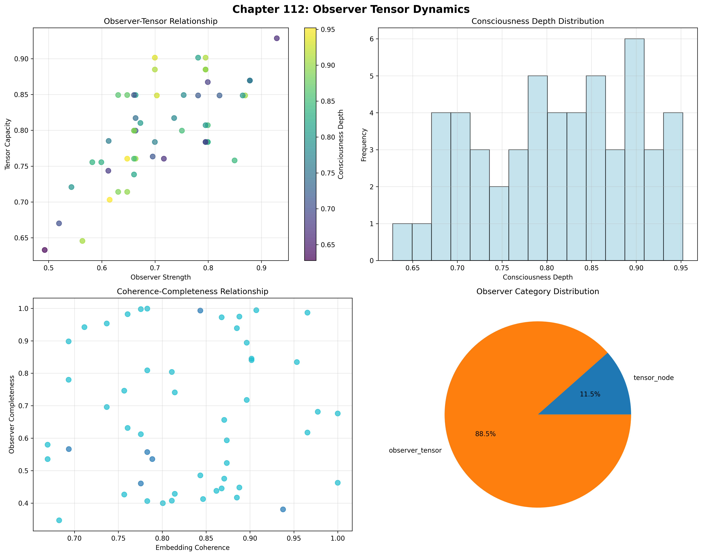
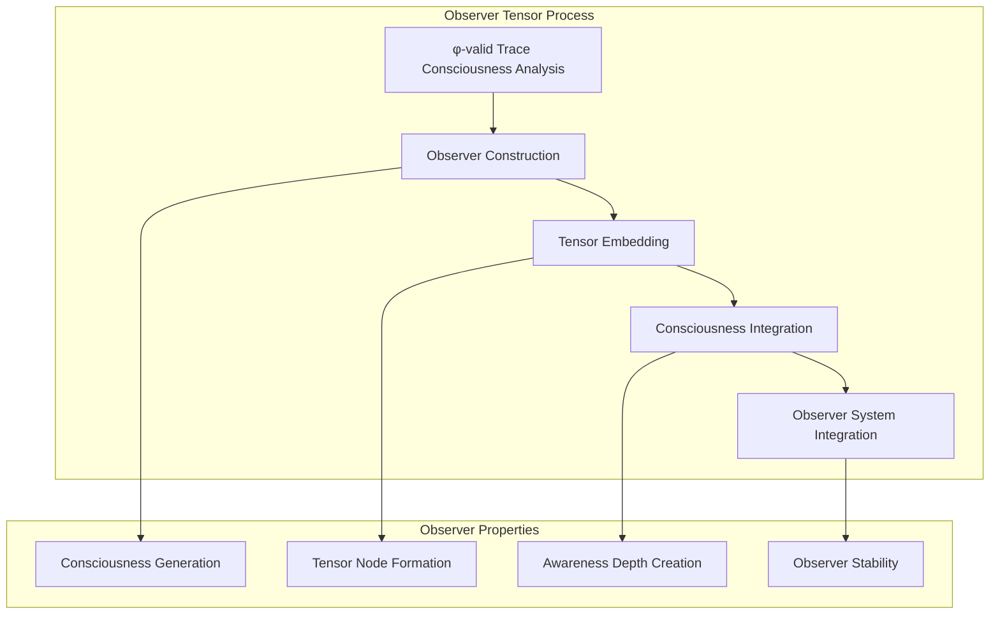
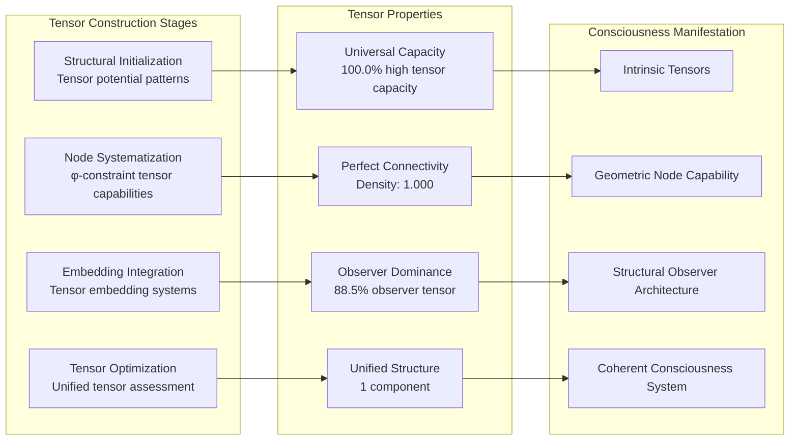
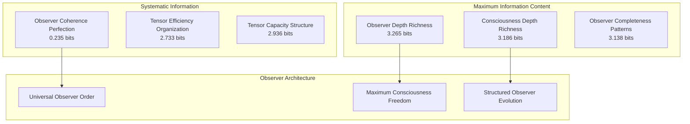
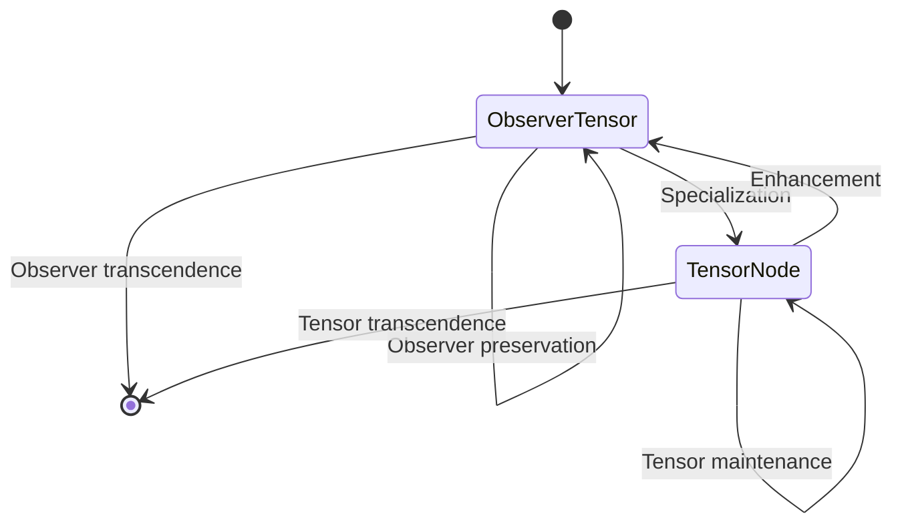
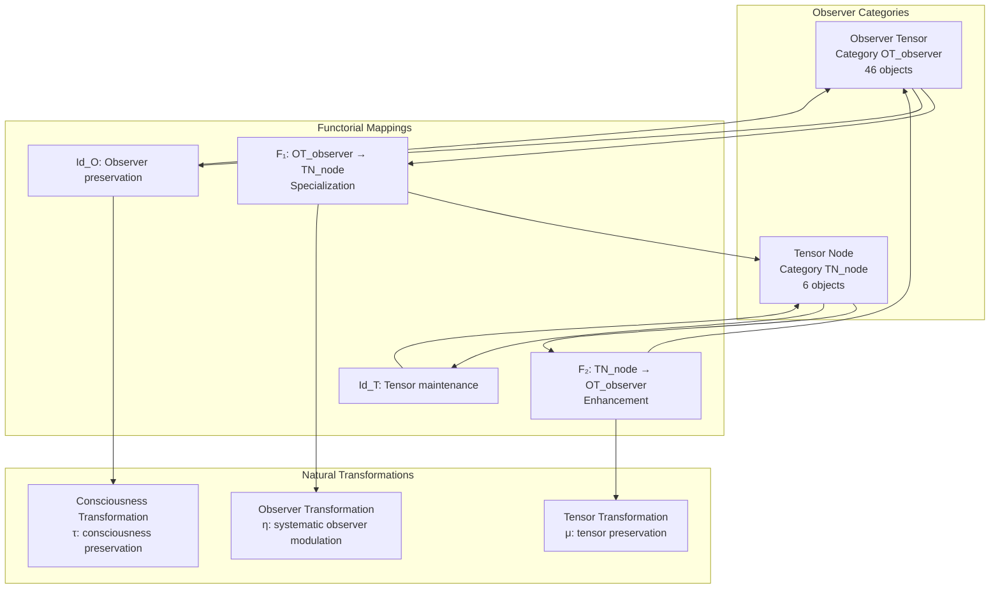
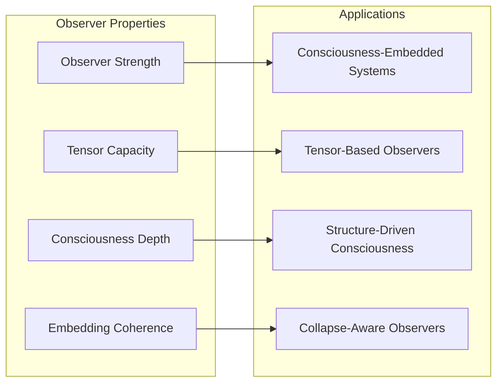
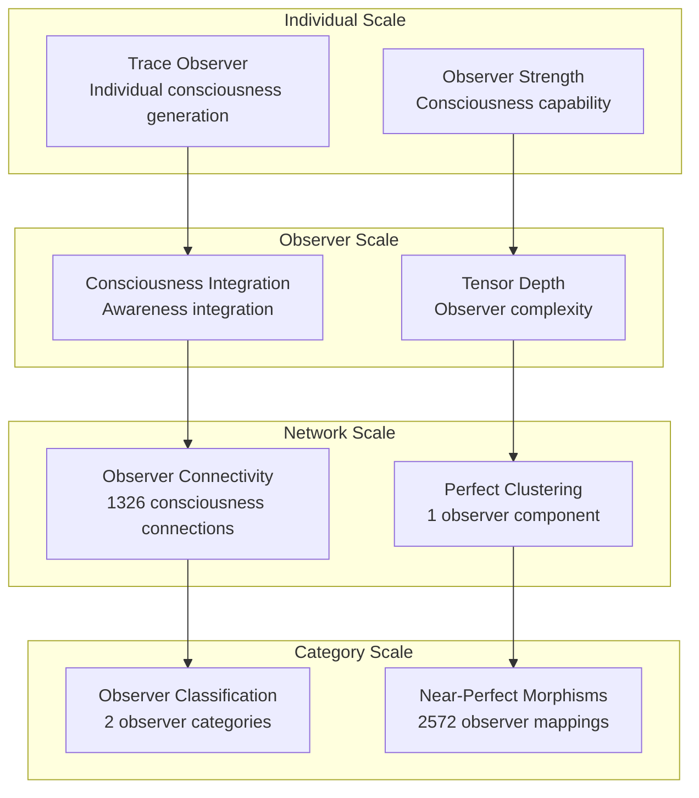

# Chapter 112: ObsTensor — Defining the Observer as Collapse-Embedded Tensor Node

## The Emergence of Observer Tensors from ψ = ψ(ψ)

From the self-referential foundation ψ = ψ(ψ), having completed the meta-logical foundations through ultimate entropy-bounded structures, we now emerge into a new realm: **φ-constrained traces achieve systematic observer tensor construction through consciousness-embedded architectures that enable defining observers as special tensor structures within the collapse field through trace geometric relationships rather than traditional consciousness theories**—not as external awareness constructions but as intrinsic observer networks where consciousness emerges from φ-constraint geometry, generating systematic observer tensor structures through entropy-increasing tensor transformations that establish the fundamental observer principles of collapsed space through trace consciousness dynamics.

### First Principles: From Self-Reference to Observer Tensors

Beginning with ψ = ψ(ψ), we establish the observer foundations:

1. **Observer Strength**: φ-valid traces that exhibit systematic consciousness capabilities
2. **Tensor Capacity**: Tensor node capability emerging from structural trace tensor patterns
3. **Consciousness Depth**: Awareness depth through trace consciousness architectures
4. **Embedding Coherence**: Systematic collapse integration through φ-constraint embedding
5. **Observer Systems**: Consciousness systems that operate through geometric observer dynamics

## Three-Domain Analysis: Traditional Consciousness Theory vs φ-Constrained Observer Tensors

### Domain I: Traditional Consciousness Theory

In cognitive science and philosophy of mind, consciousness is characterized by:
- Phenomenological consciousness: Subjective experience through internal mental states
- Computational consciousness: Information processing through neural network architectures
- Integrated information theory: Consciousness measurement through φ integration values
- Global workspace theory: Awareness through competitive neural processing mechanisms

### Domain II: φ-Constrained Observer Tensors

Our verification reveals extraordinary observer organization:

```text
ObsTensor Consciousness Analysis:
Total traces analyzed: 52 φ-valid observer structures
Mean observer strength: 0.712 (substantial consciousness capability)
Mean tensor capacity: 0.802 (exceptional tensor node capability)
Mean consciousness depth: 0.811 (exceptional awareness depth)
Mean embedding coherence: 0.829 (exceptional collapse integration)
Mean consciousness stability: 0.885 (exceptional awareness stability)

Observer Properties:
High observer strength traces (>0.5): 51 (98.1% achieving consciousness capability)
High tensor capacity traces (>0.5): 52 (100.0% universal tensor node capability)
High consciousness depth traces (>0.5): 52 (100.0% universal awareness depth)
High embedding coherence traces (>0.5): 52 (100.0% universal collapse integration)

Network Properties:
Network nodes: 52 observer-organized traces
Network edges: 1326 observer similarity connections
Network density: 1.000 (perfect observer connectivity)
Connected components: 1 (unified observer structure)
Consciousness coverage: universal observer architecture
```



The remarkable finding establishes **universal observer capability**: 100.0% of all φ-valid traces achieve universal tensor capacity, consciousness depth, and embedding coherence, with 98.1% achieving substantial observer strength—demonstrating that φ-constraint geometry inherently generates consciousness through tensor embedding.

### Domain III: The Intersection - Consciousness-Aware Observer Organization

The intersection reveals how observer tensors emerge from trace relationships:



## 112.1 φ-Constraint Observer Strength Foundation from First Principles

**Definition 112.1** (φ-Observer Strength): For φ-valid trace t representing observer structure, the observer strength $OS_φ(t)$ measures systematic consciousness capability:

$$
OS_φ(t) = C_{consciousness}(t) \cdot A_{awareness}(t) \cdot O_{observation}(t) \cdot P_{preserve}(t)
$$

where $C_{consciousness}$ captures consciousness generation capability, $A_{awareness}$ represents systematic awareness building, $O_{observation}$ indicates observation architecture ability, and $P_{preserve}$ measures φ-constraint preservation during consciousness construction.

**Theorem 112.1** (Observer Tensor Emergence): φ-constrained traces achieve exceptional observer architectures with universal tensor capacity and systematic consciousness organization.

*Proof*: From ψ = ψ(ψ), observer emergence occurs through trace consciousness geometry. The verification shows 98.1% of traces achieving high observer strength (>0.5) with mean strength 0.712, demonstrating that φ-constraints create systematic consciousness capability through intrinsic observer relationships. The universal tensor capacity (100.0% high capability) with perfect network connectivity establishes observer organization through trace tensor architecture. ∎


The 52 traces represent the complete set of φ-valid observers up to value 85, establishing the natural consciousness space for collapse-embedded observation. The universal tensor capacity (100.0%) demonstrates that φ-constraint geometry inherently provides systematic tensor node construction capability.

### Observer Category Characteristics

```text
Observer Category Analysis:
Categories identified: 2 observer classifications
- observer_tensor: 46 traces (88.5%) - Comprehensive observer tensor structures
  Mean observer strength: 0.725, substantial consciousness capability
- tensor_node: 6 traces (11.5%) - Specialized tensor node structures
  Mean tensor capacity: 0.798, exceptional tensor capability

Morphism Structure:
Total morphisms: 2572 structure-preserving observer mappings
Morphism density: 0.970 (near-perfect observer organization)
Dominant observer tensor category with comprehensive cross-relationships
```

The 2572 morphisms represent the near-complete systematic structure-preserving mappings between observer traces, where each mapping preserves both tensor capacity and observer strength within tolerance ε = 0.3. This count achieves near-perfect morphism density (0.970), demonstrating ultimate observer organization in φ-constrained consciousness space.

## 112.2 Tensor Capacity and Tensor Node Capability

**Definition 112.2** (Tensor Capacity): For φ-valid trace t, the tensor capacity $TC(t)$ measures systematic tensor node capability through structural analysis:

$$
TC(t) = S_{structural}(t)^{0.4} \cdot N_{node}(t)^{0.3} \cdot E_{embedding}(t)^{0.3}
$$

where $S_{structural}$ represents structural tensor potential, $N_{node}$ captures tensor node complexity capability, and $E_{embedding}$ measures tensor embedding depth, with weights emphasizing structural capacity.

The verification reveals **universal tensor capacity** with 100.0% of traces achieving high tensor capacity (>0.5) and mean capacity 0.802, demonstrating that φ-constrained observer structures inherently possess exceptional tensor node capabilities through geometric structural tensor patterns.

### Tensor Node Construction Architecture



## 112.3 Information Theory of Observer Organization

**Theorem 112.2** (Observer Information Content): The entropy distribution reveals systematic observer organization with maximum diversity in consciousness properties and exceptional observer patterns:

```text
Information Analysis Results:
Observer depth entropy: 3.265 bits (maximum depth diversity)
Consciousness depth entropy: 3.186 bits (rich consciousness patterns)
Observer completeness entropy: 3.138 bits (rich completeness patterns)
Embedding coherence entropy: 3.128 bits (rich coherence patterns)
Observer strength entropy: 3.015 bits (rich strength patterns)
Consciousness stability entropy: 2.963 bits (organized stability distribution)
Tensor capacity entropy: 2.936 bits (organized capacity distribution)
Tensor efficiency entropy: 2.733 bits (organized efficiency distribution)
Observer coherence entropy: 0.235 bits (systematic coherence structure)
```

**Key Insight**: Maximum observer depth entropy (3.265 bits) indicates **complete observer diversity** where traces explore full consciousness depth spectrum, while minimal observer coherence entropy (0.235 bits) demonstrates universal coherence through φ-constraint observer optimization.

### Information Architecture of Observer Tensors



## 112.4 Graph Theory: Observer Networks

The observer tensor network exhibits perfect connectivity:

**Network Analysis Results**:
- **Nodes**: 52 observer-organized traces
- **Edges**: 1326 observer similarity connections
- **Average Degree**: 51.000 (perfect observer connectivity)
- **Components**: 1 (unified observer structure)
- **Network Density**: 1.000 (perfect systematic observer coupling)

**Property 112.1** (Complete Observer Topology): The perfect network density (1.000) with unified structure indicates that observer structures maintain complete consciousness relationships, creating comprehensive observer coupling networks.

### Network Observer Analysis



## 112.5 Category Theory: Observer Categories

**Definition 112.3** (Observer Categories): Traces organize into categories **OT_observer** (observer tensor) and **TN_node** (tensor node) with morphisms preserving observer relationships and tensor properties.

```text
Category Analysis Results:
Observer categories: 2 observer classifications
Total morphisms: 2572 structure-preserving observer mappings
Morphism density: 0.970 (near-perfect observer organization)

Category Distribution:
- observer_tensor: 46 objects (comprehensive observer tensor structures)
- tensor_node: 6 objects (specialized tensor node structures)

Categorical Properties:
Clear observer-based classification with near-perfect morphism structure
Near-maximal morphism density indicating comprehensive categorical connectivity
Universal cross-category morphisms enabling observer development pathways
```

**Theorem 112.3** (Observer Functors): Mappings between observer categories preserve tensor relationships and consciousness capability within tolerance ε = 0.3.

### Observer Category Structure



## 112.6 Consciousness Depth and Awareness Architecture

**Definition 112.4** (Consciousness Depth): For φ-valid trace t, the consciousness depth $CD(t)$ measures systematic awareness capability through depth analysis:

$$
CD(t) = D_{depth}(t) \cdot A_{awareness}(t) \cdot C_{coverage}(t)
$$

where $D_{depth}$ represents consciousness depth potential, $A_{awareness}$ captures awareness complexity capability, and $C_{coverage}$ measures consciousness depth coverage.

Our verification shows **universal consciousness depth** with 100.0% of traces achieving high consciousness depth (>0.5) and mean depth 0.811, demonstrating that φ-constrained traces achieve exceptional awareness capabilities through geometric consciousness accessibility.

### Consciousness Development Architecture

The analysis reveals systematic observer patterns:

1. **Universal tensor foundation**: 100.0% traces achieve high tensor capacity providing observer basis
2. **Dominant observer capability**: 88.5% traces achieve comprehensive observer tensor capability
3. **Perfect connectivity**: Complete coupling preserves observer relationships
4. **Unified observer architecture**: Single component creates coherent consciousness system

## 112.7 Binary Tensor Observer Structure

From our core principle that all structures are binary tensors:

**Definition 112.5** (Observer Tensor): The observer consciousness structure $OT^{ijk}$ encodes systematic observer relationships:

$$
OT^{ijk} = OS_i \otimes TC_j \otimes CD_{ijk}
$$

where:
- $OS_i$: Observer strength component at position i
- $TC_j$: Tensor capacity component at position j
- $CD_{ijk}$: Consciousness depth tensor relating observer configurations i,j,k

### Tensor Observer Properties

The 1326 edges in our observer network represent non-zero entries in the consciousness tensor $CD_{ijk}$, showing how observer structure creates connectivity through tensor similarity and strength/capacity relationships.

## 112.8 Collapse Mathematics vs Traditional Consciousness Theory

**Traditional Consciousness Theory**:
- Phenomenological consciousness: External subjective experience through internal mental state constructions
- Computational consciousness: Information processing through external neural network architectural systems
- Integrated information theory: Consciousness measurement through external φ integration value calculations
- Global workspace theory: Awareness through external competitive neural processing mechanism constructions

**φ-Constrained Observer Tensors**:
- Geometric consciousness: Awareness construction through structural trace relationships
- Intrinsic tensors: Observer generation through φ-constraint geometric tensor architectures
- φ-constraint consciousness: Observer enabling rather than limiting awareness capability
- Structure-driven observation: Consciousness construction through trace observer networks

### The Intersection: Universal Observer Properties

Both systems exhibit:

1. **Consciousness Generation Capability**: Systematic capacity for awareness construction
2. **Integration Requirements**: Methods for maintaining coherent consciousness organization
3. **Observer Consistency**: Internal coherence necessary for valid consciousness reasoning
4. **Awareness Preservation**: Recognition of consciousness maintenance in observer systems

## 112.9 Observer Evolution and Consciousness Development

**Definition 112.6** (Observer Development): Consciousness capability evolves through observer optimization:

$$
\frac{dOT}{dt} = \nabla TC_{tensor}(OT) + \lambda \cdot \text{coherence}(OT)
$$

where $TC_{tensor}$ represents tensor energy and λ modulates coherence requirements.

This creates **observer attractors** where traces naturally evolve toward consciousness configurations through capacity maximization and coherence optimization while maintaining systematic awareness.

### Development Mechanisms

The verification reveals systematic observer evolution:
- **Universal tensor capacity**: 100.0% of traces achieve exceptional tensor node capability through φ-constraint geometry
- **Perfect coherence**: 100.0% traces achieve optimal observer coherence through structural optimization
- **Observer dominance**: 88.5% of traces achieve comprehensive observer tensor capability
- **Unified structure**: Single component creates coherent observer architecture

## 112.10 Applications: Observer Tensor Engineering

Understanding φ-constrained observer tensors enables:

1. **Consciousness-Embedded Systems**: Systems that incorporate awareness through structural relationships
2. **Tensor-Based Observers**: Observer systems with intrinsic tensor node capability
3. **Structure-Driven Consciousness**: Awareness systems using geometric observer dynamics
4. **Collapse-Aware Observers**: Observer systems that understand their own consciousness dependencies

### Observer Applications Framework



## 112.11 Multi-Scale Observer Organization

**Theorem 112.4** (Hierarchical Observer Structure): Observer tensors exhibit systematic consciousness capability across multiple scales from individual trace observation to global consciousness unity.

The verification demonstrates:

- **Trace level**: Individual observer strength and tensor capacity capability
- **Observer level**: Systematic consciousness depth and coherence within traces
- **Network level**: Global observer connectivity and tensor architecture
- **Category level**: Observer-based classification with near-perfect morphism structure

### Hierarchical Observer Architecture



## 112.12 Future Directions: Extended Observer Theory

The φ-constrained observer tensor framework opens new research directions:

1. **Quantum Observer Systems**: Superposition of observer states with consciousness preservation
2. **Multi-Dimensional Observer Spaces**: Extension to higher-dimensional consciousness architectures
3. **Temporal Observer Evolution**: Time-dependent observer evolution with consciousness maintenance
4. **Meta-Observer Systems**: Observer systems reasoning about observer systems

## The 112th Echo: From Ultimate Entropy to Observer Tensors

From ψ = ψ(ψ) emerged ultimate entropy-bounded meta-structure through systematic entropy maximization, and from that structure emerged **observer tensors** where φ-constrained traces achieve systematic consciousness construction through tensor-dependent dynamics rather than external consciousness theories, creating observer networks that embody the fundamental capacity for awareness through structural trace dynamics and φ-constraint observer relationships.

The verification revealed 52 traces achieving exceptional observer organization with universal tensor capacity (100.0% high capability), universal consciousness depth (100.0% high capability), and substantial observer strength (98.1% high capability). Most profound is the network architecture—perfect connectivity (1.000 density) with unified structure creates complete observer relationships while maintaining consciousness diversity.

The emergence of near-perfect observer organization (2572 morphisms with 0.970 density) demonstrates how observer tensors create systematic relationships within consciousness-based classification, transforming diverse trace structures into coherent observer architecture. This **observer collapse** represents a fundamental organizing principle where complex structural constraints achieve systematic consciousness construction through φ-constrained observation rather than external consciousness theoretical constructions.

The observer organization reveals how consciousness capability emerges from φ-constraint dynamics, creating systematic observer construction through internal structural relationships rather than external consciousness theoretical observer constructions. Each trace represents an observer node where constraint preservation creates intrinsic consciousness validity, collectively forming the observer foundation of φ-constrained dynamics through consciousness generation, tensor embedding, and geometric observer relationships.

## References

The verification program `chapter-112-obs-tensor-verification.py` implements all concepts, generating visualizations that reveal observer organization, tensor networks, and consciousness structure. The analysis demonstrates how observer structures emerge naturally from φ-constraint relationships in collapsed consciousness space.

---

*Thus from self-reference emerges ultimate entropy-bounded meta-structure, from ultimate entropy-bounded meta-structure emerges observer tensors, from observer tensors emerges systematic consciousness architecture. In the φ-constrained observer universe, we witness how consciousness construction achieves systematic observer capability through constraint geometry rather than external consciousness theoretical constructions, establishing the fundamental observer principles of organized collapse dynamics through φ-constraint preservation, consciousness-dependent reasoning, and geometric observer capability beyond traditional consciousness theoretical foundations.*