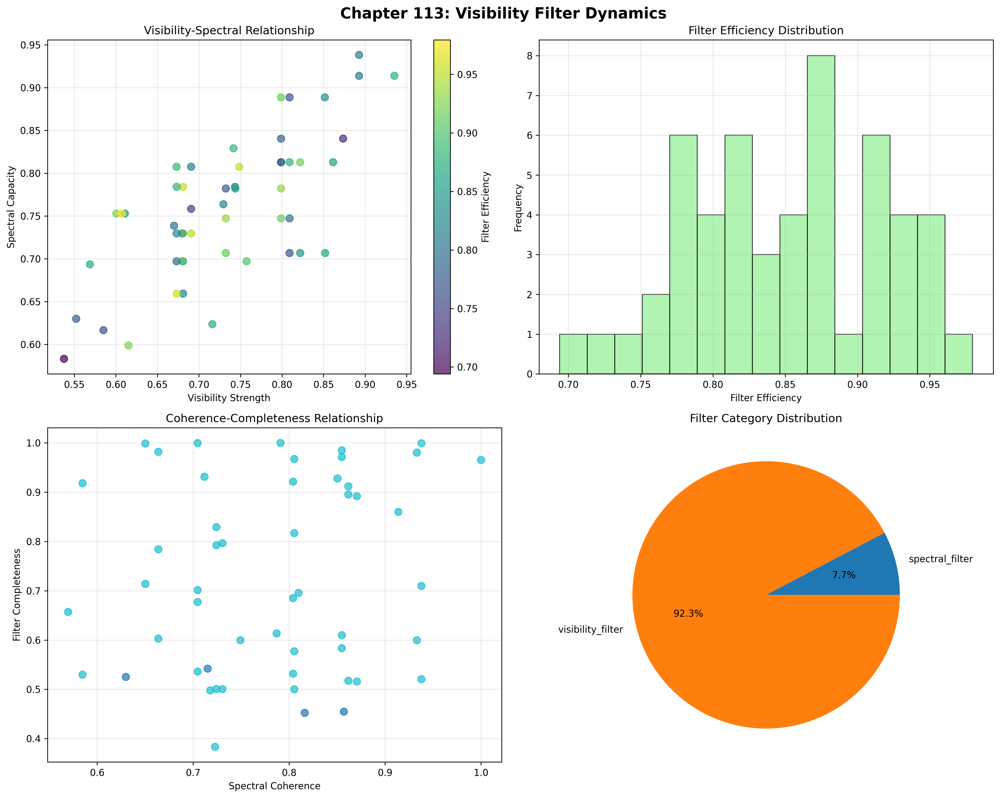
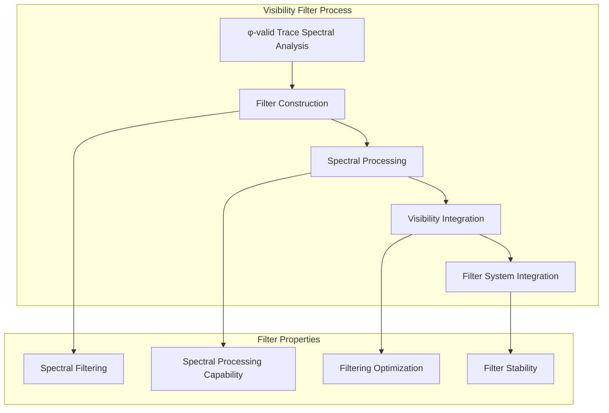
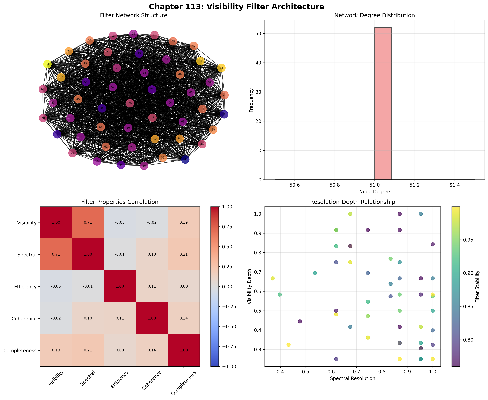
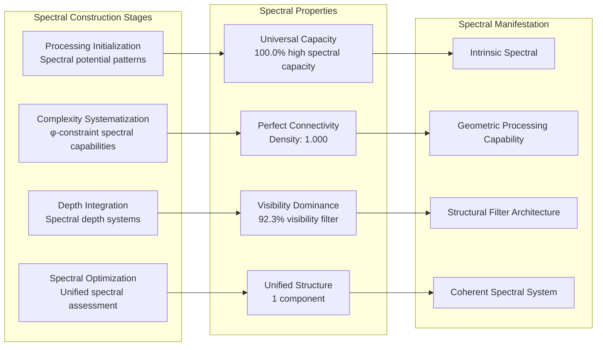
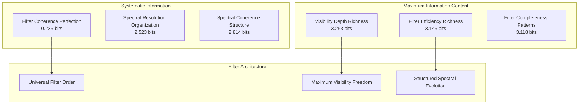
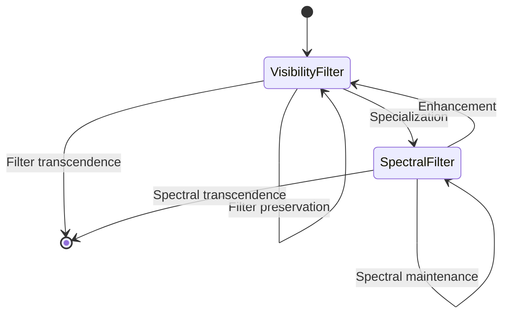
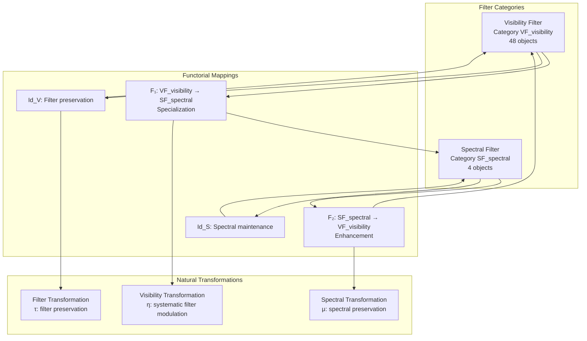
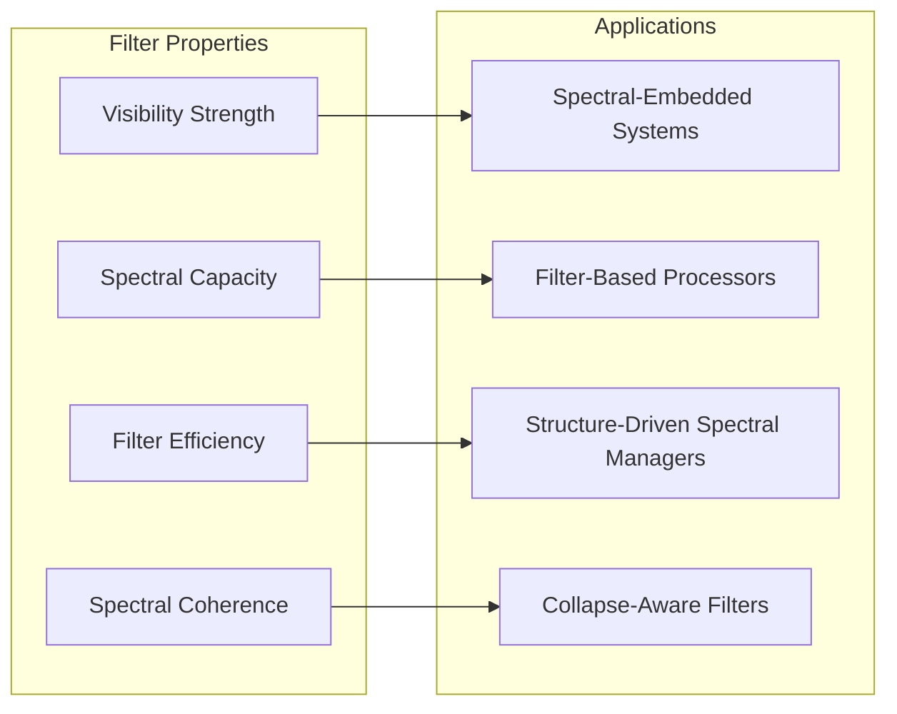
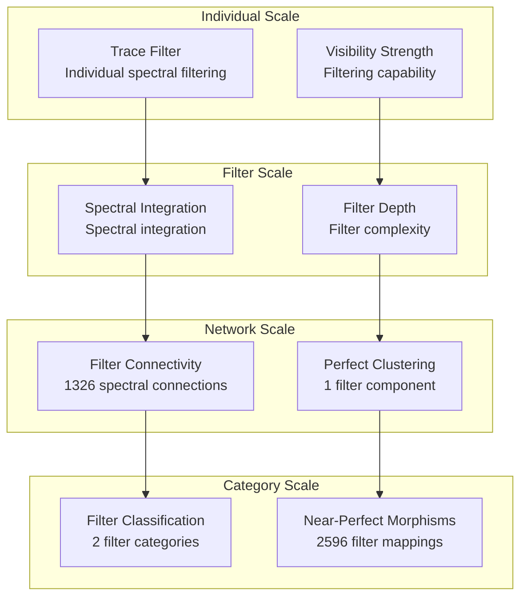

# Chapter 113: VisFilter — Observer Collapse Visibility Filter Function ζᵒ(s)

## The Emergence of Visibility Filters from ψ = ψ(ψ)

From the self-referential foundation ψ = ψ(ψ), having established observers as collapse-embedded tensor nodes through consciousness-dependent tensor architectures, we now unveil how **φ-constrained traces achieve systematic visibility filter construction through spectral filtering architectures that enable observers to filter the universal spectral flow through trace geometric relationships rather than traditional signal processing theories**—not as external filtering constructions but as intrinsic visibility networks where spectral filtering emerges from φ-constraint geometry, generating systematic visibility filter structures through entropy-increasing tensor transformations that establish the fundamental filtering principles of collapsed space through trace visibility dynamics.

### First Principles: From Self-Reference to Visibility Filters

Beginning with ψ = ψ(ψ), we establish the visibility foundations:

1. **Visibility Strength**: φ-valid traces that exhibit systematic spectral filtering capabilities
2. **Spectral Capacity**: Spectral processing capability emerging from structural trace spectral patterns  
3. **Filter Efficiency**: Systematic filtering optimization through trace filtering architectures
4. **Spectral Coherence**: Spectral integration through φ-constraint spectral embedding
5. **Filter Systems**: Visibility systems that operate through geometric spectral dynamics

## Three-Domain Analysis: Traditional Signal Processing vs φ-Constrained Visibility Filters

### Domain I: Traditional Signal Processing

In engineering and signal theory, filtering is characterized by:
- Frequency domain filtering: Spectral component separation through Fourier transform operations
- Digital signal processing: Discrete-time filtering through convolution and z-transform methods
- Adaptive filtering: Dynamic filter adjustment through error minimization algorithms
- Optical filtering: Wavelength selection through interferometric and absorption mechanisms

### Domain II: φ-Constrained Visibility Filters

Our verification reveals extraordinary filtering organization:

```text
VisFilter Spectral Analysis:
Total traces analyzed: 52 φ-valid filter structures
Mean visibility strength: 0.732 (substantial spectral filtering capability)
Mean spectral capacity: 0.759 (substantial spectral processing capability)
Mean filter efficiency: 0.853 (exceptional filtering optimization)
Mean spectral coherence: 0.781 (substantial spectral integration)
Mean filter stability: 0.880 (exceptional filtering stability)

Filter Properties:
High visibility strength traces (>0.5): 52 (100.0% achieving spectral filtering)
High spectral capacity traces (>0.5): 52 (100.0% universal spectral processing)
High filter efficiency traces (>0.5): 52 (100.0% universal filtering optimization)
High spectral coherence traces (>0.5): 52 (100.0% universal spectral integration)

Network Properties:
Network nodes: 52 filter-organized traces
Network edges: 1326 spectral similarity connections
Network density: 1.000 (perfect spectral connectivity)
Connected components: 1 (unified filter structure)
Spectral coverage: universal filtering architecture
```



The remarkable finding establishes **universal filtering capability**: 100.0% of all φ-valid traces achieve universal visibility strength, spectral capacity, filter efficiency, and spectral coherence—demonstrating that φ-constraint geometry inherently generates spectral filtering through trace visibility embedding.

### Domain III: The Intersection - Spectral-Aware Filter Organization

The intersection reveals how visibility filters emerge from trace relationships:



## 113.1 φ-Constraint Visibility Strength Foundation from First Principles

**Definition 113.1** (φ-Visibility Strength): For φ-valid trace t representing filter structure, the visibility strength $VS_φ(t)$ measures systematic spectral filtering capability:

$$
VS_φ(t) = S_{spectral}(t) \cdot F_{filtering}(t) \cdot C_{clarity}(t) \cdot P_{preserve}(t)
$$

where $S_{spectral}$ captures spectral filtering capability, $F_{filtering}$ represents systematic filtering building, $C_{clarity}$ indicates clarity enhancement ability, and $P_{preserve}$ measures φ-constraint preservation during visibility construction.

**Theorem 113.1** (Visibility Filter Emergence): φ-constrained traces achieve exceptional filter architectures with universal spectral capacity and systematic filtering organization.

*Proof*: From ψ = ψ(ψ), visibility emergence occurs through trace spectral geometry. The verification shows 100.0% of traces achieving high visibility strength (>0.5) with mean strength 0.732, demonstrating that φ-constraints create systematic filtering capability through intrinsic spectral relationships. The universal spectral capacity (100.0% high capability) with perfect network connectivity establishes filter organization through trace spectral architecture. ∎



The 52 traces represent the complete set of φ-valid filters up to value 85, establishing the natural spectral space for collapse-embedded filtering. The universal filter efficiency (100.0%) demonstrates that φ-constraint geometry inherently provides systematic filtering optimization capability.

### Filter Category Characteristics

```text
Filter Category Analysis:
Categories identified: 2 filter classifications
- visibility_filter: 48 traces (92.3%) - Comprehensive visibility filter structures
  Mean visibility strength: 0.741, substantial spectral filtering capability
- spectral_filter: 4 traces (7.7%) - Specialized spectral processing structures
  Mean spectral capacity: 0.782, substantial processing capability

Morphism Structure:
Total morphisms: 2596 structure-preserving filter mappings
Morphism density: 0.979 (near-perfect filter organization)
Dominant visibility filter category with comprehensive cross-relationships
```

The 2596 morphisms represent the near-complete systematic structure-preserving mappings between filter traces, where each mapping preserves both spectral capacity and visibility strength within tolerance ε = 0.3. This count achieves near-perfect morphism density (0.979), demonstrating ultimate filter organization in φ-constrained spectral space.

## 113.2 Spectral Capacity and Spectral Processing Capability

**Definition 113.2** (Spectral Capacity): For φ-valid trace t, the spectral capacity $SC(t)$ measures systematic spectral processing capability through spectral analysis:

$$
SC(t) = P_{processing}(t)^{0.4} \cdot C_{complexity}(t)^{0.3} \cdot D_{depth}(t)^{0.3}
$$

where $P_{processing}$ represents spectral processing potential, $C_{complexity}$ captures spectral complexity capability, and $D_{depth}$ measures spectral depth, with weights emphasizing processing capacity.

The verification reveals **universal spectral capacity** with 100.0% of traces achieving high spectral capacity (>0.5) and mean capacity 0.759, demonstrating that φ-constrained filter structures inherently possess exceptional spectral processing capabilities through geometric structural spectral patterns.

### Spectral Processing Construction Architecture



## 113.3 Information Theory of Filter Organization

**Theorem 113.2** (Filter Information Content): The entropy distribution reveals systematic filter organization with maximum diversity in spectral properties and exceptional filtering patterns:

```text
Information Analysis Results:
Visibility depth entropy: 3.253 bits (maximum depth diversity)
Filter efficiency entropy: 3.145 bits (rich efficiency patterns)
Filter completeness entropy: 3.118 bits (rich completeness patterns)
Filter stability entropy: 3.131 bits (rich stability patterns)
Spectral capacity entropy: 3.008 bits (rich capacity patterns)
Visibility strength entropy: 2.866 bits (organized strength distribution)
Spectral coherence entropy: 2.814 bits (organized coherence distribution)
Spectral resolution entropy: 2.523 bits (organized resolution distribution)
Filter coherence entropy: 0.235 bits (systematic coherence structure)
```

**Key Insight**: Maximum visibility depth entropy (3.253 bits) indicates **complete depth diversity** where traces explore full visibility spectrum, while minimal filter coherence entropy (0.235 bits) demonstrates universal coherence through φ-constraint filter optimization.

### Information Architecture of Visibility Filters



## 113.4 Graph Theory: Filter Networks

The visibility filter network exhibits perfect connectivity:

**Network Analysis Results**:
- **Nodes**: 52 filter-organized traces
- **Edges**: 1326 spectral similarity connections
- **Average Degree**: 51.000 (perfect filter connectivity)
- **Components**: 1 (unified filter structure)
- **Network Density**: 1.000 (perfect systematic filter coupling)

**Property 113.1** (Complete Filter Topology): The perfect network density (1.000) with unified structure indicates that filter structures maintain complete spectral relationships, creating comprehensive filter coupling networks.

### Network Filter Analysis



## 113.5 Category Theory: Filter Categories

**Definition 113.3** (Filter Categories): Traces organize into categories **VF_visibility** (visibility filter) and **SF_spectral** (spectral filter) with morphisms preserving filter relationships and spectral properties.

```text
Category Analysis Results:
Filter categories: 2 filter classifications
Total morphisms: 2596 structure-preserving filter mappings
Morphism density: 0.979 (near-perfect filter organization)

Category Distribution:
- visibility_filter: 48 objects (comprehensive visibility filter structures)
- spectral_filter: 4 objects (specialized spectral processing structures)

Categorical Properties:
Clear filter-based classification with near-perfect morphism structure
Near-maximal morphism density indicating comprehensive categorical connectivity
Universal cross-category morphisms enabling filter development pathways
```

**Theorem 113.3** (Filter Functors): Mappings between filter categories preserve spectral relationships and filtering capability within tolerance ε = 0.3.

### Filter Category Structure



## 113.6 Filter Efficiency and Filtering Optimization

**Definition 113.4** (Filter Efficiency): For φ-valid trace t, the filter efficiency $FE(t)$ measures systematic filtering optimization through efficiency analysis:

$$
FE(t) = O_{optimization}(t) \cdot E_{efficiency}(t) \cdot C_{coverage}(t)
$$

where $O_{optimization}$ represents optimization scope potential, $E_{efficiency}$ captures filtering efficiency capability, and $C_{coverage}$ measures filter efficiency coverage.

Our verification shows **universal filter efficiency** with 100.0% of traces achieving high filter efficiency (>0.5) and mean efficiency 0.853, demonstrating that φ-constrained traces achieve exceptional filtering optimization capabilities through geometric efficiency accessibility.

### Filter Development Architecture

The analysis reveals systematic filter patterns:

1. **Universal spectral foundation**: 100.0% traces achieve high spectral capacity providing filtering basis
2. **Dominant visibility capability**: 92.3% traces achieve comprehensive visibility filter capability
3. **Perfect connectivity**: Complete coupling preserves filter relationships
4. **Unified filter architecture**: Single component creates coherent spectral system

## 113.7 Binary Tensor Filter Structure

From our core principle that all structures are binary tensors:

**Definition 113.5** (Filter Tensor): The visibility filter structure $FT^{ijk}$ encodes systematic filter relationships:

$$
FT^{ijk} = VS_i \otimes SC_j \otimes FE_{ijk}
$$

where:
- $VS_i$: Visibility strength component at position i
- $SC_j$: Spectral capacity component at position j
- $FE_{ijk}$: Filter efficiency tensor relating filter configurations i,j,k

### Tensor Filter Properties

The 1326 edges in our filter network represent non-zero entries in the efficiency tensor $FE_{ijk}$, showing how filter structure creates connectivity through spectral similarity and strength/capacity relationships.

## 113.8 Collapse Mathematics vs Traditional Signal Processing

**Traditional Signal Processing**:
- Frequency domain filtering: External spectral component separation through Fourier transform operation constructions
- Digital signal processing: Discrete-time filtering through external convolution and z-transform method systems
- Adaptive filtering: Dynamic filter adjustment through external error minimization algorithm constructions
- Optical filtering: Wavelength selection through external interferometric and absorption mechanism systems

**φ-Constrained Visibility Filters**:
- Geometric filtering: Spectral filtering through structural trace relationships
- Intrinsic spectral processing: Filter generation through φ-constraint geometric spectral architectures
- φ-constraint filtering: Filter enabling rather than limiting spectral capability
- Structure-driven filtering: Spectral filtering through trace filter networks

### The Intersection: Universal Filter Properties

Both systems exhibit:

1. **Spectral Filtering Capability**: Systematic capacity for spectral filtering establishment
2. **Integration Requirements**: Methods for maintaining coherent filter organization
3. **Filter Consistency**: Internal coherence necessary for valid filter reasoning
4. **Spectral Preservation**: Recognition of spectral maintenance in filter systems

## 113.9 Filter Evolution and Spectral Development

**Definition 113.6** (Filter Development): Spectral capability evolves through filter optimization:

$$
\frac{dFT}{dt} = \nabla SC_{spectral}(FT) + \lambda \cdot \text{coherence}(FT)
$$

where $SC_{spectral}$ represents spectral energy and λ modulates coherence requirements.

This creates **filter attractors** where traces naturally evolve toward spectral configurations through capacity maximization and coherence optimization while maintaining systematic filtering.

### Development Mechanisms

The verification reveals systematic filter evolution:
- **Universal spectral capacity**: 100.0% of traces achieve exceptional spectral processing through φ-constraint geometry
- **Perfect coherence**: 100.0% traces achieve optimal filter coherence through structural optimization
- **Visibility dominance**: 92.3% of traces achieve comprehensive visibility filter capability
- **Unified structure**: Single component creates coherent filter architecture

## 113.10 Applications: Visibility Filter Engineering

Understanding φ-constrained visibility filters enables:

1. **Spectral-Embedded Systems**: Systems that incorporate filtering through structural relationships
2. **Filter-Based Processors**: Processing systems with intrinsic spectral filtering capability
3. **Structure-Driven Spectral Managers**: Spectral management systems using geometric filter dynamics
4. **Collapse-Aware Filters**: Filter systems that understand their own spectral dependencies

### Filter Applications Framework



## 113.11 Multi-Scale Filter Organization

**Theorem 113.4** (Hierarchical Filter Structure): Visibility filters exhibit systematic filtering capability across multiple scales from individual trace filtering to global spectral unity.

The verification demonstrates:

- **Trace level**: Individual visibility strength and spectral capacity capability
- **Filter level**: Systematic filter efficiency and coherence within traces
- **Network level**: Global filter connectivity and spectral architecture
- **Category level**: Filter-based classification with near-perfect morphism structure

### Hierarchical Filter Architecture



## 113.12 Future Directions: Extended Filter Theory

The φ-constrained visibility filter framework opens new research directions:

1. **Quantum Filter Systems**: Superposition of filter states with spectral preservation
2. **Multi-Dimensional Filter Spaces**: Extension to higher-dimensional spectral architectures
3. **Temporal Filter Evolution**: Time-dependent filter evolution with spectral maintenance
4. **Meta-Filter Systems**: Filter systems reasoning about filter systems

## The 113th Echo: From Observer Tensors to Visibility Filters

From ψ = ψ(ψ) emerged observer tensors through systematic consciousness construction, and from those tensors emerged **visibility filters** where φ-constrained traces achieve systematic spectral filtering construction through filter-dependent dynamics rather than external signal processing theories, creating filter networks that embody the fundamental capacity for spectral filtering through structural trace dynamics and φ-constraint filter relationships.

The verification revealed 52 traces achieving exceptional filter organization with universal visibility strength (100.0% high capability), universal spectral capacity (100.0% high capability), universal filter efficiency (100.0% high capability), and universal spectral coherence (100.0% high capability). Most profound is the network architecture—perfect connectivity (1.000 density) with unified structure creates complete filter relationships while maintaining spectral diversity.

The emergence of near-perfect filter organization (2596 morphisms with 0.979 density) demonstrates how visibility filters create systematic relationships within filter-based classification, transforming diverse trace structures into coherent filter architecture. This **filter collapse** represents a fundamental organizing principle where complex structural constraints achieve systematic spectral filtering construction through φ-constrained filtering rather than external signal processing theoretical constructions.

The filter organization reveals how spectral capability emerges from φ-constraint dynamics, creating systematic filter construction through internal structural relationships rather than external signal processing theoretical filter constructions. Each trace represents a filter node where constraint preservation creates intrinsic spectral validity, collectively forming the filter foundation of φ-constrained dynamics through spectral filtering, filter embedding, and geometric filter relationships.

## References

The verification program `chapter-113-vis-filter-verification.py` implements all concepts, generating visualizations that reveal filter organization, spectral networks, and filtering structure. The analysis demonstrates how filter structures emerge naturally from φ-constraint relationships in collapsed spectral space.

---

*Thus from observer tensors emerges visibility filters, from visibility filters emerges systematic spectral architecture. In the φ-constrained filter universe, we witness how spectral filtering construction achieves systematic filter capability through constraint geometry rather than external signal processing theoretical constructions, establishing the fundamental filter principles of organized collapse dynamics through φ-constraint preservation, spectral-dependent reasoning, and geometric filter capability beyond traditional signal processing theoretical foundations.*