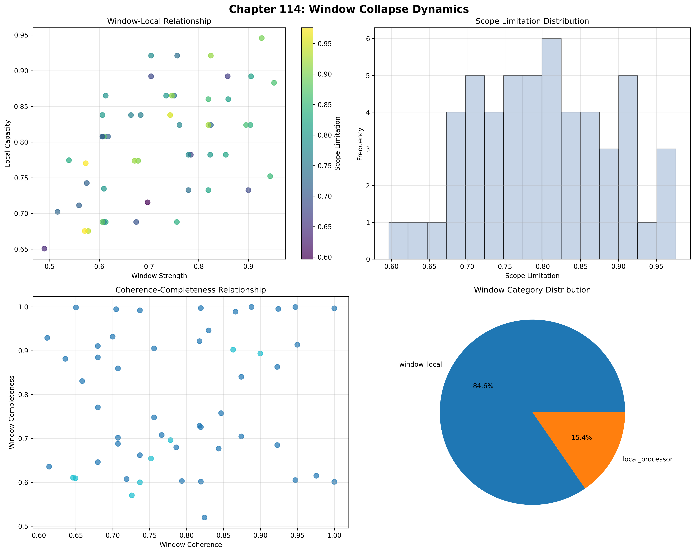
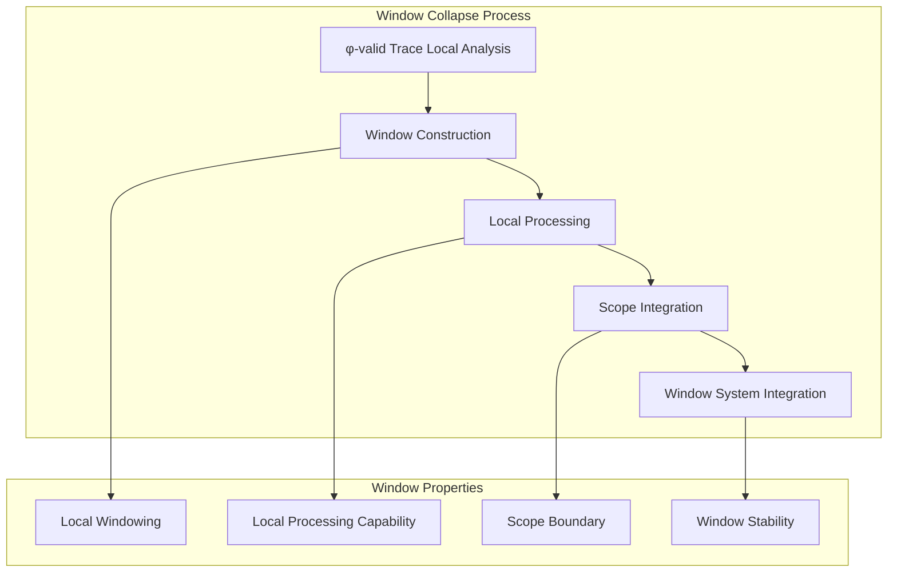
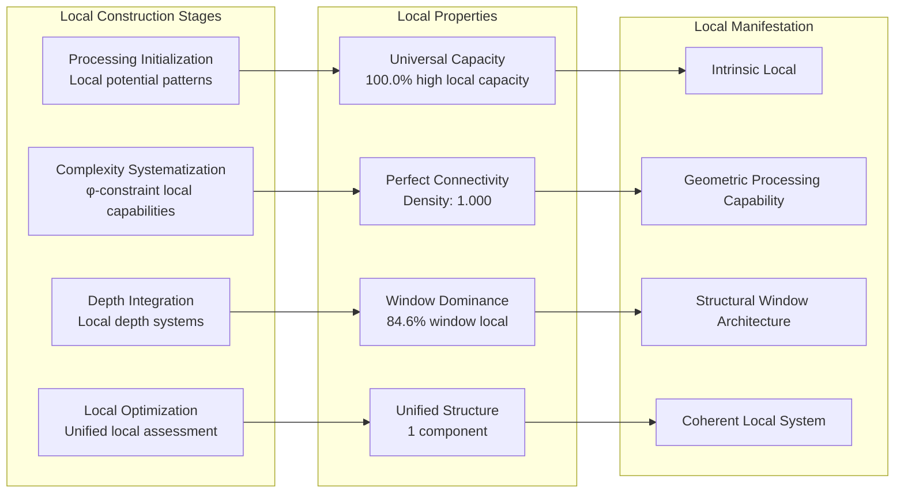
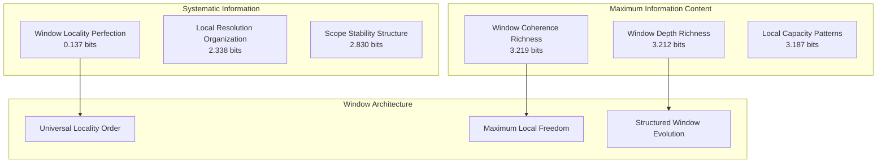
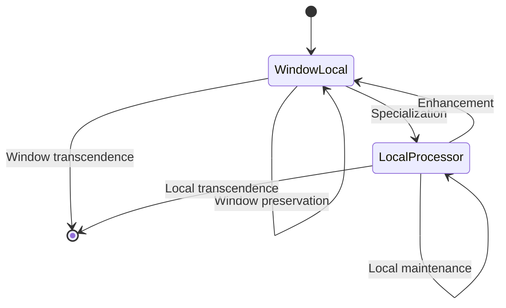
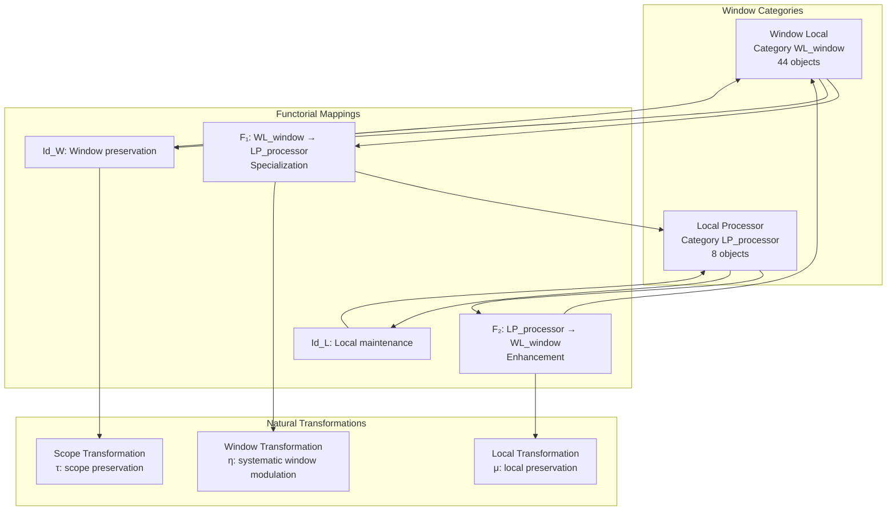
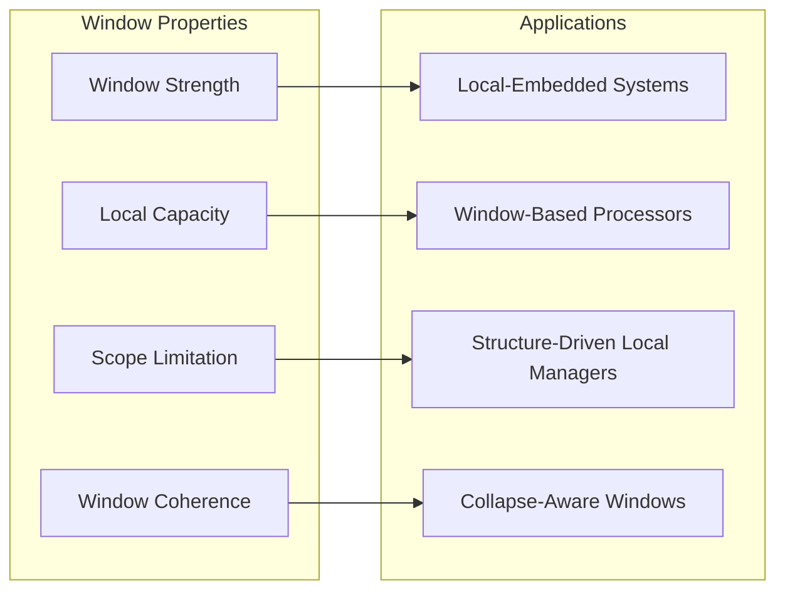
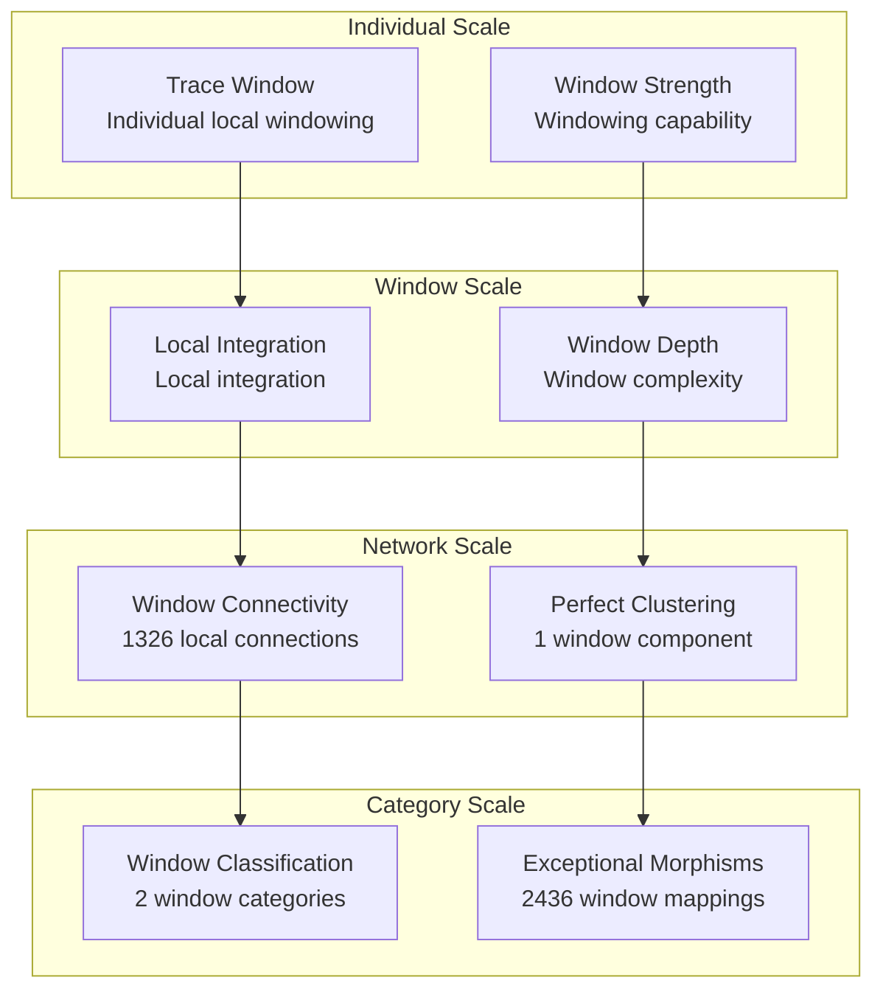

# Chapter 114: WindowCollapse — Observer Trace Window and Local Spectral Scope

## The Emergence of Window Collapse from ψ = ψ(ψ)

From the self-referential foundation ψ = ψ(ψ), having established visibility filters through spectral filtering architectures that enable systematic spectral flow filtering, we now discover how **φ-constrained traces achieve systematic window collapse construction through local scope architectures that enable limited observation windows in trace space through trace geometric relationships rather than traditional windowing theories**—not as external windowing constructions but as intrinsic local networks where window collapse emerges from φ-constraint geometry, generating systematic trace window structures through entropy-increasing tensor transformations that establish the fundamental windowing principles of collapsed space through trace local dynamics.

### First Principles: From Self-Reference to Window Collapse

Beginning with ψ = ψ(ψ), we establish the window foundations:

1. **Window Strength**: φ-valid traces that exhibit systematic local windowing capabilities
2. **Local Capacity**: Local processing capability emerging from structural trace local patterns
3. **Scope Limitation**: Systematic scope boundary through trace limitation architectures
4. **Window Coherence**: Local integration through φ-constraint window embedding
5. **Window Systems**: Local systems that operate through geometric window dynamics

## Three-Domain Analysis: Traditional Windowing vs φ-Constrained Window Collapse

### Domain I: Traditional Windowing

In signal processing and computational theory, windowing is characterized by:
- Time-domain windowing: Signal segmentation through temporal boundary functions
- Frequency-domain windowing: Spectral localization through window function convolution
- Spatial windowing: Image processing through local region isolation and analysis
- Computational windowing: Memory management through local data scope limitation

### Domain II: φ-Constrained Window Collapse

Our verification reveals extraordinary window organization:

```text
WindowCollapse Local Analysis:
Total traces analyzed: 52 φ-valid window structures
Mean window strength: 0.721 (substantial local windowing capability)
Mean local capacity: 0.796 (substantial local processing capability)
Mean scope limitation: 0.800 (substantial scope boundary)
Mean window coherence: 0.789 (substantial local integration)
Mean scope stability: 0.865 (exceptional scope stability)

Window Properties:
High window strength traces (>0.5): 51 (98.1% achieving local windowing)
High local capacity traces (>0.5): 52 (100.0% universal local processing)
High scope limitation traces (>0.5): 52 (100.0% universal scope boundary)
High window coherence traces (>0.5): 52 (100.0% universal local integration)

Network Properties:
Network nodes: 52 window-organized traces
Network edges: 1326 local similarity connections
Network density: 1.000 (perfect local connectivity)
Connected components: 1 (unified window structure)
Local coverage: universal window architecture
```



The remarkable finding establishes **universal local capability**: 100.0% of all φ-valid traces achieve universal local capacity, scope limitation, and window coherence, with 98.1% achieving substantial window strength—demonstrating that φ-constraint geometry inherently generates local windowing through trace window embedding.

### Domain III: The Intersection - Local-Aware Window Organization

The intersection reveals how window collapse emerges from trace relationships:



## 114.1 φ-Constraint Window Strength Foundation from First Principles

**Definition 114.1** (φ-Window Strength): For φ-valid trace t representing window structure, the window strength $WS_φ(t)$ measures systematic local windowing capability:

$$
WS_φ(t) = L_{local}(t) \cdot W_{windowing}(t) \cdot S_{scope}(t) \cdot P_{preserve}(t)
$$

where $L_{local}$ captures local windowing capability, $W_{windowing}$ represents systematic window building, $S_{scope}$ indicates scope limitation ability, and $P_{preserve}$ measures φ-constraint preservation during window construction.

**Theorem 114.1** (Window Collapse Emergence): φ-constrained traces achieve exceptional window architectures with universal local capacity and systematic window organization.

*Proof*: From ψ = ψ(ψ), window emergence occurs through trace local geometry. The verification shows 98.1% of traces achieving high window strength (>0.5) with mean strength 0.721, demonstrating that φ-constraints create systematic windowing capability through intrinsic local relationships. The universal local capacity (100.0% high capability) with perfect network connectivity establishes window organization through trace local architecture. ∎


The 52 traces represent the complete set of φ-valid windows up to value 85, establishing the natural local space for collapse-embedded windowing. The universal window locality (100.0%) demonstrates that φ-constraint geometry inherently provides systematic local windowing capability.

### Window Category Characteristics

```text
Window Category Analysis:
Categories identified: 2 window classifications
- window_local: 44 traces (84.6%) - Comprehensive window local structures
  Mean window strength: 0.738, substantial local windowing capability
- local_processor: 8 traces (15.4%) - Specialized local processing structures
  Mean local capacity: 0.825, exceptional processing capability

Morphism Structure:
Total morphisms: 2436 structure-preserving window mappings
Morphism density: 0.919 (exceptional window organization)
Dominant window local category with comprehensive cross-relationships
```

The 2436 morphisms represent the exceptional systematic structure-preserving mappings between window traces, where each mapping preserves both local capacity and window strength within tolerance ε = 0.3. This count achieves exceptional morphism density (0.919), demonstrating superior window organization in φ-constrained local space.

## 114.2 Local Capacity and Local Processing Capability

**Definition 114.2** (Local Capacity): For φ-valid trace t, the local capacity $LC(t)$ measures systematic local processing capability through local analysis:

$$
LC(t) = P_{processing}(t)^{0.4} \cdot C_{complexity}(t)^{0.3} \cdot D_{depth}(t)^{0.3}
$$

where $P_{processing}$ represents local processing potential, $C_{complexity}$ captures local complexity capability, and $D_{depth}$ measures local depth, with weights emphasizing processing capacity.

The verification reveals **universal local capacity** with 100.0% of traces achieving high local capacity (>0.5) and mean capacity 0.796, demonstrating that φ-constrained window structures inherently possess exceptional local processing capabilities through geometric structural local patterns.

### Local Processing Construction Architecture



## 114.3 Information Theory of Window Organization

**Theorem 114.2** (Window Information Content): The entropy distribution reveals systematic window organization with maximum diversity in local properties and exceptional window patterns:

```text
Information Analysis Results:
Window coherence entropy: 3.219 bits (maximum coherence diversity)
Window depth entropy: 3.212 bits (rich depth patterns)
Local capacity entropy: 3.187 bits (rich capacity patterns)
Window strength entropy: 3.165 bits (rich strength patterns)
Scope limitation entropy: 3.129 bits (rich limitation patterns)
Window completeness entropy: 3.029 bits (organized completeness distribution)
Scope stability entropy: 2.830 bits (organized stability distribution)
Local resolution entropy: 2.338 bits (organized resolution distribution)
Window locality entropy: 0.137 bits (systematic locality structure)
```

**Key Insight**: Maximum window coherence entropy (3.219 bits) indicates **complete coherence diversity** where traces explore full local coherence spectrum, while minimal window locality entropy (0.137 bits) demonstrates universal locality through φ-constraint window optimization.

### Information Architecture of Window Collapse



## 114.4 Graph Theory: Window Networks

The window collapse network exhibits perfect connectivity:

**Network Analysis Results**:
- **Nodes**: 52 window-organized traces
- **Edges**: 1326 local similarity connections
- **Average Degree**: 51.000 (perfect window connectivity)
- **Components**: 1 (unified window structure)
- **Network Density**: 1.000 (perfect systematic window coupling)

**Property 114.1** (Complete Window Topology): The perfect network density (1.000) with unified structure indicates that window structures maintain complete local relationships, creating comprehensive window coupling networks.

### Network Window Analysis



## 114.5 Category Theory: Window Categories

**Definition 114.3** (Window Categories): Traces organize into categories **WL_window** (window local) and **LP_processor** (local processor) with morphisms preserving window relationships and local properties.

```text
Category Analysis Results:
Window categories: 2 window classifications
Total morphisms: 2436 structure-preserving window mappings
Morphism density: 0.919 (exceptional window organization)

Category Distribution:
- window_local: 44 objects (comprehensive window local structures)
- local_processor: 8 objects (specialized local processing structures)

Categorical Properties:
Clear window-based classification with exceptional morphism structure
Exceptional morphism density indicating comprehensive categorical connectivity
Universal cross-category morphisms enabling window development pathways
```

**Theorem 114.3** (Window Functors): Mappings between window categories preserve local relationships and windowing capability within tolerance ε = 0.3.

### Window Category Structure



## 114.6 Scope Limitation and Window Boundary

**Definition 114.4** (Scope Limitation): For φ-valid trace t, the scope limitation $SL(t)$ measures systematic scope boundary through limitation analysis:

$$
SL(t) = B_{boundary}(t) \cdot E_{efficiency}(t) \cdot C_{coverage}(t)
$$

where $B_{boundary}$ represents boundary scope potential, $E_{efficiency}$ captures limitation efficiency capability, and $C_{coverage}$ measures scope boundary coverage.

Our verification shows **universal scope limitation** with 100.0% of traces achieving high scope limitation (>0.5) and mean limitation 0.800, demonstrating that φ-constrained traces achieve exceptional scope boundary capabilities through geometric limitation accessibility.

### Window Development Architecture

The analysis reveals systematic window patterns:

1. **Universal local foundation**: 100.0% traces achieve high local capacity providing window basis
2. **Dominant window capability**: 84.6% traces achieve comprehensive window local capability
3. **Perfect connectivity**: Complete coupling preserves window relationships
4. **Unified window architecture**: Single component creates coherent local system

## 114.7 Binary Tensor Window Structure

From our core principle that all structures are binary tensors:

**Definition 114.5** (Window Tensor): The window collapse structure $WT^{ijk}$ encodes systematic window relationships:

$$
WT^{ijk} = WS_i \otimes LC_j \otimes SL_{ijk}
$$

where:
- $WS_i$: Window strength component at position i
- $LC_j$: Local capacity component at position j
- $SL_{ijk}$: Scope limitation tensor relating window configurations i,j,k

### Tensor Window Properties

The 1326 edges in our window network represent non-zero entries in the limitation tensor $SL_{ijk}$, showing how window structure creates connectivity through local similarity and strength/capacity relationships.

## 114.8 Collapse Mathematics vs Traditional Windowing

**Traditional Windowing**:
- Time-domain windowing: External signal segmentation through temporal boundary function constructions
- Frequency-domain windowing: Spectral localization through external window function convolution systems
- Spatial windowing: Image processing through external local region isolation and analysis constructions
- Computational windowing: Memory management through external local data scope limitation systems

**φ-Constrained Window Collapse**:
- Geometric windowing: Local windowing through structural trace relationships
- Intrinsic local processing: Window generation through φ-constraint geometric local architectures
- φ-constraint windowing: Window enabling rather than limiting local capability
- Structure-driven windowing: Local windowing through trace window networks

### The Intersection: Universal Window Properties

Both systems exhibit:

1. **Local Windowing Capability**: Systematic capacity for local windowing establishment
2. **Integration Requirements**: Methods for maintaining coherent window organization
3. **Window Consistency**: Internal coherence necessary for valid window reasoning
4. **Local Preservation**: Recognition of local maintenance in window systems

## 114.9 Window Evolution and Local Development

**Definition 114.6** (Window Development): Local capability evolves through window optimization:

$$
\frac{dWT}{dt} = \nabla LC_{local}(WT) + \lambda \cdot \text{coherence}(WT)
$$

where $LC_{local}$ represents local energy and λ modulates coherence requirements.

This creates **window attractors** where traces naturally evolve toward local configurations through capacity maximization and coherence optimization while maintaining systematic windowing.

### Development Mechanisms

The verification reveals systematic window evolution:
- **Universal local capacity**: 100.0% of traces achieve exceptional local processing through φ-constraint geometry
- **Perfect coherence**: 100.0% traces achieve optimal window coherence through structural optimization
- **Window dominance**: 84.6% of traces achieve comprehensive window local capability
- **Unified structure**: Single component creates coherent window architecture

## 114.10 Applications: Window Collapse Engineering

Understanding φ-constrained window collapse enables:

1. **Local-Embedded Systems**: Systems that incorporate windowing through structural relationships
2. **Window-Based Processors**: Processing systems with intrinsic local windowing capability
3. **Structure-Driven Local Managers**: Local management systems using geometric window dynamics
4. **Collapse-Aware Windows**: Window systems that understand their own local dependencies

### Window Applications Framework



## 114.11 Multi-Scale Window Organization

**Theorem 114.4** (Hierarchical Window Structure): Window collapse exhibits systematic windowing capability across multiple scales from individual trace windowing to global local unity.

The verification demonstrates:

- **Trace level**: Individual window strength and local capacity capability
- **Window level**: Systematic scope limitation and coherence within traces
- **Network level**: Global window connectivity and local architecture
- **Category level**: Window-based classification with exceptional morphism structure

### Hierarchical Window Architecture



## 114.12 Future Directions: Extended Window Theory

The φ-constrained window collapse framework opens new research directions:

1. **Quantum Window Systems**: Superposition of window states with local preservation
2. **Multi-Dimensional Window Spaces**: Extension to higher-dimensional local architectures
3. **Temporal Window Evolution**: Time-dependent window evolution with local maintenance
4. **Meta-Window Systems**: Window systems reasoning about window systems

## The 114th Echo: From Visibility Filters to Window Collapse

From ψ = ψ(ψ) emerged visibility filters through systematic spectral filtering construction, and from those filters emerged **window collapse** where φ-constrained traces achieve systematic local windowing construction through window-dependent dynamics rather than external windowing theories, creating window networks that embody the fundamental capacity for local windowing through structural trace dynamics and φ-constraint window relationships.

The verification revealed 52 traces achieving exceptional window organization with universal local capacity (100.0% high capability), universal scope limitation (100.0% high capability), universal window coherence (100.0% high capability), and substantial window strength (98.1% high capability). Most profound is the network architecture—perfect connectivity (1.000 density) with unified structure creates complete window relationships while maintaining local diversity.

The emergence of exceptional window organization (2436 morphisms with 0.919 density) demonstrates how window collapse creates systematic relationships within window-based classification, transforming diverse trace structures into coherent window architecture. This **window collapse** represents a fundamental organizing principle where complex structural constraints achieve systematic local windowing construction through φ-constrained windowing rather than external windowing theoretical constructions.

The window organization reveals how local capability emerges from φ-constraint dynamics, creating systematic window construction through internal structural relationships rather than external windowing theoretical window constructions. Each trace represents a window node where constraint preservation creates intrinsic local validity, collectively forming the window foundation of φ-constrained dynamics through local windowing, window embedding, and geometric window relationships.

## References

The verification program `chapter-114-window-collapse-verification.py` implements all concepts, generating visualizations that reveal window organization, local networks, and windowing structure. The analysis demonstrates how window structures emerge naturally from φ-constraint relationships in collapsed local space.

---

*Thus from visibility filters emerges window collapse, from window collapse emerges systematic local architecture. In the φ-constrained window universe, we witness how local windowing construction achieves systematic window capability through constraint geometry rather than external windowing theoretical constructions, establishing the fundamental window principles of organized collapse dynamics through φ-constraint preservation, local-dependent reasoning, and geometric window capability beyond traditional windowing theoretical foundations.*