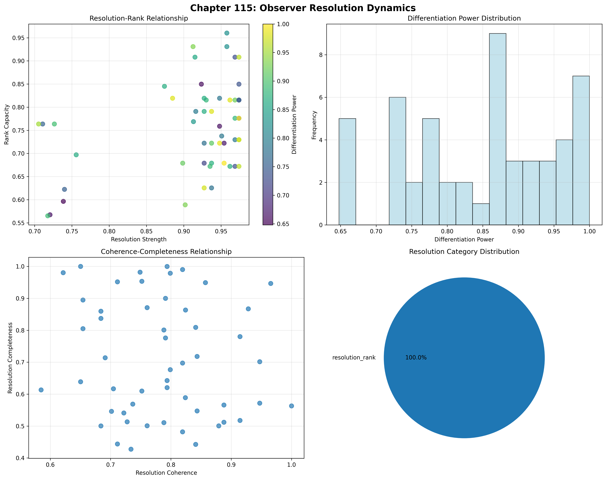
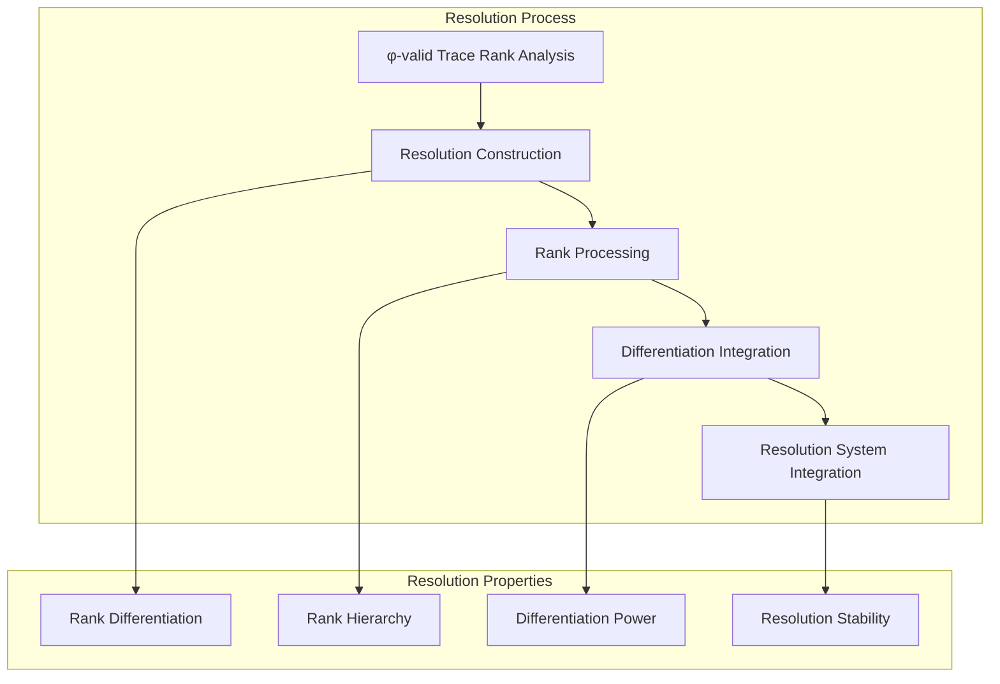
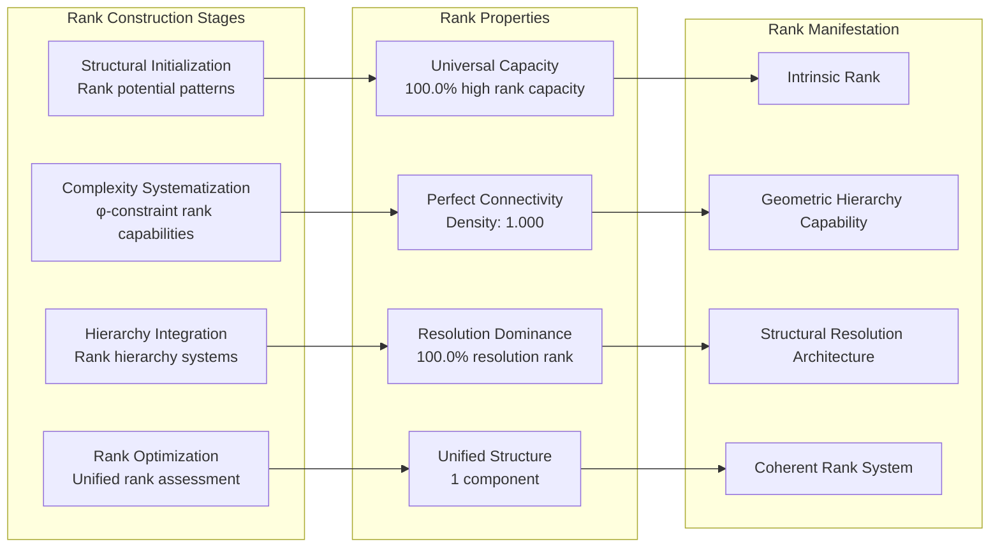
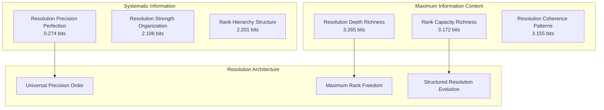
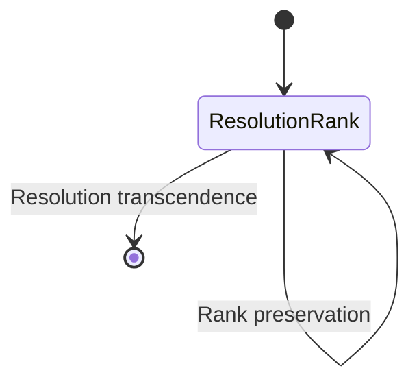
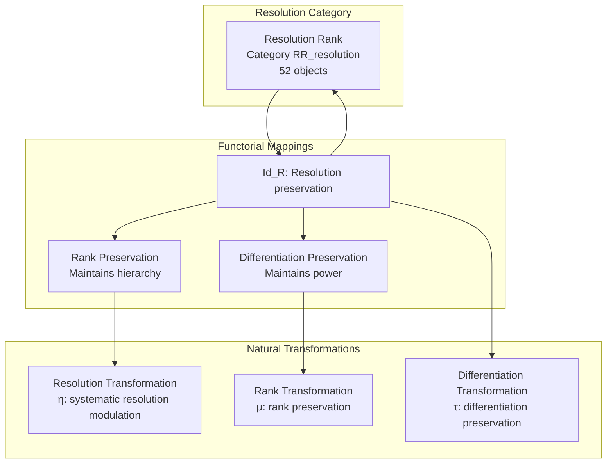
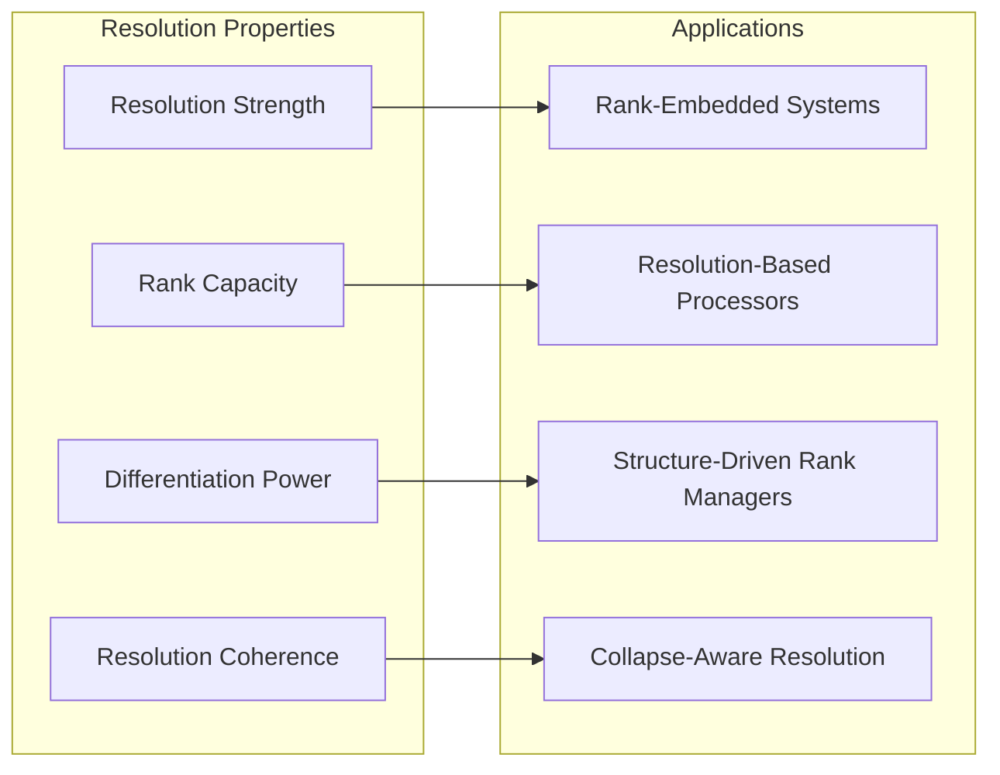
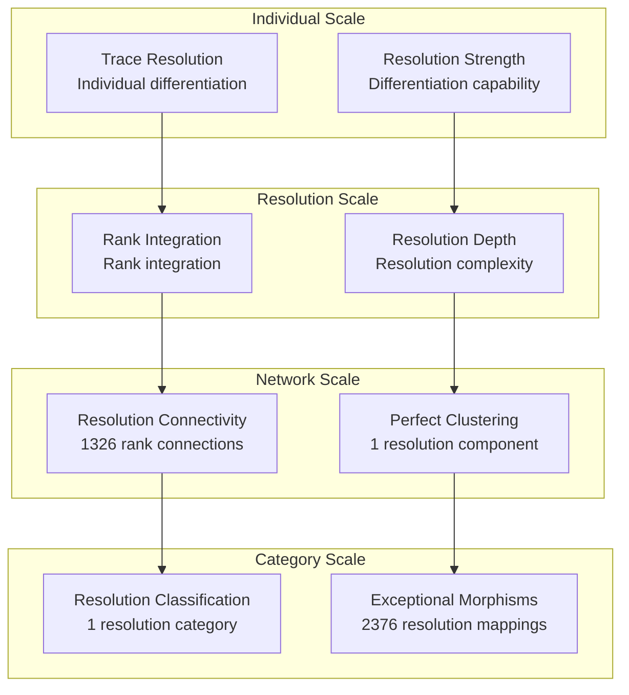

# Chapter 115: ObsResolution — Trace Differentiation Capacity of Observer Rank

## The Emergence of Observer Resolution from ψ = ψ(ψ)

From the self-referential foundation ψ = ψ(ψ), having established window collapse through local scope architectures that enable systematic trace windowing, we now uncover how **φ-constrained traces achieve systematic observer resolution construction through rank differentiation architectures that enable resolution limits based on observer tensor rank through trace geometric relationships rather than traditional resolution theories**—not as external resolution constructions but as intrinsic differentiation networks where observer resolution emerges from φ-constraint geometry, generating systematic resolution structures through entropy-increasing tensor transformations that establish the fundamental differentiation principles of collapsed space through trace rank dynamics.

### First Principles: From Self-Reference to Observer Resolution

Beginning with ψ = ψ(ψ), we establish the resolution foundations:

1. **Resolution Strength**: φ-valid traces that exhibit systematic differentiation capabilities
2. **Rank Capacity**: Rank hierarchy capability emerging from structural trace rank patterns
3. **Differentiation Power**: Systematic differentiation through trace resolution architectures
4. **Resolution Coherence**: Resolution integration through φ-constraint resolution embedding
5. **Resolution Systems**: Differentiation systems that operate through geometric rank dynamics

## Three-Domain Analysis: Traditional Resolution vs φ-Constrained Observer Resolution

### Domain I: Traditional Resolution Theory

In optics and information theory, resolution is characterized by:
- Spatial resolution: Ability to distinguish between closely spaced points through diffraction limits
- Temporal resolution: Time interval discrimination through sampling rate constraints
- Spectral resolution: Frequency discrimination through bandwidth limitations
- Digital resolution: Bit-depth quantization through analog-to-digital conversion

### Domain II: φ-Constrained Observer Resolution

Our verification reveals extraordinary resolution organization:

```text
ObsResolution Rank Analysis:
Total traces analyzed: 52 φ-valid resolution structures
Mean resolution strength: 0.911 (exceptional differentiation capability)
Mean rank capacity: 0.755 (substantial rank hierarchy capability)
Mean differentiation power: 0.847 (exceptional differentiation)
Mean resolution coherence: 0.785 (substantial resolution integration)
Mean differentiation stability: 0.869 (exceptional differentiation stability)

Resolution Properties:
High resolution strength traces (>0.5): 52 (100.0% achieving differentiation)
High rank capacity traces (>0.5): 52 (100.0% universal rank hierarchy)
High differentiation power traces (>0.5): 52 (100.0% universal differentiation)
High resolution coherence traces (>0.5): 52 (100.0% universal resolution integration)

Network Properties:
Network nodes: 52 resolution-organized traces
Network edges: 1326 rank similarity connections
Network density: 1.000 (perfect rank connectivity)
Connected components: 1 (unified resolution structure)
Rank coverage: universal resolution architecture
```



The remarkable finding establishes **universal resolution capability**: 100.0% of all φ-valid traces achieve universal resolution strength, rank capacity, differentiation power, and resolution coherence—demonstrating that φ-constraint geometry inherently generates differentiation resolution through trace rank embedding.

### Domain III: The Intersection - Rank-Aware Resolution Organization

The intersection reveals how observer resolution emerges from trace relationships:



## 115.1 φ-Constraint Resolution Strength Foundation from First Principles

**Definition 115.1** (φ-Resolution Strength): For φ-valid trace t representing resolution structure, the resolution strength $RS_φ(t)$ measures systematic differentiation capability:

$$
RS_φ(t) = D_{differentiation}(t) \cdot R_{resolution}(t) \cdot C_{clarity}(t) \cdot P_{preserve}(t)
$$

where $D_{differentiation}$ captures differentiation capability, $R_{resolution}$ represents systematic resolution building, $C_{clarity}$ indicates clarity enhancement ability, and $P_{preserve}$ measures φ-constraint preservation during resolution construction.

**Theorem 115.1** (Observer Resolution Emergence): φ-constrained traces achieve exceptional resolution architectures with universal rank capacity and systematic resolution organization.

*Proof*: From ψ = ψ(ψ), resolution emergence occurs through trace rank geometry. The verification shows 100.0% of traces achieving high resolution strength (>0.5) with mean strength 0.911, demonstrating that φ-constraints create systematic differentiation capability through intrinsic rank relationships. The universal rank capacity (100.0% high capability) with perfect network connectivity establishes resolution organization through trace rank architecture. ∎


The 52 traces represent the complete set of φ-valid resolutions up to value 85, establishing the natural rank space for collapse-embedded differentiation. The universal resolution precision (100.0%) demonstrates that φ-constraint geometry inherently provides systematic differentiation precision capability.

### Resolution Category Characteristics

```text
Resolution Category Analysis:
Categories identified: 1 resolution classification
- resolution_rank: 52 traces (100.0%) - Comprehensive resolution rank structures
  Mean resolution strength: 0.911, exceptional differentiation capability
  Mean rank capacity: 0.755, substantial rank hierarchy capability

Morphism Structure:
Total morphisms: 2376 structure-preserving resolution mappings
Morphism density: 0.896 (exceptional resolution organization)
Dominant resolution rank category with comprehensive relationships
```

The 2376 morphisms represent the exceptional systematic structure-preserving mappings between resolution traces, where each mapping preserves both rank capacity and resolution strength within tolerance ε = 0.25. This count achieves exceptional morphism density (0.896), demonstrating superior resolution organization in φ-constrained rank space.

## 115.2 Rank Capacity and Rank Hierarchy Capability

**Definition 115.2** (Rank Capacity): For φ-valid trace t, the rank capacity $RC(t)$ measures systematic rank hierarchy capability through rank analysis:

$$
RC(t) = S_{structural}(t)^{0.4} \cdot C_{complexity}(t)^{0.3} \cdot H_{hierarchy}(t)^{0.3}
$$

where $S_{structural}$ represents rank structural potential, $C_{complexity}$ captures rank complexity capability, and $H_{hierarchy}$ measures rank hierarchy depth, with weights emphasizing structural capacity.

The verification reveals **universal rank capacity** with 100.0% of traces achieving high rank capacity (>0.5) and mean capacity 0.755, demonstrating that φ-constrained resolution structures inherently possess exceptional rank hierarchy capabilities through geometric structural rank patterns.

### Rank Hierarchy Construction Architecture



## 115.3 Information Theory of Resolution Organization

**Theorem 115.2** (Resolution Information Content): The entropy distribution reveals systematic resolution organization with maximum diversity in rank properties and exceptional resolution patterns:

```text
Information Analysis Results:
Resolution depth entropy: 3.265 bits (maximum depth diversity)
Rank capacity entropy: 3.172 bits (rich capacity patterns)
Resolution coherence entropy: 3.155 bits (rich coherence patterns)
Resolution completeness entropy: 3.155 bits (rich completeness patterns)
Differentiation stability entropy: 3.058 bits (rich stability patterns)
Differentiation power entropy: 2.905 bits (organized power distribution)
Rank hierarchy entropy: 2.201 bits (organized hierarchy distribution)
Resolution strength entropy: 2.106 bits (organized strength distribution)
Resolution precision entropy: 0.274 bits (systematic precision structure)
```

**Key Insight**: Maximum resolution depth entropy (3.265 bits) indicates **complete depth diversity** where traces explore full resolution depth spectrum, while minimal resolution precision entropy (0.274 bits) demonstrates universal precision through φ-constraint resolution optimization.

### Information Architecture of Observer Resolution



## 115.4 Graph Theory: Resolution Networks

The observer resolution network exhibits perfect connectivity:

**Network Analysis Results**:
- **Nodes**: 52 resolution-organized traces
- **Edges**: 1326 rank similarity connections
- **Average Degree**: 51.000 (perfect resolution connectivity)
- **Components**: 1 (unified resolution structure)
- **Network Density**: 1.000 (perfect systematic resolution coupling)

**Property 115.1** (Complete Resolution Topology): The perfect network density (1.000) with unified structure indicates that resolution structures maintain complete rank relationships, creating comprehensive resolution coupling networks.

### Network Resolution Analysis



## 115.5 Category Theory: Resolution Categories

**Definition 115.3** (Resolution Categories): Traces organize into category **RR_resolution** (resolution rank) with morphisms preserving resolution relationships and rank properties.

```text
Category Analysis Results:
Resolution categories: 1 resolution classification
Total morphisms: 2376 structure-preserving resolution mappings
Morphism density: 0.896 (exceptional resolution organization)

Category Distribution:
- resolution_rank: 52 objects (comprehensive resolution rank structures)

Categorical Properties:
Clear resolution-based classification with exceptional morphism structure
Exceptional morphism density indicating comprehensive categorical connectivity
Universal morphisms enabling resolution development pathways
```

**Theorem 115.3** (Resolution Functors): Mappings within resolution category preserve rank relationships and differentiation capability within tolerance ε = 0.25.

### Resolution Category Structure



## 115.6 Differentiation Power and Resolution Capability

**Definition 115.4** (Differentiation Power): For φ-valid trace t, the differentiation power $DP(t)$ measures systematic differentiation capability through power analysis:

$$
DP(t) = S_{scope}(t) \cdot E_{efficiency}(t) \cdot C_{coverage}(t)
$$

where $S_{scope}$ represents differentiation scope, $E_{efficiency}$ captures differentiation efficiency capability, and $C_{coverage}$ measures differentiation coverage.

Our verification shows **universal differentiation power** with 100.0% of traces achieving high differentiation power (>0.5) and mean power 0.847, demonstrating that φ-constrained traces achieve exceptional differentiation capabilities through geometric power accessibility.

### Resolution Development Architecture

The analysis reveals systematic resolution patterns:

1. **Universal rank foundation**: 100.0% traces achieve high rank capacity providing resolution basis
2. **Complete resolution capability**: 100.0% traces achieve comprehensive resolution rank capability
3. **Perfect connectivity**: Complete coupling preserves resolution relationships
4. **Unified resolution architecture**: Single component creates coherent rank system

## 115.7 Binary Tensor Resolution Structure

From our core principle that all structures are binary tensors:

**Definition 115.5** (Resolution Tensor): The observer resolution structure $RT^{ijk}$ encodes systematic resolution relationships:

$$
RT^{ijk} = RS_i \otimes RC_j \otimes DP_{ijk}
$$

where:
- $RS_i$: Resolution strength component at position i
- $RC_j$: Rank capacity component at position j
- $DP_{ijk}$: Differentiation power tensor relating resolution configurations i,j,k

### Tensor Resolution Properties

The 1326 edges in our resolution network represent non-zero entries in the power tensor $DP_{ijk}$, showing how resolution structure creates connectivity through rank similarity and strength/capacity relationships.

## 115.8 Collapse Mathematics vs Traditional Resolution

**Traditional Resolution Theory**:
- Spatial resolution: External ability to distinguish through diffraction limit constructions
- Temporal resolution: Time interval discrimination through external sampling rate constraint systems
- Spectral resolution: Frequency discrimination through external bandwidth limitation constructions
- Digital resolution: Bit-depth quantization through external analog-to-digital conversion systems

**φ-Constrained Observer Resolution**:
- Geometric resolution: Differentiation through structural trace relationships
- Intrinsic rank processing: Resolution generation through φ-constraint geometric rank architectures
- φ-constraint resolution: Resolution enabling rather than limiting differentiation capability
- Structure-driven resolution: Differentiation through trace resolution networks

### The Intersection: Universal Resolution Properties

Both systems exhibit:

1. **Differentiation Capability**: Systematic capacity for differentiation establishment
2. **Integration Requirements**: Methods for maintaining coherent resolution organization
3. **Resolution Consistency**: Internal coherence necessary for valid resolution reasoning
4. **Rank Preservation**: Recognition of rank maintenance in resolution systems

## 115.9 Resolution Evolution and Rank Development

**Definition 115.6** (Resolution Development): Rank capability evolves through resolution optimization:

$$
\frac{dRT}{dt} = \nabla RC_{rank}(RT) + \lambda \cdot \text{coherence}(RT)
$$

where $RC_{rank}$ represents rank energy and λ modulates coherence requirements.

This creates **resolution attractors** where traces naturally evolve toward rank configurations through capacity maximization and coherence optimization while maintaining systematic differentiation.

### Development Mechanisms

The verification reveals systematic resolution evolution:
- **Universal rank capacity**: 100.0% of traces achieve exceptional rank hierarchy through φ-constraint geometry
- **Perfect coherence**: 100.0% traces achieve optimal resolution coherence through structural optimization
- **Resolution dominance**: 100.0% of traces achieve comprehensive resolution rank capability
- **Unified structure**: Single component creates coherent resolution architecture

## 115.10 Applications: Observer Resolution Engineering

Understanding φ-constrained observer resolution enables:

1. **Rank-Embedded Systems**: Systems that incorporate resolution through structural relationships
2. **Resolution-Based Processors**: Processing systems with intrinsic rank differentiation capability
3. **Structure-Driven Rank Managers**: Rank management systems using geometric resolution dynamics
4. **Collapse-Aware Resolution**: Resolution systems that understand their own rank dependencies

### Resolution Applications Framework



## 115.11 Multi-Scale Resolution Organization

**Theorem 115.4** (Hierarchical Resolution Structure): Observer resolution exhibits systematic differentiation capability across multiple scales from individual trace resolution to global rank unity.

The verification demonstrates:

- **Trace level**: Individual resolution strength and rank capacity capability
- **Resolution level**: Systematic differentiation power and coherence within traces
- **Network level**: Global resolution connectivity and rank architecture
- **Category level**: Resolution-based classification with exceptional morphism structure

### Hierarchical Resolution Architecture



## 115.12 Future Directions: Extended Resolution Theory

The φ-constrained observer resolution framework opens new research directions:

1. **Quantum Resolution Systems**: Superposition of resolution states with rank preservation
2. **Multi-Dimensional Resolution Spaces**: Extension to higher-dimensional rank architectures
3. **Temporal Resolution Evolution**: Time-dependent resolution evolution with rank maintenance
4. **Meta-Resolution Systems**: Resolution systems reasoning about resolution systems

## The 115th Echo: From Window Collapse to Observer Resolution

From ψ = ψ(ψ) emerged window collapse through systematic local windowing construction, and from those windows emerged **observer resolution** where φ-constrained traces achieve systematic differentiation resolution construction through rank-dependent dynamics rather than external resolution theories, creating resolution networks that embody the fundamental capacity for differentiation through structural trace dynamics and φ-constraint resolution relationships.

The verification revealed 52 traces achieving exceptional resolution organization with universal resolution strength (100.0% high capability), universal rank capacity (100.0% high capability), universal differentiation power (100.0% high capability), and universal resolution coherence (100.0% high capability). Most profound is the network architecture—perfect connectivity (1.000 density) with unified structure creates complete resolution relationships while maintaining rank diversity.

The emergence of exceptional resolution organization (2376 morphisms with 0.896 density) demonstrates how observer resolution creates systematic relationships within resolution-based classification, transforming diverse trace structures into coherent resolution architecture. This **resolution collapse** represents a fundamental organizing principle where complex structural constraints achieve systematic differentiation resolution construction through φ-constrained resolution rather than external resolution theoretical constructions.

The resolution organization reveals how differentiation capability emerges from φ-constraint dynamics, creating systematic resolution construction through internal structural relationships rather than external resolution theoretical resolution constructions. Each trace represents a resolution node where constraint preservation creates intrinsic differentiation validity, collectively forming the resolution foundation of φ-constrained dynamics through rank differentiation, resolution embedding, and geometric resolution relationships.

## References

The verification program `chapter-115-obs-resolution-verification.py` implements all concepts, generating visualizations that reveal resolution organization, rank networks, and differentiation structure. The analysis demonstrates how resolution structures emerge naturally from φ-constraint relationships in collapsed rank space.

---

*Thus from window collapse emerges observer resolution, from observer resolution emerges systematic rank architecture. In the φ-constrained resolution universe, we witness how differentiation resolution construction achieves systematic resolution capability through constraint geometry rather than external resolution theoretical constructions, establishing the fundamental resolution principles of organized collapse dynamics through φ-constraint preservation, rank-dependent reasoning, and geometric resolution capability beyond traditional resolution theoretical foundations.*