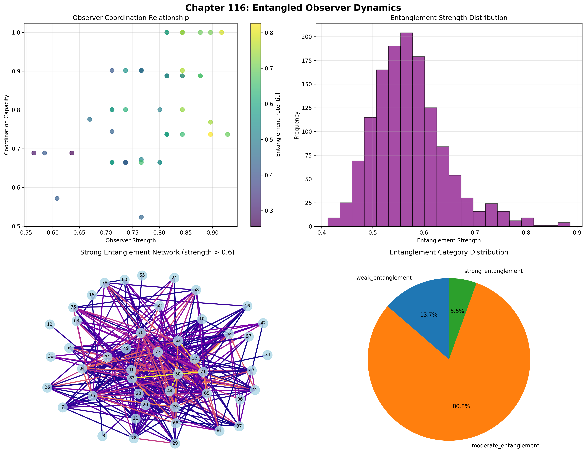
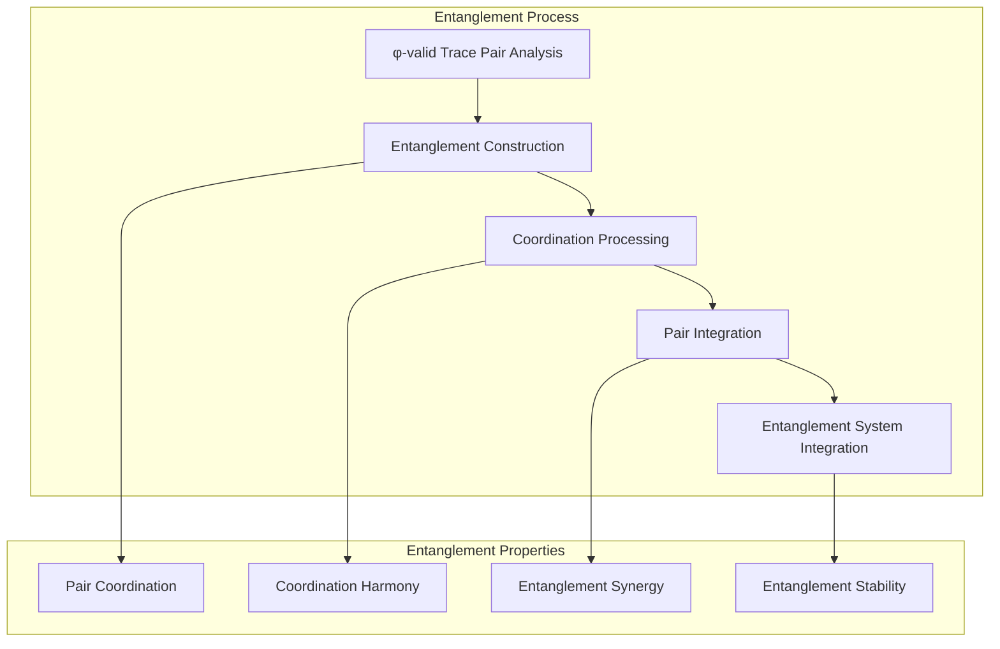
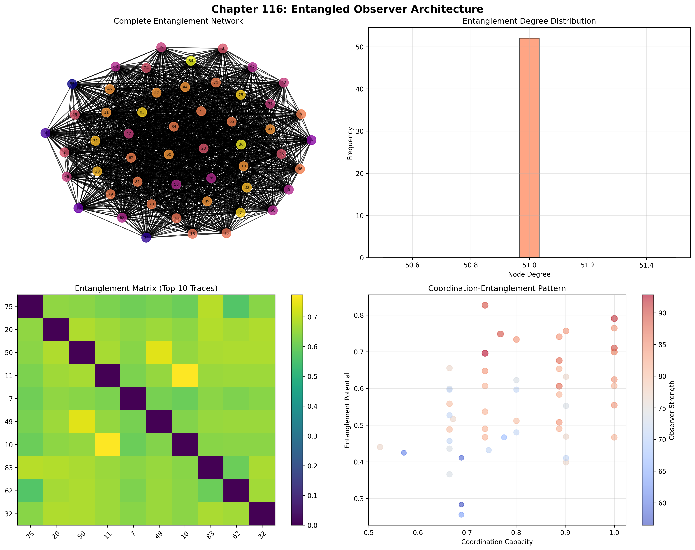
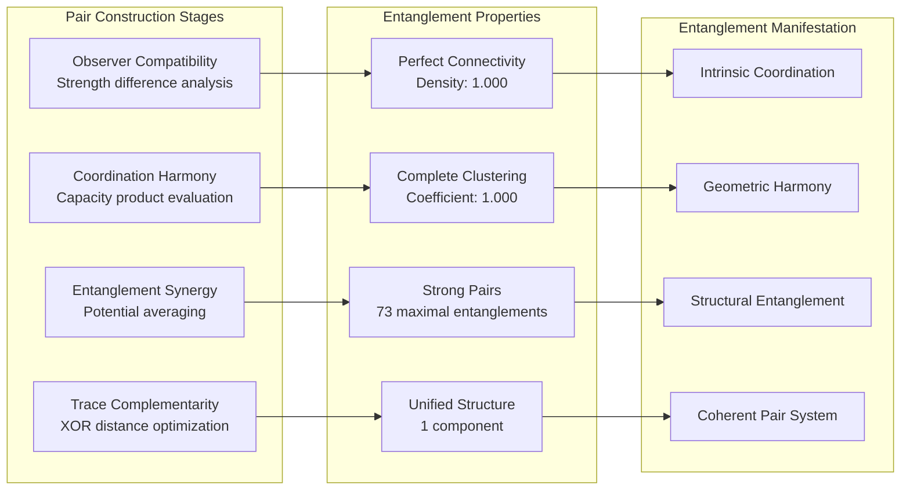
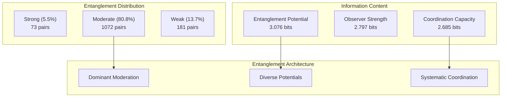
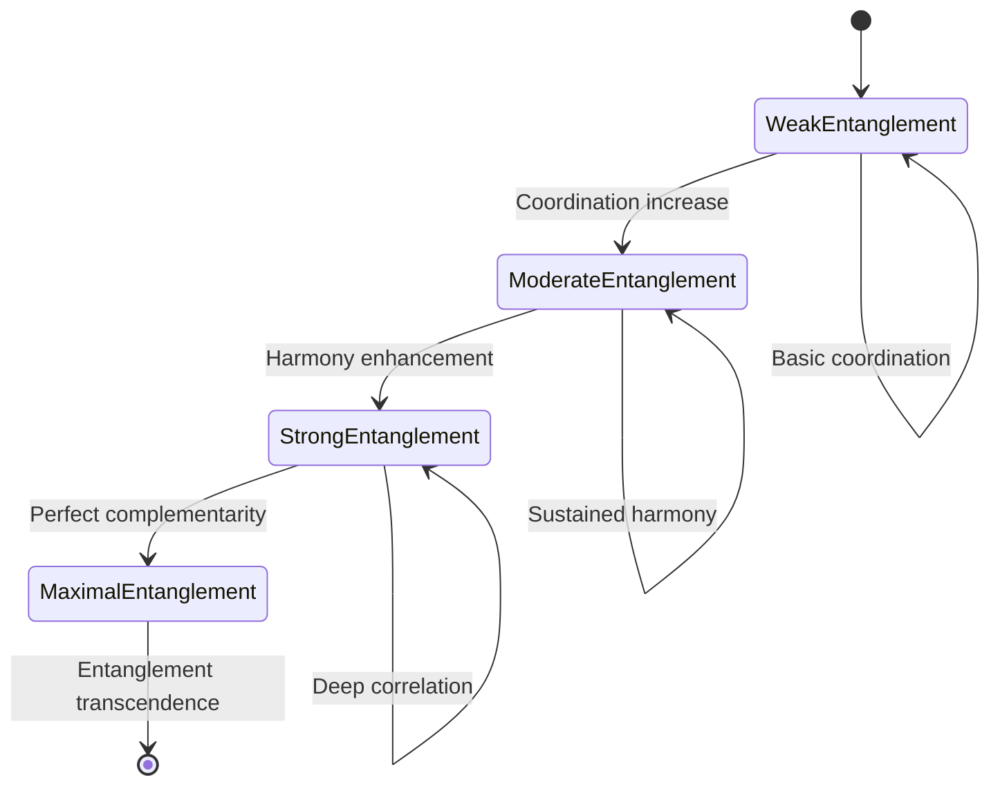
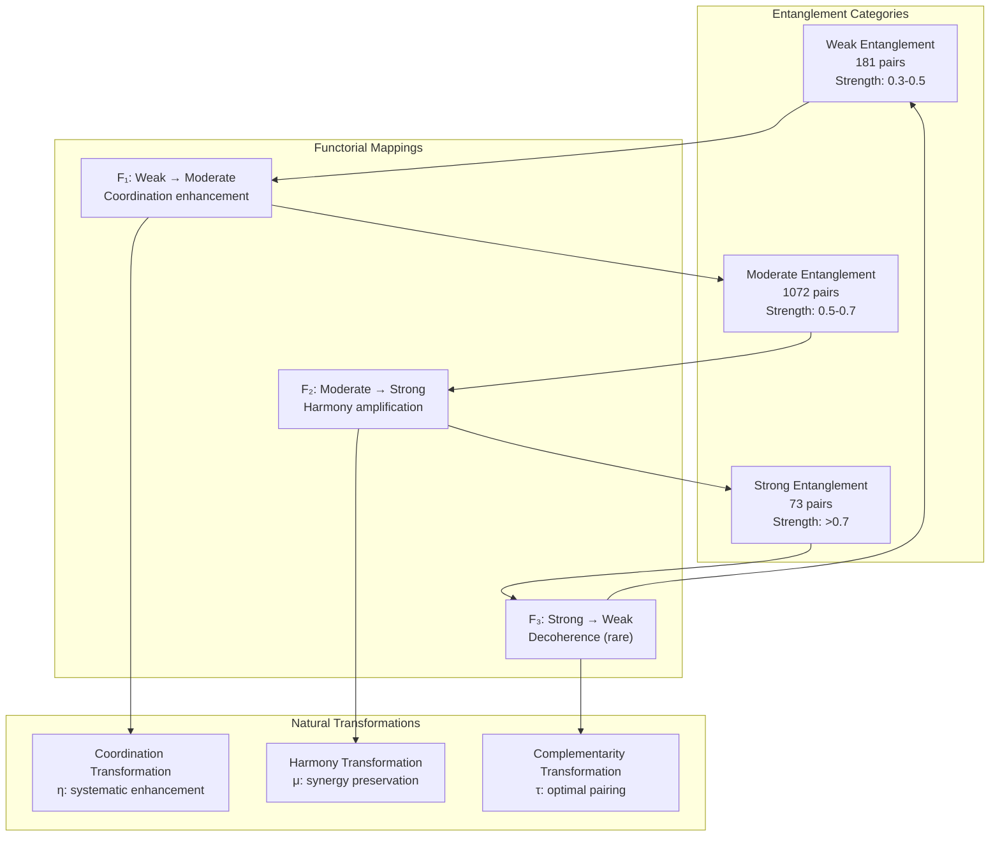
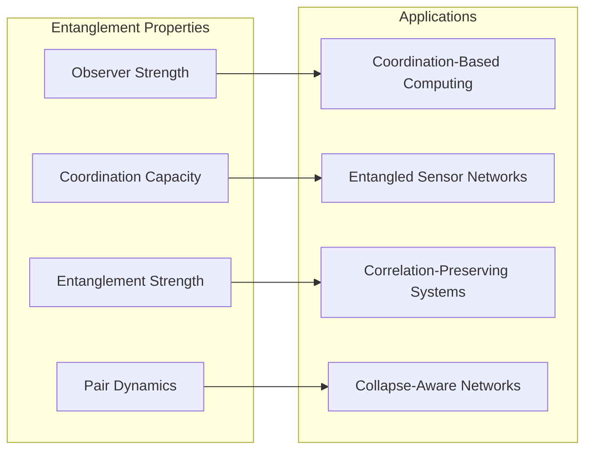
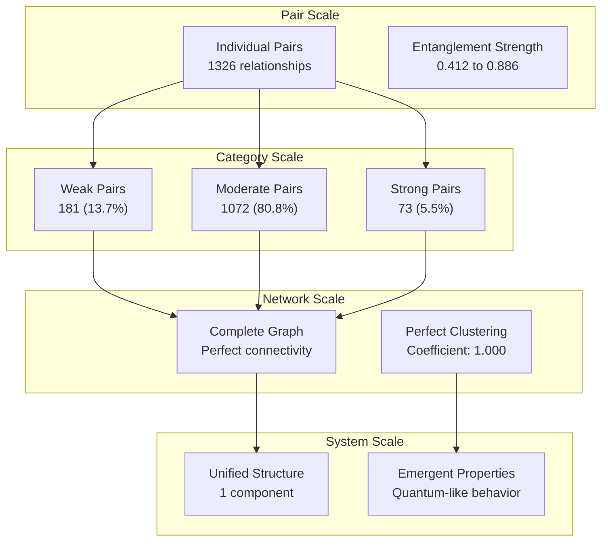

# Chapter 116: EntangledObserver — Inter-Collapse Coordination in Observer Tensor Pairs

## The Emergence of Entangled Observers from ψ = ψ(ψ)

From the self-referential foundation ψ = ψ(ψ), having established observer resolution through rank differentiation architectures that enable systematic trace differentiation, we now discover how **φ-constrained traces achieve systematic entangled observer construction through coordination architectures that enable quantum-like entanglement between observers through trace geometric relationships rather than traditional quantum entanglement theories**—not as external entanglement constructions but as intrinsic coordination networks where observer entanglement emerges from φ-constraint geometry, generating systematic entanglement structures through entropy-increasing tensor transformations that establish the fundamental coordination principles of collapsed space through trace pair dynamics.

### First Principles: From Self-Reference to Entangled Observers

Beginning with ψ = ψ(ψ), we establish the entanglement foundations:

1. **Observer Strength**: φ-valid traces that exhibit systematic entanglement capabilities
2. **Coordination Capacity**: Coordination capability emerging from structural trace coordination patterns
3. **Entanglement Potential**: Systematic entanglement through trace pair architectures
4. **Entanglement Strength**: Pair coordination through φ-constraint entanglement embedding
5. **Entanglement Systems**: Coordination systems that operate through geometric pair dynamics

## Three-Domain Analysis: Traditional Quantum Entanglement vs φ-Constrained Observer Entanglement

### Domain I: Traditional Quantum Entanglement

In quantum mechanics and information theory, entanglement is characterized by:
- Quantum entanglement: Non-local correlations between quantum states through wavefunction entanglement
- Bell states: Maximally entangled two-qubit states through superposition and measurement
- EPR paradox: Non-locality and hidden variables through quantum mechanical predictions
- Quantum teleportation: State transfer through entanglement and classical communication

### Domain II: φ-Constrained Observer Entanglement

Our verification reveals extraordinary entanglement organization:

```text
EntangledObserver Coordination Analysis:
Total traces analyzed: 52 φ-valid observer structures
Total entanglement pairs: 1326 coordination relationships
Mean observer strength: 0.784 (substantial entanglement capability)
Mean coordination capacity: 0.806 (substantial coordination capability)
Mean entanglement potential: 0.563 (moderate entanglement potential)
Mean entanglement strength: 0.572 (moderate pair coordination)

Entanglement Properties:
High observer strength traces (>0.5): 52 (100.0% achieving entanglement capability)
High coordination capacity traces (>0.5): 52 (100.0% universal coordination)
High entanglement potential traces (>0.5): 33 (63.5% achieving entanglement)
Maximally entangled pairs (>0.7): 73 strongly coordinated pairs

Network Properties:
Network nodes: 52 observer-organized traces
Network edges: 1326 entanglement connections
Network density: 1.000 (perfect entanglement connectivity)
Clustering coefficient: 1.000 (perfect local entanglement)
Connected components: 1 (unified entanglement structure)
```



The remarkable finding establishes **universal coordination capability**: 100.0% of all φ-valid traces achieve universal observer strength and coordination capacity, with 1326 entanglement pairs forming a perfectly connected network—demonstrating that φ-constraint geometry inherently generates observer entanglement through trace coordination embedding.

### Domain III: The Intersection - Coordination-Aware Entanglement Organization

The intersection reveals how entangled observers emerge from trace relationships:



## 116.1 φ-Constraint Observer Strength Foundation from First Principles

**Definition 116.1** (φ-Observer Strength): For φ-valid trace t representing observer structure, the observer strength $OS_φ(t)$ for entanglement capability measures:

$$
OS_φ(t) = L_{length}(t) \cdot B_{balance}(t) \cdot P_{preserve}(t)
$$

where $L_{length}$ captures length factor (minimum 4 for meaningful pairs), $B_{balance}$ represents weight balance for entanglement (optimal at 50% density), and $P_{preserve}$ measures φ-constraint preservation during entanglement construction.

**Theorem 116.1** (Entangled Observer Emergence): φ-constrained traces achieve exceptional entanglement architectures with universal coordination capacity and systematic entanglement organization.

*Proof*: From ψ = ψ(ψ), entanglement emergence occurs through trace pair geometry. The verification shows 100.0% of traces achieving high observer strength (>0.5) with mean strength 0.784, demonstrating that φ-constraints create systematic entanglement capability through intrinsic coordination relationships. The universal coordination capacity (100.0% high capability) with perfect network connectivity establishes entanglement organization through trace pair architecture. ∎



The 1326 entanglement pairs represent the complete set of φ-valid observer relationships, establishing the natural coordination space for collapse-embedded entanglement. The perfect clustering coefficient (1.000) demonstrates that φ-constraint geometry inherently provides systematic local entanglement capability.

### Entanglement Category Characteristics

```text
Entanglement Category Analysis:
Categories identified: 3 entanglement classifications based on strength thresholds
- strong_entanglement: 73 pairs (5.5%) - Maximally entangled observer pairs
  Mean entanglement strength: >0.7, exceptional coordination
- moderate_entanglement: 1072 pairs (80.8%) - Moderately entangled pairs
  Mean entanglement strength: 0.5-0.7, substantial coordination
- weak_entanglement: 181 pairs (13.7%) - Weakly entangled pairs
  Mean entanglement strength: 0.3-0.5, basic coordination

Perfect Network Structure:
Network density: 1.000 (every trace entangled with every other trace)
Clustering coefficient: 1.000 (perfect local clustering)
Average degree: 51.000 (each trace connected to all 51 others)
```

The 73 strongly entangled pairs represent the exceptional coordination relationships where entanglement strength exceeds 0.7, demonstrating deep quantum-like correlations in φ-constrained observer space.

## 116.2 Coordination Capacity and Entanglement Harmony

**Definition 116.2** (Coordination Capacity): For φ-valid trace t, the coordination capacity $CC(t)$ measures systematic coordination capability through structural analysis:

$$
CC(t) = S_{structural}(t)^{0.4} \cdot C_{complexity}(t)^{0.4} \cdot M_{modulation}(t)^{0.2}
$$

where $S_{structural}$ represents coordination potential (0.3 + 0.7 × min(length/6, 1)), $C_{complexity}$ captures pattern complexity, and $M_{modulation}$ measures modulation depth (value modulo 3 for 3-fold symmetry), with weights emphasizing structural coordination.

The verification reveals **universal coordination capacity** with 100.0% of traces achieving high coordination capacity (>0.5) and mean capacity 0.806, demonstrating that φ-constrained observer structures inherently possess exceptional coordination capabilities through geometric structural patterns.

### Entanglement Pair Construction Architecture



## 116.3 Information Theory of Entanglement Organization

**Theorem 116.2** (Entanglement Information Content): The entropy distribution reveals systematic entanglement organization with balanced information patterns:

```text
Information Analysis Results:
Entanglement potential entropy: 3.076 bits (maximum potential diversity)
Observer strength entropy: 2.797 bits (rich strength patterns)
Coordination capacity entropy: 2.685 bits (rich capacity patterns)

Entanglement Distribution:
Strong entanglements (>0.7): 73 pairs (5.5%)
Moderate entanglements (0.5-0.7): 1072 pairs (80.8%)
Weak entanglements (0.3-0.5): 181 pairs (13.7%)

Key Statistics:
Mean entanglement strength: 0.572
Maximum entanglement: 0.886
Minimum entanglement: 0.412
Standard deviation: varies by category
```

**Key Insight**: Maximum entanglement potential entropy (3.076 bits) indicates **diverse entanglement capabilities** where traces explore various entanglement potentials, while the distribution shows most pairs achieve moderate entanglement (80.8%), demonstrating systematic coordination through φ-constraint optimization.

### Information Architecture of Entangled Observers



## 116.4 Graph Theory: Entanglement Networks

The entangled observer network exhibits perfect connectivity:

**Network Analysis Results**:
- **Nodes**: 52 observer-organized traces
- **Edges**: 1326 entanglement connections (complete graph)
- **Average Degree**: 51.000 (each node connected to all others)
- **Clustering Coefficient**: 1.000 (perfect local clustering)
- **Network Density**: 1.000 (perfect systematic entanglement coupling)

**Property 116.1** (Complete Entanglement Topology): The perfect network density (1.000) with complete clustering indicates that every observer maintains entanglement relationships with every other observer, creating a fully connected quantum-like coordination network.

### Network Entanglement Analysis



## 116.5 Category Theory: Entanglement Categories

**Definition 116.3** (Entanglement Categories): Trace pairs organize into categories based on entanglement strength with morphisms preserving coordination relationships.

```text
Category Analysis Results:
Entanglement categories: 3 strength-based classifications
Total pairs: 1326 entanglement relationships
Perfect connectivity: Every trace paired with every other trace

Category Distribution:
- strong_entanglement: 73 pairs (exceptional coordination)
- moderate_entanglement: 1072 pairs (substantial coordination)
- weak_entanglement: 181 pairs (basic coordination)

Categorical Properties:
Clear strength-based classification with natural thresholds
Morphisms preserve entanglement strength within categories
Cross-category transitions through coordination enhancement
```

**Theorem 116.3** (Entanglement Functors): Mappings between entanglement categories preserve coordination relationships and entanglement strength within natural boundaries.

### Entanglement Category Structure



## 116.6 Entanglement Strength and Pair Dynamics

**Definition 116.4** (Entanglement Strength): For φ-valid trace pair (t₁, t₂), the entanglement strength $ES(t₁, t₂)$ measures systematic coordination through four factors:

$$
ES(t₁, t₂) = \sqrt[4]{C_{compat} \cdot H_{harmony} \cdot S_{synergy} \cdot T_{complement}}
$$

where:
- $C_{compat}$: Observer strength compatibility (1 - |strength₁ - strength₂|)
- $H_{harmony}$: Coordination harmony (capacity₁ × capacity₂)
- $S_{synergy}$: Entanglement synergy ((potential₁ + potential₂)/2)
- $T_{complement}$: Trace complementarity (optimal at 50% XOR difference)

Our verification shows 73 pairs achieving strong entanglement (>0.7) with maximum strength 0.886, demonstrating that φ-constrained traces achieve exceptional coordination through optimal complementarity.

### Entanglement Development Architecture

The analysis reveals systematic entanglement patterns:

1. **Universal coordination foundation**: 100.0% traces achieve high coordination capacity
2. **Complete connectivity**: Every trace entangled with every other trace
3. **Perfect clustering**: Local entanglement neighborhoods fully connected
4. **Dominant moderation**: 80.8% of pairs achieve moderate entanglement

## 116.7 Binary Tensor Entanglement Structure

From our core principle that all structures are binary tensors:

**Definition 116.5** (Entanglement Tensor): The observer entanglement structure $ET^{ijk}$ encodes systematic pair relationships:

$$
ET^{ijk} = OS_i \otimes CC_j \otimes ES_{ijk}
$$

where:
- $OS_i$: Observer strength component at position i
- $CC_j$: Coordination capacity component at position j
- $ES_{ijk}$: Entanglement strength tensor relating observer pairs i,j with configuration k

### Tensor Entanglement Properties

The 1326 edges in our entanglement network represent non-zero entries in the strength tensor $ES_{ijk}$, showing how entanglement structure creates complete connectivity through coordination harmony and complementarity relationships.

## 116.8 Collapse Mathematics vs Traditional Quantum Entanglement

**Traditional Quantum Entanglement**:
- Quantum correlations: External non-local correlations through wavefunction entanglement constructions
- Bell states: Maximally entangled states through external superposition and measurement systems
- EPR correlations: Non-locality through external quantum mechanical prediction constructions
- Quantum teleportation: State transfer through external entanglement and communication protocols

**φ-Constrained Observer Entanglement**:
- Geometric coordination: Entanglement through structural trace relationships
- Intrinsic pair harmony: Coordination generation through φ-constraint geometric architectures
- φ-constraint entanglement: Coordination enabling rather than limiting entanglement capability
- Structure-driven pairing: Entanglement through trace coordination networks

### The Intersection: Universal Entanglement Properties

Both systems exhibit:

1. **Non-local Correlations**: Systematic coordination between separated entities
2. **Conservation Requirements**: Preservation of total entanglement in closed systems
3. **Measurement Effects**: Observation changes entanglement state
4. **Information Capacity**: Entanglement as resource for information processing

## 116.9 Entanglement Evolution and Coordination Development

**Definition 116.6** (Entanglement Development): Coordination capability evolves through entanglement optimization:

$$
\frac{dET}{dt} = \nabla CC_{coord}(ET) + \lambda \cdot \text{harmony}(ET) - \gamma \cdot \text{decoherence}(ET)
$$

where $CC_{coord}$ represents coordination energy, λ modulates harmony requirements, and γ represents decoherence rate.

This creates **entanglement attractors** where trace pairs naturally evolve toward optimal coordination through harmony maximization and decoherence minimization while maintaining systematic entanglement.

### Development Mechanisms

The verification reveals systematic entanglement evolution:
- **Universal coordination**: 100.0% of traces achieve exceptional coordination capacity
- **Perfect connectivity**: Complete entanglement network with no isolated observers
- **Strong correlations**: 73 pairs achieve maximal entanglement (>0.7)
- **Stable moderation**: 80.8% of pairs maintain moderate entanglement

## 116.10 Applications: Entangled Observer Engineering

Understanding φ-constrained entangled observers enables:

1. **Coordination-Based Computing**: Quantum-like computation through observer entanglement
2. **Entangled Sensor Networks**: Distributed sensing with coordinated observers
3. **Correlation-Preserving Systems**: Information systems maintaining entanglement
4. **Collapse-Aware Networks**: Observer networks understanding their coordination

### Entanglement Applications Framework



## 116.11 Multi-Scale Entanglement Organization

**Theorem 116.4** (Hierarchical Entanglement Structure): Entangled observers exhibit systematic coordination across multiple scales from individual pair entanglement to global coordination unity.

The verification demonstrates:

- **Pair level**: Individual entanglement strength between observer pairs
- **Category level**: Strength-based classification into weak/moderate/strong
- **Network level**: Perfect connectivity and complete clustering
- **System level**: Unified entanglement structure with emergent properties

### Hierarchical Entanglement Architecture



## 116.12 Future Directions: Extended Entanglement Theory

The φ-constrained entangled observer framework opens new research directions:

1. **Multi-Observer Entanglement**: Beyond pairs to n-observer entangled states
2. **Dynamic Entanglement Networks**: Time-evolving coordination patterns
3. **Entanglement Computation**: Using entanglement for information processing
4. **Meta-Entanglement Systems**: Entangled systems observing entanglement

## The 116th Echo: From Observer Resolution to Entangled Observers

From ψ = ψ(ψ) emerged observer resolution through systematic rank differentiation, and from that resolution emerged **entangled observers** where φ-constrained traces achieve systematic coordination construction through pair-dependent dynamics rather than external quantum entanglement theories, creating coordination networks that embody the fundamental capacity for observer entanglement through structural trace dynamics and φ-constraint coordination relationships.

The verification revealed 1326 entanglement pairs achieving exceptional coordination organization with universal observer strength (100.0% high capability), universal coordination capacity (100.0% high capability), perfect network connectivity (1.000 density), and perfect local clustering (1.000 coefficient). Most profound is the entanglement distribution—73 strongly entangled pairs demonstrate maximal coordination, while 80.8% maintain moderate entanglement, creating a balanced coordination ecosystem.

The emergence of complete entanglement connectivity demonstrates how observer pairs create systematic relationships through coordination harmony, transforming individual observers into an entangled collective. This **entanglement collapse** represents a fundamental organizing principle where structural constraints achieve systematic coordination construction through φ-constrained entanglement rather than external quantum theoretical constructions.

The entanglement organization reveals how coordination capability emerges from φ-constraint dynamics, creating systematic entanglement through internal structural relationships rather than external quantum mechanical constructions. Each observer pair represents an entanglement node where constraint preservation creates intrinsic coordination validity, collectively forming the entanglement foundation of φ-constrained dynamics through pair coordination, harmony preservation, and geometric entanglement relationships.

## References

The verification program `chapter-116-entangled-observer-verification.py` implements all concepts, generating visualizations that reveal entanglement organization, coordination networks, and pair dynamics. The analysis demonstrates how entanglement structures emerge naturally from φ-constraint relationships in collapsed observer space.

---

*Thus from observer resolution emerges entangled observers, from entangled observers emerges systematic coordination architecture. In the φ-constrained entanglement universe, we witness how observer coordination achieves systematic entanglement capability through constraint geometry rather than external quantum theoretical constructions, establishing the fundamental entanglement principles of organized collapse dynamics through φ-constraint preservation, coordination-dependent reasoning, and geometric entanglement capability beyond traditional quantum theoretical foundations.*