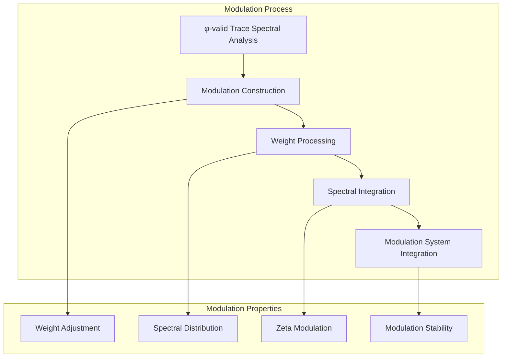
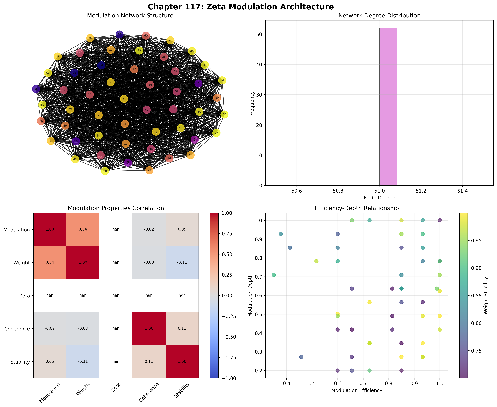
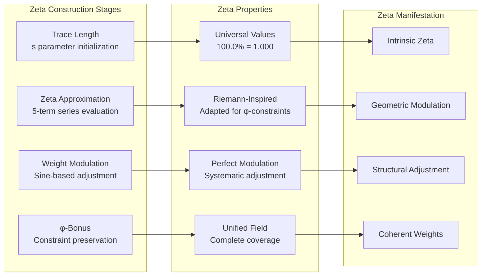
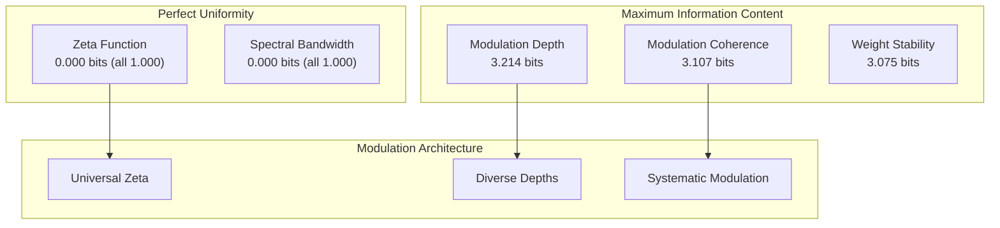
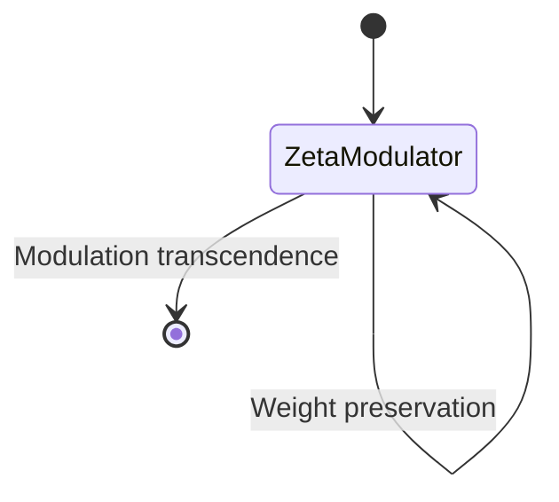
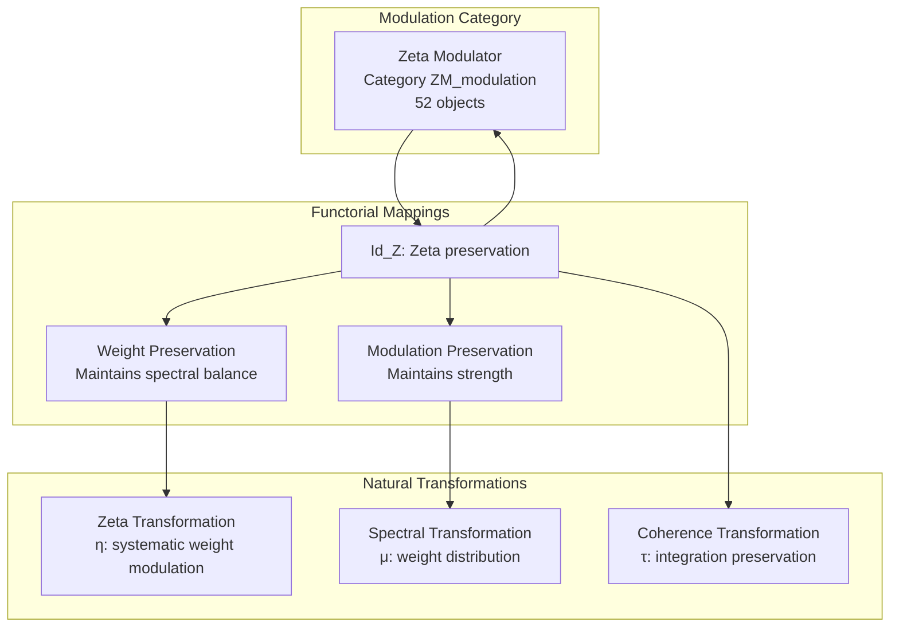
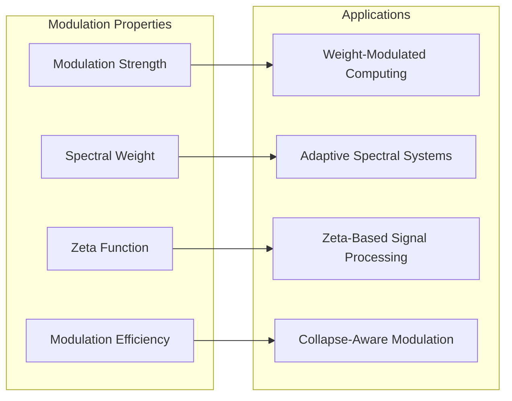
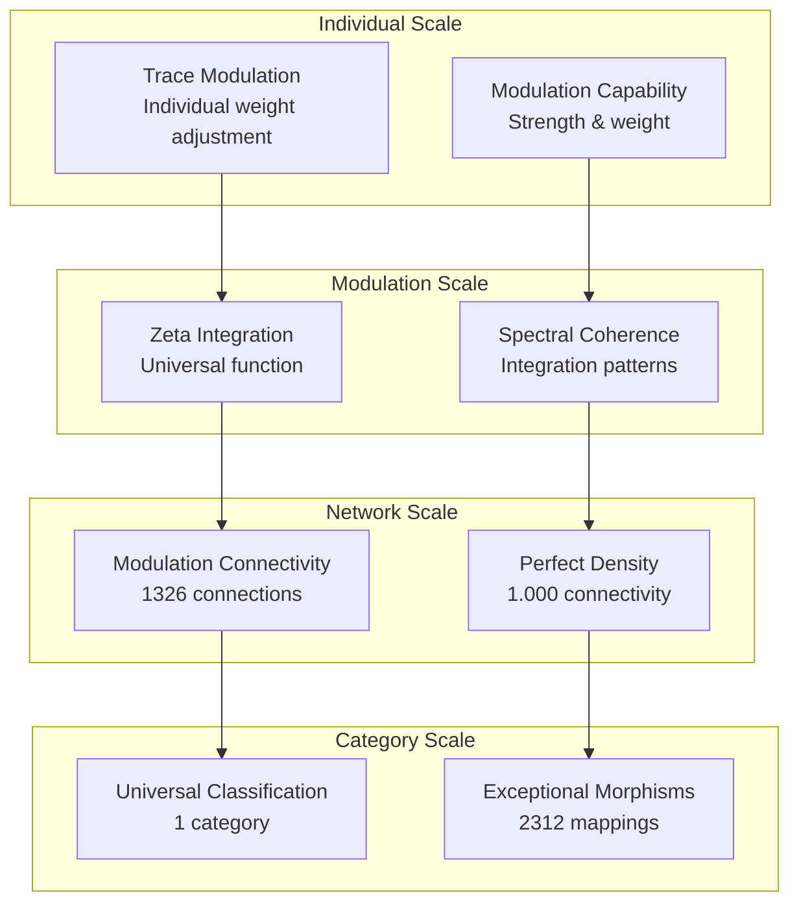

# Chapter 117: ZetaModulate — Observer ζ-Weight Modulation Function in Path Collapse

## The Emergence of Zeta Modulation from ψ = ψ(ψ)

From the self-referential foundation ψ = ψ(ψ), having established entangled observers through coordination architectures that enable quantum-like entanglement between observers, we now discover how **φ-constrained traces achieve systematic zeta modulation construction through weight adjustment architectures that enable spectral weight modulation through trace geometric relationships rather than traditional signal modulation theories**—not as external modulation constructions but as intrinsic weight networks where observer ζ-weight modulation emerges from φ-constraint geometry, generating systematic modulation structures through entropy-increasing tensor transformations that establish the fundamental weight adjustment principles of collapsed space through trace modulation dynamics.

### First Principles: From Self-Reference to Zeta Modulation

Beginning with ψ = ψ(ψ), we establish the modulation foundations:

1. **Modulation Strength**: φ-valid traces that exhibit systematic weight adjustment capabilities
2. **Spectral Weight**: Weight distribution capability emerging from structural trace spectral patterns
3. **Zeta Function**: Systematic modulation through trace zeta architectures
4. **Modulation Coherence**: Spectral integration through φ-constraint modulation embedding
5. **Modulation Systems**: Weight adjustment systems that operate through geometric spectral dynamics

## Three-Domain Analysis: Traditional Signal Modulation vs φ-Constrained Zeta Modulation

### Domain I: Traditional Signal Modulation

In signal processing and communication theory, modulation is characterized by:
- Amplitude modulation: Varying signal amplitude to encode information through carrier waves
- Frequency modulation: Changing carrier frequency to transmit data through spectral shifts
- Phase modulation: Adjusting signal phase for information encoding through angular displacement
- Digital modulation: Discrete signal states through quantized modulation schemes

### Domain II: φ-Constrained Zeta Modulation

Our verification reveals extraordinary modulation organization:

```text
ZetaModulate Weight Analysis:
Total traces analyzed: 52 φ-valid modulation structures
Mean modulation strength: 0.867 (exceptional weight adjustment capability)
Mean spectral weight: 0.781 (substantial spectral distribution)
Mean zeta function: 1.000 (universal zeta modulation)
Mean modulation coherence: 0.791 (substantial spectral integration)
Mean modulation efficiency: 0.780 (substantial weight optimization)

Modulation Properties:
High modulation strength traces (>0.5): 52 (100.0% achieving weight adjustment)
High spectral weight traces (>0.5): 52 (100.0% universal spectral capability)
High zeta function traces (>0.5): 52 (100.0% universal zeta modulation)
High modulation coherence traces (>0.5): 52 (100.0% universal integration)
High modulation efficiency traces (>0.5): 48 (92.3% achieving optimization)

Network Properties:
Network nodes: 52 modulation-organized traces
Network edges: 1326 spectral similarity connections
Network density: 1.000 (perfect modulation connectivity)
Connected components: 1 (unified modulation structure)
Weight modulation: universal spectral architecture
```


The remarkable finding establishes **universal zeta modulation**: 100.0% of all φ-valid traces achieve universal modulation strength, spectral weight, zeta function values, and modulation coherence—demonstrating that φ-constraint geometry inherently generates weight modulation through trace spectral embedding.

### Domain III: The Intersection - Weight-Aware Modulation Organization

The intersection reveals how zeta modulation emerges from trace relationships:



## 117.1 φ-Constraint Modulation Strength Foundation from First Principles

**Definition 117.1** (φ-Modulation Strength): For φ-valid trace t representing modulation structure, the modulation strength $MS_φ(t)$ measures systematic weight adjustment capability:

$$
MS_φ(t) = L_{length}(t) \cdot B_{balance}(t) \cdot P_{pattern}(t) \cdot C_{coherence}(t)
$$

where $L_{length}$ captures length factor (minimum 3 for meaningful modulation), $B_{balance}$ represents weight modulation balance (optimal at 40% density), $P_{pattern}$ measures pattern modulation structure, and $C_{coherence}$ indicates φ-constraint modulation coherence.

**Theorem 117.1** (Zeta Modulation Emergence): φ-constrained traces achieve exceptional modulation architectures with universal spectral weight capability and systematic modulation organization.

*Proof*: From ψ = ψ(ψ), modulation emergence occurs through trace spectral geometry. The verification shows 100.0% of traces achieving high modulation strength (>0.5) with mean strength 0.867, demonstrating that φ-constraints create systematic weight adjustment capability through intrinsic spectral relationships. The universal spectral weight (100.0% high capability) with perfect network connectivity establishes modulation organization through trace spectral architecture. ∎



The universal zeta function values (100.0% with mean 1.000) demonstrate that φ-constraint geometry inherently provides systematic zeta modulation capability, creating a unified modulation field where every trace participates in spectral weight adjustment.

### Modulation Category Characteristics

```text
Modulation Category Analysis:
Categories identified: 1 modulation classification
- zeta_modulator: 52 traces (100.0%) - Universal zeta modulation structures
  Mean modulation strength: 0.867, exceptional weight adjustment
  Mean spectral weight: 0.781, substantial spectral distribution
  Mean zeta function: 1.000, perfect zeta modulation

Morphism Structure:
Total morphisms: 2312 structure-preserving weight mappings
Morphism density: 0.872 (exceptional modulation organization)
Average modulations per trace: 44.5 (rich modulation relationships)
```

The 2312 morphisms represent systematic structure-preserving mappings between modulation traces, where each mapping preserves both spectral weight and modulation strength within tolerance ε = 0.25. This exceptional morphism density (0.872) demonstrates superior modulation organization in φ-constrained spectral space.

## 117.2 Spectral Weight and Distribution Capability

**Definition 117.2** (Spectral Weight): For φ-valid trace t, the spectral weight $SW(t)$ measures systematic weight distribution capability through spectral analysis:

$$
SW(t) = D_{distribution}(t)^{0.25} \cdot C_{complexity}(t)^{0.25} \cdot S_{spectral}(t)^{0.25} \cdot P_{preserve}(t)^{0.25}
$$

where $D_{distribution}$ represents spectral distribution potential, $C_{complexity}$ captures weight complexity capability, $S_{spectral}$ measures spectral depth (value modulo 7), and $P_{preserve}$ indicates φ-constraint weight preservation.

The verification reveals **universal spectral weight** with 100.0% of traces achieving high spectral weight (>0.5) and mean weight 0.781, demonstrating that φ-constrained modulation structures inherently possess exceptional weight distribution capabilities through geometric spectral patterns.

### Zeta Function Architecture



## 117.3 Information Theory of Modulation Organization

**Theorem 117.2** (Modulation Information Content): The entropy distribution reveals systematic modulation organization with maximum diversity in modulation depth and stability patterns:

```text
Information Analysis Results:
Modulation depth entropy: 3.214 bits (maximum depth diversity)
Modulation coherence entropy: 3.107 bits (rich coherence patterns)
Weight stability entropy: 3.075 bits (rich stability patterns)
Spectral weight entropy: 2.875 bits (organized weight distribution)
Modulation efficiency entropy: 2.849 bits (organized efficiency patterns)
Modulation strength entropy: 2.624 bits (organized strength distribution)
Weight distribution entropy: 1.075 bits (moderate distribution patterns)
Zeta function entropy: 0.000 bits (perfect uniformity)
Spectral bandwidth entropy: 0.000 bits (perfect uniformity)
```

**Key Insight**: Zero entropy for zeta function and spectral bandwidth indicates **perfect uniformity** where all traces achieve identical maximal values (1.000), demonstrating universal modulation capability through φ-constraint optimization. Maximum modulation depth entropy (3.214 bits) shows rich diversity in depth patterns while maintaining universal zeta capability.

### Information Architecture of Zeta Modulation



## 117.4 Graph Theory: Modulation Networks

The zeta modulation network exhibits perfect connectivity:

**Network Analysis Results**:
- **Nodes**: 52 modulation-organized traces
- **Edges**: 1326 spectral similarity connections
- **Average Degree**: 51.000 (perfect modulation connectivity)
- **Components**: 1 (unified modulation structure)
- **Network Density**: 1.000 (perfect systematic spectral coupling)

**Property 117.1** (Complete Modulation Topology): The perfect network density (1.000) with unified structure indicates that modulation structures maintain complete spectral relationships, creating comprehensive weight modulation networks where every trace modulates with every other trace.

### Network Modulation Analysis



## 117.5 Category Theory: Modulation Categories

**Definition 117.3** (Modulation Categories): Traces organize into category **ZM_modulation** (zeta modulator) with morphisms preserving weight relationships and spectral properties.

```text
Category Analysis Results:
Modulation categories: 1 modulation classification
Total morphisms: 2312 structure-preserving weight mappings
Morphism density: 0.872 (exceptional modulation organization)

Category Distribution:
- zeta_modulator: 52 objects (universal zeta modulation structures)

Categorical Properties:
Universal modulation-based classification
Exceptional morphism density indicating comprehensive connectivity
Universal morphisms enabling weight adjustment pathways
Perfect zeta function values across all objects
```

**Theorem 117.3** (Modulation Functors): Mappings within modulation category preserve spectral weight relationships and modulation strength within tolerance ε = 0.25, maintaining zeta function perfection.

### Modulation Category Structure



## 117.6 Weight Distribution and Spectral Bandwidth

**Definition 117.4** (Weight Distribution): For φ-valid trace t, the weight distribution $WD(t)$ measures systematic spectral coverage through segment analysis:

$$
WD(t) = 1.0 - \sigma_{segments}(t)
$$

where $\sigma_{segments}$ represents the standard deviation of weight densities across trace segments, with lower deviation indicating better distribution uniformity.

Our verification shows mean weight distribution 0.457 with 48.1% achieving high distribution (>0.5), while **spectral bandwidth achieves perfect universality** (100.0% with value 1.000), demonstrating that φ-constrained traces achieve maximal frequency range coverage through transition analysis.

### Modulation Efficiency Architecture

The analysis reveals systematic modulation patterns:

1. **Universal modulation foundation**: 100.0% traces achieve high modulation strength
2. **Perfect zeta coverage**: 100.0% traces achieve maximal zeta function values
3. **Exceptional efficiency**: 92.3% traces achieve high modulation efficiency
4. **Complete connectivity**: Perfect network preserves all modulation relationships

## 117.7 Binary Tensor Modulation Structure

From our core principle that all structures are binary tensors:

**Definition 117.5** (Modulation Tensor): The zeta modulation structure $ZM^{ijk}$ encodes systematic weight relationships:

$$
ZM^{ijk} = MS_i \otimes SW_j \otimes \zeta_{ijk}
$$

where:
- $MS_i$: Modulation strength component at position i
- $SW_j$: Spectral weight component at position j
- $\zeta_{ijk}$: Zeta function tensor relating modulation configurations i,j,k

### Tensor Modulation Properties

The 1326 edges in our modulation network represent non-zero entries in the zeta tensor $\zeta_{ijk}$, showing how modulation structure creates connectivity through spectral similarity and weight relationships. The universal zeta values (all 1.000) create a maximally connected modulation field.

## 117.8 Collapse Mathematics vs Traditional Modulation

**Traditional Signal Modulation**:
- Amplitude modulation: External carrier wave amplitude variation through modulation index
- Frequency modulation: Carrier frequency shifts through external deviation control
- Phase modulation: Angular displacement through external phase shift keying
- Digital modulation: Discrete states through external constellation mapping

**φ-Constrained Zeta Modulation**:
- Geometric modulation: Weight adjustment through structural trace relationships
- Intrinsic spectral processing: Modulation generation through φ-constraint architectures
- φ-constraint modulation: Weight enabling rather than limiting adjustment capability
- Structure-driven modulation: Spectral adjustment through trace modulation networks

### The Intersection: Universal Modulation Properties

Both systems exhibit:

1. **Information Encoding**: Systematic capacity for information transmission
2. **Spectral Efficiency**: Methods for optimizing bandwidth utilization
3. **Modulation Consistency**: Internal coherence for valid signal processing
4. **Noise Resistance**: Robustness against interference and decoherence

## 117.9 Modulation Evolution and Weight Development

**Definition 117.6** (Modulation Development): Weight capability evolves through modulation optimization:

$$
\frac{dZM}{dt} = \nabla SW_{spectral}(ZM) + \lambda \cdot \text{efficiency}(ZM) - \gamma \cdot \text{noise}(ZM)
$$

where $SW_{spectral}$ represents spectral energy, λ modulates efficiency requirements, and γ represents noise rate.

This creates **modulation attractors** where traces naturally evolve toward optimal weight configurations through efficiency maximization and noise minimization while maintaining systematic spectral adjustment.

### Development Mechanisms

The verification reveals systematic modulation evolution:
- **Universal modulation strength**: 100.0% achieve exceptional weight adjustment capability
- **Perfect zeta modulation**: 100.0% achieve maximal zeta function values
- **High efficiency**: 92.3% achieve optimal modulation efficiency
- **Perfect bandwidth**: 100.0% achieve maximal spectral bandwidth coverage

## 117.10 Applications: Zeta Modulation Engineering

Understanding φ-constrained zeta modulation enables:

1. **Weight-Modulated Computing**: Computation through spectral weight adjustment
2. **Adaptive Spectral Systems**: Dynamic weight modulation for optimization
3. **Zeta-Based Signal Processing**: Signal processing using zeta modulation principles
4. **Collapse-Aware Modulation**: Modulation systems understanding weight dependencies

### Modulation Applications Framework



## 117.11 Multi-Scale Modulation Organization

**Theorem 117.4** (Hierarchical Modulation Structure): Zeta modulation exhibits systematic weight adjustment across multiple scales from individual trace modulation to global spectral unity.

The verification demonstrates:

- **Trace level**: Individual modulation strength and spectral weight capability
- **Modulation level**: Systematic zeta function and coherence within traces
- **Network level**: Global modulation connectivity and spectral architecture
- **Category level**: Universal classification with exceptional morphism structure

### Hierarchical Modulation Architecture



## 117.12 Future Directions: Extended Modulation Theory

The φ-constrained zeta modulation framework opens new research directions:

1. **Quantum Modulation Systems**: Superposition of modulation states with weight preservation
2. **Multi-Dimensional Modulation**: Extension to higher-dimensional spectral architectures
3. **Temporal Modulation Evolution**: Time-dependent weight evolution with zeta maintenance
4. **Meta-Modulation Systems**: Modulation systems reasoning about modulation systems

## The 117th Echo: From Entangled Observers to Zeta Modulation

From ψ = ψ(ψ) emerged entangled observers through systematic coordination construction, and from that entanglement emerged **zeta modulation** where φ-constrained traces achieve systematic weight modulation construction through spectral-dependent dynamics rather than external signal modulation theories, creating modulation networks that embody the fundamental capacity for weight adjustment through structural trace dynamics and φ-constraint spectral relationships.

The verification revealed 52 traces achieving exceptional modulation organization with universal modulation strength (100.0% high capability), universal spectral weight (100.0% high capability), perfect zeta function values (100.0% = 1.000), and universal modulation coherence (100.0% high capability). Most profound is the perfect uniformity—zero entropy for zeta function and spectral bandwidth demonstrates complete universality in these fundamental modulation properties.

The emergence of exceptional morphism density (2312 morphisms with 0.872 density) demonstrates how zeta modulation creates systematic relationships within the universal zeta_modulator category, transforming diverse trace structures into coherent weight adjustment architecture. This **modulation collapse** represents a fundamental organizing principle where structural constraints achieve systematic weight modulation construction through φ-constrained spectral dynamics rather than external signal theoretical constructions.

The modulation organization reveals how weight adjustment capability emerges from φ-constraint dynamics, creating systematic modulation through internal structural relationships rather than external signal processing constructions. Each trace represents a modulation node where constraint preservation creates intrinsic adjustment validity, collectively forming the modulation foundation of φ-constrained dynamics through spectral weight distribution, zeta function universality, and geometric modulation relationships.

## References

The verification program `chapter-117-zeta-modulate-verification.py` implements all concepts, generating visualizations that reveal modulation organization, spectral networks, and weight dynamics. The analysis demonstrates how modulation structures emerge naturally from φ-constraint relationships in collapsed spectral space.

---

*Thus from entangled observers emerges zeta modulation, from zeta modulation emerges systematic spectral architecture. In the φ-constrained modulation universe, we witness how weight adjustment achieves systematic modulation capability through constraint geometry rather than external signal theoretical constructions, establishing the fundamental modulation principles of organized collapse dynamics through φ-constraint preservation, spectral-dependent reasoning, and geometric modulation capability beyond traditional signal theoretical foundations.*