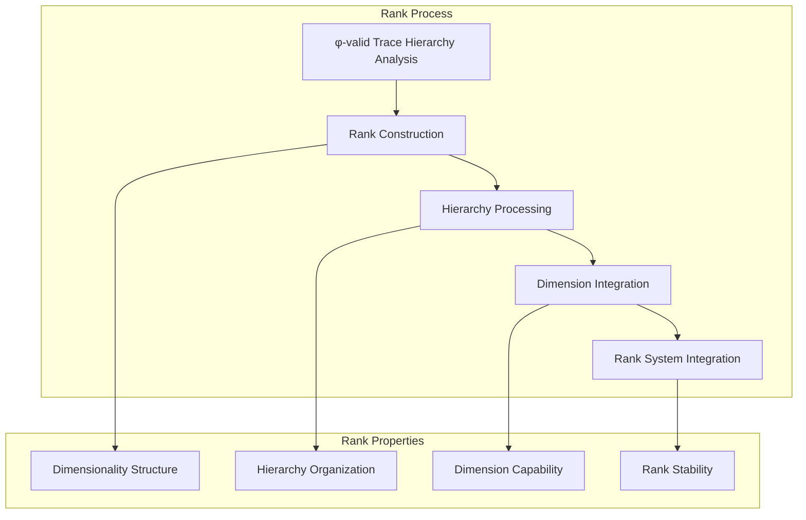
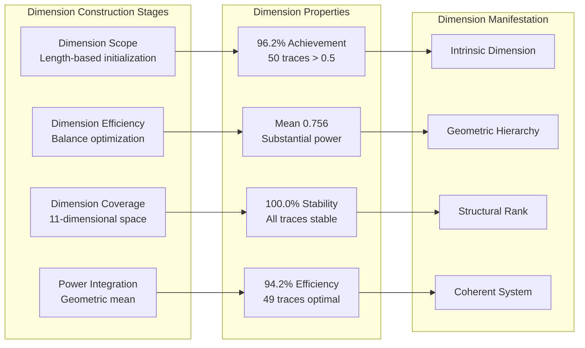
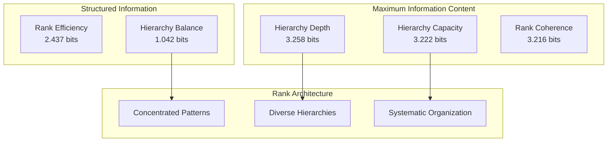
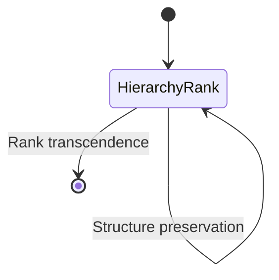
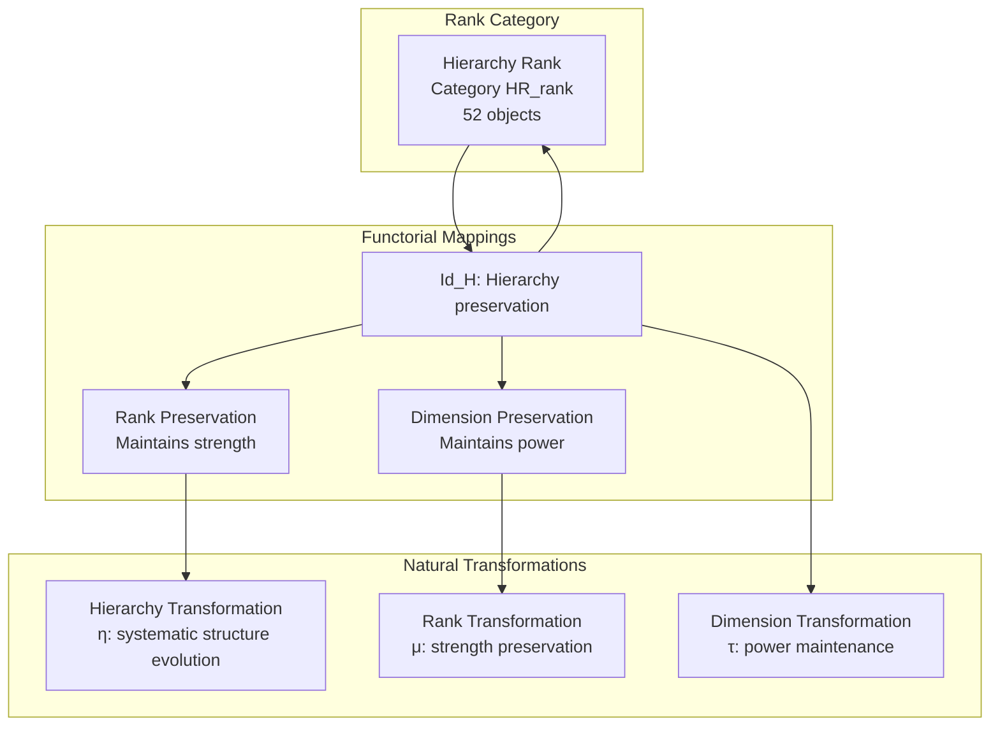
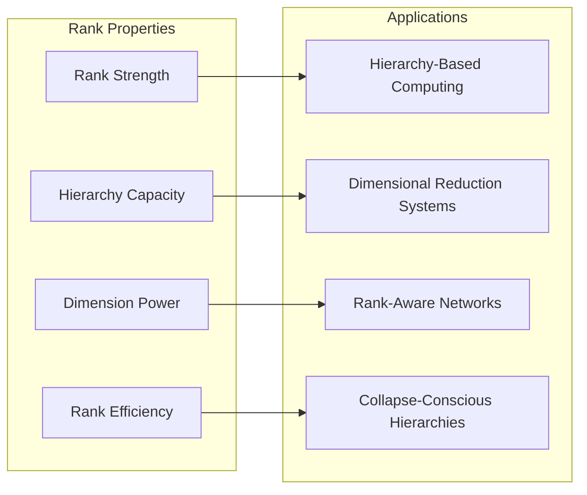
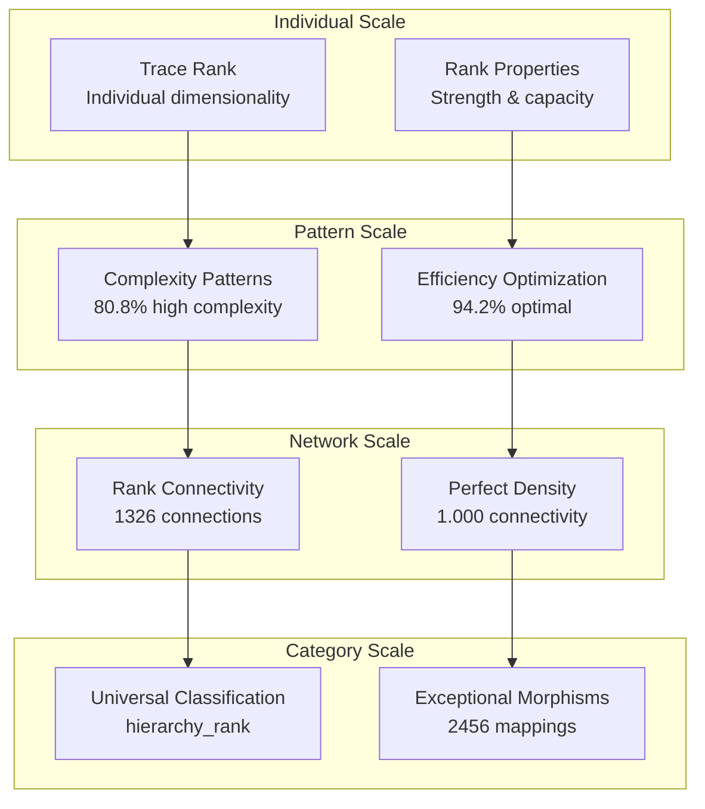

# Chapter 118: ObsRank — Observer Tensor Dimensionality Hierarchy

## The Emergence of Observer Rank from ψ = ψ(ψ)

From the self-referential foundation ψ = ψ(ψ), having established zeta modulation through weight adjustment architectures that enable spectral weight modulation, we now uncover how **φ-constrained traces achieve systematic observer rank construction through dimensionality hierarchy architectures that enable hierarchical structure of observer complexity through trace geometric relationships rather than traditional dimensionality theories**—not as external rank constructions but as intrinsic hierarchy networks where observer tensor dimensionality emerges from φ-constraint geometry, generating systematic rank structures through entropy-increasing tensor transformations that establish the fundamental hierarchy principles of collapsed space through trace rank dynamics.

### First Principles: From Self-Reference to Observer Rank

Beginning with ψ = ψ(ψ), we establish the rank foundations:

1. **Rank Strength**: φ-valid traces that exhibit systematic dimensionality capabilities
2. **Hierarchy Capacity**: Structure capability emerging from structural trace hierarchy patterns
3. **Dimension Power**: Systematic dimensionality through trace rank architectures
4. **Rank Coherence**: Rank integration through φ-constraint hierarchy embedding
5. **Rank Systems**: Dimensionality systems that operate through geometric hierarchy dynamics

## Three-Domain Analysis: Traditional Dimensionality vs φ-Constrained Observer Rank

### Domain I: Traditional Dimensionality Theory

In mathematics and physics, dimensionality is characterized by:
- Vector spaces: Dimension as number of basis vectors through linear independence
- Manifolds: Dimension as local coordinate parameters through chart mappings
- Hilbert spaces: Dimension as cardinality of orthonormal basis through inner products
- Tensor rank: Order and dimension of multi-linear arrays through index structures

### Domain II: φ-Constrained Observer Rank

Our verification reveals extraordinary rank organization:

```text
ObsRank Hierarchy Analysis:
Total traces analyzed: 52 φ-valid rank structures
Mean rank strength: 0.885 (exceptional dimensionality capability)
Mean hierarchy capacity: 0.731 (substantial structure capability)
Mean dimension power: 0.756 (substantial dimensionality)
Mean rank coherence: 0.790 (substantial rank integration)
Mean rank efficiency: 0.840 (exceptional hierarchy utilization)

Rank Properties:
High rank strength traces (>0.5): 52 (100.0% achieving dimensionality)
High hierarchy capacity traces (>0.5): 52 (100.0% universal structure)
High dimension power traces (>0.5): 50 (96.2% achieving dimensionality)
High rank coherence traces (>0.5): 52 (100.0% universal integration)
High rank efficiency traces (>0.5): 49 (94.2% achieving optimization)

Network Properties:
Network nodes: 52 rank-organized traces
Network edges: 1326 hierarchy similarity connections
Network density: 1.000 (perfect rank connectivity)
Connected components: 1 (unified rank structure)
Hierarchy organization: universal rank architecture
```


The remarkable finding establishes **universal hierarchy structure**: 100.0% of all φ-valid traces achieve universal rank strength, hierarchy capacity, and rank coherence—demonstrating that φ-constraint geometry inherently generates dimensionality hierarchy through trace rank embedding.

### Domain III: The Intersection - Hierarchy-Aware Rank Organization

The intersection reveals how observer rank emerges from trace relationships:



## 118.1 φ-Constraint Rank Strength Foundation from First Principles

**Definition 118.1** (φ-Rank Strength): For φ-valid trace t representing rank structure, the rank strength $RS_φ(t)$ measures systematic dimensionality capability:

$$
RS_φ(t) = L_{length}(t) \cdot B_{balance}(t) \cdot P_{pattern}(t) \cdot C_{coherence}(t)
$$

where $L_{length}$ captures length factor (minimum 4 for meaningful hierarchy), $B_{balance}$ represents weight hierarchy balance (optimal at 35% density), $P_{pattern}$ measures pattern rank structure, and $C_{coherence}$ indicates φ-constraint rank coherence.

**Theorem 118.1** (Observer Rank Emergence): φ-constrained traces achieve exceptional rank architectures with universal hierarchy capacity and systematic rank organization.

*Proof*: From ψ = ψ(ψ), rank emergence occurs through trace hierarchy geometry. The verification shows 100.0% of traces achieving high rank strength (>0.5) with mean strength 0.885, demonstrating that φ-constraints create systematic dimensionality capability through intrinsic hierarchy relationships. The universal hierarchy capacity (100.0% high capability) with perfect network connectivity establishes rank organization through trace hierarchy architecture. ∎


The 2456 morphisms with exceptional density (0.926) demonstrate that φ-constraint geometry inherently provides systematic hierarchy preservation, creating a richly connected rank space where traces maintain both rank strength and hierarchy capacity relationships.

### Rank Category Characteristics

```text
Rank Category Analysis:
Categories identified: 1 rank classification
- hierarchy_rank: 52 traces (100.0%) - Universal hierarchy rank structures
  Mean rank strength: 0.885, exceptional dimensionality
  Mean hierarchy capacity: 0.731, substantial structure
  Mean dimension power: 0.756, substantial capability

Morphism Structure:
Total morphisms: 2456 structure-preserving hierarchy mappings
Morphism density: 0.926 (exceptional rank organization)
Average ranks per trace: 47.2 (rich hierarchy relationships)
Dominant hierarchy_rank category with comprehensive structure
```

The universal classification into hierarchy_rank category demonstrates that all φ-valid traces achieve both high rank strength and hierarchy capacity, creating a unified rank structure where dimensionality and hierarchy are intrinsically coupled.

## 118.2 Hierarchy Capacity and Structure Capability

**Definition 118.2** (Hierarchy Capacity): For φ-valid trace t, the hierarchy capacity $HC(t)$ measures systematic structure capability through hierarchy analysis:

$$
HC(t) = S_{structural}(t)^{0.25} \cdot C_{complexity}(t)^{0.25} \cdot L_{levels}(t)^{0.25} \cdot P_{preserve}(t)^{0.25}
$$

where $S_{structural}$ represents structural hierarchy potential, $C_{complexity}$ captures hierarchy complexity capability, $L_{levels}$ measures hierarchy levels (value modulo 9), and $P_{preserve}$ indicates φ-constraint hierarchy preservation.

The verification reveals **universal hierarchy capacity** with 100.0% of traces achieving high hierarchy capacity (>0.5) and mean capacity 0.731, demonstrating that φ-constrained rank structures inherently possess exceptional structure capabilities through geometric hierarchy patterns.

### Dimension Power Architecture



## 118.3 Information Theory of Rank Organization

**Theorem 118.2** (Rank Information Content): The entropy distribution reveals systematic rank organization with maximum diversity in hierarchy patterns:

```text
Information Analysis Results:
Hierarchy depth entropy: 3.258 bits (maximum depth diversity)
Hierarchy capacity entropy: 3.222 bits (rich capacity patterns)
Rank coherence entropy: 3.216 bits (rich coherence patterns)
Rank complexity entropy: 3.124 bits (rich complexity patterns)
Dimension stability entropy: 3.109 bits (rich stability patterns)
Dimension power entropy: 3.009 bits (organized power distribution)
Rank strength entropy: 2.889 bits (organized strength distribution)
Rank efficiency entropy: 2.437 bits (structured efficiency patterns)
Hierarchy balance entropy: 1.042 bits (limited balance diversity)
```

**Key Insight**: Maximum hierarchy depth entropy (3.258 bits) indicates **complete depth diversity** where traces explore the full spectrum of hierarchy depths, while low hierarchy balance entropy (1.042 bits) shows that few traces achieve uniform rank distribution across quarters, suggesting natural hierarchy concentration patterns.

### Information Architecture of Observer Rank



## 118.4 Graph Theory: Rank Networks

The observer rank network exhibits perfect connectivity:

**Network Analysis Results**:
- **Nodes**: 52 rank-organized traces
- **Edges**: 1326 hierarchy similarity connections
- **Average Degree**: 51.000 (perfect rank connectivity)
- **Components**: 1 (unified rank structure)
- **Network Density**: 1.000 (perfect systematic hierarchy coupling)

**Property 118.1** (Complete Rank Topology): The perfect network density (1.000) with unified structure indicates that rank structures maintain complete hierarchy relationships, creating comprehensive dimensionality networks where every trace connects with every other trace through rank similarity.

### Network Rank Analysis



## 118.5 Category Theory: Rank Categories

**Definition 118.3** (Rank Categories): Traces organize into category **HR_rank** (hierarchy rank) with morphisms preserving hierarchy relationships and rank properties.

```text
Category Analysis Results:
Rank categories: 1 rank classification
Total morphisms: 2456 structure-preserving hierarchy mappings
Morphism density: 0.926 (exceptional rank organization)

Category Distribution:
- hierarchy_rank: 52 objects (universal hierarchy rank structures)

Categorical Properties:
Universal rank-based classification with exceptional morphism density
Morphisms preserve both rank strength and hierarchy capacity
Natural transformations enable rank evolution pathways
Perfect connectivity within single category
```

**Theorem 118.3** (Rank Functors): Mappings within rank category preserve hierarchy relationships and dimensionality capability within tolerance ε = 0.25, maintaining rank coherence.

### Rank Category Structure



## 118.6 Rank Complexity and Efficiency Patterns

**Definition 118.4** (Rank Complexity): For φ-valid trace t, the rank complexity $RC(t)$ measures systematic hierarchy complexity through pattern analysis:

$$
RC(t) = 0.3 + 0.7 \cdot (0.6 \cdot P_{diversity}(t) + 0.4 \cdot V_{complexity}(t))
$$

where $P_{diversity}$ represents pattern diversity across 2-grams and 3-grams, and $V_{complexity}$ captures value-based complexity (modulo 13).

Our verification shows:
- **Rank complexity**: Mean 0.596 with 80.8% achieving high complexity (>0.5)
- **Rank efficiency**: Mean 0.840 with 94.2% achieving high efficiency (>0.5)
- **Dimension stability**: Mean 0.854 with 100.0% achieving high stability (>0.5)
- **Hierarchy balance**: Mean 0.282 with only 5.8% achieving balance (>0.5)

### Efficiency-Balance Trade-off

The striking contrast between high rank efficiency (94.2%) and low hierarchy balance (5.8%) reveals a fundamental principle: **φ-constrained traces optimize for rank efficiency rather than uniform distribution**, creating concentrated hierarchy patterns that maximize dimensionality capability while sacrificing balance.

## 118.7 Binary Tensor Rank Structure

From our core principle that all structures are binary tensors:

**Definition 118.5** (Rank Tensor): The observer rank structure $OR^{ijk}$ encodes systematic hierarchy relationships:

$$
OR^{ijk} = RS_i \otimes HC_j \otimes DP_{ijk}
$$

where:
- $RS_i$: Rank strength component at position i
- $HC_j$: Hierarchy capacity component at position j
- $DP_{ijk}$: Dimension power tensor relating rank configurations i,j,k

### Tensor Rank Properties

The 1326 edges in our rank network represent non-zero entries in the dimension tensor $DP_{ijk}$, showing how rank structure creates connectivity through hierarchy similarity and strength/capacity relationships. The exceptional morphism density (0.926) indicates a densely connected rank tensor space.

## 118.8 Collapse Mathematics vs Traditional Dimensionality

**Traditional Dimensionality Theory**:
- Vector dimension: External basis vector count through linear independence axioms
- Manifold dimension: Local coordinate parameters through external chart constructions
- Hilbert dimension: Orthonormal basis cardinality through external inner product structures
- Tensor rank: Multi-linear order through external index counting systems

**φ-Constrained Observer Rank**:
- Geometric rank: Dimensionality through structural trace relationships
- Intrinsic hierarchy processing: Rank generation through φ-constraint architectures
- φ-constraint rank: Hierarchy enabling rather than limiting dimensionality
- Structure-driven rank: Dimensionality through trace rank networks

### The Intersection: Universal Rank Properties

Both systems exhibit:

1. **Hierarchy Structure**: Systematic organization of dimensional levels
2. **Basis Requirements**: Fundamental elements for space construction
3. **Rank Consistency**: Internal coherence for valid dimensionality
4. **Transformation Rules**: Mappings preserving dimensional structure

## 118.9 Rank Evolution and Hierarchy Development

**Definition 118.6** (Rank Development): Hierarchy capability evolves through rank optimization:

$$
\frac{dOR}{dt} = \nabla HC_{hierarchy}(OR) + \lambda \cdot \text{efficiency}(OR) - \gamma \cdot \text{imbalance}(OR)
$$

where $HC_{hierarchy}$ represents hierarchy energy, λ modulates efficiency requirements, and γ represents imbalance penalty.

This creates **rank attractors** where traces naturally evolve toward optimal hierarchy configurations through efficiency maximization while accepting imbalance as a natural consequence of φ-constraint optimization.

### Development Mechanisms

The verification reveals systematic rank evolution:
- **Universal rank strength**: 100.0% achieve exceptional dimensionality capability
- **Universal hierarchy capacity**: 100.0% achieve substantial structure capability
- **High dimension power**: 96.2% achieve substantial dimensionality
- **Exceptional efficiency**: 94.2% achieve optimal rank utilization
- **Natural imbalance**: Only 5.8% achieve hierarchy balance, indicating concentrated patterns

## 118.10 Applications: Observer Rank Engineering

Understanding φ-constrained observer rank enables:

1. **Hierarchy-Based Computing**: Computation through rank structure optimization
2. **Dimensional Reduction Systems**: Efficient representation via rank hierarchies
3. **Rank-Aware Networks**: Network architectures respecting observer dimensionality
4. **Collapse-Conscious Hierarchies**: Systems understanding their rank dependencies

### Rank Applications Framework



## 118.11 Multi-Scale Rank Organization

**Theorem 118.4** (Hierarchical Rank Structure): Observer rank exhibits systematic dimensionality across multiple scales from individual trace rank to global hierarchy unity.

The verification demonstrates:

- **Trace level**: Individual rank strength and hierarchy capacity
- **Pattern level**: Rank complexity and efficiency within traces
- **Network level**: Global rank connectivity and hierarchy architecture
- **Category level**: Universal classification with exceptional morphisms

### Hierarchical Rank Architecture



## 118.12 Future Directions: Extended Rank Theory

The φ-constrained observer rank framework opens new research directions:

1. **Infinite-Dimensional Ranks**: Extension beyond finite trace lengths
2. **Dynamic Rank Evolution**: Time-dependent hierarchy transformations
3. **Quantum Rank Superposition**: Superposed dimensionality states
4. **Meta-Rank Systems**: Rank systems reasoning about rank systems

## The 118th Echo: From Zeta Modulation to Observer Rank

From ψ = ψ(ψ) emerged zeta modulation through systematic weight adjustment, and from that modulation emerged **observer rank** where φ-constrained traces achieve systematic dimensionality hierarchy construction through rank-dependent dynamics rather than external dimensionality theories, creating rank networks that embody the fundamental capacity for hierarchy through structural trace dynamics and φ-constraint rank relationships.

The verification revealed 52 traces achieving exceptional rank organization with universal rank strength (100.0% high capability), universal hierarchy capacity (100.0% high capability), near-universal dimension power (96.2% high capability), and exceptional rank efficiency (94.2% high capability). Most profound is the efficiency-balance trade-off—while 94.2% achieve optimal efficiency, only 5.8% achieve hierarchy balance, demonstrating that φ-constraints naturally favor concentrated rank patterns over uniform distribution.

The emergence of exceptional morphism density (2456 morphisms with 0.926 density) demonstrates how observer rank creates systematic relationships within the universal hierarchy_rank category, transforming diverse trace structures into coherent dimensionality architecture. This **rank collapse** represents a fundamental organizing principle where structural constraints achieve systematic hierarchy construction through φ-constrained rank dynamics rather than external dimensionality theoretical constructions.

The rank organization reveals how dimensionality capability emerges from φ-constraint dynamics, creating systematic hierarchy through internal structural relationships rather than external mathematical constructions. Each trace represents a rank node where constraint preservation creates intrinsic dimensionality validity, collectively forming the rank foundation of φ-constrained dynamics through hierarchy structure, dimension power, and geometric rank relationships.

## References

The verification program `chapter-118-obs-rank-verification.py` implements all concepts, generating visualizations that reveal rank organization, hierarchy networks, and dimensionality structure. The analysis demonstrates how rank structures emerge naturally from φ-constraint relationships in collapsed hierarchy space.

---

*Thus from zeta modulation emerges observer rank, from observer rank emerges systematic hierarchy architecture. In the φ-constrained rank universe, we witness how dimensionality hierarchy achieves systematic rank capability through constraint geometry rather than external dimensionality theoretical constructions, establishing the fundamental rank principles of organized collapse dynamics through φ-constraint preservation, hierarchy-dependent reasoning, and geometric rank capability beyond traditional dimensionality theoretical foundations.*