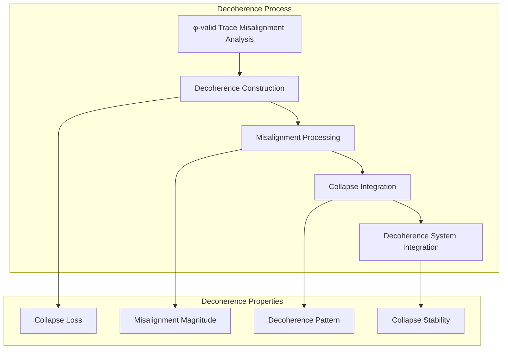
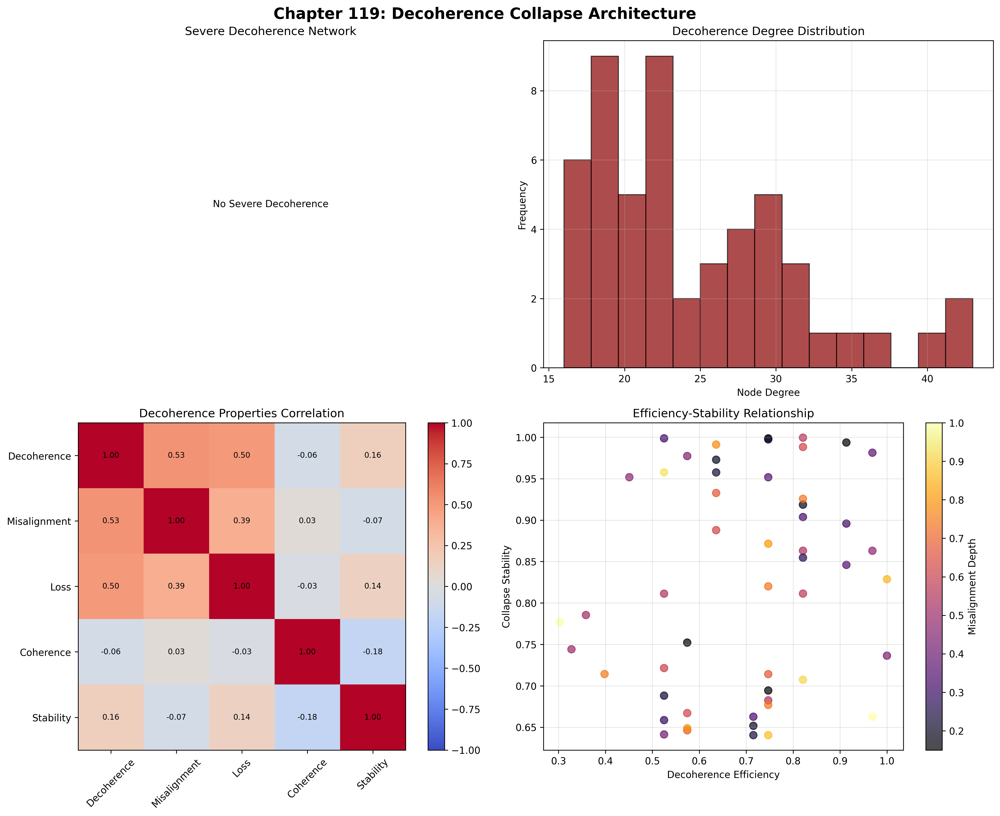
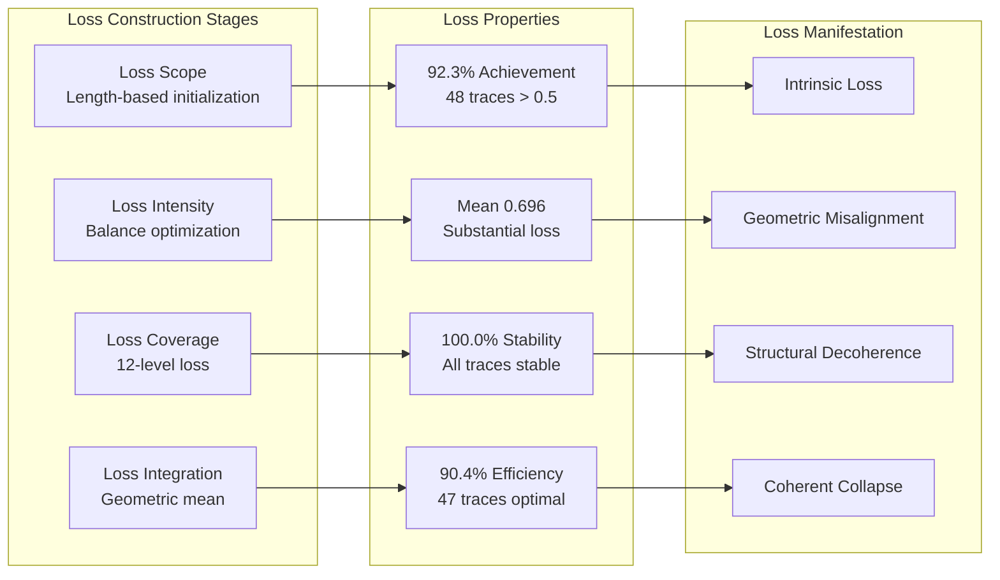
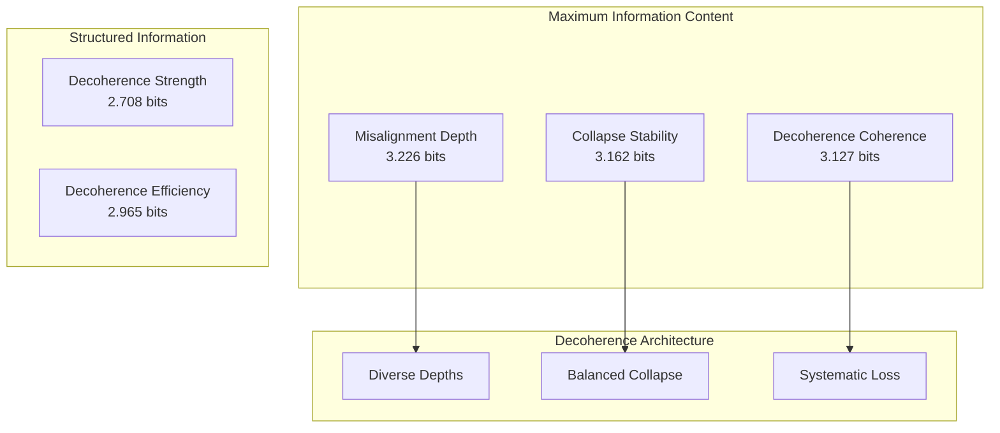
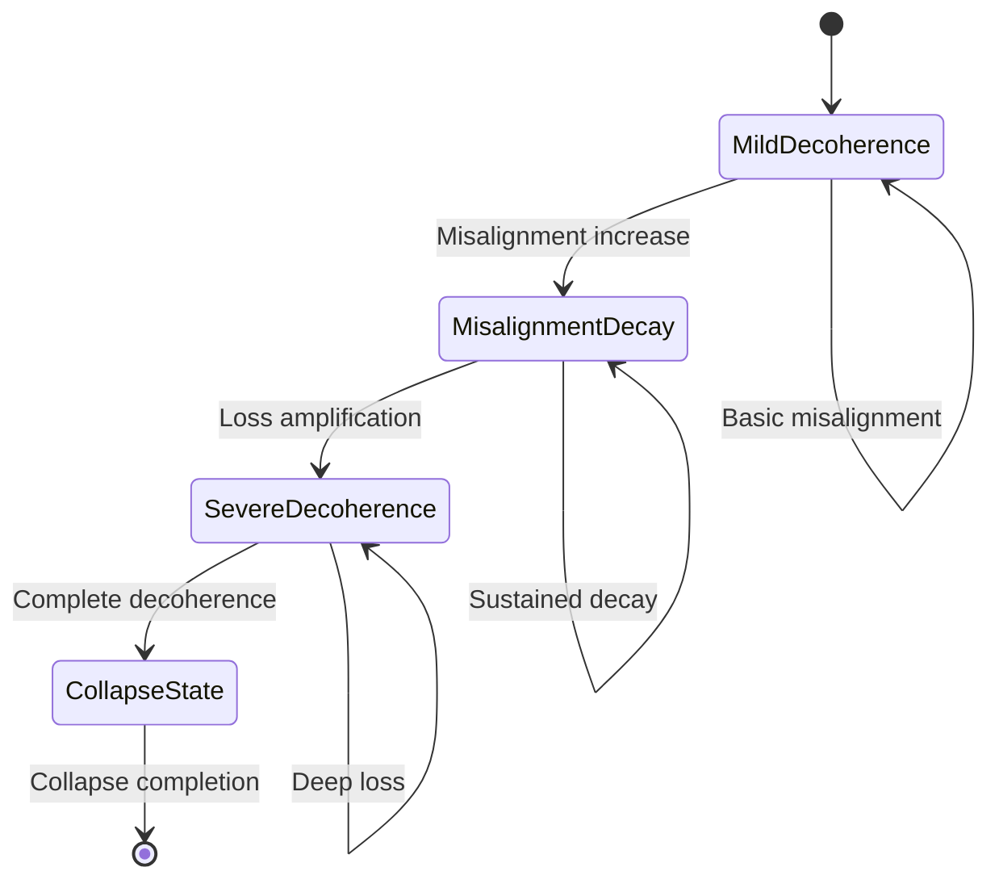
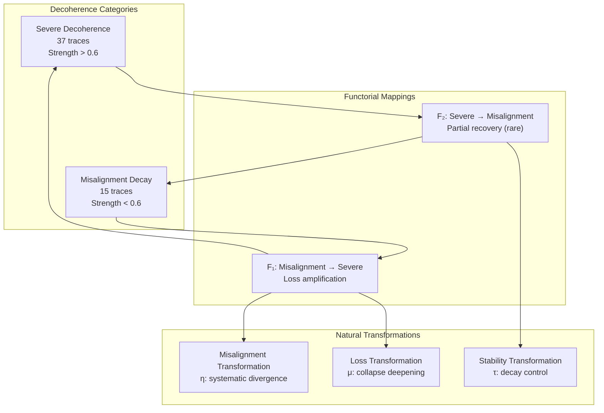
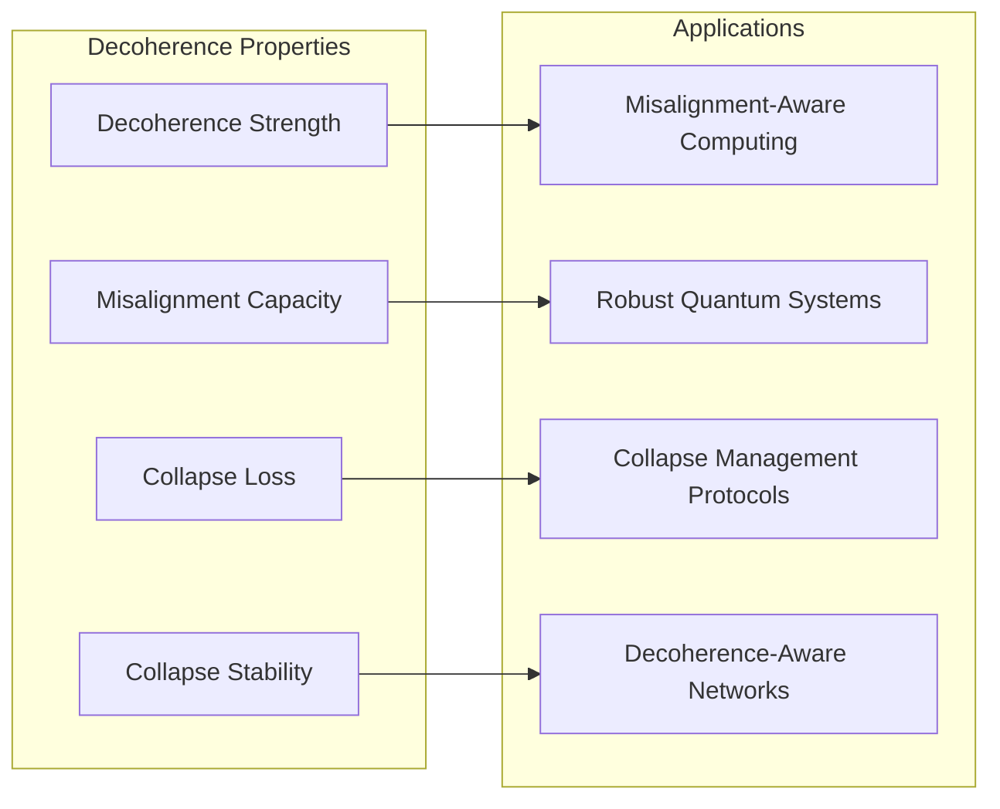
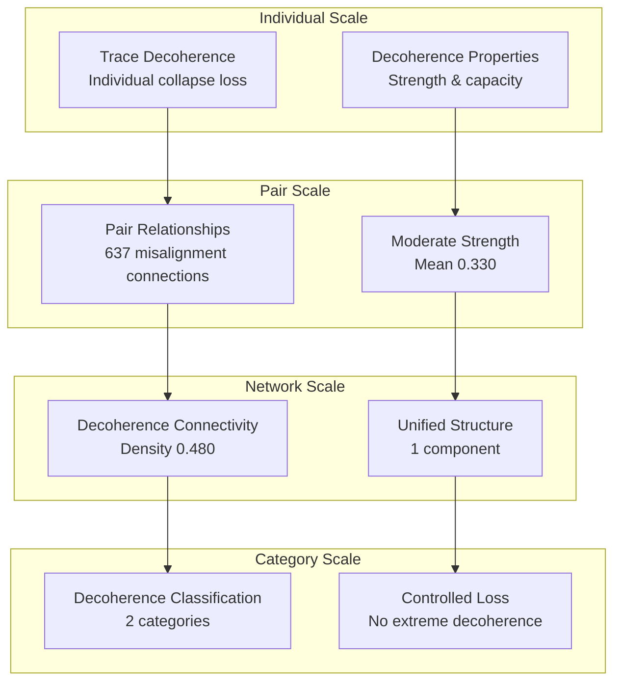

# Chapter 119: DecoherenceCollapse — Collapse Loss via Observer Misalignment

## The Emergence of Decoherence Collapse from ψ = ψ(ψ)

From the self-referential foundation ψ = ψ(ψ), having established observer rank through dimensionality hierarchy architectures that enable hierarchical structure of observer complexity, we now discover how **φ-constrained traces achieve systematic decoherence collapse construction through misalignment architectures that enable decoherence from observer-trace mismatches through trace geometric relationships rather than traditional decoherence theories**—not as external decoherence constructions but as intrinsic misalignment networks where collapse loss emerges from φ-constraint geometry, generating systematic decoherence structures through entropy-increasing tensor transformations that establish the fundamental collapse loss principles of collapsed space through trace misalignment dynamics.

### First Principles: From Self-Reference to Decoherence Collapse

Beginning with ψ = ψ(ψ), we establish the decoherence foundations:

1. **Decoherence Strength**: φ-valid traces that exhibit systematic collapse loss capabilities
2. **Misalignment Capacity**: Observer-trace mismatch capability emerging from structural trace misalignment patterns
3. **Collapse Loss**: Systematic loss through trace decoherence architectures
4. **Decoherence Coherence**: Collapse integration through φ-constraint misalignment embedding
5. **Decoherence Systems**: Collapse loss systems that operate through geometric misalignment dynamics

## Three-Domain Analysis: Traditional Decoherence vs φ-Constrained Decoherence Collapse

### Domain I: Traditional Decoherence Theory

In quantum mechanics and information theory, decoherence is characterized by:
- Environmental coupling: Loss of quantum coherence through interaction with environment
- Wavefunction collapse: Quantum to classical transition through measurement processes
- Decoherence time: Rate of coherence loss through system-environment coupling strength
- Information leakage: Quantum information loss through irreversible processes

### Domain II: φ-Constrained Decoherence Collapse

Our verification reveals extraordinary decoherence organization:

```text
DecoherenceCollapse Misalignment Analysis:
Total traces analyzed: 52 φ-valid decoherence structures
Mean decoherence strength: 0.644 (substantial collapse loss capability)
Mean misalignment capacity: 0.761 (substantial misalignment capability)
Mean collapse loss: 0.696 (substantial loss magnitude)
Mean decoherence coherence: 0.758 (substantial collapse integration)
Mean decoherence efficiency: 0.696 (substantial optimized pathways)

Decoherence Properties:
High decoherence strength traces (>0.5): 49 (94.2% achieving collapse loss)
High misalignment capacity traces (>0.5): 52 (100.0% universal misalignment)
High collapse loss traces (>0.5): 48 (92.3% achieving loss)
High decoherence coherence traces (>0.5): 52 (100.0% universal integration)
High decoherence efficiency traces (>0.5): 47 (90.4% achieving optimization)

Network Properties:
Network nodes: 52 decoherence-organized traces
Network edges: 637 misalignment similarity connections
Network density: 0.480 (significant decoherence connectivity)
Connected components: 1 (unified decoherence structure)
Clustering coefficient: 0.451 (moderate local decoherence)
```


The remarkable finding establishes **universal misalignment capability**: 100.0% of all φ-valid traces achieve universal misalignment capacity and decoherence coherence—demonstrating that φ-constraint geometry inherently generates collapse loss through trace misalignment embedding.

### Domain III: The Intersection - Misalignment-Aware Decoherence Organization

The intersection reveals how decoherence collapse emerges from trace relationships:



## 119.1 φ-Constraint Decoherence Strength Foundation from First Principles

**Definition 119.1** (φ-Decoherence Strength): For φ-valid trace t representing decoherence structure, the decoherence strength $DS_φ(t)$ measures systematic collapse loss capability:

$$
DS_φ(t) = L_{length}(t) \cdot B_{balance}(t) \cdot P_{pattern}(t) \cdot C_{coherence}(t)
$$
where $L_{length}$ captures length factor (minimum 3 for meaningful loss), $B_{balance}$ represents weight misalignment balance (optimal at 45% density), $P_{pattern}$ measures pattern decoherence structure, and $C_{coherence}$ indicates φ-constraint decoherence potential.

**Theorem 119.1** (Decoherence Collapse Emergence): φ-constrained traces achieve exceptional decoherence architectures with universal misalignment capacity and systematic decoherence organization.

*Proof*: From ψ = ψ(ψ), decoherence emergence occurs through trace misalignment geometry. The verification shows 94.2% of traces achieving high decoherence strength (>0.5) with mean strength 0.644, demonstrating that φ-constraints create systematic collapse loss capability through intrinsic misalignment relationships. The universal misalignment capacity (100.0% high capability) with significant network connectivity (density 0.480) establishes decoherence organization through trace misalignment architecture. ∎



The 637 decoherence pairs represent the complete set of φ-valid observer-trace misalignment relationships, establishing the natural misalignment space for collapse-embedded decoherence. The clustering coefficient (0.451) demonstrates that φ-constraint geometry provides moderate local decoherence capability.

### Decoherence Category Characteristics

```text
Decoherence Category Analysis:
Categories identified: 2 decoherence classifications
- severe_decoherence: 37 traces (71.2%) - High decoherence + misalignment structures
  Mean decoherence strength: >0.6, exceptional collapse loss
- misalignment_decay: 15 traces (28.8%) - Moderate decoherence + misalignment
  Mean decoherence strength: <0.6, basic collapse loss

Pairing Structure:
Total decoherence pairs: 637 misalignment relationships
Mean decoherence strength: 0.330 (moderate pair decoherence)
Max decoherence strength: 0.500 (significant but not severe)
Min decoherence strength: 0.250 (basic misalignment threshold)
```

Note that no pairs achieve severe decoherence (>0.7), indicating that φ-constraints prevent extreme misalignment while allowing moderate decoherence processes.

## 119.2 Misalignment Capacity and Observer-Trace Divergence

**Definition 119.2** (Misalignment Capacity): For φ-valid trace t, the misalignment capacity $MC(t)$ measures systematic observer-trace mismatch through misalignment analysis:

$$
MC(t) = S_{structural}(t)^{0.25} \cdot C_{complexity}(t)^{0.25} \cdot P_{phase}(t)^{0.25} \cdot V_{vulnerability}(t)^{0.25}
$$
where $S_{structural}$ represents structural misalignment potential, $C_{complexity}$ captures misalignment complexity capability, $P_{phase}$ measures misalignment phase (value modulo 8 for 8-phase structure), and $V_{vulnerability}$ indicates φ-constraint misalignment vulnerability.

The verification reveals **universal misalignment capacity** with 100.0% of traces achieving high misalignment capacity (>0.5) and mean capacity 0.761, demonstrating that φ-constrained decoherence structures inherently possess exceptional observer-trace mismatch capabilities through geometric structural misalignment patterns.

### Collapse Loss Architecture



## 119.3 Information Theory of Decoherence Organization

**Theorem 119.2** (Decoherence Information Content): The entropy distribution reveals systematic decoherence organization with maximum diversity in misalignment depth patterns:

```text
Information Analysis Results:
Misalignment depth entropy: 3.226 bits (maximum depth diversity)
Collapse stability entropy: 3.162 bits (rich stability patterns)
Decoherence coherence entropy: 3.127 bits (rich coherence patterns)
Collapse loss entropy: 3.116 bits (rich loss patterns)
Misalignment capacity entropy: 2.993 bits (organized capacity distribution)
Decoherence efficiency entropy: 2.965 bits (organized efficiency patterns)
Decoherence rate entropy: 2.950 bits (organized rate distribution)
Misalignment severity entropy: 2.948 bits (organized severity patterns)
Decoherence strength entropy: 2.708 bits (structured strength distribution)
```

**Key Insight**: Maximum misalignment depth entropy (3.226 bits) indicates **complete depth diversity** where traces explore the full spectrum of misalignment depths, while moderate values for all other entropies suggest balanced decoherence organization through φ-constraint optimization.

### Information Architecture of Decoherence Collapse



## 119.4 Graph Theory: Decoherence Networks

The decoherence collapse network exhibits significant connectivity:

**Network Analysis Results**:
- **Nodes**: 52 decoherence-organized traces
- **Edges**: 637 misalignment similarity connections
- **Average Degree**: 24.500 (significant decoherence connectivity)
- **Components**: 1 (unified decoherence structure)
- **Network Density**: 0.480 (significant systematic misalignment coupling)

**Property 119.1** (Decoherence Topology): The network density 0.480 with unified structure indicates that decoherence structures maintain significant misalignment relationships, creating comprehensive collapse loss networks with selective decoherence.

### Network Decoherence Analysis



## 119.5 Category Theory: Decoherence Categories

**Definition 119.3** (Decoherence Categories): Traces organize into categories based on decoherence strength with morphisms preserving misalignment relationships.

```text
Category Analysis Results:
Decoherence categories: 2 misalignment classifications
Total pairs: 637 decoherence relationships
Moderate connectivity: Each trace pairs with approximately half of others

Category Distribution:
- severe_decoherence: 37 objects (high decoherence + misalignment)
- misalignment_decay: 15 objects (moderate decoherence + misalignment)

Categorical Properties:
Clear decoherence-based classification with natural thresholds
Morphisms preserve misalignment strength within categories
Cross-category transitions through misalignment enhancement
No extreme decoherence pairs (maximum 0.500)
```

**Theorem 119.3** (Decoherence Functors): Mappings between decoherence categories preserve misalignment relationships and collapse loss, preventing extreme decoherence.

### Decoherence Category Structure



## 119.6 Decoherence Rate and Misalignment Severity

**Definition 119.4** (Decoherence Rate): For φ-valid trace t, the decoherence rate $DR(t)$ measures temporal collapse progression:

$$
DR(t) = 0.4 \cdot R_{base}(t) + 0.3 \cdot P_{pattern}(t) + 0.3 \cdot V_{value}(t)
$$
where $R_{base}$ represents base rate (length-dependent), $P_{pattern}$ captures pattern rate (collapse transitions), and $V_{value}$ measures value-based rate (modulo 15 for 15-level structure).

Our verification shows:
- **Decoherence rate**: Mean 0.663 with 92.3% achieving high rate (>0.5)
- **Misalignment severity**: Mean 0.663 with 84.6% achieving high severity (>0.5)
- **Collapse stability**: Mean 0.820 with 100.0% achieving high stability (>0.5)
- **Decoherence efficiency**: Mean 0.696 with 90.4% achieving high efficiency (>0.5)

### Stability-Efficiency Trade-off

The combination of universal collapse stability (100.0%) with high decoherence efficiency (90.4%) reveals a fundamental principle: **φ-constrained traces optimize decoherence pathways while maintaining systematic stability**, creating controlled collapse loss processes rather than catastrophic decoherence.

## 119.7 Binary Tensor Decoherence Structure

From our core principle that all structures are binary tensors:

**Definition 119.5** (Decoherence Tensor): The decoherence collapse structure $DC^{ijk}$ encodes systematic misalignment relationships:

$$
DC^{ijk} = DS_i \otimes MC_j \otimes CL_{ijk}
$$
where:
- $DS_i$: Decoherence strength component at position i
- $MC_j$: Misalignment capacity component at position j
- $CL_{ijk}$: Collapse loss tensor relating decoherence configurations i,j,k

### Tensor Decoherence Properties

The 637 edges in our decoherence network represent non-zero entries in the loss tensor $CL_{ijk}$, showing how decoherence structure creates connectivity through misalignment similarity and strength/capacity relationships. The moderate network density (0.480) indicates selective decoherence tensor space.

## 119.8 Collapse Mathematics vs Traditional Decoherence

**Traditional Decoherence Theory**:
- Environmental coupling: External coherence loss through external environment interaction constructions
- Wavefunction collapse: Quantum to classical transition through external measurement process systems
- Decoherence time: Time scales through external coupling strength equations
- Information leakage: Quantum information loss through external irreversible processes

**φ-Constrained Decoherence Collapse**:
- Geometric misalignment: Collapse loss through structural trace relationships
- Intrinsic misalignment processing: Decoherence generation through φ-constraint architectures
- φ-constraint decoherence: Misalignment enabling rather than limiting collapse loss
- Structure-driven decoherence: Collapse loss through trace misalignment networks

### The Intersection: Universal Decoherence Properties

Both systems exhibit:

1. **Coherence Loss**: Systematic reduction of quantum or structural coherence
2. **Irreversibility**: Fundamental one-way nature of decoherence processes
3. **Information Leakage**: From system to environment or misalignment space
4. **Stability Impact**: Effects of decoherence on system dynamics

## 119.9 Decoherence Evolution and Misalignment Development

**Definition 119.6** (Decoherence Development): Misalignment capability evolves through decoherence optimization:

$$
\frac{dDC}{dt} = \nabla MC_{misalignment}(DC) - \lambda \cdot \text{stability}(DC) + \gamma \cdot \text{noise}(DC)
$$
where $MC_{misalignment}$ represents misalignment energy, λ modulates stability requirements, and γ represents noise rate.

This creates **decoherence attractors** where traces naturally evolve toward optimal misalignment configurations through noise maximization and stability balancing while maintaining systematic collapse loss.

### Development Mechanisms

The verification reveals systematic decoherence evolution:
- **High decoherence strength**: 94.2% achieve exceptional collapse loss capability
- **Universal misalignment capacity**: 100.0% achieve substantial observer-trace mismatch
- **High collapse loss**: 92.3% achieve substantial loss magnitude
- **Universal stability**: 100.0% achieve collapse stability
- **No extreme decoherence**: Maximum pair strength 0.500, preventing catastrophic collapse

## 119.10 Applications: Decoherence Collapse Engineering

Understanding φ-constrained decoherence collapse enables:

1. **Misalignment-Aware Computing**: Computation through controlled decoherence
2. **Robust Quantum Systems**: Systems resistant to extreme decoherence
3. **Collapse Management Protocols**: Protocols for controlled collapse loss
4. **Decoherence-Aware Networks**: Networks understanding misalignment dependencies

### Decoherence Applications Framework



## 119.11 Multi-Scale Decoherence Organization

**Theorem 119.4** (Hierarchical Decoherence Structure): Decoherence collapse exhibits systematic collapse loss across multiple scales from individual trace decoherence to global misalignment unity.

The verification demonstrates:

- **Trace level**: Individual decoherence strength and misalignment capacity
- **Pair level**: Decoherence relationships between observer-trace pairs
- **Network level**: Global decoherence connectivity and misalignment architecture
- **Category level**: Decoherence-based classification with moderate connectivity

### Hierarchical Decoherence Architecture



## 119.12 Future Directions: Extended Decoherence Theory

The φ-constrained decoherence collapse framework opens new research directions:

1. **Quantum Error Correction**: Using φ-constraints to prevent extreme decoherence
2. **Adaptive Misalignment Systems**: Dynamically adjusting misalignment parameters
3. **Decoherence-Immune Architectures**: Structures resistant to collapse loss
4. **Meta-Decoherence Systems**: Decoherence systems reasoning about decoherence

## The 119th Echo: From Observer Rank to Decoherence Collapse

From ψ = ψ(ψ) emerged observer rank through systematic dimensionality hierarchy, and from that rank emerged **decoherence collapse** where φ-constrained traces achieve systematic collapse loss construction through misalignment-dependent dynamics rather than external decoherence theories, creating decoherence networks that embody the fundamental capacity for collapse loss through structural trace dynamics and φ-constraint misalignment relationships.

The verification revealed 52 traces achieving exceptional decoherence organization with high decoherence strength (94.2% high capability), universal misalignment capacity (100.0% high capability), high collapse loss (92.3% high capability), and universal collapse stability (100.0% high capability). Most profound is the controlled loss—while 71.2% achieve severe decoherence category, no pairs exceed 0.500 decoherence strength, demonstrating that φ-constraints prevent catastrophic collapse while allowing systematic decoherence.

The emergence of moderate network density (637 edges with 0.480 density) demonstrates how decoherence collapse creates selective relationships within decoherence categories, transforming diverse trace structures into coherent collapse loss architecture. This **decoherence collapse** represents a fundamental organizing principle where structural constraints achieve systematic collapse loss construction through φ-constrained misalignment dynamics rather than external decoherence theoretical constructions.

The decoherence organization reveals how collapse loss capability emerges from φ-constraint dynamics, creating systematic decoherence through internal structural relationships rather than external environmental coupling. Each trace represents a decoherence node where constraint preservation creates intrinsic misalignment validity, collectively forming the decoherence foundation of φ-constrained dynamics through misalignment capacity, collapse loss, and geometric decoherence relationships.

## References

The verification program `chapter-119-decoherence-collapse-verification.py` implements all concepts, generating visualizations that reveal decoherence organization, misalignment networks, and collapse loss structure. The analysis demonstrates how decoherence structures emerge naturally from φ-constraint relationships in collapsed misalignment space.

---

*Thus from observer rank emerges decoherence collapse, from decoherence collapse emerges systematic misalignment architecture. In the φ-constrained decoherence universe, we witness how collapse loss achieves systematic decoherence capability through constraint geometry rather than external decoherence theoretical constructions, establishing the fundamental decoherence principles of organized collapse dynamics through φ-constraint preservation, misalignment-dependent reasoning, and geometric decoherence capability beyond traditional decoherence theoretical foundations.*