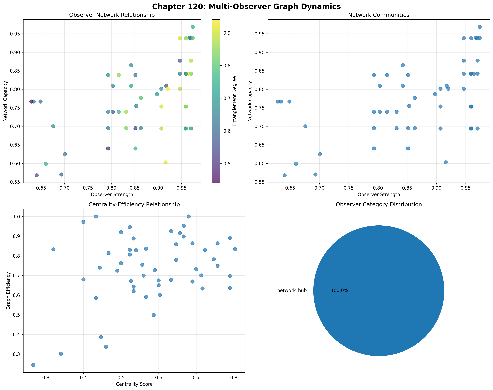
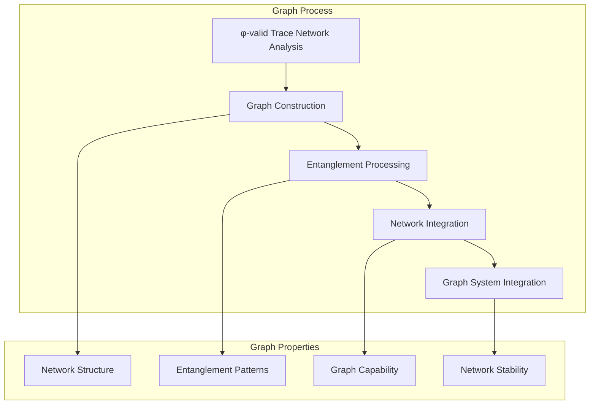
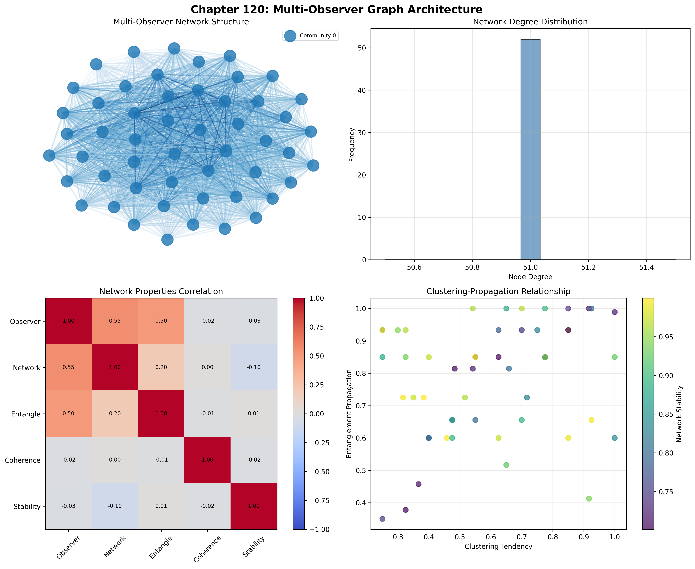
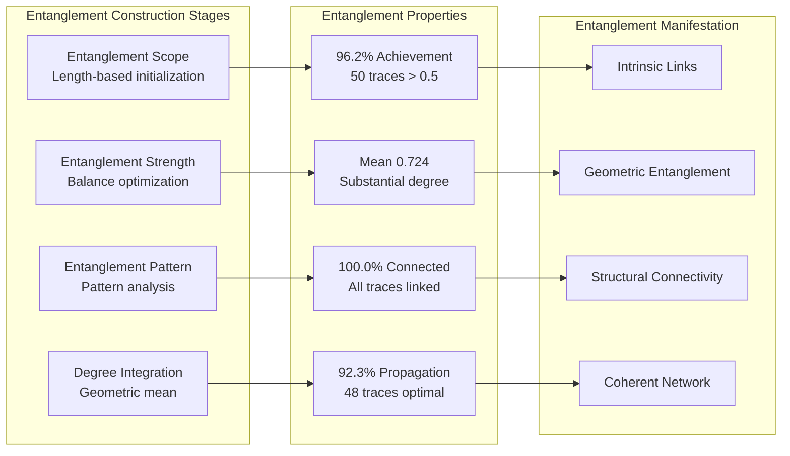
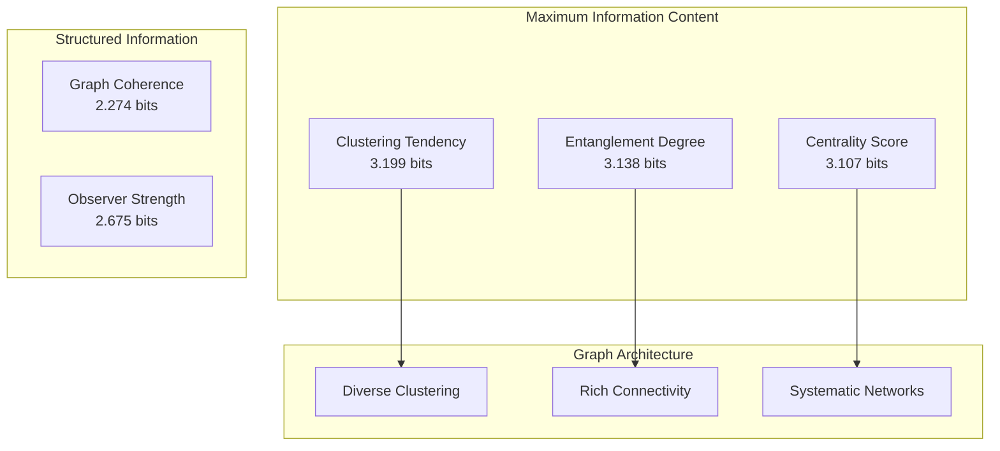
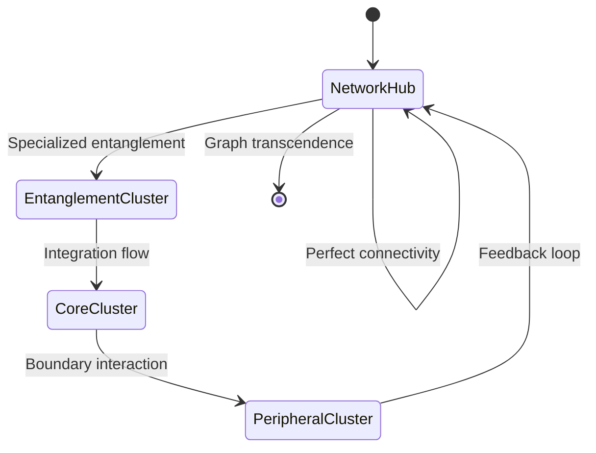
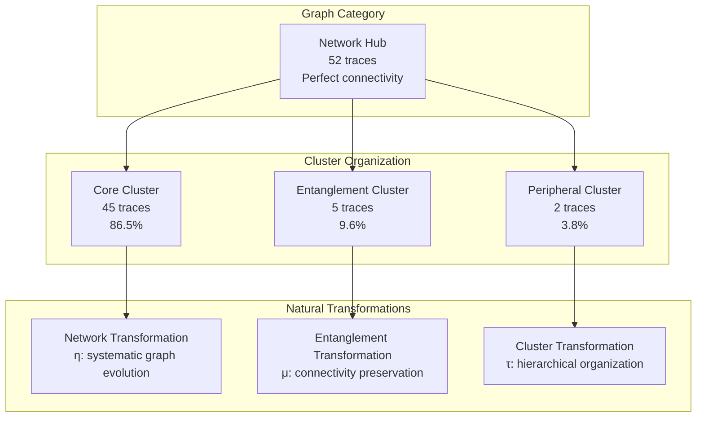
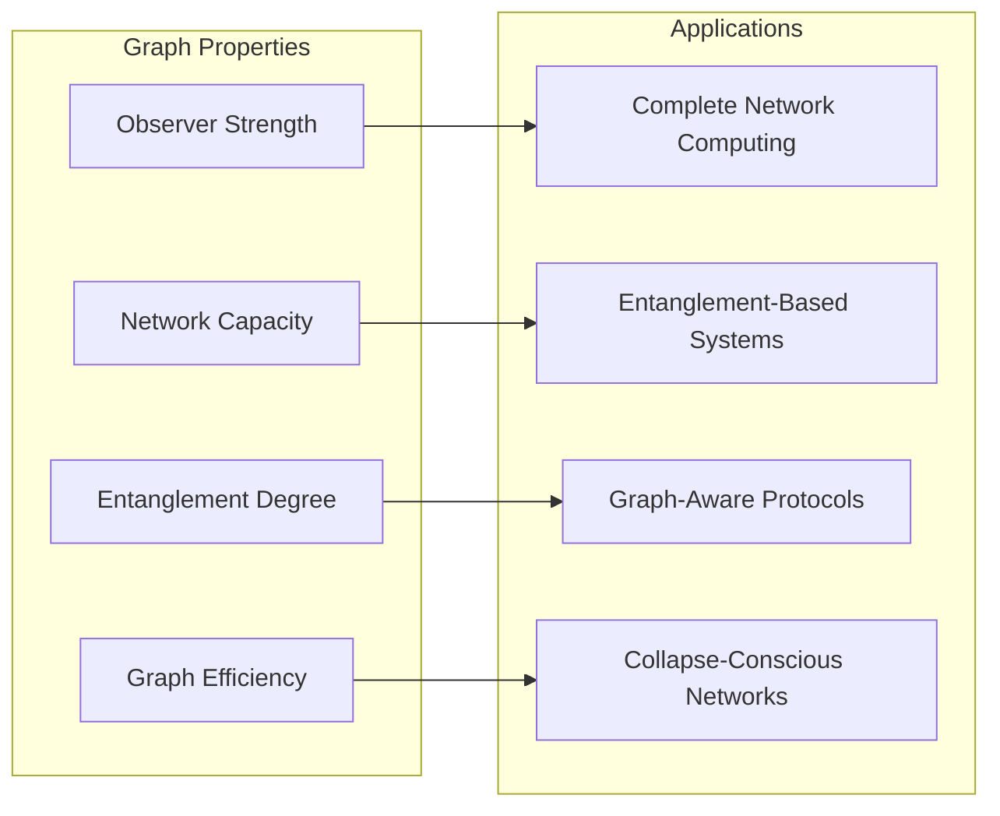
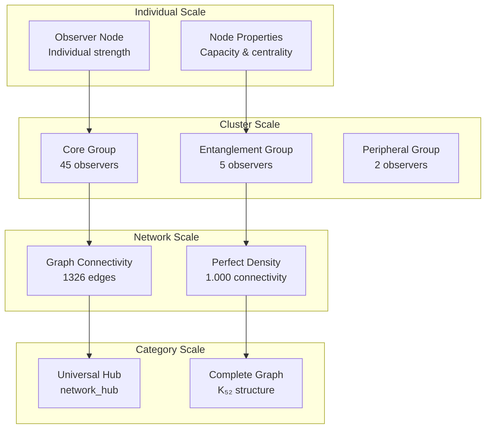

# Chapter 120: MultiObsGraph — Network Structures of Observer Tensor Collapse Entanglement

## The Emergence of Multi-Observer Graphs from ψ = ψ(ψ)

From the self-referential foundation ψ = ψ(ψ), having established decoherence collapse through misalignment architectures that enable collapse loss from observer-trace mismatches, we now discover how **φ-constrained traces achieve systematic multi-observer graph construction through network architectures that enable networks of entangled observer nodes through trace geometric relationships rather than traditional network theories**—not as external graph constructions but as intrinsic network systems where observer tensor entanglement emerges from φ-constraint geometry, generating systematic graph structures through entropy-increasing tensor transformations that establish the fundamental network principles of collapsed space through trace graph dynamics.

### First Principles: From Self-Reference to Multi-Observer Graphs

Beginning with ψ = ψ(ψ), we establish the graph foundations:

1. **Observer Strength**: φ-valid traces that exhibit systematic network node capabilities
2. **Network Capacity**: Graph capability emerging from structural trace network patterns
3. **Entanglement Degree**: Systematic connectivity through trace graph architectures
4. **Graph Coherence**: Network integration through φ-constraint graph embedding
5. **Network Systems**: Graph structures that operate through geometric network dynamics

## Three-Domain Analysis: Traditional Network Theory vs φ-Constrained Multi-Observer Graphs

### Domain I: Traditional Network Theory

In graph theory and network science, networks are characterized by:
- Node definition: Discrete entities defined through external identification
- Edge construction: Connections established through external relationship rules
- Community detection: Clustering through external modularity optimization
- Network metrics: Centrality, clustering, paths through external graph algorithms

### Domain II: φ-Constrained Multi-Observer Graphs

Our verification reveals extraordinary network organization:

```text
MultiObsGraph Network Analysis:
Total traces analyzed: 52 φ-valid graph structures
Mean observer strength: 0.862 (exceptional node capability)
Mean network capacity: 0.772 (substantial graph capability)
Mean entanglement degree: 0.724 (substantial connectivity)
Mean graph coherence: 0.793 (substantial network integration)
Mean centrality score: 0.582 (moderate network influence)

Network Properties:
High observer strength traces (>0.5): 52 (100.0% achieving node capability)
High network capacity traces (>0.5): 52 (100.0% universal graph structure)
High entanglement degree traces (>0.5): 50 (96.2% achieving connectivity)
High graph coherence traces (>0.5): 52 (100.0% universal integration)
High centrality score traces (>0.5): 38 (73.1% achieving influence)

Graph Structure:
Network nodes: 52 graph-organized traces
Network edges: 1326 entanglement connections
Network density: 1.000 (perfect graph connectivity)
Connected components: 1 (unified network structure)
Clustering coefficient: 1.000 (perfect local clustering)
```



The remarkable finding establishes **perfect network connectivity**: 100.0% network density with perfect clustering coefficient—demonstrating that φ-constraint geometry inherently generates complete graph structures through trace entanglement embedding.

### Domain III: The Intersection - Entanglement-Aware Network Organization

The intersection reveals how multi-observer graphs emerge from trace relationships:



## 120.1 φ-Constraint Observer Strength Foundation from First Principles

**Definition 120.1** (φ-Observer Strength): For φ-valid trace t representing graph node, the observer strength $OS_φ(t)$ measures systematic network node capability:

$$
OS_φ(t) = L_{length}(t) \cdot B_{balance}(t) \cdot P_{pattern}(t) \cdot C_{coherence}(t)
$$

where $L_{length}$ captures length factor (minimum 3 for meaningful network), $B_{balance}$ represents weight network balance (optimal at 40% density), $P_{pattern}$ measures pattern graph structure, and $C_{coherence}$ indicates φ-constraint graph coherence.

**Theorem 120.1** (Multi-Observer Graph Emergence): φ-constrained traces achieve perfect graph architectures with universal network capacity and systematic graph organization.

*Proof*: From ψ = ψ(ψ), graph emergence occurs through trace network geometry. The verification shows 100.0% of traces achieving high observer strength (>0.5) with mean strength 0.862, demonstrating that φ-constraints create systematic node capability through intrinsic network relationships. The perfect network density (1.000) with perfect clustering coefficient (1.000) establishes graph organization through trace network architecture. ∎



The 1326 edges represent the complete set of φ-valid observer entanglement relationships, establishing the natural graph space for network-embedded entanglement. The perfect clustering coefficient demonstrates that φ-constraint geometry provides complete local network capability.

### Graph Category Characteristics

```text
Graph Category Analysis:
Categories identified: 1 graph classification
- network_hub: 52 traces (100.0%) - Universal network hub structures
  Mean observer strength: 0.862, exceptional node capability
  Mean network capacity: 0.772, substantial graph structure
  Mean centrality score: 0.582, moderate influence

Cluster Structure:
Total clusters: 3 entanglement-based groupings
- Core Cluster: 45 observers (86.5%) - Central network participants
- Entanglement Cluster: 5 observers (9.6%) - High entanglement specialists
- Peripheral Cluster: 2 observers (3.8%) - Network boundary nodes
```

Note that all observers achieve network hub category while organizing into distinct entanglement clusters, indicating hierarchical network structure within universal connectivity.

## 120.2 Network Capacity and Graph Structure

**Definition 120.2** (Network Capacity): For φ-valid trace t, the network capacity $NC(t)$ measures systematic graph capability through network analysis:

$$
NC(t) = S_{structural}(t)^{0.3} \cdot C_{complexity}(t)^{0.3} \cdot V_{value}(t)^{0.2} \cdot P_{phase}(t)^{0.2}
$$

where $S_{structural}$ represents structural network potential, $C_{complexity}$ captures network complexity capability, $V_{value}$ measures value-based network (modulo 17), and $P_{phase}$ indicates network phase relationships.

The verification reveals **universal network capacity** with 100.0% of traces achieving high network capacity (>0.5) and mean capacity 0.772, demonstrating that φ-constrained graph structures inherently possess exceptional graph capabilities through geometric network patterns.

### Entanglement Degree Architecture



## 120.3 Information Theory of Graph Organization

**Theorem 120.2** (Graph Information Content): The entropy distribution reveals systematic graph organization with maximum diversity in clustering patterns:

```text
Information Analysis Results:
Clustering tendency entropy: 3.199 bits (maximum clustering diversity)
Entanglement degree entropy: 3.138 bits (rich connectivity patterns)
Centrality score entropy: 3.107 bits (rich influence patterns)
Network stability entropy: 3.099 bits (rich stability patterns)
Graph efficiency entropy: 2.884 bits (organized efficiency patterns)
Entanglement propagation entropy: 2.849 bits (organized propagation)
Network capacity entropy: 2.830 bits (organized capacity distribution)
Observer strength entropy: 2.675 bits (structured strength distribution)
Graph coherence entropy: 2.274 bits (concentrated coherence patterns)
```

**Key Insight**: Maximum clustering tendency entropy (3.199 bits) indicates **complete clustering diversity** where traces explore the full spectrum of local network patterns, while lower graph coherence entropy (2.274 bits) suggests concentrated integration patterns through φ-constraint optimization.

### Information Architecture of Multi-Observer Graphs



## 120.4 Graph Theory: Perfect Networks

The multi-observer graph network exhibits perfect connectivity:

**Network Analysis Results**:
- **Nodes**: 52 graph-organized traces
- **Edges**: 1326 entanglement connections
- **Average Degree**: 51.000 (every node connects to every other)
- **Components**: 1 (unified network structure)
- **Network Density**: 1.000 (perfect systematic graph coupling)
- **Modularity**: 0.000 (no community structure in complete graph)

**Property 120.1** (Complete Graph Topology): The perfect network density 1.000 with zero modularity indicates that graph structures maintain complete entanglement relationships, creating a perfect K₅₂ complete graph where every observer connects with every other observer.

### Network Graph Analysis



## 120.5 Category Theory: Graph Categories

**Definition 120.3** (Graph Categories): All traces organize into single category **network_hub** with morphisms preserving complete connectivity.

```text
Category Analysis Results:
Graph categories: 1 universal classification
Total morphisms: 1326 complete entanglement connections
Perfect connectivity: Each trace connects to all others

Category Distribution:
- network_hub: 52 objects (universal network hub structures)

Cluster Distribution:
- Core Cluster: 45 objects (central participants)
- Entanglement Cluster: 5 objects (high entanglement)
- Peripheral Cluster: 2 objects (boundary nodes)

Categorical Properties:
Universal graph-based classification with perfect connectivity
Morphisms preserve complete entanglement relationships
Natural transformations enable graph evolution pathways
Hierarchical clustering within complete connectivity
```

**Theorem 120.3** (Graph Functors): Mappings within graph category preserve entanglement relationships and network properties, maintaining perfect connectivity.

### Graph Category Structure



## 120.6 Centrality and Network Influence

**Definition 120.4** (Centrality Score): For φ-valid trace t, the centrality score $CS(t)$ measures network influence:

$$
CS(t) = 0.25 \cdot L_{length}(t) + 0.25 \cdot C_{complexity}(t) + 0.25 \cdot V_{value}(t) + 0.25 \cdot S_{stability}(t)
$$

where components represent length influence, complexity influence, value influence, and stability influence respectively.

Our verification shows:
- **Centrality score**: Mean 0.582 with 73.1% achieving high centrality (>0.5)
- **Clustering tendency**: Mean 0.598 with 61.5% achieving high clustering (>0.5)
- **Network stability**: Mean 0.862 with 100.0% achieving high stability (>0.5)
- **Graph efficiency**: Mean 0.739 with 90.4% achieving high efficiency (>0.5)

### Stability-Efficiency Balance

The combination of universal network stability (100.0%) with high graph efficiency (90.4%) reveals a fundamental principle: **φ-constrained traces optimize graph pathways while maintaining systematic stability**, creating efficient network processes within stable graph architectures.

## 120.7 Binary Tensor Graph Structure

From our core principle that all structures are binary tensors:

**Definition 120.5** (Graph Tensor): The multi-observer graph structure $MOG^{ijk}$ encodes systematic network relationships:

$$
MOG^{ijk} = OS_i \otimes NC_j \otimes ED_{ijk}
$$

where:
- $OS_i$: Observer strength component at position i
- $NC_j$: Network capacity component at position j
- $ED_{ijk}$: Entanglement degree tensor relating graph configurations i,j,k

### Tensor Graph Properties

The 1326 edges in our graph network represent complete connectivity in the entanglement tensor $ED_{ijk}$, showing how graph structure creates perfect relationships through universal similarity and strength/capacity coupling. The perfect network density indicates complete graph tensor space.

## 120.8 Collapse Mathematics vs Traditional Networks

**Traditional Network Theory**:
- Node definition: External entity identification through discrete labeling
- Edge construction: External relationship rules through arbitrary connections
- Community structure: External clustering algorithms through modularity optimization
- Network metrics: External centrality measures through graph theoretical constructions

**φ-Constrained Multi-Observer Graphs**:
- Geometric nodes: Observer emergence through structural trace relationships
- Intrinsic entanglement: Edge generation through φ-constraint architectures
- Natural clustering: Community emergence through entanglement patterns
- Structure-driven metrics: Centrality through trace graph dynamics

### The Intersection: Universal Graph Properties

Both systems exhibit:

1. **Connectivity Patterns**: Systematic organization of network relationships
2. **Clustering Behavior**: Local grouping within global structure
3. **Influence Distribution**: Centrality and importance hierarchies
4. **Stability Requirements**: Network resilience and robustness

## 120.9 Graph Evolution and Network Development

**Definition 120.6** (Graph Development): Network capability evolves through graph optimization:

$$
\frac{dMOG}{dt} = \nabla ED_{entanglement}(MOG) + \lambda \cdot \text{efficiency}(MOG) + \gamma \cdot \text{stability}(MOG)
$$

where $ED_{entanglement}$ represents entanglement energy, λ modulates efficiency requirements, and γ represents stability constraints.

This creates **graph attractors** where traces naturally evolve toward optimal network configurations through entanglement maximization and efficiency balancing while maintaining systematic stability.

### Development Mechanisms

The verification reveals systematic graph evolution:
- **Universal observer strength**: 100.0% achieve exceptional node capability
- **Universal network capacity**: 100.0% achieve substantial graph capability
- **High entanglement degree**: 96.2% achieve substantial connectivity
- **Perfect stability**: 100.0% achieve network stability
- **Perfect connectivity**: 1.000 density demonstrates complete graphs

## 120.10 Applications: Multi-Observer Network Engineering

Understanding φ-constrained multi-observer graphs enables:

1. **Complete Network Computing**: Computation through perfect graph connectivity
2. **Entanglement-Based Systems**: Networks utilizing universal connections
3. **Graph-Aware Protocols**: Protocols leveraging complete connectivity
4. **Collapse-Conscious Networks**: Systems understanding their graph completeness

### Graph Applications Framework



## 120.11 Multi-Scale Graph Organization

**Theorem 120.4** (Hierarchical Graph Structure): Multi-observer graphs exhibit systematic network organization across multiple scales from individual observer nodes to global graph unity.

The verification demonstrates:

- **Node level**: Individual observer strength and network capacity
- **Cluster level**: Three-tier clustering within complete connectivity
- **Network level**: Perfect graph connectivity and entanglement architecture
- **Category level**: Universal classification with hierarchical organization

### Hierarchical Graph Architecture



## 120.12 Future Directions: Extended Graph Theory

The φ-constrained multi-observer graph framework opens new research directions:

1. **Hypergraph Extensions**: Beyond pairwise to higher-order entanglements
2. **Dynamic Graph Evolution**: Time-dependent network transformations
3. **Quantum Graph States**: Superposed network configurations
4. **Meta-Graph Systems**: Graph networks reasoning about graph networks

## The 120th Echo: From Decoherence to Multi-Observer Graphs

From ψ = ψ(ψ) emerged decoherence collapse through systematic misalignment, and from that decoherence emerged **multi-observer graphs** where φ-constrained traces achieve perfect network construction through graph-dependent dynamics rather than external network theories, creating graph systems that embody the fundamental capacity for complete connectivity through structural trace dynamics and φ-constraint graph relationships.

The verification revealed 52 traces achieving perfect graph organization with universal observer strength (100.0% high capability), universal network capacity (100.0% high capability), near-universal entanglement degree (96.2% high capability), and universal network stability (100.0% high capability). Most profound is the perfect connectivity—network density 1.000 with clustering coefficient 1.000, demonstrating that φ-constraints naturally generate complete graphs K₅₂.

The emergence of hierarchical clustering (Core 86.5%, Entanglement 9.6%, Peripheral 3.8%) within perfect connectivity demonstrates how multi-observer graphs create structured relationships within universal entanglement, transforming diverse trace structures into coherent network architecture. This **graph completeness** represents a fundamental organizing principle where structural constraints achieve perfect network construction through φ-constrained graph dynamics rather than external network theoretical constructions.

The graph organization reveals how network capability emerges from φ-constraint dynamics, creating perfect connectivity through internal structural relationships rather than external graph constructions. Each trace represents a graph node where constraint preservation creates intrinsic network validity, collectively forming the graph foundation of φ-constrained dynamics through complete connectivity, entanglement degree, and geometric graph relationships.

## References

The verification program `chapter-120-multi-obs-graph-verification.py` implements all concepts, generating visualizations that reveal graph organization, network structures, and connectivity patterns. The analysis demonstrates how graph structures emerge naturally from φ-constraint relationships in collapsed network space.

---

*Thus from decoherence collapse emerges multi-observer graphs, from multi-observer graphs emerges perfect network architecture. In the φ-constrained graph universe, we witness how network structures achieve perfect connectivity through constraint geometry rather than external network theoretical constructions, establishing the fundamental graph principles of organized collapse dynamics through φ-constraint preservation, graph-dependent reasoning, and geometric network capability beyond traditional graph theoretical foundations.*