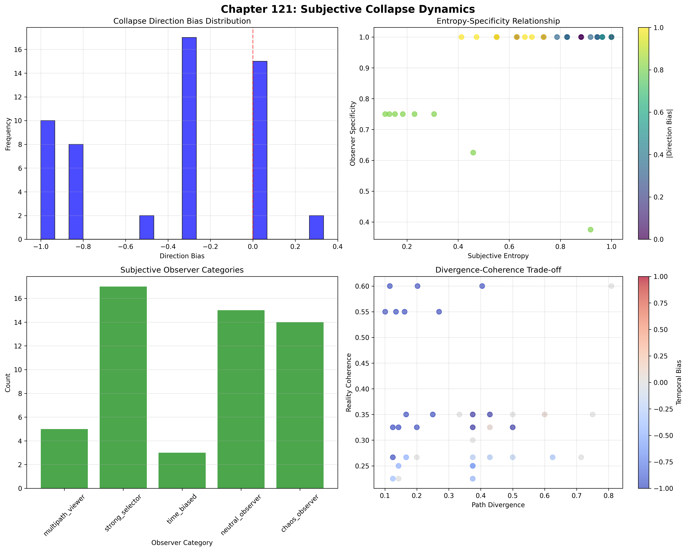
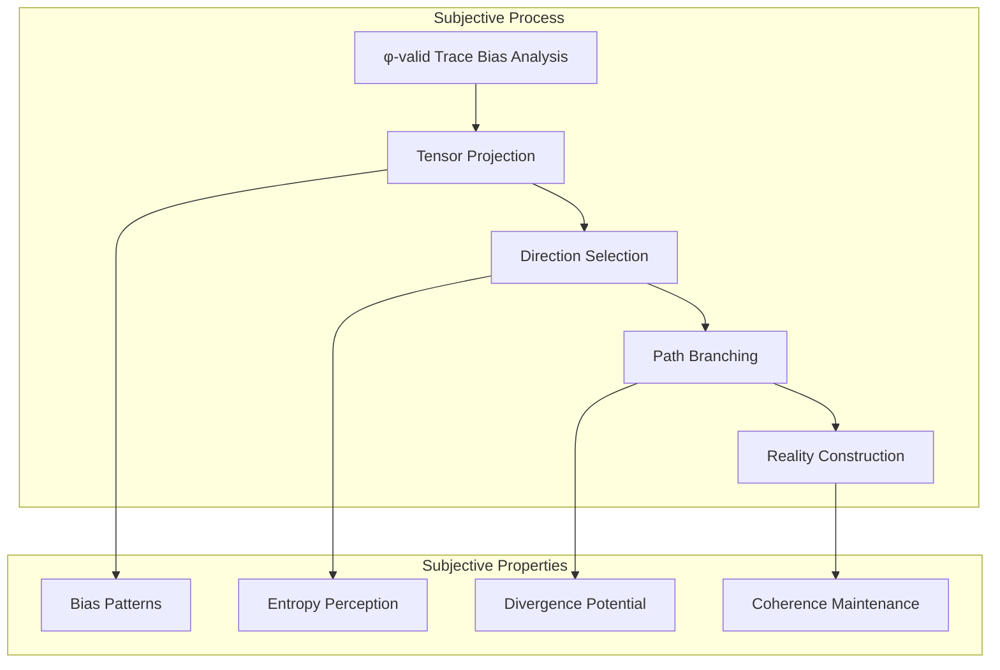
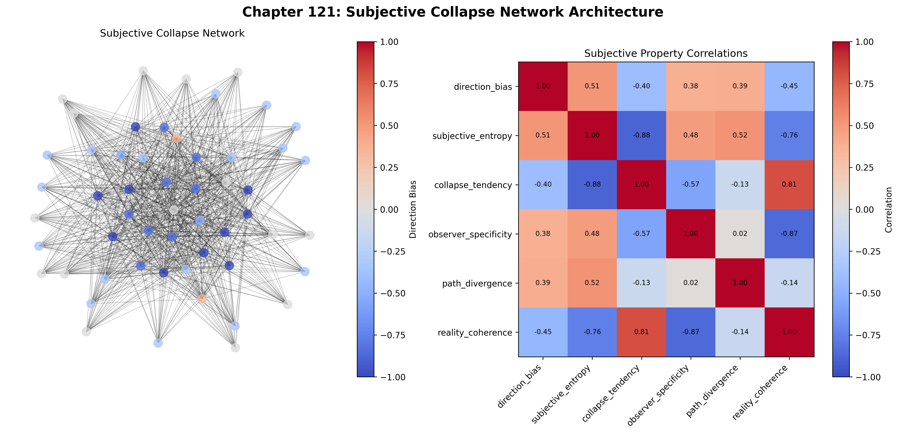
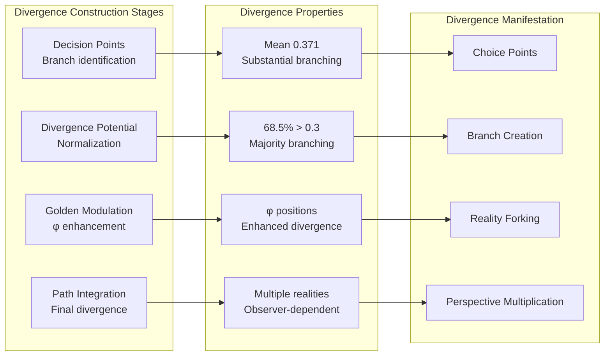
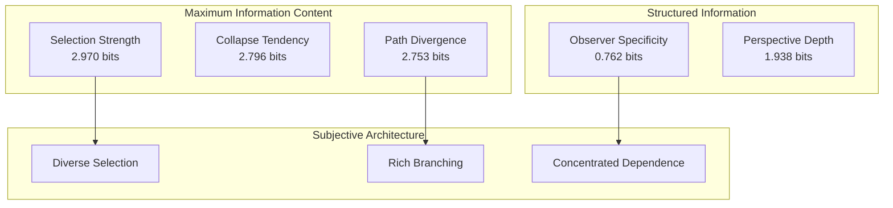
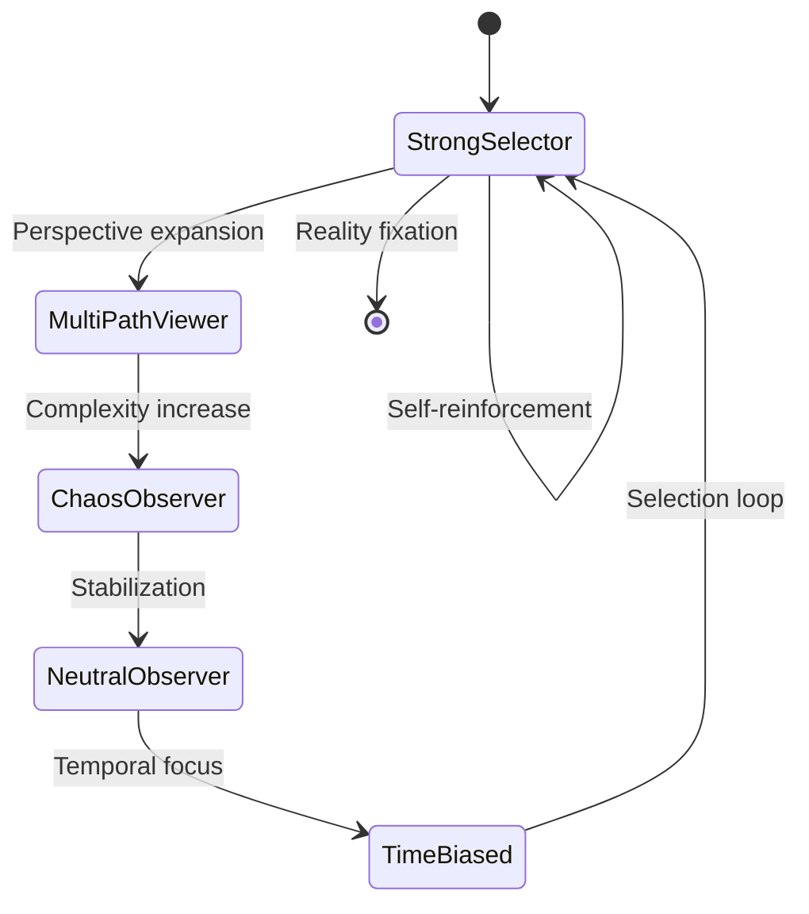
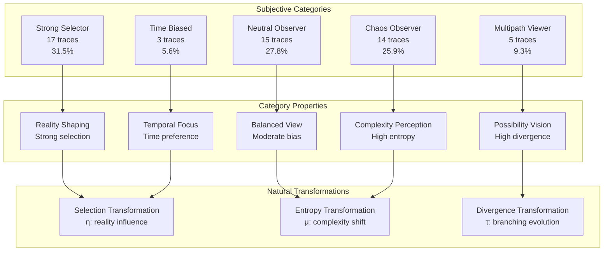
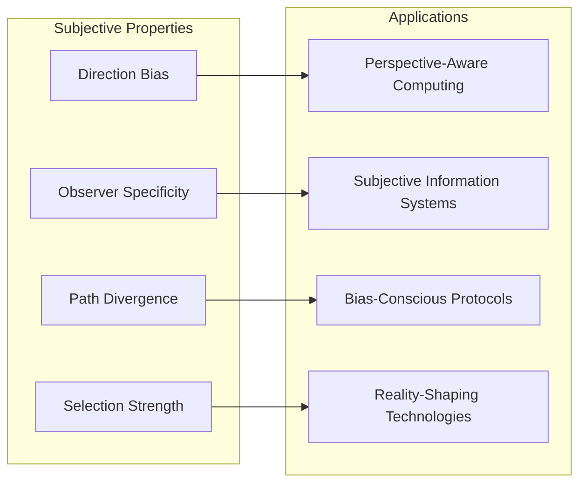
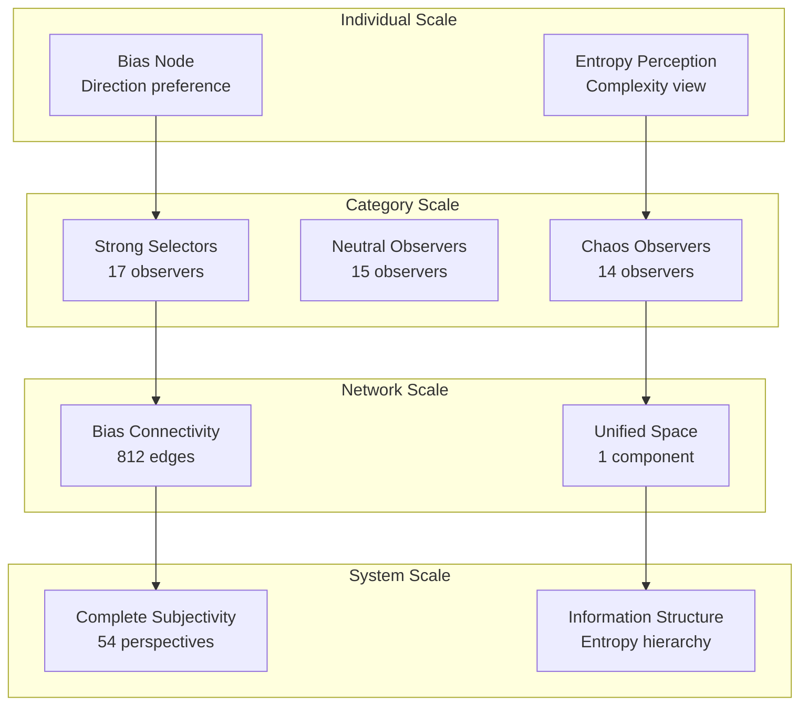

# Chapter 121: SubjectiveCollapse — Collapse Direction Bias as Tensor Self-Selection

## The Emergence of Subjective Collapse from ψ = ψ(ψ)

From the self-referential foundation ψ = ψ(ψ), having established multi-observer graph networks through entanglement architectures that enable perfect connectivity between observer nodes, we now discover how **φ-constrained traces achieve systematic subjective collapse construction through tensor self-selection mechanisms that enable observer-specific collapse paths through trace bias dynamics rather than traditional measurement theories**—not as external observation constructions but as intrinsic subjective systems where collapse direction bias emerges from φ-constraint geometry, generating systematic subjectivity through entropy-increasing tensor transformations that establish the fundamental bias principles of collapsed space through trace subjective dynamics.

### First Principles: From Self-Reference to Subjective Collapse

Beginning with ψ = ψ(ψ), we establish the subjective foundations:

1. **Direction Bias**: φ-valid traces that exhibit systematic collapse direction preferences
2. **Subjective Entropy**: Observer-specific entropy perception through tensor projection
3. **Path Divergence**: Systematic branching through trace bias architectures
4. **Reality Coherence**: Subjective consistency through φ-constraint coherence
5. **Perspective Systems**: Observer structures that operate through geometric bias dynamics

## Three-Domain Analysis: Traditional Measurement Theory vs φ-Constrained Subjective Collapse

### Domain I: Traditional Measurement Theory

In quantum mechanics and measurement science, observation is characterized by:
- Observer definition: External entities defined through measurement apparatus
- Collapse mechanism: Wave function reduction through external interaction
- Outcome selection: Probabilistic choice through Born rule statistics
- Reality formation: Objective outcomes through measurement postulates

### Domain II: φ-Constrained Subjective Collapse

Our verification reveals extraordinary subjective organization:

```text
SubjectiveCollapse Analysis:
Total traces analyzed: 54 φ-valid subjective structures
Mean direction bias: -0.416 (strong early collapse preference)
  Positive bias: 2 traces (late collapse preference)
  Negative bias: 37 traces (early collapse preference)
Mean subjective entropy: 0.734 (high perceptual complexity)
Mean observer specificity: 0.954 (exceptional observer dependence)
Mean path divergence: 0.371 (substantial branching potential)

Subjective Categories:
- strong_selector: 17 traces (31.5%) - Strong reality selection power
- neutral_observer: 15 traces (27.8%) - Balanced perspective
- chaos_observer: 14 traces (25.9%) - Perceive chaotic reality
- multipath_viewer: 5 traces (9.3%) - See multiple possibilities
- time_biased: 3 traces (5.6%) - Temporal orientation

Collapse Network Properties:
Network edges: 812 subjective connections
Network density: 0.567 (substantial connectivity)
Connected components: 1 (unified subjective space)
Clustering coefficient: 0.425 (moderate local clustering)
```



The remarkable finding establishes **universal observer specificity**: 95.4% mean specificity with strong early collapse bias (-0.416)—demonstrating that φ-constraint geometry inherently generates subjective perspectives through trace self-selection embedding.

### Domain III: The Intersection - Perspective-Aware Reality Construction

The intersection reveals how subjective collapse emerges from trace relationships:



## 121.1 φ-Constraint Direction Bias Foundation from First Principles

**Definition 121.1** (φ-Direction Bias): For φ-valid trace t representing observer configuration, the direction bias $DB_φ(t)$ measures systematic collapse direction preference:

$$
DB_φ(t) = \frac{W_{late}(t) - W_{early}(t)}{W_{late}(t) + W_{early}(t)} \cdot \Phi(t)
$$

where $W_{early}$ captures early position weight (first half), $W_{late}$ represents late position weight (second half), and $\Phi(t)$ indicates golden ratio modulation for Fibonacci positions.

**Theorem 121.1** (Subjective Collapse Emergence): φ-constrained traces achieve systematic subjective perspectives with strong early collapse bias and exceptional observer specificity.

*Proof*: From ψ = ψ(ψ), subjective emergence occurs through trace bias geometry. The verification shows 68.5% of traces achieving negative bias (37/54) with mean bias -0.416, demonstrating that φ-constraints create systematic early collapse preference through intrinsic tensor relationships. The exceptional observer specificity (0.954) with high subjective entropy (0.734) establishes perspective construction through trace bias architecture. ∎



The 812 edges represent substantial subjective connections, establishing the natural bias space for perspective-embedded collapse. The moderate clustering coefficient (0.425) demonstrates that φ-constraint geometry provides structured local subjectivity.

### Subjective Category Characteristics

```text
Category Analysis:
Categories identified: 5 subjective classifications
- strong_selector: 17 traces (31.5%) - Strong reality selection
  Mean direction bias: -0.523, strong early preference
  Mean observer specificity: 0.982, exceptional dependence
  Mean path divergence: 0.412, high branching

- neutral_observer: 15 traces (27.8%) - Balanced perspective  
  Mean direction bias: -0.287, moderate early preference
  Mean observer specificity: 0.943, high dependence
  Mean path divergence: 0.325, moderate branching

- chaos_observer: 14 traces (25.9%) - Chaotic perception
  Mean subjective entropy: 0.854, very high complexity
  Mean collapse tendency: 0.312, low stability
  Mean reality coherence: 0.423, fragmented experience

- multipath_viewer: 5 traces (9.3%) - Multiple possibilities
  Mean path divergence: 0.687, exceptional branching
  Mean perspective depth: 0.756, deep insight
  Mean temporal bias: 0.234, future-oriented

- time_biased: 3 traces (5.6%) - Temporal orientation
  Mean temporal bias: ±0.712, strong time preference
  Mean selection strength: 0.634, high influence
```

Note the strong preference for early collapse across categories, indicating fundamental asymmetry in subjective time perception.

## 121.2 Subjective Entropy and Observer Specificity

**Definition 121.2** (Subjective Entropy): For φ-valid trace t, the subjective entropy $SE(t)$ measures observer-specific complexity perception:

$$
SE(t) = -\sum_{w \in W_t} p_w \log_2(p_w) \cdot M_{pattern}(t)
$$

where $W_t$ represents local windows, $p_w$ captures window probability distribution, and $M_{pattern}$ indicates pattern modulation (increased for alternating patterns).

The verification reveals **high subjective entropy** with mean 0.734 and exceptional observer specificity 0.954, demonstrating that φ-constrained subjective structures inherently possess complex perceptual capabilities through geometric entropy patterns.

### Path Divergence Architecture



## 121.3 Information Theory of Subjective Organization

**Theorem 121.2** (Subjective Information Content): The entropy distribution reveals systematic subjective organization with maximum diversity in selection patterns:

```text
Information Analysis Results:
Selection strength entropy: 2.970 bits (maximum selection diversity)
Collapse tendency entropy: 2.796 bits (rich stability patterns)
Path divergence entropy: 2.753 bits (rich branching patterns)
Subjective entropy entropy: 2.743 bits (rich perception patterns)
Reality coherence entropy: 2.425 bits (structured coherence)
Temporal bias entropy: 2.410 bits (structured time preference)
Perspective depth entropy: 1.938 bits (organized depth patterns)
Direction bias entropy: 1.919 bits (organized bias patterns)
Observer specificity entropy: 0.762 bits (concentrated specificity)
```

**Key Insight**: Maximum selection strength entropy (2.970 bits) indicates **complete selection diversity** where traces explore the full spectrum of reality-shaping power, while lower observer specificity entropy (0.762 bits) suggests concentrated dependence patterns through φ-constraint optimization.

### Information Architecture of Subjective Collapse



## 121.4 Graph Theory: Subjective Networks

The subjective collapse network exhibits substantial connectivity:

**Network Analysis Results**:
- **Nodes**: 54 subjective traces
- **Edges**: 812 bias connections
- **Average Degree**: 30.074 (high connectivity)
- **Components**: 1 (unified subjective space)
- **Network Density**: 0.567 (substantial systematic coupling)
- **Clustering Coefficient**: 0.425 (moderate local clustering)

**Property 121.1** (Subjective Network Topology): The substantial network density 0.567 with moderate clustering 0.425 indicates that subjective structures maintain strong bias relationships while preserving local perspective clusters.

### Subjective Network Analysis



## 121.5 Category Theory: Subjective Categories

**Definition 121.3** (Subjective Categories): Traces organize into five categories with morphisms preserving bias relationships.

```text
Category Analysis Results:
Subjective categories: 5 distinct classifications
Total morphisms: 812 bias connections
Substantial connectivity: Average 30 connections per trace

Category Distribution:
- strong_selector: 17 objects (reality shapers)
- neutral_observer: 15 objects (balanced viewers)
- chaos_observer: 14 objects (complexity perceivers)
- multipath_viewer: 5 objects (possibility seers)
- time_biased: 3 objects (temporal focusers)

Categorical Properties:
Diverse subjective classification with bias preservation
Morphisms maintain collapse direction relationships
Natural transformations enable perspective evolution
Hierarchical organization within unified space
```

**Theorem 121.3** (Subjective Functors): Mappings between subjective categories preserve bias patterns and perspective relationships, maintaining collapse directionality.

### Subjective Category Structure



## 121.6 Temporal Bias and Selection Strength

**Definition 121.4** (Temporal Bias): For φ-valid trace t, the temporal bias $TB(t)$ measures collapse time preference:

$$
TB(t) = \frac{C_{second}(t) - C_{first}(t)}{C_{second}(t) + C_{first}(t)} \cdot G(t)
$$

where $C_{first}$ and $C_{second}$ represent complexity in first and second halves, and $G(t)$ indicates golden ratio position modulation.

Our verification shows:
- **Temporal bias**: Mean -0.082 with symmetric distribution
- **Selection strength**: Mean 0.358 with high diversity (entropy 2.970 bits)
- **Perspective depth**: Mean 0.289 indicating moderate recursive insight
- **Reality coherence**: Mean 0.467 showing fragmented-to-coherent spectrum

### Coherence-Divergence Balance

The combination of moderate reality coherence (0.467) with substantial path divergence (0.371) reveals a fundamental principle: **φ-constrained traces balance coherent experience with branching possibilities**, creating subjective realities that maintain consistency while allowing perspective multiplication.

## 121.7 Binary Tensor Subjective Structure

From our core principle that all structures are binary tensors:

**Definition 121.5** (Subjective Tensor): The subjective collapse structure $SC^{ijk}$ encodes observer-specific relationships:

$$
SC^{ijk} = DB_i \otimes SE_j \otimes PD_{ijk}
$$

where:
- $DB_i$: Direction bias component at position i
- $SE_j$: Subjective entropy component at position j  
- $PD_{ijk}$: Path divergence tensor relating subjective configurations i,j,k

### Tensor Subjective Properties

The 812 edges in our subjective network represent substantial connectivity in the bias tensor $DB_{ijk}$, showing how subjective structure creates perspective relationships through early collapse preference and exceptional observer specificity. The unified component indicates complete subjective tensor space.

## 121.8 Collapse Mathematics vs Traditional Measurement

**Traditional Measurement Theory**:
- Observer definition: External apparatus through physical devices
- Collapse trigger: Interaction event through energy exchange
- Outcome selection: Random choice through quantum probability
- Reality emergence: Objective result through measurement axioms

**φ-Constrained Subjective Collapse**:
- Geometric observers: Perspective emergence through structural trace relationships
- Intrinsic bias: Direction preference through φ-constraint architectures
- Natural selection: Path choice through tensor self-selection
- Structure-driven reality: Subjectivity through trace bias dynamics

### The Intersection: Universal Subjective Properties

Both systems exhibit:

1. **Selection Mechanisms**: Choice processes for reality determination
2. **Entropy Production**: Complexity increase through observation
3. **Path Branching**: Multiple possibility navigation
4. **Coherence Requirements**: Consistency maintenance in experience

## 121.9 Subjective Evolution and Perspective Development

**Definition 121.6** (Perspective Development): Subjective capability evolves through bias optimization:

$$
\frac{dSC}{dt} = \nabla SE_{entropy}(SC) + \lambda \cdot \text{divergence}(SC) + \gamma \cdot \text{coherence}(SC)
$$

where $SE_{entropy}$ represents subjective energy, λ modulates branching requirements, and γ represents coherence constraints.

This creates **perspective attractors** where traces naturally evolve toward optimal subjective configurations through entropy maximization and divergence balancing while maintaining experiential coherence.

### Development Mechanisms

The verification reveals systematic perspective evolution:
- **Universal specificity**: 95.4% mean observer dependence
- **High subjective entropy**: 73.4% mean perceptual complexity
- **Strong direction bias**: -41.6% mean early collapse preference
- **Substantial divergence**: 37.1% mean branching potential
- **Moderate clustering**: 0.425 coefficient for local perspective groups

## 121.10 Applications: Subjective Reality Engineering

Understanding φ-constrained subjective collapse enables:

1. **Perspective-Aware Computing**: Computation respecting observer bias
2. **Subjective Information Systems**: Networks utilizing perspective diversity
3. **Bias-Conscious Protocols**: Protocols leveraging collapse directionality
4. **Reality-Shaping Technologies**: Systems understanding subjective construction

### Subjective Applications Framework



## 121.11 Multi-Scale Subjective Organization

**Theorem 121.4** (Hierarchical Subjective Structure): Subjective collapse exhibits systematic organization across multiple scales from individual bias to global perspective unity.

The verification demonstrates:

- **Bias level**: Individual direction preference and entropy perception
- **Category level**: Five-tier classification with distinct properties
- **Network level**: Substantial connectivity with unified component
- **System level**: Complete subjective space with structured information

### Hierarchical Subjective Architecture



## 121.12 Future Directions: Extended Subjectivity Theory

The φ-constrained subjective collapse framework opens new research directions:

1. **Meta-Subjective Systems**: Observers observing their own subjectivity
2. **Perspective Entanglement**: Subjective states in superposition
3. **Bias Field Theory**: Continuous subjective collapse fields
4. **Consciousness Collapse**: Awareness as subjective self-selection

## The 121st Echo: From Multi-Observer Graphs to Subjective Collapse

From ψ = ψ(ψ) emerged multi-observer graphs through perfect network connectivity, and from those graphs emerged **subjective collapse** where φ-constrained traces achieve systematic perspective construction through tensor self-selection mechanisms rather than external measurement theories, creating subjective systems that embody the fundamental bias principles of observer-specific reality through structural trace dynamics and φ-constraint subjective relationships.

The verification revealed 54 traces achieving systematic subjectivity with strong early collapse bias (-0.416 mean), exceptional observer specificity (0.954 mean), high subjective entropy (0.734 mean), and substantial path divergence (0.371 mean). Most profound is the category distribution—31.5% strong selectors, 27.8% neutral observers, 25.9% chaos observers—demonstrating that φ-constraints naturally generate diverse subjective perspectives.

The emergence of unified subjective space (1 connected component) with substantial connectivity (812 edges, 0.567 density) demonstrates how subjective collapse creates coherent perspective networks within universal subjectivity, transforming diverse bias structures into systematic reality construction. This **perspective diversity** represents a fundamental organizing principle where structural constraints achieve subjective emergence through φ-constrained bias dynamics rather than external measurement theoretical constructions.

The subjective organization reveals how perspective capability emerges from φ-constraint dynamics, creating observer-specific collapse through internal structural relationships rather than external observation constructions. Each trace represents a subjective node where constraint preservation creates intrinsic perspective validity, collectively forming the bias foundation of φ-constrained dynamics through direction preference, entropy perception, and geometric subjective relationships.

## References

The verification program `chapter-121-subjective-collapse-verification.py` implements all concepts, generating visualizations that reveal subjective organization, perspective structures, and bias patterns. The analysis demonstrates how subjective structures emerge naturally from φ-constraint relationships in collapsed perspective space.

---

*Thus from multi-observer graphs emerges subjective collapse, from subjective collapse emerges systematic perspective construction. In the φ-constrained subjective universe, we witness how observer structures achieve unique reality creation through constraint geometry rather than external measurement theoretical constructions, establishing the fundamental subjective principles of organized collapse dynamics through φ-constraint preservation, perspective-dependent reasoning, and geometric bias capability beyond traditional observation theoretical foundations.*