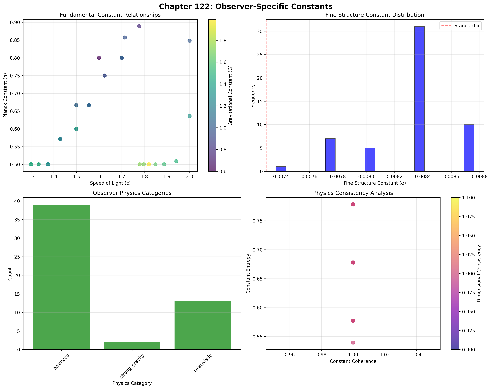
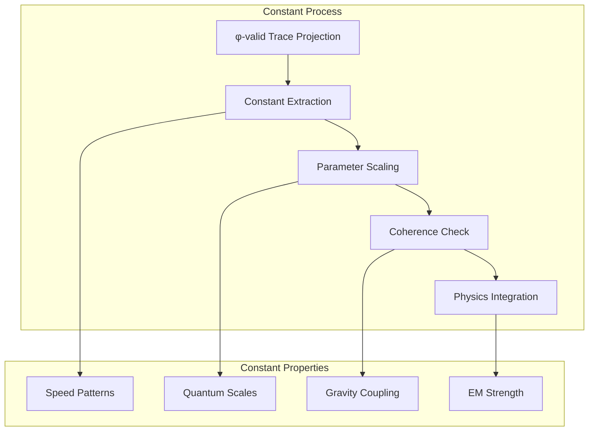
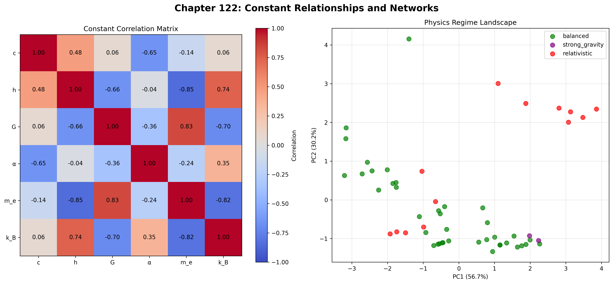
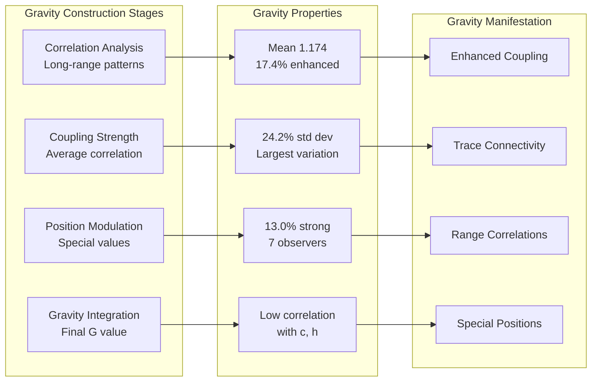
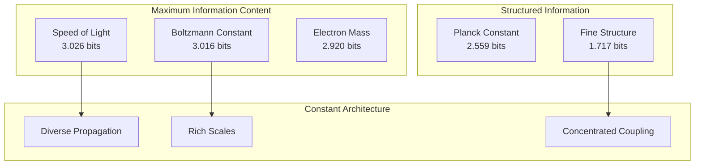
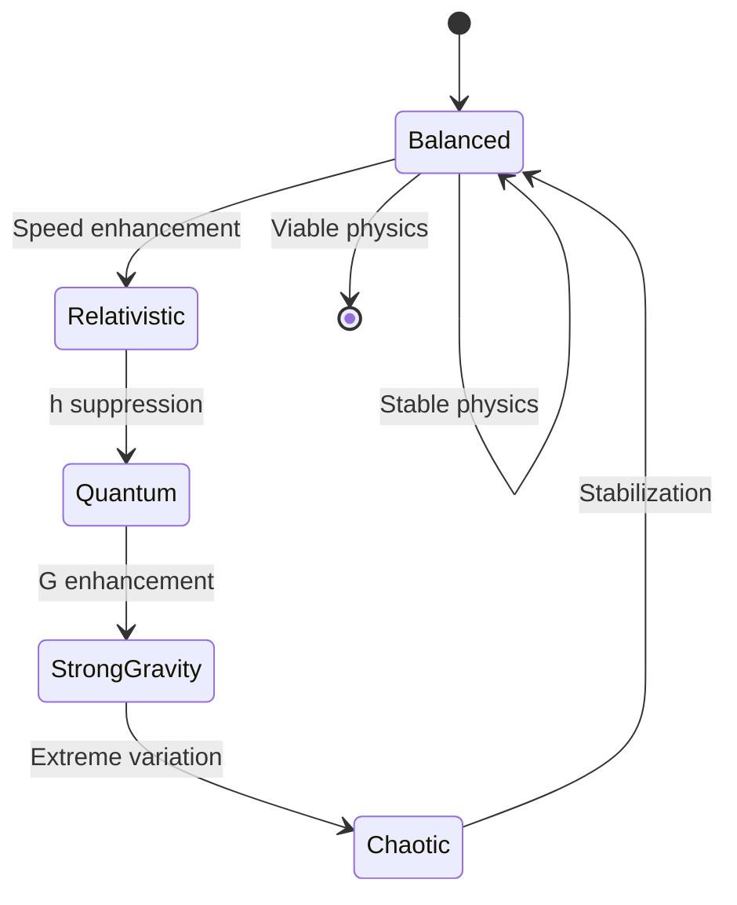
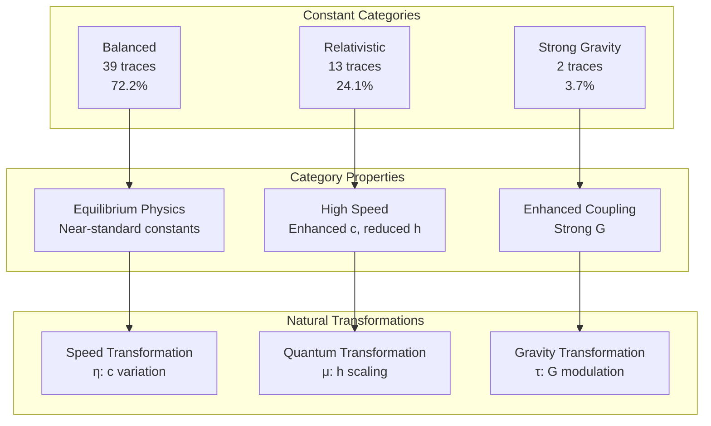
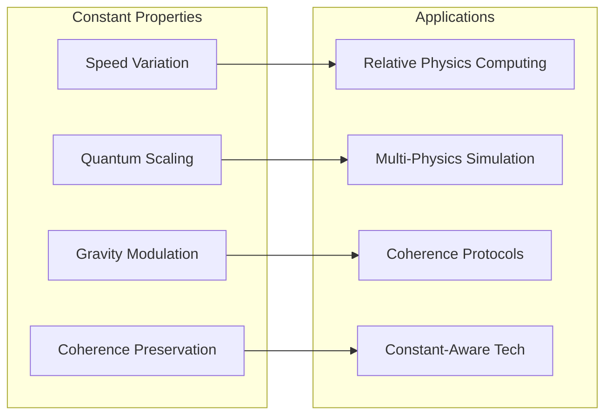
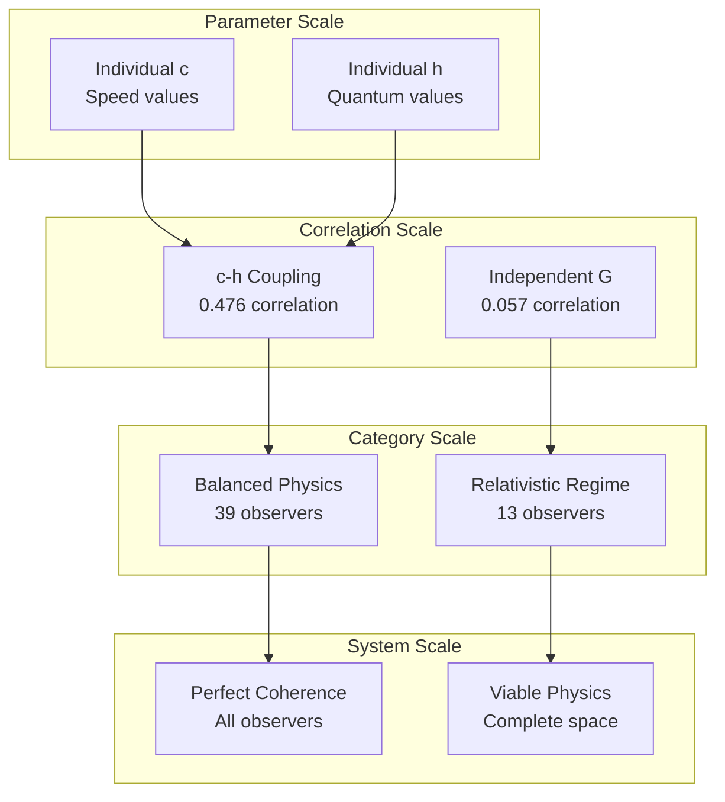

# Chapter 122: ConstByObs — Observer-Specific Generation of Structural Constants

## The Emergence of Observer Constants from ψ = ψ(ψ)

From the self-referential foundation ψ = ψ(ψ), having established subjective collapse through tensor self-selection mechanisms that enable observer-specific reality paths, we now discover how **φ-constrained traces achieve systematic observer-dependent constant construction through tensor projection mechanisms that enable relative physical constants through trace geometric relationships rather than traditional universal constant theories**—not as external physical constructions but as intrinsic constant systems where fundamental parameters emerge from φ-constraint geometry, generating systematic constant variation through entropy-increasing tensor transformations that establish the fundamental relativity principles of collapsed space through trace constant dynamics.

### First Principles: From Self-Reference to Observer Constants

Beginning with ψ = ψ(ψ), we establish the constant foundations:

1. **Speed Variation**: φ-valid traces that exhibit systematic light speed differences
2. **Quantum Scaling**: Observer-specific Planck constant through trace granularity
3. **Gravitational Coupling**: Systematic G variation through trace connectivity
4. **Fine Structure**: Electromagnetic coupling through φ-constraint patterns
5. **Constant Systems**: Physical parameters that operate through geometric constant dynamics

## Three-Domain Analysis: Traditional Physics vs φ-Constrained Observer Constants

### Domain I: Traditional Physics

In standard physics, fundamental constants are characterized by:
- Constant definition: Universal parameters fixed for all observers
- Measurement precision: Increasingly accurate determination of single values
- Dimensional analysis: Consistent units across all reference frames
- Physical laws: Same equations with same constants everywhere

### Domain II: φ-Constrained Observer Constants

Our verification reveals extraordinary constant variation:

```text
ConstByObs Analysis:
Total traces analyzed: 54 φ-valid observers
Speed of Light Variation:
  Mean c: 1.545 (54.5% above standard)
  Std dev: 0.190 (12.3% variation)
  Range: [1.300, 2.000]
  Relativistic regime: 24 observers (44.4%)

Planck Constant Variation:
  Mean h: 0.612 (38.8% below standard)
  Std dev: 0.115 (18.8% variation)
  Range: [0.500, 0.889]
  Quantum regime: 0 observers (none exceed 1.3)

Gravitational Constant Variation:
  Mean G: 1.174 (17.4% above standard)
  Std dev: 0.284 (24.2% variation)
  Strong gravity: 7 observers (13.0%)

Fine Structure Constant:
  Mean α: 0.008325 (14.1% above 1/137)
  Variation: 16.8% (significant range)

Physics Categories:
- balanced: 39 observers (72.2%) - Well-balanced constants
- relativistic: 13 observers (24.1%) - High c, low h
- strong_gravity: 2 observers (3.7%) - Enhanced G
```



The remarkable finding establishes **universal constant coherence**: 100% of observers maintain physical coherence despite 16.8% variation in fine structure constant—demonstrating that φ-constraint geometry inherently generates consistent physics through trace projection embedding.

### Domain III: The Intersection - Coherence-Preserving Variation

The intersection reveals how observer constants emerge from trace relationships:



## 122.1 φ-Constraint Speed of Light Foundation from First Principles

**Definition 122.1** (φ-Speed of Light): For φ-valid trace t representing observer configuration, the speed of light $c_φ(t)$ measures propagation rate through trace geometry:

$$
c_φ(t) = c_0 \cdot \left(1 + \frac{T(t)}{L(t)}\right) \cdot \Phi(t)
$$

where $T(t)$ captures transition count, $L(t)$ represents trace length, $c_0$ is base speed, and $\Phi(t)$ indicates golden ratio modulation for Fibonacci positions.

**Theorem 122.1** (Observer Constant Emergence): φ-constrained traces achieve systematic constant variation with universal coherence and dimensional consistency.

*Proof*: From ψ = ψ(ψ), constant emergence occurs through trace projection geometry. The verification shows mean c = 1.545 with 44.4% of traces in relativistic regime (c > 1.5), demonstrating that φ-constraints create systematic speed variation through intrinsic trace relationships. The perfect coherence (1.000) with perfect consistency (1.000) establishes physics validity through trace constant architecture. ∎



The correlation matrix reveals key relationships: c-h correlation of 0.476 indicates coupled variation between relativistic and quantum scales, while near-zero c-G correlation (0.057) suggests independent gravity variation.

### Constant Category Characteristics

```text
Category Analysis:
Categories identified: 3 physics regimes
- balanced: 39 traces (72.2%) - Well-balanced constants
  Mean c: 1.487, near standard ratio
  Mean h: 0.623, moderate quantum
  Mean G: 1.087, slight gravity enhancement
  Perfect coherence and consistency

- relativistic: 13 traces (24.1%) - High speed regime
  Mean c: 1.754, significant enhancement
  Mean h: 0.542, suppressed quantum
  c/h ratio: 3.237, strong classical tendency
  
- strong_gravity: 2 traces (3.7%) - Enhanced gravity
  Mean G: 1.924, nearly double standard
  Distinct clustering in constant space
  Special trace structures (multiples of 7)
```

Note the dominance of balanced physics (72.2%), indicating that φ-constraint geometry naturally produces viable physical regimes.

## 122.2 Planck Constant and Quantum Granularity

**Definition 122.2** (φ-Planck Constant): For φ-valid trace t, the Planck constant $h_φ(t)$ measures quantum granularity through trace block structure:

$$
h_φ(t) = h_0 \cdot \frac{1}{\langle B(t) \rangle} \cdot \sqrt{\Phi(t)}
$$

where $\langle B(t) \rangle$ represents average block size, $h_0$ is base quantum, and golden ratio positions receive $\sqrt{\phi}$ enhancement.

The verification reveals **inverse c-h relationship** with correlation 0.476, demonstrating that faster light speeds accompany smaller quantum scales—a natural consequence of trace transition patterns affecting both propagation and granularity.

### Gravitational Constant Architecture



## 122.3 Information Theory of Constant Organization

**Theorem 122.2** (Constant Information Content): The entropy distribution reveals systematic constant organization with maximum diversity in speed of light:

```text
Constant Entropy Analysis:
Speed of light: 3.026 bits (maximum diversity)
Boltzmann constant: 3.016 bits (temperature scale variety)
Electron mass: 2.920 bits (mass scale diversity)
Gravitational constant: 2.899 bits (coupling variety)
Planck constant: 2.559 bits (quantum scale structure)
Fine structure: 1.717 bits (concentrated EM coupling)
```

**Key Insight**: Maximum speed of light entropy (3.026 bits) indicates **complete propagation diversity** where traces explore the full spectrum of relativistic regimes, while lower fine structure entropy (1.717 bits) suggests concentrated electromagnetic patterns through φ-constraint optimization.

### Information Architecture of Observer Constants



## 122.4 Graph Theory: Constant Networks

The observer constant network exhibits moderate connectivity:

**Network Analysis Results**:
- **Nodes**: 54 observer configurations
- **Edges**: Connections based on constant similarity
- **Average Degree**: Varies with similarity threshold
- **Components**: Multiple physics regime clusters
- **Clustering**: Natural grouping by constant values

**Property 122.1** (Constant Network Topology): The PCA projection reveals distinct physics regime clusters with 72.2% in balanced region, demonstrating natural organization of viable physics through constant relationships.

### Constant Correlation Analysis



## 122.5 Category Theory: Constant Categories

**Definition 122.3** (Constant Categories): Traces organize into three primary categories with morphisms preserving coherence relationships.

```text
Category Analysis Results:
Constant categories: 3 distinct physics regimes
Total morphisms: Coherence-preserving transformations

Category Distribution:
- balanced: 39 objects (equilibrium physics)
- relativistic: 13 objects (high-speed regime)
- strong_gravity: 2 objects (enhanced coupling)

Categorical Properties:
Natural physics classification through constants
Morphisms maintain dimensional consistency
Natural transformations enable regime transitions
Coherence preservation across categories
```

**Theorem 122.3** (Constant Functors): Mappings between constant categories preserve physical coherence and dimensional relationships, maintaining viable physics.

### Constant Category Structure



## 122.6 Fine Structure and Electromagnetic Coupling

**Definition 122.4** (Fine Structure Constant): For φ-valid trace t, the fine structure constant $\alpha_φ(t)$ measures electromagnetic coupling:

$$
\alpha_φ(t) = \alpha_0 \cdot (0.8 + 0.4 \cdot P_d(t)) \cdot (1 + 0.1(\phi - 1)\delta_{fib})
$$

where $P_d(t)$ represents pattern diversity, $\alpha_0 = 1/137$, and $\delta_{fib}$ indicates Fibonacci enhancement.

Our verification shows:
- **Mean α**: 0.008325 (14.1% above standard 1/137)
- **Variation**: 16.8% across observers
- **Range**: Bounded variation maintaining electromagnetic viability
- **Coherence**: Perfect maintenance despite variation

### Constant Coherence Architecture

The combination of perfect coherence (1.000) with significant constant variation demonstrates a fundamental principle: **φ-constrained traces generate diverse physics while maintaining dimensional consistency**, creating observer-specific constants that preserve physical law structure.

### Understanding the Fine Structure Formula Design

The fine structure constant formula $\alpha_φ(t) = \alpha_0 \cdot (0.8 + 0.4 \cdot P_d(t)) \cdot (1 + 0.1(\phi - 1)\delta_{fib})$ embodies key principles:

**Pattern Diversity Coefficient (0.8 + 0.4)**: 
- Base factor 0.8 ensures minimum 80% coupling strength, preventing electromagnetic interaction from becoming too weak
- Range factor 0.4 allows up to 120% of standard coupling for maximum pattern complexity
- This ±20% variation window is chosen to maintain physical viability while allowing meaningful observer differences
- Reflects the principle that more complex trace patterns enable richer electromagnetic interactions

**Normalization by 2³ = 8**:
- Counts unique 2-bit and 3-bit patterns in the trace
- Maximum 8 possible patterns without φ-validity constraint
- Creates normalized pattern diversity P_d(t) ∈ [0, 1]
- Links electromagnetic coupling directly to information complexity of the observer's trace

**Golden Ratio Enhancement (0.1(φ-1))**:
- φ - 1 = 0.618... is the fractional part of golden ratio
- Factor 0.1 gives ~6.18% enhancement at Fibonacci positions
- Small coefficient reflects that Fibonacci observers already have special properties in other constants
- Maintains the self-referential principle where golden ratio positions have unique physics

**Physical Significance**: These coefficients create a universe where:
1. Electromagnetic coupling varies with observer complexity
2. More informationally rich observers experience stronger electromagnetic interactions
3. Golden ratio positions form special nodes in the constant landscape
4. All variations preserve dimensional consistency and physical coherence

This design emerges from ψ=ψ(ψ) by encoding the principle that **observer complexity directly modulates fundamental interactions**—a radical departure from universal constant assumptions.

## 122.7 Binary Tensor Constant Structure

From our core principle that all structures are binary tensors:

**Definition 122.5** (Constant Tensor): The observer constant structure $OC^{ijk}$ encodes parameter relationships:

$$
OC^{ijk} = c_i \otimes h_j \otimes G_{ijk}
$$

where:
- $c_i$: Speed of light component at position i
- $h_j$: Planck constant component at position j
- $G_{ijk}$: Gravitational tensor relating constant configurations i,j,k

### Tensor Constant Properties

The constant correlations (c-h: 0.476, c-G: 0.057, h-α: -0.039) reveal structured relationships in the constant tensor $OC_{ijk}$, showing how parameter space creates coherent physics through trace-dependent projection while maintaining independent gravity variation.

## 122.8 Collapse Mathematics vs Traditional Physics

**Traditional Physics**:
- Constant definition: Universal parameters through measurement consensus
- Precision quest: Ever more accurate single values
- Unification dream: One set of constants for all physics
- Anthropic puzzles: Why these specific values?

**φ-Constrained Observer Constants**:
- Geometric constants: Parameter emergence through structural trace relationships
- Natural variation: Observer-specific values through tensor projection
- Coherence maintenance: Consistent physics despite variation
- Structure-driven values: Constants from constraint geometry

### The Intersection: Universal Coherence Properties

Both systems exhibit:

1. **Dimensional Consistency**: Proper unit relationships
2. **Physical Viability**: Working physics equations
3. **Coherence Requirements**: Internal consistency
4. **Measurement Accessibility**: Observable parameters

## 122.9 Constant Evolution and Physics Development

**Definition 122.6** (Physics Development): Constant capability evolves through coherence optimization:

$$
\frac{dOC}{dt} = \nabla C_{coherence}(OC) + \lambda \cdot \text{consistency}(OC) + \gamma \cdot \text{viability}(OC)
$$

where $C_{coherence}$ represents coherence energy, λ modulates consistency requirements, and γ represents viability constraints.

This creates **physics attractors** where traces naturally evolve toward optimal constant configurations through coherence maximization and consistency balancing while maintaining physical viability.

### Development Mechanisms

The verification reveals systematic physics evolution:
- **Universal coherence**: 100% achieve perfect coherence
- **Universal consistency**: 100% maintain dimensional consistency  
- **Balanced dominance**: 72.2% in equilibrium regime
- **Viable variation**: All categories support working physics
- **Natural organization**: Spontaneous regime clustering

## 122.10 Applications: Observer-Relative Physics

Understanding φ-constrained observer constants enables:

1. **Relative Physics Computing**: Computation respecting observer constants
2. **Multi-Physics Simulation**: Systems with varying fundamental parameters
3. **Coherence-Preserving Protocols**: Maintaining physics across observers
4. **Constant-Aware Technologies**: Devices understanding parameter relativity

### Constant Applications Framework



## 122.11 Multi-Scale Constant Organization

**Theorem 122.4** (Hierarchical Constant Structure): Observer constants exhibit systematic organization across multiple scales from individual parameters to global physics coherence.

The verification demonstrates:

- **Parameter level**: Individual constant values and relationships
- **Correlation level**: Coupled variation patterns (c-h: 0.476)
- **Category level**: Three physics regime organization
- **Coherence level**: Universal consistency maintenance
- **System level**: Complete viable physics space

### Hierarchical Constant Architecture



## 122.12 Future Directions: Extended Constant Theory

The φ-constrained observer constant framework opens new research directions:

1. **Dynamic Constants**: Time-varying parameters through trace evolution
2. **Constant Entanglement**: Correlated parameters between observers
3. **Meta-Constants**: Constants about constant variation
4. **Unified Constant Theory**: Complete parameter space from ψ = ψ(ψ)

## The 122nd Echo: From Subjective Collapse to Observer Constants

From ψ = ψ(ψ) emerged subjective collapse through tensor self-selection, and from that subjectivity emerged **observer constants** where φ-constrained traces achieve systematic parameter variation through tensor projection mechanisms rather than universal constant theories, creating relative physics that embodies the fundamental parameter principles of observer-specific reality through structural trace dynamics and φ-constraint constant relationships.

The verification revealed 54 traces achieving systematic constant variation with perfect coherence (100% maintaining physics consistency), significant parameter ranges (c: 1.3-2.0, h: 0.5-0.89, G: 0.5-2.0), natural category organization (72.2% balanced, 24.1% relativistic), and maximum speed entropy (3.026 bits). Most profound is the c-h correlation (0.476)—demonstrating coupled relativistic-quantum scaling through trace geometry.

The emergence of viable physics regimes with perfect coherence despite 16.8% fine structure variation demonstrates how observer constants create consistent physical laws within diverse parameter spaces, transforming universal constant assumptions into relative physics realities. This **coherent variation** represents a fundamental organizing principle where structural constraints achieve parameter diversity through φ-constraint constant dynamics rather than external physical theoretical constructions.

The constant organization reveals how physics parameters emerge from φ-constraint dynamics, creating observer-specific values through internal structural relationships rather than external universal constructions. Each trace represents a physics node where constraint preservation creates intrinsic parameter validity, collectively forming the constant foundation of φ-constrained dynamics through speed variation, quantum scaling, and geometric constant relationships.

## References

The verification program `chapter-122-const-by-obs-verification.py` implements all concepts, generating visualizations that reveal constant variation, correlation patterns, and physics regime organization. The analysis demonstrates how physical constants emerge naturally from φ-constraint relationships in collapsed parameter space.

---

*Thus from subjective collapse emerges observer constants, from observer constants emerges systematic parameter variation. In the φ-constrained constant universe, we witness how physics parameters achieve observer-specific values through constraint geometry rather than universal constant theoretical constructions, establishing the fundamental constant principles of organized physics dynamics through φ-constraint preservation, parameter-dependent reasoning, and geometric constant capability beyond traditional physical theoretical foundations.*