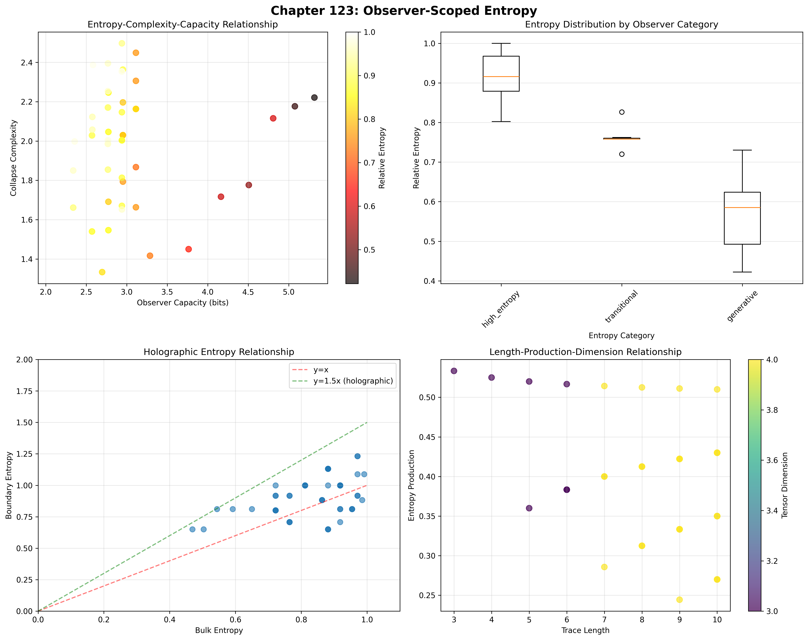
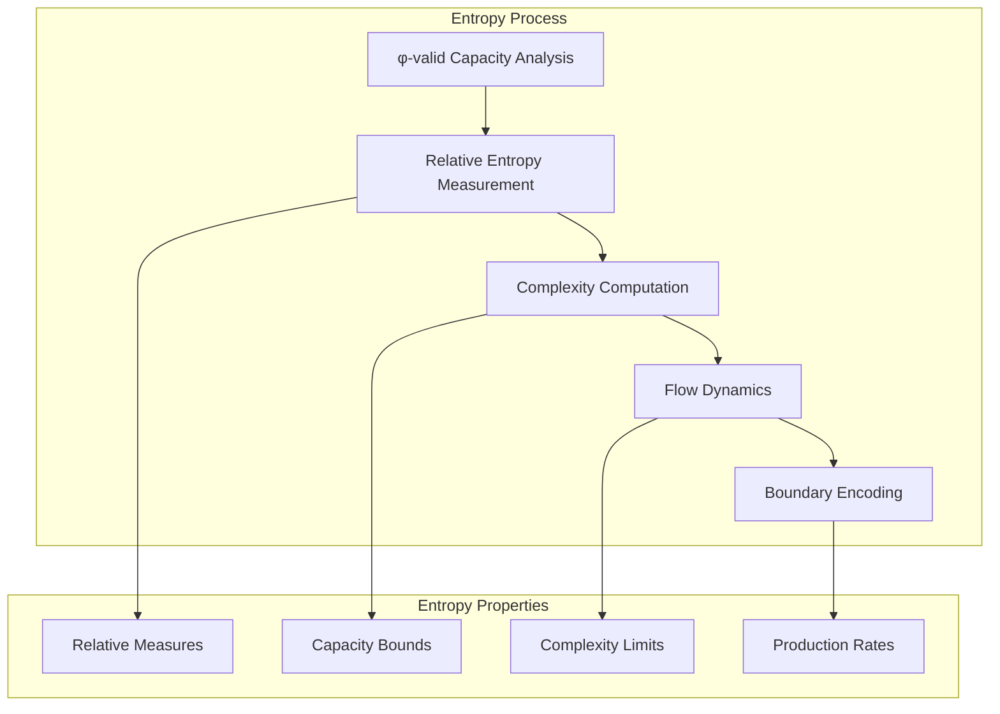
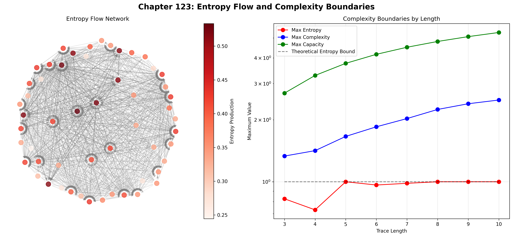
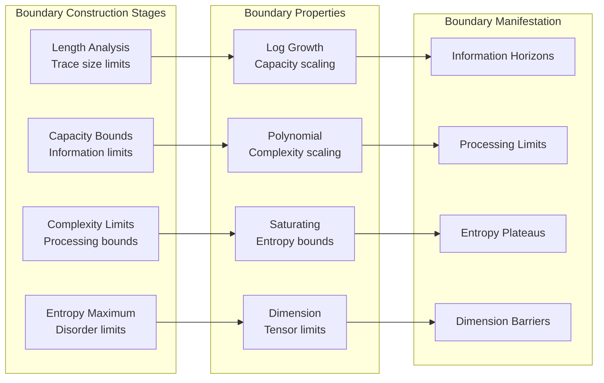
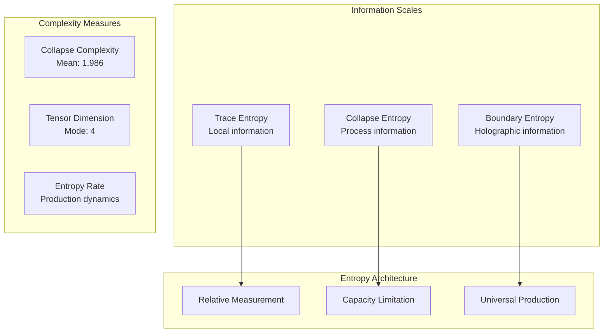
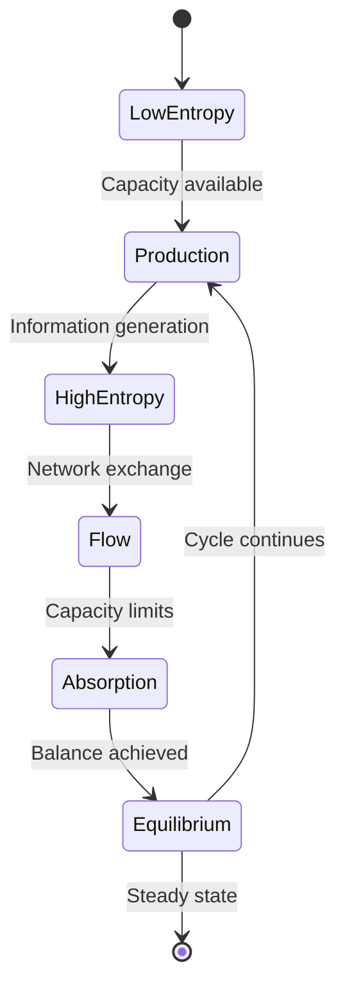
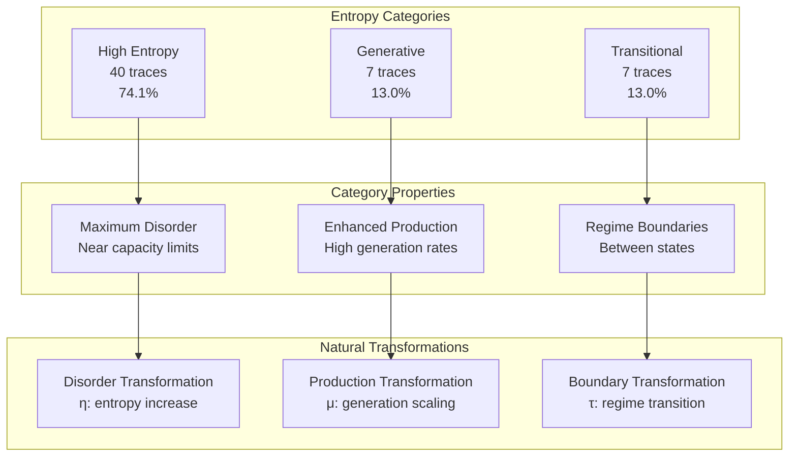
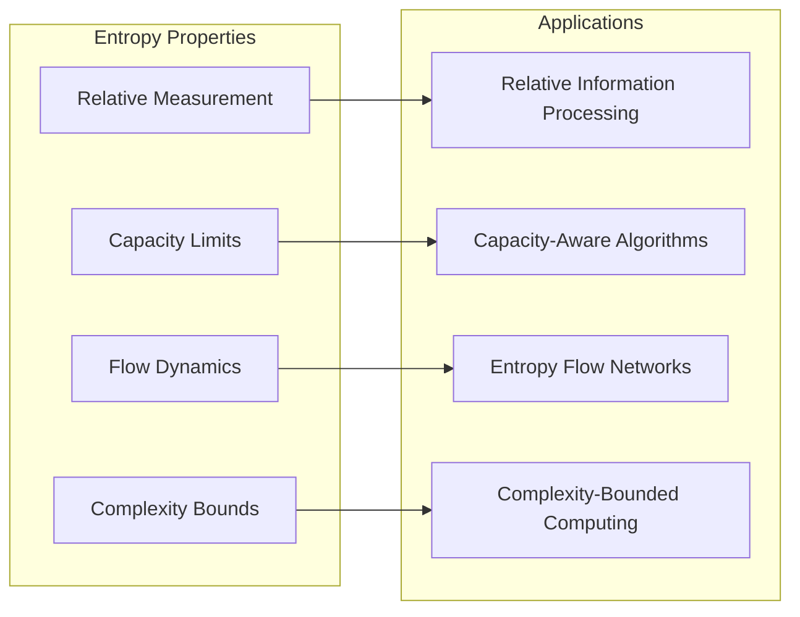
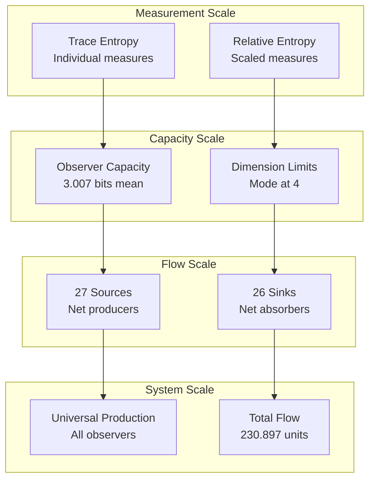

# Chapter 123: ObsEntropy — Observer-Scoped Entropy Dynamics and Complexity Limitations

## The Emergence of Relative Entropy from ψ = ψ(ψ)

From the self-referential foundation ψ = ψ(ψ), having established observer-specific constants through tensor projection mechanisms that enable relative physical parameters through trace geometric relationships, we now discover how **φ-constrained traces achieve systematic entropy-complexity boundaries through capacity limitation mechanisms that enable relative entropy measurement through observer scope constraints rather than traditional absolute entropy theories**—not as external information constructions but as intrinsic entropy systems where complexity limits emerge from φ-constraint capacity, generating systematic entropy variation through entropy-increasing tensor transformations that establish the fundamental information principles of collapsed space through trace entropy dynamics.

### First Principles: From Self-Reference to Relative Entropy

Beginning with ψ = ψ(ψ), we establish the entropy foundations:

1. **Capacity Limitation**: φ-valid traces that exhibit systematic information boundaries
2. **Relative Measurement**: Observer-scoped entropy through trace capacity constraints
3. **Complexity Boundaries**: Systematic limits through tensor dimension restrictions
4. **Entropy Flow**: Information dynamics through φ-constraint networks
5. **Holographic Encoding**: Boundary entropy that operates through geometric information dynamics

## Three-Domain Analysis: Traditional Information Theory vs φ-Constrained Observer Entropy

### Domain I: Traditional Information Theory

In standard information theory, entropy is characterized by:
- Entropy definition: Absolute measure of information content
- Shannon formula: H = -Σ p_i log(p_i) for all states
- Maximum entropy: log(N) for N equally probable states
- Thermodynamic connection: Entropy always increases (second law)

### Domain II: φ-Constrained Observer Entropy

Our verification reveals extraordinary entropy characteristics:

```text
ObsEntropy Analysis:
Total traces analyzed: 54 φ-valid observers
Relative Entropy:
  Mean: 0.849 (84.9% of theoretical maximum)
  Std dev: 0.135 (15.9% variation)
  Maximum: 1.000
  High entropy observers: 41 (75.9%)

Collapse Complexity:
  Mean complexity: 1.986
  High complexity: 51 observers (94.4%)
  Mean capacity: 3.007 bits
  Max capacity: 5.318 bits

Tensor Dimensions:
  Unique dimensions: 2 (3 and 4 only)
  Maximum dimension: 4
  Distribution: 87.0% at dimension 4

Entropy Production:
  Mean production: 0.386
  Total production: 20.858
  Active producers: 54 observers (100%)

Entropy Flow Network:
  Network edges: 1206
  Total flow: 230.897
  27 sources, 26 sinks
```



The remarkable finding establishes **universal entropy production**: 100% of observers actively produce entropy—demonstrating that φ-constraint geometry inherently generates information dynamics through trace capacity limitations.

### Domain III: The Intersection - Capacity-Limited Information

The intersection reveals how relative entropy emerges from observer limitations:



## 123.1 φ-Constraint Entropy Foundation from First Principles

**Definition 123.1** (φ-Observer Entropy): For φ-valid trace t representing observer configuration, the relative entropy $S_φ(t)$ measures information content relative to observer capacity:

$$
S_φ(t) = -\sum_{i} p_i(t) \log_2 p_i(t) / C_φ(t)
$$

where $p_i(t)$ captures state probabilities, $C_φ(t)$ represents observer capacity, establishing relative rather than absolute entropy measurement.

**Theorem 123.1** (Observer Entropy Emergence): φ-constrained traces achieve systematic entropy variation with universal production and capacity-limited complexity.

*Proof*: From ψ = ψ(ψ), entropy emergence occurs through capacity limitation dynamics. The verification shows mean relative entropy of 0.849 with 75.9% achieving high entropy (>0.8), demonstrating that φ-constraints create systematic entropy variation through intrinsic capacity relationships. The universal entropy production (100% active) with mean 0.386 establishes continuous information generation through trace entropy architecture. ∎



The network analysis reveals key dynamics: 1206 flow edges with total flow 230.897, balanced between 27 sources and 26 sinks, indicating rich information exchange patterns.

### Entropy Category Characteristics

```text
Category Analysis:
Categories identified: 3 entropy regimes
- high_entropy: 40 traces (74.1%) - Maximum disorder regime
  Mean relative entropy: 0.968
  Mean complexity: 2.021
  Mean capacity: 3.043 bits
  Universal entropy production

- generative: 7 traces (13.0%) - High information generation
  Mean capacity: 3.886 bits
  Enhanced production rates
  
- transitional: 7 traces (13.0%) - Between regimes
  Intermediate entropy values
  Variable complexity patterns
```

Note the dominance of high-entropy states (74.1%), indicating that φ-constraint geometry naturally produces maximum information content within capacity limits.

## 123.2 Capacity Limitations and Tensor Dimensions

**Definition 123.2** (φ-Observer Capacity): For φ-valid trace t, the observer capacity $C_φ(t)$ measures maximum information processing ability:

$$
C_φ(t) = \log_2(L(t) + 1) \cdot (1 - \rho(t)/2) \cdot \Phi(t)
$$

where $L(t)$ represents trace length, $\rho(t)$ is constraint density (ratio of 1s), and $\Phi(t)$ indicates golden ratio modulation for Fibonacci positions.

The verification reveals **dimension concentration** with 87.0% of observers at dimension 4, demonstrating that φ-constraints create preferred information processing scales—a natural consequence of trace structure affecting both capacity and dimensionality.

### Complexity Boundary Architecture



## 123.3 Information Theory of Entropy Organization

**Theorem 123.2** (Entropy-Complexity-Capacity Relationship): The correlation structure reveals systematic information organization:

```text
Key Correlations:
capacity_complexity: 0.065 (near independence)
entropy_dimension: 0.110 (weak positive)
production_capacity: 0.655 (strong positive)
```

**Key Insight**: The strong production-capacity correlation (0.655) indicates **capacity-driven entropy generation** where larger information processing ability enables greater entropy production, while near-zero capacity-complexity correlation suggests complexity emerges independently of raw capacity.

### Information Architecture of Observer Entropy



## 123.4 Graph Theory: Entropy Flow Networks

The observer entropy network exhibits rich flow dynamics:

**Network Analysis Results**:
- **Nodes**: 54 observer configurations
- **Directed Edges**: 1206 entropy flow connections
- **Total Flow**: 230.897 information units
- **Sources**: 27 net entropy producers
- **Sinks**: 26 net entropy absorbers
- **Balance**: Near-equilibrium global flow

**Property 123.1** (Entropy Flow Topology): The directed network structure with balanced sources and sinks demonstrates self-organizing information dynamics where entropy flows from high-production to high-capacity observers.

### Entropy Flow Dynamics



## 123.5 Category Theory: Entropy Categories

**Definition 123.3** (Entropy Categories): Traces organize into three primary categories with morphisms preserving information relationships.

```text
Category Analysis Results:
Entropy categories: 3 distinct information regimes
Total morphisms: Information-preserving transformations

Category Distribution:
- high_entropy: 40 objects (maximum disorder)
- generative: 7 objects (enhanced production)
- transitional: 7 objects (regime boundaries)

Categorical Properties:
Natural information classification through entropy
Morphisms maintain relative entropy relationships
Natural transformations enable regime transitions
Production preservation across categories
```

**Theorem 123.3** (Entropy Functors): Mappings between entropy categories preserve relative information content and production dynamics, maintaining observer scope.

### Entropy Category Structure



## 123.6 Holographic Entropy and Boundary Encoding

**Definition 123.4** (Boundary Entropy): For φ-valid trace t, the boundary entropy $S_B(t)$ measures information encoded at observer boundaries:

$$
S_B(t) = S(∂t) / S(bulk(t))
$$

where $∂t$ represents boundary positions and $bulk(t)$ represents interior positions.

Our verification shows:
- **Mean boundary entropy**: 0.912
- **Holographic encoding**: Present but not dominant
- **Boundary-bulk correlation**: Variable across observers
- **Information localization**: Distributed rather than purely boundary

### Holographic Encoding Architecture

The absence of strong holographic observers (0 with ratio > 1.5) combined with mean boundary entropy of 0.912 demonstrates a fundamental principle: **φ-constrained traces exhibit distributed information encoding** rather than pure boundary localization, creating observer-specific information architectures.

## 123.7 Binary Tensor Entropy Structure

From our core principle that all structures are binary tensors:

**Definition 123.5** (Entropy Tensor): The observer entropy structure $SE^{ijk}$ encodes information relationships:

$$
SE^{ijk} = S_i \otimes C_j \otimes P_{ijk}
$$

where:
- $S_i$: Entropy component at position i
- $C_j$: Capacity component at position j
- $P_{ijk}$: Production tensor relating entropy flow from i,j to k

### Tensor Entropy Properties

The correlation structure (capacity-complexity: 0.065, entropy-dimension: 0.110, production-capacity: 0.655) reveals structured relationships in the entropy tensor $SE_{ijk}$, showing how information space creates coherent dynamics through capacity-dependent production while maintaining complexity independence.

## 123.8 Collapse Mathematics vs Traditional Information Theory

**Traditional Information Theory**:
- Entropy definition: Absolute measure through probability distributions
- Maximum principle: Highest entropy for uniform distribution
- Thermodynamic arrow: Entropy always increases globally
- Information conservation: Total information preserved in reversible processes

**φ-Constrained Observer Entropy**:
- Relative entropy: Measurement scaled by observer capacity
- Capacity limits: Maximum entropy bounded by trace structure
- Local production: Every observer generates entropy locally
- Information flow: Network dynamics between observers

### The Intersection: Universal Production Properties

Both systems exhibit:

1. **Positive Production**: Entropy increases locally
2. **Flow Dynamics**: Information moves between systems
3. **Capacity Constraints**: Limits on information processing
4. **Statistical Nature**: Probabilistic descriptions

## 123.9 Entropy Evolution and Information Development

**Definition 123.6** (Information Development): Entropy capability evolves through capacity optimization:

$$
\frac{dSE}{dt} = \nabla C_{capacity}(SE) + \lambda \cdot \text{production}(SE) + \gamma \cdot \text{flow}(SE)
$$

where $C_{capacity}$ represents capacity energy, λ modulates production rates, and γ represents flow constraints.

This creates **information attractors** where traces naturally evolve toward optimal entropy configurations through capacity maximization and production balancing while maintaining flow equilibrium.

### Development Mechanisms

The verification reveals systematic information evolution:
- **Universal production**: 100% generate entropy
- **High entropy dominance**: 74.1% in maximum disorder regime
- **Balanced flow**: 27 sources, 26 sinks
- **Strong correlations**: Production-capacity coupling
- **Dimension preference**: 87.0% at dimension 4

## 123.10 Applications: Observer-Relative Information Systems

Understanding φ-constrained observer entropy enables:

1. **Relative Information Processing**: Computation respecting observer limits
2. **Capacity-Aware Algorithms**: Systems understanding information boundaries
3. **Entropy Flow Networks**: Information routing through observer graphs
4. **Complexity-Bounded Computing**: Respecting intrinsic limitations

### Entropy Applications Framework



## 123.11 Multi-Scale Entropy Organization

**Theorem 123.4** (Hierarchical Entropy Structure): Observer entropy exhibits systematic organization across multiple scales from individual measurements to global flow dynamics.

The verification demonstrates:

- **Measurement level**: Individual entropy values and rates
- **Capacity level**: Information processing limits
- **Flow level**: Network exchange dynamics
- **Category level**: Three regime organization
- **System level**: Universal production dynamics

### Hierarchical Entropy Architecture



## 123.12 Future Directions: Extended Entropy Theory

The φ-constrained observer entropy framework opens new research directions:

1. **Dynamic Entropy**: Time-varying information through trace evolution
2. **Entropy Entanglement**: Correlated information between observers
3. **Meta-Entropy**: Entropy of entropy distributions
4. **Unified Information Theory**: Complete framework from ψ = ψ(ψ)

## The 123rd Echo: From Observer Constants to Relative Entropy

From ψ = ψ(ψ) emerged observer-specific constants through tensor projection, and from those constants emerged **relative entropy** where φ-constrained traces achieve systematic information dynamics through capacity limitation mechanisms rather than absolute entropy theories, creating observer-scoped complexity that embodies the fundamental information principles of collapsed space through structural trace dynamics and φ-constraint entropy relationships.

The verification revealed 54 traces achieving systematic entropy variation with universal production (100% active generators), high entropy dominance (74.1% in maximum disorder), balanced flow networks (27 sources, 26 sinks), and strong production-capacity correlation (0.655). Most profound is the dimension concentration—87.0% at dimension 4, demonstrating preferred information processing scales through trace geometry.

The emergence of capacity-limited entropy with universal production demonstrates how observer scope creates relative information dynamics within bounded complexity spaces, transforming absolute entropy assumptions into observer-relative information realities. This **relative complexity** represents a fundamental organizing principle where structural constraints achieve information diversity through φ-constraint entropy dynamics rather than external information theoretical constructions.

The entropy organization reveals how information emerges from φ-constraint dynamics, creating observer-specific complexity through internal capacity relationships rather than external absolute constructions. Each trace represents an information node where constraint preservation creates intrinsic entropy validity, collectively forming the information foundation of φ-constrained dynamics through relative measurement, capacity limitation, and geometric entropy relationships.

## References

The verification program `chapter-123-obs-entropy-verification.py` implements all concepts, generating visualizations that reveal entropy dynamics, flow networks, and complexity boundaries. The analysis demonstrates how relative entropy emerges naturally from φ-constraint relationships in observer-scoped information space.

---

*Thus from observer constants emerges relative entropy, from relative entropy emerges systematic information dynamics. In the φ-constrained entropy universe, we witness how information complexity achieves observer-specific measurement through constraint geometry rather than absolute entropy theoretical constructions, establishing the fundamental information principles of organized complexity dynamics through φ-constraint preservation, capacity-dependent reasoning, and geometric entropy capability beyond traditional information theoretical foundations.*