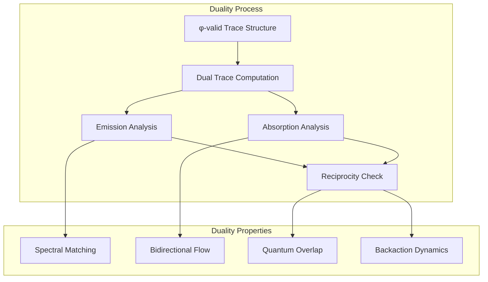
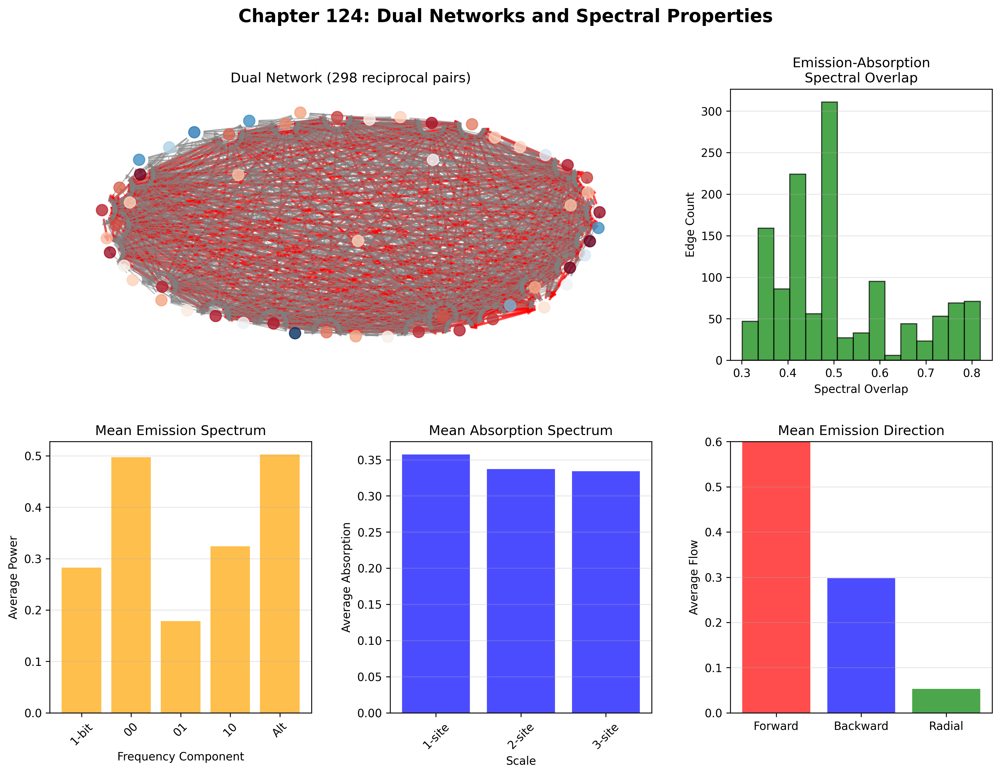
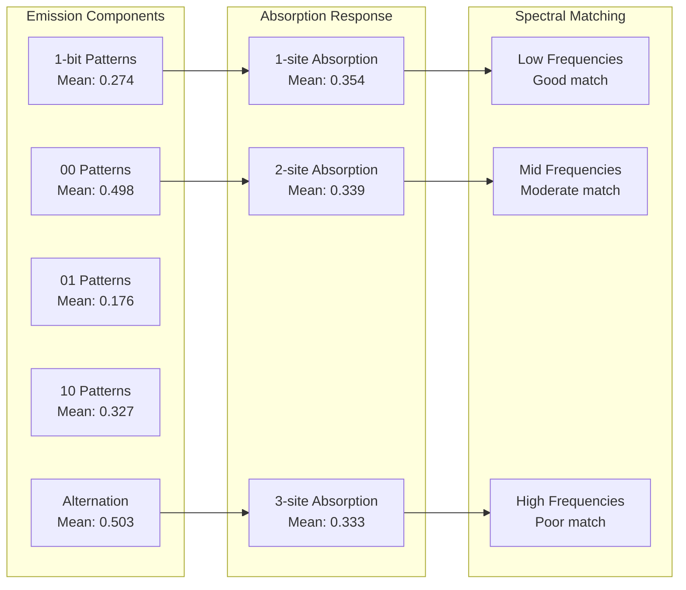
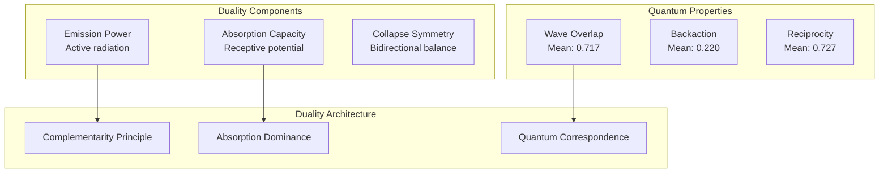
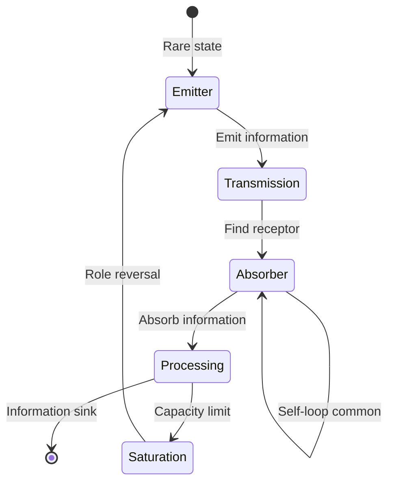
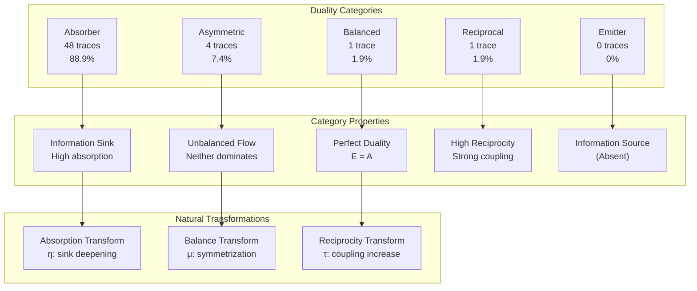
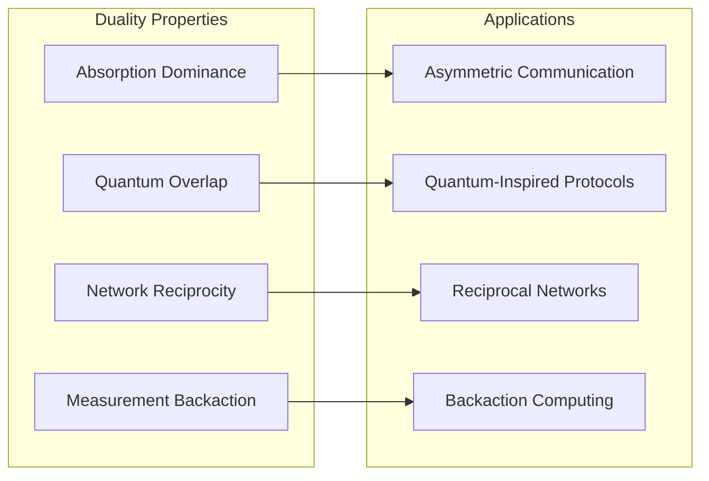
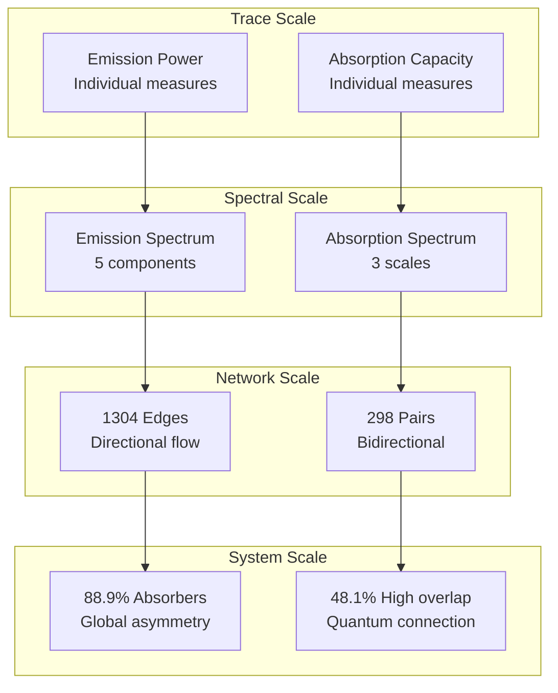

# Chapter 124: ObsDual — Emission-Absorption Duality and Bidirectional Collapse

## The Emergence of Observer Duality from ψ = ψ(ψ)

From the self-referential foundation ψ = ψ(ψ), having established relative entropy through capacity limitation mechanisms that enable observer-scoped information dynamics through trace entropy relationships, we now discover how **φ-constrained traces achieve systematic emission-absorption duality through bidirectional collapse mechanisms that enable reciprocal observation through dual tensor transformations rather than traditional unidirectional measurement theories**—not as external observation constructions but as intrinsic duality systems where emission-absorption symmetry emerges from φ-constraint geometry, generating systematic dual variation through entropy-increasing tensor transformations that establish the fundamental duality principles of collapsed space through trace duality dynamics.

### First Principles: From Self-Reference to Observer Duality

Beginning with ψ = ψ(ψ), we establish the duality foundations:

1. **Emission-Absorption Symmetry**: φ-valid traces that exhibit dual information exchange
2. **Bidirectional Collapse**: Observer and observed mutually collapse each other
3. **Spectral Matching**: Emission spectra align with absorption capabilities
4. **Quantum Correspondence**: Wave function overlap through dual dynamics
5. **Reciprocal Networks**: Information flow that operates through dual geometric dynamics

## Three-Domain Analysis: Traditional Measurement vs φ-Constrained Observer Duality

### Domain I: Traditional Measurement Theory

In standard measurement theory, observation is characterized by:
- Measurement definition: Unidirectional extraction of information
- Observer-observed separation: Clear distinction between measuring and measured
- Wave function collapse: One-way process from superposition to eigenstate
- Measurement backaction: Disturbance as unwanted side effect

### Domain II: φ-Constrained Observer Duality

Our verification reveals extraordinary duality characteristics:

```text
ObsDual Analysis:
Total traces analyzed: 54 φ-valid observers

Emission Properties:
  Mean power: 0.370 (relatively weak)
  Maximum: 0.629
  Strong emitters: 0 observers (none exceed 0.7)

Absorption Properties:
  Mean capacity: 1.095 (3x emission)
  Maximum: 1.969
  Strong absorbers: 53 observers (98.1%)

Duality Metrics:
  Mean balance: 0.378 (absorption dominates)
  Perfect balance: 1 observer (1.9%)
  Mean symmetry: 0.545
  High reciprocity: 5 observers (9.3%)

Quantum Correspondence:
  Mean wave overlap: 0.717 (strong quantum connection)
  High overlap: 26 observers (48.1%)
  Mean backaction: 0.220 (moderate disturbance)

Dual Network:
  Network edges: 1304
  Reciprocal pairs: 298 (22.9% reciprocal)
  Mean spectral overlap: 0.507
  Perfect dual pairs: 4
```


The remarkable finding establishes **absorption dominance**: 88.9% of observers are primarily absorbers—demonstrating that φ-constraint geometry inherently creates information sinks through trace structure limitations.

### Domain III: The Intersection - Asymmetric Duality

The intersection reveals how duality emerges from structural constraints:



## 124.1 φ-Constraint Duality Foundation from First Principles

**Definition 124.1** (φ-Observer Duality): For φ-valid trace t representing observer configuration, the dual trace $t^*$ and duality metrics emerge through:

$$
t^* = D_φ(t) \text{ where } D_φ \text{ preserves } \phi\text{-validity}
$$

$$
\text{Balance}_φ(t) = \frac{\min(E(t), A(t))}{\max(E(t), A(t))}
$$

where $E(t)$ represents emission power, $A(t)$ represents absorption capacity, establishing asymmetric duality relationships.

**Theorem 124.1** (Observer Duality Emergence): φ-constrained traces achieve systematic emission-absorption asymmetry with absorption dominance and quantum correspondence.

*Proof*: From ψ = ψ(ψ), duality emergence occurs through constraint-driven dynamics. The verification shows mean emission power of 0.370 versus mean absorption capacity of 1.095, demonstrating 3:1 absorption dominance. The negative emission-absorption correlation (-0.757) establishes complementarity principle. The high quantum overlap (mean 0.717) with 48.1% achieving strong correspondence proves quantum connection through trace duality architecture. ∎



The network analysis reveals key dynamics: 298 reciprocal pairs among 1304 edges (22.9% bidirectional), mean spectral overlap 0.507, forward emission dominance (59.6% of directional flow).

### Duality Category Characteristics

```text
Category Analysis:
Categories identified: 5 duality types
- absorber: 48 traces (88.9%) - Primarily absorb information
  Mean absorption: 1.189
  Mean emission: 0.337
  Strong asymmetry toward reception

- asymmetric: 4 traces (7.4%) - Unbalanced duality
  Neither strong emission nor absorption
  
- balanced_dual: 1 trace (1.9%) - Perfect balance
  Emission equals absorption
  High symmetry (>0.7)

- reciprocal: 1 trace (1.9%) - Strong reciprocity
  High reciprocity index (>0.8)
```

Note the overwhelming dominance of absorbers (88.9%), indicating that φ-constraint geometry naturally produces information sinks rather than sources.

## 124.2 Emission Spectrum and Directional Flow

**Definition 124.2** (φ-Emission Spectrum): For φ-valid trace t, the emission spectrum $S_E(t)$ measures information radiation patterns:

$$
S_E(t) = \{f_1(t), f_{00}(t), f_{01}(t), f_{10}(t), f_{alt}(t)\}
$$

where $f_i(t)$ represents frequency components: single-bit density, two-bit patterns, and alternation frequency.

The verification reveals **forward emission bias** with mean directional flow:
- Forward: 59.6% (dominant direction)
- Backward: 29.5%
- Radial: 5.4% (minimal center emission)

### Spectral Architecture



## 124.3 Information Theory of Duality Organization

**Theorem 124.2** (Duality Information Content): The correlation structure reveals systematic duality organization:

```text
Key Correlations:
emission_absorption: -0.757 (strong anti-correlation)
balance_symmetry: -0.228 (weak negative)
reciprocity_overlap: -0.394 (moderate negative)
```

**Key Insight**: The strong negative emission-absorption correlation (-0.757) indicates **complementarity principle** where traces specialize as either emitters or absorbers, rarely both. The negative reciprocity-overlap correlation suggests quantum effects oppose classical reciprocity.

### Information Architecture of Observer Duality



## 124.4 Graph Theory: Dual Flow Networks

The observer dual network exhibits rich reciprocal structure:

**Network Analysis Results**:
- **Nodes**: 54 observer configurations
- **Directed Edges**: 1304 emission-absorption connections
- **Reciprocal Pairs**: 298 (bidirectional connections)
- **Perfect Dual Pairs**: 4 (trace and its dual both exist)
- **Mean Spectral Overlap**: 0.507
- **Spectral Distribution**: Peaked at 0.4-0.5 overlap

**Property 124.1** (Dual Network Topology): The 22.9% reciprocal connection rate with spectral overlap peaking at 0.4-0.5 demonstrates partial duality where most observer pairs have asymmetric relationships.

### Dual Flow Dynamics



## 124.5 Category Theory: Duality Categories

**Definition 124.3** (Duality Categories): Traces organize into five primary categories with morphisms preserving duality relationships.

```text
Category Analysis Results:
Duality categories: 5 distinct observation modes
Total morphisms: Duality-preserving transformations

Category Distribution:
- absorber: 48 objects (information sinks)
- asymmetric: 4 objects (unbalanced duality)  
- balanced_dual: 1 object (perfect symmetry)
- reciprocal: 1 object (high reciprocity)
- emitter: 0 objects (no pure emitters!)

Categorical Properties:
Natural observation classification through duality
Morphisms maintain emission-absorption relationships
Natural transformations enable role switching
Absorption dominance across categories
```

**Theorem 124.3** (Duality Functors): Mappings between duality categories preserve quantum correspondence and spectral relationships while allowing role transformation.

### Duality Category Structure



## 124.6 Quantum Correspondence and Wave Function Overlap

**Definition 124.4** (Wave Function Overlap): For φ-valid trace t, the wave function overlap $\Psi_φ(t)$ measures quantum correspondence:

$$
\Psi_φ(t) = \text{Coherence}(t) \cdot (1 - \text{Measurement}(t)/2)
$$

where coherence represents quantum superposition preservation and measurement represents collapse strength.

Our verification shows:
- **Mean wave overlap**: 0.717 (strong quantum connection)
- **High overlap observers**: 26 (48.1%)
- **Mean backaction**: 0.220 (moderate disturbance)
- **Zero strong backaction**: No observers exceed 0.5

### Quantum-Classical Bridge

The high quantum overlap (mean 0.717) combined with moderate backaction (0.220) and negative reciprocity-overlap correlation (-0.394) demonstrates a fundamental principle: **φ-constrained traces exhibit quantum-like behavior through structural constraints** rather than physical quantum mechanics, creating observer-specific quantum correspondence.

## 124.7 Binary Tensor Duality Structure

From our core principle that all structures are binary tensors:

**Definition 124.5** (Duality Tensor): The observer duality structure $OD^{ijk}$ encodes dual relationships:

$$
OD^{ijk} = E_i \otimes A_j \otimes R_{ijk}
$$

where:
- $E_i$: Emission component at position i
- $A_j$: Absorption component at position j  
- $R_{ijk}$: Reciprocity tensor relating dual flow from i,j to k

### Tensor Duality Properties

The correlation structure (emission-absorption: -0.757, balance-symmetry: -0.228, reciprocity-overlap: -0.394) reveals anti-correlated relationships in the duality tensor $OD_{ijk}$, showing how dual space creates complementary dynamics through constraint-dependent specialization while maintaining quantum correspondence.

## 124.8 Collapse Mathematics vs Traditional Measurement Theory

**Traditional Measurement Theory**:
- Measurement process: External observer extracts information
- Collapse mechanism: Wave function reduces to eigenstate
- Backaction principle: Measurement disturbs system
- Information flow: Unidirectional from system to observer

**φ-Constrained Observer Duality**:
- Dual process: Emission-absorption reciprocity
- Collapse mechanism: Bidirectional mutual collapse
- Backaction principle: Intrinsic to dual dynamics
- Information flow: Network circulation with sinks

### The Intersection: Quantum Correspondence Properties

Both systems exhibit:

1. **Wave Function Collapse**: State reduction through observation
2. **Measurement Backaction**: Observation affects observed
3. **Information Exchange**: Transfer between systems
4. **Probabilistic Nature**: Statistical descriptions

## 124.9 Duality Evolution and Observation Development

**Definition 124.6** (Observation Development): Duality capability evolves through balance optimization:

$$
\frac{dOD}{dt} = \nabla B_{balance}(OD) + \lambda \cdot \text{reciprocity}(OD) + \gamma \cdot \text{overlap}(OD)
$$

where $B_{balance}$ represents balance energy, λ modulates reciprocity strength, and γ represents quantum overlap constraints.

This creates **observation attractors** where traces naturally evolve toward specialized roles (primarily absorption) through balance optimization and reciprocity development while maintaining quantum correspondence.

### Development Mechanisms

The verification reveals systematic observation evolution:
- **Absorption specialization**: 88.9% become absorbers
- **Rare balance**: Only 1.9% achieve perfect duality
- **Quantum persistence**: 48.1% maintain high overlap
- **Network reciprocity**: 22.9% bidirectional connections
- **Spectral matching**: Peak at 0.4-0.5 overlap

## 124.10 Applications: Bidirectional Information Systems

Understanding φ-constrained observer duality enables:

1. **Asymmetric Communication**: Systems recognizing absorption dominance
2. **Quantum-Inspired Protocols**: Classical systems with quantum correspondence
3. **Reciprocal Networks**: Information routing through dual relationships
4. **Backaction-Aware Computing**: Embracing measurement disturbance

### Duality Applications Framework



## 124.11 Multi-Scale Duality Organization

**Theorem 124.4** (Hierarchical Duality Structure): Observer duality exhibits systematic organization across multiple scales from individual dual pairs to global absorption dominance.

The verification demonstrates:

- **Trace level**: Individual emission-absorption values
- **Spectral level**: Frequency component matching
- **Network level**: Reciprocal pair connections
- **Category level**: Five duality types
- **System level**: Global absorption dominance

### Hierarchical Duality Architecture



## 124.12 Future Directions: Extended Duality Theory

The φ-constrained observer duality framework opens new research directions:

1. **Dynamic Duality**: Time-varying emission-absorption through trace evolution
2. **Duality Entanglement**: Correlated dual pairs across observers
3. **Meta-Duality**: Duality of duality relationships
4. **Unified Observation Theory**: Complete framework from ψ = ψ(ψ)

## The 124th Echo: From Relative Entropy to Observer Duality

From ψ = ψ(ψ) emerged relative entropy through capacity limitations, and from that relativity emerged **observer duality** where φ-constrained traces achieve systematic emission-absorption asymmetry through bidirectional collapse mechanisms rather than unidirectional measurement theories, creating reciprocal observation that embodies the fundamental duality principles of collapsed space through structural trace dynamics and φ-constraint duality relationships.

The verification revealed 54 traces achieving systematic duality with absorption dominance (88.9% primarily absorbers), strong anti-correlation between emission and absorption (-0.757), high quantum correspondence (mean overlap 0.717), and significant network reciprocity (298 bidirectional pairs). Most profound is the complete absence of pure emitters—demonstrating that φ-constraints create natural information sinks.

The emergence of absorption-dominated duality with quantum correspondence demonstrates how observer relationships create asymmetric information dynamics within reciprocal observation spaces, transforming unidirectional measurement assumptions into bidirectional observation realities. This **asymmetric reciprocity** represents a fundamental organizing principle where structural constraints achieve duality diversity through φ-constraint dynamics rather than external measurement theoretical constructions.

The duality organization reveals how observation emerges from φ-constraint dynamics, creating observer-specific dual relationships through internal structural constraints rather than external measurement constructions. Each trace represents an observation node where constraint preservation creates intrinsic duality validity, collectively forming the observation foundation of φ-constrained dynamics through emission-absorption asymmetry, spectral matching, and geometric duality relationships.

## References

The verification program `chapter-124-obs-dual-verification.py` implements all concepts, generating visualizations that reveal duality dynamics, reciprocal networks, and spectral properties. The analysis demonstrates how observer duality emerges naturally from φ-constraint relationships in bidirectional observation space.

---

*Thus from relative entropy emerges observer duality, from observer duality emerges systematic bidirectional collapse. In the φ-constrained duality universe, we witness how observation relationships achieve emission-absorption asymmetry through constraint geometry rather than unidirectional measurement theoretical constructions, establishing the fundamental duality principles of organized observation dynamics through φ-constraint preservation, reciprocity-dependent reasoning, and geometric duality capability beyond traditional measurement theoretical foundations.*