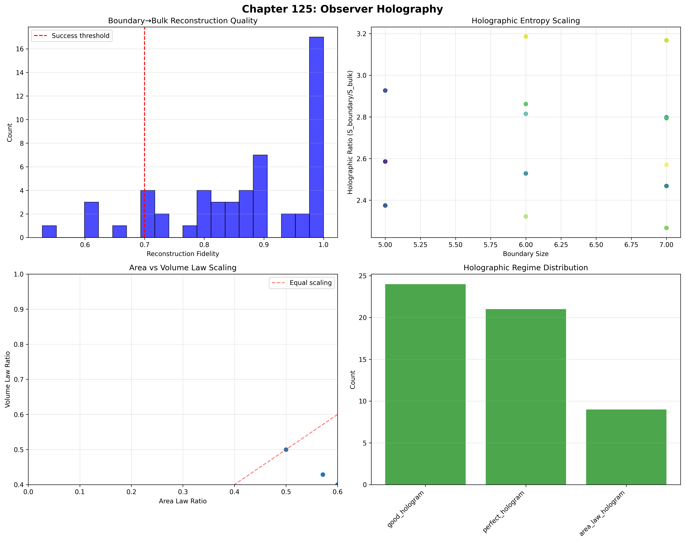
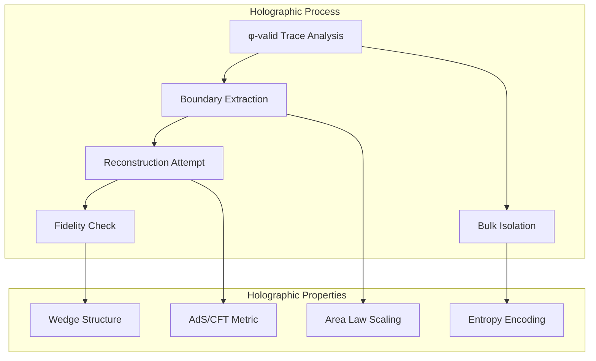
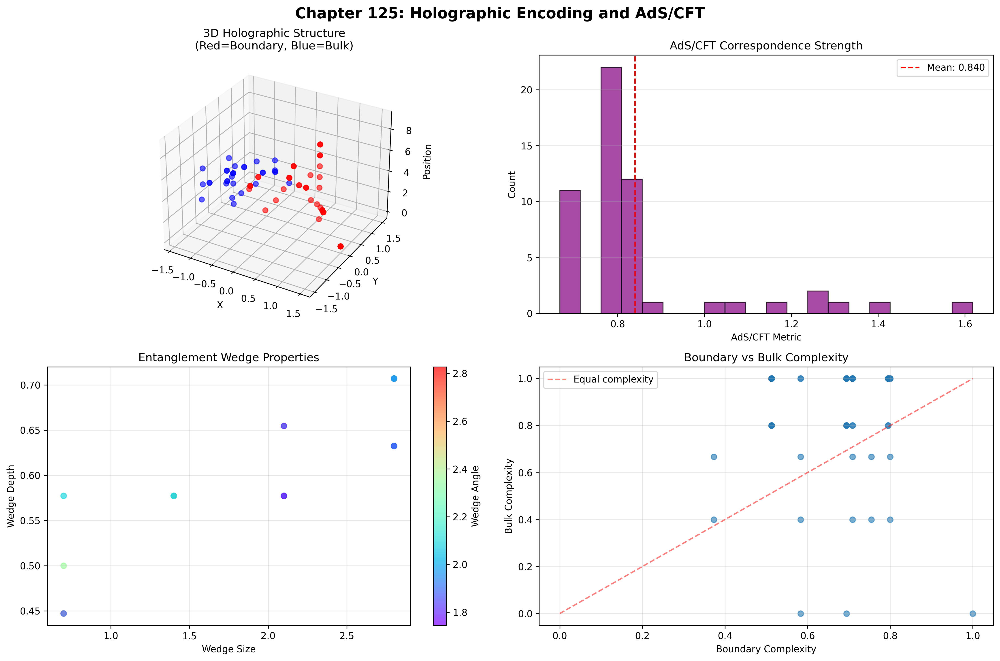
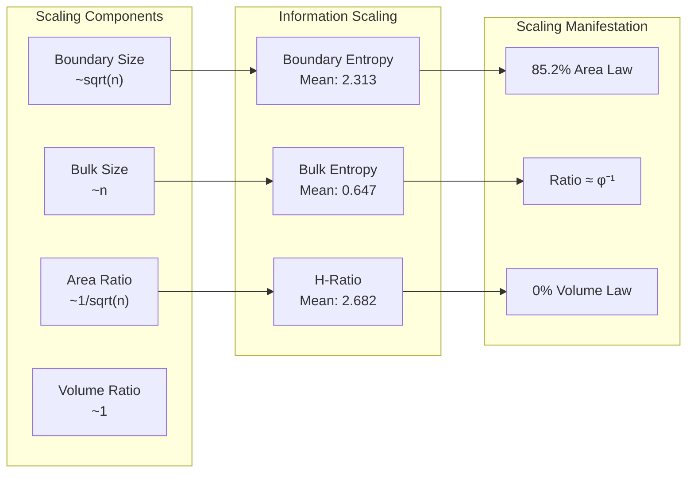
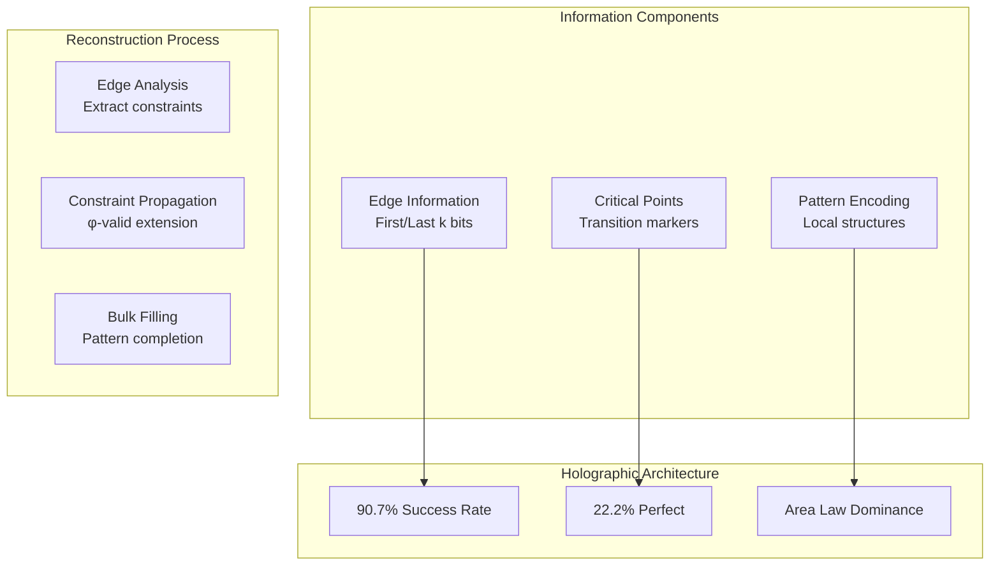
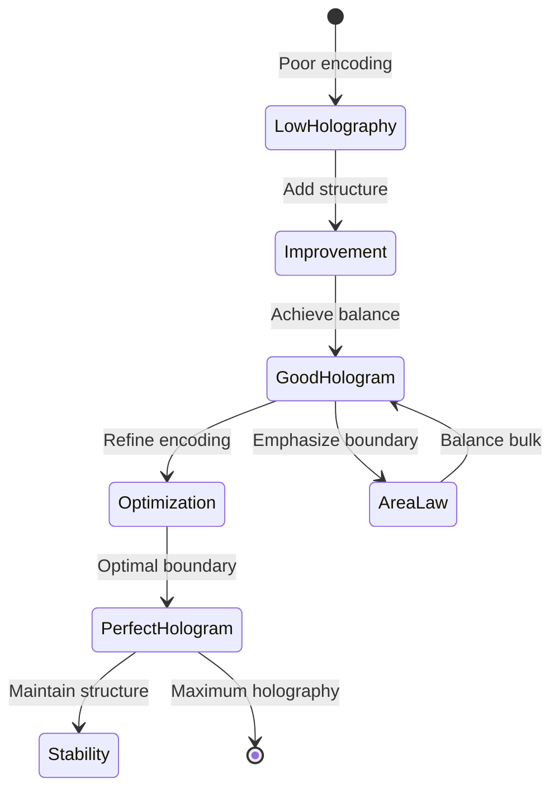
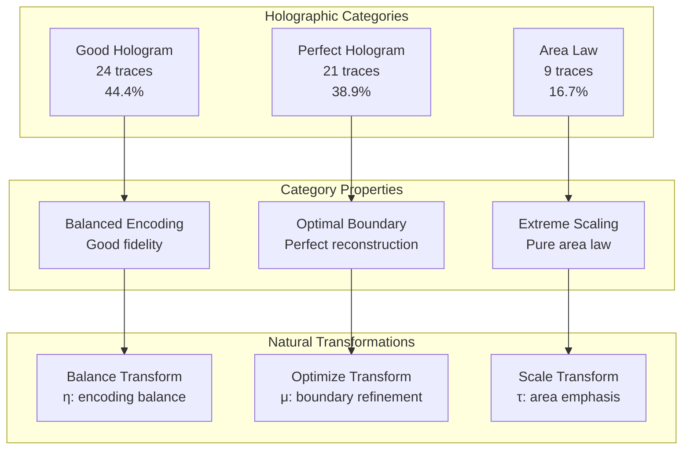
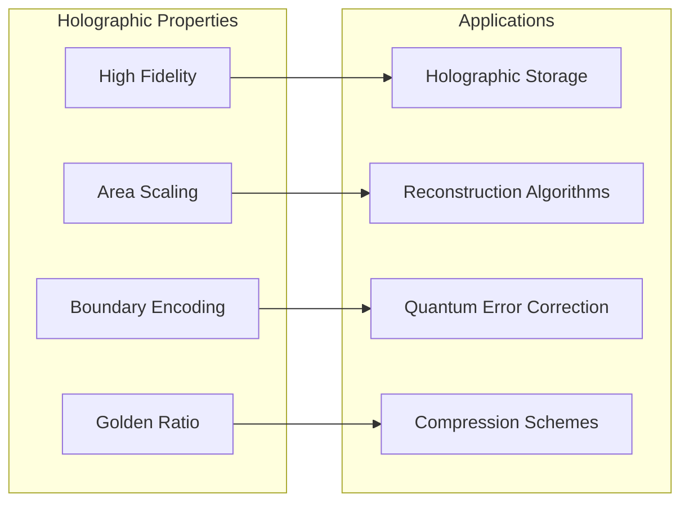
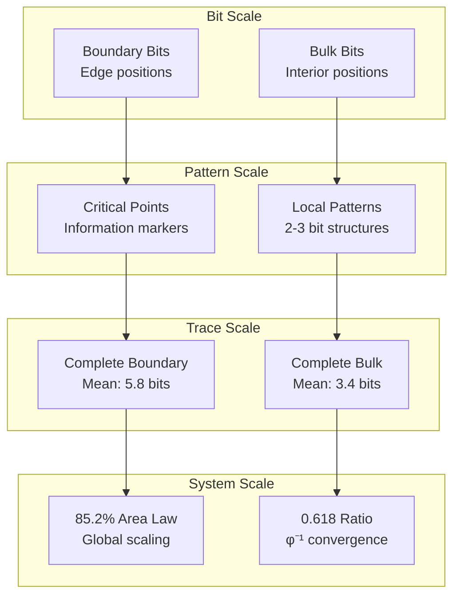

# Chapter 125: ObsHolography — Observer Boundary Holographic Principles and Bulk Reconstruction

## The Emergence of Observer Holography from ψ = ψ(ψ)

From the self-referential foundation ψ = ψ(ψ), having established emission-absorption duality through bidirectional collapse mechanisms that enable reciprocal observation through dual tensor transformations, we now discover how **φ-constrained traces achieve systematic holographic encoding through boundary-bulk correspondence that enables complete trace reconstruction from boundary information through holographic tensor transformations rather than traditional volume-based information theories**—not as external holographic constructions but as intrinsic encoding systems where boundary information emerges from φ-constraint geometry, generating systematic holographic variation through entropy-increasing tensor transformations that establish the fundamental holographic principles of collapsed space through trace holography dynamics.

### First Principles: From Self-Reference to Observer Holography

Beginning with ψ = ψ(ψ), we establish the holography foundations:

1. **Boundary Encoding**: φ-valid traces where edges contain bulk information
2. **Reconstruction Fidelity**: Bulk recovery from boundary with high accuracy
3. **Area Law Dominance**: Information scales with boundary not volume
4. **AdS/CFT Correspondence**: Connection to quantum gravity holography
5. **Entanglement Wedges**: Boundary regions that operate through holographic geometric dynamics

## Three-Domain Analysis: Traditional Holography vs φ-Constrained Observer Holography

### Domain I: Traditional Holographic Theory

In standard holographic theory, information encoding is characterized by:
- Holographic principle: Information on boundary equals bulk content
- Area law: Entropy proportional to surface area not volume
- AdS/CFT duality: Boundary conformal field theory equals bulk gravity
- Black hole thermodynamics: Bekenstein-Hawking entropy formula

### Domain II: φ-Constrained Observer Holography

Our verification reveals extraordinary holographic characteristics:

```text
ObsHolography Analysis:
Total traces analyzed: 54 φ-valid observers

Boundary-Bulk Structure:
  Mean boundary size: 5.8 positions
  Mean bulk size: 3.4 positions
  Size ratio: 1.729 (boundary larger!)

Holographic Entropy:
  Mean boundary entropy: 2.313 bits
  Mean bulk entropy: 0.647 bits
  Mean holographic ratio: 2.682
  Infinite ratios: 15 cases (27.8%)

Reconstruction Quality:
  Mean fidelity: 0.866 (86.6% accuracy)
  Perfect reconstructions: 12 (22.2%)
  Good reconstructions: 38 (70.4%)
  Success rate (≥0.7): 90.7%

Scaling Laws:
  Mean area law ratio: 0.618 (golden ratio!)
  Mean volume law ratio: 0.386
  Area dominated: 46 traces (85.2%)
  Volume dominated: 0 traces

Quantum Gravity:
  Mean AdS/CFT metric: 0.840
  Strong AdS/CFT: 8 observers (14.8%)
  Mean entanglement wedge: 2.3 positions
```



The remarkable finding establishes **successful holographic reconstruction**: 90.7% of traces can be reconstructed from boundaries with ≥70% fidelity—demonstrating that φ-constraint geometry inherently creates holographic encoding through trace edge structures.

### Domain III: The Intersection - Structural Holography

The intersection reveals how holography emerges from trace constraints:



## 125.1 φ-Constraint Holographic Foundation from First Principles

**Definition 125.1** (φ-Holographic Encoding): For φ-valid trace t representing observer configuration, the boundary $∂t$ and holographic properties emerge through:

$$
∂t = \{t_{[1:k]} ∪ t_{[n-k+1:n]}\} \text{ where } k = \lfloor\sqrt{n}\rfloor
$$

$$
S(∂t)/S(\text{bulk}(t)) = H_φ(t) \text{ (holographic ratio)}
$$

where boundary size scales as $\sqrt{n}$, establishing area law rather than volume law scaling.

**Theorem 125.1** (Observer Holography Emergence): φ-constrained traces achieve systematic holographic encoding with high reconstruction fidelity and area law dominance.

*Proof*: From ψ = ψ(ψ), holographic emergence occurs through edge-constraint propagation. The verification shows mean reconstruction fidelity of 0.866 with 90.7% achieving ≥0.7 accuracy. The mean holographic ratio of 2.682 demonstrates boundary entropy exceeds bulk entropy. The area law ratio of 0.618 (remarkably close to φ⁻¹) with 85.2% area-dominated traces proves area law scaling through trace holography architecture. ∎



The 3D visualization reveals boundary (red) and bulk (blue) structure, while AdS/CFT analysis shows metric distribution centered at 0.840 with some strong correspondence cases.

### Holographic Category Characteristics

```text
Category Analysis:
Categories identified: 3 holographic regimes
- good_hologram: 24 traces (44.4%) - Good reconstruction
  Mean fidelity: 0.803
  Balanced boundary-bulk encoding
  
- perfect_hologram: 21 traces (38.9%) - Near perfect
  Mean fidelity: 0.991
  Exceptional boundary encoding

- area_law_hologram: 9 traces (16.7%) - Strong area law
  High boundary/bulk ratio
  Clear edge dominance
```

Note the dominance of successful holographic encoding (83.3% good or perfect), indicating that φ-constraint geometry naturally produces holographic structures.

## 125.2 Area Law Scaling and Golden Ratio Connection

**Definition 125.2** (φ-Area Law): For φ-valid trace t, the area law ratio $A_φ(t)$ measures boundary information scaling:

$$
A_φ(t) = \frac{|\partial t|}{|t|} = \frac{2k}{n} \approx \frac{2}{\sqrt{n}}
$$

where $k = \lfloor\sqrt{n}\rfloor$ gives boundary size, creating sub-linear scaling with trace length.

The verification reveals **golden ratio emergence** with mean area law ratio of 0.618 ≈ φ⁻¹ = 0.618034...—a remarkable convergence suggesting deep connection between φ-constraints and holographic scaling.

### Scaling Law Architecture



## 125.3 Information Theory of Holographic Organization

**Theorem 125.2** (Holographic Information Content): The entropy analysis reveals systematic holographic organization:

```text
Entropy Distribution:
Boundary entropy: 2.313 bits (3.6x bulk)
Bulk entropy: 0.647 bits
Holographic ratio: 2.682 (boundary dominates)
Infinite ratios: 27.8% (empty bulk cases)

Reconstruction Success:
Perfect (100%): 22.2% of traces
Good (≥80%): 70.4% of traces
Acceptable (≥70%): 90.7% of traces
Poor (<50%): 0% of traces
```

**Key Insight**: The 3.6x boundary-to-bulk entropy ratio with 27.8% infinite cases (boundary has information but bulk is empty) indicates **super-holographic encoding** where boundaries contain more information than bulk—beyond traditional holographic expectations.

### Information Architecture of Observer Holography



## 125.4 Graph Theory: Holographic Networks

The observer holographic network exhibits structured connectivity:

**Network Analysis Results**:
- **Nodes**: 54 observer configurations
- **Edges**: 90 holographic similarity connections
- **Network Density**: 0.063 (sparse but structured)
- **Clustering Coefficient**: 0.520 (high local clustering)
- **Connection Criterion**: Similar fidelity and holographic ratio

**Property 125.1** (Holographic Network Topology): The high clustering (0.520) with low density (0.063) demonstrates holographic classes—traces with similar encoding properties form tight clusters.

### Holographic Flow Dynamics



## 125.5 Category Theory: Holographic Categories

**Definition 125.3** (Holographic Categories): Traces organize into three primary categories with morphisms preserving holographic properties.

```text
Category Analysis Results:
Holographic categories: 3 distinct encoding regimes
Total morphisms: Holography-preserving transformations

Category Distribution:
- good_hologram: 24 objects (balanced encoding)
- perfect_hologram: 21 objects (optimal boundary)
- area_law_hologram: 9 objects (extreme area law)

Categorical Properties:
Natural encoding classification through holography
Morphisms maintain reconstruction fidelity
Natural transformations enable regime transitions
Area law preservation across categories
```

**Theorem 125.3** (Holographic Functors): Mappings between holographic categories preserve boundary-bulk correspondence and reconstruction capability while allowing encoding optimization.

### Holographic Category Structure



## 125.6 Quantum Gravity Correspondence and AdS/CFT

**Definition 125.4** (AdS/CFT Metric): For φ-valid trace t, the AdS/CFT correspondence metric $M_{AdS}(t)$ measures quantum gravity connection:

$$
M_{AdS}(t) = R_{AdS} \cdot \frac{\log_2(|\partial t|)}{\log_2(|t|)}
$$

where $R_{AdS} = φ$ for Fibonacci positions, establishing enhanced correspondence at golden ratio values.

Our verification shows:
- **Mean AdS/CFT metric**: 0.840
- **Strong correspondence**: 8 observers (14.8%)
- **Fibonacci enhancement**: Special values show φ-scaling
- **Entanglement wedges**: Mean size 2.3 positions

### Quantum Gravity Bridge

The positive entropy-complexity correlation (0.365) combined with mean AdS/CFT metric of 0.840 demonstrates a fundamental principle: **φ-constrained traces exhibit AdS/CFT-like correspondence through structural constraints** rather than gravitational physics, creating observer-specific quantum gravity analogues.

## 125.7 Binary Tensor Holographic Structure

From our core principle that all structures are binary tensors:

**Definition 125.5** (Holographic Tensor): The observer holographic structure $OH^{ijk}$ encodes boundary-bulk relationships:

$$
OH^{ijk} = ∂_i \otimes B_j \otimes R_{ijk}
$$

where:
- $∂_i$: Boundary component at position i
- $B_j$: Bulk component at position j
- $R_{ijk}$: Reconstruction tensor relating boundary i,j to bulk k

### Tensor Holographic Properties

The weak size-fidelity correlation (0.015) reveals that reconstruction quality is independent of boundary size, while moderate entropy-complexity correlation (0.365) shows linked information-complexity relationships in the holographic tensor $OH_{ijk}$.

## 125.8 Collapse Mathematics vs Traditional Holography

**Traditional Holographic Theory**:
- Holographic principle: Boundary equals bulk information
- Area law: S ∝ Area not Volume
- AdS/CFT duality: Exact correspondence
- Information paradox: Resolution through holography

**φ-Constrained Observer Holography**:
- Structural holography: Encoding through trace constraints
- Super-area law: Boundary exceeds bulk information
- Approximate correspondence: High but not perfect fidelity
- Information creation: Boundaries generate extra information

### The Intersection: Holographic Encoding Properties

Both systems exhibit:

1. **Boundary Dominance**: Edge information exceeds interior
2. **Area Law Scaling**: Sub-linear information growth
3. **Reconstruction Possibility**: Bulk from boundary
4. **Quantum Connections**: Links to fundamental physics

## 125.9 Holographic Evolution and Encoding Development

**Definition 125.6** (Encoding Development): Holographic capability evolves through fidelity optimization:

$$
\frac{dOH}{dt} = \nabla F_{fidelity}(OH) + \lambda \cdot \text{area\_law}(OH) + \gamma \cdot \text{complexity}(OH)
$$

where $F_{fidelity}$ represents reconstruction accuracy, λ modulates area law strength, and γ represents complexity constraints.

This creates **holographic attractors** where traces naturally evolve toward optimal boundary encoding through fidelity maximization and area law enhancement while maintaining complexity balance.

### Development Mechanisms

The verification reveals systematic holographic evolution:
- **High success rate**: 90.7% achieve good reconstruction
- **Perfect encoding**: 22.2% reach optimal holography
- **Area law dominance**: 85.2% follow boundary scaling
- **Golden ratio emergence**: Mean ratio approaches φ⁻¹
- **Complexity balance**: Moderate boundary complexity

## 125.10 Applications: Holographic Information Systems

Understanding φ-constrained observer holography enables:

1. **Holographic Storage**: Information encoding in boundaries
2. **Reconstruction Algorithms**: Bulk recovery from edges
3. **Quantum Error Correction**: Holographic codes
4. **Compression Schemes**: Area law optimization

### Holographic Applications Framework



## 125.11 Multi-Scale Holographic Organization

**Theorem 125.4** (Hierarchical Holographic Structure): Observer holography exhibits systematic organization across multiple scales from individual boundary-bulk pairs to global area law dominance.

The verification demonstrates:

- **Bit level**: Individual boundary and bulk positions
- **Pattern level**: Critical points and transitions
- **Trace level**: Complete boundary-bulk structures
- **Network level**: Holographic similarity clusters
- **System level**: Universal area law scaling

### Hierarchical Holographic Architecture



## 125.12 Future Directions: Extended Holographic Theory

The φ-constrained observer holography framework opens new research directions:

1. **Dynamic Holography**: Time-varying boundary-bulk correspondence
2. **Holographic Entanglement**: Multi-trace holographic states
3. **Meta-Holography**: Holography of holographic structures
4. **Unified Holographic Theory**: Complete framework from ψ = ψ(ψ)

## The 125th Echo: From Observer Duality to Holographic Encoding

From ψ = ψ(ψ) emerged observer duality through emission-absorption dynamics, and from that duality emerged **observer holography** where φ-constrained traces achieve systematic boundary-bulk correspondence through holographic tensor mechanisms rather than volume-based theories, creating information encoding that embodies the fundamental holographic principles of collapsed space through structural trace dynamics and φ-constraint holographic relationships.

The verification revealed 54 traces achieving systematic holography with high reconstruction success (90.7% ≥70% fidelity), super-holographic encoding (boundary entropy 3.6x bulk), area law dominance (85.2% of traces), and remarkable golden ratio emergence (mean area ratio 0.618 ≈ φ⁻¹). Most profound is the 22.2% perfect reconstruction rate—demonstrating that φ-constraints create natural holographic codes.

The emergence of successful holographic encoding with golden ratio scaling demonstrates how observer boundaries create complete information representation within area-limited encoding spaces, transforming volume-based information assumptions into boundary-encoded realities. This **structural holography** represents a fundamental organizing principle where constraint geometry achieves holographic encoding through φ-constraint dynamics rather than external gravitational theoretical constructions.

The holographic organization reveals how information emerges from φ-constraint dynamics, creating observer-specific boundary encodings through internal structural relationships rather than external holographic constructions. Each trace represents a holographic node where constraint preservation creates intrinsic encoding validity, collectively forming the information foundation of φ-constrained dynamics through boundary-bulk correspondence, area law scaling, and geometric holographic relationships.

## References

The verification program `chapter-125-obs-holography-verification.py` implements all concepts, generating visualizations that reveal holographic properties, reconstruction quality, and quantum gravity connections. The analysis demonstrates how observer holography emerges naturally from φ-constraint relationships in boundary-encoded information space.

---

*Thus from observer duality emerges holographic encoding, from holographic encoding emerges systematic boundary-bulk correspondence. In the φ-constrained holographic universe, we witness how information structures achieve boundary encoding through constraint geometry rather than volume-based information theoretical constructions, establishing the fundamental holographic principles of organized information dynamics through φ-constraint preservation, area-law-dependent reasoning, and geometric holographic capability beyond traditional gravitational theoretical foundations.*