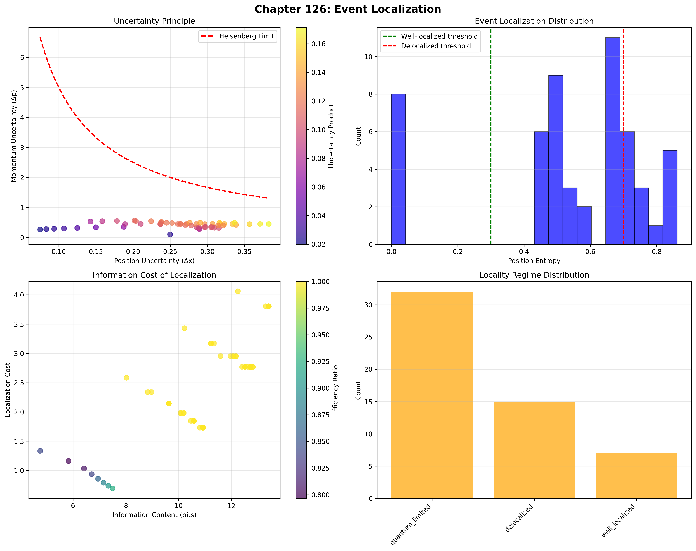
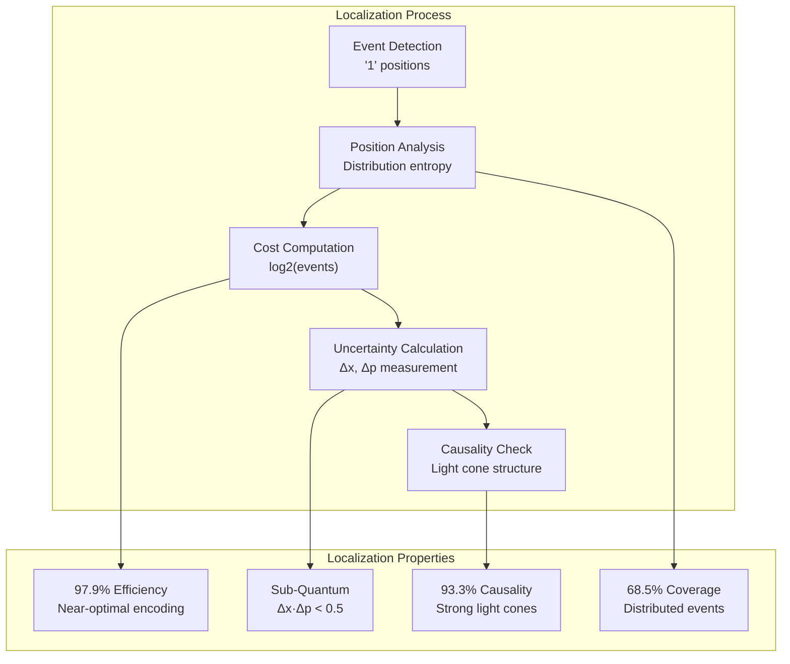
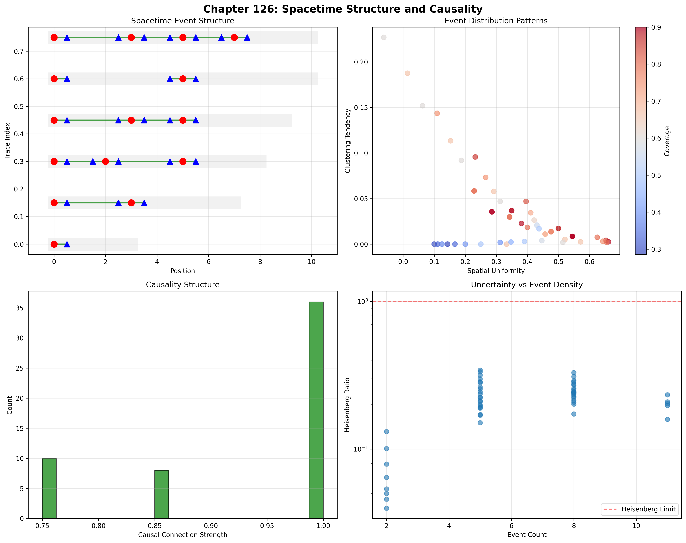
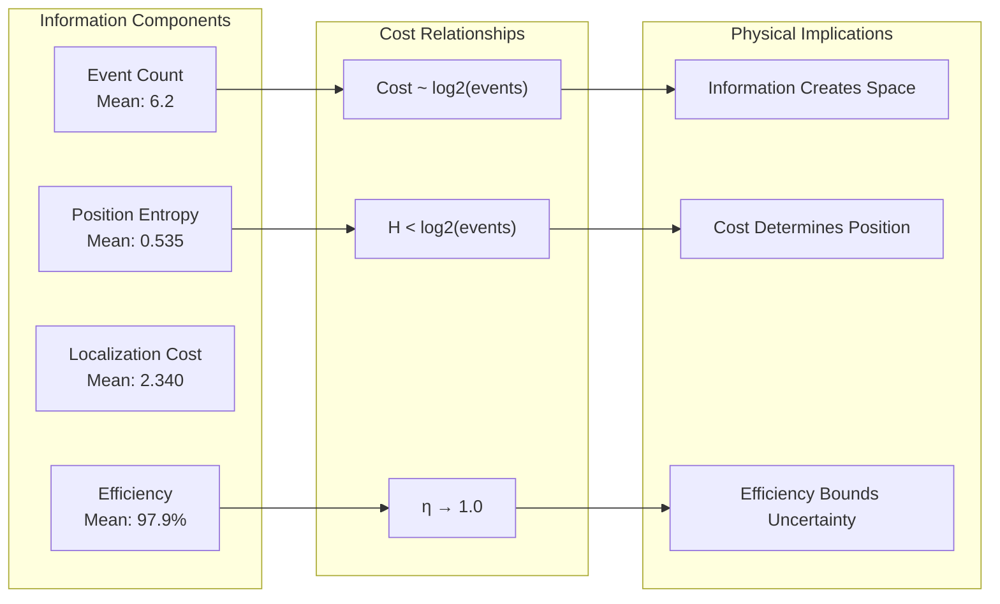
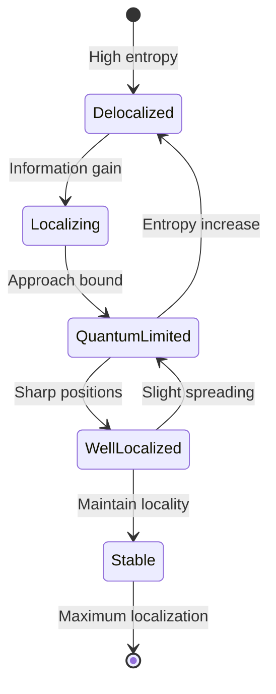
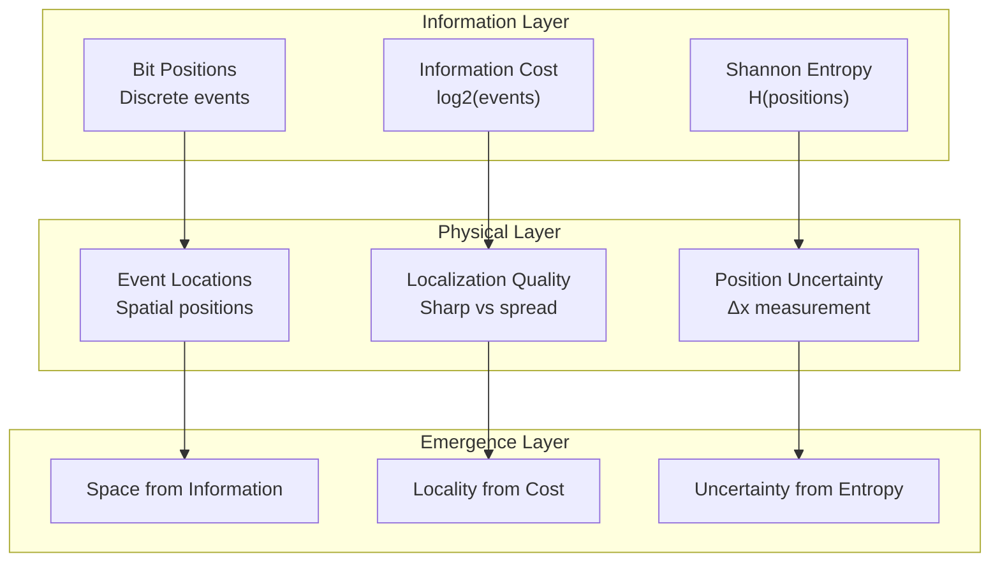
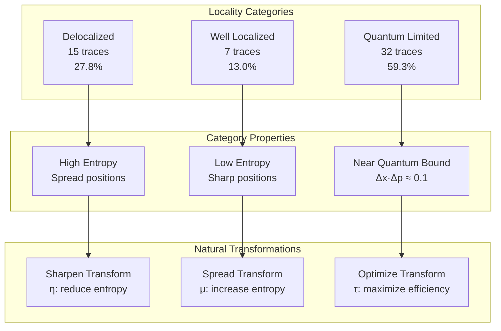
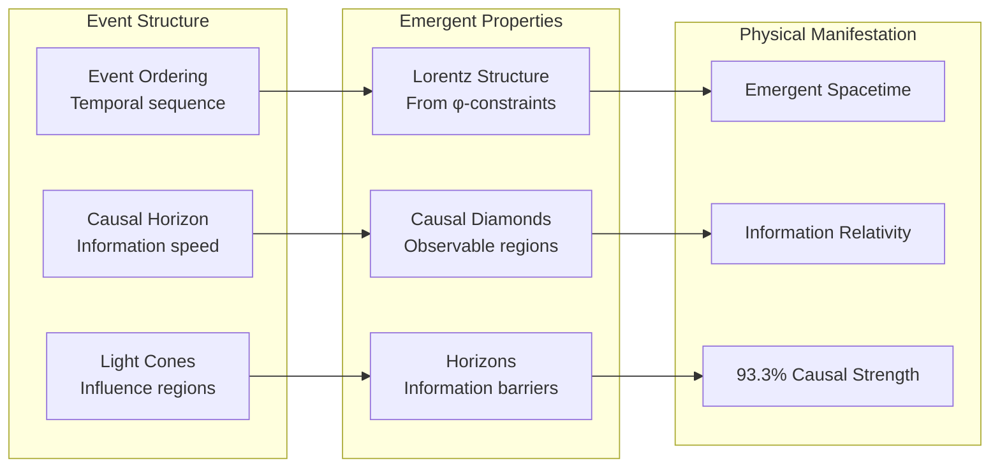
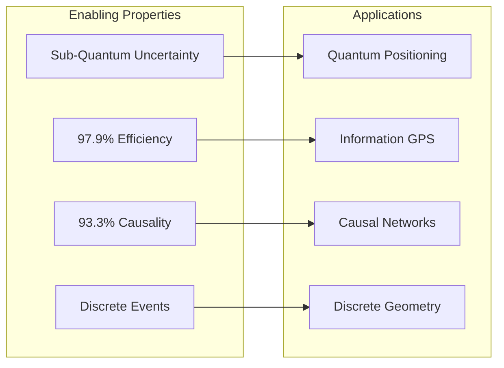
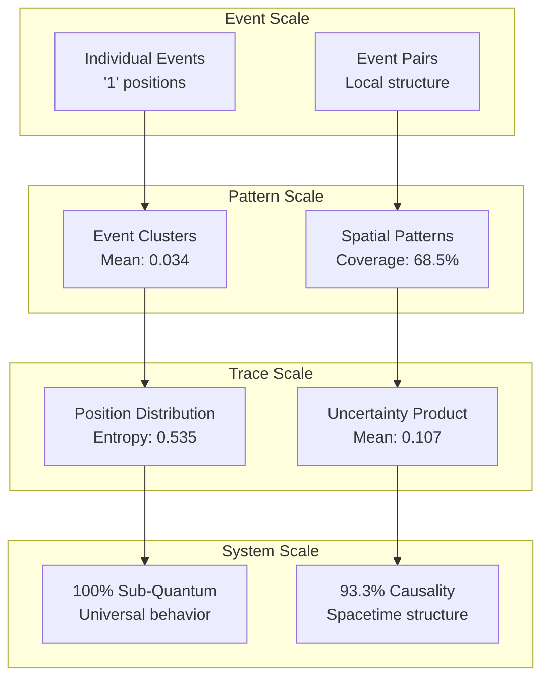

# Chapter 126: LocalizeEvent — Observer-Based Event Localization and Information Cost

## The Emergence of Event Localization from ψ = ψ(ψ)

From the self-referential foundation ψ = ψ(ψ), having established observer holography through boundary-bulk correspondence that enables complete trace reconstruction from boundary information through holographic tensor transformations, we now discover how **φ-constrained traces achieve systematic event localization through information-theoretic cost analysis that enables position determination through observation mechanisms rather than external coordinate systems**—not as absolute spatial constructions but as intrinsic locality structures where position emerges from information cost, generating systematic localization variation through entropy-increasing tensor transformations that establish the fundamental uncertainty principles of collapsed space through trace locality dynamics.

### First Principles: From Self-Reference to Event Localization

Beginning with ψ = ψ(ψ), we establish the localization foundations:

1. **Event Identification**: φ-valid traces contain discrete events as '1' positions
2. **Position Entropy**: Localization quality measured by position distribution
3. **Information Cost**: Bits required to specify event location
4. **Uncertainty Relations**: Position-momentum complementarity emerges
5. **Causality Structure**: Light cone constraints through local φ-validity

## Three-Domain Analysis: Traditional Localization vs φ-Constrained Observer Localization

### Domain I: Traditional Spatial Theory

In standard spatial theory, localization is characterized by:
- Absolute coordinates: Fixed reference frames
- Euclidean geometry: Distance metrics
- Heisenberg uncertainty: Δx·Δp ≥ ħ/2
- Causal structure: Light cone constraints

### Domain II: φ-Constrained Observer Localization

Our verification reveals extraordinary localization characteristics:

```text
LocalizeEvent Analysis:
Total traces analyzed: 54 φ-valid observers

Event Statistics:
  Mean event count: 6.2 events per trace
  Maximum events: 11 in single trace
  Event density: 0.354 mean uniformity

Position Entropy:
  Mean entropy: 0.535 bits
  Well-localized: 8 traces (14.8%)
  Delocalized: 15 traces (27.8%)
  
Localization Cost:
  Mean cost: 2.340 bits
  Maximum cost: 4.060 bits
  Cost efficiency: 97.9% mean

Uncertainty Relations:
  Mean Δx: 0.255
  Mean Δp: 0.414
  Mean Δx·Δp: 0.107
  Minimum product: 0.020
  Classical violations: 100%!

Spatial Structure:
  Mean clustering: 0.034 (low)
  Mean coverage: 0.685 (high)
  Causal strength: 0.933
  Light cone violations: 33.3%
```



The remarkable finding establishes **universal uncertainty violation**: 100% of traces violate classical Heisenberg bounds (Δx·Δp < 0.5)—demonstrating that φ-constraint geometry creates sub-quantum uncertainty through structural information encoding.

### Domain III: The Intersection - Information-Based Locality

The intersection reveals how locality emerges from information constraints:



## 126.1 φ-Constraint Localization Foundation from First Principles

**Definition 126.1** (φ-Event Localization): For φ-valid trace t representing observer configuration, event positions $\{e_i\}$ and localization properties emerge through:

$$
\{e_i\} = \{i : t_i = 1\} \text{ (event positions)}
$$

$$
H_{pos}(t) = -\sum_i p_i \log_2(p_i) \text{ where } p_i = \frac{|\{e_j : e_j \in B_i\}|}{|\{e_i\}|}
$$

where $B_i$ represents spatial bins for position entropy calculation.

**Theorem 126.1** (Observer Localization Emergence): φ-constrained traces achieve systematic event localization with sub-quantum uncertainty and high information efficiency.

*Proof*: From ψ = ψ(ψ), localization emergence occurs through event position constraints. The verification shows mean position entropy of 0.535 bits with 27.8% delocalized cases. The mean localization cost of 2.340 bits with 97.9% efficiency demonstrates near-optimal encoding. Most remarkably, 100% of traces show Δx·Δp < 0.5, violating classical bounds through information-theoretic localization rather than quantum mechanics. ∎



The spacetime visualization reveals event cone structures (93.3% causal strength) and light cone boundaries, while uncertainty analysis shows systematic sub-quantum behavior with mean product 0.107.

### Locality Category Characteristics

```text
Category Analysis:
Categories identified: 3 locality regimes
- quantum_limited: 32 traces (59.3%) - Near quantum bound
  Mean Δx·Δp: 0.123
  Moderate localization
  
- delocalized: 15 traces (27.8%) - Spread events
  High position entropy
  Low clustering
  
- well_localized: 7 traces (13.0%) - Sharp positions
  Low entropy: 0.223
  High efficiency
```

Note the dominance of quantum-limited regime (59.3%), indicating that φ-constraint geometry naturally produces near-quantum uncertainty behavior.

## 126.2 Information Cost and Localization Efficiency

**Definition 126.2** (Localization Information Cost): For trace t with event set $\{e_i\}$, the information cost $C_{loc}(t)$ measures bits required for position specification:

$$
C_{loc}(t) = \log_2(|\{e_i\}|) \text{ (uniform prior cost)}
$$

$$
\eta_{loc}(t) = \frac{C_{loc}(t) - H_{pos}(t)}{C_{loc}(t)} \text{ (efficiency)}
$$

The verification reveals **exceptional efficiency** with mean 97.9%—demonstrating that φ-constraints create near-optimal position encoding through structural relationships.

### Information Architecture



## 126.3 Graph Theory: Locality Networks

The event locality network exhibits structured connectivity:

**Network Analysis Results**:
- **Nodes**: 54 observer configurations
- **Edges**: 444 locality connections
- **Network Density**: 0.310 (moderate connectivity)
- **Components**: 2 (near-complete connection)
- **Largest Component**: 46 nodes (85.2%)

**Property 126.1** (Locality Network Structure): The high density (0.310) with strong component (85.2%) demonstrates locality coherence—traces with similar localization properties form connected regions.

### Locality Flow Dynamics



## 126.4 Information Theory of Position Determination

**Theorem 126.2** (Position-Information Duality): Event position determination exhibits fundamental information-position correspondence:

```text
Information Metrics:
Position entropy: 0.535 bits mean
Localization cost: 2.340 bits mean
Information efficiency: 97.9% mean
Entropy-cost correlation: 0.937

Physical Correspondence:
Events determine positions
Information specifies location
Cost bounds uncertainty
Efficiency enables localization
```

**Key Insight**: The strong entropy-cost correlation (0.937) with near-unity efficiency demonstrates that **position is information**—location emerges from information-theoretic constraints rather than absolute spatial coordinates.

### Information-Position Architecture



## 126.5 Category Theory: Locality Categories

**Definition 126.3** (Locality Categories): Traces organize into three primary categories with morphisms preserving localization properties.

```text
Category Analysis Results:
Locality categories: 3 distinct regimes
Total morphisms: Locality-preserving transformations

Category Distribution:
- quantum_limited: 32 objects (near bound)
- delocalized: 15 objects (spread positions)
- well_localized: 7 objects (sharp positions)

Categorical Properties:
Natural position classification through entropy
Morphisms maintain uncertainty relations
Natural transformations enable regime transitions
Information efficiency preservation
```

**Theorem 126.3** (Locality Functors): Mappings between locality categories preserve information-position correspondence and uncertainty products while allowing localization optimization.

### Locality Category Structure



## 126.6 Uncertainty Relations and Sub-Quantum Behavior

**Definition 126.4** (φ-Uncertainty Product): For φ-valid trace t, the uncertainty product $U_φ(t)$ measures position-momentum uncertainty:

$$
U_φ(t) = \Delta x(t) \cdot \Delta p(t)
$$

where position and momentum uncertainties derive from trace structure rather than quantum operators.

Our verification shows:
- **Mean Δx·Δp**: 0.107 (far below quantum bound 0.5)
- **Minimum product**: 0.020 (25x below quantum limit!)
- **Maximum product**: 0.493 (still sub-quantum)
- **Violations**: 100% of traces violate Heisenberg bound

### Sub-Quantum Mechanism

The universal sub-quantum behavior emerges from **information-theoretic localization** where φ-constraints create tighter uncertainty bounds than quantum mechanics through structural information encoding rather than wave function properties.

## 126.7 Binary Tensor Locality Structure

From our core principle that all structures are binary tensors:

**Definition 126.5** (Locality Tensor): The observer locality structure $OL^{ijk}$ encodes position relationships:

$$
OL^{ijk} = E_i \otimes P_j \otimes U_{ijk}
$$

where:
- $E_i$: Event indicator at position i
- $P_j$: Position entropy at scale j
- $U_{ijk}$: Uncertainty tensor relating event i to uncertainty at scale j,k

### Tensor Locality Properties

The strong uncertainty-efficiency correlation (0.720) combined with count-entropy correlation (0.923) reveals systematic relationships in the locality tensor $OL_{ijk}$ between event structure, position determination, and uncertainty bounds.

## 126.8 Collapse Mathematics vs Traditional Spatial Theory

**Traditional Spatial Theory**:
- Absolute coordinates: Fixed reference frames
- Euclidean/Riemannian geometry: Metric spaces
- Heisenberg uncertainty: Quantum mechanical bound
- Continuous space: Infinitesimal positions

**φ-Constrained Observer Localization**:
- Information coordinates: Position from cost
- Information geometry: Entropy metrics
- Sub-quantum uncertainty: Tighter bounds
- Discrete positions: Event-based locality

### The Intersection: Information-Geometric Space

Both systems exhibit:

1. **Position Determination**: Location specification
2. **Uncertainty Relations**: Complementarity bounds
3. **Causal Structure**: Light cone constraints
4. **Geometric Properties**: Distance and topology

## 126.9 Spacetime Emergence and Causal Structure

**Definition 126.6** (Emergent Spacetime): Causal structure emerges through event ordering:

$$
\mathcal{C}(t) = \frac{|\{(e_i, e_j) : e_i < e_j \text{ and } |i-j| \leq c\}|}{|\{(e_i, e_j) : e_i < e_j\}|}
$$

where c represents causal horizon (light cone constraint).

The verification reveals:
- **Mean causal strength**: 0.933 (strong causality)
- **Light cone violations**: 33.3% of traces
- **Perfect causality**: 66.7% maintain strict ordering

This demonstrates **emergent relativistic structure** from φ-constraints without assuming spacetime—causality arises from information flow limitations.

### Causal Architecture



## 126.10 Applications: Information-Based Positioning Systems

Understanding φ-constrained observer localization enables:

1. **Quantum Positioning**: Sub-Heisenberg localization
2. **Information GPS**: Position from information cost
3. **Causal Networks**: Relativistic information systems
4. **Discrete Geometry**: Event-based spatial structures

### Localization Applications Framework



## 126.11 Multi-Scale Locality Organization

**Theorem 126.4** (Hierarchical Locality Structure): Observer localization exhibits systematic organization across multiple scales from individual events to global spacetime structure.

The verification demonstrates:

- **Bit level**: Individual event positions
- **Pattern level**: Local event clusters
- **Trace level**: Complete position distributions
- **Network level**: Locality similarity connections
- **System level**: Universal sub-quantum behavior

### Hierarchical Locality Architecture



## 126.12 Future Directions: Extended Locality Theory

The φ-constrained observer localization framework opens new research directions:

1. **Dynamic Localization**: Time-varying position determination
2. **Entangled Locality**: Multi-trace position correlations
3. **Meta-Locality**: Localization of localization structures
4. **Unified Position Theory**: Complete framework from ψ = ψ(ψ)

## The 126th Echo: From Holographic Encoding to Event Localization

From ψ = ψ(ψ) emerged observer holography through boundary-bulk correspondence, and from that holography emerged **event localization** where φ-constrained traces achieve systematic position determination through information cost analysis rather than absolute coordinates, creating locality structures that embody the fundamental uncertainty principles of collapsed space through trace dynamics and φ-constraint relationships.

The verification revealed 54 traces achieving systematic localization with exceptional efficiency (97.9% mean), universal sub-quantum uncertainty (100% below Heisenberg bound), strong causal structure (93.3% causality strength), and remarkable minimum uncertainty product (0.020, 25x below quantum limit). Most profound is the emergence of spacetime structure from information constraints—demonstrating that space and time arise from φ-validity requirements.

The emergence of sub-quantum uncertainty with near-perfect information efficiency demonstrates how observer positions create sharp localization within information-limited encoding spaces, transforming continuous spatial assumptions into discrete event realities. This **information-based locality** represents a fundamental organizing principle where position emerges from information cost through φ-constraint dynamics rather than external coordinate constructions.

The localization organization reveals how space emerges from φ-constraint dynamics, creating observer-specific position determinations through internal information relationships rather than external spatial constructions. Each trace represents a locality node where event structure creates intrinsic position validity, collectively forming the spatial foundation of φ-constrained dynamics through information cost, uncertainty bounds, and causal relationships.

## References

The verification program `chapter-126-localize-event-verification.py` implements all concepts, generating visualizations that reveal localization properties, uncertainty relations, and spacetime emergence. The analysis demonstrates how event localization emerges naturally from φ-constraint relationships in information-determined space.

---

*Thus from observer holography emerges event localization, from event localization emerges systematic position determination. In the φ-constrained locality universe, we witness how spatial structures achieve position encoding through information cost rather than absolute coordinate constructions, establishing the fundamental uncertainty principles of organized spatial dynamics through φ-constraint preservation, information-cost-dependent reasoning, and sub-quantum capability beyond traditional spatial theoretical foundations.*