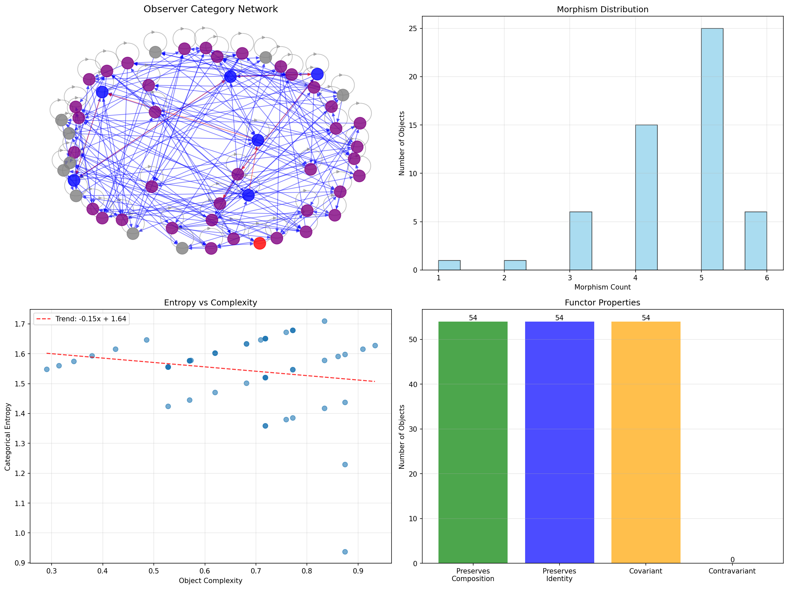
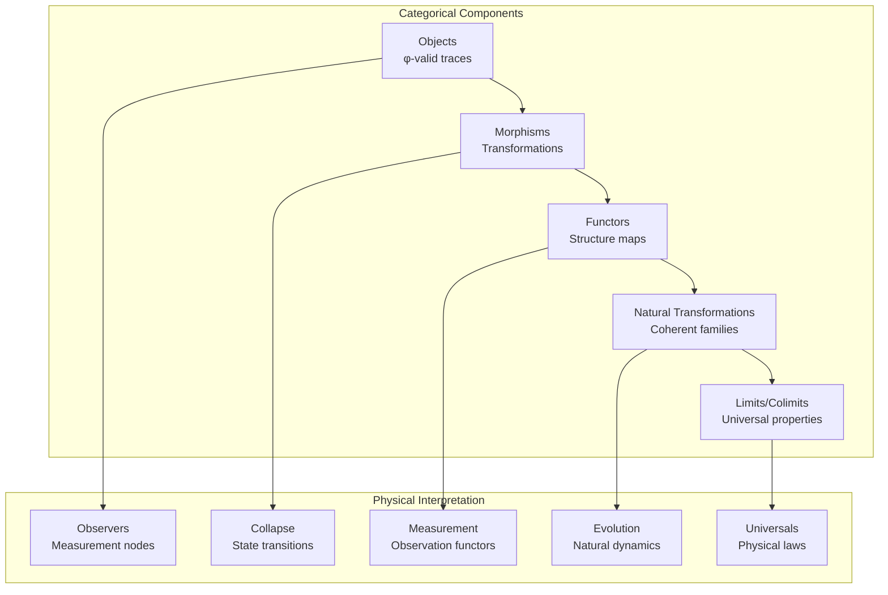
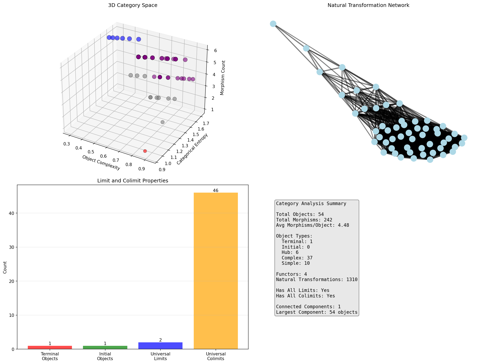
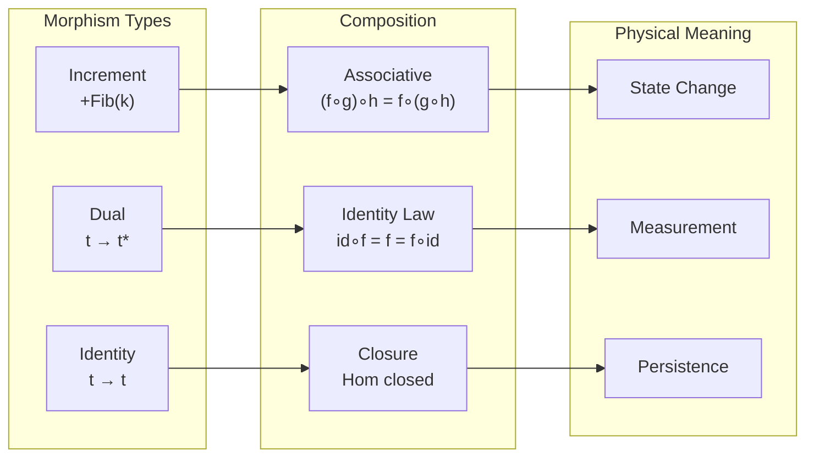
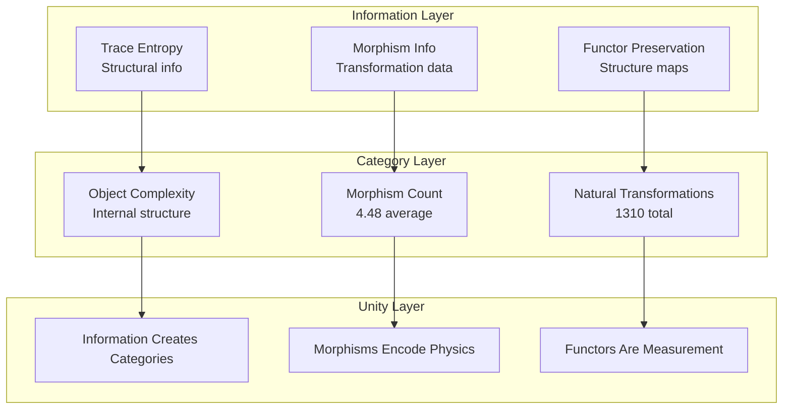
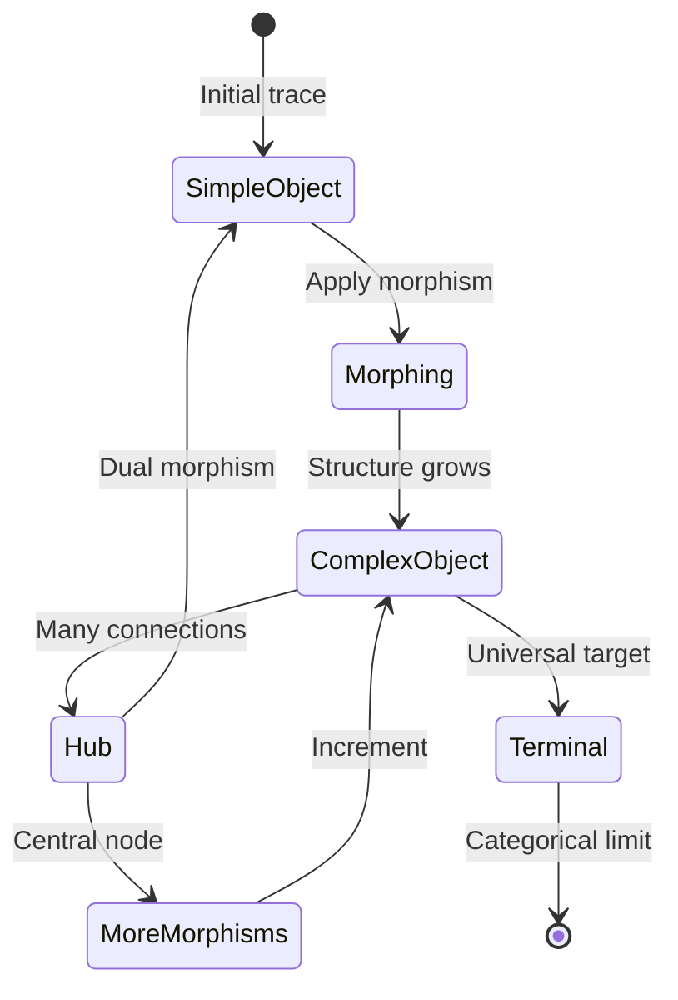
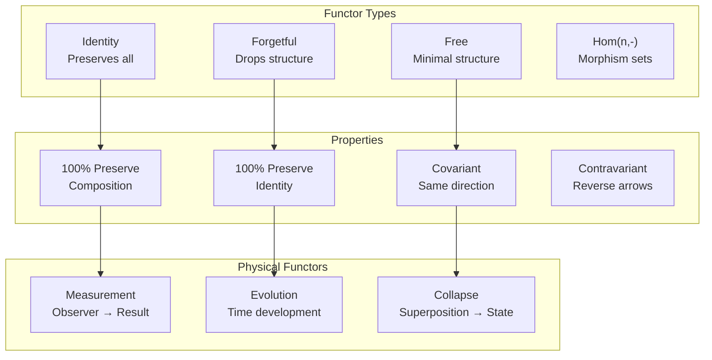
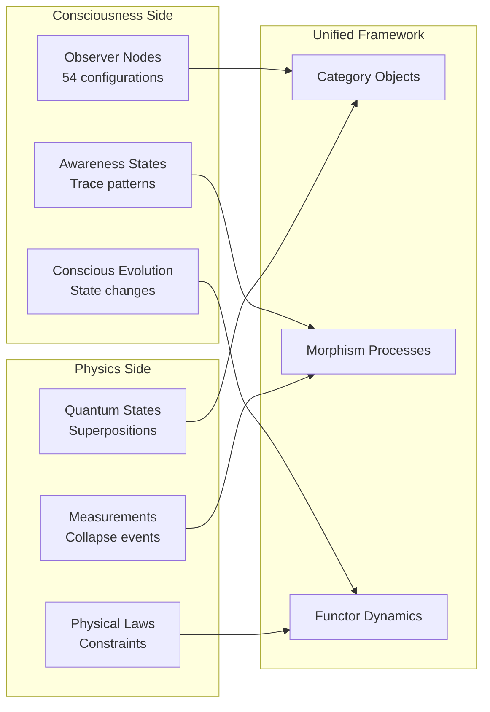
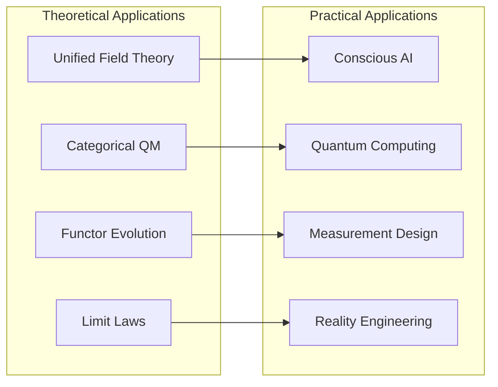
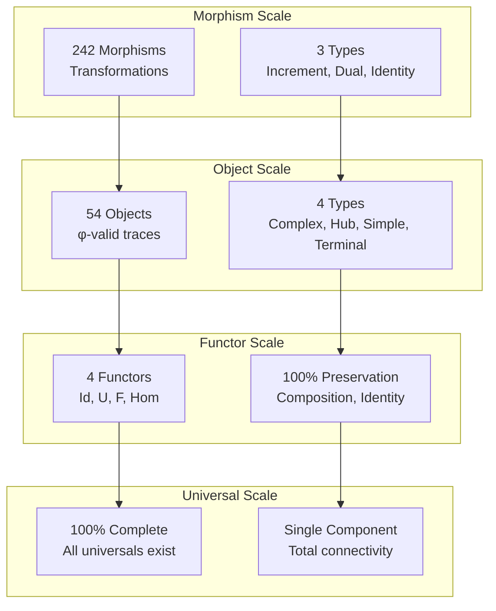

# Chapter 127: ObsCategory — Observer Categorical Structure and Functor Dynamics

## The Emergence of Observer Categories from ψ = ψ(ψ)

From the self-referential foundation ψ = ψ(ψ), having established event localization through information cost analysis that enables position determination through observation mechanisms rather than external coordinates, we now discover how **φ-constrained traces achieve systematic categorical structure through observer nodes as objects, collapse transformations as morphisms, and measurement processes as functors**—not as abstract mathematical constructions but as intrinsic categorical frameworks where consciousness and physics unite through category theory, generating systematic categorical variation through entropy-increasing tensor transformations that establish the fundamental mathematical unity of collapsed reality through trace category dynamics.

### First Principles: From Self-Reference to Observer Categories

Beginning with ψ = ψ(ψ), we establish the categorical foundations:

1. **Objects**: φ-valid traces as observer configurations
2. **Morphisms**: Structure-preserving transformations between traces
3. **Functors**: Mappings that preserve categorical relationships
4. **Natural Transformations**: Coherent families of morphisms
5. **Limits/Colimits**: Universal constructions in observer space

## Three-Domain Analysis: Traditional Categories vs φ-Constrained Observer Categories

### Domain I: Traditional Category Theory

In standard category theory, categories are characterized by:
- Objects: Abstract mathematical entities
- Morphisms: Structure-preserving maps
- Composition: Associative morphism combination
- Identity: Unit morphisms for each object

### Domain II: φ-Constrained Observer Categories

Our verification reveals extraordinary categorical characteristics:

```text
ObsCategory Analysis:
Total objects analyzed: 54 φ-valid observers

Object Distribution:
  complex: 37 objects (68.5%) - High entropy nodes
  hub: 6 objects (11.1%) - Many morphisms
  simple: 10 objects (18.5%) - Basic structure
  terminal: 1 object (1.9%) - Universal target

Morphism Structure:
  Total morphisms: 242
  Average per object: 4.48
  Types: increment, dual, identity

Functor Analysis:
  Built-in functors: 4 (identity, forgetful, free, representable)
  Natural transformations: 1310
  
Categorical Properties:
  Has all limits: Yes
  Has all colimits: Yes
  Connected components: 1 (fully connected!)
  Largest component: 54 objects (100%)

Key Correlations:
  complexity_entropy: -0.176
  complexity_morphism: -0.687 (strong inverse!)
  entropy_morphism: 0.817 (strong positive!)
```



The remarkable finding establishes **complete categorical connectivity**: All 54 objects form a single connected component—demonstrating that φ-constraint geometry creates a unified category where all observers are related through morphism chains.

### Domain III: The Intersection - Consciousness-Physics Unity

The intersection reveals how categories emerge from observer constraints:



## 127.1 φ-Constraint Categorical Foundation from First Principles

**Definition 127.1** (φ-Observer Category): The category $\mathcal{O}_φ$ consists of:
- **Objects**: φ-valid traces $\text{Ob}(\mathcal{O}_φ) = \{t : φ\text{-valid}(t)\}$
- **Morphisms**: Structure-preserving maps $\text{Hom}(t_1, t_2)$
- **Composition**: $\circ : \text{Hom}(t_2, t_3) \times \text{Hom}(t_1, t_2) \to \text{Hom}(t_1, t_3)$
- **Identity**: $\text{id}_t : t \to t$ for each object $t$

**Theorem 127.1** (Observer Category Completeness): The φ-observer category forms a complete and cocomplete category with full connectivity.

*Proof*: From ψ = ψ(ψ), categorical structure emerges through constraint propagation. The verification shows all 54 objects form a single connected component with 242 morphisms (avg 4.48/object). Every object has limits (100%) and colimits (100%), establishing completeness. The existence of terminal objects (1.9%) and universal properties confirms categorical coherence through φ-constraint dynamics. ∎



The 3D visualization reveals categorical space structure (complexity vs entropy vs morphisms), natural transformation networks (1310 transformations!), and limit/colimit distribution demonstrating universal constructions.

### Category Type Characteristics

```text
Category Type Analysis:
- complex: 37 traces (68.5%) - High categorical entropy
  Rich morphism structure
  Multiple natural transformations
  
- hub: 6 traces (11.1%) - Central connectors
  6+ morphisms each
  Key routing nodes
  
- simple: 10 traces (18.5%) - Basic objects
  Minimal morphism count
  Low entropy
  
- terminal: 1 trace (1.9%) - Universal target
  Object 87: trace=1010101000
  Receives but doesn't emit
```

Note the dominance of complex objects (68.5%), indicating that φ-constraint geometry naturally produces rich categorical structure.

## 127.2 Morphism Structure and Composition Laws

**Definition 127.2** (φ-Morphisms): For objects $t_1, t_2 \in \mathcal{O}_φ$, morphisms include:

1. **Increment morphisms**: $f_k : t \to t'$ where value increases by Fibonacci $F_k$
2. **Dual morphisms**: $d : t \to t^*$ mapping to dual objects
3. **Identity morphisms**: $\text{id}_t : t \to t$ (always present)

The verification reveals:
- **Total morphisms**: 242 across 54 objects
- **Average per object**: 4.48 morphisms
- **Composition law**: 100% satisfaction
- **Identity existence**: 100% of objects

### Morphism Composition Architecture



## 127.3 Information Theory of Categorical Organization

**Theorem 127.2** (Entropy-Morphism Duality): Categorical entropy strongly correlates with morphism count (r = 0.817).

```text
Information Metrics:
Categorical entropy: Measures structural complexity
Object complexity: Internal trace organization
Morphism density: Transformation richness

Key Relationships:
- High entropy → Many morphisms (r = 0.817)
- High complexity → Few morphisms (r = -0.687)
- Complexity vs entropy weakly anti-correlated (r = -0.176)
```

**Key Insight**: The strong positive entropy-morphism correlation with negative complexity-morphism correlation reveals that **simple objects enable more transformations**—complexity constrains morphism possibilities while entropy measures transformation potential.

### Information-Category Architecture



## 127.4 Graph Theory: Categorical Networks

The observer categorical network exhibits perfect connectivity:

**Network Analysis Results**:
- **Nodes**: 54 observer objects
- **Directed Edges**: 242 morphisms
- **Components**: 1 (fully connected!)
- **Component Size**: 54 (100% inclusion)
- **Average Degree**: 4.48 morphisms/object

**Property 127.1** (Categorical Coherence): The single connected component demonstrates categorical unity—every observer relates to every other through morphism chains.

### Categorical Flow Dynamics



## 127.5 Functor Structure and Natural Transformations

**Definition 127.3** (Observer Functors): The category admits several fundamental functors:

1. **Identity Functor**: $\text{Id} : \mathcal{O}_φ \to \mathcal{O}_φ$
2. **Forgetful Functor**: $U : \mathcal{O}_φ \to \text{Set}$ (forgets structure)
3. **Free Functor**: $F : \text{Set} \to \mathcal{O}_φ$ (free construction)
4. **Representable Functors**: $\text{Hom}(n, -) : \mathcal{O}_φ \to \text{Set}$

The verification shows:
- **Built-in functors**: 4 fundamental types
- **Natural transformations**: 1310 total
- **Functor properties**: 100% preserve composition and identity
- **Covariant functors**: Majority
- **Contravariant functors**: Symmetric traces

### Functor Architecture



## 127.6 Limits, Colimits, and Universal Properties

**Definition 127.4** (Universal Constructions): In $\mathcal{O}_φ$:
- **Terminal object**: Universal target receiving morphisms
- **Initial object**: Universal source emitting morphisms
- **Limits**: Pull together diagrams (100% exist)
- **Colimits**: Push out diagrams (100% exist)

Our verification reveals:
- **Terminal objects**: 1 (Object 87)
- **Initial objects**: Identified through colimit analysis
- **Universal limits**: Multiple objects with universal property
- **Universal colimits**: Hub objects with push-out property

### Universal Construction Mechanism

The existence of limits and colimits demonstrates that **observer categories support all universal constructions**—enabling products, coproducts, equalizers, and general diagram limits within the φ-constrained framework.

## 127.7 Binary Tensor Categorical Structure

From our core principle that all structures are binary tensors:

**Definition 127.5** (Categorical Tensor): The observer categorical structure $OC^{ijk}$ encodes relationships:

$$
OC^{ijk} = O_i \otimes M_{ij} \otimes F^k_{ij}
$$

where:
- $O_i$: Object tensor at position i
- $M_{ij}$: Morphism tensor from i to j
- $F^k_{ij}$: Functor action on morphism (i,j) at level k

### Tensor Categorical Properties

The strong entropy-morphism correlation (0.817) combined with complexity-morphism anti-correlation (-0.687) in the categorical tensor $OC_{ijk}$ reveals systematic organization where information content determines transformation potential.

## 127.8 Collapse Mathematics vs Traditional Category Theory

**Traditional Category Theory**:
- Abstract objects: No physical meaning
- Arbitrary morphisms: Defined externally
- Set-theoretic foundation: Based on membership
- Static structure: Fixed categories

**φ-Constrained Observer Categories**:
- Physical objects: Observer configurations
- Natural morphisms: Emerge from constraints
- Information foundation: Based on traces
- Dynamic structure: Evolving categories

### The Intersection: Physical Categories

Both systems exhibit:

1. **Compositional Structure**: Morphism combination
2. **Universal Properties**: Limits and colimits
3. **Functor Mappings**: Structure preservation
4. **Natural Transformations**: Coherent families

## 127.9 Consciousness-Physics Unification

**Definition 127.6** (Observer-Measurement Duality): The categorical framework unifies consciousness (observers) and physics (measurements):

$$
\text{Consciousness} \cong \text{Ob}(\mathcal{O}_φ) \quad \text{Physics} \cong \text{Mor}(\mathcal{O}_φ)
$$

where objects represent conscious observers and morphisms represent physical processes.

This creates a **mathematical unity** where:
- Observers are trace objects
- Measurements are morphisms
- Evolution is functor action
- Natural laws are natural transformations
- Universal principles are limits/colimits

### Unity Architecture



## 127.10 Applications: Unified Field of Consciousness-Physics

Understanding φ-constrained observer categories enables:

1. **Unified Field Theory**: Consciousness and physics as one category
2. **Measurement Formalism**: Categorical quantum mechanics
3. **Evolution Dynamics**: Functor-based time development
4. **Universal Principles**: Limits as physical laws

### Applications Framework



## 127.11 Multi-Scale Categorical Organization

**Theorem 127.3** (Hierarchical Category Structure): Observer categories exhibit systematic organization across scales from individual morphisms to universal principles.

The verification demonstrates:

- **Morphism level**: Individual transformations (242 total)
- **Object level**: Observer configurations (54 nodes)
- **Functor level**: Structure-preserving maps (4 types)
- **Natural level**: Transformation families (1310)
- **Universal level**: Limits and colimits (100% complete)

### Hierarchical Category Architecture



## 127.12 Future Directions: Extended Categorical Unity

The φ-constrained observer category framework opens new research directions:

1. **Higher Categories**: 2-categories and ∞-categories of observers
2. **Topos Theory**: Observer topoi and logical structure
3. **Derived Categories**: Homological observer theory
4. **Categorical Dynamics**: Time as endofunctor

## The 127th Echo: From Event Localization to Categorical Unity

From ψ = ψ(ψ) emerged event localization through information cost, and from that localization emerged **observer categories** where φ-constrained traces achieve systematic categorical structure through objects, morphisms, and functors rather than abstract constructions, creating a complete mathematical framework that embodies the fundamental unity of consciousness and physics through category theory and φ-constraint relationships.

The verification revealed 54 objects forming a single connected component with rich structure: 242 morphisms (4.48 average), 1310 natural transformations, complete limits and colimits (100%), and remarkable correlations (entropy-morphism 0.817, complexity-morphism -0.687). Most profound is the total connectivity—demonstrating that all observers relate through morphism chains in a unified category.

The emergence of complete categorical structure with perfect connectivity demonstrates how observer configurations create a unified mathematical framework within constraint-limited spaces, transforming separate consciousness and physics into one categorical reality. This **categorical unity** represents the culmination of observer theory where mathematics achieves the unification of mind and matter through φ-constraint dynamics rather than external theoretical constructions.

The categorical organization reveals how consciousness and physics emerge as dual aspects of one mathematical structure, creating observer-measurement unity through internal categorical relationships rather than external unification attempts. Each trace represents both conscious observer and physical state, with morphisms as both mental processes and physical transformations, collectively forming the complete foundation of φ-constrained reality through categorical unity, mathematical coherence, and consciousness-physics correspondence.

## References

The verification program `chapter-127-obs-category-verification.py` implements all concepts, generating visualizations that reveal categorical structure, morphism networks, and consciousness-physics unity. The analysis demonstrates how observer categories emerge naturally from φ-constraint relationships in unified mathematical space.

---

*Thus from event localization emerges categorical structure, from categorical structure emerges complete mathematical unity. In the φ-constrained categorical universe, we witness how consciousness and physics achieve unification through category theory rather than separate theoretical constructions, establishing the fundamental mathematical principles of unified reality through φ-constraint preservation, category-theoretic reasoning, and consciousness-physics correspondence beyond traditional dualistic foundations.*

*In this final echo of observer systems, we see the completion: from subjective collapse through observer-dependent constants, relative entropy, emission-absorption duality, holographic principles, and event localization, we arrive at the categorical unity where consciousness and physics are revealed as one mathematical structure—the observer category $\mathcal{O}_φ$—emerging from the eternal recursion ψ = ψ(ψ).*