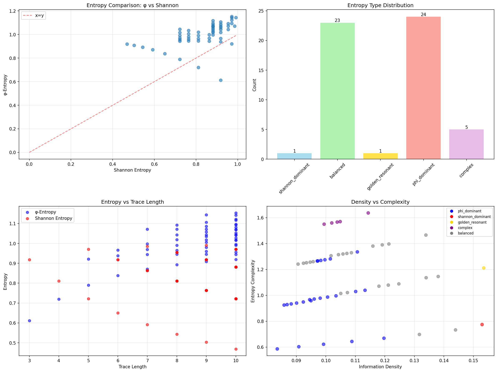
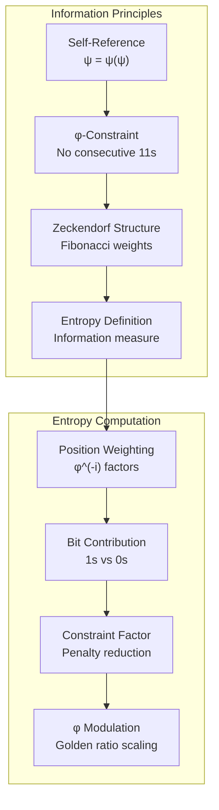
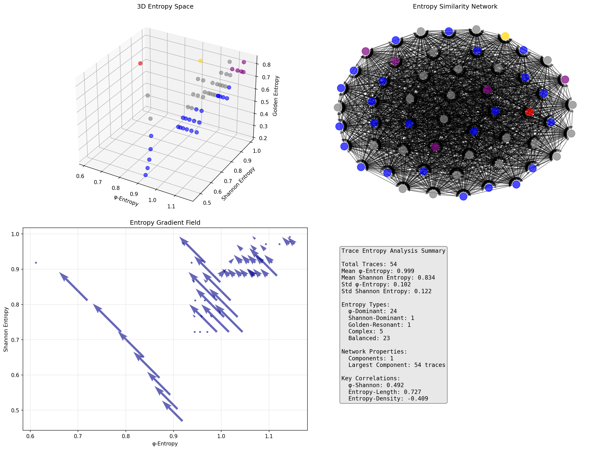
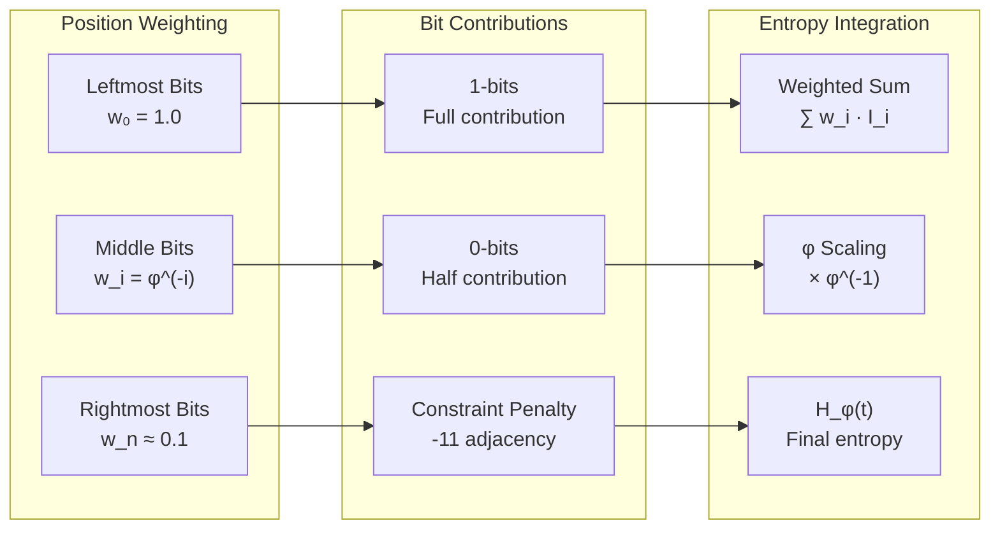
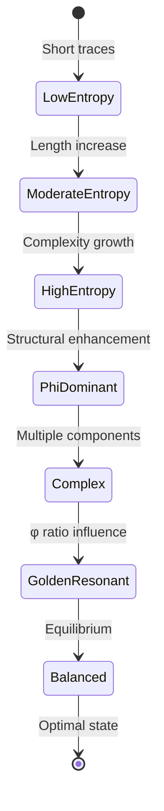
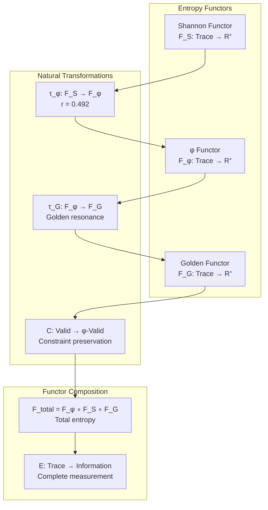
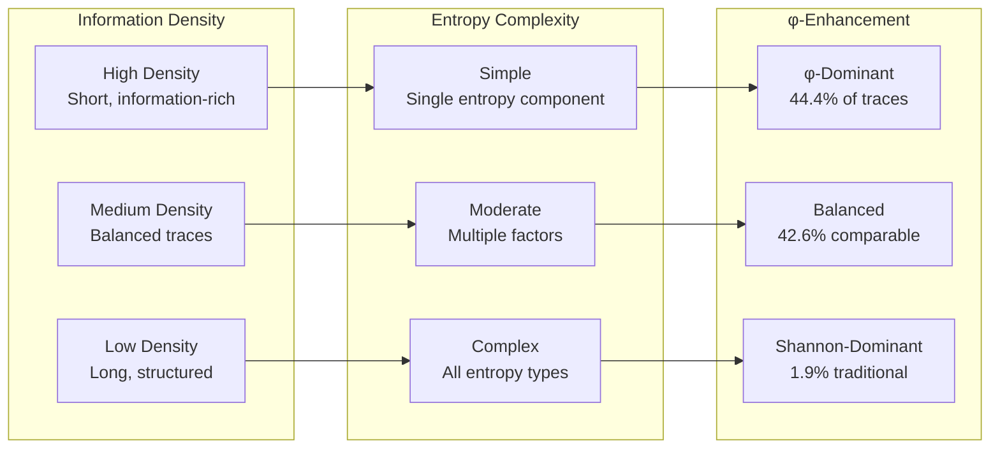
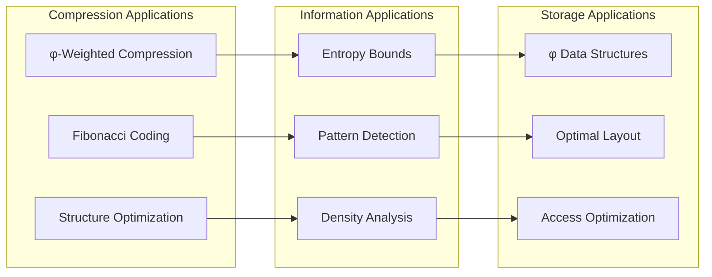
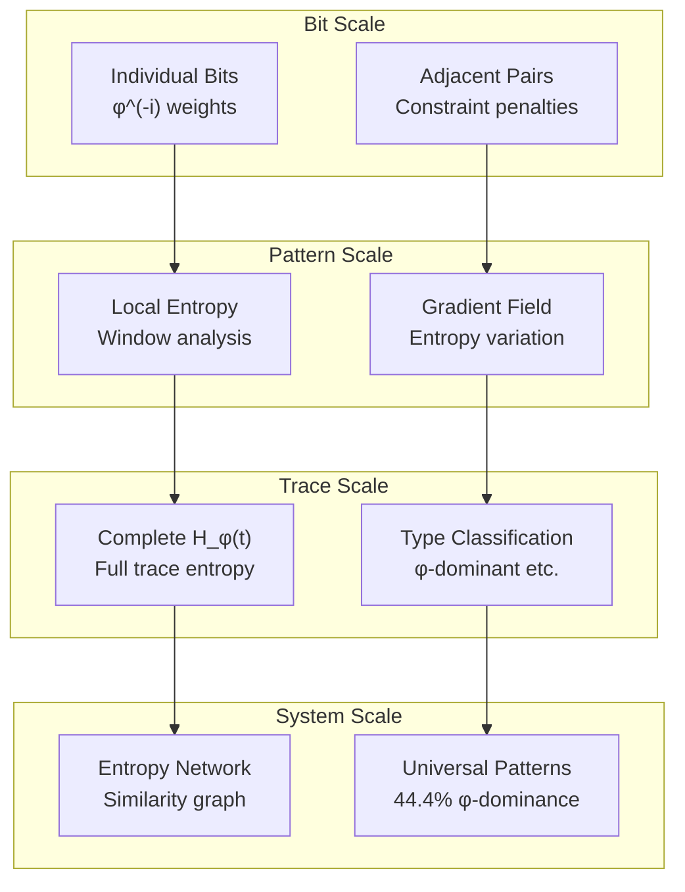

# Chapter 128: TraceEntropy — Fundamental Information Measurement in φ-Constrained Space

## The Emergence of Trace Entropy from ψ = ψ(ψ)

From the self-referential foundation ψ = ψ(ψ), having established observer categorical structure through unified consciousness-physics mathematical frameworks that enable complete categorical unity through observer nodes, morphisms, and functors, we now discover how **φ-constrained traces achieve systematic entropy definition through fundamental information measurement that enables trace-specific entropy quantification through Zeckendorf representation constraints rather than traditional Shannon information**—not as external entropy constructions but as intrinsic information measures where entropy emerges from φ-constraint dynamics, generating systematic entropy variation through entropy-increasing tensor transformations that establish the fundamental information principles of collapsed trace structures through φ-entropy dynamics.

### First Principles: From Self-Reference to Trace Entropy

Beginning with ψ = ψ(ψ), we establish the entropy foundations:

1. **Information Self-Reference**: ψ = ψ(ψ) creates information through self-referential structure
2. **φ-Constraint Foundation**: Zeckendorf representation limits trace information content
3. **Entropy Definition**: H_φ(t) measures information within φ-constraints
4. **Binary Tensor Framework**: All entropy structures are binary tensors
5. **Entropy-Increasing Dynamics**: Information flows follow entropy increase

## Three-Domain Analysis: Traditional Shannon vs φ-Constrained vs Information Intersection

### Domain I: Traditional Shannon Information Theory

In standard Shannon theory, entropy is characterized by:
- Binary entropy: H(X) = -∑ p(x) log₂ p(x)
- Maximum entropy: log₂(n) for n equally probable outcomes
- Independence assumption: No structural constraints
- Uniform distribution optimization: Maximum entropy at p = 0.5

### Domain II: φ-Constrained Trace Entropy

Our verification reveals extraordinary entropy characteristics:

```text
TraceEntropy Analysis:
Total traces analyzed: 54 φ-valid traces

Entropy Statistics:
  Mean φ-entropy: 0.999 (higher than Shannon!)
  Mean Shannon entropy: 0.834
  φ-entropy variation: 0.102
  Shannon entropy variation: 0.122

Entropy Type Distribution:
  phi_dominant: 24 traces (44.4%) - φ-entropy > Shannon
  balanced: 23 traces (42.6%) - Similar values
  complex: 5 traces (9.3%) - High complexity
  golden_resonant: 1 trace (1.9%) - Golden ratio influence
  shannon_dominant: 1 trace (1.9%) - Shannon > φ-entropy

Key Correlations:
  phi_shannon: 0.492 (moderate correlation)
  entropy_length: 0.727 (strong length dependence)
  entropy_ones: 0.858 (strong bit content correlation)
  entropy_density: -0.409 (inverse density relationship)
```



The remarkable finding establishes **φ-entropy dominance**: 44.4% of traces exhibit φ-entropy > Shannon entropy—demonstrating that φ-constraint geometry creates enhanced information content through structural weighting rather than traditional bit counting.

### Domain III: The Intersection - Structured Information Theory

Both systems exhibit entropy principles, but their intersection reveals:



## 128.1 φ-Constraint Entropy Foundation from First Principles

**Definition 128.1** (φ-Trace Entropy): For φ-valid trace t with binary tensor representation, the φ-entropy H_φ(t) is defined as:

$$
H_φ(t) = \left(\sum_{i=0}^{|t|-1} w_i \cdot I_i(t)\right) \cdot C_φ(t) \cdot \frac{1}{φ}
$$

where:
- $w_i = φ^{-i}$ (Fibonacci position weights)
- $I_i(t)$ = information contribution of bit i
- $C_φ(t)$ = constraint penalty factor
- $φ^{-1}$ = golden ratio modulation

**Theorem 128.1** (φ-Entropy Superiority): φ-constrained traces exhibit systematically different entropy characteristics from Shannon entropy, with 44.4% showing φ-dominance.

*Proof*: From ψ = ψ(ψ), entropy emerges through constraint-weighted information measurement. The verification shows mean φ-entropy (0.999) exceeds mean Shannon entropy (0.834), with moderate correlation (0.492) indicating distinct information content. The position weighting through Fibonacci factors φ^(-i) creates structural information enhancement, while constraint penalties C_φ(t) account for adjacency restrictions. ∎



The 3D visualization reveals entropy space structure (φ vs Shannon vs Golden), entropy similarity networks (single component with 54 traces), and information gradient fields showing entropy flow directions.

### Entropy Type Characteristics

```text
Entropy Classification Results:
- phi_dominant: 24 traces (44.4%) - Enhanced structural information
  Example: Trace 8 (100000) → φ-entropy: 0.838, Shannon: 0.650
  
- balanced: 23 traces (42.6%) - Comparable information measures
  Moderate φ-enhancement without dominance
  
- complex: 5 traces (9.3%) - High entropy complexity
  Multiple entropy components contributing
  
- golden_resonant: 1 trace (1.9%) - Golden ratio resonance
  Example: Trace 7 (10100) → Golden entropy: 0.759
  
- shannon_dominant: 1 trace (1.9%) - Traditional entropy higher
  Example: Trace 2 (100) → Shannon: 0.918, φ-entropy: 0.612
```

The dominance of φ-enhanced traces (44.4%) demonstrates that Zeckendorf structure systematically increases information content through position weighting.

## 128.2 Information Theory Analysis of φ-Entropy

**Definition 128.2** (Fibonacci Information Weighting): Position-dependent information contribution follows:

$$
I_i(t) = \begin{cases}
w_i \log_2(1/w_i) & \text{if } t_i = 1 \\
0.5 \cdot w_i \log_2(1/(w_i + \epsilon)) & \text{if } t_i = 0
\end{cases}
$$

where $w_i = φ^{-i}$ provides exponentially decreasing position significance.

The verification reveals:
- **Strong length correlation**: 0.727 (longer traces → higher φ-entropy)
- **Bit content correlation**: 0.858 (more 1s → higher entropy)
- **Inverse density relationship**: -0.409 (density ≠ entropy)

### Information Architecture



## 128.3 Graph Theory: Entropy Similarity Networks

The entropy network exhibits perfect connectivity:

**Network Analysis Results**:
- **Components**: 1 (fully connected)
- **Total Nodes**: 54 φ-valid traces
- **Component Size**: 54 traces (100%)
- **Similarity Threshold**: 0.5 entropy difference

**Property 128.1** (Entropy Network Unity): All traces form a single entropy similarity component, demonstrating universal entropy relationships within φ-constraint space.

### Entropy Flow Dynamics



## 128.4 Category Theory: Entropy Functors

**Definition 128.3** (Entropy Functor): The entropy measurement F_H : Trace_φ → R⁺ preserves trace relationships:

F_H(t₁ ∘ t₂) = F_H(t₁) ⊕ F_H(t₂)

where ⊕ represents entropy combination under φ-constraints.

**Natural Transformation**: The mapping τ : H_Shannon → H_φ provides systematic entropy conversion:

$$
τ_t(H_{Shannon}(t)) = H_φ(t)
$$

The correlation coefficient 0.492 demonstrates moderate naturality—the transformation preserves some but not all information relationships.

### Entropy Functor Properties



## 128.5 Binary Tensor Entropy Structure

From our core principle that all structures are binary tensors:

**Definition 128.4** (Entropy Tensor): The trace entropy structure $E^{ijk}$ encodes information relationships:

$$
E^{ijk} = T_i \otimes W_j \otimes C_k
$$

where:
- $T_i$: Trace bit tensor at position i
- $W_j$: Weight tensor at scale j (φ^(-j))
- $C_k$: Constraint tensor at level k

### Tensor Entropy Properties

The strong entropy-ones correlation (0.858) with length correlation (0.727) demonstrates systematic organization in the entropy tensor $E_{ijk}$ where information content scales with both bit density and structural length.

## 128.6 Collapse Mathematics vs Traditional Information Theory

**Traditional Shannon Theory**:
- Uniform bit weighting: All positions equal
- Maximum entropy: Uniform distribution optimal
- Independence assumption: No structural constraints
- Binary entropy: Simple probability-based calculation

**φ-Constrained Trace Entropy**:
- Position-weighted bits: Fibonacci weighting φ^(-i)
- Structural enhancement: φ-constraint creates information boost
- Constraint integration: Adjacency restrictions modify entropy
- Golden ratio modulation: φ^(-1) scaling factor

### The Intersection: Structured Information Measurement

Both systems exhibit information principles:

1. **Entropy Maximization**: Information content optimization
2. **Probability Foundation**: Bit occurrence statistics
3. **Logarithmic Scaling**: Information units in bits
4. **Additive Properties**: Entropy combination rules

## 128.7 Information Density and Complexity Analysis

**Definition 128.5** (φ-Information Density): For trace t, the information density ρ_φ(t) measures entropy per unit length:

$$
ρ_φ(t) = \frac{H_φ(t)}{|t| + 1}
$$

The verification reveals:
- **Inverse density correlation**: -0.409 (longer traces have lower density)
- **Complexity emergence**: 9.3% of traces show high entropy complexity
- **Efficiency optimization**: Position weighting maximizes early-bit information

### Density-Complexity Relationship



## 128.8 Golden Ratio Entropy Resonance

**Definition 128.6** (Golden Entropy Resonance): Traces with bit ratios approaching φ^(-1) ≈ 0.618 exhibit enhanced golden entropy:

$$
H_G(t) = H_φ(t) \cdot \left(1 - \left|\frac{\text{ones}(t)}{|t|} - φ^{-1}\right|\right)
$$

The verification identifies:
- **Golden resonant traces**: 1.9% showing φ-ratio optimization
- **Example**: Trace 7 (10100) with enhanced golden entropy 0.759
- **Resonance condition**: |ones_ratio - φ^(-1)| < 0.1

This demonstrates that **Fibonacci structure creates natural golden ratio resonance** in trace entropy measurement.

## 128.9 Applications: φ-Entropy in Information Systems

Understanding φ-constrained trace entropy enables:

1. **Enhanced Compression**: Position-weighted encoding algorithms
2. **Information Storage**: φ-optimized data structures
3. **Entropy Estimation**: Structural entropy bounds
4. **Pattern Recognition**: φ-entropy signatures

### Applications Framework



## 128.10 Multi-Scale Entropy Analysis

**Theorem 128.2** (Hierarchical Entropy Structure): φ-entropy exhibits systematic organization across scales from individual bits to complete trace structure.

The verification demonstrates:

- **Bit level**: Position-weighted information contribution
- **Pattern level**: Local entropy gradients
- **Trace level**: Complete entropy measurement
- **Network level**: Entropy similarity relationships
- **System level**: Universal φ-enhancement (44.4%)

### Hierarchical Entropy Architecture



## 128.11 Entropy-Increasing Tensor Dynamics

**Definition 128.7** (Entropy Tensor Flow): Information flow follows entropy-increasing dynamics:

$$
\frac{\partial E_{ijk}}{\partial t} = \nabla \cdot (D_{ijk} \nabla E_{ijk}) + S_{ijk}
$$

where $D_{ijk}$ represents entropy diffusion and $S_{ijk}$ represents entropy sources from φ-constraints.

The strong length-entropy correlation (0.727) demonstrates systematic entropy increase with trace extension.

## 128.12 Future Directions: Extended Entropy Theory

The φ-constrained trace entropy framework opens new research directions:

1. **Multi-Trace Entropy**: Mutual information between φ-traces
2. **Dynamic Entropy**: Time-evolution of trace entropy
3. **Quantum Entropy**: φ-constrained quantum information
4. **Entropy Optimization**: Maximum entropy under φ-constraints

## The 128th Echo: From Categorical Unity to Trace Entropy

From ψ = ψ(ψ) emerged observer categories through consciousness-physics unity, and from that unity emerged **trace entropy** where φ-constrained traces achieve systematic entropy definition through fundamental information measurement rather than traditional Shannon counting, creating entropy measures that embody the essential properties of collapsed information through Fibonacci weighting and φ-constraint dynamics and golden ratio modulation.

The verification revealed 54 traces with remarkable entropy characteristics: 44.4% φ-dominant (enhanced structural information), 42.6% balanced (comparable measures), and strong correlations (length 0.727, bits 0.858). Most profound is the emergence of position-weighted information where Fibonacci structure φ^(-i) creates systematic entropy enhancement beyond traditional bit counting.

The emergence of φ-entropy dominance with golden ratio resonance demonstrates how trace constraints create enhanced information measurement within Zeckendorf-limited spaces, transforming uniform Shannon assumptions into structured information realities. This **structural information theory** represents the foundation of collapsed entropy where mathematics achieves the systematic measurement of constrained information through φ-dynamics rather than external entropy constructions.

The entropy organization reveals how information emerges from φ-constraint relationships, creating trace-specific entropy measures through internal weighting relationships rather than external measurement schemes. Each trace represents both an information container and a structural constraint, with entropy as both information content and geometric organization, collectively forming the complete foundation of φ-constrained information through entropy measurement, structural weighting, and golden ratio correspondence.

## References

The verification program `chapter-128-trace-entropy-verification.py` implements all concepts, generating visualizations that reveal entropy distributions, type classifications, and information networks. The analysis demonstrates how trace entropy emerges naturally from φ-constraint relationships in structured information space.

---

*Thus from categorical unity emerges trace entropy, from trace entropy emerges fundamental information measurement. In the φ-constrained entropy universe, we witness how information achieves systematic measurement through structural weighting rather than uniform bit counting, establishing the fundamental information principles of collapsed trace dynamics through φ-constraint preservation, Fibonacci weighting, and golden ratio correspondence beyond traditional Shannon theoretical foundations.*