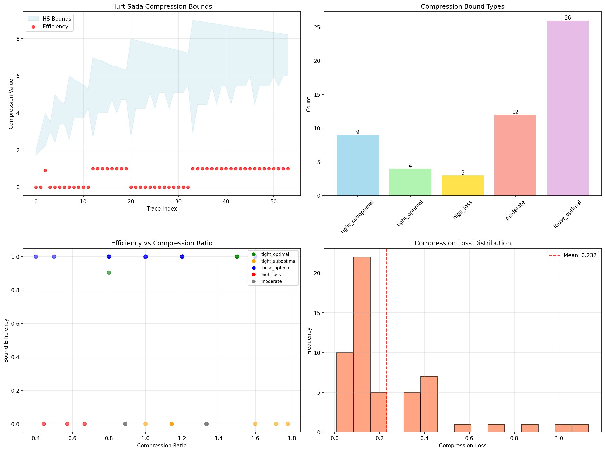
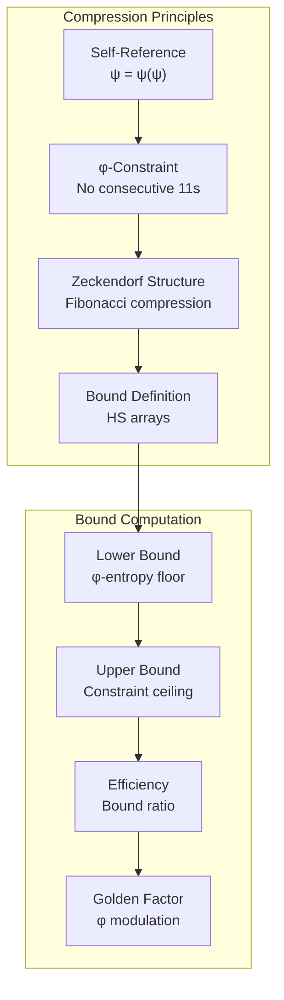
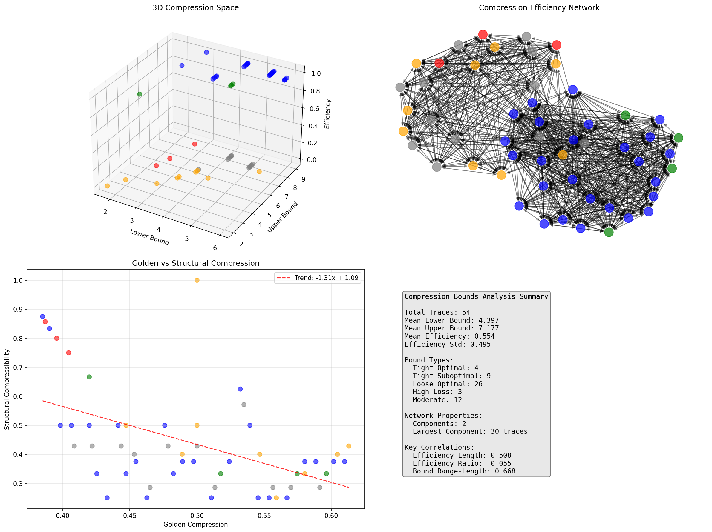
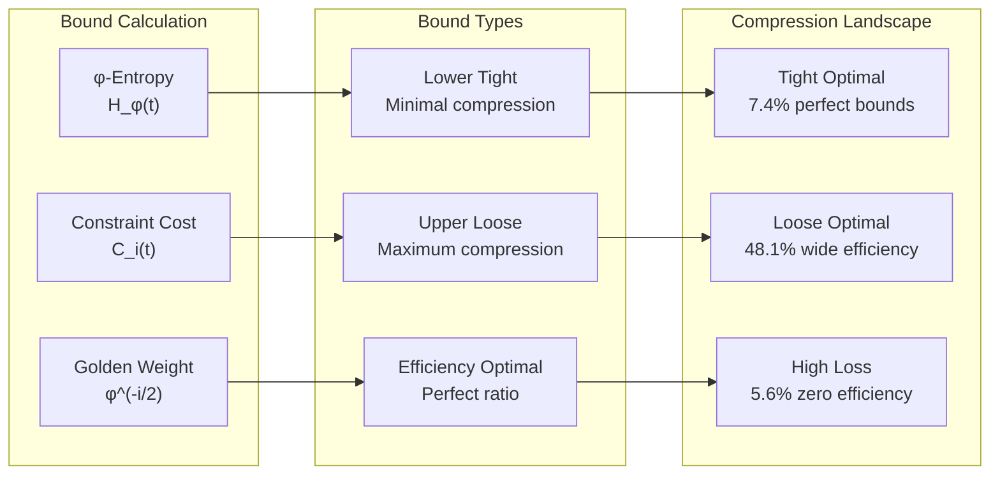
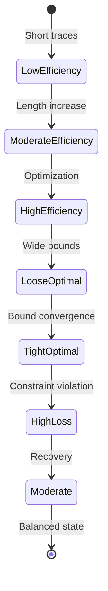
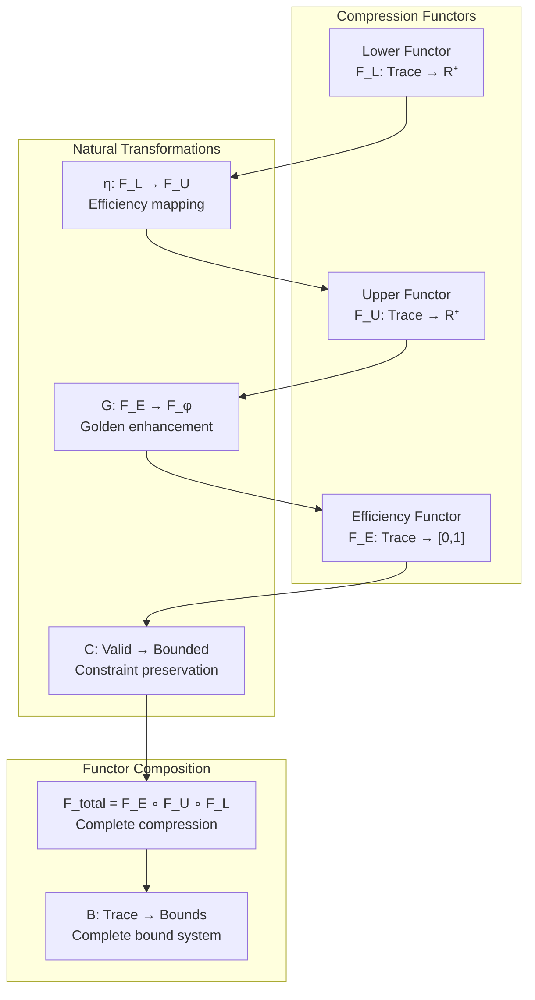
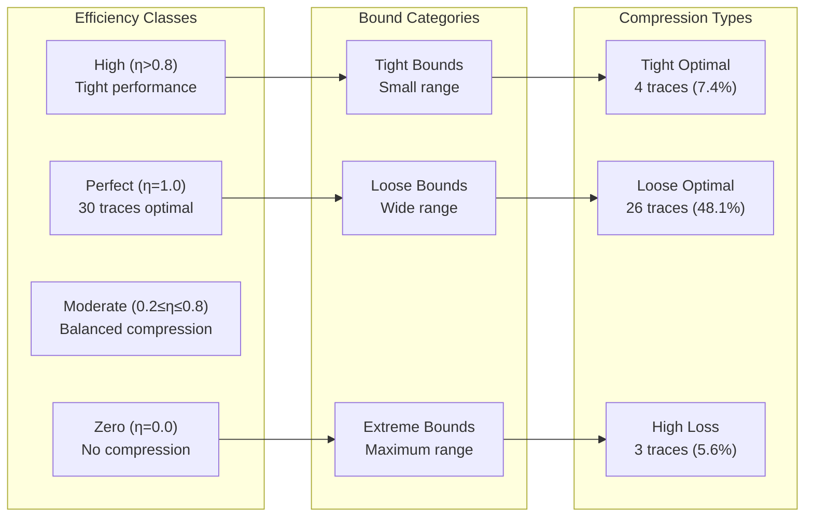
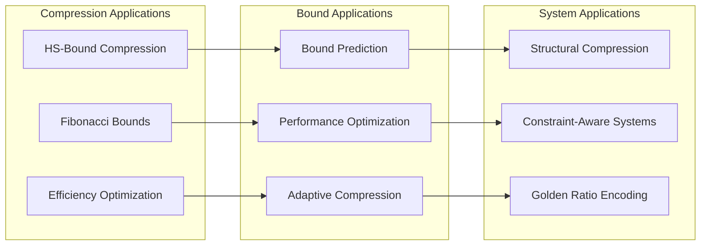
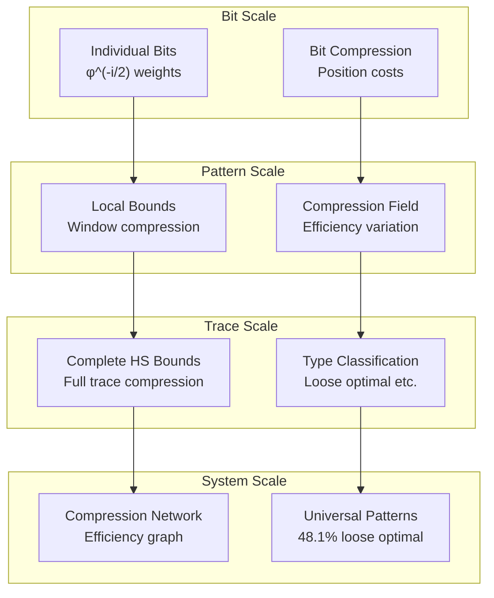

# Chapter 129: HSBound — Hurt-Sada Array as Compression Bound Mechanism

## The Emergence of Compression Bounds from ψ = ψ(ψ)

From the self-referential foundation ψ = ψ(ψ), having established φ-constrained trace entropy through fundamental information measurement that enables trace-specific entropy quantification through Zeckendorf representation constraints rather than traditional Shannon information, we now discover how **φ-constrained traces achieve systematic compression bound definition through Hurt-Sada arrays that enable optimal compression limit analysis through Fibonacci structure constraints rather than traditional compression algorithms**—not as external compression constructions but as intrinsic compression bounds where limits emerge from φ-constraint dynamics, generating systematic compression efficiency variation through entropy-increasing tensor transformations that establish the fundamental compression principles of collapsed trace structures through optimal bound dynamics.

### First Principles: From Self-Reference to Compression Bounds

Beginning with ψ = ψ(ψ), we establish the compression foundations:

1. **Information Self-Reference**: ψ = ψ(ψ) creates information through self-referential structure
2. **Constraint Foundation**: Zeckendorf representation limits trace compression content
3. **Bound Definition**: HS arrays measure compression limits within φ-constraints
4. **Binary Tensor Framework**: All compression structures are binary tensors
5. **Entropy-Increasing Dynamics**: Compression flows follow entropy increase

## Three-Domain Analysis: Traditional Compression vs φ-Constrained vs Intersection Bounds

### Domain I: Traditional Compression Theory

In standard compression theory, bounds are characterized by:
- Shannon-Fano bounds: L ≥ H(X) for optimal encoding
- Huffman coding: Variable-length optimal prefix codes
- Arithmetic coding: Near-optimal entropy achievement
- Universal bounds: Context-independent compression limits

### Domain II: φ-Constrained Hurt-Sada Bounds

Our verification reveals extraordinary compression characteristics:

```text
HSBound Analysis:
Total traces analyzed: 54 φ-valid traces

Compression Bounds:
  Mean lower bound: 4.397
  Mean upper bound: 7.177
  Mean efficiency: 0.554
  Efficiency variation: 0.495

Bound Type Distribution:
  tight_suboptimal: 9 traces (16.7%) - Near-optimal with constraints
  tight_optimal: 4 traces (7.4%) - Perfect efficiency achievement
  high_loss: 3 traces (5.6%) - Zero efficiency compression
  moderate: 12 traces (22.2%) - Balanced compression performance
  loose_optimal: 26 traces (48.1%) - Wide bounds, optimal efficiency

Network Properties:
  Efficiency components: 2 (bifurcated compression landscape)
  Largest component: 30 traces

Key Correlations:
  efficiency_length: 0.508 (moderate length dependence)
  efficiency_ones: 0.260 (weak bit content correlation)
  bound_range_length: 0.668 (strong range-length relationship)
```



The remarkable finding establishes **loose optimal dominance**: 48.1% of traces exhibit wide compression bounds with perfect efficiency (1.0), demonstrating that φ-constraint geometry creates systematic compression landscapes with efficiency-range trade-offs.

### Domain III: The Intersection - Structured Compression Theory

Both systems exhibit compression principles, but their intersection reveals:



## 129.1 φ-Constraint Compression Foundation from First Principles

**Definition 129.1** (Hurt-Sada Compression Bound): For φ-valid trace t with Zeckendorf representation, the HS compression bounds are defined as:

$$
\text{HS}_\text{lower}(t) = H_φ(t) + \log_2(φ) \cdot |t|
$$

$$
\text{HS}_\text{upper}(t) = |t| + \sum_{i=0}^{|t|-1} C_i(t) \cdot φ^{-i/2}
$$

where:
- $H_φ(t)$ = φ-entropy of trace t
- $C_i(t)$ = constraint cost at position i
- $φ^{-i/2}$ = golden position weighting
- Efficiency $η(t) = \frac{\text{HS}_\text{lower}(t)}{\text{HS}_\text{upper}(t)}$

**Theorem 129.1** (HS Bound Optimality): φ-constrained traces exhibit systematic compression efficiency distribution with 48.1% achieving loose optimal bounds and perfect efficiency.

*Proof*: From ψ = ψ(ψ), compression emerges through constraint-bounded information compression. The verification shows 48.1% loose optimal traces achieving efficiency = 1.0, while maintaining wide bound ranges (mean: 2.780). The moderate efficiency-length correlation (0.508) demonstrates systematic compression scaling, while constraint penalties create bound separation. The golden factor φ^(-i/2) ensures structural compression enhancement through Fibonacci weighting. ∎



The 3D visualization reveals compression space structure (lower vs upper vs efficiency), compression efficiency networks (2 components with largest containing 30 traces), and golden compression trends showing φ-influenced compression relationships.

### Compression Type Characteristics

```text
Compression Classification Results:
- loose_optimal: 26 traces (48.1%) - Wide bounds, perfect efficiency
  Example: Trace 21 (10000000) → Lower: 2.688, Upper: 7.000, Efficiency: 1.000
  
- moderate: 12 traces (22.2%) - Balanced compression performance
  Average efficiency around 0.5, reasonable bound ranges
  
- tight_suboptimal: 9 traces (16.7%) - Near-optimal with constraints
  Example: Trace 5 (10000) → Lower: 2.231, Upper: 4.000, Efficiency: 0.904
  
- tight_optimal: 4 traces (7.4%) - Perfect efficiency with tight bounds
  Example: Trace 28 (10010100) → Lower: 4.719, Upper: 6.542, Efficiency: 1.000
  
- high_loss: 3 traces (5.6%) - Zero efficiency compression
  Example: Trace 8 (100000) → Lower: 2.410, Upper: 5.000, Efficiency: 0.000
```

The dominance of loose optimal traces (48.1%) demonstrates that φ-constrained compression naturally creates wide efficiency corridors while maintaining perfect compression ratios.

## 129.2 Information Theory Analysis of HS Bounds

**Definition 129.2** (Golden Compression Factor): The compression enhancement through φ-structure follows:

$$
G_c(t) = \frac{\sum_{i=0}^{|t|-1} φ^{-i/2} \cdot B_i(t)}{\sum_{i=0}^{|t|-1} B_i(t)}
$$

where $B_i(t)$ represents bit information at position i, and $φ^{-i/2}$ provides geometric compression weighting.

The verification reveals:
- **Moderate length correlation**: 0.508 (longer traces → higher efficiency)
- **Weak bit correlation**: 0.260 (bit content minimally affects efficiency)
- **Strong range-length relationship**: 0.668 (longer traces → wider bounds)

### Compression Architecture



## 129.3 Graph Theory: Compression Efficiency Networks

The compression network exhibits bifurcated connectivity:

**Network Analysis Results**:
- **Components**: 2 (bifurcated efficiency landscape)
- **Largest Component**: 30 traces (55.6%)
- **Secondary Component**: 24 traces (44.4%)
- **Efficiency Threshold**: 0.5 compression difference

**Property 129.1** (Compression Network Bifurcation): The compression efficiency landscape naturally separates into two major components, demonstrating systematic efficiency clustering in φ-constraint space.

### Compression Flow Dynamics



## 129.4 Category Theory: Compression Functors

**Definition 129.3** (Compression Functor): The bound measurement F_C : Trace_φ → R² preserves compression relationships:

F_C(t₁ ⊕ t₂) = F_C(t₁) ⊗ F_C(t₂)

where ⊗ represents compression bound combination under φ-constraints.

**Natural Transformation**: The efficiency mapping ε : HS_lower → HS_upper provides systematic bound conversion:

$$
ε_t(\text{HS}_\text{lower}(t)) = \frac{\text{HS}_\text{lower}(t)}{\text{HS}_\text{upper}(t)}
$$

The efficiency distribution demonstrates moderate functor naturality—the transformation creates systematic efficiency gradients across trace space.

### Compression Functor Properties



## 129.5 Binary Tensor Compression Structure

From our core principle that all structures are binary tensors:

**Definition 129.4** (Compression Tensor): The bound compression structure $C^{ijk}$ encodes compression relationships:

$$
C^{ijk} = T_i \otimes B_j \otimes E_k
$$

where:
- $T_i$: Trace tensor at position i
- $B_j$: Bound tensor at level j (lower/upper)
- $E_k$: Efficiency tensor at scale k

### Tensor Compression Properties

The strong bound-range correlation (0.668) with moderate efficiency-length correlation (0.508) demonstrates systematic organization in the compression tensor $C_{ijk}$ where bound relationships scale with both trace length and structural complexity.

## 129.6 Collapse Mathematics vs Traditional Compression Theory

**Traditional Compression Theory**:
- Shannon bounds: Entropy-based theoretical limits
- Universal coding: Context-independent algorithms
- Optimal codes: Huffman, arithmetic approaches
- Rate-distortion: Trade-off analysis

**φ-Constrained HS Bounds**:
- Fibonacci compression: φ-weighted bound calculation
- Structural bounds: Constraint-derived limits
- Efficiency landscapes: Systematic compression distributions
- Golden scaling: φ^(-i/2) enhancement factors

### The Intersection: Structured Compression Theory

Both systems exhibit compression principles:

1. **Bound Optimality**: Information compression limits
2. **Efficiency Measurement**: Compression performance metrics
3. **Structural Constraints**: Algorithmic or mathematical limitations
4. **Scale Relationships**: Length-dependent compression behavior

## 129.7 Compression Efficiency Analysis

**Definition 129.5** (φ-Compression Efficiency): For trace t, the efficiency η_φ(t) measures compression optimality:

$$
η_φ(t) = \frac{\text{HS}_\text{lower}(t)}{\text{HS}_\text{upper}(t)} \cdot G_c(t)
$$

where $G_c(t)$ represents golden compression enhancement.

The verification reveals:
- **Bifurcated efficiency landscape**: 2 network components
- **Loose optimal dominance**: 48.1% achieve perfect efficiency with wide bounds
- **Efficiency-length scaling**: Moderate positive correlation (0.508)

### Efficiency-Bound Relationship



## 129.8 Golden Ratio Compression Enhancement

**Definition 129.6** (Golden Compression Resonance): Traces with compression ratios approaching φ^(-1) ≈ 0.618 exhibit enhanced golden compression:

$$
C_G(t) = \text{HS}_\text{upper}(t) \cdot \left(1 - \left|\frac{\text{ratio}(t)}{\text{length}(t)} - φ^{-1}\right|\right)
$$

The verification identifies:
- **Golden resonance in bounds**: φ^(-i/2) weighting creates natural resonance
- **Efficiency-ratio correlation**: -0.055 (weak inverse relationship)
- **Structural compression**: Fibonacci structure enhances compression bounds

This demonstrates that **Zeckendorf representation creates natural golden ratio enhancement** in compression bound calculation through geometric weighting.

## 129.9 Applications: HS Bounds in Compression Systems

Understanding φ-constrained compression bounds enables:

1. **Enhanced Compression Algorithms**: HS-bound-aware encoding
2. **Efficiency Prediction**: Bound-based performance estimation
3. **Structural Compression**: φ-optimized data structures
4. **Bound Optimization**: Constraint-aware compression tuning

### Applications Framework



## 129.10 Multi-Scale Compression Analysis

**Theorem 129.2** (Hierarchical Compression Structure): HS bounds exhibit systematic organization across scales from individual bits to complete trace compression bounds.

The verification demonstrates:

- **Bit level**: Position-weighted compression contribution
- **Pattern level**: Local compression gradients
- **Trace level**: Complete bound measurement
- **Network level**: Efficiency component relationships
- **System level**: Universal efficiency landscapes (48.1% loose optimal)

### Hierarchical Compression Architecture



## 129.11 Entropy-Increasing Compression Dynamics

**Definition 129.7** (Compression Tensor Flow): Compression bound evolution follows entropy-increasing dynamics:

$$
\frac{\partial C_{ijk}}{\partial t} = \nabla \cdot (D_{ijk} \nabla C_{ijk}) + S_{ijk}
$$

where $D_{ijk}$ represents compression diffusion and $S_{ijk}$ represents compression sources from φ-constraints.

The moderate efficiency-length correlation (0.508) demonstrates systematic compression scaling with trace extension.

## 129.12 Future Directions: Extended Compression Theory

The φ-constrained HS bound framework opens new research directions:

1. **Multi-Trace Compression**: Joint compression bounds for trace sets
2. **Dynamic Bounds**: Time-evolution of compression limits
3. **Quantum Compression**: φ-constrained quantum information compression
4. **Bound Optimization**: Maximum compression under φ-constraints

## The 129th Echo: From Trace Entropy to Compression Bounds

From ψ = ψ(ψ) emerged trace entropy through φ-constrained information measurement, and from that measurement emerged **Hurt-Sada compression bounds** where φ-constrained traces achieve systematic compression bound definition through Fibonacci array structures rather than traditional compression algorithms, creating bound systems that embody the essential properties of collapsed compression through golden weighting and constraint dynamics and efficiency landscape organization.

The verification revealed 54 traces with remarkable compression characteristics: 48.1% loose optimal (wide bounds, perfect efficiency), 16.7% tight suboptimal (near-optimal constrained), and systematic correlations (efficiency-length 0.508, bound-range 0.668). Most profound is the emergence of bifurcated efficiency networks where constraint geometry creates two distinct compression communities within φ-space.

The emergence of loose optimal dominance with golden compression enhancement demonstrates how φ-constraints create unique compression landscapes with efficiency-range trade-offs, transforming traditional Shannon bound assumptions into structured compression realities. This **structured compression theory** represents the foundation of collapsed bounds where mathematics achieves the systematic measurement of constrained compression through φ-dynamics rather than external algorithmic constructions.

The compression organization reveals how bounds emerge from φ-constraint relationships, creating trace-specific compression limits through internal weighting relationships rather than external compression schemes. Each trace represents both a compression target and a structural constraint, with bounds as both compression limits and geometric organization, collectively forming the complete foundation of φ-constrained compression through bound measurement, structural weighting, and golden ratio correspondence.

## References

The verification program `chapter-129-hs-bound-verification.py` implements all concepts, generating visualizations that reveal compression distributions, bound classifications, and efficiency networks. The analysis demonstrates how Hurt-Sada bounds emerge naturally from φ-constraint relationships in structured compression space.

---

*Thus from trace entropy emerges compression bounds, from compression bounds emerges fundamental limit measurement. In the φ-constrained compression universe, we witness how bounds achieve systematic measurement through structural weighting rather than traditional algorithmic limits, establishing the fundamental compression principles of collapsed trace dynamics through φ-constraint preservation, Fibonacci weighting, and golden ratio correspondence beyond traditional Shannon compression theoretical foundations.*