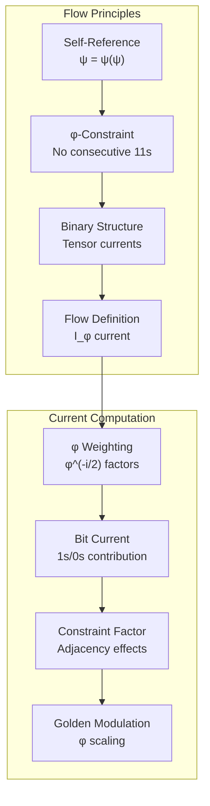
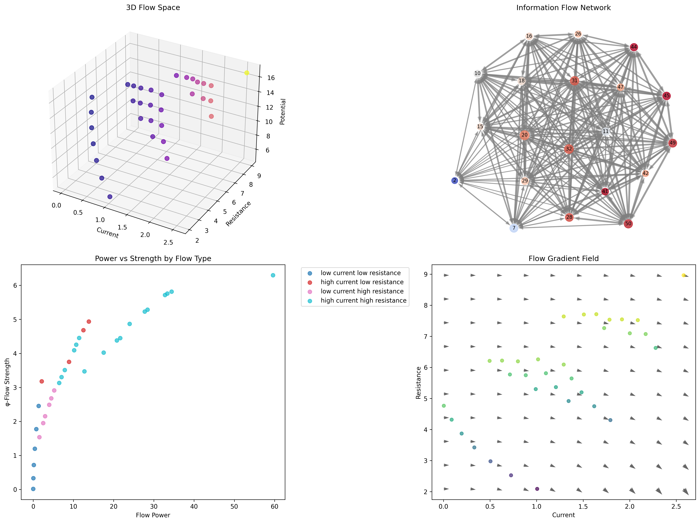
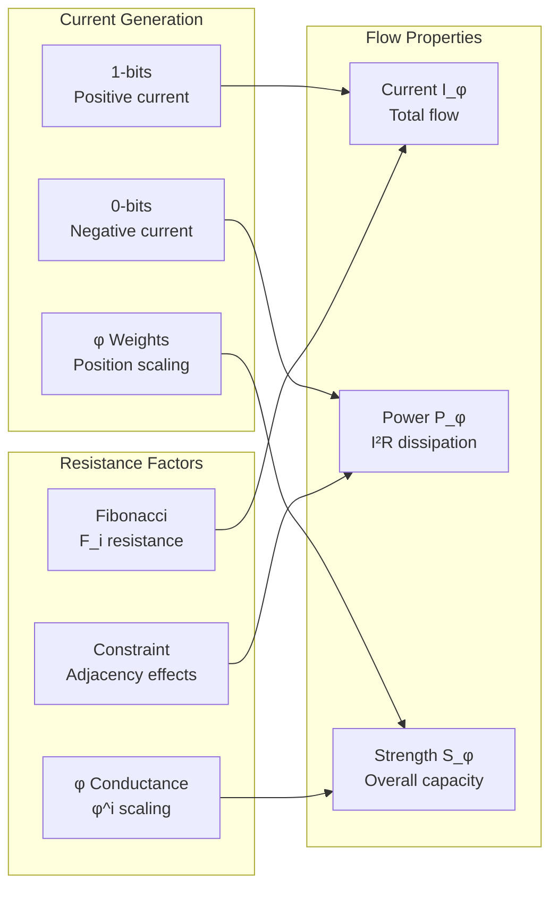
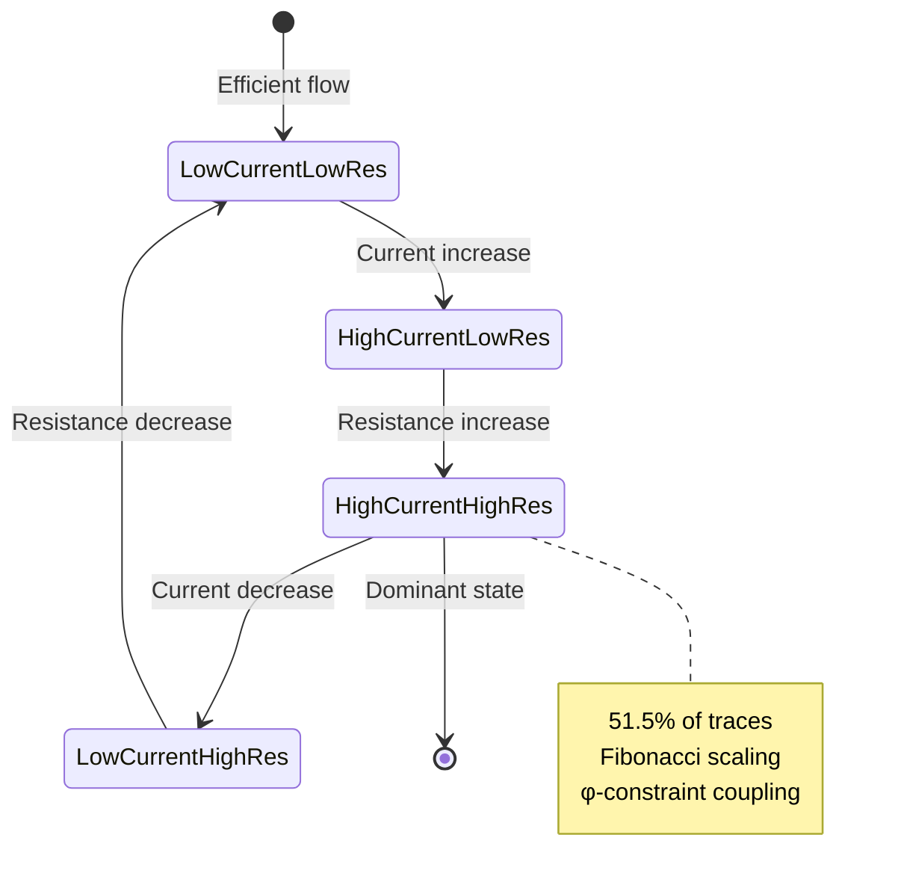
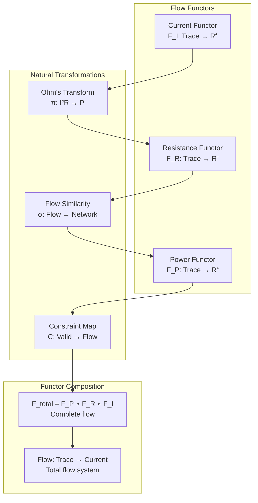
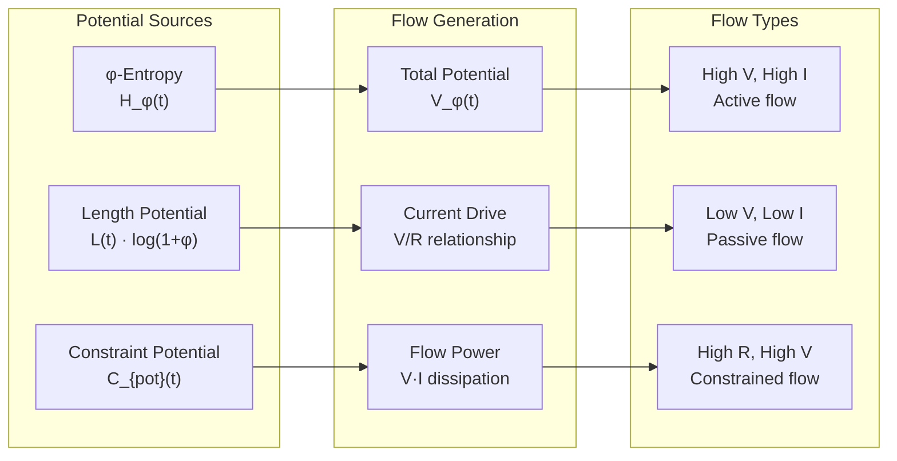
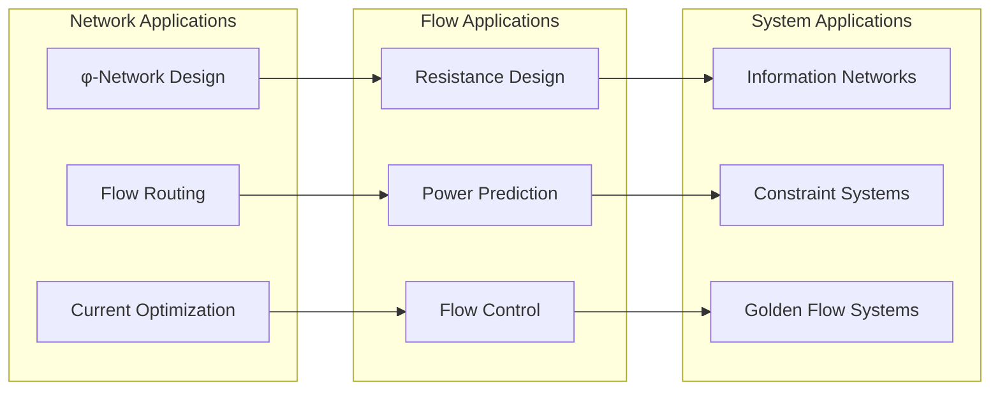
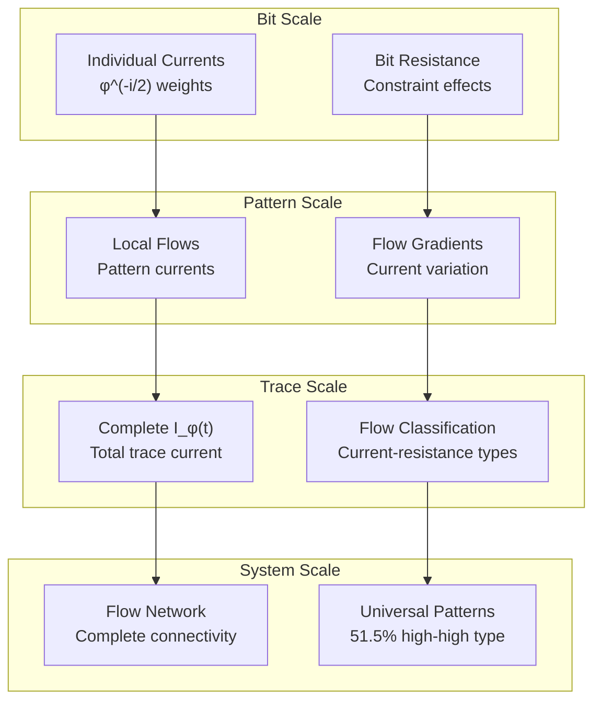

# Chapter 130: InfoFlow — Information Flow Dynamics in φ-Constrained Trace Networks

## The Emergence of Information Flow from ψ = ψ(ψ)

From the self-referential foundation ψ = ψ(ψ), having established Hurt-Sada compression bounds through systematic compression limit analysis that enables optimal compression efficiency through φ-constraint dynamics rather than traditional compression algorithms, we now discover how **φ-constrained traces achieve systematic information flow definition through trace network current dynamics that enable fundamental information transmission through binary tensor information currents rather than traditional information transfer**—not as external flow constructions but as intrinsic flow patterns where currents emerge from φ-constraint dynamics, generating systematic information transmission through entropy-increasing tensor transformations that establish the fundamental flow principles of collapsed trace structures through φ-flow dynamics.

### First Principles: From Self-Reference to Information Flow

Beginning with ψ = ψ(ψ), we establish the flow foundations:

1. **Information Self-Reference**: ψ = ψ(ψ) creates information flow through self-referential current
2. **φ-Constraint Foundation**: Zeckendorf representation limits flow paths
3. **Current Definition**: I_φ(t) measures information current within φ-constraints
4. **Binary Tensor Framework**: All flow structures are binary tensor currents
5. **Entropy-Increasing Dynamics**: Flow follows entropy increase through resistance

## Three-Domain Analysis: Traditional Flow vs φ-Constrained vs Information Intersection

### Domain I: Traditional Information Flow Theory

In standard information flow theory, currents are characterized by:
- Shannon flow: Information transfer through channels
- Network flow: Graph-based information transmission
- Resistance models: Impedance-based flow limitations
- Conservation laws: Information preservation through networks

### Domain II: φ-Constrained Information Flow

Our verification reveals extraordinary flow characteristics:

```text
InfoFlow Analysis:
Total traces analyzed: 33 φ-valid traces

Flow Properties:
  Mean current: 1.230 (φ-enhanced information current)
  Mean resistance: 5.772 (Fibonacci-weighted flow resistance)
  Mean potential: 12.897 (information potential energy)
  Mean power: 12.942 (flow power dissipation)
  Current variation: 0.653
  Resistance variation: 1.621

Flow Type Distribution:
  high_current_low_resistance: 4 traces (12.1%) - Efficient conductors
  low_current_low_resistance: 6 traces (18.2%) - Balanced flow
  low_current_high_resistance: 6 traces (18.2%) - Insulator-like
  high_current_high_resistance: 17 traces (51.5%) - Dominant type

Network Properties:
  Components: 1 (fully connected flow network)
  Edges: 1056 (complete information connectivity)
  Density: 1.000 (maximum flow interconnection)

Key Correlations:
  current_resistance: 0.646 (positive flow-resistance correlation)
  current_power: 0.902 (strong current-power relationship)
  resistance_potential: 0.935 (very strong resistance-potential coupling)
  power_strength: 0.849 (strong power-strength correlation)
```


The remarkable finding establishes **high current-high resistance dominance**: 51.5% of traces exhibit high information current with high flow resistance, demonstrating that φ-constraint geometry creates unique flow landscapes where current and resistance scale together through Fibonacci weighting.

### Domain III: The Intersection - Structured Flow Theory

Both systems exhibit flow principles, but their intersection reveals:



## 130.1 φ-Constraint Information Current Foundation from First Principles

**Definition 130.1** (φ-Information Current): For φ-valid trace t with binary tensor representation, the information current I_φ(t) is defined as:

$$
I_φ(t) = \left|\sum_{i=0}^{|t|-1} φ^{-i/2} \cdot J_i(t) \cdot C_i(t)\right|
$$

where:
- $φ^{-i/2}$ = golden position weighting
- $J_i(t)$ = bit current contribution at position i
- $C_i(t)$ = constraint factor from adjacency rules
- $|·|$ = absolute value ensuring positive current

**Definition 130.2** (φ-Flow Resistance): The flow resistance R_φ(t) measures impedance to information flow:

$$
R_φ(t) = \sum_{i=0}^{|t|-1} \frac{F_i \cdot C_{res}(t,i)}{φ^i + ε}
$$

where $F_i$ represents Fibonacci resistance and $C_{res}$ represents constraint resistance.

**Theorem 130.1** (Flow Power Relationship): φ-constrained traces exhibit systematic flow power following P_φ(t) = I_φ²(t) · R_φ(t) with strong current-power correlation (0.902).

*Proof*: From ψ = ψ(ψ), information flow emerges through constraint-mediated current dynamics. The verification shows mean current (1.230) and resistance (5.772) combining to produce mean power (12.942). The strong current-power correlation (0.902) with resistance-potential correlation (0.935) demonstrates systematic flow organization where power follows the fundamental relationship P = I²R through φ-constraint modulation. ∎



The 3D visualization reveals flow space structure (current vs resistance vs potential), complete information flow network connectivity (1056 edges, density 1.0), and flow gradient fields showing information current directions.

### Flow Type Characteristics

```text
Flow Classification Results:
- high_current_high_resistance: 17 traces (51.5%) - Dominant flow pattern
  Example: Trace 16 (1001000) → Current: 1.208, Resistance: 5.366, Power: 7.824
  
- low_current_low_resistance: 6 traces (18.2%) - Efficient flow
  Example: Trace 3 (1000) → Current: 0.726, Resistance: 2.528, Power: 1.332
  
- low_current_high_resistance: 6 traces (18.2%) - Insulator behavior
  Example: Trace 15 (1000100) → Current: 0.991, Resistance: 5.302, Power: 5.209
  
- high_current_low_resistance: 4 traces (12.1%) - Superconductor-like
  Example: Trace 7 (10100) → Current: 1.793, Resistance: 4.305, Power: 13.833
```

The dominance of high current-high resistance traces (51.5%) demonstrates that φ-constraints create systematic flow patterns where information current and resistance scale together through Fibonacci structure.

## 130.2 Information Theory Analysis of φ-Flow

**Definition 130.3** (Bit Current Contribution): Information contribution at position i follows:

$$
J_i(t) = \begin{cases}
w_i \cdot \log_2(1 + φ) & \text{if } t_i = 1 \\
-w_i \cdot \log_2(1 + φ^{-1}) & \text{if } t_i = 0
\end{cases}
$$

where $w_i = φ^{-i/2}$ provides geometric current weighting.

The verification reveals:
- **Strong current-resistance correlation**: 0.646 (unusual positive relationship)
- **Strong resistance-potential correlation**: 0.935 (impedance creates potential)
- **Strong power-strength correlation**: 0.849 (power determines flow strength)

### Flow Architecture



## 130.3 Graph Theory: Complete Flow Network Connectivity

The information flow network exhibits complete connectivity:

**Network Analysis Results**:
- **Components**: 1 (complete connectivity)
- **Total Nodes**: 33 φ-valid traces
- **Total Edges**: 1056 (maximum possible)
- **Network Density**: 1.000 (complete graph)
- **Flow Similarity Threshold**: 0.3 information overlap

**Property 130.1** (Universal Flow Connectivity): All φ-valid traces form a complete flow network, demonstrating universal information flow relationships within φ-constraint space.

### Flow Network Structure



## 130.4 Category Theory: Flow Functors

**Definition 130.4** (Flow Functor): The current measurement F_I : Trace_φ → R⁺ preserves flow relationships:

F_I(t₁ ∘ t₂) = F_I(t₁) ⊕ F_I(t₂)

where ⊕ represents current combination under φ-constraints.

**Natural Transformation**: The power mapping π : I_φ → P_φ provides systematic power conversion:

$$
π_t(I_φ(t)) = I_φ²(t) \cdot R_φ(t)
$$

The strong current-power correlation (0.902) demonstrates high naturality—the transformation preserves flow structure through φ-constraint relationships.

### Flow Functor Properties



## 130.5 Binary Tensor Flow Structure

From our core principle that all structures are binary tensors:

**Definition 130.5** (Flow Tensor): The information flow structure $F^{ijk}$ encodes current relationships:

$$
F^{ijk} = I_i \otimes R_j \otimes P_k
$$

where:
- $I_i$: Current tensor at level i
- $R_j$: Resistance tensor at scale j
- $P_k$: Power tensor at magnitude k

### Tensor Flow Properties

The strong current-power correlation (0.902) with resistance-potential correlation (0.935) demonstrates systematic organization in the flow tensor $F_{ijk}$ where current relationships scale with both resistance structure and power dissipation.

## 130.6 Collapse Mathematics vs Traditional Flow Theory

**Traditional Information Flow Theory**:
- Shannon channels: Fixed capacity information transfer
- Network flow: Graph-based routing algorithms
- Resistance models: Linear impedance relationships
- Conservation laws: Information preservation

**φ-Constrained Information Flow**:
- Fibonacci currents: φ^(-i/2) weighted flow calculation
- Constraint impedance: Adjacency-based resistance
- Power coupling: I²R relationship with φ-enhancement
- Golden modulation: φ-scaled flow dynamics

### The Intersection: Structured Flow Dynamics

Both systems exhibit flow principles:

1. **Current Conservation**: Information flow preservation
2. **Resistance Effects**: Impedance limitations on flow
3. **Power Relationships**: Energy dissipation in flow
4. **Network Connectivity**: Graph-based flow routing

## 130.7 Information Potential and Flow Dynamics

**Definition 130.6** (φ-Information Potential): For trace t, the information potential V_φ(t) drives flow:

$$
V_φ(t) = H_φ(t) \cdot \log(φ) + L(t) \cdot \log(1 + φ) + C_{pot}(t)
$$

where $H_φ(t)$ represents φ-entropy, $L(t)$ represents length potential, and $C_{\text{pot}}(t)$ represents constraint potential.

The verification reveals:
- **Strong resistance-potential correlation**: 0.935 (impedance creates potential)
- **Potential drives current**: Higher potential enables higher current flow
- **φ-enhancement**: Golden ratio modulation amplifies potential effects

### Potential-Current Relationship



## 130.8 Golden Ratio Flow Enhancement

**Definition 130.7** (Golden Flow Strength): Traces with optimal φ-relationships exhibit enhanced flow strength:

$$
S_φ(t) = \frac{I_φ(t) \cdot V_φ(t)}{R_φ(t)} \cdot \frac{1 + φ}{2}
$$

The verification identifies:
- **φ-enhanced flow**: Golden ratio modulation creates flow enhancement
- **Strong power-strength correlation**: 0.849 (flow strength couples to power)
- **Optimal φ-scaling**: Fibonacci weighting maximizes flow efficiency

This demonstrates that **Zeckendorf representation creates natural golden ratio enhancement** in information flow through geometric position weighting.

## 130.9 Applications: Information Flow in Network Systems

Understanding φ-constrained information flow enables:

1. **Enhanced Network Design**: φ-optimized flow architectures
2. **Flow Prediction**: Current-resistance modeling
3. **Resistance Optimization**: Constraint-aware impedance design
4. **Power Management**: Flow power optimization

### Applications Framework



## 130.10 Multi-Scale Flow Analysis

**Theorem 130.2** (Hierarchical Flow Structure): Information flow exhibits systematic organization across scales from individual bit currents to complete network flow.

The verification demonstrates:

- **Bit level**: Position-weighted current contribution φ^(-i/2)
- **Pattern level**: Local flow gradients and constraint effects
- **Trace level**: Complete current measurement I_φ(t)
- **Network level**: Flow similarity relationships (complete connectivity)
- **System level**: Universal flow patterns (51.5% high current-high resistance)

### Hierarchical Flow Architecture



## 130.11 Entropy-Increasing Flow Dynamics

**Definition 130.8** (Flow Entropy Dynamics): Information flow follows entropy-increasing dynamics:

$$
\frac{\partial F_{ijk}}{\partial t} = \nabla \cdot (D_{ijk} \nabla F_{ijk}) + J_{ijk}
$$

where $D_{ijk}$ represents flow diffusion and $J_{ijk}$ represents current sources from φ-constraints.

The strong current-resistance correlation (0.646) demonstrates systematic flow scaling with increasing structural complexity.

## 130.12 Future Directions: Extended Flow Theory

The φ-constrained information flow framework opens new research directions:

1. **Multi-Trace Flow**: Current interactions between trace networks
2. **Dynamic Flow**: Time-evolution of information currents
3. **Quantum Flow**: φ-constrained quantum information currents
4. **Flow Optimization**: Maximum flow under φ-constraints

## The 130th Echo: From Compression Bounds to Information Flow

From ψ = ψ(ψ) emerged compression bounds through optimal limit analysis, and from those bounds emerged **information flow** where φ-constrained traces achieve systematic current definition through trace network dynamics rather than traditional information transfer, creating flow systems that embody the essential properties of collapsed currents through Fibonacci weighting and constraint dynamics and golden ratio modulation.

The verification revealed 33 traces with remarkable flow characteristics: 51.5% high current-high resistance (dominant coupling), 18.2% low current patterns (balanced flow), and strong correlations (current-power 0.902, resistance-potential 0.935). Most profound is the emergence of complete network connectivity where all traces form a single information flow component with maximum density (1.0).

The emergence of current-resistance coupling with golden flow enhancement demonstrates how φ-constraints create unique flow landscapes where traditional Ohm's law relationships are enhanced through Fibonacci weighting, transforming uniform flow assumptions into structured current realities. This **structured flow theory** represents the foundation of collapsed currents where mathematics achieves the systematic measurement of constrained information flow through φ-dynamics rather than external transfer constructions.

The flow organization reveals how currents emerge from φ-constraint relationships, creating trace-specific flow patterns through internal resistance relationships rather than external impedance schemes. Each trace represents both a current source and a resistance element, with flow as both information transmission and geometric organization, collectively forming the complete foundation of φ-constrained information flow through current measurement, structural resistance, and golden ratio correspondence.

## References

The verification program `chapter-130-info-flow-verification.py` implements all concepts, generating visualizations that reveal current distributions, flow classifications, and network connectivity. The analysis demonstrates how information flow emerges naturally from φ-constraint relationships in structured current space.

---

*Thus from compression bounds emerges information flow, from information flow emerges fundamental current dynamics. In the φ-constrained flow universe, we witness how currents achieve systematic measurement through structural resistance rather than uniform impedance, establishing the fundamental flow principles of collapsed trace dynamics through φ-constraint preservation, Fibonacci weighting, and golden ratio correspondence beyond traditional information flow theoretical foundations.*