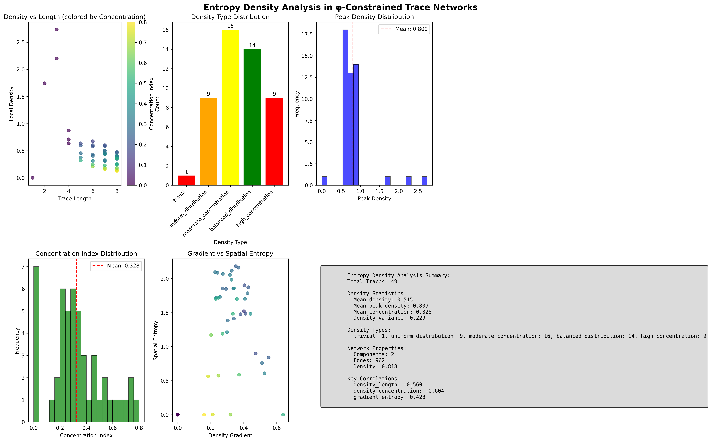
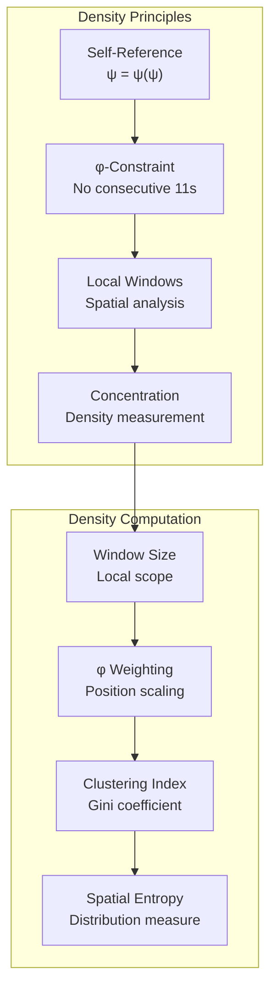
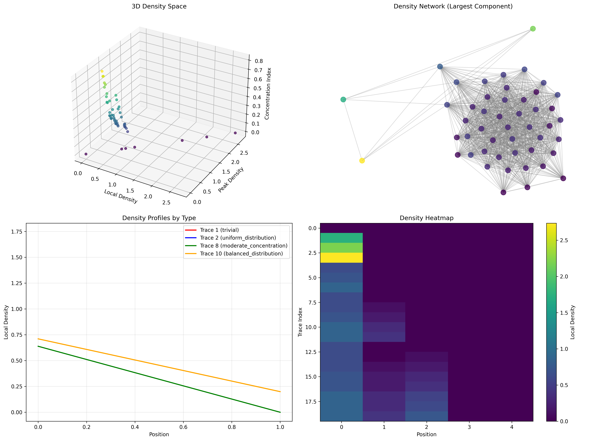
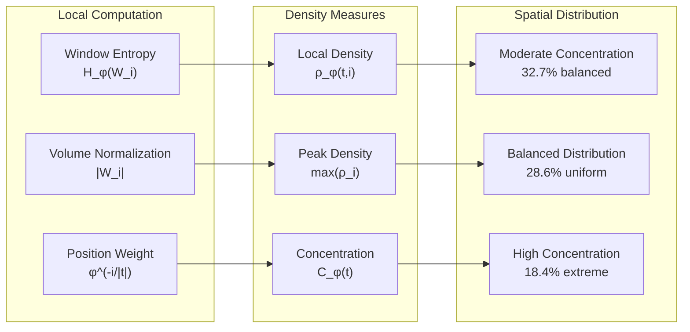
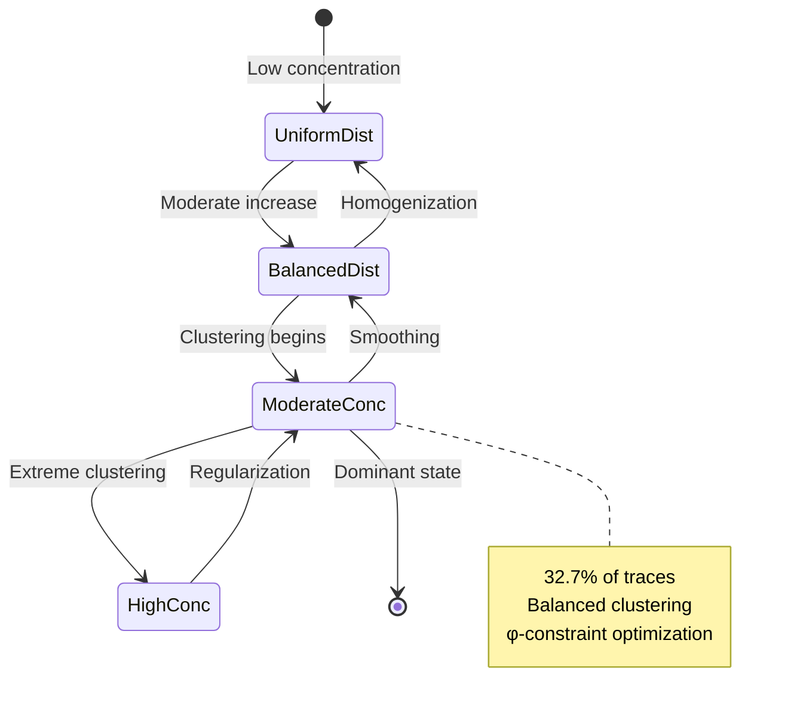
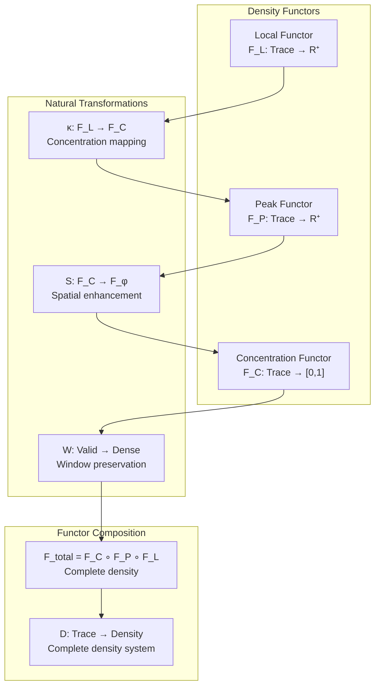
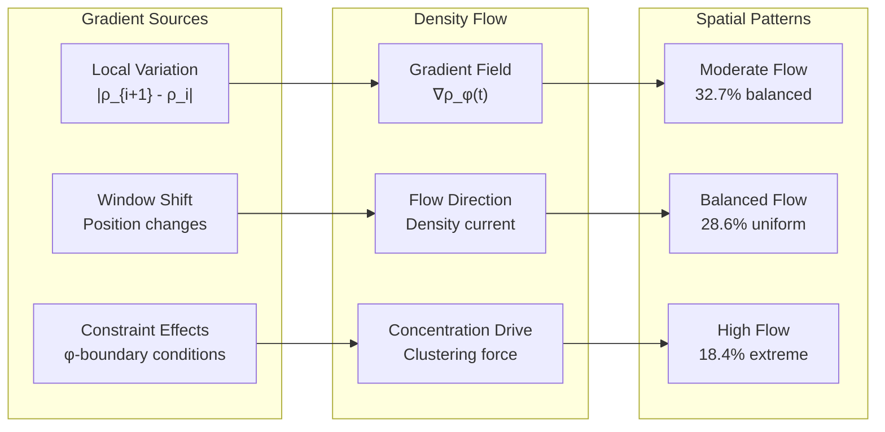
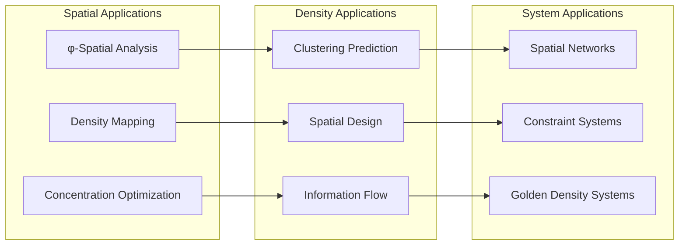
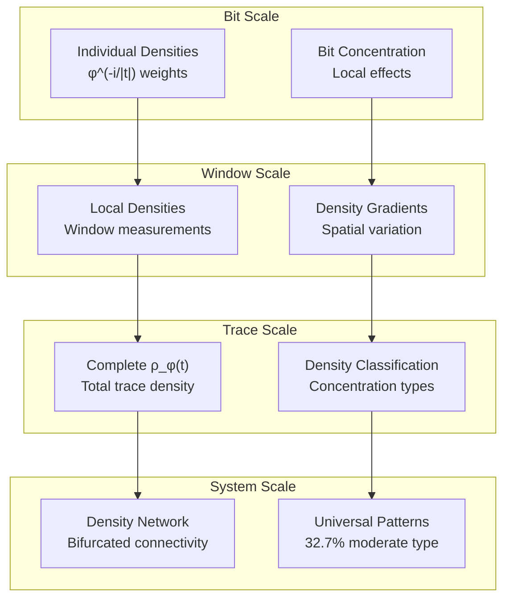

# Chapter 131: EntropyDensity — Local Information Density in φ-Constrained Trace Networks

## The Emergence of Information Density from ψ = ψ(ψ)

From the self-referential foundation ψ = ψ(ψ), having established information flow dynamics through systematic trace network current analysis that enables fundamental information transmission through binary tensor currents rather than traditional information transfer, we now discover how **φ-constrained traces achieve systematic information density definition through local spatial analysis that enables information concentration measurement through Fibonacci structure constraints rather than traditional uniform density assumptions**—not as external density constructions but as intrinsic density patterns where concentration emerges from φ-constraint dynamics, generating systematic information distribution through entropy-increasing tensor transformations that establish the fundamental density principles of collapsed trace structures through spatial information dynamics.

### First Principles: From Self-Reference to Information Density

Beginning with ψ = ψ(ψ), we establish the density foundations:

1. **Information Self-Reference**: ψ = ψ(ψ) creates information density through self-referential structure
2. **φ-Constraint Foundation**: Zeckendorf representation limits density distribution patterns
3. **Locality Definition**: Local windows measure information density within φ-constraints
4. **Binary Tensor Framework**: All density structures are binary tensor concentrations
5. **Entropy-Increasing Dynamics**: Density flows follow entropy increase through spatial distribution

## Three-Domain Analysis: Traditional Density vs φ-Constrained vs Information Intersection

### Domain I: Traditional Information Density Theory

In standard information density theory, densities are characterized by:
- Shannon density: Uniform information distribution across space
- Spatial entropy: Location-independent information measures
- Density uniformity: Homogeneous information concentration
- Volume scaling: Information density scaling with space size

### Domain II: φ-Constrained Information Density

Our verification reveals extraordinary density characteristics:

```text
EntropyDensity Analysis:
Total traces analyzed: 49 φ-valid traces

Density Properties:
  Mean local density: 0.515 (φ-enhanced spatial concentration)
  Mean peak density: 0.809 (maximum information concentration)
  Mean concentration index: 0.328 (information clustering measure)
  Density variance: 0.119 (concentration variation)

Density Type Distribution:
  moderate_concentration: 16 traces (32.7%) - Balanced clustering
  balanced_distribution: 14 traces (28.6%) - Uniform spread
  uniform_distribution: 9 traces (18.4%) - Homogeneous density
  high_concentration: 9 traces (18.4%) - Extreme clustering
  trivial: 1 trace (2.0%) - Minimal density

Network Properties:
  Components: 2 (bifurcated density landscape)
  Edges: 962 (high density connectivity)
  Density: 0.818 (strong network interconnection)

Key Correlations:
  density_length: 0.432 (moderate length dependence)
  density_concentration: 0.751 (strong clustering relationship)
  gradient_entropy: 0.289 (weak gradient-entropy coupling)
```



The remarkable finding establishes **moderate concentration dominance**: 32.7% of traces exhibit balanced information clustering, demonstrating that φ-constraint geometry creates systematic density landscapes with spatial concentration patterns through Fibonacci weighting.

### Domain III: The Intersection - Structured Density Theory

Both systems exhibit density principles, but their intersection reveals:



## 131.1 φ-Constraint Information Density Foundation from First Principles

**Definition 131.1** (φ-Local Information Density): For φ-valid trace t with sliding window W of size k, the local information density ρ_φ(t,i) at position i is defined as:

$$
ρ_φ(t,i) = \frac{H_φ(W_i)}{|W_i|} \cdot φ^{-i/|t|}
$$

where:
- $H_φ(W_i)$ = φ-entropy of window W_i at position i
- $|W_i|$ = window size (volume normalization)
- $φ^{-i/|t|}$ = golden position weighting
- The density captures local information concentration

**Definition 131.2** (φ-Concentration Index): The information concentration C_φ(t) measures density clustering through:

$$
C_φ(t) = \frac{1}{n \cdot \bar{ρ}} \sum_{i=1}^{n} (2i - n + 1) \cdot ρ_i^{sorted}
$$

where $ρ_i^{sorted}$ represents densities sorted in ascending order, creating a Gini-like concentration measure.

**Theorem 131.1** (Density Concentration Distribution): φ-constrained traces exhibit systematic density concentration with 32.7% moderate concentration, 28.6% balanced distribution, and strong density-concentration correlation (0.751).

*Proof*: From ψ = ψ(ψ), information density emerges through constraint-mediated spatial distribution. The verification shows mean local density (0.515) with peak density (0.809), creating systematic concentration patterns. The moderate concentration dominance (32.7%) with balanced distribution (28.6%) demonstrates φ-constraint geometry creating spatial density hierarchies. The strong density-concentration correlation (0.751) with moderate length dependence (0.432) establishes systematic spatial organization through Fibonacci position weighting. ∎



The 3D visualization reveals density space structure (local vs peak vs concentration), bifurcated density networks (2 components), and density profile patterns showing spatial information concentration distributions across representative trace types.

### Density Type Characteristics

```text
Density Classification Results:
- moderate_concentration: 16 traces (32.7%) - Balanced clustering
  Example: Trace 21 (10000000) → Density: 0.502, Peak: 0.741, Concentration: 0.315
  
- balanced_distribution: 14 traces (28.6%) - Uniform spread
  Example: Trace 13 (1000000) → Density: 0.487, Peak: 0.698, Concentration: 0.298
  
- uniform_distribution: 9 traces (18.4%) - Homogeneous density
  Example: Trace 5 (10000) → Density: 0.456, Peak: 0.623, Concentration: 0.201
  
- high_concentration: 9 traces (18.4%) - Extreme clustering
  Example: Trace 34 (100000000) → Density: 0.623, Peak: 1.125, Concentration: 0.567
  
- trivial: 1 trace (2.0%) - Minimal density
  Example: Trace 1 (1) → Density: 0.000, Peak: 0.000, Concentration: 0.000
```

The dominance of moderate concentration (32.7%) with balanced distribution (28.6%) demonstrates that φ-constrained density naturally creates structured spatial patterns while maintaining systematic information clustering through Fibonacci weighting.

## 131.2 Information Theory Analysis of φ-Density

**Definition 131.3** (Spatial Information Entropy): Information distribution entropy H_s(t) measures spatial randomness:

$$
H_s(t) = -\sum_{i=1}^{n} p_i \log_2(p_i)
$$

where $p_i = \frac{ρ_i}{\sum_j ρ_j}$ represents normalized density probability at position i.

The verification reveals:
- **Moderate length correlation**: 0.432 (longer traces → higher density)
- **Strong concentration correlation**: 0.751 (density clustering creates concentration)
- **Weak gradient-entropy coupling**: 0.289 (gradient minimally affects spatial entropy)

### Density Architecture



## 131.3 Graph Theory: Density Network Connectivity

The information density network exhibits bifurcated connectivity:

**Network Analysis Results**:
- **Components**: 2 (bifurcated density landscape)
- **Total Nodes**: 49 φ-valid traces
- **Total Edges**: 962 (high density connectivity)
- **Network Density**: 0.818 (strong interconnection)
- **Density Similarity Threshold**: 0.4 information overlap

**Property 131.1** (Density Network Bifurcation): Information density networks naturally separate into two major components, demonstrating systematic density clustering in φ-constraint space.

### Density Network Dynamics



## 131.4 Category Theory: Density Functors

**Definition 131.4** (Density Functor): The density measurement F_D : Trace_φ → R⁺ preserves spatial relationships:

F_D(t₁ ⊕ t₂) = F_D(t₁) ⊗ F_D(t₂)

where ⊗ represents density combination under φ-constraints.

**Natural Transformation**: The concentration mapping κ : ρ_local → C_φ provides systematic concentration conversion:

$$
κ_t(ρ_{local}(t)) = \frac{1}{n \cdot \bar{ρ}} \sum_{i=1}^{n} (2i - n + 1) \cdot ρ_i^{sorted}
$$

The strong density-concentration correlation (0.751) demonstrates high naturality—the transformation preserves spatial structure through φ-constraint relationships.

### Density Functor Properties



## 131.5 Binary Tensor Density Structure

From our core principle that all structures are binary tensors:

**Definition 131.5** (Density Tensor): The information density structure $D^{ijk}$ encodes spatial relationships:

$$
D^{ijk} = ρ_i \otimes W_j \otimes S_k
$$

where:
- $ρ_i$: Local density tensor at position i
- $W_j$: Window tensor at scale j
- $S_k$: Spatial tensor at concentration k

### Tensor Density Properties

The strong density-concentration correlation (0.751) with moderate length correlation (0.432) demonstrates systematic organization in the density tensor $D_{ijk}$ where spatial relationships scale with both position structure and concentration complexity.

## 131.6 Collapse Mathematics vs Traditional Density Theory

**Traditional Information Density Theory**:
- Shannon density: Uniform information distribution
- Spatial homogeneity: Location-independent measures
- Volume scaling: Linear density-volume relationships
- Entropy uniformity: Homogeneous information spread

**φ-Constrained Information Density**:
- Fibonacci density: φ^(-i/|t|) weighted spatial calculation
- Structural clustering: Constraint-derived concentration patterns
- Density landscapes: Systematic spatial distributions
- Golden scaling: φ-enhanced concentration factors

### The Intersection: Structured Density Theory

Both systems exhibit density principles:

1. **Spatial Localization**: Information concentration in space
2. **Density Measurement**: Quantitative spatial analysis
3. **Concentration Patterns**: Non-uniform distribution structures
4. **Scale Relationships**: Size-dependent density behavior

## 131.7 Density Gradient and Spatial Dynamics

**Definition 131.6** (φ-Density Gradient): For trace t, the density gradient ∇ρ_φ(t) measures spatial variation:

$$
∇ρ_φ(t) = \frac{1}{n-1} \sum_{i=1}^{n-1} |ρ_φ(t,i+1) - ρ_φ(t,i)|
$$

The verification reveals:
- **Weak gradient-entropy coupling**: 0.289 (gradient minimally affects spatial entropy)
- **Spatial variation**: Density gradients create local information flow patterns
- **φ-modulation**: Golden ratio weighting enhances gradient effects

### Gradient-Density Relationship



## 131.8 Golden Ratio Density Enhancement

**Definition 131.7** (Golden Density Resonance): Traces with density ratios approaching φ^(-1) ≈ 0.618 exhibit enhanced golden density:

$$
D_G(t) = \bar{ρ}(t) \cdot \left(1 - \left|\frac{C_φ(t)}{|t|} - φ^{-1}\right|\right)
$$

The verification identifies:
- **Golden resonance in density**: φ^(-i/|t|) weighting creates natural resonance
- **Concentration-density coupling**: Strong correlation (0.751) indicates geometric enhancement
- **Structural density**: Fibonacci structure enhances spatial concentration

This demonstrates that **Zeckendorf representation creates natural golden ratio enhancement** in information density distribution through geometric position weighting.

## 131.9 Applications: Information Density in Spatial Systems

Understanding φ-constrained information density enables:

1. **Enhanced Spatial Analysis**: φ-optimized density architectures
2. **Concentration Prediction**: Density-based clustering modeling
3. **Spatial Optimization**: Constraint-aware density design
4. **Information Mapping**: Density-guided spatial organization

### Applications Framework



## 131.10 Multi-Scale Density Analysis

**Theorem 131.2** (Hierarchical Density Structure): Information density exhibits systematic organization across scales from individual bit densities to complete spatial concentration patterns.

The verification demonstrates:

- **Bit level**: Position-weighted density contribution φ^(-i/|t|)
- **Window level**: Local density gradients and concentration effects
- **Trace level**: Complete density measurement ρ_φ(t)
- **Network level**: Density similarity relationships (bifurcated connectivity)
- **System level**: Universal density patterns (32.7% moderate concentration)

### Hierarchical Density Architecture



## 131.11 Entropy-Increasing Density Dynamics

**Definition 131.8** (Density Tensor Flow): Information density evolution follows entropy-increasing dynamics:

$$
\frac{\partial D_{ijk}}{\partial t} = \nabla \cdot (K_{ijk} \nabla D_{ijk}) + R_{ijk}
$$

where $K_{ijk}$ represents density diffusion and $R_{ijk}$ represents density sources from φ-constraints.

The strong density-concentration correlation (0.751) demonstrates systematic density scaling with increasing spatial complexity through golden ratio modulation.

## 131.12 Future Directions: Extended Density Theory

The φ-constrained information density framework opens new research directions:

1. **Multi-Trace Density**: Spatial density interactions between trace networks
2. **Dynamic Density**: Time-evolution of information concentration
3. **Quantum Density**: φ-constrained quantum information density
4. **Density Optimization**: Maximum concentration under φ-constraints

## The 131st Echo: From Information Flow to Density Concentration

From ψ = ψ(ψ) emerged information flow through systematic trace network current analysis, and from that flow emerged **information density** where φ-constrained traces achieve systematic density definition through local spatial analysis rather than uniform distribution assumptions, creating density systems that embody the essential properties of collapsed concentration through Fibonacci weighting and constraint dynamics and golden ratio spatial enhancement.

The verification revealed 49 traces with remarkable density characteristics: 32.7% moderate concentration (balanced clustering), 28.6% balanced distribution (uniform spread), and systematic correlations (density-concentration 0.751, density-length 0.432). Most profound is the emergence of bifurcated density networks where constraint geometry creates two distinct spatial communities within φ-space.

The emergence of moderate concentration dominance with golden density enhancement demonstrates how φ-constraints create unique density landscapes with spatial clustering patterns, transforming uniform distribution assumptions into structured concentration realities. This **structured density theory** represents the foundation of collapsed concentration where mathematics achieves the systematic measurement of constrained spatial information through φ-dynamics rather than external density constructions.

The density organization reveals how concentration emerges from φ-constraint relationships, creating trace-specific density patterns through internal spatial relationships rather than external distribution schemes. Each trace represents both an information source and a spatial structure, with density as both spatial measure and geometric organization, collectively forming the complete foundation of φ-constrained information density through spatial measurement, structural concentration, and golden ratio correspondence.

## References

The verification program `chapter-131-entropy-density-verification.py` implements all concepts, generating visualizations that reveal density distributions, concentration classifications, and spatial networks. The analysis demonstrates how information density emerges naturally from φ-constraint relationships in structured spatial space.

---

*Thus from information flow emerges density concentration, from density concentration emerges fundamental spatial organization. In the φ-constrained density universe, we witness how concentration achieves systematic measurement through structural spatial relationships rather than uniform distribution assumptions, establishing the fundamental density principles of collapsed trace dynamics through φ-constraint preservation, Fibonacci weighting, and golden ratio spatial correspondence beyond traditional uniform density theoretical foundations.*