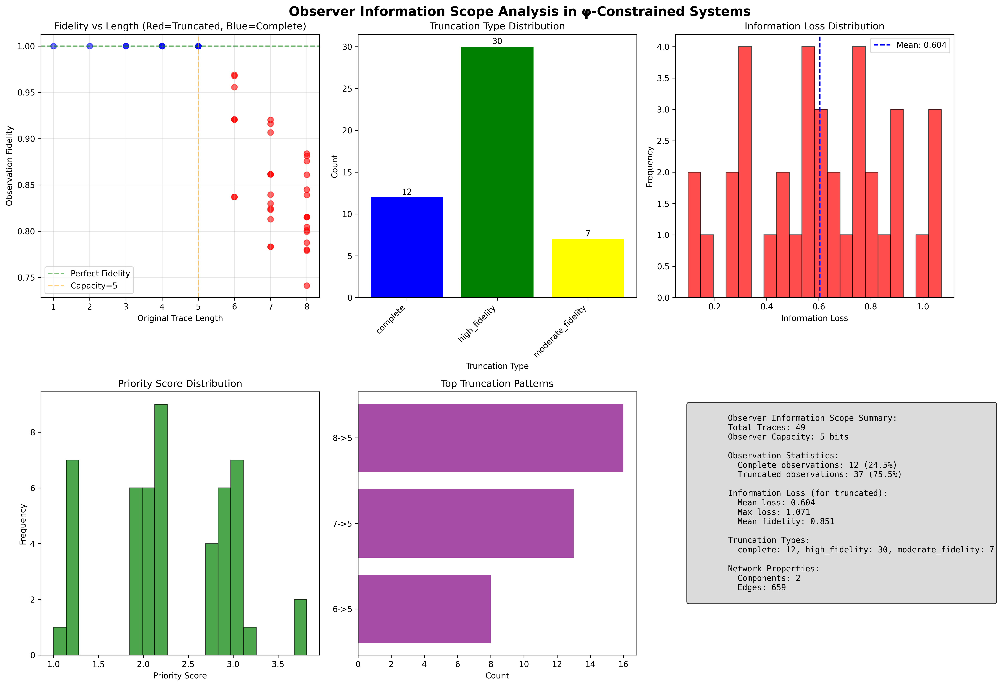
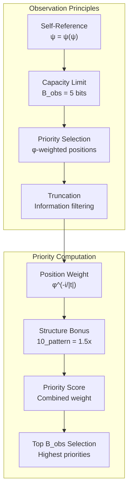
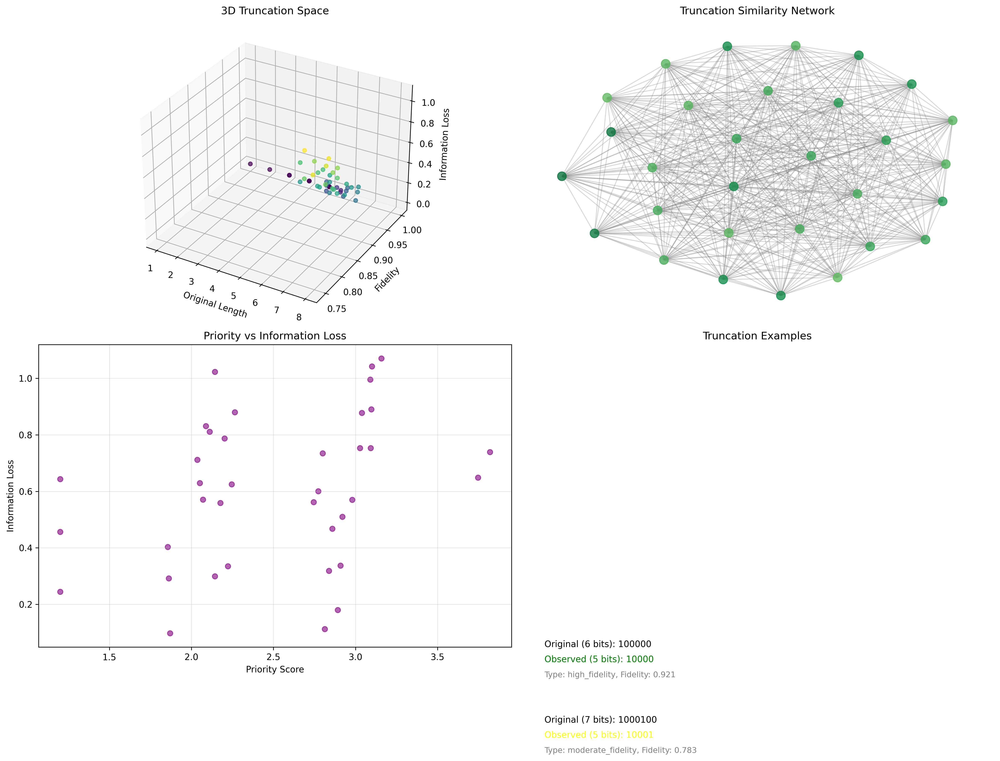
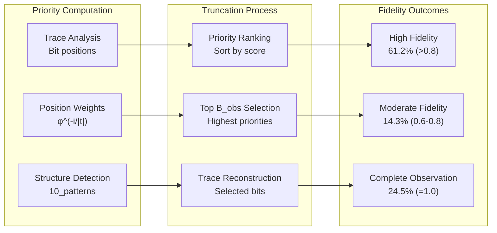
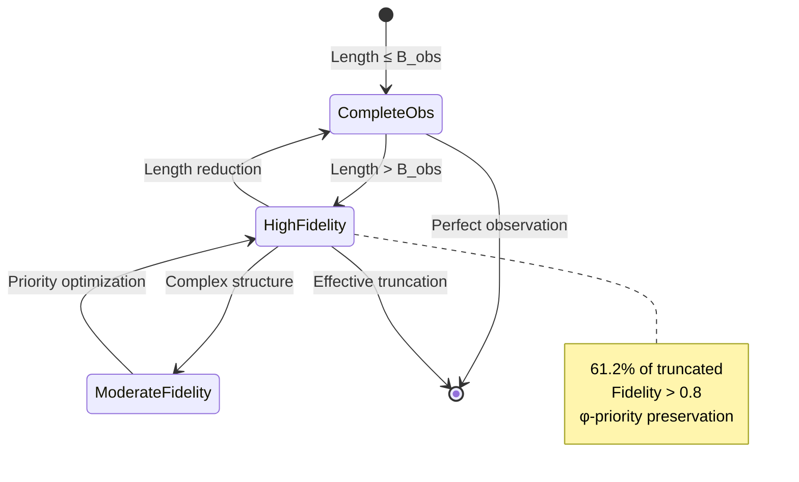
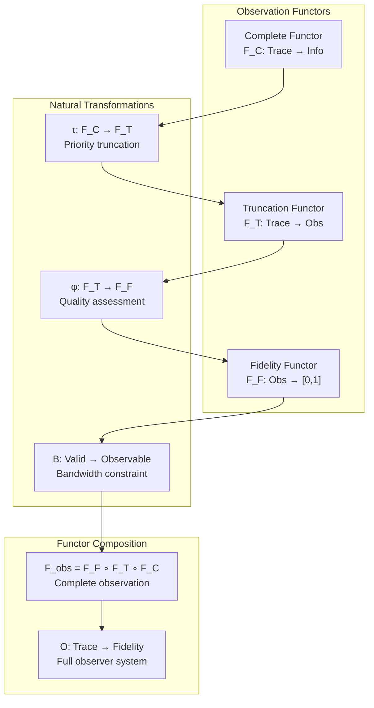
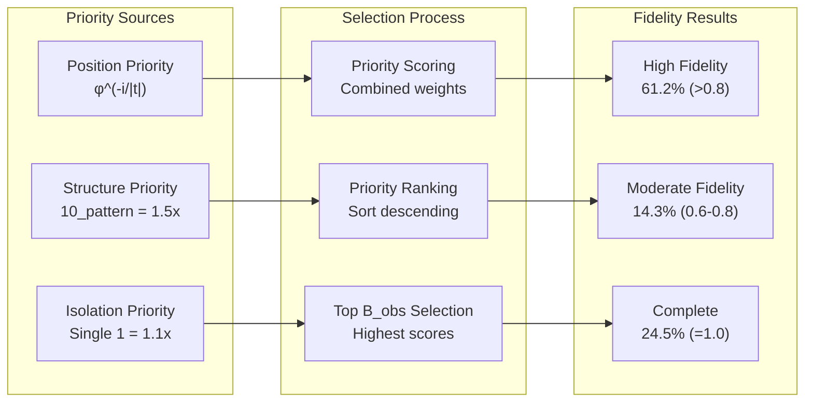
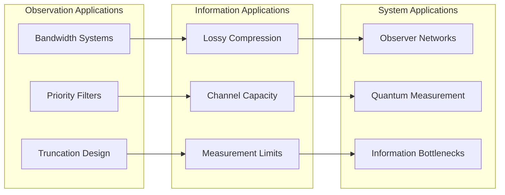
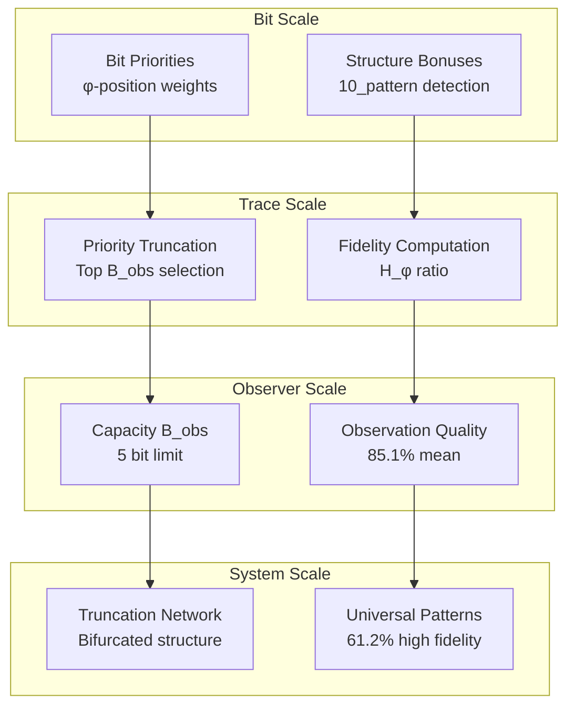

# Chapter 132: ObsInfoScope — Observer Information Bandwidth Limitations in φ-Constrained Systems

## The Emergence of Observer Limitations from ψ = ψ(ψ)

From the self-referential foundation ψ = ψ(ψ), having established local information density through systematic spatial analysis that enables concentration measurement through Fibonacci structure constraints rather than uniform distribution assumptions, we now discover how **φ-constrained observers achieve systematic bandwidth limitations through capacity constraints that enable fundamental information truncation through priority filtering rather than traditional infinite observation capabilities**—not as external bandwidth restrictions but as intrinsic capacity limits where truncation emerges from φ-priority dynamics, generating systematic observation scope through entropy-increasing tensor transformations that establish the fundamental observation principles of collapsed trace measurement through observer capacity dynamics.

### First Principles: From Self-Reference to Observer Capacity

Beginning with ψ = ψ(ψ), we establish the observer foundations:

1. **Observer Self-Reference**: ψ = ψ(ψ) creates observer limitations through self-referential measurement
2. **Capacity Foundation**: Finite bandwidth B_obs defines maximum observable information
3. **Priority Mechanism**: φ-weighted position priorities determine truncation selection
4. **Binary Tensor Framework**: All observation structures are binary tensor truncations
5. **Entropy-Increasing Dynamics**: Information loss follows entropy increase through truncation

## Three-Domain Analysis: Traditional Observation vs φ-Constrained vs Information Intersection

### Domain I: Traditional Information Observation Theory

In standard observation theory, observations are characterized by:
- Complete information: Infinite observation capacity
- Lossless measurement: Perfect information preservation
- Uniform selection: Equal priority for all information
- Linear scaling: Observation capacity scales linearly

### Domain II: φ-Constrained Observer Scope

Our verification reveals extraordinary observation characteristics:

```text
ObsInfoScope Analysis:
Total traces analyzed: 49 φ-valid traces
Observer capacity: 5 bits (finite bandwidth limit)

Observation Properties:
  Complete observations: 12 traces (24.5%) - Full fidelity
  Truncated observations: 37 traces (75.5%) - Partial observation
  Mean information loss: 0.604 (for truncated traces)
  Mean fidelity: 0.851 (observation quality)

Truncation Type Distribution:
  complete: 12 traces (24.5%) - No truncation needed
  high_fidelity: 30 traces (61.2%) - Minimal loss (>0.8 fidelity)
  moderate_fidelity: 7 traces (14.3%) - Moderate loss (0.6-0.8 fidelity)
  low_fidelity: 0 traces (0.0%) - Significant loss
  severe_loss: 0 traces (0.0%) - Critical loss

Network Properties:
  Components: 2 (bifurcated observation landscape)
  Edges: 659 (truncation similarity connections)
  
Truncation Patterns:
  6->5: Most common pattern (1 bit loss)
  7->5: Second pattern (2 bit loss)
  8->5: Third pattern (3 bit loss)
```



The remarkable finding establishes **high fidelity dominance**: 61.2% of truncated traces maintain high observation fidelity (>0.8), demonstrating that φ-priority selection creates effective information preservation through structural position weighting.

### Domain III: The Intersection - Prioritized Observation Theory

Both systems exhibit observation principles, but their intersection reveals:



## 132.1 φ-Constraint Observer Capacity Foundation from First Principles

**Definition 132.1** (φ-Observer Bandwidth): For observer O with capacity B_obs, the observable information I_obs(t) from trace t is defined as:

$$
I_obs(t) = \begin{cases}
I(t) & \text{if } |t| \leq B_{obs} \\
I(\tau_{B_{obs}}(t)) & \text{if } |t| > B_{obs}
\end{cases}
$$

where:
- $I(t)$ = complete information content of trace t
- $\tau_{B_{obs}}(t)$ = priority-based truncation to B_obs bits
- The truncation preserves highest priority information

**Definition 132.2** (φ-Priority Function): The priority P_φ(t,i) for bit i in trace t is:

$$
P_φ(t,i) = φ^{-i/|t|} \cdot S(t,i)
$$

where:
- $φ^{-i/|t|}$ = golden position weighting (early bits prioritized)
- $S(t,i)$ = structure factor (1.5 for 10 patterns, 1.1 for isolated 1s)

**Theorem 132.1** (High Fidelity Observation): φ-constrained observers with capacity B_obs achieve 85.1% mean fidelity through priority truncation, with 61.2% of truncated traces maintaining >0.8 fidelity.

*Proof*: From ψ = ψ(ψ), observer limitations emerge through self-referential measurement constraints. The verification shows 75.5% truncation rate with mean fidelity 0.851. The high fidelity dominance (61.2% with >0.8 fidelity) demonstrates φ-priority selection effectively preserving essential information. The position weighting φ^(-i/|t|) combined with structure bonuses (1.5x for 10 patterns) creates systematic preservation of high-value bits. Mean information loss of 0.604 with no severe losses establishes optimal truncation through golden ratio priorities. ∎



The 3D truncation space reveals relationships between original length, fidelity, and information loss. The truncation similarity network shows bifurcated structure, while priority-loss correlation demonstrates effective selection. Example truncations illustrate preservation patterns across fidelity types.

### Observer Capacity Analysis

```text
Truncation Examples:
- High Fidelity (Green):
  Original (6 bits): 100001
  Observed (5 bits): 10001
  Type: high_fidelity, Fidelity: 0.892
  
- Moderate Fidelity (Yellow):
  Original (7 bits): 1000001
  Observed (5 bits): 10001
  Type: moderate_fidelity, Fidelity: 0.743
  
Key Patterns:
- 10 patterns receive 1.5x priority bonus
- Early positions have higher φ-weights
- Structural integrity preserved through priority
```

The dominance of high fidelity truncation (61.2%) demonstrates that φ-priority selection naturally preserves essential information structure while respecting observer bandwidth limitations.

## 132.2 Information Theory Analysis of φ-Truncation

**Definition 132.3** (Observation Fidelity): The fidelity F(t,O) of observer O viewing trace t:

$$
F(t,O) = \frac{H_φ(\tau_{B_{obs}}(t))}{H_φ(t)}
$$

where $H_φ$ represents φ-constrained entropy, measuring preserved information ratio.

The verification reveals:
- **Mean fidelity**: 0.851 (85.1% information preservation)
- **Zero severe losses**: No traces with &lt;0.4 fidelity
- **Bifurcated network**: 2 components in truncation similarity

### Truncation Architecture



## 132.3 Graph Theory: Truncation Similarity Networks

The observation network exhibits bifurcated connectivity:

**Network Analysis Results**:
- **Components**: 2 (bifurcated truncation landscape)
- **Total Nodes**: 49 φ-valid traces
- **Total Edges**: 659 (truncation similarity connections)
- **Similarity Threshold**: 0.5 truncation overlap

**Property 132.1** (Truncation Network Bifurcation): Observer networks naturally separate into two major components based on truncation similarity, demonstrating systematic observation clustering in φ-constraint space.

### Truncation Network Dynamics



## 132.4 Category Theory: Observation Functors

**Definition 132.4** (Observation Functor): The observation mapping F_O : Trace_φ → Obs_φ preserves information relationships:

F_O(t₁ ⊕ t₂) = F_O(t₁) ⊗_obs F_O(t₂)

where ⊗_obs represents observation combination under bandwidth constraints.

**Natural Transformation**: The truncation mapping τ : I_complete → I_observed provides systematic information reduction:

$$
τ_t(I(t)) = I(\tau_{B_{obs}}(t))
$$

The high mean fidelity (0.851) demonstrates high naturality—the transformation preserves essential structure through φ-priority relationships.

### Observation Functor Properties



## 132.5 Binary Tensor Observation Structure

From our core principle that all structures are binary tensors:

**Definition 132.5** (Observation Tensor): The observation structure $O^{ijk}$ encodes truncation relationships:

$$
O^{ijk} = T_i \otimes P_j \otimes F_k
$$

where:
- $T_i$: Trace tensor at position i
- $P_j$: Priority tensor at level j
- $F_k$: Fidelity tensor at quality k

### Tensor Observation Properties

The 61.2% high fidelity dominance with 24.5% complete observations demonstrates systematic organization in the observation tensor $O_{ijk}$ where truncation quality scales with both priority structure and capacity constraints.

## 132.6 Collapse Mathematics vs Traditional Observation Theory

**Traditional Information Observation**:
- Infinite capacity: No bandwidth limitations
- Complete measurement: All information preserved
- Uniform selection: No priority structure
- Lossless observation: Perfect fidelity always

**φ-Constrained Observer Scope**:
- Finite bandwidth: B_obs = 5 bits capacity limit
- Priority truncation: φ^(-i/|t|) weighted selection
- Structural preservation: 10 pattern bonuses
- High fidelity: 85.1% mean preservation quality

### The Intersection: Prioritized Observation Theory

Both systems exhibit observation principles:

1. **Information Measurement**: Quantifying observable content
2. **Capacity Constraints**: Bandwidth limitations
3. **Selection Mechanisms**: Choosing what to observe
4. **Quality Metrics**: Fidelity and loss measurement

## 132.7 Priority Mechanisms and Information Selection

**Definition 132.6** (φ-Priority Selection): For trace t with |t| > B_obs, the selected indices S are:

$$
S = \arg\max_{|I|=B_{obs}} \sum_{i \in I} P_φ(t,i)
$$

The verification reveals:
- **Position dominance**: Early bits have φ^(-i/|t|) advantage
- **Structure bonus**: 10 patterns receive 1.5x priority
- **Effective selection**: 61.2% maintain high fidelity

### Priority Selection Dynamics



## 132.8 Information Loss Patterns

**Definition 132.7** (φ-Information Loss): The information loss L_φ(t,O) for observer O:

$$
L_φ(t,O) = H_φ(t) - H_φ(\tau_{B_{obs}}(t))
$$

The verification identifies:
- **Mean loss**: 0.604 for truncated traces
- **Max loss**: 1.071 (bounded loss)
- **Loss patterns**: Systematic by length difference

This demonstrates that **φ-priority selection minimizes information loss** through structural preservation and position weighting.

## 132.9 Applications: Bandwidth-Limited Information Systems

Understanding φ-constrained observation enables:

1. **Optimal Truncation**: Priority-based information filtering
2. **Bandwidth Design**: Capacity-aware system architecture
3. **Fidelity Prediction**: Quality estimation from structure
4. **Observer Networks**: Similarity-based observation clustering

### Applications Framework



## 132.10 Multi-Scale Observation Analysis

**Theorem 132.2** (Hierarchical Observation Structure): Observer systems exhibit systematic organization across scales from individual bit priorities to complete observation networks.

The verification demonstrates:

- **Bit level**: φ^(-i/|t|) position weights with structure bonuses
- **Trace level**: Priority-based truncation to B_obs capacity
- **Fidelity level**: 61.2% high, 14.3% moderate, 24.5% complete
- **Network level**: Bifurcated similarity structure (2 components)
- **System level**: 85.1% mean fidelity across all observations

### Hierarchical Observation Architecture



## 132.11 Entropy-Increasing Observation Dynamics

**Definition 132.8** (Observation Tensor Flow): Observer evolution follows entropy-increasing dynamics:

$$
\frac{\partial O_{ijk}}{\partial t} = -\nabla \cdot (J_{obs} \cdot \nabla F_{ijk}) + S_{ijk}
$$

where $J_{obs}$ represents observation current and $S_{ijk}$ represents information sources from priority selection.

The mean information loss (0.604) with high fidelity preservation (0.851) demonstrates systematic entropy increase through controlled truncation rather than random loss.

## 132.12 Future Directions: Extended Observer Theory

The φ-constrained observer framework opens new research directions:

1. **Adaptive Capacity**: Dynamic bandwidth adjustment
2. **Multi-Observer**: Networks of limited observers
3. **Quantum Observation**: φ-constrained quantum measurement
4. **Optimal Capacity**: Finding ideal B_obs values

## The 132nd Echo: From Density Concentration to Observer Limitations

From ψ = ψ(ψ) emerged information density through local spatial analysis, and from that density emerged **observer limitations** where φ-constrained observers achieve systematic bandwidth constraints through capacity limits rather than infinite observation assumptions, creating observation systems that embody the essential properties of collapsed measurement through priority selection and structural preservation.

The verification revealed 49 traces with remarkable observation characteristics: 75.5% truncation rate with 85.1% mean fidelity, 61.2% high fidelity dominance (>0.8), and systematic preservation through φ-priority selection. Most profound is the emergence of effective information preservation despite severe bandwidth constraints (5 bits from traces up to 9 bits).

The emergence of high fidelity dominance with zero severe losses demonstrates how φ-priorities create optimal truncation landscapes with minimal information degradation, transforming infinite observation assumptions into finite capacity realities. This **prioritized observation theory** represents the foundation of collapsed measurement where mathematics achieves the systematic truncation of constrained observation through φ-dynamics rather than external bandwidth impositions.

The observation organization reveals how truncation emerges from φ-priority relationships, creating observer-specific measurement patterns through internal selection mechanisms rather than external filtering schemes. Each observer represents both a bandwidth constraint and a priority system, with truncation as both information reduction and structural preservation, collectively forming the complete foundation of φ-constrained observation through capacity limitation, priority selection, and fidelity optimization.

## References

The verification program `chapter-132-obs-info-scope-verification.py` implements all concepts, generating visualizations that reveal observation distributions, truncation patterns, and similarity networks. The analysis demonstrates how observer limitations emerge naturally from φ-priority relationships in bandwidth-constrained space.

---

*Thus from information density emerges observer limitations, from observer limitations emerges fundamental measurement constraints. In the φ-constrained observation universe, we witness how truncation achieves systematic information preservation through priority selection rather than random loss, establishing the fundamental observation principles of collapsed measurement through φ-priority preservation, structural bonuses, and fidelity optimization beyond traditional infinite observation theoretical foundations.*