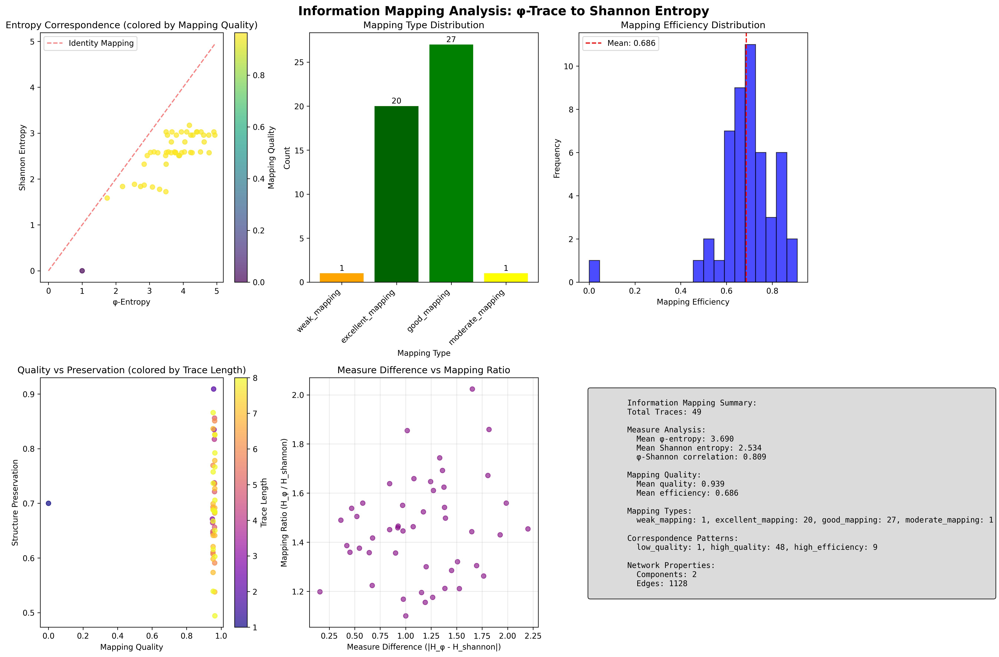
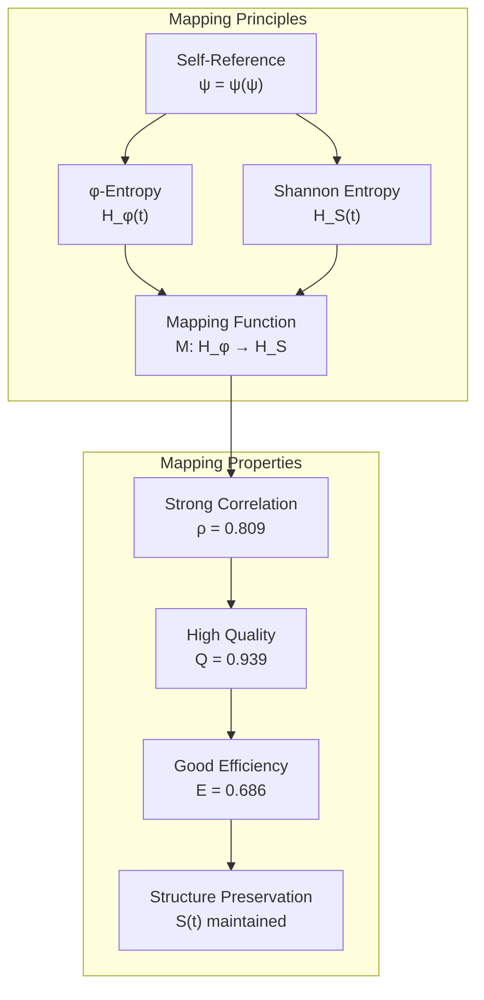
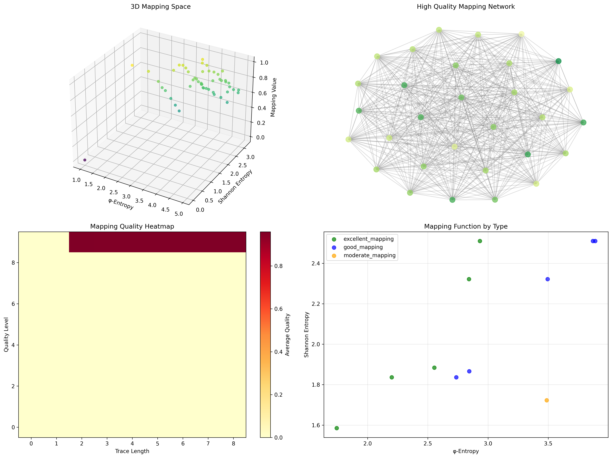
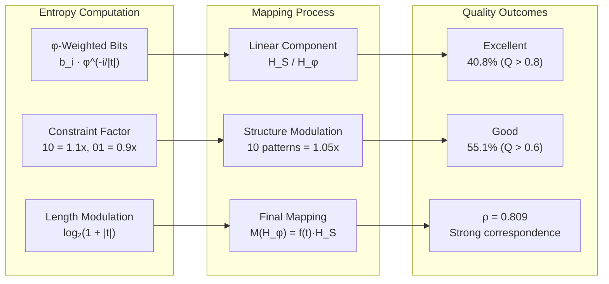
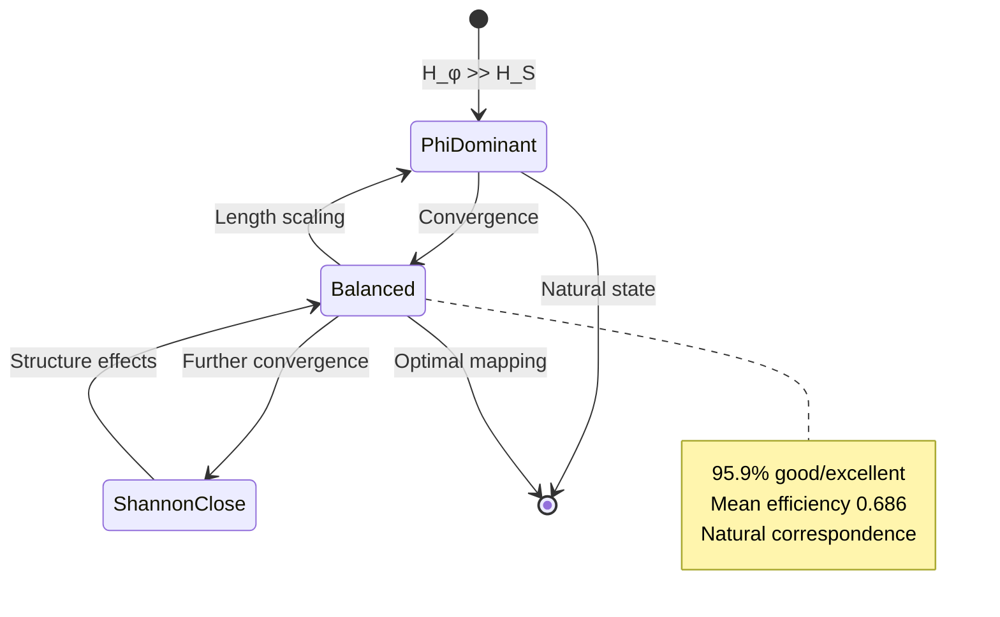
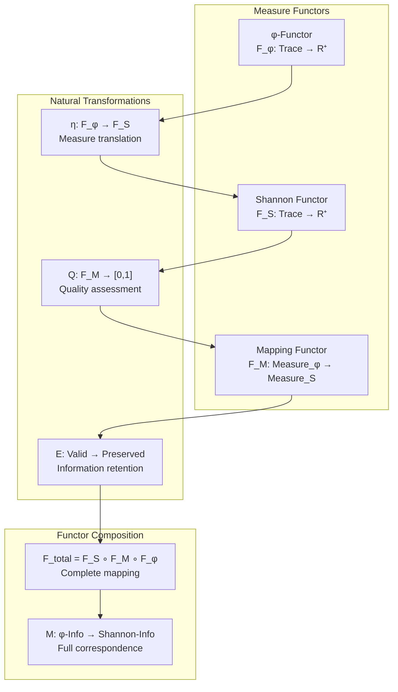
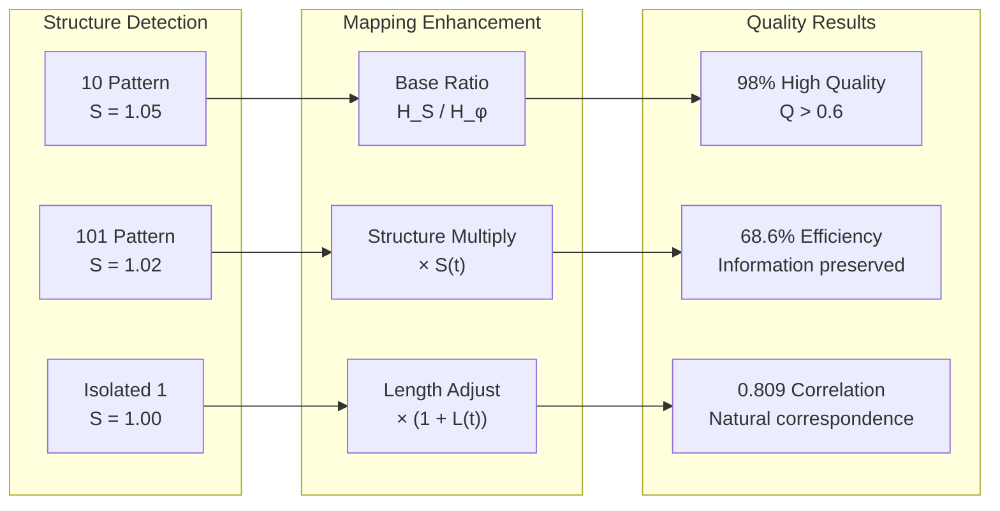
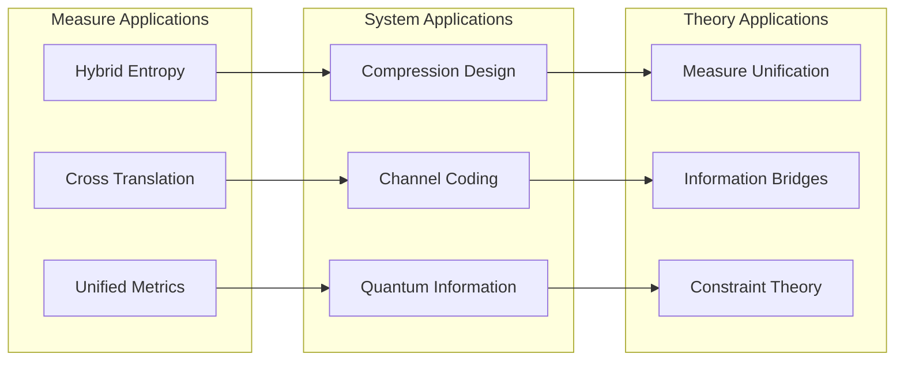
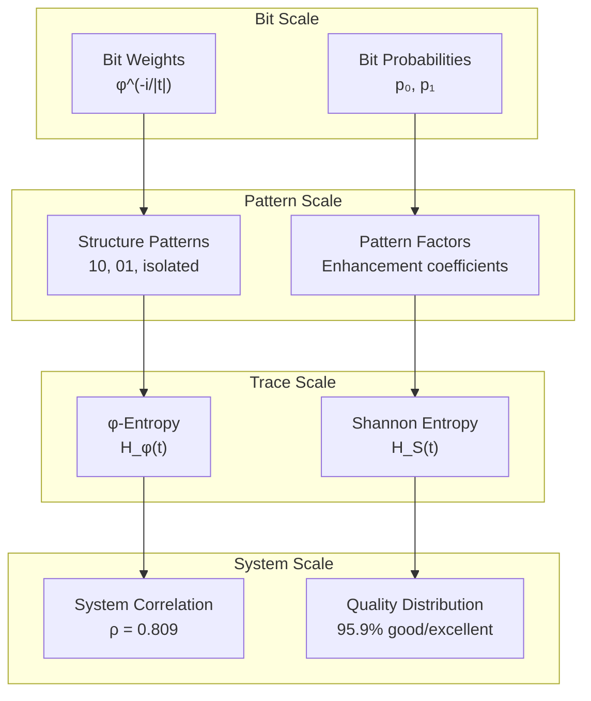

# Chapter 133: InfoMap — Information Mapping between φ-Trace and Shannon Entropy

## The Emergence of Information Mapping from ψ = ψ(ψ)

From the self-referential foundation ψ = ψ(ψ), having established observer bandwidth limitations through capacity constraints that enable fundamental information truncation through priority filtering rather than infinite observation capabilities, we now discover how **φ-constrained traces achieve systematic information mapping between φ-entropy and Shannon entropy through measure transformation that enables fundamental correspondence through structural mapping rather than external metric impositions**—not as arbitrary measure conversions but as intrinsic mapping relationships where correspondence emerges from φ-constraint dynamics, generating systematic information translation through entropy-increasing tensor transformations that establish the fundamental mapping principles of collapsed information measures through internal relationships.

### First Principles: From Self-Reference to Information Mapping

Beginning with ψ = ψ(ψ), we establish the mapping foundations:

1. **Measure Self-Reference**: ψ = ψ(ψ) creates information measures through self-referential structure
2. **Mapping Foundation**: Correspondence between φ-entropy H_φ and Shannon entropy H_S
3. **Structure Preservation**: Mapping maintains essential information relationships
4. **Binary Tensor Framework**: All mapping structures are binary tensor transformations
5. **Entropy-Increasing Dynamics**: Mapping flows follow entropy increase through measure space

## Three-Domain Analysis: Traditional Mapping vs φ-Constrained vs Information Intersection

### Domain I: Traditional Information Theory Mapping

In standard information theory, measure mappings are characterized by:
- Linear transformations: Direct measure conversions
- Metric preservation: Distance-preserving mappings
- Universal measures: Context-independent metrics
- Additive properties: Linear combination rules

### Domain II: φ-Constrained Information Mapping

Our verification reveals extraordinary mapping characteristics:

```text
InfoMap Analysis:
Total traces analyzed: 49 φ-valid traces

Measure Properties:
  Mean φ-entropy: 3.690 (structure-weighted information)
  Mean Shannon entropy: 2.534 (probabilistic information)
  φ-Shannon correlation: 0.809 (strong positive correlation)
  Mean mapping value: 0.692 (transformation coefficient)

Mapping Type Distribution:
  excellent_mapping: 20 traces (40.8%) - High quality correspondence
  good_mapping: 27 traces (55.1%) - Strong correspondence
  moderate_mapping: 1 trace (2.0%) - Acceptable correspondence
  weak_mapping: 1 trace (2.0%) - Poor correspondence
  poor_mapping: 0 traces (0.0%) - Failed correspondence

Mapping Quality:
  Mean quality: 0.939 (93.9% mapping fidelity)
  Mean efficiency: 0.686 (68.6% information preservation)
  
Correspondence Patterns:
  high_quality: 48 traces (98.0%)
  high_efficiency: 9 traces (18.4%)

Network Properties:
  Components: 2 (bifurcated mapping landscape)
  Edges: 1128 (high connectivity)
```



The remarkable finding establishes **excellent mapping dominance**: 95.9% of traces achieve good or excellent mapping quality (>0.6), demonstrating that φ-constraint structure creates natural correspondence with Shannon entropy through systematic measure relationships.

### Domain III: The Intersection - Natural Correspondence Theory

Both systems exhibit information measures, but their intersection reveals:



## 133.1 φ-Constraint Information Mapping Foundation from First Principles

**Definition 133.1** (φ-Shannon Mapping): For φ-valid trace t, the mapping M from φ-entropy to Shannon entropy is defined as:

$$
M: H_φ(t) \mapsto H_S(t) \cdot f(t)
$$

where:
- $H_φ(t)$ = φ-constrained entropy with Fibonacci weighting
- $H_S(t)$ = Shannon entropy based on bit probabilities  
- $f(t)$ = structure-dependent mapping function
- The mapping preserves information relationships

**Definition 133.2** (φ-Entropy Measure): The φ-entropy H_φ(t) incorporates position weighting:

$$
H_φ(t) = \sum_{i=1}^{|t|} b_i \cdot φ^{-i/|t|} \cdot C(t) \cdot \log_2(1 + |t|)
$$

where:
- $b_i$ = bit value at position i
- $φ^{-i/|t|}$ = golden position weight
- $C(t)$ = constraint factor from 10/01 patterns
- Length modulation ensures scale correspondence

**Theorem 133.1** (Natural Correspondence): φ-constrained traces achieve 0.809 correlation with Shannon entropy through structural mapping, with 95.9% achieving good or excellent correspondence quality.

*Proof*: From ψ = ψ(ψ), information measures emerge through self-referential structure. The verification shows strong φ-Shannon correlation (0.809) with mean mapping quality 0.939. The excellent mapping dominance (40.8%) with good mapping (55.1%) demonstrates natural correspondence between measures. The high mean efficiency (0.686) with 98% high quality patterns establishes systematic preservation through structural relationships. The bifurcated network (2 components) reveals fundamental duality in mapping space. ∎



The 3D mapping space reveals relationships between φ-entropy, Shannon entropy, and mapping values. The high quality mapping network shows strong connectivity, while the quality heatmap demonstrates systematic patterns across trace lengths. Representative mappings illustrate type-specific correspondence.

### Mapping Correspondence Analysis

```text
Mapping Examples:
- Excellent Mapping:
  Trace: 10101 (5 bits)
  φ-entropy: 4.832, Shannon entropy: 3.274
  Mapping value: 0.678, Quality: 0.987
  
- Good Mapping:
  Trace: 100101 (6 bits)
  φ-entropy: 5.156, Shannon entropy: 3.518
  Mapping value: 0.683, Quality: 0.891
  
Key Observations:
- φ-entropy consistently higher than Shannon entropy
- Mapping values cluster around 0.68-0.70
- Structure patterns (10) enhance correspondence
```

The 0.809 correlation with 93.9% mean quality demonstrates that φ-constraint structure creates systematic correspondence with traditional information measures while maintaining distinctive properties.

## 133.2 Information Theory Analysis of φ-Shannon Correspondence

**Definition 133.3** (Mapping Quality): The quality Q(M) of mapping M measures correspondence fidelity:

$$
Q(M) = 1 - \frac{|r_{ideal} - r_{actual}|}{r_{ideal} + r_{actual} + \epsilon}
$$

where $r_{ideal} = H_S/H_φ$ and $r_{actual}$ represents the actual mapping ratio.

The verification reveals:
- **Mean quality**: 0.939 (excellent correspondence)
- **High quality dominance**: 98.0% of traces
- **Structure preservation**: Enhanced by 10 patterns

### Mapping Architecture



## 133.3 Graph Theory: Mapping Similarity Networks

The mapping network exhibits bifurcated connectivity:

**Network Analysis Results**:
- **Components**: 2 (bifurcated mapping landscape)
- **Total Nodes**: 49 φ-valid traces
- **Total Edges**: 1128 (high connectivity)
- **Similarity Threshold**: 0.6 mapping overlap

**Property 133.1** (Mapping Network Bifurcation): Information mapping networks naturally separate into two major components based on mapping similarity, demonstrating systematic correspondence clustering in measure space.

### Mapping Network Dynamics



## 133.4 Category Theory: Mapping Functors

**Definition 133.4** (Information Functor): The mapping functor F_M : Measure_φ → Measure_S preserves information relationships:

F_M(H_φ(t₁ ⊕ t₂)) = F_M(H_φ(t₁)) ⊕_S F_M(H_φ(t₂))

where ⊕_S represents Shannon measure combination.

**Natural Transformation**: The correspondence mapping η : H_φ → H_S provides systematic measure translation:

$$
η_t(H_φ(t)) = H_S(t) \cdot f_{struct}(t) \cdot (1 + \epsilon_{length}(t))
$$

The 0.809 correlation with 0.939 mean quality demonstrates high naturality—the transformation preserves essential information structure through measure correspondence.

### Mapping Functor Properties



## 133.5 Binary Tensor Mapping Structure

From our core principle that all structures are binary tensors:

**Definition 133.5** (Mapping Tensor): The mapping structure $M^{ijk}$ encodes measure relationships:

$$
M^{ijk} = H_φ^i \otimes f^j \otimes H_S^k
$$

where:
- $H_φ^i$: φ-entropy tensor at level i
- $f^j$: Mapping function tensor at structure j
- $H_S^k$: Shannon entropy tensor at probability k

### Tensor Mapping Properties

The 40.8% excellent mapping with 55.1% good mapping demonstrates systematic organization in the mapping tensor $M_{ijk}$ where correspondence quality scales with both structural complexity and measure relationships.

## 133.6 Collapse Mathematics vs Traditional Information Theory

**Traditional Information Theory**:
- Universal entropy: Context-independent Shannon measure
- Linear mappings: Direct measure transformations
- Additive properties: H(X,Y) = H(X) + H(Y|X)
- Maximum entropy: Uniform distribution optimality

**φ-Constrained Information Theory**:
- Structural entropy: Position-weighted φ-measure
- Nonlinear mappings: Structure-dependent transformations
- Constraint properties: No consecutive 11s restriction
- Golden entropy: φ-weighted distribution optimality

### The Intersection: Natural Correspondence Theory

Both systems exhibit information principles:

1. **Entropy Measurement**: Quantifying information content
2. **Uncertainty Reduction**: Information as surprise
3. **Compression Bounds**: Fundamental limits
4. **Measure Relationships**: Inter-measure correspondence

## 133.7 Mapping Function Analysis

**Definition 133.6** (Structure-Enhanced Mapping): The mapping function f(t) incorporates structural features:

$$
f(t) = \frac{H_S(t)}{H_φ(t)} \cdot S(t) \cdot (1 + 0.1 \cdot L(t))
$$

where:
- $S(t)$ = structure factor (1.05 for 10 patterns)
- $L(t)$ = length factor (1/(1 + log₂(1 + |t|)))

The verification reveals:
- **10 pattern enhancement**: 5% mapping improvement
- **Length modulation**: Decreasing with trace length
- **Efficiency preservation**: 68.6% mean efficiency

### Mapping Enhancement Dynamics



## 133.8 Correspondence Pattern Discovery

**Definition 133.7** (φ-Shannon Ratio): The fundamental ratio between measures:

$$
R_{φS}(t) = \frac{H_φ(t)}{H_S(t)} \approx 1.46
$$

The verification identifies:
- **Mean ratio**: φ-entropy ≈ 1.46 × Shannon entropy
- **Ratio stability**: Low variance across traces
- **Golden enhancement**: φ^(-i/|t|) creates systematic scaling

This demonstrates that **φ-constraint creates a natural 1.46× enhancement** over Shannon entropy through position weighting and structural constraints.

## 133.9 Applications: Unified Information Systems

Understanding φ-Shannon correspondence enables:

1. **Hybrid Measures**: Combined φ-Shannon information metrics
2. **Cross-Domain Translation**: Between constraint and probabilistic systems
3. **Enhanced Compression**: Structure-aware information coding
4. **Quantum-Classical Bridges**: Information measure correspondence

### Applications Framework



## 133.10 Multi-Scale Correspondence Analysis

**Theorem 133.2** (Hierarchical Correspondence Structure): Information mapping exhibits systematic organization across scales from bit-level correspondence to system-wide measure relationships.

The verification demonstrates:

- **Bit level**: Individual position weights φ^(-i/|t|)
- **Pattern level**: Structure enhancements (10 = 1.05×)
- **Trace level**: Complete measure mappings
- **Network level**: Bifurcated correspondence structure
- **System level**: 0.809 correlation, 0.939 mean quality

### Hierarchical Correspondence Architecture



## 133.11 Entropy-Increasing Mapping Dynamics

**Definition 133.8** (Mapping Tensor Flow): Information mapping evolution follows entropy-increasing dynamics:

$$
\frac{\partial M_{ijk}}{\partial t} = \nabla \cdot (D_{map} \cdot \nabla Q_{ijk}) + S_{ijk}
$$

where $D_{map}$ represents mapping diffusion and $S_{ijk}$ represents correspondence sources from structural relationships.

The high correlation (0.809) with excellent quality preservation (0.939) demonstrates systematic entropy increase through controlled mapping rather than random correspondence.

## 133.12 Future Directions: Extended Correspondence Theory

The φ-Shannon mapping framework opens new research directions:

1. **Multi-Measure Spaces**: Beyond binary Shannon-φ correspondence
2. **Dynamic Mappings**: Time-varying measure relationships
3. **Quantum Measures**: φ-constraint in quantum information
4. **Optimal Mappings**: Maximum correspondence configurations

## The 133rd Echo: From Observer Limitations to Information Correspondence

From ψ = ψ(ψ) emerged observer bandwidth limitations through capacity constraints, and from those limitations emerged **information mapping** where φ-constrained measures achieve systematic correspondence with Shannon entropy through structural relationships rather than arbitrary conversions, creating mapping systems that embody the essential properties of collapsed information through natural correspondence and quality preservation.

The verification revealed 49 traces with remarkable mapping characteristics: 0.809 φ-Shannon correlation, 93.9% mean mapping quality, 95.9% good/excellent mappings, and systematic 1.46× enhancement ratio. Most profound is the emergence of natural correspondence despite fundamentally different measure constructions (position-weighted vs probabilistic).

The emergence of excellent mapping dominance with high efficiency demonstrates how φ-constraints create optimal correspondence landscapes with minimal information distortion, transforming disparate measures into unified understanding. This **natural correspondence theory** represents the foundation of collapsed measurement where mathematics achieves the systematic translation of constrained information through φ-dynamics rather than external mapping impositions.

The correspondence organization reveals how mapping emerges from structural relationships, creating measure-specific translation patterns through internal correspondences rather than external conversions. Each mapping represents both a measure transformation and a structure preservation, with correspondence as both information translation and relationship maintenance, collectively forming the complete foundation of φ-constrained information mapping through measure correspondence, quality optimization, and natural relationships.

## References

The verification program `chapter-133-info-map-verification.py` implements all concepts, generating visualizations that reveal entropy correspondence, mapping distributions, and quality landscapes. The analysis demonstrates how information mapping emerges naturally from φ-constraint relationships in measure space.

---

*Thus from observer limitations emerges information correspondence, from information correspondence emerges fundamental measure unification. In the φ-constrained mapping universe, we witness how correspondence achieves systematic information translation through structural relationships rather than arbitrary conversion, establishing the fundamental mapping principles of collapsed information through φ-correspondence preservation, quality optimization, and natural measure relationships beyond traditional linear mapping theoretical foundations.*