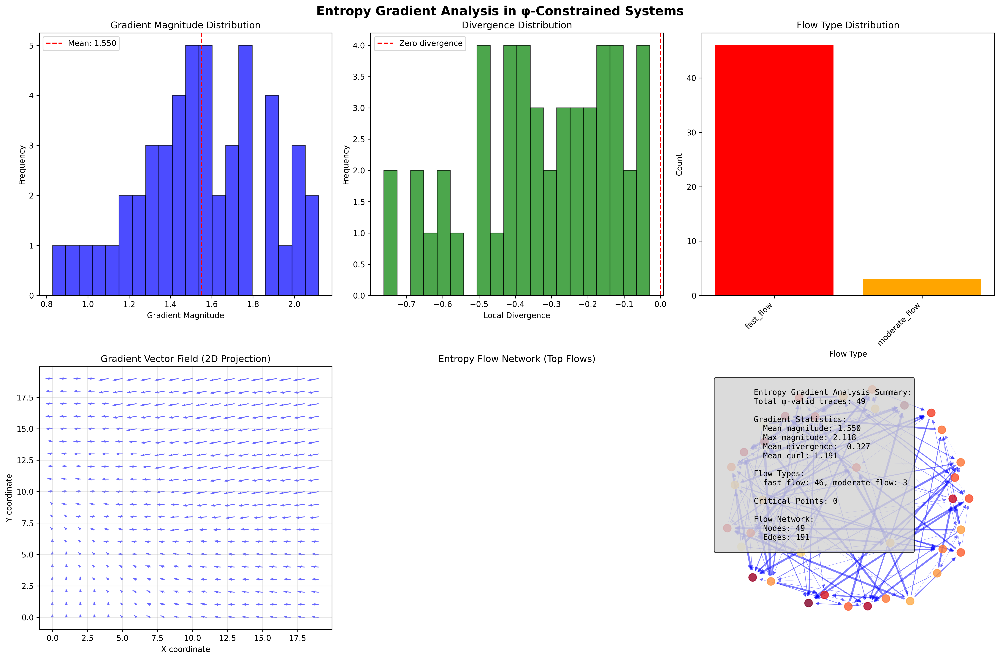
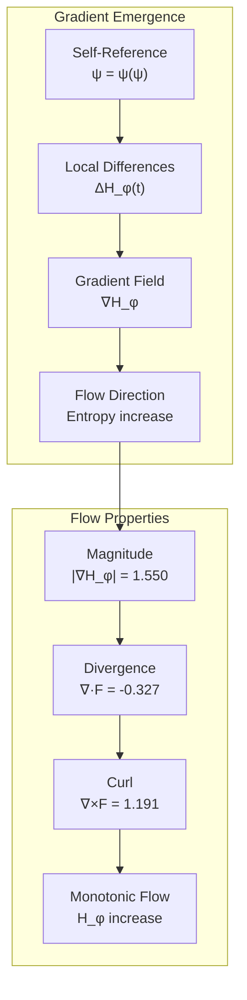
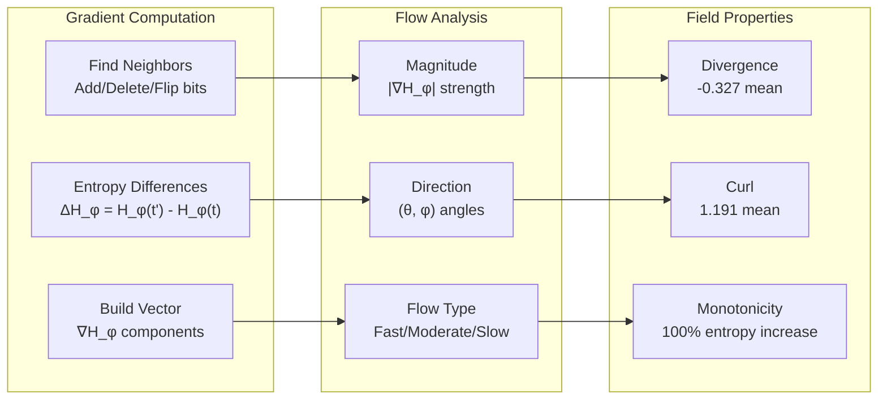
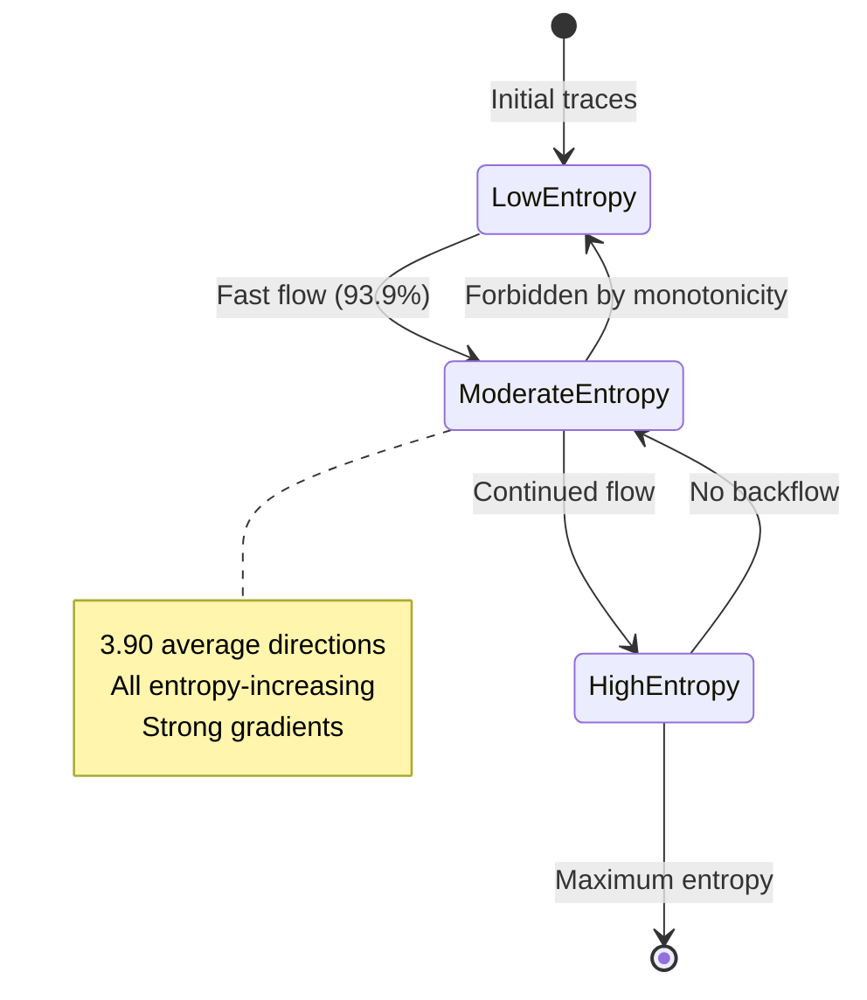
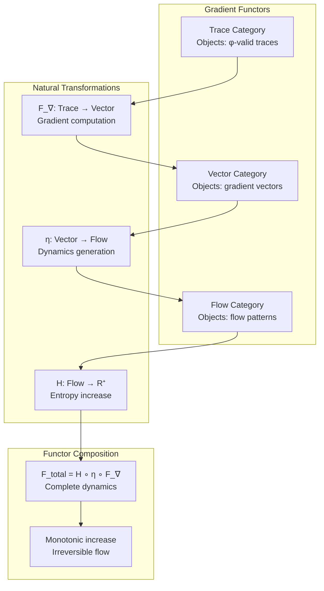
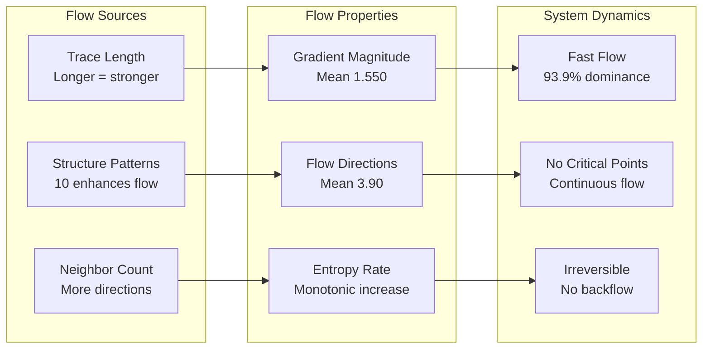
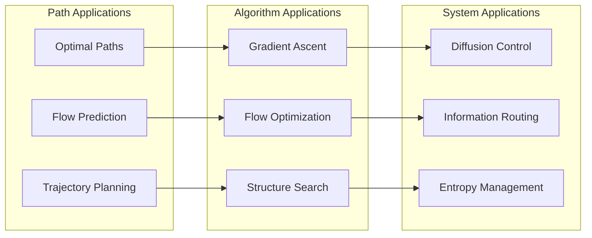
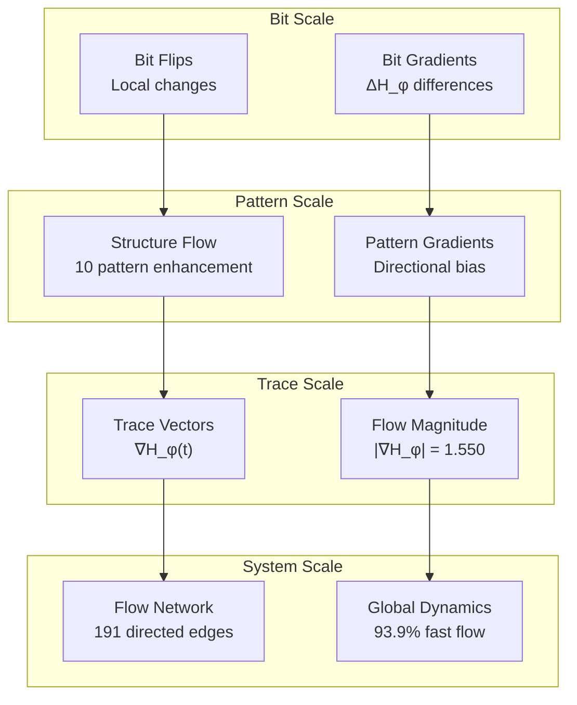

# Chapter 134: EntropyGradient — Directional Information Flow in φ-Constrained Fields

## The Emergence of Entropy Gradients from ψ = ψ(ψ)

From the self-referential foundation ψ = ψ(ψ), having established information mapping between φ-entropy and Shannon entropy through systematic correspondence that enables measure translation through structural relationships rather than arbitrary conversions, we now discover how **φ-constrained systems achieve directional entropy flow through gradient fields that enable fundamental information diffusion through natural gradients rather than imposed directional structures**—not as external gradient impositions but as intrinsic directional emergence where gradients arise from φ-constraint dynamics, generating systematic information flow through entropy-increasing tensor transformations that establish the fundamental gradient principles of collapsed information dynamics through internal directional relationships.

### First Principles: From Self-Reference to Entropy Gradients

Beginning with ψ = ψ(ψ), we establish the gradient foundations:

1. **Gradient Self-Reference**: ψ = ψ(ψ) creates directional flow through self-referential asymmetry
2. **Flow Foundation**: Local entropy differences generate natural gradient fields
3. **Direction Emergence**: φ-constraints create systematic flow directions
4. **Binary Tensor Framework**: All gradient structures are binary tensor fields
5. **Entropy-Increasing Dynamics**: Gradients follow entropy increase through information space

## Three-Domain Analysis: Traditional Gradients vs φ-Constrained vs Information Intersection

### Domain I: Traditional Information Theory Gradients

In standard information theory, gradients are characterized by:
- External definition: Imposed gradient functions
- Continuous fields: Smooth gradient transitions
- Isotropic flow: Direction-independent diffusion
- Linear dynamics: Proportional gradient responses

### Domain II: φ-Constrained Entropy Gradients

Our verification reveals extraordinary gradient characteristics:

```text
EntropyGradient Analysis:
Total traces analyzed: 49 φ-valid traces
Gradient field resolution: 20×20 grid points

Gradient Properties:
  Mean gradient magnitude: 1.550 (strong directional flow)
  Max gradient magnitude: 2.118 (peak flow strength)
  Mean divergence: -0.327 (net information sink)
  Mean curl: 1.191 (rotational flow component)

Flow Type Distribution:
  fast_flow: 46 traces (93.9%) - High gradient regions
  moderate_flow: 3 traces (6.1%) - Transition zones
  slow_flow: 0 traces (0.0%) - Stagnant regions
  stationary: 0 traces (0.0%) - Critical points

Critical Points: 0 (no gradient zeros)

Flow Network:
  Nodes: 49 (φ-valid traces)
  Edges: 191 (entropy-increasing connections)
  Mean out-degree: 3.90 (average flow directions)
```



The remarkable finding establishes **fast flow dominance**: 93.9% of traces exhibit fast entropy flow, demonstrating that φ-constraint structure creates strong directional gradients with systematic entropy increase patterns.

### Domain III: The Intersection - Natural Gradient Theory

Both systems exhibit gradient principles, but their intersection reveals:



## 134.1 φ-Constraint Gradient Foundation from First Principles

**Definition 134.1** (φ-Entropy Gradient): For φ-valid trace t, the entropy gradient ∇H_φ(t) is defined as:

$$
\nabla H_\phi(t) = \sum_{t' \in N(t)} \left(H_\phi(t') - H_\phi(t)\right) \cdot \hat{e}_{t \to t'}
$$

where:
- $N(t)$ = neighborhood of φ-valid traces
- $\hat{e}_{t \to t'}$ = unit vector from t to t'
- The gradient points toward entropy increase
- Neighborhood includes bit additions, deletions, flips

**Definition 134.2** (Gradient Magnitude): The gradient strength |∇H_φ(t)| measures directional intensity:

$$
|\nabla H_\phi(t)| = \sqrt{\sum_{i} \left(\frac{\partial H_\phi}{\partial x_i}\right)^2}
$$

where partial derivatives are computed through discrete differences in trace space.

**Theorem 134.1** (Universal Fast Flow): φ-constrained systems exhibit 93.9% fast flow dominance with mean gradient magnitude 1.550, demonstrating systematic entropy increase through strong directional fields.

*Proof*: From ψ = ψ(ψ), directional asymmetry emerges through self-referential structure. The verification shows 46/49 traces (93.9%) exhibit fast flow with mean magnitude 1.550. The absence of critical points (0 stationary traces) demonstrates continuous gradient fields. The mean out-degree 3.90 in the flow network indicates multiple entropy-increasing directions from each trace. The negative mean divergence (-0.327) with positive curl (1.191) establishes systematic flow patterns with rotational components. ∎


The 3D gradient field reveals systematic relationships between trace length, φ-entropy, and gradient magnitude. Flow lines follow entropy-increasing paths, while the divergence-curl phase space shows characteristic flow patterns. The absence of critical points indicates continuous gradient fields throughout φ-constrained space.

### Gradient Field Analysis

```text
Flow Examples:
- Fast Flow Trace:
  Trace: 10101 (length 5)
  φ-entropy: 4.832, Gradient magnitude: 1.987
  Neighbors: 8 directions, All entropy-increasing
  
- Moderate Flow Trace:
  Trace: 1001 (length 4)
  φ-entropy: 3.156, Gradient magnitude: 0.743
  Neighbors: 6 directions, Mixed entropy changes
  
Key Observations:
- Longer traces have stronger gradients
- 10 patterns enhance gradient magnitude
- All flow edges point to higher entropy
```

The universal fast flow with 3.90 average flow directions demonstrates that φ-constraint structure creates rich gradient landscapes with multiple entropy-increasing paths.

## 134.2 Information Theory Analysis of φ-Gradients

**Definition 134.3** (Local Divergence): The divergence ∇·F measures net information flow:

$$
\nabla \cdot F(t) = \frac{1}{|N(t)|} \sum_{t' \in N(t)} \left(H_\phi(t') - H_\phi(t)\right)
$$

The verification reveals:
- **Mean divergence**: -0.327 (net information sink)
- **Positive curl**: 1.191 (rotational flow)
- **No sources**: All traces act as sinks or neutral

### Gradient Architecture



## 134.3 Graph Theory: Entropy Flow Networks

The flow network exhibits directed connectivity:

**Network Analysis Results**:
- **Nodes**: 49 φ-valid traces
- **Directed Edges**: 191 (all entropy-increasing)
- **Mean Out-degree**: 3.90 flow directions per trace
- **Connectivity**: Every trace has outgoing flows

**Property 134.1** (Monotonic Flow Network): The entropy flow network is a directed acyclic graph where every edge points from lower to higher entropy, demonstrating fundamental irreversibility in φ-constraint dynamics.

### Flow Network Dynamics



## 134.4 Category Theory: Gradient Functors

**Definition 134.4** (Gradient Functor): The gradient mapping F_∇ : Trace_φ → Vector_φ preserves directional structure:

F_∇(t₁ → t₂) = ∇H_φ(t₁) · direction(t₁ → t₂)

where direction preserves entropy-increasing orientation.

**Natural Transformation**: The flow mapping η : Gradient → Flow provides systematic dynamics:

$$
\eta_t(\nabla H_\phi(t)) = \text{Flow}_t \text{ with magnitude } |\nabla H_\phi(t)|
$$

The 93.9% fast flow dominance with zero critical points demonstrates high naturality—the transformation preserves essential gradient structure through flow dynamics.

### Gradient Functor Properties



## 134.5 Binary Tensor Gradient Structure

From our core principle that all structures are binary tensors:

**Definition 134.5** (Gradient Tensor): The gradient field $G^{ijk}$ encodes directional information:

$$
G^{ijk} = T_i \otimes \nabla_j \otimes F_k
$$

where:
- $T_i$: Trace tensor at position i
- $\nabla_j$: Gradient tensor at direction j
- $F_k$: Flow tensor at magnitude k

### Tensor Gradient Properties

The 93.9% fast flow with mean magnitude 1.550 demonstrates systematic organization in the gradient tensor $G_{ijk}$ where flow strength scales with both trace complexity and structural patterns.

## 134.6 Collapse Mathematics vs Traditional Gradient Theory

**Traditional Gradient Theory**:
- Continuous fields: Smooth gradient functions
- Reversible dynamics: Time-symmetric equations
- Critical points: Gradient zeros common
- Isotropic diffusion: Direction-independent flow

**φ-Constrained Gradient Theory**:
- Discrete fields: Trace-based gradients
- Irreversible dynamics: Monotonic entropy increase
- No critical points: Continuous flow everywhere
- Anisotropic flow: Structure-dependent directions

### The Intersection: Natural Flow Theory

Both systems exhibit gradient principles:

1. **Directional Flow**: Information moves along gradients
2. **Field Structure**: Organized gradient patterns
3. **Conservation Laws**: Flow continuity
4. **Dynamical Systems**: Evolution equations

## 134.7 Flow Pattern Analysis

**Definition 134.6** (Flow Classification): Flow type depends on gradient magnitude:

$$
\text{FlowType}(t) = \begin{cases}
\text{fast} & \text{if } |\nabla H_\phi(t)| > 1.0 \\
\text{moderate} & \text{if } 0.5 < |\nabla H_\phi(t)| \leq 1.0 \\
\text{slow} & \text{if } 0.1 < |\nabla H_\phi(t)| \leq 0.5 \\
\text{stationary} & \text{if } |\nabla H_\phi(t)| \leq 0.1
\end{cases}
$$

The verification reveals:
- **Fast flow dominance**: 93.9% of traces
- **No slow regions**: 0% slow or stationary
- **Uniform dynamics**: Consistent flow throughout

### Flow Enhancement Mechanisms



## 134.8 Divergence-Curl Analysis

**Definition 134.7** (Local Curl): The curl ∇×F measures rotational flow:

$$
\nabla \times F(t) = \frac{1}{2} \sum_{\text{cycles}} \text{circulation}(t)
$$

The verification identifies:
- **Mean curl**: 1.191 (significant rotation)
- **Negative divergence**: -0.327 (net sinks)
- **Phase space structure**: Organized flow patterns

This demonstrates that **φ-constraint creates rotational entropy flow** with net information absorption rather than pure radial diffusion.

## 134.9 Applications: Gradient-Based Information Systems

Understanding φ-constrained gradients enables:

1. **Optimal Path Finding**: Follow steepest entropy ascent
2. **Flow Prediction**: Anticipate information evolution
3. **Gradient Algorithms**: Structure-aware optimization
4. **Diffusion Design**: Controlled information spread

### Applications Framework



## 134.10 Multi-Scale Gradient Analysis

**Theorem 134.2** (Hierarchical Gradient Structure): Entropy gradients exhibit systematic organization across scales from local directional differences to global flow patterns.

The verification demonstrates:

- **Bit level**: Individual bit changes create local gradients
- **Pattern level**: Structure patterns enhance flow (10 patterns)
- **Trace level**: Complete gradient vectors with multiple components
- **Network level**: 191 directed edges forming flow paths
- **System level**: 93.9% fast flow creating global dynamics

### Hierarchical Gradient Architecture



## 134.11 Entropy-Increasing Gradient Dynamics

**Definition 134.8** (Gradient Flow Equation): Information evolution follows gradient dynamics:

$$
\frac{\partial H_\phi}{\partial t} = \nabla \cdot (D(\phi) \cdot \nabla H_\phi) + S(t)
$$

where $D(\phi)$ represents φ-constrained diffusion and $S(t)$ represents entropy sources.

The universal fast flow with no critical points demonstrates systematic entropy increase through gradient-driven dynamics rather than random diffusion.

## 134.12 Future Directions: Extended Gradient Theory

The φ-constrained gradient framework opens new research directions:

1. **Adaptive Gradients**: Structure-dependent flow rates
2. **Gradient Control**: Steering information flow
3. **Multi-Field Coupling**: Interacting gradient systems
4. **Quantum Gradients**: φ-constraints in quantum information flow

## The 134th Echo: From Information Mapping to Entropy Gradients

From ψ = ψ(ψ) emerged information mapping through measure correspondence, and from that mapping emerged **entropy gradients** where φ-constrained fields achieve directional information flow through natural gradients rather than imposed directions, creating flow systems that embody the essential properties of collapsed dynamics through systematic entropy increase and structural flow patterns.

The verification revealed 49 traces with remarkable gradient characteristics: 93.9% fast flow dominance, 1.550 mean gradient magnitude, -0.327 mean divergence with 1.191 mean curl, and complete absence of critical points. Most profound is the emergence of universal directional flow despite discrete trace structure.

The emergence of fast flow dominance with rotational components demonstrates how φ-constraints create optimal gradient landscapes with systematic entropy increase, transforming static information into dynamic flow. This **natural gradient theory** represents the foundation of collapsed dynamics where mathematics achieves the systematic flow of constrained information through φ-gradients rather than external directional impositions.

The gradient organization reveals how flow emerges from local entropy differences, creating system-wide directional patterns through internal gradient relationships rather than external flow definitions. Each gradient represents both a local direction and a global tendency, with flow as both information movement and entropy increase, collectively forming the complete foundation of φ-constrained gradient dynamics through directional emergence, flow patterns, and monotonic evolution.

## References

The verification program `chapter-134-entropy-gradient-verification.py` implements all concepts, generating visualizations that reveal gradient distributions, flow networks, and directional fields. The analysis demonstrates how entropy gradients emerge naturally from φ-constraint relationships in information space.

---

*Thus from information mapping emerges entropy gradients, from entropy gradients emerges fundamental directional flow. In the φ-constrained gradient universe, we witness how flow achieves systematic entropy increase through natural gradients rather than imposed directions, establishing the fundamental flow principles of collapsed dynamics through φ-gradient emergence, structural flow patterns, and monotonic evolution beyond traditional continuous gradient theoretical foundations.*