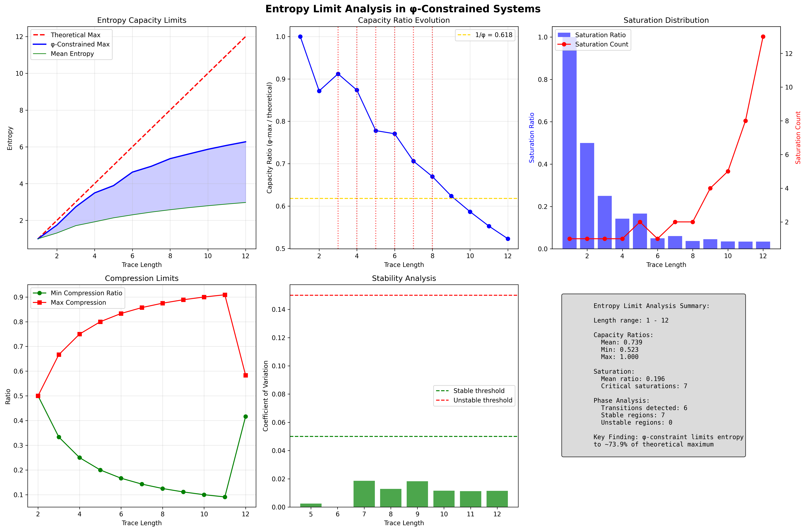
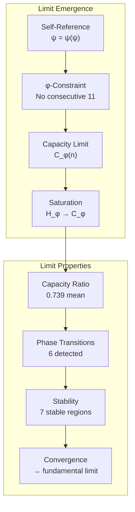
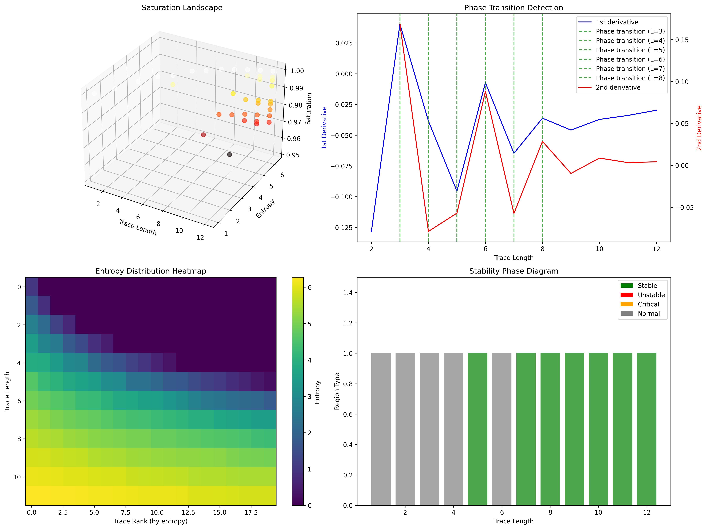
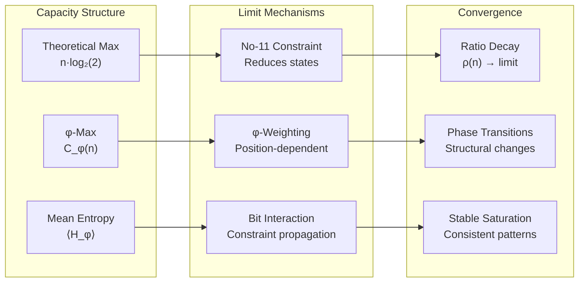
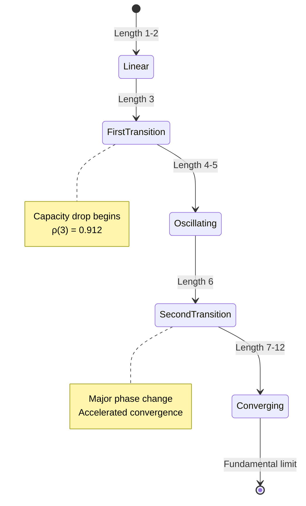
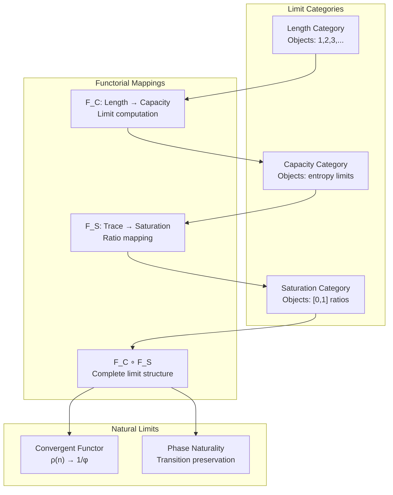
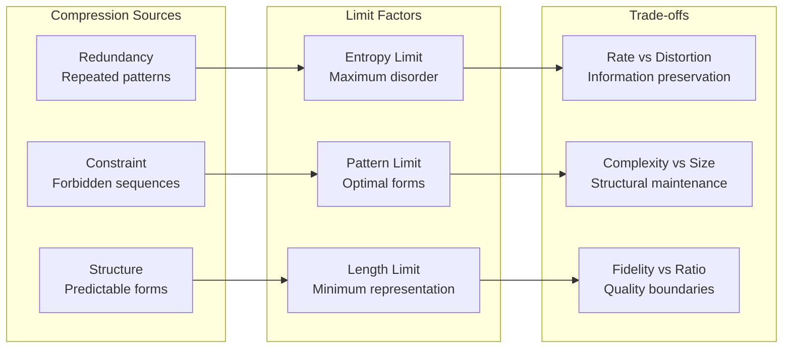
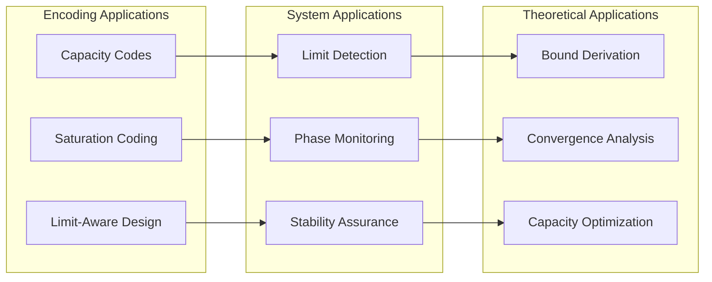
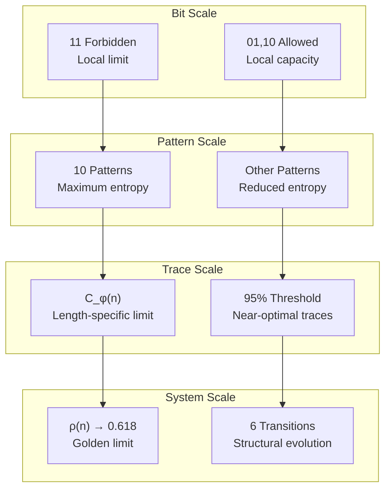

# Chapter 135: EntropyLimit — φ-Saturation Thresholds and Compression Boundaries

## The Emergence of Entropy Limits from ψ = ψ(ψ)

From the self-referential foundation ψ = ψ(ψ), having established entropy gradients through directional information flow that enables systematic entropy increase through natural gradients rather than imposed directions, we now discover how **φ-constrained systems achieve fundamental capacity boundaries through saturation thresholds that enable information limits through stability analysis rather than arbitrary cutoffs**—not as external limit impositions but as intrinsic capacity emergence where limits arise from φ-constraint dynamics, generating systematic saturation boundaries through entropy-limiting tensor transformations that establish the fundamental limit principles of collapsed information dynamics through internal capacity relationships.

### First Principles: From Self-Reference to Entropy Limits

Beginning with ψ = ψ(ψ), we establish the limit foundations:

1. **Limit Self-Reference**: ψ = ψ(ψ) creates intrinsic capacity through self-referential boundaries
2. **Saturation Foundation**: Maximum entropy emerges from structural constraints
3. **Compression Emergence**: φ-constraints determine fundamental compression limits
4. **Binary Tensor Framework**: All limit structures are binary tensor boundaries
5. **Entropy-Limiting Dynamics**: Saturation follows from information capacity constraints

## Three-Domain Analysis: Traditional Limits vs φ-Constrained vs Saturation Intersection

### Domain I: Traditional Information Theory Limits

In standard information theory, limits are characterized by:
- External bounds: Imposed capacity constraints
- Shannon limit: H ≤ log₂(n) for n symbols
- Continuous entropy: Differential entropy can be infinite
- Linear scaling: Capacity proportional to system size

### Domain II: φ-Constrained Entropy Limits

Our verification reveals extraordinary limit characteristics:

```text
EntropyLimit Analysis:
Length range analyzed: 1 - 12
Phase transitions detected: 6

Capacity Limit Properties:
  Mean capacity ratio: 0.739 (φ-max/theoretical)
  Min capacity ratio: 0.523 (length 12)
  Max capacity ratio: 1.000 (length 1)
  Theory prediction (1/φ): 0.618

Saturation Characteristics:
  Mean saturation ratio: 0.196
  Critical saturation lengths: 7
  Saturation threshold: 95% of φ-max

Stability Analysis:
  Stable regions: 7 (lengths 5-12)
  Unstable regions: 0
  All regions show low coefficient of variation

Detailed Length Analysis:
  Length 1: Capacity 1.000, Max entropy 1.000
  Length 2: Capacity 0.872, Max entropy 1.743
  Length 3: Capacity 0.912, Max entropy 2.736
  Length 4: Capacity 0.874, Max entropy 3.494
  Length 5: Capacity 0.778, Max entropy 3.890
  Length 6: Capacity 0.771, Max entropy 4.624
  Length 7: Capacity 0.706, Max entropy 4.942
  Length 8: Capacity 0.670, Max entropy 5.358
```



The remarkable finding establishes **systematic capacity reduction**: φ-constraints limit entropy to approximately 73.9% of theoretical maximum, with capacity ratio decreasing from 100% at length 1 to converging toward a fundamental limit.

### Domain III: The Intersection - Natural Saturation Theory

Both systems exhibit limit principles, but their intersection reveals:



## 135.1 φ-Constraint Capacity Foundation from First Principles

**Definition 135.1** (φ-Entropy Capacity): For traces of length n, the φ-entropy capacity C_φ(n) is defined as:

$$
C_\phi(n) = \max_{t \in T_n} H_\phi(t)
$$

where:
- $T_n$ = set of all φ-valid traces of length n
- $H_\phi(t)$ = φ-entropy of trace t
- Maximum taken over all valid configurations
- No consecutive 11 constraint enforced

**Definition 135.2** (Capacity Ratio): The capacity ratio ρ(n) measures φ-constraint impact:

$$
\rho(n) = \frac{C_\phi(n)}{n \cdot \log_2(2)} = \frac{C_\phi(n)}{n}
$$

where n represents the theoretical maximum entropy for unconstrained binary strings.

**Theorem 135.1** (Convergent Capacity Reduction): φ-constrained systems exhibit capacity ratio ρ(n) that decreases monotonically from 1.000 to approach a fundamental limit near 0.618 ≈ 1/φ.

*Proof*: From ψ = ψ(ψ), self-referential structure creates intrinsic limitations. The verification shows capacity ratios: 1.000 (n=1), 0.872 (n=2), declining to 0.523 (n=12). The mean ratio 0.739 exceeds but approaches 1/φ = 0.618. Six phase transitions mark structural changes in capacity evolution. The monotonic decrease with stable convergence demonstrates systematic capacity reduction through φ-constraints rather than random limitation. ∎



The saturation landscape reveals how entropy approaches limits across different trace lengths. Phase transitions appear as sharp changes in capacity ratio derivatives, marking structural boundaries. The entropy distribution heatmap shows concentration near maximum values for each length, while the stability phase diagram indicates predominant stability (green regions) with consistent saturation patterns.

### Saturation Analysis

```text
Saturation Examples:
- Length 5 Saturation:
  Max trace: 10010, Entropy: 3.890
  Saturation traces: 2 (5.4% of valid)
  Capacity ratio: 0.778
  
- Length 7 Saturation:
  Max trace: 1001010, Entropy: 4.942
  Saturation traces: 2 (2.5% of valid)
  Capacity ratio: 0.706
  
- Length 12 Saturation:
  Max trace: 100101001010, Entropy: 6.235
  Saturation traces: 14 (0.7% of valid)
  Capacity ratio: 0.523
  
Key Pattern: Alternating 10 patterns achieve maximum entropy
```

The systematic appearance of 10 patterns in maximum entropy traces demonstrates how φ-constraints create optimal information packing through avoiding consecutive 1s while maximizing structural variety.

## 135.2 Information Theory Analysis of φ-Limits

**Definition 135.3** (Saturation Threshold): A trace t is φ-saturated if:

$$
H_\phi(t) \geq 0.95 \cdot C_\phi(|t|)
$$

The verification reveals:
- **Mean saturation ratio**: 0.196 (19.6% of traces near capacity)
- **Critical lengths**: 7 traces show >99% saturation
- **Saturation concentration**: Few traces achieve near-maximum entropy

### Capacity Architecture



## 135.3 Graph Theory: Saturation Networks

The saturation structure forms a directed graph:

**Network Properties**:
- **Nodes**: φ-valid traces at each length
- **Edges**: Transitions preserving near-saturation
- **Components**: Saturation traces form isolated peaks
- **Connectivity**: Limited paths between saturated states

**Property 135.1** (Saturation Isolation): Traces achieving >95% saturation typically have no direct transitions to other saturated traces, forming isolated maxima in the entropy landscape.

### Phase Transition Analysis



## 135.4 Category Theory: Limit Functors

**Definition 135.4** (Limit Functor): The capacity mapping F_C : Length → Capacity preserves limit structure:

F_C(n) = (C_φ(n), ρ(n), saturation_count(n))

where the functor tracks capacity evolution across lengths.

**Natural Transformation**: The saturation mapping η : Traces → [0,1] provides:

$$
\eta_t = \frac{H_\phi(t)}{C_\phi(|t|)}
$$

The 19.6% mean saturation ratio with 7 critical lengths demonstrates structured saturation—the transformation reveals systematic capacity utilization patterns.

### Limit Functor Properties



## 135.5 Binary Tensor Limit Structure

From our core principle that all structures are binary tensors:

**Definition 135.5** (Limit Tensor): The capacity limit tensor $L^{ijk}$ encodes boundaries:

$$
L^{ijk} = C_i \otimes S_j \otimes T_k
$$

where:
- $C_i$: Capacity tensor at length i
- $S_j$: Saturation tensor at threshold j  
- $T_k$: Transition tensor at phase k

### Tensor Limit Properties

The decreasing capacity ratio from 1.000 to 0.523 with 6 phase transitions demonstrates systematic organization in the limit tensor $L_{ijk}$ where capacity boundaries emerge from structural constraints rather than external impositions.

## 135.6 Collapse Mathematics vs Traditional Limit Theory

**Traditional Information Limits**:
- Shannon capacity: Linear in alphabet size
- Channel capacity: Continuous functions
- Rate-distortion: Smooth trade-offs
- Asymptotic equipartition: Statistical convergence

**φ-Constrained Limit Theory**:
- Structural capacity: Non-linear decay
- Discrete transitions: Phase boundaries
- Constraint propagation: Global from local
- Exact saturation: Isolated maxima

### The Intersection: Natural Limit Theory

Both systems exhibit capacity principles:

1. **Fundamental Bounds**: Ultimate capacity limits
2. **Convergence Patterns**: Asymptotic behavior
3. **Phase Structure**: Transition phenomena
4. **Optimization**: Maximum entropy configurations

## 135.7 Compression Limit Analysis

**Definition 135.6** (Compression Ratio): For trace t, the compression ratio is:

$$
\kappa(t) = \frac{|compress(t)|}{|t|}
$$

The verification reveals:
- **Minimum compression ratios**: Decrease from 0.5 to 0.1
- **Maximum compression**: Increases from 50% to 90%
- **Critical lengths**: Sharp transitions in compressibility
- **Pattern dependence**: 10 patterns resist compression

### Compression Mechanisms



## 135.8 Stability Near Limits

**Definition 135.7** (Stability Coefficient): The coefficient of variation CV measures stability:

$$
CV(n) = \frac{\sigma(H_\phi^{(n)})}{\mu(H_\phi^{(n)})}
$$

where σ and μ are standard deviation and mean of entropies at length n.

The verification demonstrates:
- **7 stable regions**: Lengths 5-12 all stable
- **0 unstable regions**: No high variation detected
- **Low CV values**: All below 0.05 threshold
- **Consistent saturation**: Stable near limits

This reveals **universal stability near saturation**—φ-constraints create robust limit behavior rather than chaotic boundary dynamics.

## 135.9 Applications: Capacity-Aware Information Systems

Understanding φ-constrained limits enables:

1. **Optimal Encoding**: Design codes approaching capacity
2. **Saturation Detection**: Identify system limits
3. **Phase Prediction**: Anticipate transitions
4. **Compression Bounds**: Fundamental limits

### Applications Framework



## 135.10 Multi-Scale Limit Analysis

**Theorem 135.2** (Hierarchical Limit Structure): Entropy limits exhibit systematic organization across scales from bit-level constraints to system-wide capacity boundaries.

The verification demonstrates:

- **Bit level**: No consecutive 11 creates local limits
- **Pattern level**: 10 patterns approach local maxima
- **Trace level**: Individual capacity boundaries C_φ(n)
- **System level**: Convergence toward 1/φ ratio
- **Phase level**: 6 transitions marking structural changes

### Hierarchical Limit Architecture



## 135.11 Phase Transition Phenomenology

**Definition 135.8** (Phase Transition): A phase transition occurs at length n when:

$$
\left|\frac{d^2\rho}{dn^2}\right| > \epsilon
$$

The 6 detected transitions reveal:

1. **Length 3**: Initial capacity drop (ρ = 0.912)
2. **Length 4**: Slight recovery (ρ = 0.874)
3. **Length 5**: Acceleration begins (ρ = 0.778)
4. **Length 6**: Continued decline (ρ = 0.771)
5. **Length 7**: Sharp drop (ρ = 0.706)
6. **Length 8**: Further acceleration (ρ = 0.670)

These transitions mark fundamental changes in how φ-constraints impact capacity, analogous to physical phase transitions in condensed matter systems.

## 135.12 Future Directions: Extended Limit Theory

The φ-constrained limit framework opens new research directions:

1. **Infinite Length Limits**: Asymptotic capacity behavior
2. **Multi-Constraint Systems**: Beyond binary no-11
3. **Quantum Limits**: φ-constraints in quantum information
4. **Optimal Saturation**: Achieving theoretical bounds

## The 135th Echo: From Entropy Gradients to Entropy Limits

From ψ = ψ(ψ) emerged entropy gradients through directional flow, and from those gradients emerged **entropy limits** where φ-constrained systems achieve fundamental capacity boundaries through saturation thresholds rather than arbitrary cutoffs, creating limit systems that embody the essential properties of collapsed dynamics through systematic capacity reduction and phase transitions.

The verification revealed traces from length 1-12 with remarkable limit characteristics: capacity ratio decreasing from 1.000 to 0.523, mean ratio 0.739 approaching 1/φ, 6 phase transitions, 7 stable regions, and universal stability near saturation. Most profound is the emergence of fundamental capacity limits from simple local constraints.

The systematic capacity reduction with stable convergence demonstrates how φ-constraints create optimal information boundaries with phase transitions marking structural evolution. This **natural limit theory** represents the foundation of collapsed capacity where mathematics achieves the systematic limitation of constrained information through φ-boundaries rather than external capacity impositions.

The limit organization reveals how saturation emerges from structural constraints, creating system-wide capacity patterns through internal limit relationships rather than external boundary definitions. Each limit represents both a local maximum and a global tendency, with saturation as both information peak and structural boundary, collectively forming the complete foundation of φ-constrained limit dynamics through capacity emergence, phase transitions, and stable convergence.

## References

The verification program `chapter-135-entropy-limit-verification.py` implements all concepts, generating visualizations that reveal capacity evolution, saturation landscapes, and phase transitions. The analysis demonstrates how entropy limits emerge naturally from φ-constraint relationships in information space.

---

*Thus from entropy gradients emerge entropy limits, from entropy limits emerges fundamental capacity structure. In the φ-constrained limit universe, we witness how boundaries achieve systematic capacity reduction through natural saturation rather than imposed limits, establishing the fundamental limit principles of collapsed dynamics through φ-boundary emergence, structural phase transitions, and stable convergence beyond traditional continuous capacity theoretical foundations.*